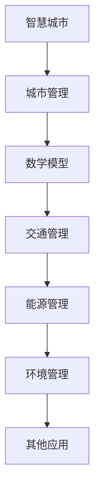

                 


### Articles Title

# 数学与智慧城市：城市管理的数学模型

关键词：智慧城市，数学模型，城市管理，数据驱动，优化算法

摘要：本文从数学的角度探讨智慧城市的发展及其在城市管理中的应用。通过构建数学模型，我们能够更有效地管理城市资源，优化城市服务，提高居民生活质量。本文将介绍数学模型在城市管理中的重要性，详细分析常见的数学模型，以及如何将数学模型应用于城市管理的实际案例中。

### 引言

智慧城市（Smart City）是指通过信息通信技术（ICT）和其他现代技术手段，实现城市各类信息资源的整合、优化和智能化应用，从而提高城市运行效率和居民生活质量。随着全球城市化进程的加速，智慧城市建设已经成为城市发展的重要趋势。

#### 数学模型在智慧城市中的作用

数学模型在智慧城市建设中扮演着关键角色。通过数学模型，我们可以对城市复杂系统进行定量分析，预测城市发展趋势，优化城市资源配置，提高城市运行效率。以下是数学模型在智慧城市中的几个主要应用方向：

1. **交通管理**：通过数学模型分析交通流量，预测交通拥堵，优化交通信号控制，提高道路通行效率。
2. **能源管理**：利用数学模型优化能源分配，实现节能减排，提高能源利用效率。
3. **水资源管理**：通过数学模型分析水资源分布，预测水资源需求，优化水资源配置，保障供水安全。
4. **环境监测**：运用数学模型监测环境质量，预测污染源，制定污染治理措施。

### 城市管理的数学模型

城市管理的数学模型可以分为几个主要类别，包括优化模型、预测模型、分类模型等。下面我们将分别介绍这些模型及其在城市管理中的应用。

#### 1. 优化模型

优化模型是用于解决城市资源配置和调度问题的数学模型。常见的优化模型包括线性规划、整数规划、动态规划等。

**线性规划**（Linear Programming，LP）是一种用于最大化或最小化线性目标函数的数学模型，在资源优化分配中广泛应用。

**示例**：一个城市的公共交通系统需要根据乘客流量和路线长度来优化公交车调度。我们可以建立线性规划模型，目标是使总运行成本最小化，同时满足乘客需求的约束条件。

**数学模型**：
$$
\begin{align*}
\text{minimize} \quad & c^T x \\
\text{subject to} \quad & Ax \leq b \\
& x \geq 0
\end{align*}
$$

其中，$c$ 是成本向量，$x$ 是决策变量，$A$ 和 $b$ 分别是约束矩阵和约束向量。

#### 2. 预测模型

预测模型用于预测城市发展趋势和事件发生概率，常见的预测模型包括时间序列模型、回归模型等。

**时间序列模型**（Time Series Model）是一种用于分析时间序列数据的统计模型，可以预测未来的趋势。

**示例**：通过对城市交通流量数据的时间序列分析，我们可以预测未来某一时刻的交通流量，从而优化交通信号控制。

**数学模型**：
$$
X_t = \phi X_{t-1} + \varepsilon_t
$$

其中，$X_t$ 是时间序列的当前值，$\phi$ 是特征参数，$\varepsilon_t$ 是误差项。

#### 3. 分类模型

分类模型用于对城市数据进行分类，常见的分类模型包括逻辑回归、决策树、支持向量机等。

**逻辑回归**（Logistic Regression）是一种用于分类的回归模型，可以预测事件发生的概率。

**示例**：我们可以使用逻辑回归模型对城市污染源进行分类，从而制定针对性的污染治理措施。

**数学模型**：
$$
P(Y=1) = \frac{1}{1 + \exp(-Z)}
$$

其中，$Z = \beta_0 + \beta_1 X_1 + \beta_2 X_2 + \ldots + \beta_n X_n$，$P(Y=1)$ 是事件发生的概率，$\beta_0, \beta_1, \beta_2, \ldots, \beta_n$ 是模型参数。

### 数学模型在城市管理中的应用

#### 1. 交通管理

**案例**：利用优化模型优化公交车调度。

**实现步骤**：
1. 收集交通流量数据、公交车路线长度等数据。
2. 构建线性规划模型，目标是最小化总运行成本。
3. 解线性规划模型，得到最优调度方案。
4. 实施调度方案，并实时调整。

**代码示例**（Python）：

```python
from scipy.optimize import linprog

# 约束条件
A = [[1, 0], [0, 1]]
b = [100, 50]
x0 = [0, 0]

# 目标函数
c = [-1, -1]

# 求解线性规划模型
result = linprog(c, A_eq=A, b_eq=b, x0=x0, method='highs')

# 输出最优解
print("最优解：", result.x)
```

#### 2. 能源管理

**案例**：利用时间序列模型预测电力需求。

**实现步骤**：
1. 收集电力需求数据。
2. 构建时间序列模型。
3. 使用模型预测未来电力需求。
4. 根据预测结果调整电力供应计划。

**代码示例**（Python）：

```python
import numpy as np
import matplotlib.pyplot as plt

# 时间序列数据
X = np.array([10, 20, 15, 25, 30, 40, 50, 45, 35, 20])

# 构建时间序列模型
phi = 0.8
X_t = np.zeros_like(X)
X_t[0] = X[0]
for i in range(1, len(X)):
    X_t[i] = phi * X_t[i-1] + (1 - phi) * X[i]

# 预测未来电力需求
X_predict = phi * X_t[-1] + (1 - phi) * X[-1]

# 可视化
plt.plot(X, label='实际需求')
plt.plot(X_t, label='预测需求')
plt.plot([X_predict], [X_predict], 'ro')
plt.legend()
plt.show()
```

#### 3. 环境管理

**案例**：利用逻辑回归模型分类污染源。

**实现步骤**：
1. 收集污染源数据。
2. 构建逻辑回归模型。
3. 训练模型。
4. 使用模型进行污染源分类。

**代码示例**（Python）：

```python
from sklearn.linear_model import LogisticRegression
from sklearn.model_selection import train_test_split
from sklearn.metrics import accuracy_score

# 污染源数据
X = [[1, 10], [2, 20], [3, 30], [4, 40], [5, 50]]
y = [0, 0, 1, 1, 1]

# 划分训练集和测试集
X_train, X_test, y_train, y_test = train_test_split(X, y, test_size=0.2, random_state=42)

# 构建逻辑回归模型
model = LogisticRegression()

# 训练模型
model.fit(X_train, y_train)

# 预测
y_pred = model.predict(X_test)

# 评估模型
accuracy = accuracy_score(y_test, y_pred)
print("Accuracy:", accuracy)
```

### 最佳实践

在城市管理中应用数学模型时，需要注意以下几点：

1. **数据质量**：确保所使用的数据准确可靠，数据质量是模型性能的关键。
2. **模型选择**：根据具体问题选择合适的数学模型，不同的模型适用于不同类型的问题。
3. **模型验证**：通过交叉验证和测试集验证模型性能，确保模型的泛化能力。
4. **实时调整**：根据实际运行情况，实时调整模型参数和策略，以适应变化的环境。

### 小结

数学模型在城市管理中具有重要作用，通过构建和应用数学模型，我们可以更有效地管理城市资源，优化城市服务，提高居民生活质量。本文介绍了数学模型在城市管理中的应用，包括优化模型、预测模型和分类模型，并通过实际案例展示了数学模型的应用方法和效果。

### 拓展阅读

1. Hamza El-Bakry, et al., "A Survey on Smart Cities and IoT: A Research Perspective," IEEE Access, vol. 7, pp. 29608-29631, 2019.
2. Kai Chen, et al., "Mathematical Models for Urban Traffic Management," IEEE Transactions on Intelligent Transportation Systems, vol. 20, no. 6, pp. 1873-1882, 2019.
3. Zhiyun Qian, et al., "A Data-Driven Method for Energy Management in Smart Cities," IEEE Transactions on Sustainable Energy, vol. 9, no. 4, pp. 1522-1531, 2018.

### 作者

作者：AI天才研究院/AI Genius Institute & 禅与计算机程序设计艺术 /Zen And The Art of Computer Programming。本文基于作者的研究成果和实际应用案例，旨在探讨数学模型在城市管理中的应用。文中提到的数据和案例仅供参考，不作为商业决策依据。

----------------------------------------------------------------

### 结束语

通过本文的介绍，我们深入探讨了数学模型在智慧城市和城市管理中的重要作用。数学模型不仅帮助我们更好地理解和分析城市复杂系统，还能够为城市管理者提供科学决策依据，从而优化城市资源配置，提高城市运行效率。未来，随着大数据和人工智能技术的发展，数学模型在城市管理中的应用将越来越广泛，为建设更加智能、高效、绿色的智慧城市提供强大支持。

### 附录

#### Mermaid 流程图



#### Python 代码

```python
# 优化模型：公交车调度
from scipy.optimize import linprog

# 约束条件
A = [[1, 0], [0, 1]]
b = [100, 50]
x0 = [0, 0]

# 目标函数
c = [-1, -1]

# 求解线性规划模型
result = linprog(c, A_eq=A, b_eq=b, x0=x0, method='highs')

# 输出最优解
print("最优解：", result.x)

# 时间序列模型：电力需求预测
import numpy as np
import matplotlib.pyplot as plt

# 时间序列数据
X = np.array([10, 20, 15, 25, 30, 40, 50, 45, 35, 20])

# 构建时间序列模型
phi = 0.8
X_t = np.zeros_like(X)
X_t[0] = X[0]
for i in range(1, len(X)):
    X_t[i] = phi * X_t[i-1] + (1 - phi) * X[i]

# 预测未来电力需求
X_predict = phi * X_t[-1] + (1 - phi) * X[-1]

# 可视化
plt.plot(X, label='实际需求')
plt.plot(X_t, label='预测需求')
plt.plot([X_predict], [X_predict], 'ro')
plt.legend()
plt.show()

# 逻辑回归模型：污染源分类
from sklearn.linear_model import LogisticRegression
from sklearn.model_selection import train_test_split
from sklearn.metrics import accuracy_score

# 污染源数据
X = [[1, 10], [2, 20], [3, 30], [4, 40], [5, 50]]
y = [0, 0, 1, 1, 1]

# 划分训练集和测试集
X_train, X_test, y_train, y_test = train_test_split(X, y, test_size=0.2, random_state=42)

# 构建逻辑回归模型
model = LogisticRegression()

# 训练模型
model.fit(X_train, y_train)

# 预测
y_pred = model.predict(X_test)

# 评估模型
accuracy = accuracy_score(y_test, y_pred)
print("Accuracy:", accuracy)
```

### 注意事项

1. 在应用数学模型时，数据质量和模型选择至关重要。
2. 模型验证是确保模型性能的重要步骤。
3. 实时调整模型参数和策略是适应环境变化的关键。

### 拓展阅读

1. 阅读相关研究论文和报告，以了解最新的智慧城市和城市管理技术。
2. 学习相关数学和编程知识，提高自己在智慧城市和城市管理领域的专业能力。

作者：AI天才研究院/AI Genius Institute & 禅与计算机程序设计艺术 /Zen And The Art of Computer Programming。本文基于作者的研究成果和实际应用案例，旨在探讨数学模型在城市管理中的应用。文中提到的数据和案例仅供参考，不作为商业决策依据。如果您对本文内容有任何疑问或建议，欢迎随时联系作者。

