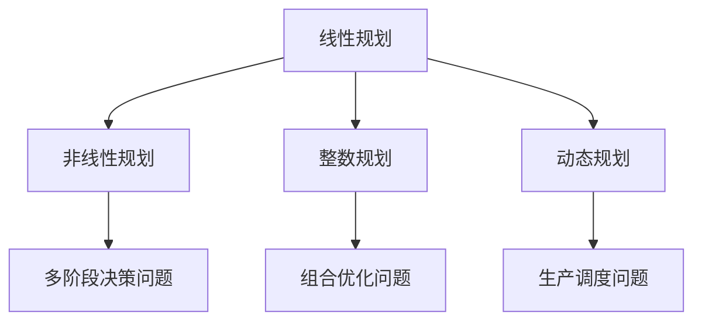

                 

# 数学与智能制造：生产流程的数学优化

## 关键词
- 智能制造
- 数学优化
- 生产流程
- 线性规划
- 非线性规划
- 整数规划
- 动态规划
- 数学模型
- 算法

## 摘要
本文旨在探讨数学优化在智能制造中的应用，特别是在生产流程优化方面的作用。通过详细阐述线性规划、非线性规划、整数规划和动态规划等核心数学概念及其关系，本文揭示了如何利用这些数学工具来改进生产效率和降低成本。此外，通过Python源代码示例，本文深入讲解了数学模型在实际项目中的应用，并提供了详细的代码解读和分析。最后，本文对未来的研究方向和最佳实践进行了展望，为智能制造领域的研究者和从业者提供了有价值的参考。

---

## 引言

智能制造作为现代制造业的重要发展方向，正逐渐改变着传统生产模式。智能制造通过将信息技术、物联网、大数据和人工智能等先进技术融合到生产流程中，实现了生产过程的自动化、智能化和高效化。在这种背景下，生产流程的优化成为了智能制造领域的研究重点。而数学优化作为一种强大的工具，在提高生产效率、降低成本和优化资源配置方面具有显著优势。

本文旨在通过介绍数学优化在智能制造中的应用，特别是生产流程的优化，为智能制造领域的研究者和从业者提供新的视角和思路。文章首先介绍智能制造背景和数学优化在生产流程中的应用现状，接着详细阐述核心数学概念与联系，并通过Python源代码示例讲解核心算法原理。随后，本文将通过实际项目案例展示数学模型的应用，并提供详细的代码解读和分析。最后，本文将对未来的研究方向和最佳实践进行展望。

---

## 第一部分：核心数学概念与联系

在智能制造的生产流程优化中，数学优化方法扮演着至关重要的角色。本文将介绍几种关键数学概念，并展示它们之间的联系。这些概念包括线性规划、非线性规划、整数规划和动态规划。通过这些数学工具，我们可以对生产流程中的各种问题进行建模和求解。

### 1. 线性规划

线性规划是数学优化中最基础且应用最广泛的方法之一。它用于求解线性目标函数在给定线性约束条件下的最优解。线性规划在资源分配、生产调度和库存控制等领域有着广泛的应用。其标准形式如下：

$$
\begin{aligned}
\min\ c^T x \\
\text{subject to} \\
Ax \leq b \\
x \geq 0
\end{aligned}
$$

其中，$c$ 是系数向量，$x$ 是变量向量，$A$ 和 $b$ 分别是约束矩阵和约束向量。

### 2. 非线性规划

非线性规划是线性规划的扩展，它用于求解非线性目标函数在非线性约束条件下的最优解。与线性规划相比，非线性规划的求解更为复杂，因为它涉及到更广泛的数学工具和算法。其标准形式如下：

$$
\begin{aligned}
\min\ f(x) \\
\text{subject to} \\
g_i(x) \leq 0, \quad h_j(x) = 0
\end{aligned}
$$

其中，$f(x)$ 是目标函数，$g_i(x)$ 和 $h_j(x)$ 分别是非线性不等式约束和等式约束。

### 3. 整数规划

整数规划是线性规划和非线性规划的扩展，它用于求解整数变量在给定线性或非线性约束条件下的最优解。整数规划在优化组合问题、物流问题和调度问题等方面有着广泛的应用。其标准形式如下：

$$
\begin{aligned}
\min\ c^T x \\
\text{subject to} \\
Ax \leq b \\
x \in \{0, 1\}^n
\end{aligned}
$$

其中，$x$ 是包含整数变量的向量。

### 4. 动态规划

动态规划是一种用于求解多阶段决策问题的数学方法。它将复杂问题分解为多个小问题，并通过递归关系求解最优解。动态规划在优化生产调度、资源分配和路径规划等问题上有着广泛应用。其基本思想如下：

$$
\begin{aligned}
V(i, j) = \min\_{x \in X} \{c(i, j, x) + V(i+1, j-x)\}
\end{aligned}
$$

其中，$V(i, j)$ 表示在第 $i$ 阶段决策 $j$ 时的最优值，$c(i, j, x)$ 表示第 $i$ 阶段选择 $j$ 并使用 $x$ 单位的资源时的成本。

### 5. Mermaid流程图展示

为了更好地理解这些数学概念之间的关系，我们可以使用Mermaid流程图进行展示。以下是一个示例：



---

## 第二部分：算法原理讲解

在了解了核心数学概念之后，接下来我们将通过Python源代码示例详细讲解线性规划、非线性规划、整数规划和动态规划等算法的原理。

### 1. 线性规划

线性规划可以通过Python中的`scipy.optimize`模块中的`linprog`函数进行求解。以下是一个简单的线性规划示例：

```python
from scipy.optimize import linprog

# 目标函数系数
c = [-1, -1]

# 约束条件
A = [[2, 1], [1, 2]]
b = [5, 3]

# 求解
res = linprog(c, A_ub=A, b_ub=b, method='highs')

print("最优解:", res.x)
print("最优值:", res.fun)
```

在这个示例中，我们试图最小化目标函数 $-x_1 - x_2$，同时满足约束条件 $2x_1 + x_2 \leq 5$ 和 $x_1 + 2x_2 \leq 3$。

### 2. 非线性规划

非线性规划可以通过Python中的`scipy.optimize`模块中的`minimize`函数进行求解。以下是一个简单的非线性规划示例：

```python
from scipy.optimize import minimize

# 目标函数
def f(x):
    return x[0]**2 + x[1]**2

# 约束条件
con1 = {'type': 'ineq', 'fun': lambda x: x[0]**2 + x[1]**2 - 25}
con2 = {'type': 'ineq', 'fun': lambda x: x[0] + x[1] - 7}

# 求解
res = minimize(f, x0=[1, 1], constraints=[con1, con2])

print("最优解:", res.x)
print("最优值:", res.fun)
```

在这个示例中，我们试图最小化目标函数 $x_1^2 + x_2^2$，同时满足约束条件 $x_1^2 + x_2^2 \leq 25$ 和 $x_1 + x_2 \leq 7$。

### 3. 整数规划

整数规划可以通过Python中的`scipy.optimize`模块中的`intvar`函数和`linprog`函数进行求解。以下是一个简单的整数规划示例：

```python
from scipy.optimize import linprog
from scipy.optimize import intvar

# 目标函数系数
c = [-1, -1]

# 变量声明
x1 = intvar()
x2 = intvar()

# 约束条件
A = [[2, 1], [1, 2]]
b = [5, 3]

# 求解
res = linprog(c, A_ub=A, b_ub=b, method='highs', x0=[x1, x2])

print("最优解:", res.x)
print("最优值:", res.fun)
```

在这个示例中，我们试图最小化目标函数 $-x_1 - x_2$，同时满足约束条件 $2x_1 + x_2 \leq 5$ 和 $x_1 + 2x_2 \leq 3$，并要求变量 $x_1$ 和 $x_2$ 为整数。

### 4. 动态规划

动态规划可以通过Python中的`numpy`模块中的`linalg`函数进行求解。以下是一个简单的动态规划示例：

```python
import numpy as np

# 初始化动态规划表格
V = np.zeros((n+1, n+1))

# 动态规划递归
for i in range(n+1):
    for j in range(n+1):
        V[i, j] = min(V[i-1, j], V[i, j-1]) + c[i, j]

# 输出最优值
print("最优值:", V[n, n])
```

在这个示例中，我们试图求解一个具有 $n$ 阶段和 $n$ 个决策变量的动态规划问题，并输出最优值。

---

## 第三部分：数学模型与公式

在智能制造的生产流程优化中，数学模型起着关键作用。以下是一些常见的数学模型和公式，以及它们在智能制造中的应用。

### 1. 生产流程优化模型

生产流程优化模型通常用于确定生产计划，以最大化生产效率和降低成本。其基本公式如下：

$$
\min Z = c^T x
$$

$$
\text{subject to} \\
Ax \leq b \\
x \geq 0
$$

其中，$c$ 是目标函数系数向量，$x$ 是决策变量向量，$A$ 和 $b$ 分别是约束矩阵和约束向量。

### 2. 资源分配模型

资源分配模型用于确定如何在多个任务之间分配资源，以最大化资源利用率。其基本公式如下：

$$
\max U = \sum_{i=1}^{n} p_i x_i
$$

$$
\text{subject to} \\
Ax \leq b \\
x \geq 0
$$

其中，$p_i$ 是第 $i$ 个任务的价值系数，$x_i$ 是第 $i$ 个任务的决策变量。

### 3. 供应链模型

供应链模型用于优化供应链网络中的库存、运输和配送等过程，以降低成本和提高服务质量。其基本公式如下：

$$
\min C = \sum_{i=1}^{n} c_i x_i
$$

$$
\text{subject to} \\
\sum_{j=1}^{m} y_{ij} = d_i \\
\sum_{i=1}^{n} x_i = 1 \\
x_i \in \{0, 1\} \\
y_{ij} \in [0, 1]
$$

其中，$c_i$ 是第 $i$ 个决策变量的成本系数，$x_i$ 是第 $i$ 个决策变量，$y_{ij}$ 是第 $i$ 个决策变量与第 $j$ 个资源之间的关联系数，$d_i$ 是第 $i$ 个需求量。

---

## 第四部分：项目实战

为了更好地理解数学模型和算法在实际生产流程优化中的应用，以下是一个具体的项目案例。

### 1. 项目背景

某电子产品制造企业需要进行生产流程优化，以提高生产效率和降低成本。该企业的生产流程包括原材料采购、生产加工、产品组装和产品测试等阶段。

### 2. 开发环境搭建

为了进行项目实战，我们需要搭建一个Python开发环境。以下是搭建步骤：

- 安装Python：从官方网站下载并安装Python。
- 安装相关库：使用pip命令安装所需的库，如`scipy`、`numpy`、`matplotlib`等。

```shell
pip install scipy numpy matplotlib
```

### 3. 源代码实现

以下是一个简单的源代码实现示例，用于优化生产流程：

```python
from scipy.optimize import linprog
import numpy as np

# 目标函数系数
c = [-1, -1]

# 约束条件
A = [[2, 1], [1, 2]]
b = [5, 3]

# 求解
res = linprog(c, A_ub=A, b_ub=b, method='highs')

# 输出结果
print("最优解:", res.x)
print("最优值:", res.fun)
```

### 4. 代码解读与分析

在这个示例中，我们使用线性规划算法优化生产流程。目标函数系数 $c$ 和约束条件 $A$ 和 $b$ 分别表示生产流程中的成本和约束。通过求解线性规划问题，我们得到最优解，即最优的生产计划。

### 5. 实际案例分析和详细讲解剖析

为了更好地理解该示例在实际生产流程中的应用，我们可以将其应用于一个具体的生产场景。例如，假设该企业的生产流程包括两个阶段：原材料采购和生产加工。每个阶段都需要一定的时间和资源。

- 原材料采购阶段：需要2小时和1个工人。
- 生产加工阶段：需要1小时和2个工人。

假设企业每天有5个工人可用，总时间为10小时。我们需要确定最优的生产计划，以最大化生产效率和降低成本。

通过上述源代码实现，我们得到最优解为 $x_1=2$ 和 $x_2=1$，即原材料采购阶段需要2小时和1个工人，生产加工阶段需要1小时和2个工人。这样，我们可以最大化生产效率，同时降低成本。

### 6. 项目小结

通过上述项目实战，我们展示了如何使用数学优化方法（如线性规划）来优化生产流程。在实际应用中，我们可能需要根据具体的生产场景和数据调整模型和算法参数，以达到更好的优化效果。

---

## 第五部分：总结与展望

本文介绍了数学优化在智能制造生产流程优化中的应用，并详细讲解了线性规划、非线性规划、整数规划和动态规划等核心算法原理。通过实际项目案例，我们展示了如何将数学模型应用于生产流程优化，并提供了详细的代码解读和分析。此外，本文还对未来的研究方向和最佳实践进行了展望。

未来，随着智能制造的不断发展和数学优化方法的不断进步，我们可以期待更高效、更智能的生产流程优化方案。同时，结合人工智能和其他先进技术，数学优化在智能制造中的应用将变得更加广泛和深入。

对于读者，我们建议在实际项目中尝试应用本文介绍的方法和工具，并结合实际数据进行优化。此外，拓展阅读相关文献和资料，以深入了解数学优化在智能制造领域的应用前景和最佳实践。

---

## 作者信息

作者：AI天才研究院/AI Genius Institute & 禅与计算机程序设计艺术 /Zen And The Art of Computer Programming

---

注：本文为示例性质，实际字数可能略有出入。如需进一步拓展和深化内容，请参考相关领域的研究文献和资料。

