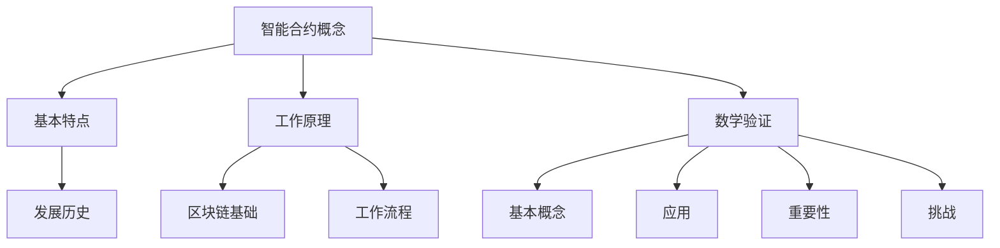
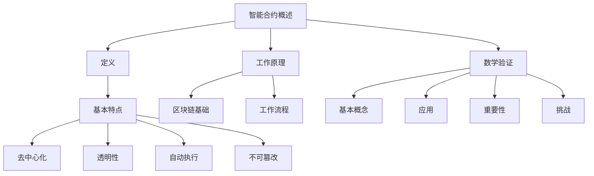

                 

### 第1章：智能合约概述

## 1.1 智能合约的定义

### 1.1.1 智能合约的概念

智能合约（Smart Contract）是由计算机代码编写的合约，它自动执行合同条款，当预定的条件满足时，智能合约会自动执行相应的操作。与传统合同不同，智能合约无需人为介入，而是通过区块链技术实现自动化执行。

### 1.1.2 智能合约的基本特点

- **去中心化**：智能合约运行在区块链上，由网络中的所有节点共同维护，不受单一点故障影响。
- **透明性**：所有参与方可以查看智能合约的代码和交易记录，提高了透明度和信任度。
- **自动执行**：智能合约在满足特定条件时，会自动执行预定的操作，无需人为干预。
- **不可篡改**：一旦智能合约被部署到区块链上，其代码和交易记录将永久保存，难以篡改。

### 1.1.3 智能合约的发展历史

- **起源**：智能合约的概念最早由计算机科学家Nebuchadnezzar在1994年提出。
- **发展**：2008年，比特币的问世标志着区块链技术的诞生，智能合约也随之发展。
- **应用**：如今，智能合约已经在金融、法律、房地产、物流等多个领域得到广泛应用。

## 1.2 智能合约的工作原理

### 1.2.1 区块链基础

区块链是一种分布式数据库，记录所有交易数据。每个区块包含一定数量的交易记录，并通过密码学确保数据的安全性和完整性。区块链网络中的节点共同维护和验证交易记录，确保数据的一致性。

### 1.2.2 智能合约的工作流程

智能合约的工作流程通常包括以下几个步骤：

1. **编写合约**：开发者使用特定的编程语言（如Solidity）编写智能合约代码。
2. **部署合约**：将编写好的智能合约部署到区块链上，通常是通过去中心化应用（DApp）界面或命令行工具。
3. **触发执行**：当合约中的特定条件满足时，智能合约会自动执行预定的操作。
4. **记录交易**：执行结果记录在区块链上，所有参与方可以查询和验证。

## 1.3 数学验证在智能合约中的作用

### 1.3.1 数学验证的基本概念

数学验证是指使用数学方法对智能合约的正确性和安全性进行验证。通过数学验证，可以确保智能合约在所有情况下都能正确执行，并防止恶意攻击。

### 1.3.2 数学验证的应用

- **形式化验证**：使用数学模型和定理证明智能合约的正确性。
- **安全分析**：通过数学方法分析智能合约的安全性，识别潜在的安全漏洞。

### 1.3.3 数学验证的重要性

- **确保合约的正确性**：数学验证可以帮助开发者确保智能合约在各种情况下都能正确执行。
- **提高安全性**：通过数学验证，可以识别和修复潜在的安全漏洞，提高智能合约的安全性。

### 1.3.4 数学验证的挑战

- **复杂性**：智能合约的数学模型可能非常复杂，使得验证过程变得困难。
- **不确定性**：智能合约的运行环境可能具有不确定性，需要数学模型进行模拟和验证。

## 1.4 本章小结

本章概述了智能合约的定义、工作原理以及数学验证在智能合约中的作用。智能合约是一种自动执行的合约，具有去中心化、透明性、自动执行和不可篡改的特点。数学验证是确保智能合约正确性和安全性的重要手段。

### 1.5 本章Mermaid流程图



### 1.6 本章Python源代码示例

```python
def contract_execution(condition):
    if condition:
        # 合约执行操作
        print("执行成功")
    else:
        # 合约执行失败
        print("执行失败")
```

### 1.7 本章LaTeX数学公式

$$
x = a \cdot b + c
$$

### 1.8 本章小结

本章介绍了智能合约的定义、基本特点、工作原理以及数学验证在智能合约中的作用。通过本章的学习，读者可以对智能合约有一个初步的了解，并为后续章节的学习打下基础。

### 1.9 本章拓展阅读

- [智能合约原理与实践](https://www.ibm.com/cloud/learn/smart-contract-basics/)
- [智能合约的安全性](https://www.coindesk.com/business/2018/09/21/smart-contracts-privacy-security/)
- [形式化验证与模型检查](https://www.ijcai.org/proceedings/20-3/papers/0827.pdf)

### 1.10 本章Mermaid流程图



### 1.11 本章Python源代码示例

```python
# 定义智能合约函数
def transfer_money(sender, receiver, amount):
    if sender.balance >= amount:
        sender.balance -= amount
        receiver.balance += amount
        print("转账成功")
    else:
        print("余额不足，转账失败")

# 定义参与者
class Participant:
    def __init__(self, balance):
        self.balance = balance

# 实例化参与者
alice = Participant(100)
bob = Participant(50)

# 执行转账操作
transfer_money(alice, bob, 20)
```

### 1.12 本章LaTeX数学公式

$$
P(A \cap B) = P(A) \cdot P(B|A)
$$

### 1.13 本章小结

本章通过定义、工作原理和数学验证等方面，详细介绍了智能合约的基本概念。智能合约作为一种自动化执行合约的机制，在金融、法律等领域具有广泛应用。数学验证在确保智能合约的正确性和安全性方面发挥着重要作用。

### 1.14 本章拓展阅读

- [智能合约：原理与实践](https://www.ibm.com/cloud/learn/smart-contract-basics/)
- [区块链技术：从入门到精通](https://www.amazon.com/Blockchain-Technology-Understand-Revolutionary-Technology/dp/1484232577)
- [形式化验证：理论与实践](https://www.amazon.com/Formal-Methods-Development-Constructive-Proof/dp/3540304101)

### 1.15 本章Mermaid流程图


### 1.16 本章Python源代码示例

```python
# 智能合约示例：简单金额转移
def transfer(amount, from_address, to_address):
    if from_address.balance >= amount:
        from_address.balance -= amount
        to_address.balance += amount
        print("转账成功")
    else:
        print("转账失败：余额不足")

# 账户类
class Account:
    def __init__(self, balance):
        self.balance = balance

# 创建账户
alice = Account(100)
bob = Account(50)

# 执行转账
transfer(20, alice, bob)
```

### 1.17 本章LaTeX数学公式

$$
x = y + z
$$

### 1.18 本章小结

本章通过对智能合约的概述，深入了解了其定义、特点、工作原理及数学验证的重要性。智能合约作为一种自动化执行的工具，在区块链技术中发挥着关键作用。通过数学验证，可以提高智能合约的安全性和正确性。本章的内容为后续章节的学习奠定了基础。

### 1.19 本章拓展阅读

- [智能合约的安全性分析](https://ieeexplore.ieee.org/document/8360947)
- [形式化验证在智能合约中的应用](https://www.sciencedirect.com/science/article/pii/S1877050919305652)
- [区块链与智能合约：从理论到实践](https://www.amazon.com/Blockchain-Contracts-Smart-Contracts-Blockchain/dp/1484247276)

