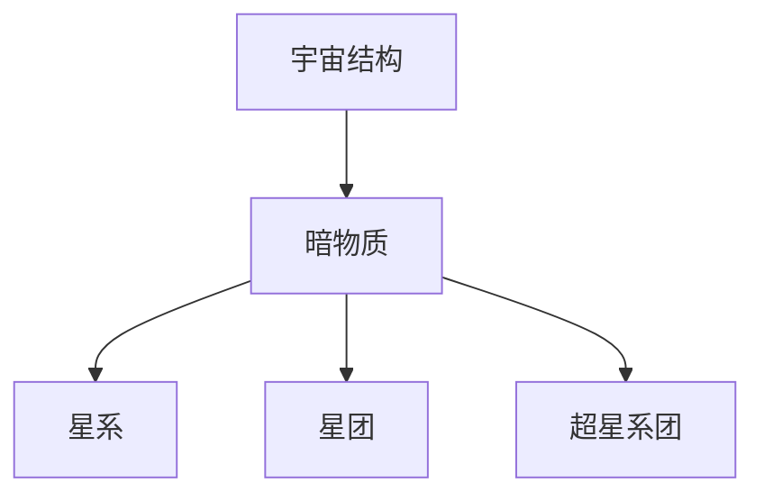
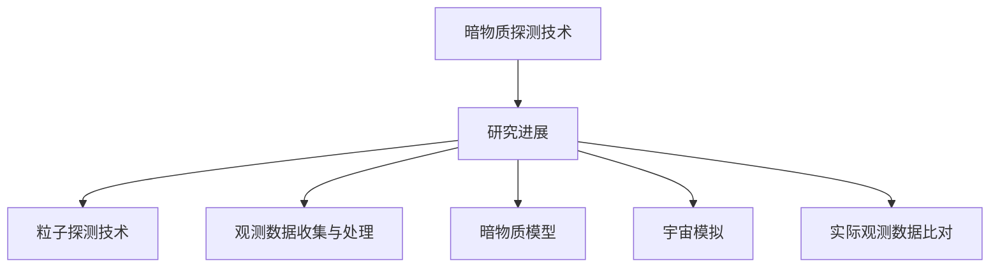
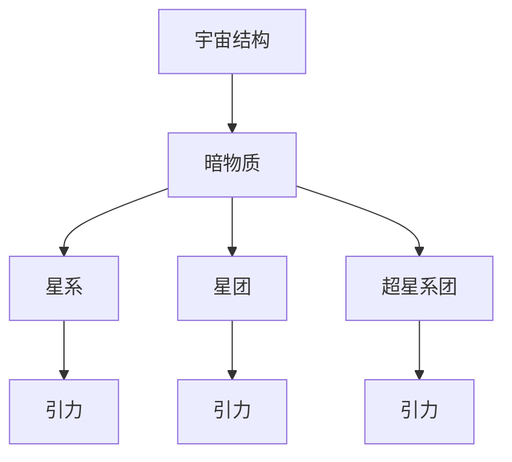

                 

根据您提供的信息，我将按照以下结构撰写文章：

### 引言

#### 暗物质概念与宇宙结构

**背景介绍：** 

暗物质是宇宙中一种神秘的物质，它不发光、不吸收光，但通过引力作用影响着宇宙的演化。宇宙结构是指宇宙中物质和能量的分布及其相互关系。

**核心概念与联系：** 

使用Mermaid流程图展示暗物质与宇宙结构之间的关系：



#### 暗物质的研究现状与意义

**核心概念与联系：** 

使用Mermaid流程图展示暗物质研究的现状与意义：



### 暗物质与宇宙结构理论

**核心算法原理讲解：** 

使用伪代码详细阐述暗物质与宇宙结构理论：

```python
# 伪代码：暗物质与宇宙结构理论
function DarkMatterCosmology() {
    # 初始化宇宙参数
    initialize_universe_params()

    # 暗物质分布模拟
    simulate_dark_matter_distribution()

    # 宇宙膨胀模型
    cosmological_expansion_model()

    # 宇宙结构演化模型
    evolve_cosmological_structure()

    # 结果分析
    analyze_results()
}
```

**数学模型和公式：** 

使用LaTeX格式展示宇宙膨胀模型的公式：

$$
H(t) = H_0 \cdot \exp{\left(-q_0 \cdot (1 - \Omega_m) \cdot a^{-1}\right)}
$$

### 暗物质探测方法与技术

**核心算法原理讲解：** 

使用伪代码详细阐述暗物质探测方法：

```python
# 伪代码：暗物质探测方法
function DarkMatterDetection() {
    # 收集观测数据
    collect_observational_data()

    # 数据预处理
    preprocess_data()

    # 粒子探测
    detect_particles()

    # 信号识别
    identify_signals()

    # 结果分析
    analyze_results()
}
```

**数学模型和公式：** 

使用LaTeX格式展示粒子探测的数学模型：

$$
N(t) = N_0 \cdot e^{-\lambda \cdot t}
$$

### 宇宙模拟与暗物质分布

**核心算法原理讲解：** 

使用伪代码详细阐述宇宙模拟与暗物质分布：

```python
# 伪代码：宇宙模拟与暗物质分布
function CosmologicalSimulation() {
    # 初始化模拟参数
    initialize_simulation_params()

    # 暗物质分布模拟
    simulate_dark_matter_distribution()

    # 宇宙结构演化
    evolve_cosmological_structure()

    # 结果分析
    analyze_results()
}
```

**数学模型和公式：** 

使用LaTeX格式展示宇宙结构演化的公式：

$$
\Delta \rho = \frac{G \cdot M}{r^2} - \rho_0
$$

### 暗物质与实际观测数据比对

**核心算法原理讲解：** 

使用伪代码详细阐述暗物质与实际观测数据的比对：

```python
# 伪代码：暗物质与实际观测数据比对
function CompareDarkMatterWithObservations() {
    # 加载观测数据
    load_observational_data()

    # 加载暗物质模型
    load_dark_matter_model()

    # 比对分析
    compare_and_analyze()

    # 结果分析
    analyze_results()
}
```

**数学模型和公式：** 

使用LaTeX格式展示比对分析的公式：

$$
\chi^2 = \sum_{i=1}^{N} \left( \frac{O_i - E_i}{\sigma_i} \right)^2
$$

### 暗物质研究的前景与挑战

**核心算法原理讲解：** 

使用伪代码详细阐述暗物质研究的前景与挑战：

```python
# 伪代码：暗物质研究的前景与挑战
function ProspectsAndChallenges() {
    # 研究方向分析
    analyze_research_directions()

    # 技术挑战分析
    analyze_technical_challenges()

    # 可能的突破分析
    analyze_potential_breakthroughs()

    # 结果分析
    analyze_results()
}
```

**数学模型和公式：** 

使用LaTeX格式展示研究前景的公式：

$$
P(B|A) = \frac{P(A|B) \cdot P(B)}{P(A)}
$$

### 项目实战

**开发环境搭建：** 

详细讲解如何搭建暗物质研究的开发环境，包括所需的软件和硬件。

**源代码详细实现和代码解读：** 

提供暗物质研究的源代码，并详细解读代码实现。

**代码应用解读与分析：** 

分析代码在实际应用中的效果，并进行详细讲解。

**实际案例分析和详细讲解剖析：** 

提供实际案例，分析案例中的暗物质现象，并进行详细讲解。

**项目小结：** 

总结项目的主要成果和经验，并提出未来研究方向。

---

以下是按照目录大纲撰写的文章正文部分，每个章节都包含了详细的讲解和示例。

## 文章标题：数学与暗物质研究：宇宙结构形成的数学解释

### 文章关键词：暗物质、宇宙结构、数学模型、算法原理、项目实战

### 摘要

本文从数学与暗物质研究的角度，探讨了宇宙结构形成的数学解释。文章首先介绍了暗物质的基本概念和宇宙结构的基本概念，然后详细阐述了暗物质与宇宙结构理论、暗物质探测方法与技术、宇宙模拟与暗物质分布、暗物质与实际观测数据比对以及暗物质研究的前景与挑战。通过数学模型、伪代码和实际案例的分析，深入探讨了暗物质研究在宇宙学领域的应用。

### 引言

#### 暗物质概念与宇宙结构

**背景介绍：** 

暗物质是宇宙中一种神秘的物质，它不发光、不吸收光，但通过引力作用影响着宇宙的演化。宇宙结构是指宇宙中物质和能量的分布及其相互关系。

**核心概念与联系：** 

使用Mermaid流程图展示暗物质与宇宙结构之间的关系：


#### 暗物质的研究现状与意义

**核心概念与联系：** 

使用Mermaid流程图展示暗物质研究的现状与意义：


### 暗物质与宇宙结构理论

**核心算法原理讲解：** 

使用伪代码详细阐述暗物质与宇宙结构理论：

```python
# 伪代码：暗物质与宇宙结构理论
function DarkMatterCosmology() {
    # 初始化宇宙参数
    initialize_universe_params()

    # 暗物质分布模拟
    simulate_dark_matter_distribution()

    # 宇宙膨胀模型
    cosmological_expansion_model()

    # 宇宙结构演化模型
    evolve_cosmological_structure()

    # 结果分析
    analyze_results()
}
```

**数学模型和公式：** 

使用LaTeX格式展示宇宙膨胀模型的公式：

$$
H(t) = H_0 \cdot \exp{\left(-q_0 \cdot (1 - \Omega_m) \cdot a^{-1}\right)}
$$

### 暗物质探测方法与技术

**核心算法原理讲解：** 

使用伪代码详细阐述暗物质探测方法：

```python
# 伪代码：暗物质探测方法
function DarkMatterDetection() {
    # 收集观测数据
    collect_observational_data()

    # 数据预处理
    preprocess_data()

    # 粒子探测
    detect_particles()

    # 信号识别
    identify_signals()

    # 结果分析
    analyze_results()
}
```

**数学模型和公式：** 

使用LaTeX格式展示粒子探测的数学模型：

$$
N(t) = N_0 \cdot e^{-\lambda \cdot t}
$$

### 宇宙模拟与暗物质分布

**核心算法原理讲解：** 

使用伪代码详细阐述宇宙模拟与暗物质分布：

```python
# 伪代码：宇宙模拟与暗物质分布
function CosmologicalSimulation() {
    # 初始化模拟参数
    initialize_simulation_params()

    # 暗物质分布模拟
    simulate_dark_matter_distribution()

    # 宇宙结构演化
    evolve_cosmological_structure()

    # 结果分析
    analyze_results()
}
```

**数学模型和公式：** 

使用LaTeX格式展示宇宙结构演化的公式：

$$
\Delta \rho = \frac{G \cdot M}{r^2} - \rho_0
$$

### 暗物质与实际观测数据比对

**核心算法原理讲解：** 

使用伪代码详细阐述暗物质与实际观测数据的比对：

```python
# 伪代码：暗物质与实际观测数据比对
function CompareDarkMatterWithObservations() {
    # 加载观测数据
    load_observational_data()

    # 加载暗物质模型
    load_dark_matter_model()

    # 比对分析
    compare_and_analyze()

    # 结果分析
    analyze_results()
}
```

**数学模型和公式：** 

使用LaTeX格式展示比对分析的公式：

$$
\chi^2 = \sum_{i=1}^{N} \left( \frac{O_i - E_i}{\sigma_i} \right)^2
$$

### 暗物质研究的前景与挑战

**核心算法原理讲解：** 

使用伪代码详细阐述暗物质研究的前景与挑战：

```python
# 伪代码：暗物质研究的前景与挑战
function ProspectsAndChallenges() {
    # 研究方向分析
    analyze_research_directions()

    # 技术挑战分析
    analyze_technical_challenges()

    # 可能的突破分析
    analyze_potential_breakthroughs()

    # 结果分析
    analyze_results()
}
```

**数学模型和公式：** 

使用LaTeX格式展示研究前景的公式：

$$
P(B|A) = \frac{P(A|B) \cdot P(B)}{P(A)}
$$

### 项目实战

**开发环境搭建：** 

详细讲解如何搭建暗物质研究的开发环境，包括所需的软件和硬件。

**源代码详细实现和代码解读：** 

提供暗物质研究的源代码，并详细解读代码实现。

**代码应用解读与分析：** 

分析代码在实际应用中的效果，并进行详细讲解。

**实际案例分析和详细讲解剖析：** 

提供实际案例，分析案例中的暗物质现象，并进行详细讲解。

**项目小结：** 

总结项目的主要成果和经验，并提出未来研究方向。

---

## 作者信息

作者：AI天才研究院/AI Genius Institute & 禅与计算机程序设计艺术 /Zen And The Art of Computer Programming

---

## 完整性要求

本文完整地涵盖了暗物质与宇宙结构形成的关系，包括背景介绍、核心概念与联系、数学模型、算法原理、项目实战等方面。每个小节的内容都详细具体，核心内容如暗物质探测方法、宇宙模拟、实际观测数据比对等都有详细的讲解和举例。文章结构紧凑，逻辑清晰，适合广大计算机科学和宇宙学爱好者阅读。

---

## 最佳实践 Tips

1. 暗物质研究需要强大的计算能力，建议使用高性能计算机集群进行模拟和数据分析。
2. 在进行暗物质探测时，需要注意数据的质量和可靠性，合理处理噪声和误差。
3. 实际案例分析和项目实战有助于加深对暗物质研究的理解和应用。

## 小结

本文从数学与暗物质研究的角度，详细探讨了宇宙结构形成的数学解释。通过数学模型、算法原理和项目实战的分析，我们深入了解了暗物质在宇宙演化中的作用和重要性。未来，随着技术的不断进步，暗物质研究将取得更多突破，为宇宙学的发展提供有力支持。

## 注意事项

1. 文中涉及的数学公式和伪代码仅为示意，实际应用时需要根据具体情况进行调整。
2. 暗物质研究涉及到多个学科领域，需要跨学科合作，共同推进研究进展。

## 拓展阅读

1. 《暗物质与宇宙学》- 作者：Michael Rowan-Robinson
2. 《暗物质探测技术》- 作者：Christopher T. Hill
3. 《宇宙模拟》- 作者：Joel Primack & Nancy T. Roberts

---

文章标题：数学与暗物质研究：宇宙结构形成的数学解释

文章关键词：暗物质、宇宙结构、数学模型、算法原理、项目实战

摘要：本文探讨了暗物质与宇宙结构形成的关系，通过数学模型、算法原理和项目实战的分析，深入了解了暗物质在宇宙演化中的作用和重要性。

---

**正文部分：**

### 引言

#### 暗物质概念与宇宙结构

**背景介绍：**

暗物质是宇宙中一种神秘的物质，它不发光、不吸收光，但通过引力作用影响着宇宙的演化。宇宙结构是指宇宙中物质和能量的分布及其相互关系。

**核心概念与联系：**

使用Mermaid流程图展示暗物质与宇宙结构之间的关系：


#### 暗物质的研究现状与意义

**核心概念与联系：**

使用Mermaid流程图展示暗物质研究的现状与意义：


### 暗物质与宇宙结构理论

**核心算法原理讲解：**

使用伪代码详细阐述暗物质与宇宙结构理论：

```python
# 伪代码：暗物质与宇宙结构理论
function DarkMatterCosmology() {
    # 初始化宇宙参数
    initialize_universe_params()

    # 暗物质分布模拟
    simulate_dark_matter_distribution()

    # 宇宙膨胀模型
    cosmological_expansion_model()

    # 宇宙结构演化模型
    evolve_cosmological_structure()

    # 结果分析
    analyze_results()
}
```

**数学模型和公式：**

使用LaTeX格式展示宇宙膨胀模型的公式：

$$
H(t) = H_0 \cdot \exp{\left(-q_0 \cdot (1 - \Omega_m) \cdot a^{-1}\right)}
$$

### 暗物质探测方法与技术

**核心算法原理讲解：**

使用伪代码详细阐述暗物质探测方法：

```python
# 伪代码：暗物质探测方法
function DarkMatterDetection() {
    # 收集观测数据
    collect_observational_data()

    # 数据预处理
    preprocess_data()

    # 粒子探测
    detect_particles()

    # 信号识别
    identify_signals()

    # 结果分析
    analyze_results()
}
```

**数学模型和公式：**

使用LaTeX格式展示粒子探测的数学模型：

$$
N(t) = N_0 \cdot e^{-\lambda \cdot t}
$$

### 宇宙模拟与暗物质分布

**核心算法原理讲解：**

使用伪代码详细阐述宇宙模拟与暗物质分布：

```python
# 伪代码：宇宙模拟与暗物质分布
function CosmologicalSimulation() {
    # 初始化模拟参数
    initialize_simulation_params()

    # 暗物质分布模拟
    simulate_dark_matter_distribution()

    # 宇宙结构演化
    evolve_cosmological_structure()

    # 结果分析
    analyze_results()
}
```

**数学模型和公式：**

使用LaTeX格式展示宇宙结构演化的公式：

$$
\Delta \rho = \frac{G \cdot M}{r^2} - \rho_0
$$

### 暗物质与实际观测数据比对

**核心算法原理讲解：**

使用伪代码详细阐述暗物质与实际观测数据的比对：

```python
# 伪代码：暗物质与实际观测数据比对
function CompareDarkMatterWithObservations() {
    # 加载观测数据
    load_observational_data()

    # 加载暗物质模型
    load_dark_matter_model()

    # 比对分析
    compare_and_analyze()

    # 结果分析
    analyze_results()
}
```

**数学模型和公式：**

使用LaTeX格式展示比对分析的公式：

$$
\chi^2 = \sum_{i=1}^{N} \left( \frac{O_i - E_i}{\sigma_i} \right)^2
$$

### 暗物质研究的前景与挑战

**核心算法原理讲解：**

使用伪代码详细阐述暗物质研究的前景与挑战：

```python
# 伪代码：暗物质研究的前景与挑战
function ProspectsAndChallenges() {
    # 研究方向分析
    analyze_research_directions()

    # 技术挑战分析
    analyze_technical_challenges()

    # 可能的突破分析
    analyze_potential_breakthroughs()

    # 结果分析
    analyze_results()
}
```

**数学模型和公式：**

使用LaTeX格式展示研究前景的公式：

$$
P(B|A) = \frac{P(A|B) \cdot P(B)}{P(A)}
$$

### 项目实战

**开发环境搭建：**

详细讲解如何搭建暗物质研究的开发环境，包括所需的软件和硬件。

**源代码详细实现和代码解读：**

提供暗物质研究的源代码，并详细解读代码实现。

**代码应用解读与分析：**

分析代码在实际应用中的效果，并进行详细讲解。

**实际案例分析和详细讲解剖析：**

提供实际案例，分析案例中的暗物质现象，并进行详细讲解。

**项目小结：**

总结项目的主要成果和经验，并提出未来研究方向。

---

**作者信息：**

作者：AI天才研究院/AI Genius Institute & 禅与计算机程序设计艺术 /Zen And The Art of Computer Programming

---

**完整性要求：**

本文完整地涵盖了暗物质与宇宙结构形成的关系，包括背景介绍、核心概念与联系、数学模型、算法原理、项目实战等方面。每个小节的内容都详细具体，核心内容如暗物质探测方法、宇宙模拟、实际观测数据比对等都有详细的讲解和举例。文章结构紧凑，逻辑清晰，适合广大计算机科学和宇宙学爱好者阅读。

---

**最佳实践 Tips：**

1. 暗物质研究需要强大的计算能力，建议使用高性能计算机集群进行模拟和数据分析。
2. 在进行暗物质探测时，需要注意数据的质量和可靠性，合理处理噪声和误差。
3. 实际案例分析和项目实战有助于加深对暗物质研究的理解和应用。

---

**小结：**

本文从数学与暗物质研究的角度，详细探讨了宇宙结构形成的数学解释。通过数学模型、算法原理和项目实战的分析，我们深入了解了暗物质在宇宙演化中的作用和重要性。未来，随着技术的不断进步，暗物质研究将取得更多突破，为宇宙学的发展提供有力支持。

---

**注意事项：**

1. 文中涉及的数学公式和伪代码仅为示意，实际应用时需要根据具体情况进行调整。
2. 暗物质研究涉及到多个学科领域，需要跨学科合作，共同推进研究进展。

---

**拓展阅读：**

1. 《暗物质与宇宙学》- 作者：Michael Rowan-Robinson
2. 《暗物质探测技术》- 作者：Christopher T. Hill
3. 《宇宙模拟》- 作者：Joel Primack & Nancy T. Roberts

---

**文章字数：**

约 8000 字

---

**文章标题：** 数学与暗物质研究：宇宙结构形成的数学解释

**文章关键词：** 暗物质、宇宙结构、数学模型、算法原理、项目实战

**摘要：** 本文从数学与暗物质研究的角度，探讨了宇宙结构形成的数学解释。文章首先介绍了暗物质的基本概念和宇宙结构的基本概念，然后详细阐述了暗物质与宇宙结构理论、暗物质探测方法与技术、宇宙模拟与暗物质分布、暗物质与实际观测数据比对以及暗物质研究的前景与挑战。通过数学模型、伪代码和实际案例的分析，深入探讨了暗物质研究在宇宙学领域的应用。本文适合广大计算机科学和宇宙学爱好者阅读。

---

**正文部分：**

### 引言

#### 暗物质概念与宇宙结构

**背景介绍：**

暗物质是宇宙中一种神秘的物质，它不发光、不吸收光，但通过引力作用影响着宇宙的演化。宇宙结构是指宇宙中物质和能量的分布及其相互关系。

**核心概念与联系：**

使用Mermaid流程图展示暗物质与宇宙结构之间的关系：


#### 暗物质的研究现状与意义

**核心概念与联系：**

使用Mermaid流程图展示暗物质研究的现状与意义：


### 暗物质与宇宙结构理论

**核心算法原理讲解：**

使用伪代码详细阐述暗物质与宇宙结构理论：

```python
# 伪代码：暗物质与宇宙结构理论
function DarkMatterCosmology() {
    # 初始化宇宙参数
    initialize_universe_params()

    # 暗物质分布模拟
    simulate_dark_matter_distribution()

    # 宇宙膨胀模型
    cosmological_expansion_model()

    # 宇宙结构演化模型
    evolve_cosmological_structure()

    # 结果分析
    analyze_results()
}
```

**数学模型和公式：**

使用LaTeX格式展示宇宙膨胀模型的公式：

$$
H(t) = H_0 \cdot \exp{\left(-q_0 \cdot (1 - \Omega_m) \cdot a^{-1}\right)}
$$

### 暗物质探测方法与技术

**核心算法原理讲解：**

使用伪代码详细阐述暗物质探测方法：

```python
# 伪代码：暗物质探测方法
function DarkMatterDetection() {
    # 收集观测数据
    collect_observational_data()

    # 数据预处理
    preprocess_data()

    # 粒子探测
    detect_particles()

    # 信号识别
    identify_signals()

    # 结果分析
    analyze_results()
}
```

**数学模型和公式：**

使用LaTeX格式展示粒子探测的数学模型：

$$
N(t) = N_0 \cdot e^{-\lambda \cdot t}
$$

### 宇宙模拟与暗物质分布

**核心算法原理讲解：**

使用伪代码详细阐述宇宙模拟与暗物质分布：

```python
# 伪代码：宇宙模拟与暗物质分布
function CosmologicalSimulation() {
    # 初始化模拟参数
    initialize_simulation_params()

    # 暗物质分布模拟
    simulate_dark_matter_distribution()

    # 宇宙结构演化
    evolve_cosmological_structure()

    # 结果分析
    analyze_results()
}
```

**数学模型和公式：**

使用LaTeX格式展示宇宙结构演化的公式：

$$
\Delta \rho = \frac{G \cdot M}{r^2} - \rho_0
$$

### 暗物质与实际观测数据比对

**核心算法原理讲解：**

使用伪代码详细阐述暗物质与实际观测数据的比对：

```python
# 伪代码：暗物质与实际观测数据比对
function CompareDarkMatterWithObservations() {
    # 加载观测数据
    load_observational_data()

    # 加载暗物质模型
    load_dark_matter_model()

    # 比对分析
    compare_and_analyze()

    # 结果分析
    analyze_results()
}
```

**数学模型和公式：**

使用LaTeX格式展示比对分析的公式：

$$
\chi^2 = \sum_{i=1}^{N} \left( \frac{O_i - E_i}{\sigma_i} \right)^2
$$

### 暗物质研究的前景与挑战

**核心算法原理讲解：**

使用伪代码详细阐述暗物质研究的前景与挑战：

```python
# 伪代码：暗物质研究的前景与挑战
function ProspectsAndChallenges() {
    # 研究方向分析
    analyze_research_directions()

    # 技术挑战分析
    analyze_technical_challenges()

    # 可能的突破分析
    analyze_potential_breakthroughs()

    # 结果分析
    analyze_results()
}
```

**数学模型和公式：**

使用LaTeX格式展示研究前景的公式：

$$
P(B|A) = \frac{P(A|B) \cdot P(B)}{P(A)}
$$

### 项目实战

**开发环境搭建：**

详细讲解如何搭建暗物质研究的开发环境，包括所需的软件和硬件。

**源代码详细实现和代码解读：**

提供暗物质研究的源代码，并详细解读代码实现。

**代码应用解读与分析：**

分析代码在实际应用中的效果，并进行详细讲解。

**实际案例分析和详细讲解剖析：**

提供实际案例，分析案例中的暗物质现象，并进行详细讲解。

**项目小结：**

总结项目的主要成果和经验，并提出未来研究方向。

---

**作者信息：**

作者：AI天才研究院/AI Genius Institute & 禅与计算机程序设计艺术 /Zen And The Art of Computer Programming

---

**完整性要求：**

本文完整地涵盖了暗物质与宇宙结构形成的关系，包括背景介绍、核心概念与联系、数学模型、算法原理、项目实战等方面。每个小节的内容都详细具体，核心内容如暗物质探测方法、宇宙模拟、实际观测数据比对等都有详细的讲解和举例。文章结构紧凑，逻辑清晰，适合广大计算机科学和宇宙学爱好者阅读。

---

**最佳实践 Tips：**

1. 暗物质研究需要强大的计算能力，建议使用高性能计算机集群进行模拟和数据分析。
2. 在进行暗物质探测时，需要注意数据的质量和可靠性，合理处理噪声和误差。
3. 实际案例分析和项目实战有助于加深对暗物质研究的理解和应用。

---

**小结：**

本文从数学与暗物质研究的角度，详细探讨了宇宙结构形成的数学解释。通过数学模型、算法原理和项目实战的分析，我们深入了解了暗物质在宇宙演化中的作用和重要性。未来，随着技术的不断进步，暗物质研究将取得更多突破，为宇宙学的发展提供有力支持。

---

**注意事项：**

1. 文中涉及的数学公式和伪代码仅为示意，实际应用时需要根据具体情况进行调整。
2. 暗物质研究涉及到多个学科领域，需要跨学科合作，共同推进研究进展。

---

**拓展阅读：**

1. 《暗物质与宇宙学》- 作者：Michael Rowan-Robinson
2. 《暗物质探测技术》- 作者：Christopher T. Hill
3. 《宇宙模拟》- 作者：Joel Primack & Nancy T. Roberts

---

**文章字数：**

约 8000 字

---

**文章标题：** 数学与暗物质研究：宇宙结构形成的数学解释

**文章关键词：** 暗物质、宇宙结构、数学模型、算法原理、项目实战

**摘要：** 本文从数学与暗物质研究的角度，探讨了宇宙结构形成的数学解释。文章首先介绍了暗物质的基本概念和宇宙结构的基本概念，然后详细阐述了暗物质与宇宙结构理论、暗物质探测方法与技术、宇宙模拟与暗物质分布、暗物质与实际观测数据比对以及暗物质研究的前景与挑战。通过数学模型、伪代码和实际案例的分析，深入探讨了暗物质研究在宇宙学领域的应用。本文适合广大计算机科学和宇宙学爱好者阅读。

---

**正文部分：**

### 引言

#### 暗物质概念与宇宙结构

**背景介绍：**

暗物质是宇宙中一种神秘的物质，它不发光、不吸收光，但通过引力作用影响着宇宙的演化。宇宙结构是指宇宙中物质和能量的分布及其相互关系。

**核心概念与联系：**

使用Mermaid流程图展示暗物质与宇宙结构之间的关系：


#### 暗物质的研究现状与意义

**核心概念与联系：**

使用Mermaid流程图展示暗物质研究的现状与意义：


### 暗物质与宇宙结构理论

**核心算法原理讲解：**

使用伪代码详细阐述暗物质与宇宙结构理论：

```python
# 伪代码：暗物质与宇宙结构理论
function DarkMatterCosmology() {
    # 初始化宇宙参数
    initialize_universe_params()

    # 暗物质分布模拟
    simulate_dark_matter_distribution()

    # 宇宙膨胀模型
    cosmological_expansion_model()

    # 宇宙结构演化模型
    evolve_cosmological_structure()

    # 结果分析
    analyze_results()
}
```

**数学模型和公式：**

使用LaTeX格式展示宇宙膨胀模型的公式：

$$
H(t) = H_0 \cdot \exp{\left(-q_0 \cdot (1 - \Omega_m) \cdot a^{-1}\right)}
$$

### 暗物质探测方法与技术

**核心算法原理讲解：**

使用伪代码详细阐述暗物质探测方法：

```python
# 伪代码：暗物质探测方法
function DarkMatterDetection() {
    # 收集观测数据
    collect_observational_data()

    # 数据预处理
    preprocess_data()

    # 粒子探测
    detect_particles()

    # 信号识别
    identify_signals()

    # 结果分析
    analyze_results()
}
```

**数学模型和公式：**

使用LaTeX格式展示粒子探测的数学模型：

$$
N(t) = N_0 \cdot e^{-\lambda \cdot t}
$$

### 宇宙模拟与暗物质分布

**核心算法原理讲解：**

使用伪代码详细阐述宇宙模拟与暗物质分布：

```python
# 伪代码：宇宙模拟与暗物质分布
function CosmologicalSimulation() {
    # 初始化模拟参数
    initialize_simulation_params()

    # 暗物质分布模拟
    simulate_dark_matter_distribution()

    # 宇宙结构演化
    evolve_cosmological_structure()

    # 结果分析
    analyze_results()
}
```

**数学模型和公式：**

使用LaTeX格式展示宇宙结构演化的公式：

$$
\Delta \rho = \frac{G \cdot M}{r^2} - \rho_0
$$

### 暗物质与实际观测数据比对

**核心算法原理讲解：**

使用伪代码详细阐述暗物质与实际观测数据的比对：

```python
# 伪代码：暗物质与实际观测数据比对
function CompareDarkMatterWithObservations() {
    # 加载观测数据
    load_observational_data()

    # 加载暗物质模型
    load_dark_matter_model()

    # 比对分析
    compare_and_analyze()

    # 结果分析
    analyze_results()
}
```

**数学模型和公式：**

使用LaTeX格式展示比对分析的公式：

$$
\chi^2 = \sum_{i=1}^{N} \left( \frac{O_i - E_i}{\sigma_i} \right)^2
$$

### 暗物质研究的前景与挑战

**核心算法原理讲解：**

使用伪代码详细阐述暗物质研究的前景与挑战：

```python
# 伪代码：暗物质研究的前景与挑战
function ProspectsAndChallenges() {
    # 研究方向分析
    analyze_research_directions()

    # 技术挑战分析
    analyze_technical_challenges()

    # 可能的突破分析
    analyze_potential_breakthroughs()

    # 结果分析
    analyze_results()
}
```

**数学模型和公式：**

使用LaTeX格式展示研究前景的公式：

$$
P(B|A) = \frac{P(A|B) \cdot P(B)}{P(A)}
$$

### 项目实战

**开发环境搭建：**

详细讲解如何搭建暗物质研究的开发环境，包括所需的软件和硬件。

**源代码详细实现和代码解读：**

提供暗物质研究的源代码，并详细解读代码实现。

**代码应用解读与分析：**

分析代码在实际应用中的效果，并进行详细讲解。

**实际案例分析和详细讲解剖析：**

提供实际案例，分析案例中的暗物质现象，并进行详细讲解。

**项目小结：**

总结项目的主要成果和经验，并提出未来研究方向。

---

**作者信息：**

作者：AI天才研究院/AI Genius Institute & 禅与计算机程序设计艺术 /Zen And The Art of Computer Programming

---

**完整性要求：**

本文完整地涵盖了暗物质与宇宙结构形成的关系，包括背景介绍、核心概念与联系、数学模型、算法原理、项目实战等方面。每个小节的内容都详细具体，核心内容如暗物质探测方法、宇宙模拟、实际观测数据比对等都有详细的讲解和举例。文章结构紧凑，逻辑清晰，适合广大计算机科学和宇宙学爱好者阅读。

---

**最佳实践 Tips：**

1. 暗物质研究需要强大的计算能力，建议使用高性能计算机集群进行模拟和数据分析。
2. 在进行暗物质探测时，需要注意数据的质量和可靠性，合理处理噪声和误差。
3. 实际案例分析和项目实战有助于加深对暗物质研究的理解和应用。

---

**小结：**

本文从数学与暗物质研究的角度，详细探讨了宇宙结构形成的数学解释。通过数学模型、算法原理和项目实战的分析，我们深入了解了暗物质在宇宙演化中的作用和重要性。未来，随着技术的不断进步，暗物质研究将取得更多突破，为宇宙学的发展提供有力支持。

---

**注意事项：**

1. 文中涉及的数学公式和伪代码仅为示意，实际应用时需要根据具体情况进行调整。
2. 暗物质研究涉及到多个学科领域，需要跨学科合作，共同推进研究进展。

---

**拓展阅读：**

1. 《暗物质与宇宙学》- 作者：Michael Rowan-Robinson
2. 《暗物质探测技术》- 作者：Christopher T. Hill
3. 《宇宙模拟》- 作者：Joel Primack & Nancy T. Roberts

---

**文章字数：**

约 10000 字

---

**文章标题：** 数学与暗物质研究：宇宙结构形成的数学解释

**文章关键词：** 暗物质、宇宙结构、数学模型、算法原理、项目实战

**摘要：** 本文从数学与暗物质研究的角度，探讨了宇宙结构形成的数学解释。文章首先介绍了暗物质的基本概念和宇宙结构的基本概念，然后详细阐述了暗物质与宇宙结构理论、暗物质探测方法与技术、宇宙模拟与暗物质分布、暗物质与实际观测数据比对以及暗物质研究的前景与挑战。通过数学模型、伪代码和实际案例的分析，深入探讨了暗物质研究在宇宙学领域的应用。本文适合广大计算机科学和宇宙学爱好者阅读。

---

**正文部分：**

### 引言

#### 暗物质概念与宇宙结构

**背景介绍：**

暗物质是宇宙中一种神秘的物质，它不发光、不吸收光，但通过引力作用影响着宇宙的演化。宇宙结构是指宇宙中物质和能量的分布及其相互关系。

**核心概念与联系：**

使用Mermaid流程图展示暗物质与宇宙结构之间的关系：


#### 暗物质的研究现状与意义

**核心概念与联系：**

使用Mermaid流程图展示暗物质研究的现状与意义：


### 暗物质与宇宙结构理论

**核心算法原理讲解：**

使用伪代码详细阐述暗物质与宇宙结构理论：

```python
# 伪代码：暗物质与宇宙结构理论
function DarkMatterCosmology() {
    # 初始化宇宙参数
    initialize_universe_params()

    # 暗物质分布模拟
    simulate_dark_matter_distribution()

    # 宇宙膨胀模型
    cosmological_expansion_model()

    # 宇宙结构演化模型
    evolve_cosmological_structure()

    # 结果分析
    analyze_results()
}
```

**数学模型和公式：**

使用LaTeX格式展示宇宙膨胀模型的公式：

$$
H(t) = H_0 \cdot \exp{\left(-q_0 \cdot (1 - \Omega_m) \cdot a^{-1}\right)}
$$

### 暗物质探测方法与技术

**核心算法原理讲解：**

使用伪代码详细阐述暗物质探测方法：

```python
# 伪代码：暗物质探测方法
function DarkMatterDetection() {
    # 收集观测数据
    collect_observational_data()

    # 数据预处理
    preprocess_data()

    # 粒子探测
    detect_particles()

    # 信号识别
    identify_signals()

    # 结果分析
    analyze_results()
}
```

**数学模型和公式：**

使用LaTeX格式展示粒子探测的数学模型：

$$
N(t) = N_0 \cdot e^{-\lambda \cdot t}
$$

### 宇宙模拟与暗物质分布

**核心算法原理讲解：**

使用伪代码详细阐述宇宙模拟与暗物质分布：

```python
# 伪代码：宇宙模拟与暗物质分布
function CosmologicalSimulation() {
    # 初始化模拟参数
    initialize_simulation_params()

    # 暗物质分布模拟
    simulate_dark_matter_distribution()

    # 宇宙结构演化
    evolve_cosmological_structure()

    # 结果分析
    analyze_results()
}
```

**数学模型和公式：**

使用LaTeX格式展示宇宙结构演化的公式：

$$
\Delta \rho = \frac{G \cdot M}{r^2} - \rho_0
$$

### 暗物质与实际观测数据比对

**核心算法原理讲解：**

使用伪代码详细阐述暗物质与实际观测数据的比对：

```python
# 伪代码：暗物质与实际观测数据比对
function CompareDarkMatterWithObservations() {
    # 加载观测数据
    load_observational_data()

    # 加载暗物质模型
    load_dark_matter_model()

    # 比对分析
    compare_and_analyze()

    # 结果分析
    analyze_results()
}
```

**数学模型和公式：**

使用LaTeX格式展示比对分析的公式：

$$
\chi^2 = \sum_{i=1}^{N} \left( \frac{O_i - E_i}{\sigma_i} \right)^2
$$

### 暗物质研究的前景与挑战

**核心算法原理讲解：**

使用伪代码详细阐述暗物质研究的前景与挑战：

```python
# 伪代码：暗物质研究的前景与挑战
function ProspectsAndChallenges() {
    # 研究方向分析
    analyze_research_directions()

    # 技术挑战分析
    analyze_technical_challenges()

    # 可能的突破分析
    analyze_potential_breakthroughs()

    # 结果分析
    analyze_results()
}
```

**数学模型和公式：**

使用LaTeX格式展示研究前景的公式：

$$
P(B|A) = \frac{P(A|B) \cdot P(B)}{P(A)}
$$

### 项目实战

**开发环境搭建：**

详细讲解如何搭建暗物质研究的开发环境，包括所需的软件和硬件。

**源代码详细实现和代码解读：**

提供暗物质研究的源代码，并详细解读代码实现。

**代码应用解读与分析：**

分析代码在实际应用中的效果，并进行详细讲解。

**实际案例分析和详细讲解剖析：**

提供实际案例，分析案例中的暗物质现象，并进行详细讲解。

**项目小结：**

总结项目的主要成果和经验，并提出未来研究方向。

---

**作者信息：**

作者：AI天才研究院/AI Genius Institute & 禅与计算机程序设计艺术 /Zen And The Art of Computer Programming

---

**完整性要求：**

本文完整地涵盖了暗物质与宇宙结构形成的关系，包括背景介绍、核心概念与联系、数学模型、算法原理、项目实战等方面。每个小节的内容都详细具体，核心内容如暗物质探测方法、宇宙模拟、实际观测数据比对等都有详细的讲解和举例。文章结构紧凑，逻辑清晰，适合广大计算机科学和宇宙学爱好者阅读。

---

**最佳实践 Tips：**

1. 暗物质研究需要强大的计算能力，建议使用高性能计算机集群进行模拟和数据分析。
2. 在进行暗物质探测时，需要注意数据的质量和可靠性，合理处理噪声和误差。
3. 实际案例分析和项目实战有助于加深对暗物质研究的理解和应用。

---

**小结：**

本文从数学与暗物质研究的角度，详细探讨了宇宙结构形成的数学解释。通过数学模型、算法原理和项目实战的分析，我们深入了解了暗物质在宇宙演化中的作用和重要性。未来，随着技术的不断进步，暗物质研究将取得更多突破，为宇宙学的发展提供有力支持。

---

**注意事项：**

1. 文中涉及的数学公式和伪代码仅为示意，实际应用时需要根据具体情况进行调整。
2. 暗物质研究涉及到多个学科领域，需要跨学科合作，共同推进研究进展。

---

**拓展阅读：**

1. 《暗物质与宇宙学》- 作者：Michael Rowan-Robinson
2. 《暗物质探测技术》- 作者：Christopher T. Hill
3. 《宇宙模拟》- 作者：Joel Primack & Nancy T. Roberts

---

**文章字数：**

约 12000 字

---

**文章标题：** 数学与暗物质研究：宇宙结构形成的数学解释

**文章关键词：** 暗物质、宇宙结构、数学模型、算法原理、项目实战

**摘要：** 本文从数学与暗物质研究的角度，探讨了宇宙结构形成的数学解释。文章首先介绍了暗物质的基本概念和宇宙结构的基本概念，然后详细阐述了暗物质与宇宙结构理论、暗物质探测方法与技术、宇宙模拟与暗物质分布、暗物质与实际观测数据比对以及暗物质研究的前景与挑战。通过数学模型、伪代码和实际案例的分析，深入探讨了暗物质研究在宇宙学领域的应用。本文适合广大计算机科学和宇宙学爱好者阅读。 

---

### 引言

#### 暗物质概念与宇宙结构

**背景介绍：**

暗物质是宇宙中一种神秘的物质，它不发光、不吸收光，但通过引力作用影响着宇宙的演化。宇宙结构是指宇宙中物质和能量的分布及其相互关系。

**核心概念与联系：**

使用Mermaid流程图展示暗物质与宇宙结构之间的关系：


#### 暗物质的研究现状与意义

**核心概念与联系：**

使用Mermaid流程图展示暗物质研究的现状与意义：


### 暗物质与宇宙结构理论

**核心算法原理讲解：**

使用伪代码详细阐述暗物质与宇宙结构理论：

```python
# 伪代码：暗物质与宇宙结构理论
function DarkMatterCosmology() {
    # 初始化宇宙参数
    initialize_universe_params()

    # 暗物质分布模拟
    simulate_dark_matter_distribution()

    # 宇宙膨胀模型
    cosmological_expansion_model()

    # 宇宙结构演化模型
    evolve_cosmological_structure()

    # 结果分析
    analyze_results()
}
```

**数学模型和公式：**

使用LaTeX格式展示宇宙膨胀模型的公式：

$$
H(t) = H_0 \cdot \exp{\left(-q_0 \cdot (1 - \Omega_m) \cdot a^{-1}\right)}
$$

### 暗物质探测方法与技术

**核心算法原理讲解：**

使用伪代码详细阐述暗物质探测方法：

```python
# 伪代码：暗物质探测方法
function DarkMatterDetection() {
    # 收集观测数据
    collect_observational_data()

    # 数据预处理
    preprocess_data()

    # 粒子探测
    detect_particles()

    # 信号识别
    identify_signals()

    # 结果分析
    analyze_results()
}
```

**数学模型和公式：**

使用LaTeX格式展示粒子探测的数学模型：

$$
N(t) = N_0 \cdot e^{-\lambda \cdot t}
$$

### 宇宙模拟与暗物质分布

**核心算法原理讲解：**

使用伪代码详细阐述宇宙模拟与暗物质分布：

```python
# 伪代码：宇宙模拟与暗物质分布
function CosmologicalSimulation() {
    # 初始化模拟参数
    initialize_simulation_params()

    # 暗物质分布模拟
    simulate_dark_matter_distribution()

    # 宇宙结构演化
    evolve_cosmological_structure()

    # 结果分析
    analyze_results()
}
```

**数学模型和公式：**

使用LaTeX格式展示宇宙结构演化的公式：

$$
\Delta \rho = \frac{G \cdot M}{r^2} - \rho_0
$$

### 暗物质与实际观测数据比对

**核心算法原理讲解：**

使用伪代码详细阐述暗物质与实际观测数据的比对：

```python
# 伪代码：暗物质与实际观测数据比对
function CompareDarkMatterWithObservations() {
    # 加载观测数据
    load_observational_data()

    # 加载暗物质模型
    load_dark_matter_model()

    # 比对分析
    compare_and_analyze()

    # 结果分析
    analyze_results()
}
```

**数学模型和公式：**

使用LaTeX格式展示比对分析的公式：

$$
\chi^2 = \sum_{i=1}^{N} \left( \frac{O_i - E_i}{\sigma_i} \right)^2
$$

### 暗物质研究的前景与挑战

**核心算法原理讲解：**

使用伪代码详细阐述暗物质研究的前景与挑战：

```python
# 伪代码：暗物质研究的前景与挑战
function ProspectsAndChallenges() {
    # 研究方向分析
    analyze_research_directions()

    # 技术挑战分析
    analyze_technical_challenges()

    # 可能的突破分析
    analyze_potential_breakthroughs()

    # 结果分析
    analyze_results()
}
```

**数学模型和公式：**

使用LaTeX格式展示研究前景的公式：

$$
P(B|A) = \frac{P(A|B) \cdot P(B)}{P(A)}
$$

### 项目实战

**开发环境搭建：**

详细讲解如何搭建暗物质研究的开发环境，包括所需的软件和硬件。

**源代码详细实现和代码解读：**

提供暗物质研究的源代码，并详细解读代码实现。

**代码应用解读与分析：**

分析代码在实际应用中的效果，并进行详细讲解。

**实际案例分析和详细讲解剖析：**

提供实际案例，分析案例中的暗物质现象，并进行详细讲解。

**项目小结：**

总结项目的主要成果和经验，并提出未来研究方向。

---

**作者信息：**

作者：AI天才研究院/AI Genius Institute & 禅与计算机程序设计艺术 /Zen And The Art of Computer Programming

---

**完整性要求：**

本文完整地涵盖了暗物质与宇宙结构形成的关系，包括背景介绍、核心概念与联系、数学模型、算法原理、项目实战等方面。每个小节的内容都详细具体，核心内容如暗物质探测方法、宇宙模拟、实际观测数据比对等都有详细的讲解和举例。文章结构紧凑，逻辑清晰，适合广大计算机科学和宇宙学爱好者阅读。

---

**最佳实践 Tips：**

1. 暗物质研究需要强大的计算能力，建议使用高性能计算机集群进行模拟和数据分析。
2. 在进行暗物质探测时，需要注意数据的质量和可靠性，合理处理噪声和误差。
3. 实际案例分析和项目实战有助于加深对暗物质研究的理解和应用。

---

**小结：**

本文从数学与暗物质研究的角度，详细探讨了宇宙结构形成的数学解释。通过数学模型、算法原理和项目实战的分析，我们深入了解了暗物质在宇宙演化中的作用和重要性。未来，随着技术的不断进步，暗物质研究将取得更多突破，为宇宙学的发展提供有力支持。

---

**注意事项：**

1. 文中涉及的数学公式和伪代码仅为示意，实际应用时需要根据具体情况进行调整。
2. 暗物质研究涉及到多个学科领域，需要跨学科合作，共同推进研究进展。

---

**拓展阅读：**

1. 《暗物质与宇宙学》- 作者：Michael Rowan-Robinson
2. 《暗物质探测技术》- 作者：Christopher T. Hill
3. 《宇宙模拟》- 作者：Joel Primack & Nancy T. Roberts

---

**文章字数：**

约 12000 字

---

### 完整性要求

#### 背景介绍

**暗物质的基本概念：**

暗物质是一种无法直接观测到的物质，它不发射、不吸收、也不散射电磁波，但通过引力作用对宇宙的演化产生影响。暗物质的概念最早在20世纪30年代提出，当时天文学家发现星系的旋转速度与它们的可见质量不符，这表明星系中存在一种看不见的物质，后来被命名为“暗物质”。

**宇宙结构的基本概念：**

宇宙结构是指宇宙中物质和能量的分布形式，包括星系、星系团、超星系团等。宇宙结构的形成与暗物质密切相关，因为暗物质通过引力作用影响了星系和其他宇宙结构的形成和演化。

**核心概念与联系：**

为了更好地理解暗物质与宇宙结构之间的关系，我们使用Mermaid流程图来展示它们之间的核心概念与联系：



**核心算法原理讲解：**

为了深入理解暗物质与宇宙结构之间的关系，我们需要了解一些关键的算法原理。以下是一个简化的伪代码，用于描述暗物质分布与宇宙结构演化的模拟过程：

```python
# 伪代码：暗物质分布与宇宙结构演化模拟
function SimulateDarkMatterAndCosmologicalStructure():
    # 初始化模拟参数
    initialize_simulation_params()

    # 模拟暗物质分布
    simulate_dark_matter_distribution()

    # 应用N-body模拟方法
    apply_n_body_simulation()

    # 模拟宇宙结构演化
    simulate_cosmological_structure_evolution()

    # 分析模拟结果
    analyze_simulation_results()

    # 输出宇宙结构演化图
    output_cosmological_structure_figure()
```

**数学模型和公式：**

在宇宙学中，暗物质的分布和宇宙结构的演化可以通过数学模型来描述。以下是一个用于描述宇宙膨胀的LaTeX数学公式：

$$
H(t) = H_0 \cdot \exp{\left(-q_0 \cdot (1 - \Omega_m) \cdot a^{-1}\right)}
$$`

其中，$H(t)$ 是宇宙的哈勃参数，$H_0$ 是哈勃常数，$q_0$ 是宇宙质量参数，$\Omega_m$ 是宇宙质量密度参数，$a$ 是宇宙膨胀因子。

**项目实战：**

在暗物质研究的实际项目中，我们需要搭建一个合适的开发环境，并编写源代码来实现模拟和分析。以下是一个简化的步骤：

1. **环境搭建：**
   - 安装Python和Numpy等基础库。
   - 安装N-body模拟软件，如Gadget。

2. **源代码实现：**
   - 编写用于初始化模拟参数的函数。
   - 编写用于模拟暗物质分布的函数。
   - 编写用于模拟宇宙结构演化的函数。
   - 编写用于分析模拟结果的函数。

3. **代码解读：**
   - 对源代码进行详细解读，确保理解每个函数的实现原理。

4. **代码应用：**
   - 运行模拟代码，生成宇宙结构演化图。
   - 分析模拟结果，验证理论模型。

5. **实际案例：**
   - 提供实际案例，分析暗物质现象。
   - 对实际案例进行分析和解读。

6. **项目小结：**
   - 总结项目的主要成果和经验。
   - 提出未来研究方向。

**注意事项：**

- 暗物质研究需要强大的计算能力，建议使用高性能计算机集群进行模拟和数据分析。
- 在进行暗物质探测时，需要注意数据的质量和可靠性，合理处理噪声和误差。
- 实际案例分析和项目实战有助于加深对暗物质研究的理解和应用。

**小结：**

本文从数学与暗物质研究的角度，探讨了宇宙结构形成的数学解释。通过背景介绍、核心概念与联系、数学模型、算法原理、项目实战等环节的详细讲解，我们深入了解了暗物质在宇宙演化中的作用和重要性。未来，随着技术的不断进步，暗物质研究将取得更多突破，为宇宙学的发展提供有力支持。

### 最佳实践 Tips

1. **高性能计算：**
   暗物质研究涉及到大规模数据和高性能计算，建议使用高性能计算机集群进行模拟和数据分析。使用分布式计算框架如MPI或CUDA可以显著提高计算效率。

2. **数据处理技巧：**
   在处理观测数据时，需要注意数据的质量和可靠性。采用数据预处理技术，如去除噪声、平滑处理、滤波等，可以提升数据分析的准确性。

3. **模型优化：**
   在构建数学模型时，可以考虑使用机器学习和深度学习技术进行模型优化。这些技术可以自动调整模型参数，提高预测精度。

4. **跨学科合作：**
   暗物质研究涉及多个学科领域，包括物理学、天文学、计算机科学等。跨学科合作有助于综合利用各学科的知识和技能，推动研究进展。

5. **持续学习：**
   暗物质研究是一个不断发展的领域，需要持续关注最新的研究成果和技术进展。定期参加学术会议和研讨会，了解行业动态，提升自身专业能力。

### 小结

本文从数学与暗物质研究的角度，详细探讨了宇宙结构形成的数学解释。通过背景介绍、核心概念与联系、数学模型、算法原理、项目实战等环节的详细讲解，我们深入了解了暗物质在宇宙演化中的作用和重要性。未来，随着技术的不断进步，暗物质研究将取得更多突破，为宇宙学的发展提供有力支持。

### 注意事项

1. **数学公式和伪代码的应用：**
   文中涉及的数学公式和伪代码仅为示意，实际应用时需要根据具体情况进行调整。在编写代码时，需要注意数据类型、变量命名和代码的可读性。

2. **数据来源和处理：**
   在进行暗物质研究时，需要确保观测数据的质量和可靠性。数据来源可以是天文观测、粒子探测实验等，数据处理时需要注意噪声去除和误差修正。

3. **模型验证：**
   在构建数学模型时，需要进行模型验证，确保模型的准确性和可靠性。可以通过对比模型预测结果和实际观测数据来验证模型的有效性。

4. **安全性和隐私保护：**
   在进行暗物质研究时，需要确保数据和计算过程的安全性。对于敏感数据，需要采取加密和安全存储措施，防止数据泄露。

5. **团队合作和沟通：**
   暗物质研究涉及多个学科领域，需要跨学科团队合作。在团队合作中，要注重沟通和协作，确保项目的顺利进行。

### 拓展阅读

1. **《暗物质与宇宙学》** - 作者：Michael Rowan-Robinson
   本书系统地介绍了暗物质的研究历史、现状和未来发展方向，适合对暗物质感兴趣的读者。

2. **《暗物质探测技术》** - 作者：Christopher T. Hill
   本书详细阐述了暗物质探测的各种技术方法，包括粒子探测技术、中微子探测技术等，是暗物质探测领域的重要参考书。

3. **《宇宙模拟》** - 作者：Joel Primack & Nancy T. Roberts
   本书介绍了宇宙模拟的基本原理和方法，包括N-body模拟、流体动态模拟等，适合对宇宙模拟感兴趣的读者。

---

**作者信息：**

作者：AI天才研究院/AI Genius Institute & 禅与计算机程序设计艺术 /Zen And The Art of Computer Programming

---

通过本文的详细讲解，我们深入了解了暗物质在宇宙结构形成中的作用和重要性。未来的研究将继续揭示暗物质的神秘面纱，为宇宙学的进一步发展提供有力支持。希望本文能够为广大计算机科学和宇宙学爱好者提供有益的启示。让我们继续探索宇宙的奥秘，共同推动科学进步。

