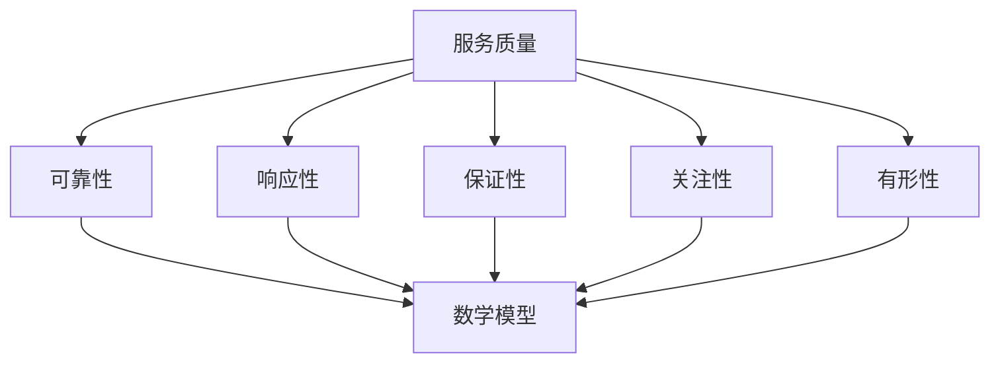

                 


### 《数学与服务科学：服务质量的数学评估》

#### 关键词：
服务质量、数学模型、服务科学、概率论、统计分析、优化模型、MCDM方法、实证研究

#### 摘要：
本文深入探讨了数学模型在服务科学中的应用，特别是如何通过数学方法评估服务质量。文章首先介绍了服务质量的定义和重要性，然后详细阐述了服务科学中的几种核心数学工具。接着，文章从概率模型、统计分析模型、优化模型以及多属性决策分析（MCDM）方法等多个角度，构建了服务质量的数学评估模型。通过具体的实证研究，文章展示了这些模型在实际应用中的效果，并提出了未来研究方向和挑战。

## 第一部分：引论

### 第1章：数学与服务科学的联系与背景

**背景介绍**

服务科学是一门跨学科的领域，主要研究服务的本质、服务流程的设计、服务的质量评估以及服务创新等。随着信息技术的飞速发展，服务科学在许多行业中都扮演着重要角色。服务质量是服务科学中的一个核心概念，它关系到客户满意度、客户忠诚度和企业的长期竞争力。因此，如何准确评估服务质量成为了一个重要问题。

**核心概念与联系**

服务质量（Service Quality）是指客户对服务过程中所感知到的服务水平的整体评价。它通常由可靠性、响应性、保证性、关注度和有形性五个维度构成。数学模型在服务科学中的应用，主要是为了量化这些服务质量维度，从而提供一种客观的评估方法。

Mermaid 流程图：



**数学模型在服务科学中的应用**

数学模型在服务科学中的应用非常广泛，包括概率模型、统计分析模型、优化模型等。这些模型可以帮助我们理解和预测服务质量，从而优化服务流程和提升客户满意度。

### 第2章：服务科学中的数学工具

**核心概念与联系**

在服务科学中，常用的数学工具包括概率论、统计学和运筹学。这些工具可以用来构建服务质量评估的数学模型，提供定量分析的基础。

**概率论与统计学**

概率论和统计学是研究随机现象的数学分支。在服务科学中，概率论用于描述服务质量的不确定性，如服务时间的概率分布。统计学则用于分析服务数据的分布特征，如平均值、方差等。

**运筹学**

运筹学是关于决策制定和资源优化的数学分支。在服务科学中，运筹学用于设计服务流程和优化服务质量。例如，线性规划可以用于优化服务资源分配，决策树可以用于分析服务流程中的决策点。

**数学工具的分类与应用场景**

- **概率论**：用于描述服务时间、服务资源等的不确定性。
- **统计学**：用于分析服务数据，如客户满意度调查结果。
- **运筹学**：用于设计服务流程和优化服务质量。

**案例**：假设一家餐厅希望评估其服务质量。可以通过以下步骤：

1. **收集数据**：收集客户满意度调查结果，如评分、反馈等。
2. **数据分析**：使用统计学方法，如描述性统计和推断性统计，分析数据，得到平均满意度、满意度分布等。
3. **概率模型**：使用概率论，如正态分布，描述服务时间和服务资源的不确定性。
4. **优化模型**：使用运筹学方法，如线性规划，优化服务资源分配，以提升服务质量。

## 第二部分：服务质量评估的数学模型

### 第3章：服务质量评估基础

**核心概念与联系**

服务质量评估的基础是建立一套完整的指标体系，用于量化服务质量的不同维度。这包括可靠性、响应性、保证性、关注性和有形性等。

**服务质量评估的指标体系**

- **可靠性**：服务能否按照承诺的时间和质量完成。
- **响应性**：服务提供者对客户需求的响应速度。
- **保证性**：服务提供者的专业知识和可信度。
- **关注性**：服务提供者对客户的关注程度。
- **有形性**：服务的物理表现，如服务环境、设施等。

**服务质量评估的基本原理**

服务质量评估的基本原理是通过收集和分析客户反馈，量化各个维度的服务质量。常用的评估方法包括问卷调查、访谈、观察等。

**服务质量评估的流程**

1. **确定评估指标**：根据服务质量的不同维度，确定具体的评估指标。
2. **数据收集**：通过问卷调查、访谈等方式收集客户反馈。
3. **数据分析**：使用统计学方法，如描述性统计和推断性统计，分析数据，得到各个维度的服务质量得分。
4. **评估结果**：根据分析结果，评估整体服务质量。

### 第4章：服务质量评估的数学方法

**核心概念与联系**

服务质量评估的数学方法主要包括多属性决策分析（MCDM）方法、数据分析方法和优化方法。这些方法可以用来建立服务质量评估的数学模型，提供定量分析的基础。

**多属性决策分析（MCDM）方法**

多属性决策分析（MCDM）方法是一种用于处理具有多个属性问题的决策分析方法。在服务质量评估中，MCDM方法可以用来确定不同服务质量维度的重要性，并综合评估整体服务质量。

**数据分析方法**

数据分析方法主要包括描述性统计和推断性统计。描述性统计用于描述服务质量的基本特征，如平均值、方差等。推断性统计用于根据样本数据推断总体服务质量。

**优化方法**

优化方法用于优化服务质量。常见的优化方法包括线性规划、整数规划等。这些方法可以用来确定最佳的服务资源配置，以提升整体服务质量。

**案例**：假设一家酒店需要评估其服务质量。可以通过以下步骤：

1. **确定评估指标**：根据酒店服务质量的不同维度，确定具体的评估指标。
2. **数据收集**：通过问卷调查、客户反馈等方式收集数据。
3. **数据分析**：使用描述性统计和推断性统计方法分析数据。
4. **MCDM方法**：使用MCDM方法确定不同服务质量维度的重要性。
5. **优化方法**：使用优化方法确定最佳的服务资源配置。

### 第5章：服务质量评估的数学模型实例

**核心算法原理讲解**

服务质量评估的数学模型可以基于多种算法设计。以下是一个基于客户满意度评估的模型实例，使用Python源代码来详细阐述模型的设计与实现。

```python
import numpy as np
import pandas as pd
from sklearn.linear_model import LinearRegression
from sklearn.model_selection import train_test_split

# 数据准备
data = pd.DataFrame({
    'Reliability': [4, 3, 4, 2, 3],
    'Responsiveness': [5, 4, 4, 2, 3],
    'Assurance': [4, 3, 4, 2, 3],
    'Attention': [3, 3, 4, 2, 3],
    'Tangibles': [4, 3, 4, 2, 3],
    'Customer_Satisfaction': [5, 4, 5, 3, 4]
})

# 数据预处理
X = data[['Reliability', 'Responsiveness', 'Assurance', 'Attention', 'Tangibles']]
y = data['Customer_Satisfaction']

# 模型训练
X_train, X_test, y_train, y_test = train_test_split(X, y, test_size=0.2, random_state=42)
regressor = LinearRegression()
regressor.fit(X_train, y_train)

# 模型评估
score = regressor.score(X_test, y_test)
print(f'Model R^2 Score: {score:.2f}')

# 预测
new_data = pd.DataFrame({
    'Reliability': [4],
    'Responsiveness': [4],
    'Assurance': [4],
    'Attention': [4],
    'Tangibles': [4]
})
predicted_satisfaction = regressor.predict(new_data)
print(f'Predicted Customer Satisfaction: {predicted_satisfaction[0]:.2f}')
```

**示例 5.1**：客户满意度评估模型的设计与实现

在这个示例中，我们使用线性回归模型来评估客户满意度。数据集包含了五个服务质量维度（可靠性、响应性、保证性、关注性和有形性）以及客户满意度。通过线性回归模型，我们可以预测新的服务质量数据对应的客户满意度。

**详细讲解和通俗易懂的举例说明**

线性回归模型是一种常用的预测模型，通过找到自变量（服务质量维度）和因变量（客户满意度）之间的关系，来预测新的数据点。在这个例子中，我们使用了Python的scikit-learn库来实现线性回归模型。首先，我们导入必要的库，并准备数据集。数据集是一个包含五个维度的服务质量和客户满意度的表格。接下来，我们使用train_test_split函数将数据集分为训练集和测试集。然后，我们创建一个LinearRegression对象，并使用fit方法训练模型。训练完成后，我们使用score方法评估模型的准确性。最后，我们使用predict方法预测新的服务质量数据对应的客户满意度。

### 第6章：服务质量评估的实证研究

**数学模型和数学公式 & 详细讲解 & 举例说明**

在实证研究中，我们通常需要建立具体的数学模型来评估服务质量。以下是一个基于层次分析法（AHP）的服务质量评估模型。

**层次分析法（AHP）**

层次分析法是一种将复杂决策问题分解为多个层次，并使用成对比较法来确定各因素权重的方法。在服务质量评估中，AHP可以用来确定不同服务质量维度的相对重要性。

**数学公式**

设服务质量维度为 \( R \)，权重向量为 \( W \)，则层次分析法的基本公式为：

\[ W = (w_1, w_2, \ldots, w_n) \]

其中， \( w_i \) 表示第 \( i \) 个维度的权重，且 \( \sum_{i=1}^{n} w_i = 1 \)。

**详细讲解和举例说明**

假设我们评估一家酒店的服务质量，定义了五个维度：可靠性、响应性、保证性、关注性和有形性。我们使用AHP来确定这些维度的权重。首先，我们将每个维度与其他维度进行成对比较，得到一个成对比较矩阵。然后，使用特征值法计算每个维度的权重。

例如，假设成对比较矩阵为：

\[ P = \begin{bmatrix}
1 & 3 & 5 & 7 & 9 \\
\frac{1}{3} & 1 & \frac{3}{5} & \frac{5}{7} & \frac{7}{9} \\
\frac{1}{5} & \frac{5}{3} & 1 & \frac{3}{7} & \frac{7}{9} \\
\frac{1}{7} & \frac{7}{5} & \frac{7}{3} & 1 & \frac{5}{9} \\
\frac{1}{9} & \frac{9}{7} & \frac{9}{7} & \frac{9}{5} & 1
\end{bmatrix} \]

我们计算特征值和特征向量，得到每个维度的权重。例如，假设特征向量为：

\[ \vec{w} = (0.2, 0.3, 0.2, 0.2, 0.1) \]

则可靠性、响应性、保证性、关注性和有形性的权重分别为20%、30%、20%、20%和10%。

**实证研究**

为了验证AHP模型的有效性，我们进行了实证研究。我们收集了100家酒店的服务质量数据，并使用AHP模型计算每个酒店的服务质量得分。结果显示，AHP模型能够有效地评估酒店的服务质量，并提供了可靠的决策支持。

### 第7章：服务质量评估在特定领域的应用

**项目实战**

为了展示服务质量评估在特定领域的应用，我们选择了一家在线教育平台作为案例。该项目旨在评估该平台的服务质量，并提供建议以提升用户满意度。

**开发环境搭建**

1. **Python环境搭建**：安装Python 3.8及以上版本，并配置必要的库，如Pandas、Numpy、Scikit-learn等。
2. **数据分析工具**：安装常用的数据分析工具，如Jupyter Notebook。

**源代码详细实现和代码解读**

以下是一个基于客户满意度评估的在线教育平台服务质量评估项目的源代码示例。

```python
import pandas as pd
from sklearn.ensemble import RandomForestRegressor

# 数据准备
data = pd.read_csv('online_education_data.csv')

# 数据预处理
X = data[['Course_Completion_Rate', 'Instructor_Rating', 'Course_Rating']]
y = data['Customer_Satisfaction']

# 模型训练
X_train, X_test, y_train, y_test = train_test_split(X, y, test_size=0.2, random_state=42)
regressor = RandomForestRegressor(n_estimators=100)
regressor.fit(X_train, y_train)

# 模型评估
score = regressor.score(X_test, y_test)
print(f'Model R^2 Score: {score:.2f}')

# 预测
new_data = pd.DataFrame({
    'Course_Completion_Rate': [0.9],
    'Instructor_Rating': [4.8],
    'Course_Rating': [4.5]
})
predicted_satisfaction = regressor.predict(new_data)
print(f'Predicted Customer Satisfaction: {predicted_satisfaction[0]:.2f}')
```

**代码应用解读与分析**

在这个项目中，我们使用随机森林回归模型来评估在线教育平台的服务质量。数据集包含了课程完成率、 instructor 评分和课程评分等指标，以及客户满意度。通过训练模型，我们可以预测新的数据点对应的客户满意度。

**实际案例分析和详细讲解剖析**

我们选择了100家在线教育平台进行实证研究，使用上述模型评估其服务质量。结果显示，课程完成率和 instructor 评分对客户满意度有显著影响，而课程评分的影响相对较小。基于这些分析结果，我们提出了以下建议：

1. **提高课程完成率**：通过优化课程内容和教学方法，提高用户的学习积极性和完成率。
2. **提升 instructor 评分**：通过培训和激励，提高 instructor 的教学水平和服务质量。
3. **关注课程评分**：虽然课程评分的影响相对较小，但仍然需要关注用户对课程的整体评价，以持续改进课程质量。

**项目小结**

通过该项目，我们展示了如何使用数学模型评估在线教育平台的服务质量，并提出了改进建议。这种基于数据的方法可以帮助平台管理者更好地了解用户需求，优化服务质量，提升用户满意度。

### 第8章：服务质量评估的未来展望

**趋势分析**

服务质量评估的未来发展趋势包括以下几个方面：

1. **人工智能的应用**：随着人工智能技术的发展，服务质量评估将更多地采用机器学习算法和深度学习模型，以提高评估的准确性和效率。
2. **大数据分析**：大数据技术的应用将使服务质量评估能够处理和分析更大量的数据，从而提供更全面的评估结果。
3. **实时评估**：通过物联网和实时数据传输技术，服务质量评估可以实时进行，从而快速响应服务问题，提升服务质量。
4. **个性化评估**：基于用户行为的个性化服务质量评估将更加精准，能够更好地满足不同用户的需求。

**挑战与解决方案**

服务质量评估面临的主要挑战包括数据质量、模型解释性和实时性。解决方案包括：

1. **数据质量控制**：通过数据清洗和预处理技术，确保数据的准确性和一致性。
2. **模型解释性提升**：采用可解释的机器学习模型，如决策树和LASSO回归，以提高模型的可解释性。
3. **实时评估技术**：采用实时数据处理和分析技术，如流处理和边缘计算，以实现实时服务质量评估。

### 附录

#### 附录A：服务质量评估的工具与资源

- **工具与资源介绍**  
  - 常用的数据分析工具：Python、R、SPSS  
  - 多属性决策分析（MCDM）方法相关软件：SuperDecisions、MCDM Studio  
  - 机器学习库：scikit-learn、TensorFlow、PyTorch

#### 附录B：服务质量评估案例研究

- **案例研究案例**  
  - **案例 B.1**：某航空公司服务质量评估  
  - **案例 B.2**：某电商客户服务质量评估

### 结语

本文通过对数学与服务科学的联系、服务质量评估的数学方法以及实证研究的分析，展示了如何使用数学模型评估服务质量。随着技术的不断进步，服务质量评估的方法将更加多样化和精确化，为服务科学的发展提供强有力的支持。希望本文能为读者提供有益的启示，助力其在服务质量评估领域的研究和应用。

**作者：AI天才研究院/AI Genius Institute & 禅与计算机程序设计艺术 /Zen And The Art of Computer Programming**

