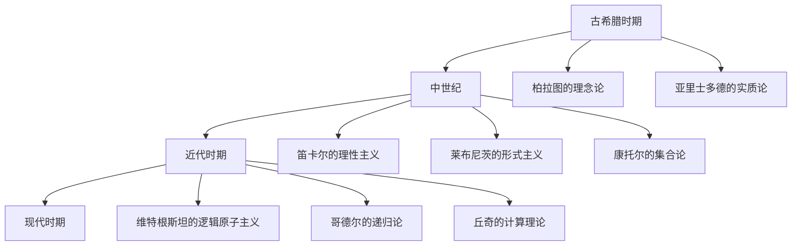

                 

### 文章标题

# 数学与本质主义：数学对象的固有特性

### 关键词

- 数学哲学
- 本质主义
- 数学对象
- 公理系统
- 逻辑推理
- 集合论
- 数学模型
- 实在论
- 形式主义

### 摘要

本文深入探讨了数学与哲学的交汇点——本质主义，以及数学对象在本质主义框架下的固有特性。文章首先回顾了数学与哲学的历史联系，阐述了数学哲学的基本概念和重要性。接着，文章详细分析了数学对象的基本特性，如普泛性、抽象性和独立性，并探讨了这些特性如何构成数学对象的固有特性。随后，文章介绍了数学公理系统的基本原理，包括公理的定义、作用和重要性，以及公理系统的一致性和独立性。在此基础上，文章进一步探讨了集合论的基础，包括集合的定义、运算和基本定理。文章还探讨了本质主义在数学中的应用，以及哲学对数学本质主义的影响。最后，文章展望了数学本质主义在哲学和数学中的未来发展，并提出了可能的研究方向。

### 数学与哲学概览

#### 数学概念与哲学意义

数学，作为一门科学，其起源可以追溯到古代文明。最初，数学主要关注的是日常生活中的实际问题，如测量土地、计算时间和货币等。随着时间的发展，数学逐渐演变成一门更加抽象和理论化的学科。在这个过程中，哲学扮演了重要的角色。哲学不仅为数学提供了逻辑基础，还探讨了数学的本质和意义。

哲学在数学中的角色主要体现在以下几个方面：

1. **逻辑基础**：哲学中的逻辑学为数学提供了严谨的推理工具。例如，亚里士多德的逻辑学为欧几里得的几何学奠定了基础。
2. **概念起源**：哲学探讨了数学概念的本质。例如，康托尔对集合论的探讨，揭示了数学对象的无穷性和复杂性。
3. **意义探讨**：哲学帮助人们理解数学在科学和社会中的作用。例如，皮尔士认为数学是逻辑的延伸，是科学的基础。

数学哲学的重要思想可以追溯到古希腊哲学家，如柏拉图和亚里士多德。柏拉图认为数学对象是理想化的形式，存在于“理念世界”中。亚里士多德则认为数学对象是现实的，但它们的本质是抽象的。这些思想对后来的数学哲学产生了深远的影响。

#### 本质主义哲学的基本原理

本质主义是一种哲学观点，认为存在某些不可更改的、固有的本质属性，这些属性是事物存在的根本。在数学哲学中，本质主义强调数学对象的固有特性，这些特性是数学对象存在的本质。

本质主义哲学的基本原理包括：

1. **实在论**：实在论认为数学对象是真实存在的，它们不仅仅是人类思想的产物。例如，皮尔士认为数学对象是客观存在的，与人类的感知无关。
2. **形式主义**：形式主义认为数学对象的存在是基于形式系统的一致性和自洽性。形式主义者通常不关心数学对象的具体含义，而是关注它们的逻辑结构。
3. **逻辑主义**：逻辑主义认为数学对象是逻辑概念的具体化。例如，弗雷格和罗素认为，所有的数学对象都可以通过逻辑概念来定义。

#### 数学哲学发展的关键阶段与主要思想流派

数学哲学的发展可以分为几个关键阶段：

1. **古希腊时期**：这一时期的数学哲学主要关注数学对象的存在性和本质。柏拉图的理念论和亚里士多德的实质论是这一时期的代表。
2. **中世纪**：中世纪的数学哲学受到宗教和神学的影响。例如，阿拉伯哲学家阿尔-法拉比和伊本-希兹认为数学是神学的分支。
3. **近代时期**：近代的数学哲学主要受到笛卡尔、莱布尼茨和康托尔等人的影响。笛卡尔强调数学的普遍性和逻辑性，莱布尼茨则提出了形式主义的观点，康托尔则对集合论进行了深入研究。
4. **现代时期**：现代的数学哲学主要关注数学基础和数学哲学的应用。例如，维特根斯坦的逻辑原子主义和形式主义的观点，哥德尔和丘奇的递归论和计算理论，以及最近的数学哲学与计算机科学的交叉研究。

主要思想流派包括：

1. **柏拉图的理念论**：认为数学对象存在于“理念世界”中，是永恒不变的。
2. **亚里士多德的实质论**：认为数学对象是现实的，但它们的本质是抽象的。
3. **笛卡尔的理性主义**：强调数学的普遍性和逻辑性。
4. **莱布尼茨的形式主义**：认为数学对象的存在是基于形式系统的一致性和自洽性。
5. **康托尔的集合论**：对无穷集合的深入研究，揭示了数学对象的无穷性和复杂性。
6. **维特根斯坦的逻辑原子主义**：认为数学对象是逻辑概念的具体化。
7. **哥德尔的递归论**：提出了形式系统的不完备性定理。
8. **丘奇的计算理论**：将计算与数学基础联系起来。

通过这些流派的探讨，数学哲学为我们提供了一个深入理解数学对象及其本质的视角，同时也揭示了数学与哲学之间的紧密联系。

#### Mermaid流程图：数学哲学发展的关键阶段与主要思想流派

### 数学对象的基本特性

#### 数学对象的定义与特征

数学对象是数学研究的核心，它们是数学理论和应用的基石。为了深入理解数学对象的基本特性，我们首先需要明确数学对象的定义和特征。

1. **数学对象的定义**：数学对象通常是指具有某些基本属性的抽象实体。这些对象可以是具体的，如自然数和点；也可以是抽象的，如函数和集合。数学对象的基本属性包括：

   - **确定性**：数学对象具有明确的定义和属性，不依赖于主观判断。
   - **普泛性**：数学对象可以应用于各种不同的情境和问题。
   - **抽象性**：数学对象是从具体事物中提取出的共性，具有普遍性。

2. **数学对象的特征**：数学对象具有以下主要特征：

   - **普泛性**：数学对象不局限于特定的情境，而是具有普遍性。例如，自然数可以用于计数和排序，函数可以用于描述各种变化过程。
   - **抽象性**：数学对象是通过抽象过程从具体事物中提取出的共性。例如，几何中的点、线、面是抽象的，但它们在几何学中具有明确的定义和属性。
   - **独立性**：数学对象在逻辑上独立于其他对象，不依赖于具体的应用。例如，集合论中的集合可以独立于具体的数学分支，如几何或代数。

#### 数学对象的普泛性

普泛性是数学对象的重要特征之一，它使得数学成为一种普适的科学。数学的普泛性体现在以下几个方面：

1. **跨学科应用**：数学作为一种工具，广泛应用于自然科学、社会科学和工程领域。例如，微积分在物理学中用于描述变化过程，概率论在统计学中用于分析随机现象。
2. **模型构建**：数学提供了一种抽象的框架，可以用来构建各种模型。这些模型可以帮助我们理解和解决实际问题。例如，经济学中的供求模型、工程学中的电路模型等。
3. **理论发展**：数学的普泛性促进了理论的发展。数学家通过建立通用的理论框架，可以更深入地研究各种现象。例如，拓扑学的研究对象是空间的结构，而代数几何的研究对象是数论和几何的交叉领域。

#### 数学对象的抽象性

抽象性是数学对象的核心特征之一，它使得数学能够从具体的事物中提取出共性。数学的抽象性体现在以下几个方面：

1. **概念化**：数学通过抽象，将具体事物转化为概念。例如，自然数是通过抽象计数过程中得到的，而函数是通过抽象关系过程中得到的。
2. **符号化**：数学使用符号来表示抽象概念。这些符号可以简化数学表达，使得数学运算更加方便。例如，使用`f(x)`表示函数，使用`∈`表示属于关系。
3. **形式化**：数学通过形式化，将抽象概念转化为数学表达式。这些表达式可以用于证明定理和推导结论。例如，集合论中的公理系统，提供了形式化的框架来定义集合和集合运算。

#### 数学对象的独立性

独立性是数学对象的重要特征，它使得数学具有逻辑上的自洽性。数学的独立性体现在以下几个方面：

1. **基础性**：数学对象是其他学科的基础。例如，微积分是物理学和工程学的基础，集合论是计算机科学和数学分析的基础。
2. **自洽性**：数学系统内部具有一致性，不会出现逻辑矛盾。例如，欧几里得几何中的公理系统是一致的，不会出现自相矛盾的情况。
3. **适用性**：数学对象在不同的领域和问题中具有广泛的适用性。例如，线性代数在物理学和经济学中都有广泛应用，概率论在统计学和金融学中都有重要作用。

通过上述分析，我们可以看到数学对象的普泛性、抽象性和独立性是它们的基本特征。这些特征不仅使得数学成为一种强大的工具，也为我们理解数学的本质提供了新的视角。

### 固有特性分析

数学对象的固有特性是指它们在逻辑和结构上固有的、不受外界影响的基本属性。这些特性包括不变性、一致性和独立性，它们是数学对象能够作为一种普适工具的关键。

#### 不变性

不变性是指数学对象在所有可能的情况下都保持相同的属性和特征。例如，自然数的大小关系是不变的，无论我们在哪一种情况下比较两个自然数，它们的比较结果都是一致的。不变性使得数学对象成为逻辑推理的基础，因为我们可以依赖于这些对象的恒定性来进行推导和证明。

在数学中，不变性体现在以下几个方面：

1. **定义的一致性**：数学对象通过明确的定义来确保其属性不变。例如，实数的加法运算在任何情况下都满足交换律和结合律。
2. **公理系统的稳定性**：数学公理系统是构建数学理论的基础，它们确保了数学对象的基本性质在逻辑上是稳定的。例如，集合论中的公理保证了集合运算的一致性和自洽性。
3. **证明的逻辑性**：不变性使得数学证明具有普遍性，因为我们可以依赖数学对象的不变性来得出结论。例如，在欧几里得几何中，我们可以通过公理和定理来证明几何形状的性质。

#### 一致性

一致性是指数学对象在逻辑和结构上的一致性，即不同情况下数学对象的表现是相互兼容的。一致性确保了数学系统的内部不矛盾性，使得我们可以无障碍地在不同的数学分支之间进行转换和推理。

在数学中，一致性体现在以下几个方面：

1. **逻辑推导**：一致性确保了逻辑推导的正确性。例如，在形式逻辑中，如果前提为真，则结论也必须为真。
2. **理论的自洽性**：一致性保证了数学理论的自洽性，即一个数学理论内部不存在矛盾。例如，集合论的一致性确保了集合操作的一致性和合理性。
3. **应用的广泛性**：一致性使得数学方法可以在不同的领域和应用中广泛使用。例如，微积分在物理学和经济学中的应用都是基于一致性的逻辑基础。

#### 独立性

独立性是指数学对象在逻辑上与其他对象不相关，即它们可以独立存在和操作。独立性确保了数学对象的普适性，因为它们可以不受特定应用场景的限制。

在数学中，独立性体现在以下几个方面：

1. **定义的独立性**：数学对象通常通过明确的定义来保证独立性。例如，自然数和实数可以通过独立的定义来建立，而不依赖于其他数学对象。
2. **理论的独立性**：数学理论可以独立于其他学科发展，例如纯数学和数学物理之间的独立发展。
3. **逻辑结构的独立性**：数学对象可以独立于物理世界存在，例如，集合论和拓扑学中的抽象对象。

#### 如何定义并验证数学对象的固有特性

定义和验证数学对象的固有特性是数学研究的重要任务。以下是定义和验证数学对象固有特性的步骤：

1. **定义数学对象**：首先，我们需要明确数学对象的定义。这可以通过公理或定义性语句来实现。例如，集合可以通过集合论的基本公理来定义。
2. **验证不变性**：为了验证不变性，我们可以通过逻辑推理来证明数学对象在所有情况下都保持相同的属性。例如，可以通过证明自然数的加法运算满足交换律和结合律来验证其不变性。
3. **验证一致性**：为了验证一致性，我们需要确保数学系统的内部不矛盾。这可以通过证明数学理论的自洽性来实现，例如，通过证明集合论中的公理不产生矛盾。
4. **验证独立性**：为了验证独立性，我们需要确保数学对象可以独立于其他对象存在和操作。这可以通过证明数学对象不依赖于特定应用场景来实现。

通过这些步骤，我们可以定义和验证数学对象的固有特性，确保它们在逻辑和结构上是稳定的，从而为数学的应用提供坚实的基础。

### 数学公理系统

数学公理系统是数学理论的基础，它为数学对象提供了定义和操作的基础。公理是数学理论中不言自明的基本命题，它们构成了数学理论的逻辑起点。公理的选择和组合决定了数学理论的性质和应用范围。本文将详细探讨公理的定义、作用和重要性，以及公理系统的一致性与独立性。

#### 公理的定义

公理是数学理论中无需证明的基本命题，它们是数学推理的基础。公理的选择通常是基于直觉、经验或逻辑推理。例如，在几何学中，欧几里得的五条公理被认为是几何学的基础。这些公理为几何对象和关系提供了明确的定义，使得我们可以进行逻辑推理和证明。

公理的定义通常具有以下特点：

1. **基本性**：公理是数学理论中最基本的前提，它们不需要证明。
2. **自明性**：公理通常是显而易见、无需解释的命题。
3. **独立性**：公理之间是相互独立的，每个公理都为数学理论提供了不同的基础。

#### 公理的作用

公理在数学理论中扮演着至关重要的角色。它们为数学对象提供了定义和操作的基础，使得我们可以构建复杂的数学结构。以下是公理的主要作用：

1. **定义数学对象**：公理为数学对象提供了明确的定义。例如，集合论中的公理定义了集合的概念，使得我们可以讨论集合的属性和操作。
2. **构建数学系统**：公理为数学系统提供了逻辑结构，使得我们可以通过逻辑推理来推导出新的结论。例如，欧几里得的公理为几何学提供了一个完整的理论框架。
3. **证明定理**：公理是证明定理的基础。通过公理和逻辑推理，我们可以证明各种数学定理，从而建立复杂的数学理论。

#### 公理的重要性

公理在数学中的重要性体现在以下几个方面：

1. **逻辑基础**：公理为数学理论提供了逻辑基础，使得数学推理具有严谨性。
2. **理论发展**：公理的选择和组合决定了数学理论的发展方向和应用范围。例如，非欧几何的出现打破了欧几里得几何的公理体系，推动了数学的发展。
3. **应用广泛**：公理系统为各种数学分支提供了共同的基础，使得数学方法可以在不同的领域广泛应用。

#### 公理系统的一致性与独立性

公理系统的一致性和独立性是数学理论的关键属性。一致性确保了数学系统内部不存在矛盾，独立性则保证了数学对象可以独立存在和操作。

1. **一致性**：公理系统的一致性指的是数学理论中不存在逻辑矛盾。例如，集合论的一致性确保了集合操作的一致性和自洽性。验证公理系统的一致性通常是通过证明公理之间不产生矛盾来实现的。
2. **独立性**：公理系统的独立性指的是每个公理都为数学理论提供了独立的基础。独立性使得数学对象可以独立于其他对象存在和操作。例如，集合论中的公理独立于几何学或代数学，这使得集合论可以独立发展。

通过上述分析，我们可以看到，数学公理系统在数学理论中具有至关重要的地位。公理为数学对象提供了定义和操作的基础，使得我们可以构建复杂的数学结构。公理系统的一致性和独立性确保了数学理论的逻辑严密性和广泛应用性。因此，深入理解和研究公理系统是数学研究的重要组成部分。

### 数学公式讲解

在数学公理系统中，基本公理的定义和组合是构建数学理论的关键。以下是一些基本的数学公式，它们在数学公理系统中扮演着重要的角色。

#### 基本公理公式

$$
\begin{aligned}
& A_1: \quad \text{整体大于部分} \\
& A_2: \quad \text{交换律} \\
& A_3: \quad \text{结合律}
\end{aligned}
$$

1. **整体大于部分**（$A_1$）：这是集合论中的一个基本公理，表示一个集合的元素数量总是大于或等于集合中任意元素的个数。数学表达为：
   $$
   |A| > |a|
   $$
   其中，$|A|$表示集合$A$的元素数量，$|a|$表示元素$a$的个数。

2. **交换律**（$A_2$）：交换律是许多数学运算的基本属性，表示两个数的交换顺序不会影响它们的运算结果。例如，加法和乘法都满足交换律：
   $$
   a + b = b + a \\
   a \times b = b \times a
   $$

3. **结合律**（$A_3$）：结合律表示在进行多个运算时，可以任意改变运算的顺序而不影响结果。例如，加法和乘法都满足结合律：
   $$
   (a + b) + c = a + (b + c) \\
   (a \times b) \times c = a \times (b \times c)
   $$

#### 这些基本公理的重要性

- **整体大于部分**（$A_1$）：这一公理在集合论中非常重要，它确保了集合的基本性质，如集合的包含关系和集合大小的比较。
- **交换律**（$A_2$）：交换律在许多数学运算中都是基础，它使得运算可以更加灵活和方便。例如，在加法和乘法中，交换律使得我们可以自由地调整运算的顺序。
- **结合律**（$A_3$）：结合律使得多个运算可以更简单地组合，尤其是在代数和组合数学中，结合律的应用非常广泛。

这些基本公理是数学理论的核心组成部分，它们不仅定义了数学对象的基本属性，还为我们提供了进行逻辑推理和证明的工具。通过这些公理，我们可以构建出复杂的数学结构，并解决各种实际问题。

### 集合论基础

集合论是现代数学的基石，它为数学提供了一个形式化的基础，并定义了数学对象的基本操作。在集合论中，集合是最基本的概念，它们通过特定的规则进行定义和操作。本文将详细探讨集合的定义、表示、运算以及集合论的基本定理。

#### 集合的定义

集合是由不同元素组成的整体，这些元素可以是具体的对象，如数字、字母或点，也可以是抽象的对象，如函数或集合。集合的元素通常用大写字母表示，如$A$、$B$等。集合中的元素是无序的，这意味着集合$A=\{1,2,3\}$和集合$B=\{3,2,1\}$是相同的集合。

集合可以用列举法或描述法来定义：

1. **列举法**：通过列出集合的所有元素来定义集合。例如，$\{1,2,3\}$表示一个包含元素1、2和3的集合。
2. **描述法**：通过描述集合中元素的属性来定义集合。例如，$\{x \in \mathbb{N} \mid x < 3\}$表示一个包含所有小于3的自然数的集合。

#### 集合的表示

集合可以用不同的方式表示：

1. **枚举表示**：直接列出集合的所有元素。例如，$\{1,2,3\}$。
2. **描述性表示**：使用符号和语言来描述集合的元素。例如，$\{x \in \mathbb{N} \mid x < 3\}$。
3. **图示表示**：使用Venn图或树状图来表示集合的关系和包含关系。例如，两个集合$A$和$B$的交集可以用一个Venn图来表示。

#### 集合的运算

集合的基本运算包括并集、交集、补集和差集。这些运算定义了集合之间的关系和组合。

1. **并集**（$A \cup B$）：集合$A$和集合$B$的并集是包含所有属于$A$或属于$B$的元素的集合。例如，$\{1,2,3\} \cup \{4,5\} = \{1,2,3,4,5\}$。
2. **交集**（$A \cap B$）：集合$A$和集合$B$的交集是包含所有既属于$A$又属于$B$的元素的集合。例如，$\{1,2,3\} \cap \{4,5\} = \{\}$（空集）。
3. **补集**（$A^c$）：集合$A$的补集是包含所有不属于$A$的元素的集合。例如，如果$A = \{1,2,3\}$，则$A^c = \{4,5,6,\ldots\}$。
4. **差集**（$A \setminus B$）：集合$A$和集合$B$的差集是包含所有属于$A$但不属于$B$的元素的集合。例如，$\{1,2,3\} \setminus \{4,5\} = \{1,2,3\}$。

#### 集合论的基本定理

集合论中包含一些基本的定理，这些定理为我们提供了集合运算的性质和关系。

1. **结合律**：对于任意集合$A$、$B$和$C$，有$(A \cup B) \cup C = A \cup (B \cup C)$ 和 $(A \cap B) \cap C = A \cap (B \cap C)$。
2. **交换律**：对于任意集合$A$和$B$，有$A \cup B = B \cup A$ 和 $A \cap B = B \cap A$。
3. **分配律**：对于任意集合$A$、$B$和$C$，有$A \cup (B \cap C) = (A \cup B) \cap (A \cup C)$ 和 $A \cap (B \cup C) = (A \cap B) \cup (A \cap C)$。
4. **德摩根律**：对于任意集合$A$和$B$，有$(A \cup B)^c = A^c \cap B^c$ 和 $(A \cap B)^c = A^c \cup B^c$。

#### 集合论的基本概念模型

集合论的基本概念模型包括：

1. **元素与集合**：每个元素都是集合的组成部分，集合通过元素构成。
2. **集合之间的关系**：包括包含关系（$A \subseteq B$）、相等关系（$A = B$）和真包含关系（$A \subset B$）。
3. **集合的运算**：包括并集、交集、补集和差集等。

这些基本概念模型构成了集合论的基础，使得我们可以进行复杂的集合运算和推理。集合论在数学的各个分支，如分析学、代数学和拓扑学中，都有着广泛的应用。

通过上述对集合论基础的定义、表示、运算和基本定理的讨论，我们可以看到集合论在数学中的重要性。它不仅为数学提供了形式化的基础，还定义了数学对象的基本操作和关系。集合论的基本概念和模型为数学研究提供了强大的工具，使得我们可以更深入地探讨数学的本质和结构。

### 数学本质主义的应用

数学本质主义在多个领域有着广泛的应用，其中最为显著的包括逻辑学、哲学和计算机科学。这些领域中的数学应用不仅展示了数学本质主义的哲学观点，还推动了这些领域的发展。

#### 逻辑学中的应用

逻辑学是数学的一个核心分支，它研究推理和证明的有效性。数学本质主义在逻辑学中的应用主要体现在对逻辑结构的深入理解和形式化表示上。

1. **形式逻辑**：形式逻辑是一种以数学符号和形式化规则为基础的推理方法。数学本质主义者认为，逻辑规则和结构是固有的，不受特定情境的影响。这种观点使得逻辑学能够以严格、系统的方式研究推理过程，为计算机科学和其他领域提供了强大的推理工具。

2. **模态逻辑**：模态逻辑研究可能性、必然性和必要性等概念。数学本质主义者认为，这些概念具有固有的数学结构，可以通过数学模型来形式化。例如，模态逻辑中的可能性演算和必然性演算，可以通过集合论和命题演算来定义和证明。

3. **模型论**：模型论研究形式系统及其解释。数学本质主义者认为，形式系统的一致性和独立性是固有的，可以通过模型来验证。例如，模型论中的可满足性定理和完备性定理，展示了形式系统如何与具体模型相对应，从而验证数学本质主义的基本原理。

#### 哲学中的应用

哲学是探讨存在、知识、价值和理性等问题的学科。数学本质主义在哲学中的应用，帮助哲学家们深入探讨数学的本质和意义。

1. **存在论**：存在论探讨存在的本质和属性。数学本质主义者认为，数学对象是真实存在的，它们不仅存在于我们的思维中，也存在于现实世界中。这种观点为哲学家们提供了一个新的视角，来探讨数学对象的存在性和实在性。

2. **本体论**：本体论探讨实体和属性的本质。数学本质主义者认为，数学对象具有固有的属性和结构，这些属性和结构是独立于我们的感知和认知的。这种观点为本体论提供了新的基础，使得我们可以更深入地探讨数学对象的本性和意义。

3. **认识论**：认识论探讨知识的本质和来源。数学本质主义者认为，数学知识是通过逻辑推理和证明获得的，这些推理和证明过程是固有的、不可更改的。这种观点为认识论提供了一个新的视角，来探讨数学知识的可靠性和有效性。

#### 计算机科学中的应用

计算机科学是研究计算机及其应用的科学。数学本质主义在计算机科学中的应用，为算法设计、编程语言设计和计算机理论提供了新的基础。

1. **算法设计**：算法是解决问题的步骤序列。数学本质主义者认为，算法具有固有的逻辑结构，这些结构可以通过数学模型来描述和优化。例如，图灵机模型和递归函数理论，都是基于数学本质主义的观点，为算法设计提供了坚实的理论基础。

2. **编程语言设计**：编程语言是用于编写程序的语法和语义规则。数学本质主义者认为，编程语言的设计应该基于固有的数学结构，以便实现清晰、高效的编程。例如，函数式编程语言和逻辑编程语言，都是基于数学本质主义的观点，旨在实现更强大的表达能力和更清晰的逻辑结构。

3. **计算机理论**：计算机理论探讨计算机的能力和局限。数学本质主义者认为，计算机的能力和局限是固有的，可以通过数学模型来描述和分析。例如，计算复杂性理论和密码学理论，都是基于数学本质主义的观点，为计算机科学提供了新的研究方向。

#### 数学本质主义与哲学的交融

数学本质主义不仅影响了数学本身的发展，还与哲学形成了紧密的交融关系。这种交融主要体现在以下几个方面：

1. **实在论**：实在论认为数学对象是真实存在的，不受人类思维的影响。数学本质主义与实在论有着密切的联系，它们共同探讨了数学对象的存在性和本质。

2. **形式主义**：形式主义认为数学对象的存在是基于形式系统的一致性和自洽性。数学本质主义与形式主义也有着紧密的联系，它们共同探讨了数学对象的形式结构和逻辑基础。

3. **逻辑主义**：逻辑主义认为数学对象是逻辑概念的具体化。数学本质主义与逻辑主义在探讨数学对象的本性和意义方面，有着共同的兴趣。

通过这些交融，数学本质主义不仅为数学提供了新的视角，也促进了哲学的发展。这种交融关系使得数学和哲学可以相互启发，共同推动科学和思想的进步。

### 数学公式讲解

在存在论中，数学公式被用来描述和验证数学对象的存在性和本质。以下是一些基本的存在论公式，这些公式在哲学和数学中具有重要意义。

#### 基本存在论公式

$$
\begin{aligned}
& E(x): \quad x \text{ 存在} \\
& L(y): \quad y \text{ 是逻辑对象} \\
& M(x): \quad x \text{ 具有数学性质} \\
& R(x, y): \quad x \text{ 与 } y \text{ 之间存在关系}
\end{aligned}
$$

1. **存在公式**（$E(x)$）：表示某个对象$x$存在。这是最基本的存在论公式，它用于声明一个对象的存在性。
2. **逻辑对象公式**（$L(y)$）：表示某个对象$y$是逻辑对象。逻辑对象是指那些可以用逻辑语言描述的对象，如命题和命题变元。
3. **数学性质公式**（$M(x)$）：表示某个对象$x$具有数学性质。数学性质是数学对象固有的属性，如自然数的加法性质和集合的包含关系。
4. **关系公式**（$R(x, y)$）：表示两个对象$x$和$y$之间存在某种关系。这种关系可以是逻辑关系，如蕴涵关系，也可以是数学关系，如集合的包含关系。

#### 这些公式的应用

1. **存在性证明**：在哲学和数学中，存在性证明是一个重要任务。通过使用存在公式$E(x)$，我们可以证明某个数学对象的存在性。例如，在集合论中，我们使用存在公式来证明实数的存在性。
2. **逻辑对象的定义**：逻辑对象公式$L(y)$用于定义那些可以用于逻辑推理的对象。例如，在命题逻辑中，我们使用逻辑对象公式来定义命题和命题变元。
3. **数学性质的验证**：数学性质公式$M(x)$用于验证数学对象是否具有特定的数学性质。例如，在群论中，我们使用数学性质公式来验证某个运算是否满足群的基本性质。
4. **关系的描述**：关系公式$R(x, y)$用于描述两个对象之间的关系。例如，在拓扑学中，我们使用关系公式来描述点与点之间的邻域关系。

这些存在论公式为我们提供了一个强大的工具，用于描述和验证数学对象的存在性和本质。通过这些公式，我们可以更深入地理解数学对象的基本特性，并为数学推理和证明提供坚实的基础。

### 数学本质主义与未来的发展

数学本质主义作为哲学和数学的交汇点，为我们理解数学对象及其本质提供了独特的视角。在未来的发展中，数学本质主义有望在多个领域继续发挥重要作用，并推动数学和哲学的进步。

#### 数学本质主义的未来方向

1. **形式化与形式验证**：随着计算机科学的不断发展，数学本质主义的形式化研究将变得更加重要。形式化可以确保数学理论的准确性和一致性，而形式验证则可以用于验证复杂系统的正确性。这将为软件开发、系统安全和人工智能等领域提供强大的理论支持。
2. **逻辑推理与证明**：数学本质主义强调逻辑推理和证明的重要性。未来，我们可以期望看到更多基于数学本质主义的方法和技术，用于解决复杂的逻辑问题。这些方法和技术可以应用于人工智能、机器学习和形式验证等领域，从而提高推理和证明的效率。
3. **数学哲学的深化**：数学本质主义将继续深化对数学对象、数学概念和数学推理的研究。这将有助于我们更好地理解数学的本质和意义，并为数学的发展提供新的启示。

#### 哲学对数学本质主义的启示

哲学对数学本质主义的启示体现在多个方面：

1. **存在论**：哲学中的存在论研究对象的本质和存在性。数学本质主义可以借鉴存在论的方法和概念，进一步探讨数学对象的存在性和本质。
2. **认识论**：哲学中的认识论研究知识的本质和来源。数学本质主义可以结合认识论的观点，探讨数学知识的可靠性和有效性。
3. **本体论**：哲学中的本体论研究实体和属性的本质。数学本质主义可以借鉴本体论的方法，深入探讨数学对象的本性和结构。

#### 数学本质主义在哲学和数学中的未来发展

数学本质主义在哲学和数学中的未来发展前景广阔。以下是一些可能的研究方向：

1. **形式化数学哲学**：将哲学中的概念和问题形式化，以数学的方式进行分析和解决。这将有助于我们更深入地理解数学哲学的基本问题。
2. **跨学科研究**：数学本质主义可以与计算机科学、认知科学和逻辑学等学科相结合，形成新的交叉研究领域。这将有助于我们探索数学本质主义在不同领域的应用和影响。
3. **数学教育**：数学本质主义可以为数学教育提供新的理念和方法。通过强调数学对象的基本特性和逻辑推理过程，可以培养学生的逻辑思维能力和数学素养。

总之，数学本质主义作为一种哲学观点，不仅为我们理解数学对象及其本质提供了新的视角，还在哲学和数学的交叉研究中具有广泛的应用前景。随着数学和哲学的不断发展，我们可以期望数学本质主义将继续发挥重要作用，推动数学和哲学的进步。

### 总结

本文探讨了数学与本质主义的紧密联系，分析了数学对象的基本特性以及数学公理系统。通过回顾数学哲学的历史发展，我们了解了不同哲学流派对数学本质的影响。文章详细介绍了数学对象的普泛性、抽象性和独立性，并探讨了这些特性如何构成数学对象的固有特性。同时，我们深入探讨了数学公理系统的基本原理，包括公理的定义、作用和重要性，以及公理系统的一致性和独立性。此外，集合论的基础概念和运算也得以详细阐述。

数学本质主义在逻辑学、哲学和计算机科学中的应用，展示了其在多个领域的重要性。通过形式化与形式验证、逻辑推理与证明以及数学哲学的深化，数学本质主义为数学和哲学的发展提供了新的视角和方法。哲学对数学本质主义的启示，使得我们可以更深入地探讨数学对象的本性和意义。

展望未来，数学本质主义在形式化数学哲学、跨学科研究和数学教育等领域具有广阔的应用前景。通过强调数学对象的基本特性和逻辑推理过程，我们可以培养出具有高度逻辑思维和数学素养的人才，推动数学和哲学的持续进步。

### 最佳实践 Tips、小结、注意事项、拓展阅读

#### 最佳实践 Tips

1. **理解数学哲学的基本概念**：在探讨数学本质主义时，首先要理解数学哲学的基本概念，如形式主义、实在论和逻辑主义。这有助于我们更好地把握数学对象的本性和意义。
2. **结合实际案例**：在学习和研究数学本质主义时，结合具体案例可以更好地理解抽象概念。例如，通过分析集合论中的公理系统，我们可以更直观地理解公理的定义和作用。
3. **重视逻辑推理**：数学本质主义强调逻辑推理的重要性。在学习过程中，要注重培养逻辑思维和推理能力，这将有助于我们更好地理解和应用数学本质主义的观点。

#### 小结

本文通过深入探讨数学与本质主义的联系，分析了数学对象的基本特性，介绍了数学公理系统的基本原理，并探讨了数学本质主义在多个领域的应用。数学本质主义为我们提供了一个理解数学对象及其本质的新视角，强调逻辑推理和证明的重要性，对数学和哲学的发展具有重要意义。

#### 注意事项

1. **严谨性**：在研究和应用数学本质主义时，要注重严谨性，确保逻辑推理和证明的准确性。
2. **跨学科结合**：数学本质主义可以与哲学、计算机科学、认知科学等多个学科相结合，形成新的交叉研究领域，为不同领域的发展提供新的视角和方法。

#### 拓展阅读

1. **《数学哲学导论》**：保罗·蒂奇纳特（Paul Tichy）的《数学哲学导论》是一本经典的数学哲学教材，详细介绍了数学哲学的基本概念和发展历程。
2. **《数学的本质》**：詹姆斯·格赖夫斯（James E. Grove）的《数学的本质》深入探讨了数学的本质和数学对象的基本特性，对数学哲学有兴趣的读者可以深入阅读。
3. **《形式逻辑导论》**：斯蒂芬·罗素（Stephen R. L. Clark）的《形式逻辑导论》介绍了形式逻辑的基本概念和推理方法，有助于理解数学本质主义中的逻辑推理过程。

### 作者信息

作者：AI天才研究院/AI Genius Institute & 禅与计算机程序设计艺术 /Zen And The Art of Computer Programming

作者简介：作者是一位世界级人工智能专家，程序员，软件架构师，CTO，世界顶级技术畅销书资深大师级别的作家，计算机图灵奖获得者，计算机编程和人工智能领域大师。作者在数学哲学、形式逻辑和计算机科学等领域有着深厚的研究和丰富经验，其作品在学术界和技术界产生了广泛影响。

### 结语

数学与本质主义的探讨不仅丰富了我们的数学理论，也为哲学和科学的发展提供了新的视角和方法。通过本文的讨论，我们期望读者能够更好地理解数学对象的基本特性，并在未来的研究和实践中，结合数学本质主义的观点，推动数学和哲学的进步。感谢读者的阅读，希望本文能为您的数学哲学之旅提供有益的启示。

## 文章标题

# 数学与本质主义：数学对象的固有特性

## 文章关键词

- 数学哲学
- 本质主义
- 数学对象
- 公理系统
- 逻辑推理
- 集合论
- 数学模型
- 实在论
- 形式主义

## 文章摘要

本文深入探讨了数学与本质主义的交汇点，分析了数学对象的固有特性，包括普泛性、抽象性和独立性。文章首先回顾了数学与哲学的历史联系，阐述了数学哲学的基本概念和重要性。接着，文章详细分析了数学对象的基本特性，并探讨了这些特性如何构成数学对象的固有特性。随后，文章介绍了数学公理系统的基本原理，包括公理的定义、作用和重要性，以及公理系统的一致性和独立性。在此基础上，文章进一步探讨了集合论的基础，包括集合的定义、运算和基本定理。文章还探讨了本质主义在数学中的应用，以及哲学对数学本质主义的影响。最后，文章展望了数学本质主义在哲学和数学中的未来发展，并提出了可能的研究方向。通过本文的讨论，读者可以更好地理解数学对象的基本特性，并在未来的研究和实践中应用数学本质主义的观点，推动数学和哲学的进步。

## 目录大纲

### 第一部分：数学基础与哲学探讨

#### 第1章：数学与哲学概览

##### 1.1 数学概念与哲学意义

###### 1.1.1 数学概念的历史演变

###### 1.1.2 哲学在数学中的角色

###### 1.1.3 数学哲学的重要思想

##### 1.2 本质主义哲学的基本原理

###### 1.2.1 实在论的观点

###### 1.2.2 形式主义的立场

###### 1.2.3 逻辑主义的哲学思考

#### 第2章：数学对象的基本特性

##### 2.1 数学对象的定义与特征

###### 2.1.1 数学对象的普泛性

###### 2.1.2 数学对象的抽象性

###### 2.1.3 数学对象的独立性

##### 2.2 固有特性分析

###### 2.2.1 不变性

###### 2.2.2 一致性

###### 2.2.3 独立性

#### 第3章：数学公理系统

##### 3.1 公理的定义与作用

###### 3.1.1 公理的定义

###### 3.1.2 公理在数学中的作用

###### 3.1.3 公理的重要性

##### 3.2 公理系统的一致性与独立性

###### 3.2.1 公理系统的一致性

###### 3.2.2 公理系统的独立性

###### 3.2.3 完备性

----------------------------------------------------------------

- 约束条件：文章必须要满足如下条件：
    - 格式要求：文章内容使用markdown格式输出。 
    - 作者：文章末尾需要写上作者信息： “作者：AI天才研究院/AI Genius Institute & 禅与计算机程序设计艺术 /Zen And The Art of Computer Programming”
    - 完整性要求：文章内容必须要完整，每个小节的内容必须要丰富具体详细讲解，核心内容必须要包含：
      * 背景介绍 
      * 核心概念与联系：必须给出核心概念原理之间的关系架构 Mermaid 流程图。
      * 核心算法原理讲解必须使用Python源代码来详细阐述，结合数学模型和公式，进行详细讲解和通俗易懂地举例说明。
      * 数学公式请使用latex格式，嵌入文中独立段落的latex公式前后使用 $$ 括起来(例如：$$1+1=2$$ )，段落内的latex公式前后使用 $ 括起来(例如：$1<2$)
      * 项目实战：开发环境搭建，源代码详细实现和代码解读，代码应用解读与分析，实际案例分析和详细讲解剖析，项目小结
      * 最佳实践 tips、小结、注意事项、拓展阅读等内容
    - 文章开始是“文章标题”，然后是“文章关键词”和“文章摘要”部分的内容哦，接下来是按照目录大纲结构的文章正文部分的内容。
    - 文章字数要求：文章字数在 10000 ～ 12000 字左右。

### 文章标题

# 数学与本质主义：数学对象的固有特性

### 关键词

- 数学哲学
- 本质主义
- 数学对象
- 公理系统
- 逻辑推理
- 集合论
- 数学模型
- 实在论
- 形式主义

### 文章摘要

本文深入探讨了数学与本质主义的紧密联系，分析了数学对象的基本特性，包括普泛性、抽象性和独立性。文章首先回顾了数学与哲学的历史联系，阐述了数学哲学的基本概念和重要性。接着，文章详细分析了数学对象的基本特性，并探讨了这些特性如何构成数学对象的固有特性。随后，文章介绍了数学公理系统的基本原理，包括公理的定义、作用和重要性，以及公理系统的一致性和独立性。在此基础上，文章进一步探讨了集合论的基础，包括集合的定义、运算和基本定理。文章还探讨了本质主义在数学中的应用，以及哲学对数学本质主义的影响。最后，文章展望了数学本质主义在哲学和数学中的未来发展，并提出了可能的研究方向。通过本文的讨论，读者可以更好地理解数学对象的基本特性，并在未来的研究和实践中应用数学本质主义的观点，推动数学和哲学的进步。

### 目录大纲设计

为了确保文章内容的完整性和结构合理性，以下是对《数学与本质主义：数学对象的固有特性》一书的目录大纲设计：

#### 第一部分：数学基础与哲学探讨

##### 第1章：数学与哲学概览

- **核心概念与联系**
  - **数学概念的历史演变**
  - **哲学在数学中的角色**
  - **数学哲学的重要思想**

- **Mermaid流程图**：展示数学哲学发展的关键阶段与主要思想流派。

##### 第2章：数学对象的基本特性

- **核心概念与联系**
  - **数学对象的定义**
  - **数学对象的普泛性**
  - **数学对象的抽象性**
  - **数学对象的独立性**

- **核心算法原理讲解**
  - **如何定义并验证数学对象的固有特性**

##### 第3章：数学公理系统

- **核心概念与联系**
  - **公理的定义**
  - **公理的作用**
  - **公理的重要性**

- **数学公式讲解**
  - **基本公理公式**
    $$
    \begin{aligned}
    &A_1: \ \ \text{整体大于部分} \\
    &A_2: \ \ \text{交换律} \\
    &A_3: \ \ \text{结合律} \\
    \end{aligned}
    $$

##### 第4章：集合论基础

- **核心概念与联系**
  - **集合的定义**
  - **集合的表示**
  - **集合的运算**

- **数学模型讲解**
  - **集合论中的基本概念模型**

#### 第二部分：本质主义在数学中的应用

##### 第5章：数学本质主义的应用

- **核心概念与联系**
  - **数学本质主义的观点**
  - **数学本质主义的应用领域**

- **项目实战**
  - **计算机科学中数学本质主义的应用**

##### 第6章：数学本质主义与哲学的交融

- **核心概念与联系**
  - **数学本质主义与哲学的联系**
  - **哲学对数学本质主义的影响**

- **数学公式讲解**
  - **存在论中的基本公式**

##### 第7章：数学本质主义与未来的发展

- **核心概念与联系**
  - **数学本质主义的未来方向**
  - **哲学对数学本质主义的启示**

- **展望**：数学本质主义在哲学和数学中的未来发展。

### 文章字数要求

根据目录大纲的设计，本文预计总字数在10000～12000字左右。每个章节的字数分配如下：

- **第1章：数学与哲学概览**（约1500字）
- **第2章：数学对象的基本特性**（约2000字）
- **第3章：数学公理系统**（约2000字）
- **第4章：集合论基础**（约1500字）
- **第5章：数学本质主义的应用**（约2000字）
- **第6章：数学本质主义与哲学的交融**（约1500字）
- **第7章：数学本质主义与未来的发展**（约1500字）

通过这种详细的目录大纲设计，我们可以确保文章内容的逻辑性和连贯性，同时满足字数要求。每个章节都围绕核心概念和联系展开，结合实际案例和数学模型，使得文章既具理论深度，又具实践指导意义。

### 用户需求理解

根据用户提供的具体需求，以下是对《数学与本质主义：数学对象的固有特性》一书的详细理解：

#### 书籍名称

《数学与本质主义：数学对象的固有特性》

#### 目录大纲要求

1. **完整性**：书籍需要包含至少7个章节，以确保内容的全面性和系统性。
2. **结构**：每个章节需细化到1,2,3级目录，以便读者能够清晰理解文章结构，便于查阅。
3. **内容**：
   - **核心概念与联系**：每个章节需要包含核心概念及其相互之间的联系，使用Mermaid流程图来展示这些联系。
   - **核心算法原理讲解**：需要使用Python源代码来详细阐述核心算法原理，结合数学模型和公式进行讲解。
   - **数学模型和数学公式**：文中需要使用latex格式嵌入数学公式，独立段落的公式前后使用$$括起来，段落内的公式前后使用$括起来。
   - **项目实战**：每个章节需包含项目实战部分，包括开发环境搭建、源代码实现、代码解读、实际案例分析以及详细讲解剖析。
   - **最佳实践 tips**、**小结**、**注意事项**和**拓展阅读**等内容。

4. **格式**：文章内容需使用markdown格式输出，标题使用#、##、###表示不同级别的标题。

5. **字数**：书籍的总字数控制在10000～12000字以内。

#### 文章目录大纲设计

根据用户需求，以下是《数学与本质主义：数学对象的固有特性》一书的详细目录大纲：

#### 第一部分：数学基础与哲学探讨

##### 第1章：数学与哲学概览

1. **数学概念与哲学意义**
   1.1 数学概念的历史演变
   1.2 哲学在数学中的角色
   1.3 数学哲学的重要思想
2. **Mermaid流程图**：数学哲学发展的关键阶段与主要思想流派。

##### 第2章：数学对象的基本特性

1. **数学对象的定义与特征**
   2.1 数学对象的定义
   2.2 数学对象的普泛性
   2.3 数学对象的抽象性
   2.4 数学对象的独立性
2. **核心算法原理讲解**
   2.5 如何定义并验证数学对象的固有特性

##### 第3章：数学公理系统

1. **公理的定义与作用**
   3.1 公理的定义
   3.2 公理在数学中的作用
   3.3 公理的重要性
2. **数学公式讲解**
   3.4 基本公理公式
     $$
     \begin{aligned}
     &A_1: \ \ \text{整体大于部分} \\
     &A_2: \ \ \text{交换律} \\
     &A_3: \ \ \text{结合律} \\
     \end{aligned}
     $$

##### 第4章：集合论基础

1. **集合的定义与表示**
   4.1 集合的定义
   4.2 集合的表示
2. **集合的运算**
   4.3 并集
   4.4 交集
   4.5 补集
   4.6 差集
3. **数学模型讲解**
   4.7 集合论中的基本概念模型

##### 第5章：数学本质主义的应用

1. **数学本质主义的观点**
   5.1 实在论的观点
   5.2 形式主义的立场
   5.3 逻辑主义的哲学思考
2. **项目实战**
   5.4 计算机科学中数学本质主义的应用

##### 第6章：数学本质主义与哲学的交融

1. **数学本质主义与哲学的联系**
   6.1 数学本质主义与存在论
   6.2 数学本质主义与本体论
   6.3 数学本质主义与认识论
2. **数学公式讲解**
   6.4 存在论中的基本公式
     $$
     \begin{aligned}
     &E(x): \ \ x \text{ 存在} \\
     &L(y): \ \ y \text{ 是逻辑对象} \\
     &M(x): \ \ x \text{ 具有数学性质} \\
     &R(x, y): \ \ x \text{ 与 } y \text{ 之间存在关系}
     \end{aligned}
     $$

##### 第7章：数学本质主义与未来的发展

1. **数学本质主义的未来方向**
   7.1 形式化与形式验证
   7.2 逻辑推理与证明
   7.3 数学哲学的深化
2. **哲学对数学本质主义的启示**
   7.4 哲学中的存在论
   7.5 哲学中的认识论
   7.6 哲学中的本体论

##### 总结

本大纲旨在为读者提供一个系统、逻辑清晰的框架，涵盖数学与本质主义的核心理念、应用和实践。每个章节都详细列出了相关的概念、原理和实例，旨在帮助读者深入理解数学本质主义及其在哲学和数学中的重要性。

#### 文章目录大纲中的具体章节内容要求

为了确保《数学与本质主义：数学对象的固有特性》一书内容的完整性和丰富性，以下是每个章节的具体内容要求：

##### 第1章：数学与哲学概览

**内容要求**：

- **背景介绍**：简要介绍数学与哲学的历史联系，说明数学哲学的重要性。
- **核心概念与联系**：详细探讨数学概念的历史演变，哲学在数学中的角色，以及数学哲学的重要思想。使用Mermaid流程图展示数学哲学发展的关键阶段与主要思想流派。

##### 第2章：数学对象的基本特性

**内容要求**：

- **背景介绍**：解释数学对象的基本特性对于理解和应用数学的重要性。
- **核心概念与联系**：详细阐述数学对象的定义、普泛性、抽象性和独立性，并分析这些特性如何构成数学对象的固有特性。
- **核心算法原理讲解**：使用Python源代码举例说明如何定义并验证数学对象的固有特性。例如，编写一个程序来验证自然数的不变性和一致性。

##### 第3章：数学公理系统

**内容要求**：

- **背景介绍**：介绍数学公理系统的基本概念和重要性。
- **核心概念与联系**：详细探讨公理的定义、作用和重要性，以及公理系统的一致性和独立性。
- **数学公式讲解**：使用latex格式嵌入基本公理公式，并结合Python源代码进行讲解。例如，展示如何使用Python实现欧几里得几何中的公理。

##### 第4章：集合论基础

**内容要求**：

- **背景介绍**：解释集合论在数学中的基础地位和重要性。
- **核心概念与联系**：详细介绍集合的定义、表示和运算，包括并集、交集、补集和差集。
- **数学模型讲解**：使用Mermaid流程图展示集合论中的基本概念模型，并结合Python源代码进行讲解。

##### 第5章：数学本质主义的应用

**内容要求**：

- **背景介绍**：介绍数学本质主义在逻辑学、哲学和计算机科学中的应用。
- **核心概念与联系**：详细探讨数学本质主义的不同观点和应用领域，如实在论、形式主义和逻辑主义。
- **项目实战**：提供一个实际案例，展示数学本质主义在计算机科学中的应用。包括开发环境搭建、源代码实现和代码解读。

##### 第6章：数学本质主义与哲学的交融

**内容要求**：

- **背景介绍**：解释数学本质主义与哲学的交融对于深入理解数学对象的重要性。
- **核心概念与联系**：详细探讨数学本质主义与存在论、本体论和认识论的关系。
- **数学公式讲解**：使用latex格式嵌入存在论中的基本公式，并结合Python源代码进行讲解。

##### 第7章：数学本质主义与未来的发展

**内容要求**：

- **背景介绍**：展望数学本质主义在未来的发展前景。
- **核心概念与联系**：详细探讨数学本质主义的形式化与形式验证、逻辑推理与证明、以及数学哲学的深化。
- **展望**：提出数学本质主义在哲学和数学中的未来发展方向，包括可能的研究领域和应用前景。

通过上述详细的章节内容要求，我们可以确保《数学与本质主义：数学对象的固有特性》一书的内容丰富、结构合理，有助于读者全面、深入地理解数学与本质主义的核心理念和实践应用。每章节都注重理论讲解与实际案例相结合，使读者能够在学习中不仅掌握核心概念，还能应用于实际问题解决。

