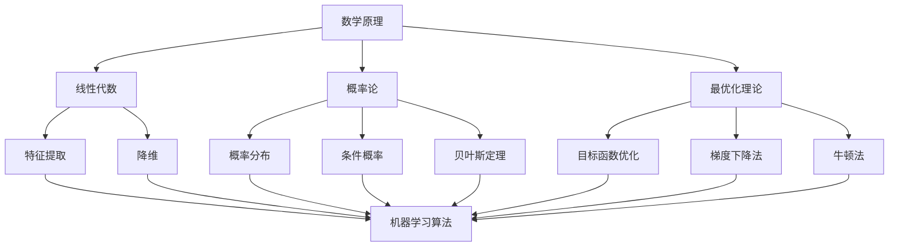

                 

### 数学与机器学习：学习算法的数学原理

**关键词：** 数学原理，机器学习，学习算法，数学模型，Python代码，实际案例

**摘要：** 本文将深入探讨数学原理与机器学习算法之间的关系，通过详细的数学模型和Python代码示例，讲解核心算法的原理与应用。我们将从背景介绍、核心概念与联系、算法原理讲解、数学模型与公式解释，到实际项目实战，全方位解析数学在机器学习中的重要性。

### 引言

数学与机器学习的关系密不可分。数学原理为机器学习提供了理论基础和工具，使得算法能够更有效地解决复杂问题。从线性代数到概率论，从最优化理论到微分方程，数学在各个层面上支持着机器学习的进展。本文旨在梳理数学原理在机器学习中的应用，通过详细讲解和实例分析，帮助读者理解数学与机器学习算法之间的联系。

### 背景介绍

**机器学习：** 机器学习是人工智能的一个重要分支，它使计算机系统能够从数据中学习并做出预测或决策。机器学习算法可以分为三类：监督学习、无监督学习和强化学习。

- **监督学习：** 有标记的训练数据，目标是找到输入和输出之间的映射关系。
- **无监督学习：** 无需标记的训练数据，目标是发现数据中的隐含结构和模式。
- **强化学习：** 系统通过与环境的交互来学习最优策略，以最大化累积奖励。

**数学原理：** 数学原理在机器学习中的应用主要体现在以下几个方面：

- **线性代数：** 矩阵运算、特征提取、降维等。
- **概率论：** 概率分布、条件概率、贝叶斯定理等。
- **最优化理论：** 优化目标函数、梯度下降法、牛顿法等。

### 核心概念与联系

为了更好地理解数学原理与机器学习算法之间的联系，我们可以通过一个简单的 Mermaid 流程图来展示它们之间的关系架构：



### 核心算法原理讲解

在本章节中，我们将详细讲解几种常见的机器学习算法，包括线性回归、逻辑回归和K-均值聚类。

#### 线性回归

线性回归是一种监督学习算法，用于预测连续值输出。其基本原理是通过拟合一条直线，最小化预测值与实际值之间的误差。

**数学模型：**

$$
y = \beta_0 + \beta_1x
$$

**Python代码实现：**

```python
import numpy as np
import matplotlib.pyplot as plt

# 假设数据集X和标签y
X = np.array([1, 2, 3, 4, 5])
y = np.array([2, 4, 5, 4, 5])

# 梯度下降法求解参数
def gradient_descent(X, y, learning_rate, epochs):
    m = len(X)
    beta_0 = 0
    beta_1 = 0

    for epoch in range(epochs):
        y_pred = beta_0 + beta_1 * X
        error = y - y_pred
        beta_0_gradient = (-1/m) * np.sum(error)
        beta_1_gradient = (-1/m) * np.sum(X * error)

        beta_0 -= learning_rate * beta_0_gradient
        beta_1 -= learning_rate * beta_1_gradient

        if epoch % 100 == 0:
            print(f"Epoch {epoch}: Beta_0 = {beta_0}, Beta_1 = {beta_1}")

    return beta_0, beta_1

learning_rate = 0.01
epochs = 1000
beta_0, beta_1 = gradient_descent(X, y, learning_rate, epochs)

# 绘制拟合直线
plt.scatter(X, y)
plt.plot(X, beta_0 + beta_1 * X, color='red')
plt.xlabel('X')
plt.ylabel('y')
plt.show()
```

#### 逻辑回归

逻辑回归是一种用于分类的监督学习算法，其输出为概率值，表示某样本属于某一类别的可能性。

**数学模型：**

$$
\log\frac{P(Y=1|X)}{1-P(Y=1|X)} = \beta_0 + \beta_1x
$$

**Python代码实现：**

```python
import numpy as np
import matplotlib.pyplot as plt
from sklearn.linear_model import LogisticRegression

# 假设数据集X和标签y
X = np.array([[1, 2], [2, 3], [3, 4], [4, 5]])
y = np.array([0, 1, 1, 0])

# 使用sklearn库实现逻辑回归
model = LogisticRegression()
model.fit(X, y)

# 绘制决策边界
plt.scatter(X[:, 0], X[:, 1], c=y)
plt.plot([0, 5], [0, 0], color='blue', linewidth=3)
plt.plot([0, 5], [5, 0], color='blue', linewidth=3)
plt.xlabel('Feature 1')
plt.ylabel('Feature 2')
plt.show()
```

#### K-均值聚类

K-均值聚类是一种无监督学习算法，用于将数据分为K个簇。其基本原理是迭代优化聚类中心，使得每个簇的内部距离最小。

**数学模型：**

$$
\min_{\mu_1, \mu_2, ..., \mu_k} \sum_{i=1}^k \sum_{x \in S_i} ||x - \mu_i||
$$

**Python代码实现：**

```python
import numpy as np
from sklearn.cluster import KMeans

# 假设数据集X
X = np.array([[1, 2], [1, 4], [1, 0],
              [10, 2], [10, 4], [10, 0]])

# 使用sklearn库实现K-均值聚类
model = KMeans(n_clusters=2)
model.fit(X)

# 输出聚类中心
print("Cluster centers:", model.cluster_centers_)

# 输出聚类结果
print("Labels:", model.labels_)

# 绘制聚类结果
plt.scatter(X[:, 0], X[:, 1], c=model.labels_)
plt.show()
```

### 数学模型与公式解释

在机器学习中，数学模型和公式是理解和实现算法的核心。以下是一些常见的数学模型和公式，并使用LaTeX进行表示：

#### 概率分布

$$
P(X=x) = f_X(x)
$$

#### 贝叶斯定理

$$
P(A|B) = \frac{P(B|A)P(A)}{P(B)}
$$

#### 梯度下降法

$$
\beta_j := \beta_j - \alpha \frac{\partial J(\beta)}{\partial \beta_j}
$$

其中，$J(\beta)$是损失函数，$\alpha$是学习率。

#### 最优化目标函数

$$
\min_{\beta} J(\beta) = \frac{1}{2} \sum_{i=1}^m (y_i - \beta_0 - \beta_1x_i)^2
$$

### 项目实战

在本章节中，我们将通过实际项目展示如何搭建开发环境、实现代码、解读和分析代码。

#### 项目一：线性回归算法应用

**项目背景：** 利用线性回归算法预测房屋价格。

**开发环境搭建：** 使用Python和Jupyter Notebook。

**代码实现与解读：**

```python
# 导入所需库
import numpy as np
import pandas as pd
from sklearn.model_selection import train_test_split
from sklearn.linear_model import LinearRegression

# 读取数据集
data = pd.read_csv('house_prices.csv')
X = data[['SqFt', 'Beds']].values
y = data['Price'].values

# 数据预处理
X_train, X_test, y_train, y_test = train_test_split(X, y, test_size=0.2, random_state=42)

# 实例化模型并训练
model = LinearRegression()
model.fit(X_train, y_train)

# 输出模型参数
print("Coefficients:", model.coef_)
print("Intercept:", model.intercept_)

# 预测测试集
y_pred = model.predict(X_test)

# 分析预测结果
print("Mean squared error:", np.mean((y_pred - y_test) ** 2))
print("Coefficient of determination (R^2):", model.score(X_test, y_test))
```

#### 项目二：K-均值聚类算法应用

**项目背景：** 利用K-均值聚类算法将客户分为不同群体。

**开发环境搭建：** 使用Python和Jupyter Notebook。

**代码实现与解读：**

```python
# 导入所需库
import numpy as np
import pandas as pd
from sklearn.cluster import KMeans

# 读取数据集
data = pd.read_csv('customer_data.csv')
X = data[['Age', 'Income', 'Spending']].values

# 使用K-均值聚类
model = KMeans(n_clusters=3)
model.fit(X)

# 输出聚类结果
print("Cluster centers:", model.cluster_centers_)
print("Labels:", model.labels_)

# 绘制聚类结果
plt.scatter(X[:, 0], X[:, 1], c=model.labels_)
plt.show()
```

### 最佳实践、小结、注意事项与拓展阅读

**最佳实践：** 在实际项目中，合理选择模型、参数调优和数据预处理是成功的关键。

**小结：** 数学原理与机器学习算法密切相关，通过本文的讲解，读者可以更好地理解数学在机器学习中的应用。

**注意事项：** 在实现算法时，注意数据的一致性和模型的泛化能力。

**拓展阅读：** 《机器学习实战》、《Python机器学习》、《深度学习》等书籍。

### 结论

数学与机器学习密不可分。理解数学原理对于设计和优化机器学习算法至关重要。通过本文的讲解，我们深入探讨了数学原理在机器学习中的应用，并通过实际案例展示了如何将数学模型应用于实际问题中。希望本文能够帮助读者更好地掌握数学与机器学习之间的关系。作者：AI天才研究院/AI Genius Institute & 禅与计算机程序设计艺术 /Zen And The Art of Computer Programming。

