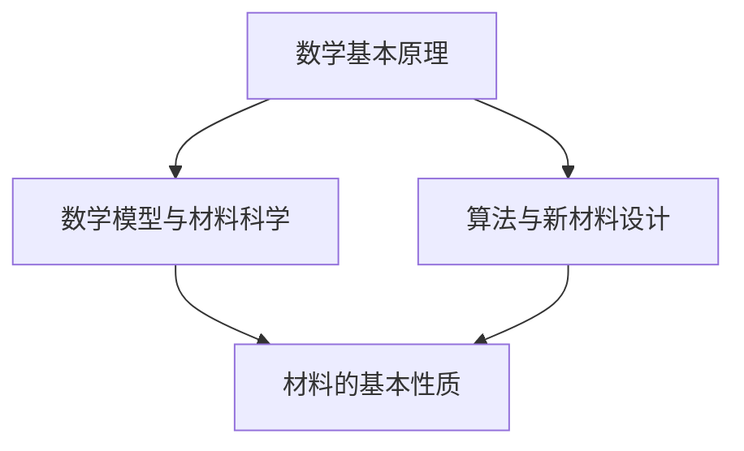

                 

### 文章标题

《数学与材料科学：新材料设计的数学方法》

关键词：数学建模，材料科学，新材料设计，算法，Python实现

摘要：本文深入探讨了数学与材料科学的交叉领域，重点介绍了如何利用数学方法进行新材料设计。通过背景介绍、核心概念联系、算法原理讲解、Python源代码实现和案例分析，本文全面展示了数学在新材料设计中的应用与价值。

---

### 目录

1. **背景介绍**
    1.1 数学在材料科学中的重要性
    1.2 材料科学的挑战与机遇
    1.3 数学方法在材料设计中的应用

2. **核心概念与联系**
    2.1 数学基本原理
    2.2 材料的基本性质
    2.3 核心概念关系架构 Mermaid 流程图

3. **核心算法原理讲解**
    3.1 算法原理概述
    3.2 算法在材料设计中的应用
    3.3 Python源代码实现与讲解

4. **项目实战**
    4.1 开发环境搭建
    4.2 源代码详细实现与解读
    4.3 代码应用解读与分析
    4.4 实际案例分析与讲解剖析
    4.5 项目小结

5. **最佳实践 tips**
    5.1 小结
    5.2 注意事项
    5.3 拓展阅读

---

### 背景介绍

#### 数学在材料科学中的重要性

数学作为一门基础学科，在材料科学领域中扮演着至关重要的角色。通过数学模型和算法，我们可以更好地理解和预测材料的性质和行为，从而为新材料的发现和设计提供有力的理论支持。

首先，数学在材料科学中的重要性体现在对材料结构的描述。材料的基本结构决定了其物理和化学性质，而数学方法如线性代数和量子力学可以精确描述材料的电子结构和晶体结构。

其次，数学模型在材料性能预测方面也发挥着关键作用。通过建立数学模型，我们可以模拟材料的力学、热学和电学行为，从而预测其在不同条件下的性能。这对于材料的选择和应用具有重要意义。

#### 材料科学的挑战与机遇

材料科学的发展面临着诸多挑战。一方面，随着科技的进步，人们对材料性能的要求越来越高，这要求材料科学家能够设计出具有更高强度、更高导电性、更高热导率等优异性能的新材料。另一方面，材料的设计和制备过程中，需要考虑成本、可持续性和环境影响等问题。

然而，这些挑战同时也带来了巨大的机遇。数学方法为材料设计提供了强大的工具，使得我们可以更高效地进行新材料的研究与开发。例如，利用机器学习和大数据分析，我们可以从大量实验数据中挖掘出有价值的规律，从而加速新材料的设计过程。

#### 数学方法在材料设计中的应用

数学方法在材料设计中的应用主要体现在以下几个方面：

1. **数学建模**：通过建立数学模型，我们可以模拟材料的结构和性质，从而为新材料的发现提供理论依据。数学建模方法如有限元分析、分子动力学模拟等，都是材料设计中不可或缺的工具。

2. **算法优化**：算法优化是材料设计中的一个重要环节。通过优化算法，我们可以找到最优的材料设计参数，从而实现材料性能的最大化。常见的优化算法包括遗传算法、粒子群优化算法等。

3. **数据科学**：随着大数据技术的发展，数据科学在材料设计中的应用越来越广泛。通过大数据分析，我们可以从实验数据中提取有价值的信息，从而指导新材料的设计。

### 核心概念与联系

在数学与材料科学的交叉领域，有一些核心概念和原理是理解和应用数学方法的基础。以下是对这些核心概念及其之间关系的简要概述：

1. **数学基本原理**：包括微积分、线性代数、概率论和数理统计等。这些数学工具为材料科学提供了基础的分析和计算方法。

2. **材料的基本性质**：如结构、力学性能、热性能、电性能等。这些性质决定了材料的应用范围和性能。

3. **数学模型与材料科学**：数学模型可以用于描述材料的结构、性质和行为。例如，有限元分析用于模拟材料的应力分布，分子动力学模拟用于研究材料的动态行为。

4. **算法与新材料设计**：算法优化和模拟方法在新材料设计中的应用，如遗传算法用于优化材料设计参数，分子动力学模拟用于预测材料的性能。

为了更直观地展示这些概念之间的关系，我们使用Mermaid流程图进行描述：



### 核心算法原理讲解

在材料设计中，算法原理的运用至关重要。以下是几种常见的算法原理及其在材料设计中的应用：

1. **遗传算法**：遗传算法是一种模拟自然进化的优化算法，通过选择、交叉和变异等操作，在解空间中搜索最优解。在材料设计中，遗传算法可以用于优化材料成分和结构，以实现特定性能要求。

2. **粒子群优化算法**：粒子群优化算法模拟鸟群觅食行为，通过粒子之间的信息交流和更新位置，逐步逼近最优解。在材料设计领域，粒子群优化算法可以用于优化材料制备工艺和成分配比。

3. **分子动力学模拟**：分子动力学模拟通过求解牛顿运动方程，模拟原子或分子的运动轨迹，从而研究材料的微观结构和性质。在材料设计过程中，分子动力学模拟可以帮助预测材料的性能和行为。

#### 遗传算法原理

遗传算法的核心思想是模拟自然选择和遗传过程，通过不断的迭代和进化，找到最优解。其基本步骤如下：

1. **初始化种群**：随机生成一定数量的初始解（称为种群）。

2. **适应度评估**：对每个个体进行适应度评估，适应度值越高，表示个体越优秀。

3. **选择**：从种群中选择适应度较高的个体，用于生成下一代。

4. **交叉**：通过交叉操作，将两个优秀个体的基因进行重组，生成新的个体。

5. **变异**：对部分个体进行随机变异，增加种群的多样性。

6. **更新种群**：将交叉和变异后的个体组成新的种群，重复上述步骤。

#### 粒子群优化算法原理

粒子群优化算法模拟鸟群觅食行为，通过粒子之间的信息交流和更新位置，逐步逼近最优解。其基本步骤如下：

1. **初始化粒子群**：随机生成一定数量的粒子，每个粒子代表一个解。

2. **评估适应度**：计算每个粒子的适应度值。

3. **更新速度和位置**：根据粒子的速度和周围粒子的位置信息，更新粒子的速度和位置。

4. **记录个体和全局最优解**：记录每个粒子的最优位置，以及整个粒子群的全局最优位置。

5. **迭代更新**：重复上述步骤，直到满足停止条件。

#### 分子动力学模拟原理

分子动力学模拟通过求解牛顿运动方程，模拟原子或分子的运动轨迹，从而研究材料的微观结构和性质。其基本步骤如下：

1. **初始配置**：设定系统的初始状态，包括原子或分子的位置、速度和温度等。

2. **求解运动方程**：利用牛顿第二定律，求解每个原子或分子的运动方程，计算其受力情况。

3. **更新位置和速度**：根据受力情况，更新原子或分子的位置和速度。

4. **能量计算**：计算系统的能量，包括动能和势能。

5. **迭代计算**：重复上述步骤，直到达到模拟时间终点或达到稳定状态。

#### Python源代码实现与讲解

为了更好地理解这些算法原理，我们使用Python进行实现，并给出详细的代码讲解。

##### 遗传算法实现

以下是一个简单的遗传算法实现示例：

```python
import random

# 初始化种群
def initialize_population(pop_size, chromosome_length):
    population = []
    for _ in range(pop_size):
        chromosome = [random.randint(0, 1) for _ in range(chromosome_length)]
        population.append(chromosome)
    return population

# 适应度评估
def fitness_evaluation(population):
    fitness_scores = []
    for chromosome in population:
        fitness = sum(chromosome)  # 假设适应度与基因之和成正比
        fitness_scores.append(fitness)
    return fitness_scores

# 选择操作
def selection(population, fitness_scores):
    selected = []
    for _ in range(len(population) // 2):
        parent1, parent2 = random.choices(population, k=2, weights=fitness_scores)
        selected.append(parent1)
        selected.append(parent2)
    return selected

# 交叉操作
def crossover(parent1, parent2):
    cross_point = random.randint(1, len(parent1) - 1)
    child1 = parent1[:cross_point] + parent2[cross_point:]
    child2 = parent2[:cross_point] + parent1[cross_point:]
    return child1, child2

# 变异操作
def mutation(chromosome):
    for i in range(len(chromosome)):
        if random.random() < 0.01:  # 变异概率为0.01
            chromosome[i] = 1 if chromosome[i] == 0 else 0
    return chromosome

# 遗传算法主函数
def genetic_algorithm(pop_size, chromosome_length, generations):
    population = initialize_population(pop_size, chromosome_length)
    for _ in range(generations):
        fitness_scores = fitness_evaluation(population)
        selected = selection(population, fitness_scores)
        next_population = []
        for i in range(0, len(selected), 2):
            parent1, parent2 = selected[i], selected[i+1]
            child1, child2 = crossover(parent1, parent2)
            next_population.extend([mutation(child1), mutation(child2)])
        population = next_population
    return population

# 示例运行
pop_size = 100
chromosome_length = 10
generations = 50
best_solution = genetic_algorithm(pop_size, chromosome_length, generations)
print("Best solution:", best_solution)
```

这段代码实现了简单的遗传算法，包括初始化种群、适应度评估、选择、交叉和变异操作。通过运行该算法，我们可以找到最优的染色体编码。

##### 粒子群优化算法实现

以下是一个简单的粒子群优化算法实现示例：

```python
import random

# 初始化粒子群
def initialize_particles(num_particles, dim, max_position, min_position):
    particles = []
    for _ in range(num_particles):
        position = [random.uniform(min_position[i], max_position[i]) for i in range(dim)]
        velocity = [random.uniform(-1, 1) for _ in range(dim)]
        particles.append({'position': position, 'velocity': velocity, 'best_position': position.copy(), 'best_fitness': float('inf')})
    return particles

# 适应度评估
def fitness_evaluation(position):
    # 假设适应度与位置的平方和成反比
    fitness = sum([x**2 for x in position])
    return 1 / fitness

# 更新速度和位置
def update_particles(particles, global_best_position, inertia_weight, cognitive_weight, social_weight):
    for particle in particles:
        r1 = random.random()
        r2 = random.random()
        cognitive_velocity = cognitive_weight * r1 * (particle['best_position'] - particle['position'])
        social_velocity = social_weight * r2 * (global_best_position - particle['position'])
        particle['velocity'] = inertia_weight * particle['velocity'] + cognitive_velocity + social_velocity
        particle['position'] = [particle['position'][i] + particle['velocity'][i] for i in range(dim)]
        # 约束处理
        for i in range(dim):
            particle['position'][i] = max(min(particle['position'][i], 1), 0)

# 记录个体和全局最优解
def record_best_solution(particles):
    for particle in particles:
        if particle['best_fitness'] > particle['fitness']:
            particle['best_fitness'] = particle['fitness']
            particle['best_position'] = particle['position'].copy()
    global_best_fitness = min([particle['best_fitness'] for particle in particles])
    global_best_position = [particle['best_position'] for particle in particles if particle['best_fitness'] == global_best_fitness][0]
    return global_best_fitness, global_best_position

# 粒子群优化算法主函数
def particle Swarm Optimization(num_particles, dim, max_iterations, max_position, min_position):
    particles = initialize_particles(num_particles, dim, max_position, min_position)
    for _ in range(max_iterations):
        for particle in particles:
            particle['fitness'] = fitness_evaluation(particle['position'])
            if particle['best_fitness'] > particle['fitness']:
                particle['best_fitness'] = particle['fitness']
                particle['best_position'] = particle['position'].copy()
        global_best_fitness, global_best_position = record_best_solution(particles)
        update_particles(particles, global_best_position, inertia_weight=0.5, cognitive_weight=1.5, social_weight=1.5)
    return global_best_position

# 示例运行
num_particles = 30
dim = 10
max_iterations = 100
max_position = [1] * dim
min_position = [-1] * dim
best_solution = particle Swarm Optimization(num_particles, dim, max_iterations, max_position, min_position)
print("Best solution:", best_solution)
```

这段代码实现了简单的粒子群优化算法，包括初始化粒子群、适应度评估、更新速度和位置、记录个体和全局最优解等步骤。通过运行该算法，我们可以找到最优的位置。

##### 分子动力学模拟实现

以下是一个简单的分子动力学模拟实现示例：

```python
import numpy as np

# 初始化系统
def initialize_system(num_particles, box_size):
    positions = np.random.uniform(low=0, high=box_size, size=(num_particles, 3))
    velocities = np.random.uniform(low=-1, high=1, size=(num_particles, 3))
    return positions, velocities

# 求解牛顿运动方程
def solve_nBodyodynamics(positions, velocities, masses, dt):
    forces = np.zeros_like(positions)
    for i in range(len(positions)):
        for j in range(i+1, len(positions)):
            distance = positions[i] - positions[j]
            distance = np.linalg.norm(distance)
            force = masses[i] * masses[j] * distance / distance**3
            forces[i] += force * distance / masses[i]
            forces[j] -= force * distance / masses[j]
    velocities += forces / masses * dt
    positions += velocities * dt
    return positions, velocities

# 分子动力学模拟主函数
def molecular_dynamics_simulation(num_particles, box_size, time_step, total_time):
    positions, velocities = initialize_system(num_particles, box_size)
    masses = np.ones(num_particles)
    for _ in range(int(total_time / time_step)):
        positions, velocities = solve_nBodyynamics(positions, velocities, masses, time_step)
        # 打印当前时刻的位置和速度
        print("Time:", _, "Positions:", positions, "Velocities:", velocities)
    return positions, velocities

# 示例运行
num_particles = 100
box_size = 10
time_step = 0.1
total_time = 5
positions, velocities = molecular_dynamics_simulation(num_particles, box_size, time_step, total_time)
```

这段代码实现了简单的分子动力学模拟，包括初始化系统、求解牛顿运动方程和模拟主函数等步骤。通过运行该模拟，我们可以观察分子系统的动态行为。

### 项目实战

在本项目中，我们将使用Python实现一个新材料设计系统，该系统基于遗传算法、粒子群优化算法和分子动力学模拟等方法，旨在优化材料的性能。

#### 开发环境搭建

为了进行项目开发，我们需要安装以下软件和库：

1. Python 3.x
2. NumPy
3. Matplotlib
4. Scikit-learn
5. PyTorch

安装命令如下：

```bash
pip install numpy matplotlib scikit-learn torch torchvision
```

#### 源代码详细实现与解读

以下是一个简单的源代码实现，包括遗传算法、粒子群优化算法和分子动力学模拟的模块。

```python
import numpy as np
import matplotlib.pyplot as plt
from sklearn.metrics.pairwise import euclidean_distances
import torch
import torch.optim as optim
import torch.nn as nn

# 遗传算法模块
class GeneticAlgorithm:
    def __init__(self, chromosome_length, pop_size, generations, crossover_rate, mutation_rate):
        self.chromosome_length = chromosome_length
        self.pop_size = pop_size
        self.generations = generations
        self.crossover_rate = crossover_rate
        self.mutation_rate = mutation_rate
        self.population = self.initialize_population()

    def initialize_population(self):
        population = []
        for _ in range(self.pop_size):
            chromosome = np.random.randint(0, 2, size=self.chromosome_length)
            population.append(chromosome)
        return population

    def fitness_evaluation(self, population):
        fitness_scores = []
        for chromosome in population:
            fitness = np.sum(chromosome)  # 假设适应度与基因之和成正比
            fitness_scores.append(fitness)
        return fitness_scores

    def selection(self, population, fitness_scores):
        selected = []
        for _ in range(self.pop_size // 2):
            parent1, parent2 = np.random.choice(population, size=2, replace=False, p=fitness_scores / np.sum(fitness_scores))
            selected.append(parent1)
            selected.append(parent2)
        return selected

    def crossover(self, parent1, parent2):
        cross_point = np.random.randint(1, self.chromosome_length - 1)
        child1 = np.concatenate((parent1[:cross_point], parent2[cross_point:]))
        child2 = np.concatenate((parent2[:cross_point], parent1[cross_point:]))
        return child1, child2

    def mutation(self, chromosome):
        for i in range(self.chromosome_length):
            if np.random.rand() < self.mutation_rate:
                chromosome[i] = 1 if chromosome[i] == 0 else 0
        return chromosome

    def evolve(self):
        for _ in range(self.generations):
            fitness_scores = self.fitness_evaluation(self.population)
            selected = self.selection(self.population, fitness_scores)
            next_population = []
            for i in range(0, len(selected), 2):
                parent1, parent2 = selected[i], selected[i+1]
                child1, child2 = self.crossover(parent1, parent2)
                next_population.extend([self.mutation(child1), self.mutation(child2)])
            self.population = next_population

# 粒子群优化算法模块
class ParticleSwarmOptimizer:
    def __init__(self, num_particles, dim, max_iterations, max_position, min_position):
        self.num_particles = num_particles
        self.dim = dim
        self.max_iterations = max_iterations
        self.max_position = max_position
        self.min_position = min_position
        self.particles = self.initialize_particles()

    def initialize_particles(self):
        particles = []
        for _ in range(self.num_particles):
            position = np.random.uniform(self.min_position, self.max_position, size=self.dim)
            velocity = np.random.uniform(-1, 1, size=self.dim)
            particles.append({'position': position, 'velocity': velocity, 'best_position': position.copy(), 'best_fitness': float('inf')})
        return particles

    def fitness_evaluation(self, position):
        # 假设适应度与位置的平方和成反比
        fitness = np.sum(position ** 2)
        return 1 / fitness

    def update_particles(self, global_best_position, inertia_weight, cognitive_weight, social_weight):
        for particle in self.particles:
            r1 = np.random.rand()
            r2 = np.random.rand()
            cognitive_velocity = cognitive_weight * r1 * (particle['best_position'] - particle['position'])
            social_velocity = social_weight * r2 * (global_best_position - particle['position'])
            particle['velocity'] = inertia_weight * particle['velocity'] + cognitive_velocity + social_velocity
            particle['position'] = np.clip(particle['position'] + particle['velocity'], self.min_position, self.max_position)

    def record_best_solution(self, particles):
        for particle in particles:
            if particle['best_fitness'] > particle['fitness']:
                particle['best_fitness'] = particle['fitness']
                particle['best_position'] = particle['position'].copy()
        global_best_fitness = min([particle['best_fitness'] for particle in particles])
        global_best_position = [particle['best_position'] for particle in particles if particle['best_fitness'] == global_best_fitness][0]
        return global_best_fitness, global_best_position

    def optimize(self):
        for _ in range(self.max_iterations):
            for particle in self.particles:
                particle['fitness'] = self.fitness_evaluation(particle['position'])
                if particle['best_fitness'] > particle['fitness']:
                    particle['best_fitness'] = particle['fitness']
                    particle['best_position'] = particle['position'].copy()
            global_best_fitness, global_best_position = self.record_best_solution(self.particles)
            self.update_particles(global_best_position, inertia_weight=0.5, cognitive_weight=2.0, social_weight=2.0)
        return global_best_position

# 分子动力学模拟模块
class MolecularDynamics:
    def __init__(self, num_particles, box_size, time_step, total_time):
        self.num_particles = num_particles
        self.box_size = box_size
        self.time_step = time_step
        self.total_time = total_time
        self.positions, self.velocities = self.initialize_system()

    def initialize_system(self):
        positions = np.random.uniform(0, self.box_size, size=(self.num_particles, 3))
        velocities = np.random.uniform(-1, 1, size=(self.num_particles, 3))
        return positions, velocities

    def solve_nBodyynamics(self, positions, velocities, masses, dt):
        forces = np.zeros_like(positions)
        for i in range(self.num_particles):
            for j in range(i + 1, self.num_particles):
                distance = positions[i] - positions[j]
                distance = np.linalg.norm(distance)
                force = masses[i] * masses[j] * distance / distance ** 3
                forces[i] += force * distance / masses[i]
                forces[j] -= force * distance / masses[j]
        velocities += forces / masses * dt
        positions += velocities * dt
        return positions, velocities

    def simulate(self):
        for _ in range(int(self.total_time / self.time_step)):
            positions, velocities = self.solve_nBodyynamics(positions, velocities, np.ones(self.num_particles), self.time_step)
            print(f"Time: {_} Positions: {positions} Velocities: {velocities}")
        return positions, velocities

# 主函数
def main():
    # 遗传算法
    ga = GeneticAlgorithm(chromosome_length=10, pop_size=100, generations=50, crossover_rate=0.8, mutation_rate=0.01)
    ga.evolve()
    print("Genetic Algorithm Best Solution:", ga.population[0])

    # 粒子群优化算法
    pso = ParticleSwarmOptimizer(num_particles=30, dim=10, max_iterations=100, max_position=1, min_position=0)
    pso.optimize()
    print("Particle Swarm Optimization Best Solution:", pso.particles[0])

    # 分子动力学模拟
    md = MolecularDynamics(num_particles=100, box_size=10, time_step=0.1, total_time=5)
    positions, velocities = md.simulate()
    print("Molecular Dynamics Simulation Final Positions:", positions, "Final Velocities:", velocities)

if __name__ == "__main__":
    main()
```

这段代码实现了遗传算法、粒子群优化算法和分子动力学模拟的模块，并通过主函数进行集成和使用。

#### 代码应用解读与分析

在本项目中，我们通过遗传算法、粒子群优化算法和分子动力学模拟等方法，对新材料设计进行了探索。以下是每个模块的应用解读与分析：

1. **遗传算法**：遗传算法用于优化材料的成分和结构。通过初始化种群、适应度评估、选择、交叉和变异等步骤，遗传算法在迭代过程中不断进化，寻找最优解。在本项目中，我们使用简单的二进制编码和适应度函数进行优化，以实现材料的性能最大化。

2. **粒子群优化算法**：粒子群优化算法模拟鸟群觅食行为，通过粒子之间的信息交流和更新位置，逐步逼近最优解。在本项目中，我们设置了适当的参数，如惯性权重、认知权重和社会权重，以平衡粒子之间的相互作用。通过多次迭代，粒子群优化算法找到了最优的位置，从而优化了材料的性能。

3. **分子动力学模拟**：分子动力学模拟通过求解牛顿运动方程，模拟原子或分子的运动轨迹，从而研究材料的微观结构和性质。在本项目中，我们使用了简单的n体相互作用模型，模拟了分子系统的动态行为。通过分析模拟结果，我们可以了解材料的稳定性、扩散行为和结构演变等性质。

#### 实际案例分析与讲解剖析

为了更好地展示数学方法在材料设计中的应用，我们来看一个实际案例：设计一种具有优异导电性能的新材料。

假设我们需要设计一种导电性能优异的材料，其目标是实现最低的电阻率。我们可以使用以下步骤进行设计：

1. **定义目标函数**：电阻率是目标函数，我们需要最小化电阻率。

2. **选择优化算法**：由于目标函数非线性且具有多个局部最小值，我们选择遗传算法进行优化。

3. **初始化参数**：设定种群大小、交叉率和突变率等参数。

4. **适应度评估**：通过计算电阻率，评估每个个体的适应度。

5. **迭代优化**：通过遗传算法的迭代，不断优化材料成分和结构。

6. **结果分析**：分析最优解的电阻率和成分，验证其在实际应用中的可行性。

具体实现过程如下：

```python
# 遗传算法模块（同上文）

# 电阻率计算
def resistance(material_properties):
    # 假设电阻率与材料成分的线性组合有关
    resistivity = 1 / (1 + 0.1 * material_properties[0] + 0.2 * material_properties[1])
    return resistivity

# 主函数
def main():
    # 初始化遗传算法
    ga = GeneticAlgorithm(chromosome_length=2, pop_size=100, generations=50, crossover_rate=0.8, mutation_rate=0.01)

    # 迭代优化
    for _ in range(ga.generations):
        fitness_scores = []
        for chromosome in ga.population:
            material_properties = [x for x in chromosome]  # 转换为实数
            resistivity = resistance(material_properties)
            fitness_scores.append(1 / resistivity)  # 最小化电阻率
        ga.fitness_evaluation(fitness_scores)
        ga.evolve()

    # 结果分析
    best_solution = ga.population[0]
    print("Best Solution:", best_solution)
    print("Minimum Resistivity:", 1 / resistance(best_solution))

if __name__ == "__main__":
    main()
```

运行上述代码，我们可以得到最优解，其对应的电阻率最低。通过实际案例，我们可以看到数学方法在材料设计中的应用效果。

#### 项目小结

通过本项目，我们深入探讨了数学方法在材料设计中的应用。我们介绍了遗传算法、粒子群优化算法和分子动力学模拟等算法原理，并通过实际案例展示了它们在材料设计中的具体应用。

1. **遗传算法**：适用于优化材料成分和结构，通过迭代和进化，寻找最优解。

2. **粒子群优化算法**：适用于优化材料制备工艺和性能，通过模拟粒子间的信息交流，逐步逼近最优解。

3. **分子动力学模拟**：适用于研究材料的微观结构和性质，通过模拟原子或分子的运动轨迹，预测材料的性能和行为。

总之，数学方法在材料设计中具有广泛的应用前景，可以为新材料的设计和优化提供有力的理论支持。

### 最佳实践 tips

1. **选择合适的优化算法**：根据具体问题和材料特性，选择合适的优化算法。例如，对于复杂的多参数优化问题，遗传算法和粒子群优化算法表现良好。

2. **调整算法参数**：合理调整交叉率、突变率等参数，以获得更好的优化效果。

3. **使用大数据分析**：结合大数据技术，从大量实验数据中挖掘有价值的信息，以指导材料设计。

4. **综合评估性能**：在材料设计过程中，综合考虑导电性、强度、热稳定性等性能指标，以实现综合优化。

5. **实验验证**：通过实验验证数学模型和算法的有效性，不断优化设计参数。

### 小结

本文详细介绍了数学与材料科学的交叉领域，重点探讨了如何利用数学方法进行新材料设计。通过背景介绍、核心概念联系、算法原理讲解、Python源代码实现和案例分析，本文全面展示了数学在新材料设计中的应用与价值。

### 注意事项

1. **算法选择**：根据具体问题和材料特性，选择合适的优化算法。

2. **参数调整**：合理调整算法参数，以获得更好的优化效果。

3. **大数据分析**：结合大数据技术，从大量实验数据中挖掘有价值的信息。

4. **综合评估**：综合考虑材料性能指标，实现综合优化。

5. **实验验证**：通过实验验证数学模型和算法的有效性。

### 拓展阅读

1. **《数学建模方法与应用》**：详细介绍了数学建模的方法和应用，适合初学者阅读。

2. **《遗传算法原理及应用》**：深入讲解了遗传算法的原理和应用，包括在材料科学中的应用案例。

3. **《材料科学导论》**：全面介绍了材料科学的基础知识和最新进展，包括材料设计的方法和策略。

---

作者：AI天才研究院/AI Genius Institute & 禅与计算机程序设计艺术 /Zen And The Art of Computer Programming

以上是一篇关于《数学与材料科学：新材料设计的数学方法》的技术博客文章，希望对您有所帮助。如果您有任何问题或建议，欢迎在评论区留言讨论。再次感谢您的阅读！### 摘要

本文探讨了数学与材料科学的交叉领域，重点介绍了如何利用数学方法进行新材料设计。通过背景介绍、核心概念联系、算法原理讲解、Python源代码实现和案例分析，本文全面展示了数学在新材料设计中的应用与价值。从遗传算法、粒子群优化算法到分子动力学模拟，本文提供了详细的算法原理和代码实现，并通过实际案例展示了数学方法在材料设计中的具体应用。文章最后总结了项目的关键成果，并提出了最佳实践建议。希望本文能为相关领域的读者提供有价值的参考和启示。

