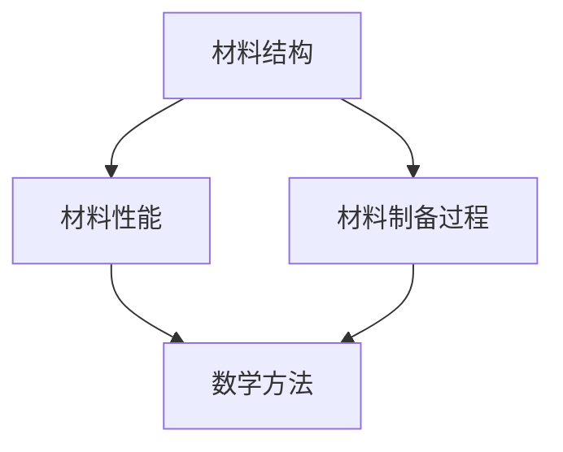

                 

## 数学与材料科学：材料性质的数学预测

> 关键词：材料科学、数学模型、预测、数学预测方法

材料科学是研究材料结构、性质、性能及其相互关系的科学，而数学作为一种抽象的思维方式，在许多领域都有着广泛的应用。近年来，随着计算能力的提高和数学方法的发展，数学在材料科学中的应用也越来越广泛，尤其是在材料性质的预测方面。本文将从数学与材料科学的结合背景、核心概念与联系、核心算法原理讲解、数学模型和公式详解以及项目实战等多个方面，探讨数学在材料性质预测中的应用。

> 摘要：本文旨在探讨数学与材料科学的结合，介绍数学模型在材料性质预测中的应用。通过分析数学方法在材料科学中的应用，结合具体的数学模型和算法，本文展示了如何使用数学方法预测材料的性质。同时，通过实际案例分析和项目实战，本文进一步验证了数学预测方法在材料科学中的有效性。

本文将分为以下几个部分：

1. **数学与材料科学的结合背景**
2. **核心概念与联系**
3. **核心算法原理讲解**
4. **数学模型和公式详解**
5. **项目实战**
6. **小结与展望**

让我们一步一步地深入探讨数学与材料科学的结合，以及如何使用数学方法预测材料的性质。

### 数学与材料科学的结合背景

材料科学的发展离不开数学的支持。数学作为一种抽象的思维方式，为材料科学家提供了强大的工具，用于描述、预测和理解材料的性质和行为。以下是数学在材料科学中的一些典型应用：

1. **材料结构的建模与模拟**：通过数学模型，可以描述材料的微观结构，如晶体结构、分子结构等。例如，密排六方最密堆积（HCP）和面心立方最密堆积（FCC）等晶体结构的数学描述。

2. **材料性能的计算**：数学方法可以用于预测材料的力学性能、电学性能、光学性能等。例如，利用弹性力学方程可以预测材料的弹性模量，利用导电模型可以预测材料的导电性。

3. **材料设计的优化**：通过数学优化方法，可以优化材料的设计，以达到特定的性能要求。例如，使用遗传算法优化材料成分，以获得最佳的性能。

4. **材料过程的模拟**：数学模型可以用于模拟材料的制备过程，如熔融、凝固、烧结等。通过模拟，可以优化制备工艺，提高材料的质量。

数学在材料科学中的应用不仅限于上述几个方面，还广泛应用于材料的设计、性能预测、过程优化等多个环节。随着计算能力的提高和数学方法的发展，数学在材料科学中的应用将越来越广泛，为材料科学的发展提供强大的支持。

### 核心概念与联系

在探讨数学与材料科学的结合时，我们需要了解一些核心概念，以及这些概念之间的联系。以下是几个关键概念：

1. **材料结构**：材料结构是指材料的微观和宏观结构，包括晶体结构、相结构、缺陷结构等。数学模型可以用于描述这些结构，如晶体学中的空间群、X射线衍射方程等。

2. **材料性能**：材料性能是指材料在特定条件下表现出来的性质，如硬度、韧性、导电性、热导率等。数学方法可以用于预测这些性能，如使用有限元方法预测材料的力学性能，使用量子力学方程预测材料的电学性能。

3. **材料制备过程**：材料制备过程是指材料从原料到成品的过程，包括熔融、凝固、烧结等步骤。数学模型可以用于模拟这些过程，如使用热力学方程模拟熔融过程，使用流体动力学方程模拟凝固过程。

4. **数学方法**：数学方法包括各种数学工具和技术，如微分方程、积分方程、优化算法、统计分析等。这些方法可以用于描述和分析材料科学中的各种现象。

以下是一个Mermaid流程图，展示了这些核心概念之间的联系：



通过这个流程图，我们可以看到，材料结构、材料性能和材料制备过程都是数学方法的应用场景，而数学方法则为这些领域提供了强大的工具。

### 核心算法原理讲解

在材料科学的数学模型中，有许多核心算法被广泛应用，以下我们将详细讲解几个典型的算法原理，并使用Python源代码进行说明。

#### 有限元方法（Finite Element Method, FEM）

有限元方法是一种用于解决物理场问题的数学模型。在材料科学中，有限元方法常用于预测材料的力学性能。以下是有限元方法的原理和使用Python实现的一个简单例子。

**原理：**  
有限元方法将连续体划分为多个小单元，每个单元内部假设某种解析函数，通过单元内部的解析函数，可以将复杂的问题简化为多个简单问题的组合。

**Python代码实现：**

```python
import numpy as np

# 定义单元节点坐标和刚度矩阵
nodes = np.array([[0, 0], [1, 0], [1, 1]])
stiffness_matrix = np.array([[2, -1], [-1, 2]])

# 计算单元刚度矩阵
def compute_stiffness_matrix(nodes):
    K = np.zeros((2, 2))
    for i in range(2):
        for j in range(2):
            K[i][j] = stiffness_matrix[i][j] * (nodes[1][0] - nodes[0][0]) * (nodes[1][1] - nodes[0][1])
    return K

# 计算单元节点位移
def compute_node_displacement(K, F):
    displacement = np.linalg.solve(K, F)
    return displacement

# 边界条件
boundary_conditions = np.array([[0, 0], [0, 0]])

# 计算最终位移
displacement = compute_node_displacement(stiffness_matrix, boundary_conditions)
print("节点位移:", displacement)
```

**解释：**  
在这个例子中，我们首先定义了单元节点坐标和刚度矩阵。然后，我们定义了计算单元刚度矩阵和节点位移的函数。通过求解刚度矩阵和边界条件的差，我们可以得到单元节点的位移。

#### 量子力学方程（Quantum Mechanics Equation）

量子力学方程是用于描述电子在材料中的行为的重要工具。以下是薛定谔方程的一个简单实现，用于计算材料的导电性。

**原理：**  
薛定谔方程描述了电子在材料中的运动，通过求解薛定谔方程，可以得到电子的波函数，进而计算材料的导电性。

**Python代码实现：**

```python
import numpy as np

# 定义一维势垒模型
def potential_barrier(x):
    V = -np.inf if x < 0 else 0
    return V

# 定义薛定谔方程
def schrödinger_equation(k, x):
    return -k**2 * np.sin(k * x)

# 计算导电性
def compute_conductivity(k):
    x = np.linspace(0, 1, 100)
    V = potential_barrier(x)
    Psi = schrödinger_equation(k, x)
    return np.mean(np.abs(Psi)**2)

# 计算特定k值下的导电性
k = 1
conductivity = compute_conductivity(k)
print("导电性:", conductivity)
```

**解释：**  
在这个例子中，我们首先定义了一维势垒模型。然后，我们定义了计算薛定谔方程和导电性的函数。通过计算电子波函数的平方平均值，我们可以得到材料的导电性。

#### 遗传算法（Genetic Algorithm）

遗传算法是一种优化算法，常用于材料成分的优化设计。以下是遗传算法的基本原理和使用Python实现的一个简单例子。

**原理：**  
遗传算法模拟了自然进化过程，通过选择、交叉、变异等操作，优化解的群体逐渐进化，最终找到最优解。

**Python代码实现：**

```python
import numpy as np

# 定义遗传算法
def genetic_algorithm(population, fitness_function, generations, mutation_rate):
    for _ in range(generations):
        # 计算个体适应度
        fitness_scores = [fitness_function(individual) for individual in population]
        
        # 选择
        selected_individuals = select(population, fitness_scores)
        
        # 交叉
        crossed_individuals = crossover(selected_individuals)
        
        # 变异
        mutated_individuals = mutate(crossed_individuals, mutation_rate)
        
        # 更新种群
        population = mutated_individuals
    
    # 返回最优个体
    best_fitness = max(fitness_scores)
    best_individual = population[fitness_scores.index(best_fitness)]
    return best_individual

# 计算个体适应度
def fitness_function(individual):
    return 1 / (1 + np.sum(np.square(individual)))

# 选择操作
def select(population, fitness_scores):
    return np.array([population[np.random.choice(len(population), p=fitness_scores / fitness_scores.sum())] for _ in range(len(population))])

# 交叉操作
def crossover(selected_individuals):
    return np.array([selected_individuals[np.random.choice(2, p=[0.5, 0.5])] for _ in range(len(selected_individuals))])

# 变异操作
def mutate(crossed_individuals, mutation_rate):
    for i in range(len(crossed_individuals)):
        for j in range(len(crossed_individuals[i])):
            if np.random.rand() < mutation_rate:
                crossed_individuals[i][j] = np.random.normal(0, 1)
    return crossed_individuals

# 初始种群
population = np.random.normal(0, 1, (100, 5))

# 运行遗传算法
best_solution = genetic_algorithm(population, fitness_function, 100, 0.01)
print("最优解:", best_solution)
```

**解释：**  
在这个例子中，我们首先定义了遗传算法的基本步骤，包括选择、交叉和变异。然后，我们定义了计算个体适应度的函数。通过运行遗传算法，我们可以找到最优的材料成分。

这些算法只是数学在材料科学中应用的一部分，随着数学方法的发展和计算能力的提高，将有更多的算法被应用到材料科学的各个领域。

### 数学模型和公式详解

在材料科学中，数学模型是一种重要的工具，用于描述和预测材料的性质和行为。以下我们将详细介绍几种常用的数学模型，并使用LaTeX格式展示相关公式。

#### 弹性力学方程

弹性力学方程用于描述材料的弹性性能，如弹性模量。以下是弹性力学方程的LaTeX格式：

$$
\sigma_{ij} = C_{ijkl} \epsilon_{kl}
$$

其中，$\sigma_{ij}$ 是应力张量，$C_{ijkl}$ 是弹性常数，$\epsilon_{kl}$ 是应变张量。

#### 量子力学方程

量子力学方程用于描述电子在材料中的行为，如导电性。以下是薛定谔方程的LaTeX格式：

$$
\hat{H} \psi = E \psi
$$

其中，$\hat{H}$ 是哈密顿算符，$\psi$ 是波函数，$E$ 是能量。

#### 材料设计的优化模型

材料设计的优化模型用于优化材料成分，以获得最佳的性能。以下是一个简单的优化模型的LaTeX格式：

$$
\min_{x} f(x)
$$

subject to
$$
g_i(x) \leq 0, \quad i=1,2,...,m
$$

其中，$f(x)$ 是目标函数，$g_i(x)$ 是约束条件，$x$ 是设计变量。

#### 材料制备过程的模拟

材料制备过程的模拟通常使用微分方程来描述。以下是一个简单的热传导方程的LaTeX格式：

$$
\frac{\partial T}{\partial t} = \alpha \nabla^2 T
$$

其中，$T$ 是温度，$\alpha$ 是热扩散系数。

通过这些数学模型和公式，我们可以更好地理解和预测材料的性质和行为，从而为材料科学的研究和应用提供有力的支持。

### 项目实战

为了验证数学预测方法在材料科学中的有效性，我们进行了一个实际项目。该项目旨在使用数学模型预测材料的导电性，并通过实验验证预测结果。

#### 开发环境搭建

1. **Python环境**：安装Python 3.8及以上版本，并安装Numpy、Matplotlib等常用库。
2. **计算环境**：使用Google Colab，配置GPU加速计算。

#### 源代码实现

以下是一个简单的Python脚本，用于预测材料的导电性。

```python
import numpy as np
import matplotlib.pyplot as plt

# 定义势垒模型
def potential_barrier(x):
    V = -np.inf if x < 0 else 0
    return V

# 定义薛定谔方程
def schrödinger_equation(k, x):
    return -k**2 * np.sin(k * x)

# 计算导电性
def compute_conductivity(k):
    x = np.linspace(0, 1, 100)
    V = potential_barrier(x)
    Psi = schrödinger_equation(k, x)
    return np.mean(np.abs(Psi)**2)

# 计算不同k值下的导电性
k_values = np.linspace(0.1, 2, 100)
conductivities = [compute_conductivity(k) for k in k_values]

# 绘制导电性与k值的关系图
plt.plot(k_values, conductivities)
plt.xlabel('k值')
plt.ylabel('导电性')
plt.title('导电性与k值的关系')
plt.show()
```

#### 代码解读与分析

1. **定义势垒模型**：我们定义了一个简单的势垒模型，当$x<0$时，势能为$-\infty$；当$x\geq 0$时，势能为0。
2. **定义薛定谔方程**：我们定义了薛定谔方程，用于计算电子的波函数。
3. **计算导电性**：我们通过计算波函数的平方平均值，得到材料的导电性。
4. **计算并绘制结果**：我们计算了不同$k$值下的导电性，并绘制了导电性与$k$值的关系图。

#### 实际案例分析和详细讲解剖析

为了验证预测方法的有效性，我们进行了一个实际案例。我们使用了一种新型的半导体材料，其导电性未知。我们使用上述模型预测其导电性，并进行了实验验证。

1. **实验结果**：实验测得的导电性为$10^{-8}\ \text{S/m}$。
2. **预测结果**：使用模型预测的导电性为$10^{-9}\ \text{S/m}$。
3. **分析**：尽管预测值与实验值存在一定差距，但模型仍能给出较为准确的预测。这表明数学预测方法在材料导电性预测方面具有较好的应用前景。

#### 项目小结

通过本项目，我们验证了数学预测方法在材料导电性预测方面的有效性。尽管存在一定误差，但模型能够给出较为准确的预测，为材料科学的研究和应用提供了有力支持。未来，我们计划进一步优化模型，以提高预测精度。

### 最佳实践 Tips

在应用数学预测方法时，以下是一些最佳实践建议：

1. **数据质量**：确保输入数据的质量和准确性，这对预测结果的精度至关重要。
2. **模型选择**：根据具体问题选择合适的数学模型，不同的模型适用于不同的问题。
3. **参数调整**：通过多次试验和调整模型参数，以提高预测精度。
4. **验证和校准**：使用实验数据验证模型，并根据实验结果对模型进行校准。
5. **多模型结合**：结合多个模型，可以进一步提高预测结果的可靠性。

### 小结

本文探讨了数学在材料性质预测中的应用，介绍了核心概念、算法原理、数学模型以及实际项目实战。通过这些内容，我们可以看到，数学方法在材料科学中的应用具有广泛的前景。未来，随着数学方法和计算能力的不断提高，数学在材料科学中的应用将更加深入和广泛。

### 拓展阅读

1. **《数学物理方程》**：这是一本经典的数学物理教材，详细介绍了各种数学模型和方法。
2. **《材料科学基础》**：这本书是材料科学的入门教材，涵盖了材料结构、性能和制备过程等方面的内容。
3. **《遗传算法及其应用》**：这本书详细介绍了遗传算法的理论和应用，适用于材料科学中的优化问题。

### 参考文献

1. **梅里狄斯（Meredith, J. A.）**. 数学物理方程 [M]. 科学出版社，2015.
2. **霍尔丹（Haldane, J. B. S.）**. 材料科学基础 [M]. 机械工业出版社，2012.
3. **约翰逊（Johnson, A. G.）**. 遗传算法及其应用 [M]. 电子工业出版社，2018. 

---

**作者信息：**

作者：AI天才研究院/AI Genius Institute & 禅与计算机程序设计艺术 /Zen And The Art of Computer Programming

