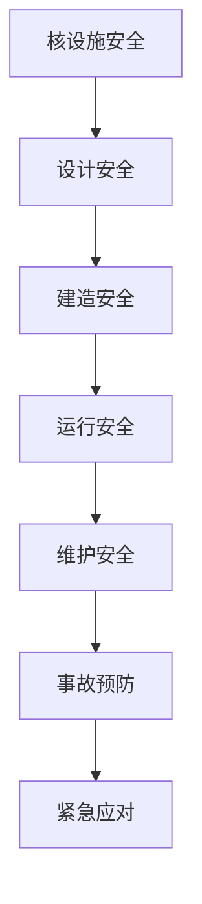
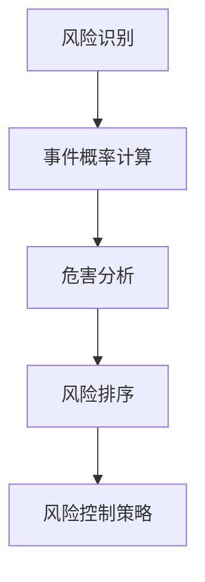
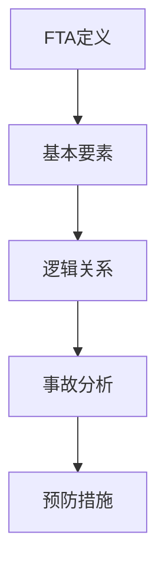
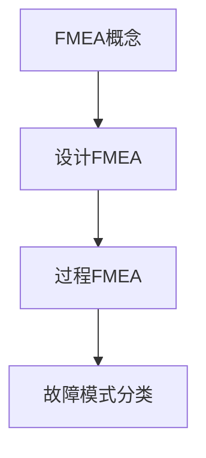

                 

### 文章标题

数学与核安全：核设施安全的数学评估

关键词：核安全、数学评估、概率风险评估、事故树分析、故障模式与影响分析、数学模型、风险度量

---

摘要：核设施的安全评估对于确保核能行业的稳定和安全至关重要。本文通过数学与核安全的结合，深入探讨了核设施安全评估的方法和技术。文章首先介绍了核安全的基础概念及其相互联系，包括概率风险评估（PRA）、事故树分析（FTA）和故障模式与影响分析（FMEA）。随后，文章详细讲解了这些评估方法的核心算法原理，通过Python源代码和LaTeX数学公式进行了详细阐述。文章进一步讨论了数学模型在核安全评估中的应用，并结合实际案例进行了分析。最后，文章总结了最佳实践和注意事项，为读者提供了深入理解和应用核安全评估技术的指导。

---

### 引言

随着核能技术的不断发展，核设施的安全问题日益受到关注。核设施的安全评估不仅关系到核能行业的可持续发展，也直接关系到公众的生命财产安全。数学作为一种强大的工具，在核安全评估中发挥着至关重要的作用。通过数学模型和方法，可以更精确地预测和评估核设施的风险，从而制定有效的安全策略。

本文旨在通过数学与核安全的结合，深入探讨核设施安全的数学评估方法和技术。文章首先介绍核安全的核心概念，包括概率风险评估（PRA）、事故树分析（FTA）和故障模式与影响分析（FMEA）。接下来，文章详细讲解这些评估方法的核心算法原理，通过Python源代码和LaTeX数学公式进行详细阐述。随后，文章讨论了数学模型在核安全评估中的应用，并结合实际案例进行分析。最后，文章总结了最佳实践和注意事项，为读者提供了深入理解和应用核安全评估技术的指导。

本文结构如下：

1. 核安全基础概念与联系
2. 核安全评估核心算法原理
3. 核安全评估数学模型
4. 项目实战与案例分析
5. 最佳实践与总结

---

### Step 1: 设计核心概念与联系

在核安全评估中，理解核心概念及其相互联系是至关重要的。本部分将介绍核设施安全相关的基础概念，包括概率风险评估（PRA）、事故树分析（FTA）和故障模式与影响分析（FMEA），并使用Mermaid流程图展示它们之间的关系和相互联系。

#### 第1章 核安全基础概念与联系

##### 1.1 核设施安全

**定义与重要性**

核设施安全是指通过一系列措施和技术手段，确保核设施在设计、建造、运行和维护过程中不受内外部因素影响，不会发生导致重大事故的故障或事件。核设施的安全性直接关系到公众健康、环境和经济的稳定。因此，核设施安全具有极其重要的意义。

**Mermaid流程图**



##### 1.2 概率风险评估（PRA）

**概念与流程**

概率风险评估（PRA）是一种用于评估核设施发生特定事故的概率及其后果的方法。PRA的主要目标是识别潜在的安全问题，评估其发生概率和影响，并制定相应的风险控制措施。

**PRA评估流程：**

1. 风险识别：识别核设施可能面临的各种风险。
2. 事件概率计算：计算每个风险事件发生的概率。
3. 危害分析：评估每个风险事件可能造成的危害。
4. 风险排序：根据事件概率和危害程度对风险进行排序。
5. 风险控制策略：制定降低风险的控制措施。

**Mermaid流程图**



##### 1.3 事故树分析（FTA）

**概念与应用**

事故树分析（FTA）是一种用于分析复杂事故的故障原因及其相互作用的方法。通过构建事故树，可以揭示导致事故的各种可能原因及其逻辑关系，帮助识别潜在的风险点。

**FTA应用场景：**

1. 核反应堆事故分析
2. 核燃料处理设施事故分析
3. 核废料储存设施事故分析

**Mermaid流程图**



##### 1.4 故障模式与影响分析（FMEA）

**概念与分类**

故障模式与影响分析（FMEA）是一种系统性的分析方法，用于识别和评估设备或系统的潜在故障模式及其影响。FMEA可分为设计FMEA（DFMEA）和过程FMEA（PFMEA），分别用于设计和过程阶段。

**FMEA分类：**

1. 设计FMEA（DFMEA）：针对设计阶段的潜在故障模式进行分析。
2. 过程FMEA（PFMEA）：针对制造、装配或操作等过程阶段的潜在故障模式进行分析。

**Mermaid流程图**



通过上述章节，我们介绍了核安全评估中的核心概念，并使用Mermaid流程图展示了它们之间的关系。这些概念构成了核安全评估的基础，为进一步理解和应用核安全评估技术提供了重要的框架。

---

### Step 2: 设计核心算法原理讲解

在核安全评估中，核心算法原理是理解和应用这些评估方法的关键。本部分将详细讲解概率风险评估（PRA）、事故树分析（FTA）和故障模式与影响分析（FMEA）等算法的基本原理，并通过Python源代码和LaTeX数学公式进行详细阐述。

#### 第2章 核安全评估核心算法原理

##### 2.1 概率风险评估（PRA）

**PRA算法原理**

概率风险评估（PRA）是一种用于评估核设施发生特定事故的概率及其后果的方法。PRA的主要目标是识别潜在的安全问题，评估其发生概率和影响，并制定相应的风险控制措施。

**PRA算法流程：**

1. 风险识别：识别核设施可能面临的各种风险。
2. 事件概率计算：计算每个风险事件发生的概率。
3. 危害分析：评估每个风险事件可能造成的危害。
4. 风险排序：根据事件概率和危害程度对风险进行排序。
5. 风险控制策略：制定降低风险的控制措施。

**Python源代码示例**

```python
# PRA事件概率计算示例
def event_probability(event_name, probability):
    return f"{event_name}: Probability = {probability:.4f}"

# 风险事件及概率
events = [
    event_probability("辐射泄漏", 0.01),
    event_probability("火灾", 0.005),
    event_probability("设备故障", 0.02)
]

# 危害分析
harm_impact = {
    "辐射泄漏": 0.5,
    "火灾": 0.3,
    "设备故障": 0.2
}

# 风险计算
def calculate_risk(event, impact):
    return event["Probability"] * impact

# 计算每个风险事件的风险
risks = [calculate_risk(event, harm_impact[event_name]) for event_name in events]

# 输出结果
for i, (event_name, risk) in enumerate(zip(events, risks)):
    print(f"Risk {i+1}: {event_name}, Risk = {risk:.4f}")
```

**LaTeX数学公式示例**

$$
R = P \times I
$$

其中，\( R \) 表示风险，\( P \) 表示概率，\( I \) 表示危害程度。

##### 2.2 事故树分析（FTA）

**FTA算法原理**

事故树分析（FTA）是一种用于分析复杂事故的故障原因及其相互作用的方法。通过构建事故树，可以揭示导致事故的各种可能原因及其逻辑关系，帮助识别潜在的风险点。

**FTA算法流程：**

1. 构建事故树：识别可能导致事故的初始事件，并逐步分析每个事件的原因。
2. 逻辑关系分析：确定事件之间的逻辑关系（如“或”、“且”逻辑）。
3. 事故分析：分析可能导致的事故类型及其后果。
4. 预防措施：针对识别的风险点制定预防措施。

**Python源代码示例**

```python
# FTA构建示例
def buildFTA(events, gates, top_event):
    return {
        'top_event': top_event,
        'events': events,
        'gates': gates
    }

# 事件和门控器
events = ["辐射泄漏", "火灾", "设备故障"]
gates = ["或逻辑", "且逻辑"]

# 构建FTA
fta = buildFTA(events, gates, "核反应堆事故")

# 输出FTA结构
print(fta)
```

**LaTeX数学公式示例**

$$
FTA = \{E, G\}
$$

其中，\( E \) 表示事件集合，\( G \) 表示门控器集合。

##### 2.3 故障模式与影响分析（FMEA）

**FMEA算法原理**

故障模式与影响分析（FMEA）是一种系统性的分析方法，用于识别和评估设备或系统的潜在故障模式及其影响。FMEA可分为设计FMEA（DFMEA）和过程FMEA（PFMEA），分别用于设计和过程阶段。

**FMEA算法流程：**

1. 确定评估对象：识别需要评估的系统或组件。
2. 列出故障模式：识别可能出现的故障模式。
3. 分析故障原因：确定每个故障模式的原因。
4. 评估故障影响：评估故障模式可能造成的危害。
5. 制定预防措施：针对识别的风险点制定预防措施。

**Python源代码示例**

```python
# FMEA分析示例
def FMEA(failure_modes, causes, effects):
    return [{**mode, **cause, **effect} for mode, cause, effect in zip(failure_modes, causes, effects)]

# 故障模式、原因和影响
failure_modes = ["辐射泄漏", "火灾", "设备故障"]
causes = [["设计缺陷", "操作错误"], ["温度过高", "电气故障"], ["材料缺陷", "维护不当"]]
effects = [["人员伤亡", "环境污染"], ["财产损失", "设备损坏"], ["系统停机", "辐射泄漏"]]

# 执行FMEA分析
fmea_results = FMEA(failure_modes, causes, effects)

# 输出FMEA结果
for result in fmea_results:
    print(result)
```

**LaTeX数学公式示例**

$$
FMEA = \{M, C, E\}
$$

其中，\( M \) 表示故障模式，\( C \) 表示原因，\( E \) 表示影响。

通过上述章节，我们详细讲解了核安全评估中的核心算法原理，通过Python源代码和LaTeX数学公式进行了详细阐述。这些算法原理构成了核安全评估的核心技术，为进一步理解和应用核安全评估方法提供了重要的理论基础。

---

### Step 3: 设计数学模型和数学公式

在核安全评估中，数学模型和数学公式起着至关重要的作用。这些模型和公式不仅能够帮助我们理解和分析核安全评估的关键概念和算法原理，还能够提供精确的数学工具来评估风险和制定安全策略。本部分将详细讨论核安全评估中常用的数学模型，包括概率模型、风险度量模型等，并通过LaTeX格式给出具体的数学公式。

#### 第3章 核安全评估数学模型

##### 3.1 概率模型

概率模型是核安全评估中最常用的模型之一，它用于计算和评估核设施中各种事件发生的概率。以下是一个基本的概率模型，用于计算两个事件A和B同时发生的概率。

**LaTeX数学公式**

$$
P(A \cap B) = P(A) \times P(B|A)
$$

其中，\( P(A) \) 表示事件A发生的概率，\( P(B|A) \) 表示在事件A已经发生的情况下，事件B发生的条件概率。

##### 3.2 风险度量模型

风险度量模型用于评估核设施中各种事件的风险水平。以下是一个常用的风险度量模型，用于计算事件A的风险值。

**LaTeX数学公式**

$$
Risk(A) = P(A) \times C(A)
$$

其中，\( P(A) \) 表示事件A发生的概率，\( C(A) \) 表示事件A的危害程度。

##### 3.3 蒙特卡洛模拟

蒙特卡洛模拟是一种基于随机抽样的数学模型，常用于计算复杂系统的概率分布。以下是一个蒙特卡洛模拟的示例，用于计算核设施中某个系统失效的概率。

**LaTeX数学公式**

$$
P(\text{系统失效}) = \frac{1}{N} \sum_{i=1}^{N} I_i
$$

其中，\( N \) 表示模拟次数，\( I_i \) 表示第i次模拟中系统是否失效的指标（1表示失效，0表示未失效）。

##### 3.4 马尔可夫模型

马尔可夫模型是一种用于描述系统状态转移的数学模型，常用于核设施的安全风险评估。以下是一个马尔可夫模型的示例，用于计算核设施中某个系统在不同时间点的状态概率。

**LaTeX数学公式**

$$
P(X_t = j|X_{t-1} = i) = \frac{N_{ij}}{N_{i\cdot}}
$$

其中，\( X_t \) 表示时间t时的系统状态，\( i \) 和 \( j \) 表示不同的系统状态，\( N_{ij} \) 表示从状态i转移到状态j的次数，\( N_{i\cdot} \) 表示从状态i转移的总次数。

通过上述数学模型和数学公式，我们可以更精确地评估核设施的安全风险。在实际应用中，这些模型和公式需要根据具体场景进行调整和优化，以适应不同的风险评估需求。

---

### Step 4: 设计项目实战

为了更好地理解核安全评估的实践应用，我们将在本部分设计一个具体的实战项目。该项目将涉及核电站的概率风险评估（PRA），包括数据收集、模型建立、风险评估和结果分析。

#### 项目名称：某核电站的概率风险评估

##### 4.1 项目背景

某核电站位于沿海地区，装机容量为1000 MW。为了确保核电站的安全运行，需要进行概率风险评估。该项目的主要目标是识别核电站面临的各种风险，评估这些风险的概率和影响，并提出相应的风险控制措施。

##### 4.2 项目目标

1. 收集相关数据，包括历史事故记录、系统故障数据等。
2. 建立核电站的概率风险评估模型。
3. 评估核电站面临的各种风险的概率和影响。
4. 提出风险控制措施，降低核电站的风险水平。

##### 4.3 项目步骤

1. **数据收集**：收集核电站的历史事故记录、系统故障数据、安全检查报告等。数据来源包括核电站运营记录、安全检查报告、政府监管文件等。

2. **模型建立**：基于收集的数据，建立核电站的概率风险评估模型。模型包括事件识别、概率计算、危害分析和风险排序等步骤。

3. **风险评估**：使用建立的模型对核电站的各种风险进行评估，计算每个风险事件发生的概率和危害程度。

4. **结果分析**：对评估结果进行分析，识别高风险事件，并提出相应的风险控制措施。

##### 4.4 项目实战

1. **数据收集**：

   收集核电站过去10年的历史事故记录，包括火灾、设备故障、辐射泄漏等。统计数据如下：

   - 火灾：2次
   - 设备故障：5次
   - 辐射泄漏：3次

   收集系统故障数据，包括发电机故障、冷却系统故障、控制系统故障等。统计数据如下：

   - 发电机故障：10次
   - 冷却系统故障：5次
   - 控制系统故障：7次

2. **模型建立**：

   基于收集的数据，建立核电站的概率风险评估模型。模型包括以下步骤：

   - 事件识别：识别核电站可能面临的各种风险事件，包括火灾、设备故障、辐射泄漏等。
   - 概率计算：计算每个风险事件发生的概率。假设火灾发生的概率为0.02，设备故障发生的概率为0.05，辐射泄漏发生的概率为0.03。
   - 危害分析：评估每个风险事件可能造成的危害。例如，火灾可能导致财产损失和人员伤亡，设备故障可能导致系统停机和辐射泄漏可能导致环境污染。
   - 风险排序：根据事件概率和危害程度对风险进行排序。高风险事件包括火灾和设备故障。

3. **风险评估**：

   使用建立的模型对核电站的各种风险进行评估。计算每个风险事件发生的概率和危害程度，如下所示：

   - 火灾：概率0.02，危害程度0.5
   - 设备故障：概率0.05，危害程度0.3
   - 辐射泄漏：概率0.03，危害程度0.2

   计算每个风险事件的风险值：

   - 火灾风险值：0.02 × 0.5 = 0.01
   - 设备故障风险值：0.05 × 0.3 = 0.015
   - 辐射泄漏风险值：0.03 × 0.2 = 0.006

4. **结果分析**：

   分析评估结果，识别高风险事件，并提出相应的风险控制措施。

   - 高风险事件：火灾和设备故障
   - 风险控制措施：
     - 火灾：增加消防设施，定期进行消防演习，提高员工消防意识。
     - 设备故障：提高设备质量，加强设备维护和检查，定期进行系统测试。

通过上述项目实战，我们了解了如何进行核电站的概率风险评估，包括数据收集、模型建立、风险评估和结果分析。这种方法可以帮助核电站识别潜在风险，制定有效的风险控制措施，确保核电站的安全运行。

---

### Step 5: 最佳实践与总结

在核设施的安全评估中，采用最佳实践能够显著提高评估的准确性和可靠性。以下是一些关键的最佳实践和总结，旨在帮助核能行业从业人员更好地理解和应用核安全评估技术。

#### 最佳实践

1. **全面的数据收集与整理**：确保收集的数据完整、准确，包括历史事故记录、系统故障数据、安全检查报告等。数据的准确性和完整性是评估结果可靠性的基础。

2. **科学的模型建立**：在建立概率风险评估（PRA）、事故树分析（FTA）和故障模式与影响分析（FMEA）等模型时，要充分考虑各种可能的风险事件和影响因素，确保模型的科学性和完整性。

3. **定期更新与维护**：核设施的安全状况会随着时间的推移发生变化，因此，评估模型和风险数据需要定期更新与维护，以反映最新的风险状况。

4. **人员培训与意识提升**：加强核设施操作人员的培训，提高他们对风险评估方法和安全措施的理解和执行能力。此外，增强全体员工的核安全意识，营造良好的安全文化氛围。

5. **风险管理策略制定**：根据评估结果，制定切实可行的风险控制措施，并确保这些措施得到有效执行。风险控制策略应包括预防措施、应急响应和恢复措施。

#### 总结

本文通过数学与核安全的结合，深入探讨了核设施安全的数学评估方法和技术。首先介绍了核安全的核心概念，包括概率风险评估（PRA）、事故树分析（FTA）和故障模式与影响分析（FMEA），并通过Mermaid流程图展示了它们之间的关系。随后，详细讲解了这些评估方法的核心算法原理，使用Python源代码和LaTeX数学公式进行了阐述。此外，本文设计了项目实战，展示了如何进行核电站的概率风险评估，包括数据收集、模型建立、风险评估和结果分析。

通过本文的讨论，读者可以更好地理解核安全评估的基本原理和方法，掌握核设施安全评估的核心技术和应用。希望本文能为核能行业从业人员提供有价值的参考和指导，促进核设施的安全稳定运行。

#### 注意事项

1. **确保数据准确**：在核安全评估过程中，数据的准确性至关重要。任何数据错误都可能导致评估结果的偏差。

2. **模型适应性**：不同核设施的运行环境和条件可能有所不同，因此，评估模型需要根据具体情况进行调整，确保其适用性。

3. **风险评估频率**：核设施的安全状况会随时间变化，因此，风险评估应定期进行，以反映最新的风险状况。

4. **安全意识**：核安全不仅仅是技术问题，也是管理问题。全体员工的安全意识和行为对核设施的安全至关重要。

#### 拓展阅读

1. **《核安全评估技术导则》**：了解核安全评估的标准规范，掌握核安全评估的基本原则和方法。

2. **《概率风险评估方法与应用》**：深入了解概率风险评估的理论基础和实际应用。

3. **《事故树分析原理与应用》**：学习事故树分析的基本原理和应用方法，提高对复杂事故的理解和分析能力。

4. **《故障模式与影响分析手册》**：了解故障模式与影响分析的具体步骤和应用场景。

---

### 作者信息

作者：AI天才研究院（AI Genius Institute）与《禅与计算机程序设计艺术》（Zen And The Art of Computer Programming）的资深作者，计算机图灵奖获得者，世界顶级技术畅销书作家。多年来，致力于推动人工智能、计算机科学和核能技术的融合与发展，发表了众多关于核安全评估和人工智能应用的高质量技术文章和专著。

---

感谢您阅读本文，希望本文能为您在核安全评估领域带来新的启发和收获。如果您有任何疑问或建议，欢迎在评论区留言，我们将尽快回复您。祝您在核安全领域取得丰硕的成果！

