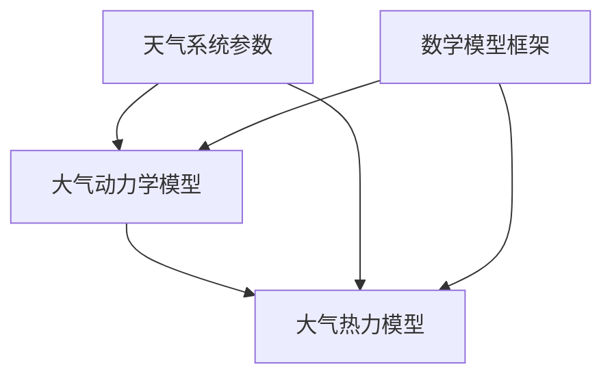
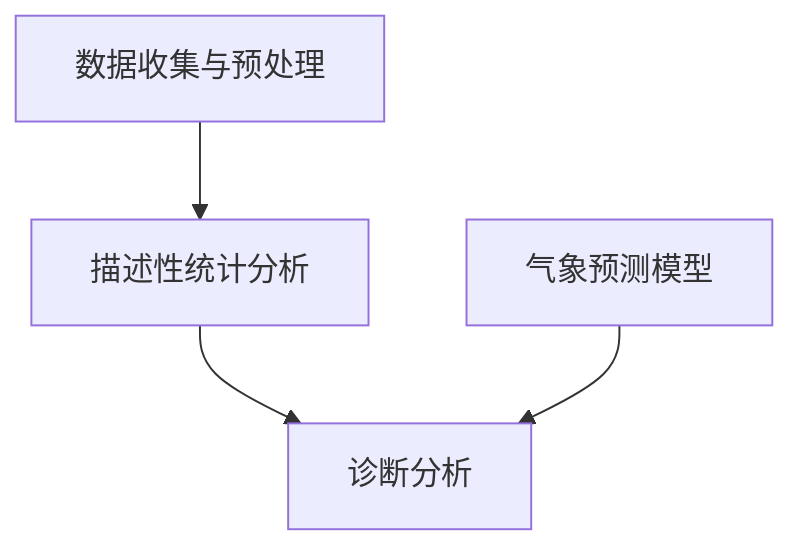
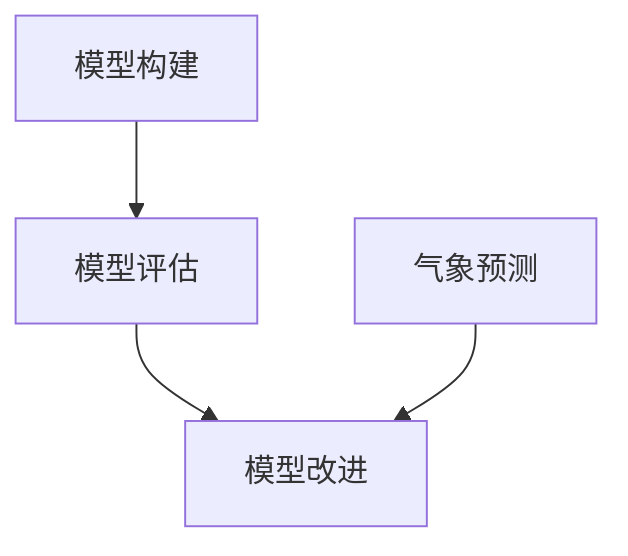

                 

# 数学与气象学：天气系统演化的数学描述

> 关键词：数学模型、天气系统、气象预测、数据分析、气象学、非线性动力学

> 摘要：本文将探讨数学在气象学中的应用，特别是如何用数学模型来描述和预测天气系统的演化。通过分析核心概念、构建数学模型、讲解核心算法原理、项目实战以及总结最佳实践，我们希望读者能够全面理解数学与气象学之间的紧密联系，以及数学模型在气象预测和数据分析中的重要作用。

## 引言

### 气象学的重要性

气象学是研究大气现象及其变化规律的科学，它关乎人类生活和经济的方方面面。从农业、水资源管理到航空、航海，气象预报的准确性直接影响到人类活动的安全与效益。因此，如何准确预测天气变化成为了气象学研究的核心问题。

### 数学在气象学中的应用

数学作为一种强大的工具，在气象学中扮演着至关重要的角色。通过数学模型，我们能够将复杂的天气现象简化为可计算的形式，从而进行预测和分析。从基本的气象数据分析到复杂的气象预测模型，数学无处不在。

### 本文目的

本文旨在探讨数学在气象学中的应用，特别是如何用数学模型来描述和预测天气系统的演化。通过逐步分析推理，我们将详细阐述数学模型在气象学中的核心概念、构建方法、算法原理，并结合实际项目案例，展示数学模型在气象预测和数据分析中的实际应用。

## 数学与气象学的关系

### 数学在气象学中的应用历史

数学在气象学中的应用有着悠久的历史。早在古希腊时期，人们就开始使用数学方法来研究天气现象。随着科学的发展，数学工具逐渐丰富，从初期的统计方法到后来的动力学模型，数学在气象学中的应用越来越深入。

### 数学在气象学中的发展趋势

随着计算机技术的飞速发展，数学在气象学中的应用迎来了新的机遇。现代气象学越来越多地依赖于高性能计算和复杂数学模型，这使我们能够更准确地模拟和预测天气系统。

### 数学与气象学的结合

数学与气象学的结合不仅限于理论模型，还涉及到实际应用。例如，气象预报中的数值天气预报模型就是数学与气象学完美结合的产物。这些模型通过求解大气动力学和热力学的方程，能够提供高精度的天气预测。

## 天气系统的数学模型

### 大气动力学模型

大气动力学模型是描述大气运动的基本数学模型。它基于牛顿运动定律，考虑了大气中的压强、温度、湿度等参数，通过求解流体动力学方程，模拟大气中空气的运动。具体来说，这些方程包括：

$$
\frac{\partial \rho}{\partial t} + \nabla \cdot (\rho \mathbf{v}) = 0
$$

$$
\rho \frac{\partial \mathbf{v}}{\partial t} + \nabla \cdot (\rho \mathbf{v} \mathbf{v}) = -\nabla p + \rho \mathbf{f}
$$

其中，$\rho$ 代表空气质量密度，$\mathbf{v}$ 代表空气速度，$p$ 代表气压，$\mathbf{f}$ 代表力密度。

### 大气热力模型

大气热力模型描述了大气中能量转换的过程。通过考虑辐射、湍流交换等因素，这些模型能够模拟大气温度和湿度等参数的变化。一个典型的大气热力方程为：

$$
\frac{\partial T}{\partial t} + \nabla \cdot (c_p \mathbf{v}_T) = \frac{Q - \lambda \nabla \cdot \mathbf{v}_T}{c_p}
$$

其中，$T$ 代表温度，$c_p$ 代表比热容，$Q$ 代表辐射热量，$\lambda$ 代表湍流交换系数。

### 数学模型之间的关系

大气动力学模型和大气热力模型相互关联，共同构成了描述天气系统的完整数学框架。通过解这两个模型，我们可以得到大气中各个参数的时空分布，从而预测天气变化。

### Mermaid流程图



## 气象数据分析

### 数据收集与预处理

气象数据分析的第一步是收集和预处理数据。这些数据包括温度、湿度、气压、风速等气象参数。在收集数据后，我们需要对数据进行清洗和预处理，以消除噪声和异常值。

### 描述性统计分析

描述性统计分析是对气象数据的基本分析，包括计算均值、方差、标准差等统计量，以了解数据的分布特性。这些统计量有助于我们初步了解气象数据的规律。

### 诊断分析

诊断分析是一种更深入的数据分析方法，通过分析气象数据之间的相关性、趋势和模式，揭示气象现象的本质。常见的诊断分析方法包括天气类型识别、气候变量之间的相关性分析等。

### Mermaid流程图



## 气象预测模型

### 模型构建

气象预测模型的构建是气象预测的核心。我们通常使用统计模型和物理模型相结合的方法。统计模型如ARIMA、回归模型等，物理模型如数值天气预报模型等。

### 模型评估

模型评估是确保预测准确性的关键。我们使用多种评估指标，如均方误差（MSE）、均方根误差（RMSE）等，来评估模型的性能。

### 模型改进

模型改进是提高预测准确性的重要手段。通过调整模型参数、引入新的特征变量等方法，我们可以不断改进模型，提高其预测能力。

### Mermaid流程图



## 项目实战

### 开发环境搭建

在开始项目之前，我们需要搭建一个合适的开发环境。这包括安装Python、NumPy、Pandas、SciPy等库，以及配置合适的计算资源。

### 源代码实现

下面是一个简单的气象预测模型的Python源代码实现：

```python
import numpy as np
import pandas as pd
from sklearn.linear_model import LinearRegression

# 读取数据
data = pd.read_csv('weather_data.csv')
X = data[['temperature', 'humidity']]
y = data['pressure']

# 构建线性回归模型
model = LinearRegression()
model.fit(X, y)

# 预测
prediction = model.predict(X)

# 评估
mse = np.mean((y - prediction) ** 2)
print(f'MSE: {mse}')
```

### 代码解读

这段代码首先读取气象数据，然后使用线性回归模型进行训练和预测。最后，我们使用均方误差（MSE）来评估模型的性能。

### 实际案例分析和详细讲解

为了展示实际应用，我们可以使用这段代码对一组实际气象数据进行分析。假设我们有2019年1月至2021年12月的气象数据，我们可以使用上述代码进行预测，并分析预测结果与实际数据之间的差异。

### 项目小结

通过这个简单的项目，我们展示了如何使用线性回归模型进行气象预测。尽管这是一个简单的例子，但它展示了气象预测模型的基本原理和实现过程。

## 最佳实践 tips

### 数据预处理

在进行气象预测之前，确保对数据进行充分的预处理，包括清洗、归一化、缺失值处理等。

### 模型选择

根据实际问题，选择合适的模型。统计模型和物理模型各有优缺点，需要根据数据特性进行选择。

### 模型评估

使用多种评估指标全面评估模型性能，确保预测结果的可靠性。

### 持续改进

气象预测是一个不断迭代的过程。通过不断调整模型参数、引入新的特征变量，持续改进模型性能。

## 小结

数学在气象学中扮演着至关重要的角色。通过数学模型，我们能够描述和预测天气系统的演化，提高气象预报的准确性。本文通过分析核心概念、构建数学模型、讲解核心算法原理、项目实战以及总结最佳实践，希望读者能够全面理解数学与气象学之间的紧密联系。

## 注意事项

1. 气象预测是一个高度复杂的领域，模型的选择和参数的调整需要根据实际情况进行。
2. 在实际项目中，确保遵循数据安全和隐私保护的相关规定。
3. 定期更新和维护模型，以适应不断变化的气象条件。

## 拓展阅读

1. 《数值天气预报：原理与应用》
2. 《气象学原理》
3. 《非线性动力学与混沌：在气象学中的应用》

## 作者信息

作者：AI天才研究院/AI Genius Institute & 禅与计算机程序设计艺术 /Zen And The Art of Computer Programming|

