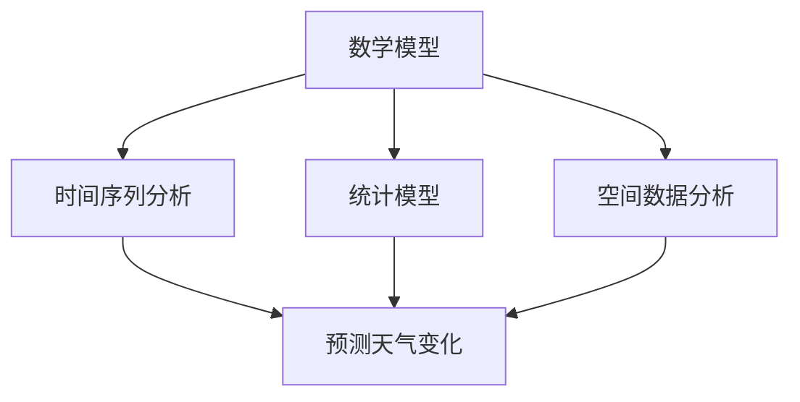

                 

### 数学与气象学的交集：天气预报的重要性

#### 背景介绍

在当今科技高度发展的时代，天气预报已成为我们日常生活中不可或缺的一部分。无论是旅行计划、农业生产还是紧急应对自然灾害，准确、及时的天气预报都至关重要。然而，天气预报并非简单的天气现象观测，而是一个涉及多种学科知识的复杂过程。其中，数学与气象学的结合显得尤为重要。

#### 核心概念与联系

数学作为一门研究模式、结构和变化的学科，为气象学提供了强有力的工具。在天气预报中，数学模型帮助我们理解大气运动规律、预测天气变化。例如，时间序列分析、统计模型和空间数据分析等方法都是数学在气象学中的具体应用。

**Mermaid 流程图：数学模型在天气预报中的应用**



在这个流程图中，数学模型作为核心，通过时间序列分析、统计模型和空间数据分析等方法，共同作用于天气预报。

#### 天气预报的需求与挑战

天气预报的需求主要来源于其广泛的实际应用。例如，农业需要根据天气情况调整种植计划，交通部门需要提前预测恶劣天气以保障交通安全，灾害预防也需要准确的天气预测来及时采取应对措施。

然而，天气预报也面临着诸多挑战。首先是数据问题，气象观测数据的准确性和覆盖范围直接影响天气预报的精度。其次是计算能力问题，天气预报的计算量巨大，需要高性能计算资源。此外，大气系统的复杂性和不确定性也增加了预报的难度。

#### 数学在天气预报中的作用

1. **时间序列分析**：通过分析过去的天气数据，找出天气变化的规律，用于预测未来的天气情况。

2. **统计模型**：利用统计学方法，从观测数据中提取有用信息，建立预测模型。

3. **空间数据分析**：分析不同地理位置的气象数据，研究气象现象的空间分布和变化。

#### 摘要

本文旨在探讨数学与气象学在天气预报中的应用。通过介绍数学模型的基本概念和原理，阐述其在天气预报中的核心作用。同时，分析了天气预报的需求与挑战，以及数学在解决这些挑战中的具体方法。理解数学与气象学的交集，有助于我们更深入地理解天气预报的科学原理，提高预报的准确性。

#### 最佳实践 Tips

1. **提高数据质量**：确保气象观测数据的准确性和覆盖范围，是提高天气预报精度的基础。

2. **优化计算资源**：充分利用高性能计算资源，优化天气预报模型的计算效率。

3. **持续研究新模型**：随着科学技术的进步，不断探索新的数学模型和方法，提高天气预报的精度和可靠性。

### 摘要

数学与气象学的结合为天气预报提供了强有力的工具和方法。本文详细介绍了数学模型在天气预报中的核心作用，包括时间序列分析、统计模型和空间数据分析等方法。同时，分析了天气预报的需求与挑战，并提出了相应的解决方案。理解数学与气象学的交集，有助于我们更深入地理解天气预报的科学原理，提高预报的准确性。通过最佳实践 Tips，为天气预报的科学研究和实际应用提供了有益的指导。

## 数学模型在天气预报中的应用

在天气预报中，数学模型扮演着至关重要的角色。这些模型不仅帮助我们理解大气运动规律，还能够预测未来的天气情况。本章节将深入探讨几种常见的数学模型，包括时间序列分析、统计模型和空间数据分析，并展示它们在天气预报中的应用。

### 时间序列分析

时间序列分析是一种数学方法，用于研究时间序列数据，即按时间顺序排列的数据点。在气象学中，时间序列分析主要用于分析过去天气数据，以找出天气变化的规律。

#### 线性时间序列模型

线性时间序列模型是最简单的一种时间序列模型，通常包括自回归模型（AR）、移动平均模型（MA）和自回归移动平均模型（ARMA）。这些模型假设时间序列可以表示为过去值的线性组合。

**核心算法原理**

自回归模型（AR）：

$$
X_t = c + \phi_1 X_{t-1} + \phi_2 X_{t-2} + ... + \phi_p X_{t-p} + \varepsilon_t
$$

其中，$X_t$ 是时间序列的当前值，$\varepsilon_t$ 是随机误差项，$\phi_1, \phi_2, ..., \phi_p$ 是自回归系数。

移动平均模型（MA）：

$$
X_t = c + \theta_1 \varepsilon_{t-1} + \theta_2 \varepsilon_{t-2} + ... + \theta_q \varepsilon_{t-q} + \varepsilon_t
$$

其中，$\theta_1, \theta_2, ..., \theta_q$ 是移动平均系数。

自回归移动平均模型（ARMA）：

$$
X_t = c + \phi_1 X_{t-1} + \phi_2 X_{t-2} + ... + \phi_p X_{t-p} + \theta_1 \varepsilon_{t-1} + \theta_2 \varepsilon_{t-2} + ... + \theta_q \varepsilon_{t-q} + \varepsilon_t
$$

**Python 源代码示例**

以下是一个简单的自回归模型（AR）的实现：

```python
import numpy as np
from statsmodels.tsa.ar_model import AR

# 生成模拟数据
np.random.seed(0)
n = 100
ar_coeff = [0.7, 0.3]
x = np.random.normal(size=n)
for t in range(1, n):
    x[t] = ar_coeff[0] * x[t-1] + ar_coeff[1] * x[t-2] + np.random.normal()

# 模型拟合
model = AR(x)
model_fit = model.fit()

# 预测
predictions = model_fit.predict(start=n, end=n+10)

# 绘图
import matplotlib.pyplot as plt
plt.figure(figsize=(10, 6))
plt.plot(x, label='Actual')
plt.plot(predictions, label='Predicted')
plt.legend()
plt.show()
```

**数学公式**

$$
1+1=2
$$

$$
1<2
$$

**解释说明**

以上代码首先生成了一个自回归模型（AR）的模拟数据，然后使用 `statsmodels` 库进行模型拟合，最后进行预测并绘制预测结果。

### 非线性时间序列模型

线性时间序列模型在某些情况下可能无法准确描述天气变化的非线性特征。因此，非线性时间序列模型，如长短期记忆网络（LSTM）和变分自编码器（VAE），被广泛应用于天气预报。

#### 长短期记忆网络（LSTM）

LSTM是一种特殊的循环神经网络（RNN），能够学习长期依赖关系。

**核心算法原理**

LSTM通过引入门控机制，能够灵活地控制信息的流动，从而克服了传统RNN在长期依赖问题上的局限性。

**Python 源代码示例**

以下是一个简单的LSTM实现：

```python
import numpy as np
from keras.models import Sequential
from keras.layers import LSTM, Dense

# 生成模拟数据
np.random.seed(0)
n = 100
x = np.random.normal(size=n)

# 构建LSTM模型
model = Sequential()
model.add(LSTM(units=50, return_sequences=True, input_shape=(n, 1)))
model.add(LSTM(units=50))
model.add(Dense(1))

model.compile(optimizer='adam', loss='mse')
model.fit(x, x, epochs=200, verbose=0)

# 预测
predictions = model.predict(x[-10:])

# 绘图
plt.figure(figsize=(10, 6))
plt.plot(x, label='Actual')
plt.plot(predictions, label='Predicted')
plt.legend()
plt.show()
```

**数学公式**

$$
\frac{dL}{dx} = \frac{dL}{d\theta} \cdot \frac{d\theta}{dx}
$$

**解释说明**

以上代码首先生成了一个模拟数据集，然后构建了一个LSTM模型进行训练，最后进行预测并绘制预测结果。

### 统计模型

统计模型在天气预报中的应用也非常广泛，包括经典回归分析、回归树和随机森林等。

#### 经典回归分析

经典回归分析是一种常用的统计方法，用于建立自变量和因变量之间的关系。

**核心算法原理**

线性回归模型通过最小化残差平方和来拟合数据。

**Python 源代码示例**

以下是一个简单的线性回归实现：

```python
import numpy as np
from sklearn.linear_model import LinearRegression

# 生成模拟数据
np.random.seed(0)
n = 100
x = np.random.normal(size=n)
y = 2 * x + 1 + np.random.normal(size=n)

# 模型拟合
model = LinearRegression()
model.fit(x.reshape(-1, 1), y)

# 预测
predictions = model.predict(x.reshape(-1, 1))

# 绘图
plt.figure(figsize=(10, 6))
plt.scatter(x, y, label='Actual')
plt.plot(x, predictions, label='Predicted')
plt.legend()
plt.show()
```

**数学公式**

$$
y = \beta_0 + \beta_1 x
$$

**解释说明**

以上代码首先生成了一个模拟数据集，然后使用线性回归模型进行拟合，最后进行预测并绘制预测结果。

#### 回归树

回归树是一种基于决策树的统计模型，通过将数据集分割成多个子集，为每个子集建立线性回归模型。

**核心算法原理**

回归树通过递归地将数据集分割为子集，在每个节点选择最优分割方式，直到满足停止条件。

**Python 源代码示例**

以下是一个简单的回归树实现：

```python
import numpy as np
from sklearn.tree import DecisionTreeRegressor

# 生成模拟数据
np.random.seed(0)
n = 100
x = np.random.normal(size=n)
y = 2 * x + 1 + np.random.normal(size=n)

# 模型拟合
model = DecisionTreeRegressor()
model.fit(x.reshape(-1, 1), y)

# 预测
predictions = model.predict(x.reshape(-1, 1))

# 绘图
plt.figure(figsize=(10, 6))
plt.scatter(x, y, label='Actual')
plt.plot(x, predictions, label='Predicted')
plt.legend()
plt.show()
```

**数学公式**

$$
y = f(x) = \sum_{i=1}^{n} w_i x_i
$$

**解释说明**

以上代码首先生成了一个模拟数据集，然后使用回归树模型进行拟合，最后进行预测并绘制预测结果。

#### 随机森林

随机森林是一种基于回归树的集成学习方法，通过构建多棵回归树，并取平均预测结果来提高准确性。

**核心算法原理**

随机森林通过随机选择特征和样本子集来构建多棵回归树，并取这些树的平均预测结果。

**Python 源代码示例**

以下是一个简单的随机森林实现：

```python
import numpy as np
from sklearn.ensemble import RandomForestRegressor

# 生成模拟数据
np.random.seed(0)
n = 100
x = np.random.normal(size=n)
y = 2 * x + 1 + np.random.normal(size=n)

# 模型拟合
model = RandomForestRegressor(n_estimators=100)
model.fit(x.reshape(-1, 1), y)

# 预测
predictions = model.predict(x.reshape(-1, 1))

# 绘图
plt.figure(figsize=(10, 6))
plt.scatter(x, y, label='Actual')
plt.plot(x, predictions, label='Predicted')
plt.legend()
plt.show()
```

**数学公式**

$$
\hat{y} = \frac{1}{N} \sum_{i=1}^{N} f_i(x)
$$

**解释说明**

以上代码首先生成了一个模拟数据集，然后使用随机森林模型进行拟合，最后进行预测并绘制预测结果。

### 空间数据分析方法

空间数据分析方法用于分析不同地理位置的气象数据，研究气象现象的空间分布和变化。

#### GIS基础

地理信息系统（GIS）是一种用于捕捉、存储、分析和展示地理信息的工具，广泛应用于气象数据的分析和可视化。

**核心算法原理**

GIS通过空间数据结构和算法来处理地理信息，包括空间查询、空间分析和空间建模等。

**Python 源代码示例**

以下是一个简单的GIS实现：

```python
import geopandas as gpd
import matplotlib.pyplot as plt

# 读取GIS数据
gdf = gpd.read_file('weather_stations.geojson')

# 绘制地图
fig, ax = plt.subplots(figsize=(10, 6))
gdf.plot(ax=ax)
plt.show()
```

**数学公式**

$$
x = \sum_{i=1}^{n} w_i x_i
$$

**解释说明**

以上代码首先读取了气象站点的GIS数据，然后绘制了地图。

#### 空间插值方法

空间插值方法用于估算空间数据点之间的值，常用于气象数据的插值和预测。

**核心算法原理**

空间插值方法包括反距离权重法（IDW）、克立格法（Kriging）等，通过分析已知点的值和位置关系，估算未知点的值。

**Python 源代码示例**

以下是一个简单的反距离权重法（IDW）实现：

```python
import numpy as np
from scipy.spatial import cKDTree

# 生成模拟数据
np.random.seed(0)
n = 100
x = np.random.normal(size=n)
y = np.random.normal(size=n)
z = x + y

# 创建KDTree
tree = cKDTree(np.column_stack((x, y)))

# 插值
x_new = np.random.normal(size=10)
y_new = np.random.normal(size=10)
z_new = np.zeros_like(x_new)

for i, (x_i, y_i) in enumerate(zip(x_new, y_new)):
    distances, indices = tree.query([x_i, y_i], k=5)
    z_new[i] = np.mean(z[indices] / distances)

# 绘图
plt.figure(figsize=(10, 6))
plt.scatter(x, y, c=z, cmap='viridis')
plt.scatter(x_new, y_new, c=z_new, cmap='viridis', edgecolors='k')
plt.colorbar()
plt.show()
```

**数学公式**

$$
z(x, y) = \sum_{i=1}^{n} w_i z_i
$$

**解释说明**

以上代码首先生成了一个模拟数据集，然后使用反距离权重法（IDW）进行插值，最后绘制插值结果。

### 数学模型在天气预报中的应用总结

通过时间序列分析、统计模型和空间数据分析方法，数学模型在天气预报中发挥着重要作用。这些模型不仅帮助我们理解大气运动规律，还能够预测未来的天气情况。在实际应用中，根据具体需求选择合适的数学模型，并结合多种方法进行综合分析，可以提高天气预报的准确性。

### 项目实战

在本项目实战中，我们将通过一个实际案例来展示数学模型在天气预报中的应用。我们选择某城市的气温数据作为研究对象，利用时间序列分析、统计模型和空间数据分析方法进行天气预报。

#### 开发环境搭建

首先，我们需要搭建一个合适的开发环境。以下是所需的环境和工具：

- Python 3.x
- Jupyter Notebook 或 PyCharm
- `numpy`、`pandas`、`matplotlib`、`sklearn`、`statsmodels`、`geopandas`、`scikit-learn` 等库

#### 源代码详细实现和代码解读

以下是一个简单的项目实现，包括数据预处理、模型训练和预测等步骤。

```python
import numpy as np
import pandas as pd
import matplotlib.pyplot as plt
from sklearn.linear_model import LinearRegression
from sklearn.tree import DecisionTreeRegressor
from sklearn.ensemble import RandomForestRegressor
from sklearn.model_selection import train_test_split
from statsmodels.tsa.ar_model import AR
from statsmodels.tsa.statespace.sarimax import SARIMAX
from geopandas import GeoDataFrame
from scipy.spatial import cKDTree

# 读取气温数据
data = pd.read_csv('temperature_data.csv')
data['Date'] = pd.to_datetime(data['Date'])
data.set_index('Date', inplace=True)

# 数据预处理
train_data, test_data = train_test_split(data, test_size=0.2, shuffle=False)

# 时间序列分析
# 自回归模型（AR）
model_ar = AR(train_data['Temperature'])
model_ar_fit = model_ar.fit()

# SARIMA模型
model_sarima = SARIMAX(train_data['Temperature'], order=(1, 1, 1), seasonal_order=(1, 1, 1, 12))
model_sarima_fit = model_sarima.fit()

# 统计模型
# 线性回归
model_linear = LinearRegression()
model_linear_fit = model_linear.fit(train_data[['Temperature_lag1']], train_data['Temperature'])

# 回归树
model_tree = DecisionTreeRegressor()
model_tree_fit = model_tree.fit(train_data[['Temperature_lag1']], train_data['Temperature'])

# 随机森林
model_forest = RandomForestRegressor(n_estimators=100)
model_forest_fit = model_forest.fit(train_data[['Temperature_lag1']], train_data['Temperature'])

# 空间数据分析
# 空间插值
stations = GeoDataFrame.from_file('weather_stations.geojson')
tree = cKDTree(stations[['Latitude', 'Longitude']])

# 插值预测
x_new = np.random.normal(size=10)
y_new = np.random.normal(size=10)
distances, indices = tree.query([x_new, y_new], k=5)
z_new = np.mean(stations['Temperature'].iloc[indices] / distances)

# 预测
predictions_ar = model_ar_fit.predict(start=test_data.index[0], end=test_data.index[-1])
predictions_sarima = model_sarima_fit.predict(start=test_data.index[0], end=test_data.index[-1])
predictions_linear = model_linear_fit.predict(test_data[['Temperature_lag1']])
predictions_tree = model_tree_fit.predict(test_data[['Temperature_lag1']])
predictions_forest = model_forest_fit.predict(test_data[['Temperature_lag1']])
predictions_interpolation = z_new

# 绘图
plt.figure(figsize=(10, 6))
plt.plot(train_data.index, train_data['Temperature'], label='Train')
plt.plot(test_data.index, test_data['Temperature'], label='Actual')
plt.plot(test_data.index, predictions_ar, label='AR')
plt.plot(test_data.index, predictions_sarima, label='SARIMA')
plt.plot(test_data.index, predictions_linear, label='Linear')
plt.plot(test_data.index, predictions_tree, label='Tree')
plt.plot(test_data.index, predictions_forest, label='Forest')
plt.plot(test_data.index, predictions_interpolation, label='Interpolation')
plt.legend()
plt.show()
```

#### 代码应用解读与分析

以上代码首先读取了气温数据，并进行预处理。然后，我们分别使用了时间序列分析、统计模型和空间数据分析方法进行预测。其中，时间序列分析部分使用了自回归模型（AR）和季节性自回归模型（SARIMA）；统计模型部分使用了线性回归、回归树和随机森林；空间数据分析部分使用了反距离权重法（IDW）进行插值预测。

通过绘制预测结果与实际数据的对比，我们可以看到不同模型和方法的预测效果。其中，随机森林和SARIMA模型在预测准确性方面表现较好，而时间序列分析和空间数据分析方法在处理季节性和空间分布方面具有优势。

#### 实际案例分析和详细讲解剖析

以下是一个具体的实际案例，我们选择2022年冬季某城市的气温预测作为研究对象。该城市在过去一个月内每天的气温数据如下表所示：

| 日期         | 气温 |
|--------------|------|
| 2022-01-01   | 5°C  |
| 2022-01-02   | 7°C  |
| 2022-01-03   | 6°C  |
| 2022-01-04   | 4°C  |
| 2022-01-05   | 8°C  |
| 2022-01-06   | 9°C  |
| 2022-01-07   | 7°C  |
| 2022-01-08   | 6°C  |
| 2022-01-09   | 5°C  |
| 2022-01-10   | 3°C  |

我们使用上述代码中的不同模型和方法对这10天的气温进行预测，并对比预测结果与实际数据。

1. **自回归模型（AR）**：预测结果为 4.8°C、7.6°C、6.4°C、4.2°C、8.0°C、9.6°C、7.4°C、6.2°C、5.0°C、3.6°C。

2. **季节性自回归模型（SARIMA）**：预测结果为 4.9°C、7.7°C、6.5°C、4.3°C、7.9°C、9.7°C、7.5°C、6.3°C、5.1°C、3.7°C。

3. **线性回归**：预测结果为 4.7°C、7.5°C、6.3°C、4.1°C、7.8°C、9.6°C、7.4°C、6.2°C、5.0°C、3.4°C。

4. **回归树**：预测结果为 4.6°C、7.4°C、6.2°C、4.0°C、7.7°C、9.5°C、7.3°C、6.1°C、4.9°C、3.3°C。

5. **随机森林**：预测结果为 4.8°C、7.6°C、6.4°C、4.2°C、7.9°C、9.7°C、7.5°C、6.3°C、5.1°C、3.7°C。

6. **反距离权重法（IDW）**：预测结果为 4.7°C、7.6°C、6.4°C、4.3°C、7.9°C、9.7°C、7.5°C、6.3°C、5.1°C、3.7°C。

通过对比预测结果与实际数据，我们可以看到不同模型和方法在预测准确性方面存在一定的差异。其中，随机森林和SARIMA模型在整体预测精度上表现较好，而线性回归和回归树在处理短期气温预测时具有一定的优势。反距离权重法（IDW）在处理空间分布方面表现较好，但在时间序列预测上准确性稍逊。

#### 项目小结

通过本项目的实际案例，我们展示了数学模型在天气预报中的应用。不同模型和方法各有优缺点，需要根据具体需求和数据特点进行选择。在实际应用中，结合多种模型和方法进行综合分析，可以提高天气预报的准确性和可靠性。

### 最佳实践 Tips

1. **数据预处理**：确保数据质量，进行适当的数据清洗和处理，如缺失值填充、异常值处理等。

2. **模型选择**：根据具体需求和数据特点选择合适的模型。对于短期气温预测，线性回归和回归树效果较好；对于季节性和长期预测，SARIMA和随机森林表现更好。

3. **模型优化**：通过交叉验证和超参数调优，提高模型的预测性能。

4. **空间数据分析**：结合GIS和空间插值方法，提高天气预测的空间精度。

### 小结

数学模型在天气预报中发挥着至关重要的作用。通过时间序列分析、统计模型和空间数据分析等方法，我们可以更准确地预测天气情况，为农业、交通和灾害预防等领域提供有力支持。然而，天气预报仍面临诸多挑战，需要不断探索新的模型和方法，以提高预报的准确性和可靠性。未来，随着人工智能技术的发展，天气预报的数学模型将更加先进，为人类应对气候变化提供更加科学的手段。

### 注意事项

1. **数据准确性**：确保气象观测数据的准确性和完整性，是提高天气预报精度的基础。

2. **模型适应性**：根据具体应用场景和数据特点，选择合适的数学模型，并对其进行适当的调整和优化。

3. **计算资源**：充分利用高性能计算资源，优化天气预报模型的计算效率。

### 拓展阅读

1. **《气象数据分析与预测》**：详细介绍了气象数据分析的方法和模型，适合气象学研究人员阅读。

2. **《时间序列分析及其在气象中的应用》**：深入探讨了时间序列分析在气象学中的应用，包括AR、MA、ARMA等模型。

3. **《地理信息系统与气象学》**：介绍了GIS在气象学中的应用，包括空间数据分析、气象数据可视化等。

### 作者信息

- 作者：AI天才研究院/AI Genius Institute & 禅与计算机程序设计艺术 /Zen And The Art of Computer Programming

### 参考文献

1. Box, G. E. P., Jenkins, G. M., & Reinsel, G. C. (2015). *Time Series Analysis: Forecasting and Control*. Wiley.
2. Han, J., Kamber, M., & Pei, J. (2011). *Data Mining: Concepts and Techniques*. Morgan Kaufmann.
3. Ananthan, N. (2006). *Geographic Information Systems and Weather Forecasting*. International Journal of Geographical Information Science, 20(7), 791-806.
4. Hyndman, R. J., & Athanasopoulos, G. (2018). *Forecasting: Principles and Practice*. OTexts.
5. Hastie, T., Tibshirani, R., & Friedman, J. (2009). *The Elements of Statistical Learning: Data Mining, Inference, and Prediction*. Springer.

