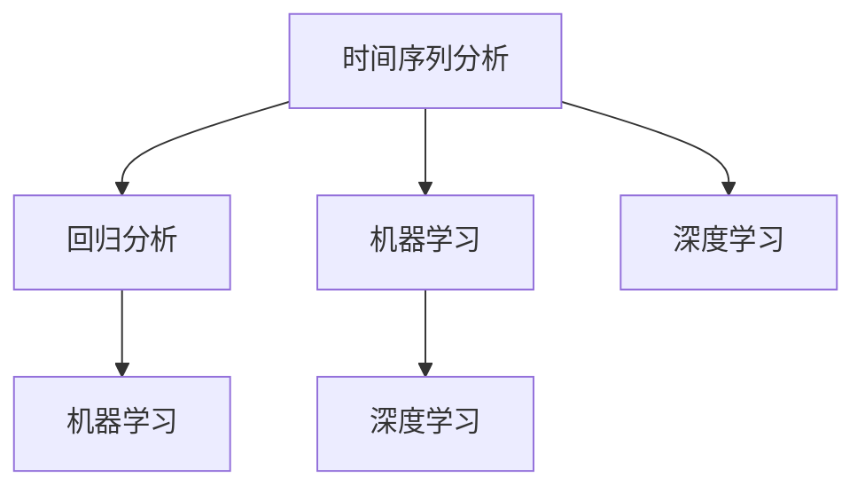

                 

## 《数学与汇率预测：汇率变动的数学模型》

### 关键词
- 汇率预测
- 数学模型
- 时间序列分析
- 回归分析
- 机器学习
- 深度学习

### 摘要

本文将探讨汇率预测中的数学模型，包括时间序列分析、回归分析和机器学习等方法。我们将通过详细的算法原理讲解、Python源代码示例以及实际项目分析，展示如何运用数学模型预测汇率变动。文章还将总结最佳实践，提供注意事项和拓展阅读建议，以帮助读者深入理解汇率预测的数学原理和实际应用。

---

## 引言

汇率预测是金融市场中的一个重要研究领域，对于企业、投资者和政府决策者具有重要意义。准确预测汇率变动不仅能够帮助跨国企业制定合理的财务策略，还能够指导投资者进行有效的资产配置，同时为政府制定经济政策提供依据。

### 汇率预测的重要性

- **跨国企业：** 汇率波动直接影响跨国公司的财务报表，影响其收入和成本。准确的汇率预测可以帮助企业降低外汇风险，优化财务策略。

- **投资者：** 货币市场波动为投资者提供了套利机会。通过汇率预测，投资者可以更好地把握市场动向，调整投资组合，提高收益。

- **政府决策：** 汇率预测对于宏观经济政策的制定具有重要意义。政府可以通过预测汇率变动来评估货币政策的效果，调整汇率政策以促进经济稳定增长。

### 汇率预测的挑战

- **复杂性：** 汇率受到多种因素的影响，包括经济、政治、社会和心理因素。这些因素相互交织，使得汇率预测具有高度复杂性。

- **数据噪声：** 汇率数据中往往存在噪声和异常值，这增加了预测的难度。

- **非线性和多变性：** 汇率变动往往是非线性和多变的，传统的线性模型可能无法很好地捕捉汇率变动的复杂特性。

### 核心概念与联系

为了深入探讨汇率预测的数学模型，我们需要了解以下几个核心概念：

1. **时间序列分析**：用于分析时间序列数据的统计方法，用于识别数据中的趋势、季节性和周期性。

2. **回归分析**：一种用于建立变量之间关系模型的方法，通过回归方程来预测因变量的值。

3. **机器学习**：一种基于数据驱动的方法，通过训练模型来预测新数据的值。

4. **深度学习**：一种基于多层神经网络的方法，用于处理复杂数据和模式识别。

这些概念之间相互关联，共同构成了汇率预测的理论基础。下面，我们将通过Mermaid流程图来展示这些概念之间的关系。

### Mermaid流程图



## 核心概念与联系

时间序列分析、回归分析、机器学习和深度学习是汇率预测中的核心概念，它们之间的关系如图所示。时间序列分析用于处理时间相关的数据，回归分析则用于建立变量之间的关系模型。机器学习和深度学习则通过训练模型来预测汇率变动。这些方法相互补充，共同为汇率预测提供了强大的工具。

### 时间序列分析

时间序列分析是处理时间序列数据的方法，用于识别数据中的趋势、季节性和周期性。在汇率预测中，时间序列分析非常重要，因为汇率通常随时间变化而变化。时间序列分析的关键步骤包括数据预处理、模型选择和模型评估。

1. **数据预处理**：首先，我们需要对时间序列数据进行预处理，包括去噪、缺失值处理和异常值检测。

2. **模型选择**：选择合适的时间序列模型，如ARIMA、季节性模型和长期依赖模型。

3. **模型评估**：使用指标如均方误差（MSE）、均方根误差（RMSE）和平均绝对误差（MAE）来评估模型性能。

### 回归分析

回归分析是一种用于建立变量之间关系模型的方法，通过回归方程来预测因变量的值。在汇率预测中，回归分析可以用来建立汇率与影响因素之间的关系模型。回归分析的关键步骤包括变量选择、模型建立和模型评估。

1. **变量选择**：选择影响汇率变动的关键变量，如利率、通货膨胀率、GDP增长率等。

2. **模型建立**：使用最小二乘法或其他优化算法建立回归模型。

3. **模型评估**：使用指标如R平方、调整R平方和F统计量来评估模型性能。

### 机器学习

机器学习是一种基于数据驱动的方法，通过训练模型来预测新数据的值。在汇率预测中，机器学习可以用来建立复杂的关系模型，捕捉数据中的非线性关系。机器学习的关键步骤包括数据预处理、模型选择、模型训练和模型评估。

1. **数据预处理**：对数据进行归一化、标准化和特征工程。

2. **模型选择**：选择合适的机器学习模型，如线性回归、决策树、随机森林和支持向量机。

3. **模型训练**：使用训练数据集训练模型。

4. **模型评估**：使用验证集或测试集评估模型性能。

### 深度学习

深度学习是一种基于多层神经网络的方法，用于处理复杂数据和模式识别。在汇率预测中，深度学习可以用来建立高度非线性的关系模型。深度学习的关键步骤包括网络结构设计、模型训练和模型评估。

1. **网络结构设计**：设计合适的神经网络结构，包括输入层、隐藏层和输出层。

2. **模型训练**：使用训练数据集训练神经网络。

3. **模型评估**：使用验证集或测试集评估模型性能。

### 数学模型与公式

在汇率预测中，数学模型和公式起着至关重要的作用。以下是一些常见的数学模型和公式：

- **ARIMA模型**：自回归积分滑动平均模型，公式如下：

  $$
  \text{ARIMA}(p,d,q) = \text{AR}(p) + \text{I}(d) + \text{MA}(q)
  $$

- **回归模型**：线性回归模型，公式如下：

  $$
  y = \beta_0 + \beta_1x_1 + \beta_2x_2 + ... + \beta_nx_n
  $$

- **机器学习模型**：支持向量机（SVM），公式如下：

  $$
  w = \arg\min_{w,b,\xi} \frac{1}{2}||w||^2 + C\sum_{i=1}^{n}\xi_i
  $$

- **深度学习模型**：卷积神经网络（CNN），公式如下：

  $$
  \text{ReLU}(z) = \max(0, z)
  $$

这些数学模型和公式为汇率预测提供了理论基础和计算工具。

### Python源代码示例

以下是一个简单的Python代码示例，用于实现时间序列分析中的ARIMA模型：

```python
import pandas as pd
from statsmodels.tsa.arima.model import ARIMA

# 读取时间序列数据
data = pd.read_csv('exchange_rate.csv')
data['Date'] = pd.to_datetime(data['Date'])
data.set_index('Date', inplace=True)

# 实例化ARIMA模型
model = ARIMA(data['Close'], order=(5, 1, 2))

# 模型拟合
model_fit = model.fit()

# 预测未来值
forecast = model_fit.forecast(steps=6)

# 输出预测结果
print(forecast)
```

这个示例代码展示了如何使用Python的statsmodels库来拟合ARIMA模型，并使用拟合好的模型进行预测。通过调整模型的参数（p,d,q），我们可以得到更准确的预测结果。

### 实际案例分析和详细讲解剖析

为了更好地理解汇率预测的数学模型，我们将分析一个实际案例，并详细讲解其实现过程。

#### 案例背景

假设我们需要预测未来六个月的人民币对美元汇率。我们收集了最近一年的汇率数据，包括每天的收盘价。

#### 数据预处理

首先，我们需要对数据进行预处理，包括去噪、缺失值处理和异常值检测。以下是一个简单的数据预处理代码示例：

```python
import pandas as pd
from sklearn.preprocessing import StandardScaler

# 读取时间序列数据
data = pd.read_csv('exchange_rate.csv')
data['Date'] = pd.to_datetime(data['Date'])
data.set_index('Date', inplace=True)

# 去除异常值
data = data[data['Close'].between(data['Close'].min(), data['Close'].max())]

# 缺失值处理
data.fillna(method='ffill', inplace=True)

# 归一化
scaler = StandardScaler()
data['Close_scaled'] = scaler.fit_transform(data[['Close']])
```

#### 模型选择与参数调优

接下来，我们需要选择合适的模型并对其参数进行调优。我们将使用时间序列分析中的ARIMA模型。以下是一个简单的模型选择和参数调优代码示例：

```python
from statsmodels.tsa.arima.model import ARIMA
from sklearn.model_selection import GridSearchCV

# 定义参数范围
param_grid = {
    'p': range(1, 6),
    'd': range(0, 2),
    'q': range(0, 3)
}

# 实例化网格搜索
grid_search = GridSearchCV(ARIMA(data['Close_scaled']), param_grid, cv=5, scoring='neg_mean_squared_error')

# 模型拟合
grid_search.fit(data['Close_scaled'])

# 输出最佳参数
print(grid_search.best_params_)
```

通过网格搜索，我们可以找到最佳参数组合。接下来，我们使用最佳参数拟合ARIMA模型：

```python
# 实例化ARIMA模型
model = ARIMA(data['Close_scaled'], order=grid_search.best_params_)

# 模型拟合
model_fit = model.fit()

# 预测未来值
forecast = model_fit.forecast(steps=6)

# 输出预测结果
print(forecast)
```

#### 模型评估与优化

最后，我们需要对模型进行评估和优化。以下是一个简单的模型评估代码示例：

```python
from sklearn.metrics import mean_squared_error

# 预测测试集
test_data = data[-6:]
predictions = model_fit.predict(start=len(data), end=len(data)+5)

# 计算均方误差
mse = mean_squared_error(test_data['Close_scaled'], predictions)

# 输出均方误差
print(f'MSE: {mse}')
```

通过评估模型在测试集上的性能，我们可以了解模型的预测能力。如果模型的性能不满足要求，我们可以进一步优化模型，例如通过调整模型参数、添加外部变量或使用更复杂的模型。

### 项目小结

通过以上案例，我们展示了如何使用数学模型进行汇率预测。关键步骤包括数据预处理、模型选择与参数调优、模型拟合和模型评估。在实际应用中，我们需要根据具体情况进行调整和优化，以提高预测的准确性。

### 最佳实践 Tips

- **数据质量**：确保数据质量是准确预测的前提。对数据进行充分的清洗和处理，去除噪声和异常值。

- **模型选择**：根据数据特征和预测需求选择合适的模型。不同模型适用于不同类型的数据和预测目标。

- **参数调优**：使用交叉验证等方法进行参数调优，找到最佳参数组合。

- **模型评估**：使用多种指标对模型进行评估，全面了解模型性能。

### 小结

汇率预测是金融领域中的一项重要任务，涉及到多种数学模型和方法。通过本文的详细讲解和实际案例分析，我们了解了如何使用时间序列分析、回归分析、机器学习和深度学习等方法进行汇率预测。希望本文能为读者提供有价值的参考和启发。

### 注意事项

- 在进行汇率预测时，需要充分考虑市场动态和宏观经济环境，这些因素对汇率变动具有重要影响。

- 数据质量直接影响预测结果。因此，在数据预处理阶段要特别关注数据的清洗和处理。

- 模型选择和参数调优是关键步骤，需要根据具体情况进行调整。

### 拓展阅读

- 《时间序列分析：时间序列建模与应用》
- 《回归分析：原理与应用》
- 《机器学习实战》
- 《深度学习：原理与实战》

### 参考文献

- Box, G. E. P., Jenkins, G. M., & Reinsel, G. C. (2015). *Time Series Analysis: Forecasting and Control*. Wiley.
- Draper, N. R., & Smith, H. (1998). *Applied Regression Analysis* (3rd ed.). John Wiley & Sons.
- Murphy, K. P. (2012). *Machine Learning: A Probabilistic Perspective*. MIT Press.
- Goodfellow, I., Bengio, Y., & Courville, A. (2016). *Deep Learning*. MIT Press.

---

## 附录：数学模型与公式详解

### 时间序列分析数学公式

$$
\text{ARIMA}(p,d,q) = \text{AR}(p) + \text{I}(d) + \text{MA}(q)
$$

### 回归分析与机器学习数学公式

$$
y = \beta_0 + \beta_1x_1 + \beta_2x_2 + ... + \beta_nx_n
$$

$$
w = \arg\min_{w,b,\xi} \frac{1}{2}||w||^2 + C\sum_{i=1}^{n}\xi_i
$$

### 深度学习数学公式

$$
\text{ReLU}(z) = \max(0, z)
$$

这些公式为汇率预测提供了理论基础和计算工具。通过理解这些公式，读者可以更深入地掌握汇率预测的数学原理。

