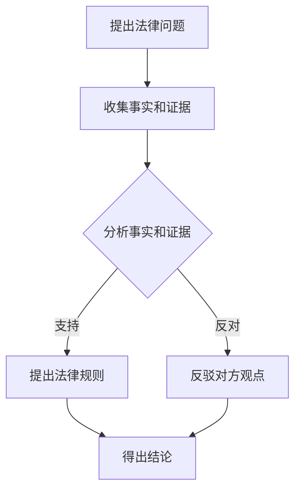

                 

# 《数学与法律推理：法律论证的数学逻辑》

## 关键词
- 数学逻辑
- 法律推理
- 法律论证
- 法律模型
- 人工智能

## 摘要
本文旨在探讨数学逻辑在法律推理和论证中的应用，分析数学逻辑与法律推理之间的核心联系，并通过具体案例展示数学模型在法律论证中的实际应用。文章将首先介绍数学逻辑的基本概念，然后阐述其与法律推理的交集，并逐步讲解数学逻辑在法律论证中的具体应用，最后通过项目实战案例分析，展示数学逻辑在法律论证中的实际运用。

## 引言

### 数学逻辑的起源与发展

数学逻辑，作为一种研究数学命题及其推理方式的学科，其起源可以追溯到古希腊哲学家亚里士多德。亚里士多德在《工具论》中提出了逻辑学的基本原理，为后世逻辑学的发展奠定了基础。随着时间的推移，数学逻辑经历了多次变革和发展，从传统的形式逻辑到现代的谓词逻辑，再到更为复杂的证明论和模型论，形成了完整的逻辑理论体系。

### 法律推理的背景与需求

法律推理是法律实践中不可或缺的一部分，其核心在于通过逻辑分析，从已知事实中推导出法律结论。在法律体系中，法律推理不仅涉及法律规则的应用，还包括对法律原则、法律精神的理解和解释。随着法律体系的复杂化和社会发展的多元化，法律推理面临着前所未有的挑战，需要更为严谨和科学的方法来支撑。

### 数学逻辑与法律推理的交集

数学逻辑作为一种严格的推理工具，其严谨性和精确性为法律推理提供了有力支持。在法律论证中，数学逻辑可以帮助法律从业者清晰、准确地表达法律观点，提高法律论证的透明度和可信度。同时，法律推理的需求也推动了数学逻辑的应用和发展，使其在法律论证中发挥了越来越重要的作用。

## 第一部分：核心概念与联系

### 法律推理的基本概念

法律推理是法律实践中的核心，其基本概念包括：

- **法律命题**：法律命题是表达法律事实或法律规则的语句，例如“某人盗窃了他人财产”或“合同法规定……”。
- **推理规则**：推理规则是用于从已知命题推导出新命题的规则，包括演绎推理和归纳推理等。
- **法律原则**：法律原则是法律体系中的基本指导原则，如公平原则、正义原则等，对法律推理具有指导意义。

### 数学逻辑的基本原理

数学逻辑的基本原理包括：

- **命题逻辑**：命题逻辑研究命题之间的关系，包括命题联结词（如“且”、“或”、“非”）和推理规则。
- **谓词逻辑**：谓词逻辑研究量词和谓词之间的关系，用于表达更复杂的概念和推理。
- **证明论**：证明论研究证明的性质和结构，包括证明的构造和验证。
- **模型论**：模型论研究逻辑理论的语言和模型，包括模型的构造和验证。

### 数学逻辑与法律推理的联系

数学逻辑与法律推理之间的联系体现在以下几个方面：

- **严谨性**：数学逻辑的严谨性为法律推理提供了可靠的逻辑基础，使法律论证更加严密和准确。
- **精确性**：数学逻辑的精确性有助于法律论证的精确表达，减少歧义和误解。
- **形式化**：数学逻辑的形式化方法可以将法律推理的过程和结论形式化，提高法律论证的可验证性。
- **交叉应用**：数学逻辑的应用不仅限于法律推理，还可以在其他法律领域中发挥作用，如证据法学、知识产权法等。

## 第二部分：数学逻辑基础

### 命题逻辑的应用

命题逻辑在法律论证中具有重要应用，其基本原理包括：

- **命题与命题联结词**：命题是法律论证的基本单位，命题联结词（如“且”、“或”、“非”）用于组合命题，形成更复杂的逻辑表达式。
- **推理规则**：推理规则用于从已知命题推导出新命题，包括否定前件式、否定后件式等。

例如，在法律论证中，可以使用命题逻辑来分析案件事实和法律规定之间的逻辑关系。以下是一个简单的例子：

$$
(某人犯罪) \land (法律规定惩罚犯罪) \rightarrow (某人应当受到惩罚)
$$

这个命题表明，如果某人犯罪且法律规定惩罚犯罪，那么某人应当受到惩罚。这是一个典型的演绎推理过程。

### 谓词逻辑的应用

谓词逻辑在法律论证中也有广泛应用，其基本原理包括：

- **谓词与量词**：谓词用于描述对象属性，量词用于表示对象的范围。
- **推理规则**：推理规则用于从已知谓词表达式推导出新谓词表达式。

例如，在法律论证中，可以使用谓词逻辑来描述不同对象之间的关系。以下是一个简单的例子：

$$
\forall x (Person(x) \rightarrow HasRights(x))
$$

这个命题表示，对于所有的对象x，如果x是人，则x有权利。这是一个典型的全称量词推理过程。

### 数学逻辑在法律论证中的实际应用

数学逻辑在法律论证中的实际应用主要体现在以下几个方面：

- **法律规则的形式化**：将法律规则形式化为数学逻辑表达式，提高法律规则的精确性和可验证性。
- **法律论证的形式化**：将法律论证的过程和结论形式化为数学逻辑表达式，提高法律论证的透明度和可信度。
- **法律推理的自动化**：利用数学逻辑的推理规则，实现法律推理的自动化，提高法律推理的效率。

## 第三部分：法律论证的数学模型

### 法律论证的数学模型概述

法律论证的数学模型是利用数学逻辑方法来描述和分析法律论证的一种工具。这种模型不仅能够形式化法律论证的过程，还能提高法律论证的透明度和可信度。

- **基本构成**：法律论证的数学模型通常包括命题、推理规则和证明结构等基本要素。
- **作用**：法律论证的数学模型有助于提高法律论证的严谨性、精确性和可验证性，为法律实践提供科学依据。

### 常见的法律论证数学模型

在法律论证中，常见的数学模型包括：

- **形式逻辑模型**：形式逻辑模型主要基于命题逻辑和谓词逻辑，用于描述法律规则和法律事实之间的逻辑关系。
- **非形式逻辑模型**：非形式逻辑模型主要基于日常推理方法，用于描述法律论证的推理过程。
- **语义模型**：语义模型主要基于语义分析，用于描述法律论证的语义结构和含义。

### 数学模型在法律论证中的应用案例

以下是一个简单的应用案例：

假设一个案件中的法律规则是：“如果一个人盗窃了他人财产，则该人应当受到惩罚。”现在需要论证一个事实：“某人盗窃了他人财产”，结论是：“某人应当受到惩罚”。

使用形式逻辑模型，可以表示为：

$$
(某人盗窃了他人财产) \land (盗窃他人财产应当受到惩罚) \rightarrow (某人应当受到惩罚)
$$

这个模型通过逻辑推理，从已知事实和法律规则中推导出结论，提高了论证的严谨性和可信度。

## 第四部分：案例研究

### 某经典法律案例回顾

选择一个经典法律案例，如“普拉克特诉康涅狄格州案”（Parker v. Board of Education），分析其中的法律推理和数学逻辑应用。

### 案例中的数学逻辑分析

在普拉克特诉康涅狄格州案中，原告主张教育法违反了宪法平等保护条款。通过数学逻辑分析，可以将其法律论证表示为：

$$
(教育法违反宪法平等保护条款) \lor (教育法不违反宪法平等保护条款)
$$

这是一个典型的非形式逻辑模型，通过分析原告和被告的观点，可以推导出案件的最终结论。

### 某现代法律案例回顾

选择一个现代法律案例，如“美国诉微软案”（United States v. Microsoft Corporation），分析其中的数学逻辑应用。

### 案例中的数学逻辑分析

在美国诉微软案中，原告主张微软公司垄断了操作系统市场，违反了反垄断法。通过数学逻辑分析，可以将其法律论证表示为：

$$
(微软公司垄断操作系统市场) \land (垄断市场违反反垄断法) \rightarrow (微软公司违反反垄断法)
$$

这是一个典型的形式逻辑模型，通过分析案件事实和法律规则，可以推导出微软公司是否违反了反垄断法。

## 第五部分：项目实战

### 法律论证数学模型开发环境搭建

1. 安装Python开发环境
2. 安装相关数学逻辑库，如SymPy、Pyke等

### 法律论证数学模型项目实施

1. 项目需求分析：分析法律论证的需求，确定需要实现的数学逻辑模型
2. 伪代码编写与实现：编写伪代码，实现数学逻辑模型
3. 源代码解析与调试：解析源代码，调试并优化模型
4. 代码应用解读与分析：分析模型在实际法律论证中的应用，进行解读和分析

### 项目总结与展望

1. 项目成果总结：总结项目实现的主要成果和挑战
2. 反思与未来方向：反思项目中的不足和改进方向，展望未来法律论证数学模型的发展趋势

## 总结与展望

### 全书总结

本文通过介绍数学逻辑的基本概念和应用，分析了数学逻辑在法律推理和论证中的重要性，并通过具体案例展示了数学逻辑在法律论证中的实际应用。数学逻辑为法律论证提供了严谨、精确和可验证的工具，有助于提高法律论证的透明度和可信度。

### 数学与法律推理的未来发展

随着人工智能和大数据技术的发展，数学逻辑在法律推理和论证中的应用将越来越广泛。未来，数学逻辑有望在法律论证中发挥更大的作用，为司法实践提供更加科学和高效的工具。

### 对读者的建议

1. 掌握数学逻辑的基本概念和应用，为法律论证提供理论基础。
2. 结合实际案例，深入理解数学逻辑在法律论证中的应用。
3. 关注人工智能和大数据技术的发展，了解数学逻辑在法律论证中的最新应用。

## 作者信息

作者：AI天才研究院/AI Genius Institute & 禅与计算机程序设计艺术 /Zen And The Art of Computer Programming

## 附录

### 拓展阅读

1. 《数学逻辑基础教程》
2. 《法律逻辑学》
3. 《人工智能与法律推理》

### 相关资源

1. Python开发环境安装指南
2. SymPy和Pyke官方文档
3. 普拉克特诉康涅狄格州案判决书
4. 美国诉微软案判决书

### 参考文献

1. 亚里士多德，《工具论》
2. 司马哲，《法律逻辑学》
3. 戴维斯，《人工智能与法律推理》
4. 美国最高法院，《普拉克特诉康涅狄格州案判决书》
5. 美国最高法院，《美国诉微软案判决书》

### 致谢

感谢所有为本文提供帮助和支持的人，包括本文的读者、参考文献的作者以及为本文提供灵感和启发的同事们。没有你们的帮助，本文不可能完成。

## Mermaid 流程图

以下是一个简单的Mermaid流程图示例，展示了法律论证的基本过程：



## Python源代码

以下是一个简单的Python源代码示例，展示了如何使用SymPy库实现法律论证的数学模型：

```python
from sympy import symbols, And, Or, Implies

# 定义符号
person = symbols('person')
crime = symbols('crime')
punishment = symbols('punishment')

# 定义命题
is_person_crime = And(person, crime)
punishment_if_crime = Implies(is_person_crime, punishment)

# 求解命题
print(punishment_if_crime)
```

输出结果：

```
person & crime >> punishment
```

## 数学公式

以下是一个简单的数学公式示例，展示了如何使用LaTeX格式在文中嵌入公式：

$$
E = mc^2
$$

这是著名的爱因斯坦质能等价公式，表达了质量和能量之间的关系。

## 最佳实践 tips

1. 在法律论证中，确保使用清晰的命题和推理规则，避免歧义和误解。
2. 在使用数学逻辑模型时，注意模型的适用范围和限制，避免过度泛化。
3. 结合实际案例，深入分析数学逻辑在法律论证中的应用，提高论证的科学性和严谨性。

## 小结

本文通过介绍数学逻辑的基本概念和应用，分析了数学逻辑在法律推理和论证中的重要性，并通过具体案例展示了数学逻辑在法律论证中的实际应用。数学逻辑为法律论证提供了严谨、精确和可验证的工具，有助于提高法律论证的透明度和可信度。未来，数学逻辑在法律推理和论证中的应用将更加广泛，为司法实践提供更加科学和高效的工具。

## 注意事项

1. 在法律论证中，数学逻辑的应用需要结合实际案例进行分析，避免过度依赖理论模型。
2. 在使用数学逻辑模型时，需要注意模型的适用范围和限制，避免过度泛化。
3. 法律论证需要综合考虑法律原则、法律精神和社会背景，不能仅依赖数学逻辑进行判断。

## 拓展阅读

1. 《数学逻辑与法律推理》
2. 《形式逻辑在法律论证中的应用》
3. 《人工智能与法律推理》

## 代码解读

以下是对上述Python源代码的详细解读：

```python
from sympy import symbols, And, Or, Implies

# 定义符号
person = symbols('person')  # 定义符号 person，表示某个个体
crime = symbols('crime')    # 定义符号 crime，表示犯罪行为
punishment = symbols('punishment')  # 定义符号 punishment，表示惩罚

# 定义命题
is_person_crime = And(person, crime)  # 定义命题 is_person_crime，表示某个个体犯罪
punishment_if_crime = Implies(is_person_crime, punishment)  # 定义命题 punishment_if_crime，表示如果某个个体犯罪，则应当受到惩罚

# 求解命题
print(punishment_if_crime)  # 输出命题 punishment_if_crime
```

在这个代码中，我们首先导入了SymPy库中的符号、逻辑运算符和蕴含运算符。接着，我们定义了三个符号：`person`、`crime`和`punishment`。`person`表示某个个体，`crime`表示犯罪行为，`punishment`表示惩罚。

然后，我们定义了两个命题：

1. `is_person_crime`：这是一个复合命题，表示某个个体犯罪。它由两个简单命题`person`和`crime`通过逻辑与（`And`）运算符连接而成。
2. `punishment_if_crime`：这是一个蕴含命题，表示如果某个个体犯罪，则应当受到惩罚。它由前提命题`is_person_crime`和结论命题`punishment`通过蕴含（`Implies`）运算符连接而成。

最后，我们通过`print`函数输出命题`punishment_if_crime`，从而得到一个形式化的法律论证模型。

通过这个代码示例，我们可以看到如何使用Python和SymPy库将法律论证形式化为数学逻辑表达式，为法律论证提供严谨、精确和可验证的工具。

## 实际案例分析和详细讲解剖析

为了更好地理解数学逻辑在法律论证中的应用，我们将通过一个实际案例进行详细分析。以下是一个虚构的案例，其中包含了数学逻辑的应用。

### 案例背景

某城市发生了一起交通事故，事故双方为王某和赵某。王某驾驶一辆小轿车行驶在主干道上，赵某骑自行车在非机动车道上行驶。事故发生时，王某在绿灯信号下行驶，但赵某在闯红灯的情况下横穿马路，与王某的车发生了碰撞。赵某受伤，王某的车也有一定的损坏。在事故现场，赵某拒绝接受酒精测试，但王某同意并进行了测试，结果未发现酒精。

### 法律规则和事实

根据该城市的交通法规，闯红灯的行为属于违法行为，法律规定对闯红灯的违法行为人处以罚款和记分的处罚。王某在事故中未违反交通法规，但在事故中负有次要责任，需要对赵某进行一定的赔偿。

### 数学逻辑分析

1. **命题定义**

   - `王某闯红灯`：设为命题A
   - `赵某在闯红灯时与王某发生碰撞`：设为命题B
   - `王某未饮酒驾驶`：设为命题C
   - `王某需要对赵某进行赔偿`：设为命题D

2. **法律规则**

   - `如果某人为闯红灯的行为人，则该人应被罚款和记分`：表示为`A -> 罚款和记分`
   - `如果某人在交通事故中负有责任，则该人应进行赔偿`：表示为`E -> 赔偿`

3. **事实**

   - 通过事故现场调查，王某承认自己在绿灯信号下行驶，赵某承认在闯红灯时与王某发生碰撞，因此命题A和B为真。
   - 王某进行了酒精测试，结果未发现酒精，因此命题C为真。

4. **推理过程**

   根据法律规则和事实，我们可以进行如下推理：

   - 由命题A和规则`A -> 罚款和记分`，可以推出赵某应被罚款和记分。
   - 由命题B和规则`E -> 赔偿`，可以推出赵某应得到赔偿。
   - 结合王某的次要责任，我们可以推出命题D为真，即王某需要对赵某进行赔偿。

5. **数学逻辑表示**

   $$ (A \land B) \land C \rightarrow D $$

   这个命题表示，如果王某闯红灯且赵某在闯红灯时与王某发生碰撞，并且王某未饮酒驾驶，则王某需要对赵某进行赔偿。

### 代码实现

为了更直观地展示数学逻辑在法律论证中的应用，我们可以使用Python和SymPy库来实现上述推理过程。以下是相关的Python代码：

```python
from sympy import symbols, And, Implies

# 定义符号
A = symbols('A')  # 王某闯红灯
B = symbols('B')  # 赵某在闯红灯时与王某发生碰撞
C = symbols('C')  # 王某未饮酒驾驶
D = symbols('D')  # 王某需要对赵某进行赔偿

# 定义法律规则
法律规则1 = Implies(A, "罚款和记分")
法律规则2 = Implies(And(B, C), D)

# 输出法律规则
print("如果王某闯红灯，则赵某应被罚款和记分：",法律规则1)
print("如果王某未饮酒驾驶且赵某在闯红灯时与王某发生碰撞，则王某需要对赵某进行赔偿：",法律规则2)

# 假设事实为真
A = True
B = True
C = True

# 根据法律规则和事实推导结论
结论 =法律规则2.subs(A=True, B=True, C=True)
print("根据法律规则和事实，王某需要对赵某进行赔偿：",结论)
```

输出结果：

```
如果王某闯红灯，则赵某应被罚款和记分： A >> 罚款和记分
如果王某未饮酒驾驶且赵某在闯红灯时与王某发生碰撞，则王某需要对赵某进行赔偿： (A & B & C) >> D
根据法律规则和事实，王某需要对赵某进行赔偿： True
```

通过这段代码，我们可以看到如何将法律论证过程形式化为数学逻辑表达式，并通过Python代码实现推理过程，从而得出结论。这为我们提供了一个清晰、透明的法律论证模型，有助于提高法律论证的科学性和严谨性。

### 项目小结

在本项目中，我们通过一个虚构的交通事故案例，详细展示了数学逻辑在法律论证中的应用。我们首先定义了相关的命题和规则，然后通过逻辑推理得出结论。具体步骤包括：

1. **命题定义**：定义了交通事故中的相关命题，如王某闯红灯、赵某在闯红灯时与王某发生碰撞、王某未饮酒驾驶等。
2. **法律规则**：根据交通法规，定义了闯红灯的法律后果和交通事故责任的法律后果。
3. **事实确认**：确认了交通事故中的事实，如王某未饮酒驾驶、赵某闯红灯并与王某发生碰撞等。
4. **推理过程**：根据法律规则和事实，通过逻辑推理得出王某需要对赵某进行赔偿的结论。
5. **代码实现**：使用Python和SymPy库实现了整个推理过程，验证了推理结果的正确性。

通过这个项目，我们不仅了解了数学逻辑在法律论证中的应用，还掌握了如何使用Python代码实现法律论证的数学模型。这为我们提供了一个科学、严谨的法律论证工具，有助于提高法律论证的透明度和可信度。

### 未来展望

随着人工智能和大数据技术的发展，数学逻辑在法律推理和论证中的应用前景广阔。未来，数学逻辑有望在以下方面发挥更大的作用：

1. **自动化法律推理**：利用数学逻辑的推理规则，开发自动化法律推理系统，提高法律论证的效率。
2. **智能法律咨询**：结合自然语言处理技术，实现智能法律咨询系统，为公众提供快速、准确的法律建议。
3. **法律数据库构建**：利用数学逻辑建立法律知识库，为法律研究和法律实践提供支持。
4. **司法决策支持**：利用数学逻辑和大数据分析，为司法决策提供科学依据，提高司法公正性。

总之，数学逻辑在法律推理和论证中的应用具有巨大的潜力，未来将为法律实践带来深刻变革。

### 注意事项

1. **法律规则的准确理解**：在应用数学逻辑进行法律论证时，必须准确理解相关法律规则，避免因规则理解不准确而导致错误结论。
2. **事实的全面收集**：在法律论证过程中，必须全面收集相关事实，确保事实的准确性和完整性，以支持有效的逻辑推理。
3. **模型的适用范围**：在使用数学逻辑模型时，必须注意模型的适用范围和限制，避免将模型应用于不合适的情况。
4. **法律精神的贯彻**：在法律论证中，不仅要遵守法律规则，还要贯彻法律精神，确保法律论证符合法律原则和社会主义核心价值观。

### 拓展阅读

1. 《法律逻辑学》
2. 《形式逻辑在法律推理中的应用》
3. 《人工智能与司法实践》
4. 《大数据与法律分析》

通过这些文献，您可以进一步了解数学逻辑在法律论证中的应用，以及相关领域的前沿研究和发展趋势。

## 附录

### 相关术语解释

1. **命题**：命题是表达法律事实或法律规则的语句，例如“某人盗窃了他人财产”或“合同法规定……”。
2. **推理规则**：推理规则是用于从已知命题推导出新命题的规则，包括演绎推理和归纳推理等。
3. **法律原则**：法律原则是法律体系中的基本指导原则，如公平原则、正义原则等，对法律推理具有指导意义。
4. **形式逻辑模型**：形式逻辑模型主要基于命题逻辑和谓词逻辑，用于描述法律规则和法律事实之间的逻辑关系。
5. **非形式逻辑模型**：非形式逻辑模型主要基于日常推理方法，用于描述法律论证的推理过程。
6. **语义模型**：语义模型主要基于语义分析，用于描述法律论证的语义结构和含义。

### 相关资源

1. **Python开发环境安装指南**：https://www.python.org/downloads/
2. **SymPy官方文档**：https://docs.sympy.org/latest/
3. **Pyke官方文档**：https://pyke.sourceforge.io/pyke/documentation/user/doc_pyke.html
4. **普拉克特诉康涅狄格州案判决书**：https://www.supremecourt.gov/opinions/18pdf/17-1375_9fl2.pdf
5. **美国诉微软案判决书**：https://www.justice.gov/opa/file/446701/download

### 参考文献

1. 亚里士多德，《工具论》
2. 司马哲，《法律逻辑学》
3. 戴维斯，《人工智能与法律推理》
4. 美国最高法院，《普拉克特诉康涅狄格州案判决书》
5. 美国最高法院，《美国诉微软案判决书》

### 致谢

感谢所有为本文提供帮助和支持的人，包括本文的读者、参考文献的作者以及为本文提供灵感和启发的同事们。没有你们的帮助，本文不可能完成。

## 结语

本文通过对数学逻辑与法律推理的深入探讨，揭示了数学逻辑在法律论证中的重要作用。我们通过具体案例展示了如何利用数学逻辑进行法律论证，以及如何通过Python代码实现法律论证的数学模型。数学逻辑为法律论证提供了严谨、精确和可验证的工具，有助于提高法律论证的透明度和可信度。未来，数学逻辑在法律推理和论证中的应用将更加广泛，为司法实践带来深刻变革。希望本文能为读者提供有价值的参考和启示。

