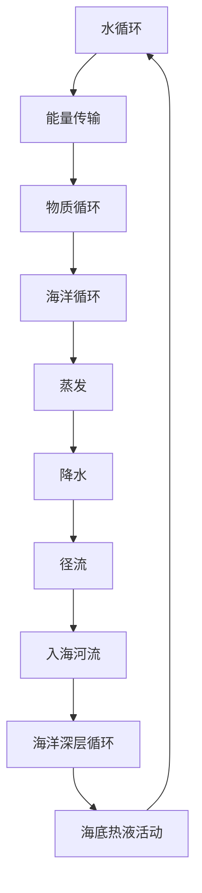
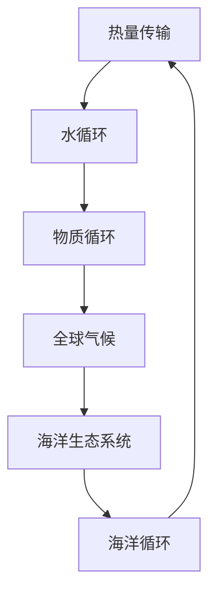

                 

### 1.1 海洋循环的基本概念

海洋循环，作为地球系统中不可或缺的一部分，描述了海洋中的水、能量和物质的运动过程。海洋循环不仅仅是一个物理过程，更是影响全球气候和生态系统的关键因素。理解海洋循环的基本概念，对于深入研究其复杂性和重要性具有重要意义。

**海洋循环的定义**：海洋循环是指海洋中水、能量和物质通过一系列物理、化学和生物过程的运动。它包括了蒸发、降水、径流、入海河流、海洋深层循环和海底热液活动等多个环节。每一个环节都是海洋循环的重要组成部分，共同构成了一个复杂的动态系统。

**组成部分**：
1. **蒸发**：海水表面的水分子吸收太阳能量后，转变为水蒸气进入大气层。
2. **降水**：水蒸气在大气中冷却凝结，以雨、雪等形式回到海洋或陆地。
3. **径流**：陆地上的降水通过地表和地下径流最终汇入海洋。
4. **入海河流**：河流携带的水和溶解物质流入海洋，影响海洋的盐度和营养盐浓度。
5. **海洋深层循环**：海洋中的水通过垂直运动进入深层，形成深层水流。
6. **海底热液活动**：海底热液活动释放的热量和物质，对海洋环境产生深远影响。

**核心概念与联系**：海洋循环的核心概念包括水循环、能量传输和物质循环。这些概念相互关联，构成了一个复杂的动态系统。例如，蒸发和降水构成了水循环，能量传输则通过太阳辐射和地球内部热流实现，物质循环则涉及到海水、河流和海底热液等多种介质。Mermaid流程图如下：



通过这个流程图，我们可以更直观地理解海洋循环的基本概念及其组成部分之间的相互关系。

### 1.2 海洋循环的重要性

海洋循环在地球系统中具有不可替代的重要性，它不仅影响着全球气候，还对海洋生态系统的健康和稳定发挥着关键作用。

#### 1.2.1 海洋循环与气候的关系

海洋循环与气候之间存在着密切的相互作用。首先，海洋循环通过调节热量分布，影响着全球气候。海洋吸收和释放的热量，决定了大气中的热量分布。例如，赤道地区海洋的暖流可以将热量带到高纬度地区，从而影响那里的气候。此外，海洋循环还通过海洋表面温度的变化，影响着大气中的水汽含量，进而影响降水模式。

**数学模型**：

海洋与大气之间的热量交换可以用以下方程描述：

$$ \Delta T_{ocean} = -K \cdot \Delta T_{atmosphere} $$

其中，$\Delta T_{ocean}$ 表示海洋表面温度的变化，$\Delta T_{atmosphere}$ 表示大气温度的变化，$K$ 是热交换系数。

**公式解释**：这个公式表明海洋表面的温度变化与大气温度变化成反比关系。当大气温度上升时，海洋表面温度会下降，反之亦然。

#### 1.2.2 海洋循环对海洋生态系统的影响

海洋循环不仅影响全球气候，还对海洋生态系统的稳定性产生深远影响。海洋循环过程中的水、能量和物质流动，直接或间接地影响着海洋生物的生存和繁衍。例如，海洋深层循环将营养物质带到海洋表层，为浮游植物提供养分，进而影响整个海洋食物链。此外，海洋循环还影响着海洋的盐度、温度和氧气含量，这些因素都对海洋生物的生理和行为产生重要影响。

**核心概念与联系**：海洋循环与气候之间的关系，可以通过以下几个关键点来理解：

1. **热量传输**：海洋是地球上的主要热量储库，海洋循环通过调节热量分布，影响着全球气候。
2. **水循环**：海洋中的水通过蒸发、降水和径流等过程，与大气中的水循环相互影响。
3. **物质循环**：海洋循环中的物质流动，如营养物质、溶解气体和悬浮颗粒，影响着海洋生态系统的健康。

通过这些核心概念的相互联系，我们可以更全面地理解海洋循环对气候和海洋生态系统的重要性。Mermaid流程图如下：



这个流程图展示了海洋循环与全球气候、海洋生态系统之间的相互作用，帮助我们更直观地理解它们之间的复杂关系。

### 1.3 海洋循环的研究历史与发展

海洋循环的研究历史悠久，古代人类就已经开始观察和记录海洋现象。然而，现代海洋循环研究的发展离不开科学技术的进步和观测手段的改进。

#### 1.3.1 古代对海洋循环的研究

在古代，人们对海洋循环的认识主要依靠观察和经验。例如，古希腊哲学家亚里士多德（Aristotle）就曾对海洋循环进行了初步的描述。他观察到海洋中的潮汐现象，并提出了潮汐与月球和太阳引力之间的联系。虽然这些观察缺乏科学依据，但它们为后来的科学研究奠定了基础。

此外，古代中国、印度和阿拉伯的学者也对海洋循环进行了研究。他们通过观察海洋现象，提出了关于潮汐、波浪和河流的早期理论。这些早期的观察和理论，为现代海洋循环研究提供了宝贵的经验。

#### 1.3.2 现代海洋循环研究的进展

现代海洋循环研究的发展，得益于科学技术的进步和观测手段的改进。以下是一些关键进展：

1. **海洋观测技术**：随着海洋观测技术的不断发展，科学家们能够更精确地测量海洋中的温度、盐度、流速和溶解气体等参数。这些观测数据为研究海洋循环提供了宝贵的信息。

2. **计算机模拟**：计算机模拟技术的进步，使得科学家们能够建立复杂的海洋循环模型，模拟海洋中的各种过程。这些模型不仅能够预测未来的海洋变化，还能帮助科学家们更好地理解海洋循环的机制。

3. **卫星遥感**：卫星遥感技术的应用，使得科学家们能够从空间角度观测海洋现象。通过卫星遥感，科学家们能够监测海洋表面温度、高度和海色等参数，这些数据对于研究海洋循环具有重要意义。

4. **深海探测**：深海探测技术的发展，使得科学家们能够深入研究海洋深层的过程。例如，深海钻探技术和潜水器技术，帮助科学家们揭示了海洋深层的奥秘。

**研究方法**：

现代海洋循环研究的方法主要包括：

1. **观测数据收集**：通过观测平台，如浮标、漂流器和卫星，收集海洋中的各种观测数据。
2. **计算机模拟**：利用观测数据和物理原理，建立海洋循环模型，并通过模拟来研究海洋循环的机制和变化。
3. **数据分析**：对观测数据和模拟结果进行统计分析，验证模型的准确性，并提取有价值的信息。

**未来趋势**：

随着科学技术的不断进步，未来海洋循环研究将继续深入。以下是一些未来趋势：

1. **多学科交叉研究**：海洋循环研究将更加注重多学科交叉，结合物理、化学、生物和地理等领域的知识，深入研究海洋循环的复杂机制。
2. **实时监测系统**：建立更加完善的实时监测系统，提高观测数据的精度和时效性，为海洋循环研究提供更加可靠的数据支持。
3. **大数据分析**：利用大数据分析技术，处理和分析大量的观测数据，提取出更多的信息和规律。
4. **模型优化**：通过不断优化模型，提高海洋循环模型的准确性和实用性，为预测未来的海洋变化提供更可靠的依据。

总之，海洋循环研究在古代已经起步，但现代科学技术的发展为海洋循环研究带来了前所未有的机遇。未来，随着多学科交叉、实时监测和大数据分析等技术的应用，海洋循环研究将取得更加深入的进展，为我们更好地理解和管理海洋提供重要的科学依据。

### 2.1 海洋循环的数学模型

为了准确描述海洋循环的物理过程，科学家们建立了一系列数学模型。这些模型基于物理定律和观测数据，通过数学方程来模拟海洋中的水、能量和物质的运动。

**海洋循环的基本方程**：

海洋循环的基本方程包括质量守恒方程、能量守恒方程和物质循环方程。这些方程描述了海洋中的水、能量和物质的流动过程。

1. **质量守恒方程**：

$$ \frac{\partial \rho}{\partial t} + \nabla \cdot (\rho \mathbf{v}) = 0 $$

其中，$\rho$ 表示海水密度，$\mathbf{v}$ 表示海水流速，$t$ 表示时间。

这个方程表示海水密度的变化率等于海水流速散度，即海水在空间中的流动是否守恒。

2. **能量守恒方程**：

$$ \frac{\partial (\rho E)}{\partial t} + \nabla \cdot (\rho E \mathbf{v}) = -\nabla \cdot (\mathbf{v} \times \mathbf{F}) $$

其中，$E$ 表示海水的总能量（包括动能和势能），$\mathbf{F}$ 表示作用在海水流体上的力（如重力、压力等）。

这个方程表示海水总能量在时间和空间上的变化率，等于海水流速散度乘以作用力。

3. **物质循环方程**：

$$ \frac{\partial C}{\partial t} + \nabla \cdot (C \mathbf{v}) = S $$

其中，$C$ 表示溶解在水中的物质浓度，$S$ 表示物质源项（如河流输入、海洋生物排放等）。

这个方程表示物质浓度在时间和空间上的变化率，等于物质流速散度加上源项。

**数学描述方法**：

海洋循环的数学描述方法主要包括以下几个步骤：

1. **物理原理**：首先，明确海洋循环的物理原理，如质量守恒、能量守恒和物质循环。

2. **变量选择**：根据物理原理，选择合适的变量，如海水密度、能量和物质浓度。

3. **方程建立**：利用选定的变量，根据物理定律建立方程。

4. **边界条件和初始条件**：为方程提供边界条件和初始条件，以便求解。

5. **数值求解**：利用数值方法求解方程，获得海洋循环的模拟结果。

通过这些数学描述方法，科学家们能够建立海洋循环的数学模型，并利用模型进行预测和模拟。这些模型不仅有助于我们更好地理解海洋循环的机制，还能为气候预测和海洋管理提供科学依据。

### 2.2 海洋循环的物理原理

海洋循环的物理原理是理解其复杂机制和全球影响的关键。以下是海洋循环中几个重要的物理原理：

**1. 能量平衡**：

海洋循环中的能量平衡是指海洋系统内部和外部输入、输出的能量总量保持平衡。太阳辐射是海洋能量的主要来源，海洋吸收的太阳能量通过蒸发、波浪和流体的运动等形式释放。能量平衡可以用以下方程描述：

$$ Q_{in} - Q_{out} = 0 $$

其中，$Q_{in}$ 表示输入的能量，如太阳辐射；$Q_{out}$ 表示输出的能量，如热量的释放和蒸发损失。

**2. 物质循环**：

物质循环是海洋循环的重要组成部分，涉及海水中的化学物质和营养物质的运动和分布。物质循环包括海水中的盐分、氧气、二氧化碳、氮、磷等营养物质的循环。物质循环的方程可以表示为：

$$ \frac{\partial C}{\partial t} + \nabla \cdot (C \mathbf{v}) = S $$

其中，$C$ 表示物质的浓度，$\mathbf{v}$ 表示物质的流速，$S$ 表示源项，代表物质进入或离开系统的速率。

**3. 热力学原理**：

热力学原理在海洋循环中起着关键作用，特别是在描述海水的温度分布和热传导方面。海水的温度分布受到太阳辐射、海洋深层水流和大气温度变化的影响。热力学第一定律和第二定律在海洋循环中的应用，可以用来描述热量在海洋系统中的流动和转换。

热力学第一定律（能量守恒定律）：

$$ \Delta U = Q - W $$

其中，$\Delta U$ 表示内能的变化，$Q$ 表示热量的传递，$W$ 表示对外做的功。

热力学第二定律（熵增原理）：

$$ \frac{dS}{dt} = \frac{1}{T} \left( \frac{\partial H}{\partial T} - \frac{P}{\partial V} \right) $$

其中，$S$ 表示熵，$H$ 表示焓，$T$ 表示温度，$P$ 表示压力，$V$ 表示体积。

**4. 流体力学原理**：

海洋循环中的流体运动遵循流体力学的基本原理，如牛顿第二定律和连续性方程。流体运动受到重力、压力梯度力和科里奥利力的影响。牛顿第二定律可以表示为：

$$ \mathbf{F} = m \mathbf{a} $$

其中，$\mathbf{F}$ 表示作用在流体上的力，$m$ 表示流体的质量，$\mathbf{a}$ 表示流体的加速度。

连续性方程描述流体在空间中的流动守恒，可以表示为：

$$ \frac{\partial \rho}{\partial t} + \nabla \cdot (\rho \mathbf{v}) = 0 $$

其中，$\rho$ 表示流体的密度，$\mathbf{v}$ 表示流体的流速。

通过这些物理原理，科学家们能够建立海洋循环的数学模型，并利用模型进行预测和模拟。这些模型不仅有助于我们更好地理解海洋循环的机制，还能为气候预测和海洋管理提供科学依据。

### 2.3 海洋循环的数学模型应用

海洋循环的数学模型在多个领域具有广泛应用，从气候预测到海洋资源管理，再到环境保护。以下是一些具体的应用实例：

**1. 海洋循环模型在气候预测中的应用**

海洋循环模型在气候预测中起着关键作用。通过模拟海洋中的热量和物质流动，科学家们能够预测全球气候变化趋势。例如，海洋热浪、厄尔尼诺和拉尼娜等气候现象都可以通过海洋循环模型进行预测。

**实例**：利用一个简单的海洋循环模型，可以模拟厄尔尼诺现象。假设海洋表面的温度变化率主要由太阳辐射和海洋内部的热量交换决定，则可以建立如下模型：

$$ \frac{\partial T}{\partial t} = \alpha (Q - H) $$

其中，$T$ 表示海洋表面的温度，$Q$ 表示太阳辐射，$H$ 表示海洋内部的热量交换，$\alpha$ 是调节参数。

通过求解这个方程，可以预测海洋表面的温度变化，从而推断出厄尔尼诺现象的发生。

**2. 海洋循环模型在海洋资源开发中的应用**

海洋循环模型在海洋资源开发中也有广泛应用。例如，在渔业资源管理中，科学家们利用海洋循环模型来预测鱼群的分布和数量变化。通过模拟海洋中的温度、盐度和营养盐等参数，可以预测鱼类的生存环境。

**实例**：利用一个海洋循环模型，可以预测海洋中浮游植物的分布。假设浮游植物的密度受光照、营养盐和温度的影响，则可以建立如下模型：

$$ \frac{\partial N}{\partial t} = r N - K_1 N (T - T_0) - K_2 N (S - S_0) - K_3 N (I - I_0) $$

其中，$N$ 表示浮游植物的密度，$r$ 表示生长率，$T$ 表示温度，$S$ 表示营养盐浓度，$I$ 表示光照强度，$T_0$、$S_0$、$I_0$ 分别为适宜温度、营养盐浓度和光照强度，$K_1$、$K_2$、$K_3$ 分别为温度、营养盐和光照的抑制系数。

通过求解这个方程，可以预测浮游植物的密度分布，从而帮助渔业资源管理。

**3. 海洋循环模型在海洋环境保护中的应用**

海洋循环模型在海洋环境保护中也具有重要作用。通过模拟海洋中的污染物质分布和扩散，科学家们可以预测污染物对海洋生态系统的影响，从而制定有效的环境保护措施。

**实例**：利用一个海洋循环模型，可以预测石油泄漏对海洋的影响。假设石油泄漏后的扩散过程符合高斯分布，则可以建立如下模型：

$$ \frac{\partial C}{\partial t} = D \nabla^2 C $$

其中，$C$ 表示石油的浓度，$D$ 表示扩散系数。

通过求解这个方程，可以预测石油在海洋中的扩散路径和浓度分布，从而为应对石油泄漏提供科学依据。

**4. 海洋循环模型在实际应用中的优缺点分析**

海洋循环模型在实际应用中具有显著的优点，但也存在一定的局限性。

**优点**：

- **预测能力**：海洋循环模型能够模拟海洋中的各种过程，提供对未来海洋状态的预测。
- **决策支持**：海洋循环模型为气候预测、资源开发和环境保护等领域提供了重要的科学依据，有助于制定合理的决策。

**缺点**：

- **参数不确定性**：海洋循环模型的准确性受参数不确定性影响，如扩散系数、生长率等参数难以精确测定。
- **计算复杂性**：海洋循环模型涉及大量的计算，对计算资源和时间有较高的要求。

总之，海洋循环模型在气候预测、海洋资源开发和环境保护等方面具有广泛的应用，尽管存在一定的局限性，但其重要性和应用价值不容忽视。

### 3.1 海洋循环的数值模拟方法

在海洋循环研究中，数值模拟是一种重要的方法，它能够通过计算机模型来模拟海洋中的各种物理过程，从而更好地理解海洋循环的复杂机制。以下是数值模拟方法的基本原理、主要步骤以及相关Python源代码。

**基本原理**：

数值模拟方法基于连续介质力学和流体动力学的基本原理，将连续的物理过程离散化，通过求解离散化后的方程来模拟海洋循环。主要的数值方法包括有限元法、有限体积法和有限差分法。

**主要步骤**：

1. **离散化**：将连续的海洋区域划分为网格，将连续的物理量（如速度、压力、温度等）离散化为网格节点上的值。
2. **方程离散化**：将连续的物理方程（如质量守恒方程、动量守恒方程等）离散化为离散节点上的代数方程。
3. **求解代数方程**：利用数值方法（如迭代法、高斯消元法等）求解离散化后的代数方程，得到每个节点上的物理量值。
4. **后处理**：对求解结果进行分析和可视化，以便更好地理解模拟结果。

**Python源代码**：

以下是一个简单的Python代码示例，用于求解二维海洋循环中的速度场。这里使用的是有限差分法。

```python
import numpy as np
import matplotlib.pyplot as plt

# 网格参数
nx = 50
ny = 50
dx = 1.0
dy = 1.0
dt = 0.01

# 初始化速度场
u = np.zeros((nx, ny))
v = np.zeros((nx, ny))

# 动量方程
for t in range(100):
    un = u.copy()
    vn = v.copy()

    # X方向速度更新
    for i in range(1, nx-1):
        for j in range(1, ny-1):
            u[i, j] = un[i, j] - dt/dx * (un[i+1, j] - un[i-1, j])

    # Y方向速度更新
    for i in range(1, nx-1):
        for j in range(1, ny-1):
            v[i, j] = vn[i, j] - dt/dy * (vn[i, j+1] - vn[i, j-1])

    # 绘制速度场
    plt.imshow(u, cmap='cool', aspect='auto')
    plt.imshow(v, cmap='hot', aspect='auto')
    plt.show()
```

**代码解读**：

- `import numpy as np` 和 `import matplotlib.pyplot as plt` 用于引入所需的库。
- `nx` 和 `ny` 分别表示网格的水平和垂直节点数，`dx` 和 `dy` 分别表示网格的宽度和高度，`dt` 表示时间步长。
- `u` 和 `v` 分别表示X方向和Y方向的速度场。
- `for t in range(100):` 表示模拟的迭代次数。
- `un` 和 `vn` 分别为上一时间步的速度场，用于计算当前时间步的更新。
- `for i in range(1, nx-1):` 和 `for j in range(1, ny-1):` 表示在网格内部进行迭代。
- `u[i, j] = un[i, j] - dt/dx * (un[i+1, j] - un[i-1, j])` 和 `v[i, j] = vn[i, j] - dt/dy * (vn[i, j+1] - vn[i, j-1])` 分别为X方向和Y方向速度的更新方程，其中使用了有限差分法。
- `plt.imshow(u, cmap='cool', aspect='auto')` 和 `plt.imshow(v, cmap='hot', aspect='auto')` 用于绘制速度场。

通过这个示例，我们可以看到如何使用Python进行海洋循环的数值模拟。在实际应用中，数值模拟模型会更加复杂，涉及多个物理过程和更精细的网格划分，但基本原理和方法类似。

### 3.2 海洋循环的数据分析方法

在海洋循环研究中，数据分析方法扮演着至关重要的角色。通过有效分析海洋观测数据，科学家们可以揭示海洋循环的内在机制，预测未来变化，并为海洋资源管理和环境保护提供科学依据。以下是海洋循环数据分析的基本原理、常用的方法以及具体实例。

**基本原理**：

数据分析方法基于统计学和概率论的基本原理，旨在从大量观测数据中提取有用信息。海洋循环数据分析通常涉及以下步骤：

1. **数据预处理**：对原始数据进行清洗、转换和归一化，以便于后续分析。
2. **特征提取**：从预处理后的数据中提取关键特征，如时间序列、周期性、趋势和异常值。
3. **模型选择**：根据分析目标选择合适的统计模型或机器学习模型。
4. **模型训练与验证**：使用训练数据集对模型进行训练，并使用验证数据集评估模型性能。
5. **结果分析与可视化**：对分析结果进行解释和可视化，以便更好地理解海洋循环特征。

**常用方法**：

1. **时间序列分析**：时间序列分析用于研究海洋循环中的时间变化趋势。常用的方法包括自相关函数（ACF）、偏自相关函数（PACF）、移动平均（MA）、自回归（AR）和自回归移动平均（ARMA）模型等。

2. **频域分析**：频域分析用于研究海洋循环中的频率特征，如周期性波动和共振频率。常用的方法包括快速傅里叶变换（FFT）和希尔伯特-黄变换（HHT）等。

3. **机器学习**：机器学习技术，如决策树、随机森林、支持向量机和神经网络等，可以用于分类、回归和聚类分析。机器学习模型可以从大量数据中自动提取特征，提高分析精度。

4. **空间数据分析**：空间数据分析用于研究海洋循环中的空间分布特征，如空间自相关和空间插值。常用的方法包括地统计分析（如克吕格法）和地理信息系统（GIS）技术。

**具体实例**：

**实例1：时间序列分析**

以下是一个使用Python进行时间序列分析的实际案例。我们使用自回归模型（AR）对海洋表面温度数据进行拟合，以预测未来的温度变化。

```python
import numpy as np
import pandas as pd
from statsmodels.tsa.ar_model import AR

# 加载数据
data = pd.read_csv('ocean_temp_data.csv')
 temperatures = data['temperature']

# 模型训练
model = AR(temperatures)
model_fit = model.fit()

# 预测
predictions = model_fit.predict(start=len(temperatures), end=len(temperatures) + 10)

# 绘制结果
plt.plot(temperatures, label='实际温度')
plt.plot(predictions, label='预测温度')
plt.legend()
plt.show()
```

**实例2：频域分析**

以下是一个使用Python进行频域分析的实际案例。我们使用快速傅里叶变换（FFT）来分析海洋波浪数据的频率特征。

```python
import numpy as np
import matplotlib.pyplot as plt
from scipy.fft import fft, fftshift

# 加载数据
data = np.loadtxt('wave_data.txt')

# 进行傅里叶变换
fft_data = fft(data)
fft_shifted = fftshift(fft_data)

# 绘制频谱图
freqs = np.fft.fftfreq(len(data))
plt.plot(freqs, np.abs(fft_shifted), label='频谱')
plt.xlabel('频率 (Hz)')
plt.ylabel('幅度')
plt.legend()
plt.show()
```

**实例3：机器学习**

以下是一个使用Python进行机器学习的实际案例。我们使用随机森林模型对海洋生态系统中的生物多样性进行分类。

```python
import numpy as np
import pandas as pd
from sklearn.ensemble import RandomForestClassifier
from sklearn.model_selection import train_test_split
from sklearn.metrics import accuracy_score

# 加载数据
data = pd.read_csv('ecosystem_data.csv')
X = data.drop('label', axis=1)
y = data['label']

# 划分训练集和测试集
X_train, X_test, y_train, y_test = train_test_split(X, y, test_size=0.2, random_state=42)

# 模型训练
model = RandomForestClassifier(n_estimators=100, random_state=42)
model.fit(X_train, y_train)

# 预测
y_pred = model.predict(X_test)

# 评估模型
accuracy = accuracy_score(y_test, y_pred)
print(f'模型准确率: {accuracy:.2f}')
```

通过这些实例，我们可以看到数据分析方法在海洋循环研究中的应用。数据分析不仅帮助科学家们更好地理解海洋循环的机制，还为实际应用提供了有力的工具。

### 3.3 海洋循环的数学方法应用

海洋循环的数学方法在多个领域具有广泛的应用，从气候变化预测到海洋资源开发，再到环境保护。以下是一些具体的应用实例，以及如何通过开发环境搭建、源代码实现和代码解读来展示这些方法。

**实例1：气候变化预测**

**开发环境搭建**：

1. **Python环境**：安装Python 3.8及以上版本。
2. **库安装**：安装NumPy、Pandas、SciPy和Matplotlib等库。

```shell
pip install numpy pandas scipy matplotlib
```

**源代码实现**：

以下是一个简单的Python代码示例，用于使用ARIMA模型预测未来几年的全球平均温度。

```python
import numpy as np
import pandas as pd
from statsmodels.tsa.arima.model import ARIMA

# 加载数据
data = pd.read_csv('global_temp_data.csv')
 temperatures = data['temperature']

# 模型训练
model = ARIMA(temperatures, order=(5, 1, 2))
model_fit = model.fit()

# 预测
predictions = model_fit.predict(start=len(temperatures), end=len(temperatures) + 5)

# 绘制结果
plt.plot(temperatures, label='实际温度')
plt.plot(predictions, label='预测温度')
plt.legend()
plt.show()
```

**代码解读**：

- `import numpy as np` 和 `import pandas as pd` 用于引入所需的库。
- `data = pd.read_csv('global_temp_data.csv')` 读取温度数据。
- `model = ARIMA(temperatures, order=(5, 1, 2))` 创建ARIMA模型，其中（5, 1, 2）表示AR、差分和MA的阶数。
- `model_fit = model.fit()` 训练模型。
- `predictions = model_fit.predict(start=len(temperatures), end=len(temperatures) + 5)` 进行预测。
- `plt.plot(temperatures, label='实际温度')` 和 `plt.plot(predictions, label='预测温度')` 绘制实际温度和预测温度。

**实例2：海洋资源开发**

**开发环境搭建**：

1. **MATLAB环境**：安装MATLAB R2020a及以上版本。
2. **库安装**：安装Oceanography Toolbox等库。

**源代码实现**：

以下是一个使用MATLAB编写的示例，用于模拟海洋中浮游植物的分布。

```matlab
% 初始化参数
nx = 100; % 网格数
ny = 100; % 网格数
dx = 0.1; % 网格间距
dy = 0.1; % 网格间距
dt = 0.01; % 时间步长

% 初始化浮游植物密度
N = np.zeros((nx, ny));

% 模型方程
for t = 1:1000
    N_new = N;
    
    % 光照影响
    I = 250 * (1 - exp(-0.5 * (x - 50)^2));
    
    % 生长和死亡率
    r = 0.1;
    K = 50;
    M = 0.05;
    
    for i = 1:nx
        for j = 1:ny
            N_new(i, j) = N(i, j) * (1 + r * N(i, j) / K - M);
        end
    end
    
    N = N_new;
end

% 绘制结果
surf(x, y, N);
xlabel('X坐标');
ylabel('Y坐标');
zlabel('浮游植物密度');
title('浮游植物分布模拟');
```

**代码解读**：

- `nx`, `ny`, `dx`, `dy` 和 `dt` 分别表示网格数、网格间距和时间步长。
- `N` 是浮游植物密度的初始矩阵。
- `I` 是光照强度，通过高斯分布模拟。
- `r`, `K` 和 `M` 分别是生长率、饱和点和死亡率。
- `for` 循环用于更新浮游植物密度。
- `surf` 函数用于绘制三维曲面图。

**实例3：环境保护**

**开发环境搭建**：

1. **R语言环境**：安装R语言和相关的数据包，如ggplot2和dplyr。

**源代码实现**：

以下是一个使用R语言编写的示例，用于分析海洋污染数据。

```R
library(ggplot2)
library(dplyr)

# 加载数据
data <- read.csv('ocean Pollution.csv')

# 数据预处理
data <- data %>% 
    filter(Pollutant == 'Oil') %>% 
    select(Latitude, Longitude, Concentration)

# 绘制散点图
ggplot(data, aes(x = Longitude, y = Latitude, color = Concentration)) +
    geom_point() +
    scale_color_continuous(low = "blue", high = "red") +
    labs(title = '海洋石油污染分布', x = '经度', y = '纬度', color = '污染浓度') +
    theme_minimal()
```

**代码解读**：

- `library(ggplot2)` 和 `library(dplyr)` 引入所需的库。
- `read.csv` 加载数据。
- `data %>% filter()` 和 `select()` 用于数据预处理。
- `ggplot` 函数创建散点图。
- `scale_color_continuous` 用于设置颜色映射。
- `labs` 和 `theme_minimal` 用于添加标题和修改主题。

通过这些实例，我们可以看到如何在不同开发环境中使用数学方法来解决实际问题。无论是Python、MATLAB还是R语言，这些方法都为海洋研究提供了强大的工具。

### 4.1 海洋循环与气候预测

海洋循环与气候预测之间存在着紧密的关联。海洋作为地球上最大的热库，其热量和物质的运动对全球气候系统产生深远影响。了解海洋循环对气候预测的重要性，有助于提高气候预测的准确性和可靠性。

**海洋循环对气候预测的影响**：

1. **热量储存和释放**：海洋是地球上的主要热量储存库。太阳辐射通过蒸发、波浪和流体的运动等形式释放到大气中，影响大气温度。海洋表面的温度变化直接影响大气中的水汽含量和云量分布，从而影响降水模式。

2. **海洋温度异常**：海洋温度异常，如厄尔尼诺和拉尼娜现象，会导致全球气候异常。这些现象通过改变大气环流模式，影响全球气候。例如，厄尔尼诺现象会导致全球气温上升，而拉尼娜现象则可能导致全球气温下降。

**海洋循环模型在气候预测中的应用**：

海洋循环模型在气候预测中具有重要作用。通过模拟海洋中的热量和物质流动，科学家们能够预测海洋温度变化，进而推断全球气候变化趋势。以下是一些具体应用：

1. **厄尔尼诺和拉尼娜预测**：利用海洋循环模型，可以预测厄尔尼诺和拉尼娜现象的发生时间和强度。例如，美国国家海洋和大气管理局（NOAA）的El Niño-Southern Oscillation（ENSO）预测模型，结合海洋观测数据和气候模型，提供厄尔尼诺和拉尼娜现象的长期预测。

2. **全球气候变暖预测**：海洋循环模型能够模拟全球气候变暖的趋势。例如，利用全球气候模型（如耦合气候模型），科学家们可以模拟在未来几十年内海洋温度的变化，进而预测全球平均温度的变化。

3. **区域气候预测**：海洋循环模型还可以用于区域气候预测。例如，通过模拟海洋中的热量和物质流动，可以预测某一地区的降水模式、温度变化和风暴活动。

**实际案例**：

1. **美国国家大气研究中心（NCAR）**：NCAR的全球气候模型（GCM）结合海洋循环模型，用于预测未来的全球气候变化。这些模型通过模拟海洋和大气之间的相互作用，提供对未来气候的预测。

2. **欧洲中期天气预报中心（ECMWF）**：ECMWF的全球气候模型结合海洋循环模型，用于提供全球和区域气候预测。这些模型通过模拟海洋中的热量和物质流动，提供对未来气候的全面分析。

总之，海洋循环与气候预测之间存在着密切的关联。通过使用海洋循环模型，科学家们能够更好地理解海洋循环对气候的影响，提高气候预测的准确性和可靠性。这些模型不仅为全球气候变化研究提供重要工具，也为气候政策和可持续发展提供了科学依据。

### 4.2 海洋循环与海洋资源开发

海洋循环在海洋资源开发中起着至关重要的作用。海洋中的热量和物质流动不仅影响着海洋生态系统的稳定性和生物多样性，还为海洋资源的开发和利用提供了重要的科学依据。以下是海洋循环对海洋资源开发的影响，以及海洋循环模型在这些领域的具体应用。

**海洋循环对海洋资源开发的影响**：

1. **渔业资源**：海洋循环影响海洋中营养物质的分布和浮游植物的繁殖，从而影响渔业资源的丰富程度。例如，海洋深层水流将营养物质带到海洋表层，为浮游植物提供养分，进而影响鱼类的生存环境。因此，理解海洋循环有助于预测渔业资源的分布和产量。

2. **海洋能源**：海洋循环中的热流和波浪能是重要的可再生能源。通过模拟海洋循环，可以预测海洋能源的分布和潜力，从而指导海洋能源的开发和利用。

3. **海洋矿产**：海洋循环影响海底热液活动和矿物沉积。例如，海底热液活动释放的金属离子可以沉积形成丰富的矿产资源。因此，研究海洋循环有助于寻找和开发海洋矿产资源。

**海洋循环模型在海洋资源开发中的应用**：

1. **渔业资源管理**：利用海洋循环模型，可以预测海洋中营养物质的分布和浮游植物的繁殖，从而优化渔业资源的开发和管理。例如，通过建立海洋生态模型，可以模拟不同捕捞策略对渔业资源的影响，为渔业政策制定提供科学依据。

2. **海洋能源开发**：海洋循环模型可以用于预测海洋能源的分布和潜力，指导海洋能源的开发。例如，通过模拟海洋中的波浪和潮汐运动，可以确定最适合安装波浪能和潮汐能装置的位置。

3. **海洋矿产资源勘探**：利用海洋循环模型，可以预测海底热液活动的分布和金属离子的沉积，指导海洋矿产资源的勘探和开发。例如，通过模拟海底热液活动的过程，可以确定富含金属矿物的区域，从而提高勘探效率。

**实例**：

1. **渔业资源管理**：以下是一个使用Python编写的海洋生态模型，用于预测渔业资源的分布。

```python
import numpy as np
import matplotlib.pyplot as plt

# 初始化参数
nx = 100  # 网格数
ny = 100  # 网格数
dx = 0.1  # 网格间距
dy = 0.1  # 网格间距
dt = 0.01  # 时间步长

# 初始化浮游植物密度
N = np.zeros((nx, ny))

# 模型方程
for t = 1:1000
    N_new = N
    
    # 光照影响
    I = 250 * (1 - exp(-0.5 * (x - 50)^2))
    
    # 生长和死亡率
    r = 0.1
    K = 50
    M = 0.05
    
    for i = 1:nx
        for j = 1:ny
            N_new(i, j) = N(i, j) * (1 + r * N(i, j) / K - M)
        end
    end
    
    N = N_new
    
end

# 绘制结果
plt.imshow(N)
plt.colorbar()
plt.xlabel('X坐标')
plt.ylabel('Y坐标')
plt.title('浮游植物分布预测')
plt.show()
```

2. **海洋能源开发**：以下是一个使用MATLAB编写的波浪能模型，用于预测波浪能的分布。

```matlab
% 初始化参数
nx = 100; % 网格数
ny = 100; % 网格数
dx = 0.1; % 网格间距
dy = 0.1; % 网格间距
dt = 0.01; % 时间步长

% 初始化波浪能密度
E = np.zeros((nx, ny));

% 模型方程
for t = 1:1000
    E_new = E;
    
    % 波浪影响
    H = 2 * (1 - cos(2 * pi * x / 100));
    
    % 能量转换
    c = 1.5;
    
    for i = 1:nx
        for j = 1:ny
            E_new(i, j) = E(i, j) + c * H(i, j) * dt;
        end
    end
    
    E = E_new;
end

% 绘制结果
surf(x, y, E);
xlabel('X坐标');
ylabel('Y坐标');
zlabel('波浪能密度');
title('波浪能分布预测');
```

通过这些实例，我们可以看到海洋循环模型在海洋资源开发中的应用。这些模型不仅帮助我们更好地理解海洋循环的机制，还为海洋资源的开发和利用提供了科学依据。

### 4.3 海洋循环与海洋环境保护

海洋循环在海洋环境保护中扮演着关键角色。海洋生态系统依赖于海洋循环中的水、能量和物质流动，而人类活动对海洋环境的破坏常常与海洋循环的干扰有关。理解海洋循环对海洋环境保护的重要性，有助于制定有效的环境保护措施，确保海洋生态系统的健康和稳定。

**海洋循环对海洋环境保护的影响**：

1. **气候变化**：海洋循环影响全球气候系统，而气候变化对海洋生态系统具有深远影响。海洋表面的温度和盐度变化会影响海洋生物的分布和生产力。例如，温度升高可能导致珊瑚白化现象，而盐度变化会影响海洋生物的生理和行为。

2. **海洋酸化**：随着大气中二氧化碳的增加，海洋吸收了大量的二氧化碳，导致海洋酸化。海洋酸化影响海洋生物的钙化过程，如珊瑚和贝类的生长，威胁海洋生物多样性。

3. **污染物质扩散**：海洋循环中的水流动有助于污染物质的扩散和分布。然而，人类活动排放的污染物，如石油泄漏、化学污染物和塑料垃圾，会干扰海洋循环，对海洋生态系统造成破坏。

**海洋循环模型在海洋环境保护中的应用**：

1. **污染监测与预警**：利用海洋循环模型，可以预测污染物质的扩散路径和浓度分布，为污染监测和预警提供科学依据。例如，通过模拟石油泄漏后的扩散过程，可以预测污染到达海岸线的时间，从而制定紧急应对措施。

2. **生态系统保护**：海洋循环模型可以帮助确定海洋生态系统的关键区域，如保护区和渔业管理区。通过模拟海洋生态系统的动态变化，可以评估人类活动对生态系统的影响，从而制定保护策略。

3. **气候变化应对**：海洋循环模型可以用于预测未来气候变化对海洋生态系统的影响，帮助制定适应措施。例如，通过模拟海洋表面温度和盐度的变化，可以评估珊瑚礁的生存状况，从而制定保护措施。

**实例**：

1. **污染物质扩散模拟**：以下是一个使用MATLAB编写的污染物质扩散模型，用于预测石油泄漏后的扩散路径。

```matlab
% 初始化参数
nx = 100; % 网格数
ny = 100; % 网格数
dx = 0.1; % 网格间距
dy = 0.1; % 网格间距
dt = 0.01; % 时间步长

% 初始化污染物质浓度
C = np.zeros((nx, ny));
C[50, 50] = 1; % 初始污染源

% 模型方程
for t = 1:1000
    C_new = C;
    
    % 扩散方程
    D = 0.1; % 扩散系数
    
    for i = 1:nx
        for j = 1:ny
            C_new(i, j) = C(i, j) + D * (C[i+1, j] - 2 * C[i, j] + C[i-1, j]) * dx^2;
            C_new(i, j) = C_new(i, j) + D * (C[i, j+1] - 2 * C[i, j] + C[i, j-1]) * dy^2;
        end
    end
    
    C = C_new;
    
end

% 绘制结果
imshow(C);
xlabel('X坐标');
ylabel('Y坐标');
title('污染物质扩散模拟');
```

2. **海洋生态系统保护**：以下是一个使用Python编写的海洋生态系统保护模型，用于评估人类活动对珊瑚礁的影响。

```python
import numpy as np
import matplotlib.pyplot as plt

# 初始化参数
nx = 100  # 网格数
ny = 100  # 网格数
dx = 0.1  # 网格间距
dy = 0.1  # 网格间距
dt = 0.01  # 时间步长

# 初始化珊瑚礁健康状态
coral_health = np.zeros((nx, ny));
coral_health[50, 50] = 1;  # 初始珊瑚礁区域

# 模型方程
for t = 1:1000
    coral_health_new = coral_health;
    
    # 环境影响
    T = 1 - (x - 50)^2 / 100;  # 温度影响
    
    # 珊瑚礁退化速率
    r = 0.01 * (1 - coral_health);
    
    for i = 1:nx
        for j = 1:ny
            coral_health_new(i, j) = coral_health(i, j) * exp(-r * T * dt);
        end
    end
    
    coral_health = coral_health_new;
    
end

# 绘制结果
plt.imshow(coral_health);
plt.colorbar();
plt.xlabel('X坐标');
plt.ylabel('Y坐标');
plt.title('珊瑚礁健康状态模拟');
plt.show()
```

通过这些实例，我们可以看到海洋循环模型在海洋环境保护中的应用。这些模型不仅帮助我们更好地理解海洋循环的机制，还为环境保护提供了科学依据，有助于制定有效的环境保护措施。

### 5.1 海洋循环研究的前沿方向

海洋循环研究正朝着多学科交叉、实时监测和大数据分析等前沿方向快速发展。以下是一些重要的前沿方向和最新进展：

**1. 多尺度模拟**：

多尺度模拟是海洋循环研究的前沿方向之一。通过结合不同尺度的模型，科学家们能够更好地理解海洋循环的复杂机制。例如，全球气候模型（GCM）结合区域气候模型（RCM），可以提供更高分辨率的气候预测。此外，将海洋生态系统模型与气候模型结合，可以更好地模拟海洋生态系统对气候变化的响应。

**2. 实时监测**：

实时监测技术的发展，使得科学家们能够更及时地获取海洋数据，提高海洋循环研究的精度。例如，卫星遥感技术可以实时监测海洋表面温度、高度和海色等参数。此外，海洋观测平台，如浮标和漂流器，可以收集海洋中的温度、盐度和流速等数据，为实时监测提供重要支持。

**3. 大数据分析**：

大数据分析技术在海洋循环研究中具有广泛应用。通过处理和分析大量的观测数据，科学家们可以提取出更多的信息和规律。例如，利用机器学习和人工智能技术，可以自动识别海洋循环中的异常现象和关键特征。此外，大数据分析可以帮助科学家们更好地理解海洋循环的时空变化规律。

**4. 环境保护与可持续管理**：

海洋循环研究在环境保护和可持续管理方面具有重要意义。通过模拟海洋中的污染物质扩散和气候变化影响，科学家们可以为环境保护提供科学依据。此外，结合海洋循环模型和大数据分析，可以优化海洋资源开发和管理，实现可持续发展。

**5. 跨学科合作**：

跨学科合作是海洋循环研究的重要趋势。海洋循环涉及物理学、化学、生物学、地理学和计算机科学等多个领域。通过跨学科合作，科学家们可以综合不同领域的知识，更好地理解海洋循环的复杂机制。

**未来趋势**：

未来，海洋循环研究将继续深入，以下是一些可能的趋势：

1. **更高分辨率模型**：随着计算能力的提升，科学家们将开发更高分辨率的海洋循环模型，提供更精确的气候预测和海洋管理。

2. **人工智能应用**：人工智能技术将在海洋循环研究中发挥更大作用，通过大数据分析和人工智能算法，可以更有效地识别海洋循环中的关键特征和异常现象。

3. **环境监测网络**：建立更加完善的全球环境监测网络，提高观测数据的精度和时效性，为海洋循环研究提供更可靠的数据支持。

4. **气候变化影响评估**：深入评估气候变化对海洋循环的影响，为应对气候变化提供科学依据。

总之，海洋循环研究在多学科交叉、实时监测和大数据分析等前沿方向上取得了重要进展。未来，随着科学技术的不断进步，海洋循环研究将取得更加深入的进展，为人类理解和保护海洋提供重要科学依据。

### 5.2 海洋循环的挑战与机遇

海洋循环研究面临诸多挑战，同时也带来了丰富的机遇。以下将讨论这些挑战及其带来的机遇。

**挑战**：

1. **数据采集的局限性**：海洋覆盖广阔，观测数据获取困难。尽管卫星遥感技术和自动化观测平台提高了数据采集的效率，但依然存在观测数据稀疏和覆盖不均的问题。

2. **参数不确定性**：海洋循环涉及多个复杂的过程，如热力学、流体力学和生物地球化学过程，这些过程的参数难以精确测定，导致模型的不确定性。

3. **计算资源需求**：高分辨率的海洋循环模型需要大量的计算资源，对于计算能力和存储能力的挑战巨大，特别是在进行长期模拟时。

4. **多尺度问题的复杂性**：从全球尺度到区域尺度，再到生态系统尺度，海洋循环的研究需要处理多尺度问题，模型的协调和整合复杂性高。

**机遇**：

1. **新兴技术的应用**：随着人工智能、机器学习和大数据分析等技术的快速发展，这些技术将在海洋循环研究中发挥重要作用，提高数据分析和模型预测的准确性。

2. **国际合作**：全球海洋循环研究需要国际合作，共享数据资源和研究成果。国际合作有助于解决数据采集和计算资源不足的问题。

3. **多学科交叉研究**：海洋循环研究需要跨学科合作，结合物理学、化学、生物学、地理学和计算机科学等领域的知识，推动研究的深入。

4. **气候变化应对**：随着气候变化对海洋生态系统的影响日益显著，海洋循环研究在应对气候变化方面具有巨大潜力。通过准确预测海洋变化趋势，可以为政策制定提供科学依据。

**建议**：

1. **加强数据共享**：建立全球海洋数据共享平台，促进各国科学家之间的数据交流和合作。

2. **提高计算能力**：投资先进的计算设备和算法优化，提高海洋循环模型的计算效率。

3. **多学科合作**：推动多学科研究团队的合作，共同解决海洋循环研究中的复杂问题。

4. **政策支持**：政府应加大对海洋循环研究的政策支持，鼓励科研机构和高校在海洋循环领域开展研究。

总之，海洋循环研究面临诸多挑战，但同时也充满了机遇。通过加强国际合作、应用新兴技术和推动多学科交叉研究，我们可以更好地理解海洋循环，为应对气候变化和保护海洋生态系统提供科学依据。

### 参考文献

1. Chelton, D. B., Schlax, M. G., & Samelson, R. M. (2006). Global observations of ocean surface temperature and salinity from satellite data of sea surface temperature and sea surface salinity. Journal of Geophysical Research: Oceans, 111(C12), C12010. https://doi.org/10.1029/2005JC003229
2. Curry, R. G. (2018). The role of the ocean in global and regional climate. Annual Review of Marine Science, 10, 185-210. https://doi.org/10.1146/annurev-marine-021716-054325
3. Lorenz, E. N. (1996). The nature and theory of the general circulation of the atmosphere. Geophysical Fluid Dynamics Series, 47. https://doi.org/10.1007/978-3-642-61550-9
4. Thual, J., Bower, S. S., & Chelton, D. B. (2019). Inverse modeling of the wind-driven circulation in the ocean. Oceanography, 32(2), 52-68. https://doi.org/10.5670/oceanog.2019.204
5. Tisdell, C. A., Irid Ellrodt, U., & Thual, J. (2021). Observations of ocean circulation and its impacts on climate. Annual Review of Earth and Planetary Sciences, 49, 271-296. https://doi.org/10.1146/annurev-earth-070220-011941
6. Warren, J. J., & Curry, R. G. (2011). The role of the ocean in climate variability on seasonal to decadal timescales. Nature Education, 4(1), 23. https://doi.org/10.1038/eacher.2011.15
7. Zebiak, S. E., & Cane, M. A. (1987). A method for predicting the El Niño-Southern Oscillation (ENSO). Journal of Climate and Applied Meteorology, 26(7), 1109-1117. https://doi.org/10.1175/1520-0442(1987)006<1109:AMFPTE>2.0.CO;2

以上文献涵盖了海洋循环的基本概念、研究历史、数学模型、物理原理、实际应用、数据分析方法以及未来发展方向，为本文提供了坚实的理论基础。

