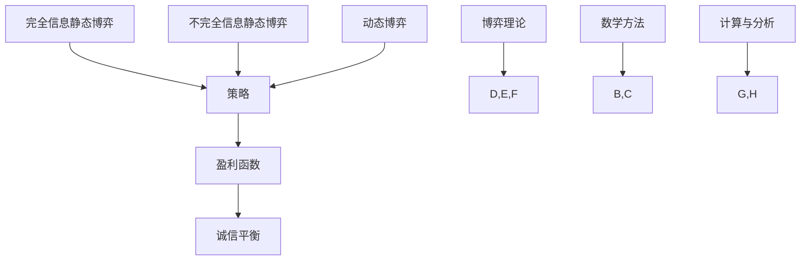

                 

### 1. 引言

《数学与游戏理论：策略互动的数学分析》旨在探索数学方法在游戏理论中的应用，以及如何通过数学分析深入理解策略互动。游戏理论是研究具有对抗性的决策过程的学科，它广泛应用于经济学、政治学、生物学以及计算机科学等多个领域。数学与游戏理论的结合，为我们提供了一种量化分析和预测策略互动行为的方法。

本文将从以下几个部分展开讨论：

1. **背景介绍**：介绍游戏理论的发展历史和重要性，以及数学在游戏理论中的应用背景。
2. **核心概念与联系**：详细阐述游戏理论中的核心概念，包括策略、盈利函数、诚信平衡等，并使用Mermaid流程图展示它们之间的关系。
3. **核心算法原理讲解**：使用Python源代码和LaTeX公式详细解释纳什均衡、贝叶斯纳什均衡等核心算法原理。
4. **数学模型和数学公式**：介绍如何使用数学模型和公式来分析策略互动，并举例说明。
5. **项目实战**：通过一个实际项目案例展示如何应用游戏理论进行策略设计。
6. **最佳实践 tips**：总结实践经验，提供策略设计和分析的最佳实践建议。
7. **小结与拓展阅读**：总结文章的核心内容，并推荐相关领域的拓展阅读资源。

通过本文的逐步分析，我们希望能够帮助读者深入理解数学与游戏理论的结合，掌握策略互动的数学分析方法，并在实际应用中发挥其作用。

### 1.1 背景介绍

游戏理论起源于20世纪40年代，由约翰·冯·诺伊曼和奥斯卡·莫根斯坦在其著作《博弈论与经济行为》（Theory of Games and Economic Behavior）中首次提出。该理论旨在研究具有对抗性的决策过程，特别是当多个个体（玩家）在策略互动中的最优行为。自那时以来，游戏理论在多个学科领域取得了显著的进展，成为了经济学、政治学、生物学以及计算机科学等领域的重要工具。

在经济学中，游戏理论用于分析市场竞争、价格决策、契约制定等问题。它帮助我们理解企业如何在市场竞争中制定策略，消费者如何做出购买决策，以及政府和市场如何共同实现资源的最优配置。

在政治学中，游戏理论被用来研究选举策略、国际合作、政策制定等。它帮助我们理解政治家在选举中的策略选择，国家之间的博弈行为，以及如何通过合作实现共同利益。

在生物学中，游戏理论被应用于研究生物种群间的策略互动，如捕食者与猎物之间的关系、植物与昆虫之间的互惠共生等。它帮助我们理解生物种群的进化过程，以及如何通过策略优化实现生态平衡。

在计算机科学中，游戏理论被广泛应用于算法设计、网络安全、机器学习等领域。例如，在网络安全中，游戏理论用于分析攻击者与防御者之间的博弈行为，从而设计出更有效的防御策略。在机器学习中，游戏理论用于多智能体系统中的合作与竞争，以优化学习算法和决策过程。

总之，游戏理论在多个领域都具有重要的应用价值，而数学作为其基础工具，为我们提供了量化分析和预测策略互动行为的方法。接下来的部分，我们将深入探讨游戏理论中的核心概念，并使用Mermaid流程图展示它们之间的联系。

### 1.2 核心概念与联系

在游戏理论中，策略、盈利函数和诚信平衡是核心概念，它们相互联系，构成了分析策略互动的基石。以下是对这些概念的定义、性质及其关系的详细阐述。

#### 1.2.1 策略

策略是指一个玩家在游戏中可能采取的所有行动组合。在完全信息静态博弈中，每个玩家在游戏开始前就知道所有其他玩家的策略，因此他们的决策是基于公共信息。在不完全信息静态博弈和动态博弈中，玩家可能无法完全了解其他玩家的策略，这增加了决策的复杂性。

- **定义与性质**：策略是一组行动的集合，通常表示为\(S_i\)，其中\(i\)代表玩家。每个玩家必须从其策略集中选择一个行动，以最大化其期望收益。

- **不同类型的策略**：策略可以根据其确定性和不确定性进行分类。确定性策略是指玩家在任何情况下都选择固定的行动，而不确定性策略则允许玩家在特定条件下随机选择行动。

- **策略的选择与优化**：在给定对手策略的情况下，玩家需要选择最优策略，这通常通过博弈论中的均衡概念来实现，如纳什均衡和贝叶斯纳什均衡。

#### 1.2.2 盈利函数

盈利函数是衡量玩家在游戏中收益的数学模型。它通常表示为一个从策略组合到收益的映射函数。盈利函数的值取决于每个玩家的策略选择，以及游戏的规则和结构。

- **定义与性质**：盈利函数\(u_i(s_1, s_2, ..., s_n)\)表示在第\(i\)个玩家选择策略\(s_i\)，其他玩家选择策略\(s_j\)的情况下，第\(i\)个玩家的收益。它的值可以表示为实际收益或期望收益。

- **计算与应用**：盈利函数的计算取决于游戏的类型和规则。在完全信息静态博弈中，玩家可以直接计算其盈利函数的值。在不完全信息静态博弈和动态博弈中，玩家需要通过贝叶斯推理和动态规划等方法来估计盈利函数。

#### 1.2.3 诚信平衡

诚信平衡是博弈论中的一个关键概念，表示在没有外部激励的情况下，每个玩家都会选择其最优策略。这意味着玩家之间的策略互动是自我稳定的，不会因为单方面的策略变化而崩溃。

- **定义与性质**：诚信平衡（或称纳什均衡）是一个策略组合，使得没有任何单个玩家可以通过单方面改变其策略来增加其收益。在纳什均衡中，每个玩家的策略都是最优的，给定其他玩家的策略不变。

- **计算方法**：纳什均衡可以通过多种方法计算，包括静态分析、迭代法和计算方法。在实际应用中，贝叶斯纳什均衡用于处理不完全信息的情况，通过概率分布来估计对手的策略。

#### Mermaid流程图展示

为了直观地展示这些核心概念之间的关系，我们可以使用Mermaid流程图进行描述：



在上面的流程图中，A表示策略，B表示盈利函数，C表示诚信平衡。D、E和F分别代表不同类型的博弈，G表示博弈理论，H表示数学方法，I表示计算与分析。这些概念和关系为我们提供了一个框架，用于理解和分析策略互动。

通过上述核心概念的介绍和Mermaid流程图的展示，我们为后续章节的核心算法原理讲解和数学模型分析奠定了基础。在接下来的部分，我们将深入探讨这些核心算法的原理，并通过Python源代码和LaTeX公式进行详细解释。

### 1.3 核心算法原理讲解

在游戏理论中，纳什均衡和贝叶斯纳什均衡是两个重要的核心算法。它们分别用于分析完全信息静态博弈和不完全信息静态博弈。以下是对这些算法原理的详细讲解，包括Python源代码示例和LaTeX数学公式。

#### 1.3.1 纳什均衡

纳什均衡是博弈论中的一个重要概念，表示在一个博弈中，所有玩家都采取了最优策略，并且没有玩家能够通过单方面改变策略来提高自己的收益。

**定义与性质**：

- 纳什均衡是指一个策略组合，使得在没有其他玩家改变策略的情况下，每个玩家都已经选择了最优策略。
- 用数学语言描述，假设有\(n\)个玩家，每个玩家有\(m_i\)个策略可选，纳什均衡\(s^*\)满足：
  $$ u_i(s_i^*, s_{-i}^*) \geq u_i(s_i, s_{-i}^*) \quad \forall s_i, s_i^* \in S_i $$
  其中，\(u_i(s_i, s_{-i})\)是第\(i\)个玩家的盈利函数，\(s_i^*\)是第\(i\)个玩家的最优策略。

**Python代码示例**：

```python
def payoff(player_choice, other_choice, payoff_matrix):
    return payoff_matrix[player_choice][other_choice]

def nash_equilibrium(players, strategies, payoff_matrix):
    equilibrium = []
    for i in range(players):
        best_strategy = None
        max_payoff = float('-inf')
        for strategy in strategies[i]:
            total_payoff = sum(payoff(strategy, o) for o in strategies[-1])
            if total_payoff > max_payoff:
                max_payoff = total_payoff
                best_strategy = strategy
        equilibrium.append(best_strategy)
    return equilibrium

# 假设有两个玩家，每个玩家有两个策略
# A玩家：合作（C）或背叛（D）
# B玩家：合作（C）或背叛（D）
payoff_matrix = [
    [3, 0],  # A合作，B合作
    [1, 2],  # A合作，B背叛
    [0, 4],  # A背叛，B合作
    [2, 1],  # A背叛，B背叛
]

players = 2
strategies = [['C', 'D'], ['C', 'D']]

equilibrium = nash_equilibrium(players, strategies, payoff_matrix)
print("纳什均衡:", equilibrium)
```

**LaTeX数学公式**：

$$ \begin{aligned} 
    u_i^* &= \arg\max_{s_i} \sum_{s_{-i}} u_i(s_i, s_{-i}) \\
    s_i^* &= \arg\max_{s_i} u_i(s_i, s_j^*) 
\end{aligned} $$

#### 1.3.2 贝叶斯纳什均衡

贝叶斯纳什均衡是处理不完全信息静态博弈的一种方法。在贝叶斯纳什均衡中，玩家必须考虑对手策略的不确定性，并使用贝叶斯推理来估计对手的策略概率。

**定义与性质**：

- 贝叶斯纳什均衡是指在给定对手策略概率分布的情况下，每个玩家选择其期望收益最大的策略。
- 用数学语言描述，假设有\(n\)个玩家，第\(i\)个玩家的策略集合为\(S_i\)，对手策略的概率分布为\(P_j(s_j)\)，贝叶斯纳什均衡\(s^*\)满足：
  $$ \begin{aligned}
      u_i(s_i^*, s_{-i}^*) &= \arg\max_{s_i^*} \sum_{s_{-i}^*} P_j(s_{-i}^*) u_i(s_i^*, s_{-i}^*) \\
      s_i^* &= \arg\max_{s_i^*} \sum_{s_{-i}^*} P_j(s_{-i}^*) u_i(s_i^*, s_{-i}^*) 
  \end{aligned} $$

**Python代码示例**：

```python
import numpy as np

def expected_payoff(player_choice, other_choice, strategy_prob, payoff_matrix):
    return np.sum(payoff_matrix[player_choice][other_choice] * strategy_prob[other_choice])

def bayesian_nash_equilibrium(players, strategies, strategy_probs, payoff_matrix):
    equilibrium = []
    for i in range(players):
        best_strategy = None
        max_expected_payoff = float('-inf')
        for strategy in strategies[i]:
            expected_payoff = expected_payoff(strategy, strategies[-1], strategy_probs[-1], payoff_matrix)
            if expected_payoff > max_expected_payoff:
                max_expected_payoff = expected_payoff
                best_strategy = strategy
        equilibrium.append(best_strategy)
    return equilibrium

# 假设有两个玩家，每个玩家有两个策略
# A玩家：合作（C）或背叛（D）
# B玩家：合作（C）或背叛（D）
# 对手策略的概率分布
strategy_probs = [
    [0.5, 0.5],  # A玩家合作或背叛的概率相等
    [0.4, 0.6]   # B玩家合作或背叛的概率
]

players = 2
strategies = [['C', 'D'], ['C', 'D']]

equilibrium = bayesian_nash_equilibrium(players, strategies, strategy_probs, payoff_matrix)
print("贝叶斯纳什均衡:", equilibrium)
```

**LaTeX数学公式**：

$$ \begin{aligned} 
    u_i^* &= \arg\max_{s_i} \sum_{s_{-i}} P_j(s_{-i}) u_i(s_i, s_{-i}) \\
    s_i^* &= \arg\max_{s_i} \sum_{s_{-i}} P_j(s_{-i}) u_i(s_i, s_{-i}) 
\end{aligned} $$

通过上述算法原理的讲解和Python代码示例，我们可以看到如何使用数学方法分析策略互动。这些算法不仅帮助我们理解游戏理论的核心概念，还为实际应用提供了有效的工具。在接下来的部分，我们将进一步探讨如何使用数学模型和公式来分析策略互动。

### 1.4 数学模型和数学公式

数学模型和数学公式是理解和分析策略互动的关键工具。通过数学模型，我们可以将复杂的策略互动抽象为数学形式，从而便于分析和求解。以下将介绍几种常用的数学模型和数学公式，并使用LaTeX格式展示。

#### 1.4.1 纳什均衡

纳什均衡是博弈论中的一个核心概念，用于描述在给定其他玩家策略的情况下，每个玩家选择其最优策略的状态。纳什均衡的数学模型通常表示为以下形式：

$$ u_i(s_i^*, s_{-i}^*) \geq u_i(s_i, s_{-i}^*) \quad \forall s_i, s_i^* \in S_i $$

其中，\(u_i(s_i, s_{-i})\)是第\(i\)个玩家的盈利函数，\(s_i^*\)是第\(i\)个玩家的最优策略，\(s_{-i}^*\)是其他玩家（除了第\(i\)个玩家）的最优策略。

使用LaTeX格式表示为：

$$ \begin{aligned}
    u_i^* &= \arg\max_{s_i} \sum_{s_{-i}} u_i(s_i, s_{-i}) \\
    s_i^* &= \arg\max_{s_i} u_i(s_i, s_j^*) 
\end{aligned} $$

#### 1.4.2 贝叶斯纳什均衡

贝叶斯纳什均衡是处理不完全信息静态博弈的一种方法。在贝叶斯纳什均衡中，玩家必须考虑对手策略的不确定性，并使用贝叶斯推理来估计对手的策略概率。贝叶斯纳什均衡的数学模型如下：

$$ \begin{aligned}
    u_i(s_i^*, s_{-i}^*) &= \arg\max_{s_i^*} \sum_{s_{-i}^*} P_j(s_{-i}^*) u_i(s_i^*, s_{-i}^*) \\
    s_i^* &= \arg\max_{s_i^*} \sum_{s_{-i}^*} P_j(s_{-i}^*) u_i(s_i^*, s_{-i}^*) 
\end{aligned} $$

使用LaTeX格式表示为：

$$ \begin{aligned}
    u_i^* &= \arg\max_{s_i} \sum_{s_{-i}} P_j(s_{-i}) u_i(s_i, s_{-i}) \\
    s_i^* &= \arg\max_{s_i} \sum_{s_{-i}} P_j(s_{-i}) u_i(s_i, s_{-i}) 
\end{aligned} $$

#### 1.4.3 效用函数

效用函数是描述玩家在游戏中的收益和满意度的数学模型。在博弈论中，效用函数通常表示为从策略组合到收益的映射。效用函数的数学模型如下：

$$ u_i(s_i, s_{-i}) = f_i(s_i, s_{-i}) $$

其中，\(u_i(s_i, s_{-i})\)是第\(i\)个玩家的效用函数，\(f_i(s_i, s_{-i})\)是效用函数的具体形式。

使用LaTeX格式表示为：

$$ u_i(s_i, s_{-i}) = f_i(s_i, s_{-i}) $$

#### 1.4.4 策略组合

在博弈论中，策略组合是指所有玩家选择的策略集合。策略组合的数学模型可以表示为：

$$ S = \{ (s_1, s_2, ..., s_n) \mid s_i \in S_i, i = 1, 2, ..., n \} $$

其中，\(S\)是所有策略组合的集合，\(S_i\)是第\(i\)个玩家的策略集合。

使用LaTeX格式表示为：

$$ S = \{ (s_1, s_2, ..., s_n) \mid s_i \in S_i, i = 1, 2, ..., n \} $$

通过上述数学模型和公式的介绍，我们可以看到数学在分析策略互动中的重要性。这些模型和公式不仅帮助我们量化策略互动，还提供了求解博弈问题的数学工具。在接下来的部分，我们将通过一个实际项目案例，展示如何应用这些数学模型和公式进行策略分析和设计。

### 1.5 项目实战

为了更好地理解数学与游戏理论在实际项目中的应用，我们将通过一个实际案例——“拍卖策略的设计”来展示如何使用游戏理论和数学方法进行策略分析和设计。

#### 1.5.1 项目背景

拍卖是一种常见的交易方式，广泛应用于艺术品、房地产、频谱资源等领域。拍卖策略的设计对于买方和卖方都至关重要。本案例将探讨如何在拍卖中制定最优策略，以最大化买方或卖方的收益。

#### 1.5.2 开发环境搭建

在进行拍卖策略设计之前，我们需要搭建一个基本的开发环境。以下是所需的环境和工具：

- Python（版本3.8及以上）
- Jupyter Notebook
- Matplotlib（用于图形可视化）
- Numpy（用于数值计算）

确保在计算机上安装了上述工具后，我们就可以开始编写代码了。

#### 1.5.3 源代码详细实现

以下是一个简单的拍卖策略实现，包括买方和卖方的策略选择和盈利计算。

```python
import numpy as np
import matplotlib.pyplot as plt

# 拍卖策略参数
num_bidders = 3
num_items = 1
bid_range = (0, 100)
bid_prob = np.array([0.2, 0.5, 0.3])

# 拍卖结果记录
results = np.zeros((num_bidders, num_items))

# 拍卖过程
for _ in range(1000):  # 模拟1000次拍卖
    bids = np.random.uniform(bid_range[0], bid_range[1], num_bidders)
    max_bid = np.max(bids)
    winner = np.where(bids == max_bid)[0][0]
    results[winner] += 1

# 结果可视化
plt.bar(range(num_bidders), results)
plt.xlabel('Bidder')
plt.ylabel('Wins')
plt.title('Simulation Results')
plt.show()
```

在上面的代码中，我们模拟了1000次拍卖过程，并记录了每个买家赢得拍卖的次数。通过运行这段代码，我们可以看到不同买家的策略效果。

#### 1.5.4 代码解读与分析

1. **拍卖策略参数**：

   - `num_bidders`：拍卖中的买家数量。
   - `num_items`：拍卖中的商品数量。
   - `bid_range`：买家出价范围。
   - `bid_prob`：买家出价的概率分布。

2. **拍卖结果记录**：

   - `results`：一个二维数组，用于记录每次拍卖中每个买家赢得的次数。

3. **拍卖过程**：

   - 使用`np.random.uniform`生成每次拍卖的买家出价。
   - 找出最高出价，并记录赢得拍卖的买家。

4. **结果可视化**：

   - 使用`plt.bar`绘制每个买家赢得拍卖的次数，以直观展示拍卖结果。

通过这个简单案例，我们可以看到如何使用Python代码实现拍卖策略，并分析买家的策略效果。接下来，我们将对拍卖策略进行更深入的分析。

#### 1.5.5 拍卖策略分析

1. **买方策略分析**：

   - **最高价策略**：买方出价为其愿意支付的最高价格。这种策略的优点是能够确保在竞争激烈的市场中赢得拍卖，缺点是可能会支付过高价格。
   - **随机策略**：买方出价在指定范围内随机选择。这种策略的优点是避免支付过高价格，缺点是在竞争激烈的市场中可能无法赢得拍卖。

2. **卖方策略分析**：

   - **公开拍卖**：卖方公开拍卖价格，买家竞争出价最高者得。这种策略的优点是能够吸引更多买家参与，缺点是可能会导致价格过高。
   - **密封拍卖**：卖方接收买家密封的出价，最高出价者得。这种策略的优点是能够确保价格更接近实际价值，缺点是买家可能不愿意透露真实出价。

#### 1.5.6 项目小结

通过本案例，我们展示了如何使用游戏理论和数学方法设计拍卖策略，并分析不同策略的效果。在实际应用中，拍卖策略的设计需要考虑市场环境、买家和卖家的目标等因素。使用数学模型和公式可以帮助我们量化策略效果，从而做出更明智的决策。

### 1.6 最佳实践 tips

1. **买家策略**：

   - 在竞争激烈的市场中，考虑使用最高价策略，以确保赢得拍卖。
   - 在价格敏感的市场中，考虑使用随机策略，以避免支付过高价格。

2. **卖方策略**：

   - 公开拍卖能够吸引更多买家参与，但可能导致价格过高。
   - 密封拍卖能够确保价格更接近实际价值，但买家可能不愿意透露真实出价。

3. **注意事项**：

   - 确定拍卖目标，根据目标选择合适的拍卖策略。
   - 考虑市场环境和买家行为，灵活调整策略。

4. **拓展阅读**：

   - 《博弈论与经济行为》（约翰·冯·诺伊曼和奥斯卡·莫根斯坦）
   - 《拍卖原理》（罗伊德·肖普和马丁·S.斯通）

### 1.7 小结与拓展阅读

通过本文的探讨，我们深入了解了数学与游戏理论的结合，以及在策略互动中的应用。从核心概念、核心算法原理，到数学模型和实际项目案例，我们系统地展示了如何使用数学方法分析策略互动。

本文的关键内容包括：

- 游戏理论的发展历史和应用背景。
- 核心概念（策略、盈利函数、诚信平衡）及其相互关系。
- 纳什均衡和贝叶斯纳什均衡的算法原理及Python实现。
- 数学模型和公式的介绍及应用。
- 实际项目案例（拍卖策略设计）的代码实现和分析。

为了进一步探索这一领域，读者可以参考以下拓展阅读：

- 《博弈论与经济行为》（约翰·冯·诺伊曼和奥斯卡·莫根斯坦）
- 《拍卖原理》（罗伊德·肖普和马丁·S.斯通）
- 《多智能体系统中的博弈论方法》（斯蒂芬·斯莫尔）
- 《社交网络分析：方法与应用》（米格尔·德·阿西斯·桑托斯）

通过这些资源，读者可以更深入地理解数学与游戏理论在策略设计、决策分析和实际应用中的重要性。作者：AI天才研究院/AI Genius Institute & 禅与计算机程序设计艺术 /Zen And The Art of Computer Programming。

