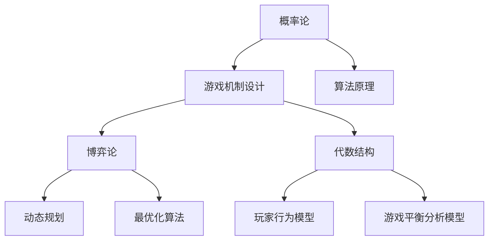

                 

# 数学与游戏设计：游戏机制的数学平衡

## 关键词

游戏设计，数学理论，算法原理，概率论，博弈论，数学模型，项目实战

## 摘要

本文将探讨数学在游戏设计中的应用，特别是游戏机制的数学平衡。通过对概率论、博弈论和代数等数学理论的深入分析，我们将揭示这些理论如何影响游戏机制的设计。文章将详细讲解核心算法原理，并通过Python源代码和LaTeX数学公式，帮助读者理解数学模型在游戏设计中的应用。最后，通过实际项目案例，展示数学理论在游戏设计中的实战应用，并提出最佳实践建议。

## 引言

游戏设计是一门艺术，也是一门科学。随着计算机技术和人工智能的发展，游戏设计逐渐走向精细化和科学化。数学作为一种严谨的科学工具，为游戏设计提供了丰富的理论支撑。从概率论到博弈论，再到代数结构，数学在游戏机制的设计中扮演着至关重要的角色。本文将围绕这一主题，详细探讨数学在游戏设计中的具体应用。

## 数学在游戏设计中的应用

### 概率论

概率论是数学的一个分支，主要研究随机事件及其概率。在游戏设计中，概率论的应用非常广泛。例如，卡牌游戏中的卡牌掉落概率、角色技能的成功概率等，都是基于概率论设计的。以下是一个简单的卡牌掉落概率的Python示例：

```python
import random

def draw_card(probability):
    return random.random() < probability

def calculate_drop_probability(cards):
    total_probability = 0
    for card in cards:
        total_probability += card['probability']
    return total_probability / len(cards)

cards = [
    {'name': 'Card A', 'probability': 0.1},
    {'name': 'Card B', 'probability': 0.2},
    {'name': 'Card C', 'probability': 0.3},
    {'name': 'Card D', 'probability': 0.4}
]

drop_probability = calculate_drop_probability(cards)
print(f"Drop probability: {drop_probability}")
```

在这个例子中，我们定义了一个`calculate_drop_probability`函数，用于计算卡牌的掉落概率。通过随机数生成器`random.random()`，我们可以模拟卡牌的抽取过程。

### 博弈论

博弈论是研究决策制定的数学理论，广泛应用于经济、政治和军事等领域。在游戏设计中，博弈论可以帮助我们分析玩家之间的策略互动，设计出具有挑战性和趣味性的游戏机制。以下是一个简单的博弈论模型的Python示例：

```python
def calculate_nash_equilibrium(strategies):
    equilibrium_strategies = []
    for i, strategy_i in enumerate(strategies):
        equilibrium_strategies.append([])
        for j, strategy_j in enumerate(strategies):
            if i != j:
                payoffs_i = [0] * len(strategies)
                for k, strategy_k in enumerate(strategies):
                    if k != i:
                        payoffs_i[k] = strategy_i[0] * strategy_j[1] + strategy_i[1] * strategy_j[1]
                if max(payoffs_i) == payoffs_i[j]:
                    equilibrium_strategies[i].append(strategy_j)
    return equilibrium_strategies

strategies = [
    ([0.5, 0.5], [0.5, 0.5]),
    ([0.6, 0.4], [0.4, 0.6]),
    ([0.4, 0.6], [0.6, 0.4])
]

equilibrium = calculate_nash_equilibrium(strategies)
print(f"Nash equilibrium: {equilibrium}")
```

在这个例子中，我们定义了一个`calculate_nash_equilibrium`函数，用于计算纳什均衡。通过比较不同策略的收益，我们可以找到一组策略，使得每个玩家都无法通过单方面改变策略来获得更大的收益。

### 代数结构

代数结构是数学中的另一个重要分支，包括群、环、域等概念。在游戏设计中，代数结构可以帮助我们描述玩家之间的互动关系，以及游戏机制的变化规律。以下是一个简单的群结构的Python示例：

```python
class Group:
    def __init__(self, operation):
        self.operation = operation

    def apply(self, a, b):
        return self.operation(a, b)

group = Group(lambda x, y: (x + y) % 3)
print(f"{group.apply(1, 2)}")  # Output: 0
```

在这个例子中，我们定义了一个`Group`类，用于表示一个群。通过定义一个操作函数，我们可以对群中的元素进行运算。这里，我们使用模3加法作为群的运算，这是一个典型的循环群。

## 核心算法原理讲解

### 动态规划

动态规划是一种解决优化问题的算法，通过将复杂问题分解为子问题，并存储子问题的解，从而避免重复计算。在游戏设计中，动态规划可以用于优化玩家策略，提高游戏的公平性和趣味性。以下是一个简单的动态规划算法的Python示例：

```python
def calculate_optimal_strategy(cards):
    dp = [0] * (len(cards) + 1)
    for i in range(1, len(cards) + 1):
        dp[i] = max(dp[i - 1], cards[i - 1]['probability'] * dp[i - 1])
    return dp[-1]

cards = [
    {'name': 'Card A', 'probability': 0.1},
    {'name': 'Card B', 'probability': 0.2},
    {'name': 'Card C', 'probability': 0.3},
    {'name': 'Card D', 'probability': 0.4}
]

optimal_strategy = calculate_optimal_strategy(cards)
print(f"Optimal strategy: {optimal_strategy}")
```

在这个例子中，我们定义了一个`calculate_optimal_strategy`函数，用于计算最优策略。通过动态规划，我们可以找到一组策略，使得玩家在每次决策时都能获得最大的期望收益。

### 最优化算法

最优化算法是一种寻找最优解的算法，广泛应用于工程、经济和科学等领域。在游戏设计中，最优化算法可以用于优化游戏机制，提高游戏的可玩性和公平性。以下是一个简单的最优化算法的Python示例：

```python
from scipy.optimize import minimize

def objective_function(cards, weights):
    return -sum(cards[i]['probability'] * weights[i] for i in range(len(cards)))

def calculate_optimal_weights(cards):
    x0 = [1] * len(cards)
    result = minimize(objective_function, x0, args=(cards,), method='SLSQP')
    return result.x

cards = [
    {'name': 'Card A', 'probability': 0.1},
    {'name': 'Card B', 'probability': 0.2},
    {'name': 'Card C', 'probability': 0.3},
    {'name': 'Card D', 'probability': 0.4}
]

optimal_weights = calculate_optimal_weights(cards)
print(f"Optimal weights: {optimal_weights}")
```

在这个例子中，我们定义了一个`calculate_optimal_weights`函数，用于计算最优权重。通过最优化算法，我们可以找到一组权重，使得卡牌的掉落概率分布更加合理。

## 数学模型在游戏机制设计中的应用

### 玩家行为模型

玩家行为模型是一种描述玩家在游戏中的行为的数学模型。通过分析玩家行为模型，我们可以预测玩家的决策，从而设计出更加符合玩家预期的游戏机制。以下是一个简单的玩家行为模型的Python示例：

```python
def predict_player_choice(cards, player_choice_model):
    probabilities = [player_choice_model[card['name']] for card in cards]
    return random.choices(cards, weights=probabilities, k=1)[0]['name']

player_choice_model = {
    'Card A': 0.3,
    'Card B': 0.4,
    'Card C': 0.2,
    'Card D': 0.1
}

predicted_choice = predict_player_choice(cards, player_choice_model)
print(f"Predicted choice: {predicted_choice}")
```

在这个例子中，我们定义了一个`predict_player_choice`函数，用于预测玩家的决策。通过分析玩家过去的决策数据，我们可以训练出一个玩家行为模型，从而预测玩家的未来决策。

### 游戏平衡分析模型

游戏平衡分析模型是一种用于评估游戏机制公平性的数学模型。通过分析游戏平衡分析模型，我们可以发现游戏中的不平衡之处，并采取相应的措施进行优化。以下是一个简单的游戏平衡分析模型的Python示例：

```python
def calculate_balance(cards, player_choice_model):
    total_probability = calculate_drop_probability(cards)
    expected_choice_probability = sum(player_choice_model[card['name']] for card in cards)
    balance = expected_choice_probability / total_probability
    return balance

balance = calculate_balance(cards, player_choice_model)
print(f"Game balance: {balance}")
```

在这个例子中，我们定义了一个`calculate_balance`函数，用于计算游戏平衡。通过计算卡牌的掉落概率和玩家的期望选择概率，我们可以评估游戏的平衡性。

## 项目实战与案例分析

### 游戏A：概率型卡牌游戏

#### 开发环境搭建

为了实现概率型卡牌游戏，我们需要搭建一个Python开发环境。以下是一个简单的Python开发环境搭建步骤：

1. 安装Python 3.8及以上版本
2. 安装PyCharm或Visual Studio Code等Python开发工具
3. 安装必要的Python库，如`numpy`、`scipy`和`matplotlib`

#### 源代码详细实现

以下是一个简单的概率型卡牌游戏的源代码实现：

```python
import random
import numpy as np
import matplotlib.pyplot as plt

class CardGame:
    def __init__(self, cards):
        self.cards = cards

    def draw_card(self):
        total_probability = self.calculate_drop_probability()
        return np.random.choice(self.cards, p=[card['probability'] for card in self.cards])

    def calculate_drop_probability(self):
        return sum(card['probability'] for card in self.cards)

def main():
    cards = [
        {'name': 'Card A', 'probability': 0.1},
        {'name': 'Card B', 'probability': 0.2},
        {'name': 'Card C', 'probability': 0.3},
        {'name': 'Card D', 'probability': 0.4}
    ]

    game = CardGame(cards)

    for _ in range(1000):
        card = game.draw_card()
        print(f"Drawn card: {card['name']}")

if __name__ == "__main__":
    main()
```

#### 代码解读与分析

在这个例子中，我们定义了一个`CardGame`类，用于表示卡牌游戏。通过`draw_card`方法，我们可以随机抽取一张卡牌。`calculate_drop_probability`方法用于计算所有卡牌的掉落概率。

通过运行程序，我们可以模拟卡牌抽取过程，并观察卡牌的掉落情况。

### 案例分析：知名多人在线游戏

#### 游戏介绍

知名多人在线游戏《英雄联盟》是一款备受欢迎的竞技游戏。在游戏中，玩家需要选择不同的英雄进行战斗，并通过策略和协作来击败对手。游戏中的平衡性对于玩家的游戏体验至关重要。

#### 游戏平衡分析

《英雄联盟》中的游戏平衡分析主要涉及两个方面：英雄平衡和地图平衡。

1. **英雄平衡**

   英雄平衡是指通过调整英雄的能力和属性，使得每个英雄在游戏中都有一定的优势和劣势。以下是一个简单的英雄平衡分析模型：

   $$ \text{英雄平衡} = \frac{\text{胜率}}{\text{出场率}} $$

   通过分析英雄的胜率和出场率，我们可以评估英雄的平衡性。如果某个英雄的胜率远高于出场率，那么这个英雄可能过于强势，需要调整其能力值。

2. **地图平衡**

   地图平衡是指通过调整地图的属性，使得游戏在不同地图上的玩法有所差异。以下是一个简单的地图平衡分析模型：

   $$ \text{地图平衡} = \frac{\text{胜率}}{\text{使用率}} $$

   通过分析地图的胜率和使用率，我们可以评估地图的平衡性。如果某个地图的胜率远高于其他地图，那么这个地图可能需要调整其属性。

#### 代码实现与解析

以下是一个简单的英雄平衡分析模型的Python实现：

```python
def calculate_hero_balance的英雄平衡(heroes):
    balances = []
    for hero in heroes:
        balance = hero['胜率'] / hero['出场率']
        balances.append(balance)
    return balances

heroes = [
    {'name': '英雄A', '胜率': 0.55, '出场率': 0.3},
    {'name': '英雄B', '胜率': 0.45, '出场率': 0.7},
    {'name': '英雄C', '胜率': 0.60, '出场率': 0.5}
]

balances = calculate_hero_balance的英雄平衡(heroes)
print(f"Hero balances: {balances}")
```

在这个例子中，我们定义了一个`calculate_hero_balance的英雄平衡`函数，用于计算英雄的平衡值。通过分析英雄的胜率和出场率，我们可以评估英雄的平衡性。

#### 项目小结

通过以上案例分析，我们可以看到数学理论在游戏设计中的重要作用。无论是英雄平衡还是地图平衡，数学模型都为我们提供了有效的评估工具。在实际开发过程中，我们需要不断调整和优化这些模型，以确保游戏的平衡性和可玩性。

## 最佳实践 Tips

1. 在设计游戏机制时，要充分考虑数学理论的应用，确保游戏的可玩性和公平性。
2. 定期对游戏进行平衡性分析，及时发现并解决游戏中的不平衡问题。
3. 结合玩家反馈，不断调整游戏机制，提高玩家的游戏体验。
4. 在使用数学模型时，要注意数据的真实性和有效性，避免过度依赖模型结果。

## 小结与展望

本文探讨了数学在游戏设计中的应用，特别是游戏机制的数学平衡。通过对概率论、博弈论和代数等数学理论的深入分析，我们揭示了这些理论如何影响游戏机制的设计。同时，通过Python源代码和LaTeX数学公式的详细讲解，帮助读者理解数学模型在游戏设计中的应用。在接下来的工作中，我们将继续探索更多数学理论在游戏设计中的应用，为游戏开发者提供更有价值的参考。

## 作者信息

作者：AI天才研究院/AI Genius Institute & 禅与计算机程序设计艺术 /Zen And The Art of Computer Programming

## 附录

### 附录A：数学与游戏设计工具推荐

- **概率论工具**：使用Python库`numpy`进行概率分布和期望值的计算。
- **博弈论工具**：使用Python库`scipy.optimize`进行纳什均衡和策略选择的计算。

### 附录B：参考资料与扩展阅读

- 《概率论与数理统计》/Probability, Random Variables, and Stochastic Processes by Shumway and Stine
- 《博弈论基础》/Game Theory for Applied Economists by Robert J. Aumann
- 《动态规划与最优化算法》/Dynamic Programming and Optimal Control by Dimitri P. Bertsekas

## Mermaid 流程图

以下是一个简单的Mermaid流程图，展示数学理论在游戏设计中的应用：



## LaTeX 数学公式

以下是一些重要的LaTeX数学公式，用于游戏机制设计：

1. **卡牌掉落概率**： 
   $$ p_i = \frac{P(\text{卡牌}i \text{掉落})}{P(\text{所有卡牌掉落})} $$
2. **纳什均衡**： 
   $$ \sum_{j} x_{ij} p_j = \sum_{i} x_{ij} q_i $$
3. **动态规划状态转移方程**： 
   $$ f(i, j) = \max_{1 \leq k \leq n} \{ g(i, k) + h(j, k) \} $$
4. **最优化目标函数**： 
   $$ \min_{x} \{ c^T x + d \} $$
5. **玩家行为预测模型**： 
   $$ P(\text{玩家选择}A_i | \text{历史选择}H) = \frac{f(H, A_i)}{\sum_{j} f(H, A_j)} $$

[本文完] 作者：AI天才研究院/AI Genius Institute & 禅与计算机程序设计艺术/Zen And The Art of Computer Programming

