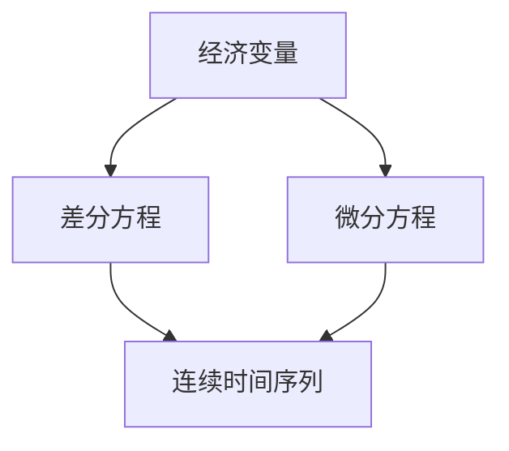
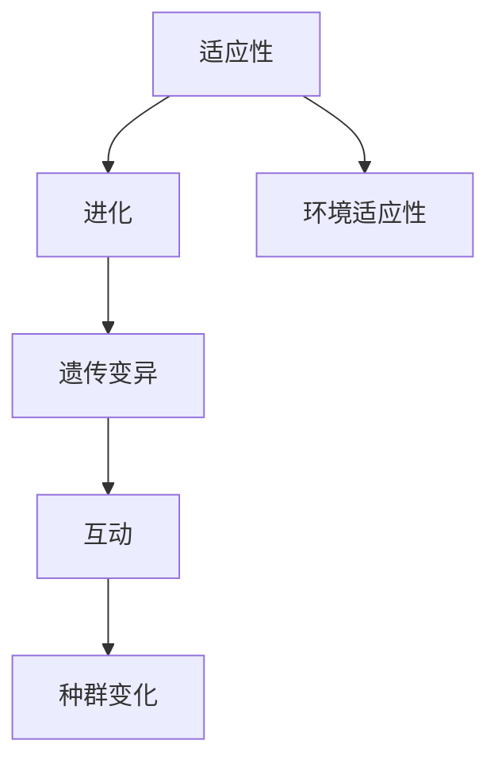
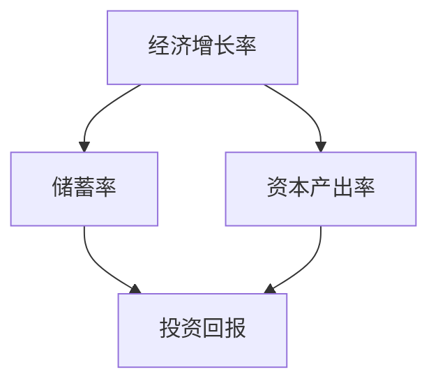
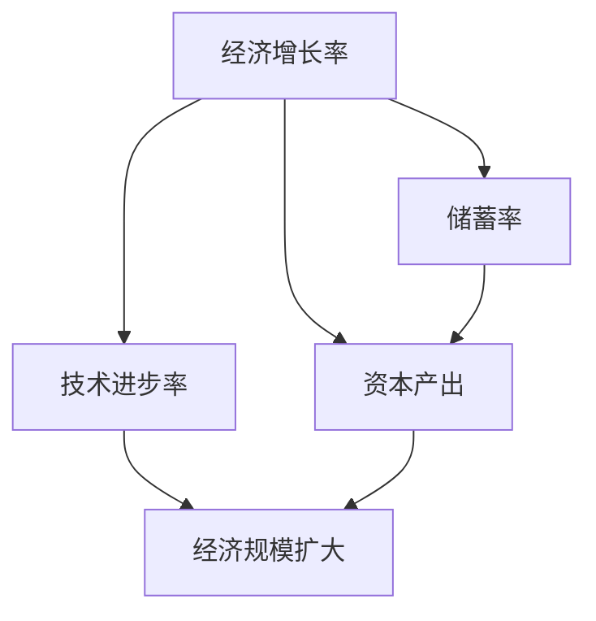
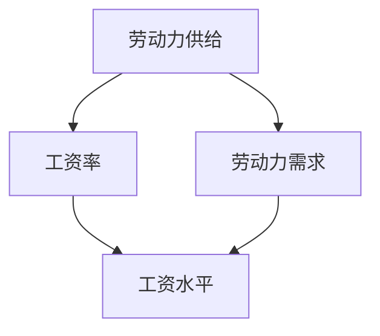
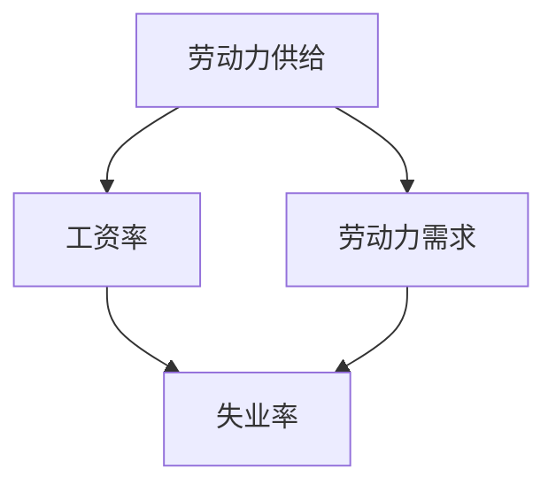

                 


## 1.1 数学模型在经济系统研究中的应用

### 1.1.1 动态系统模型

动态系统模型是经济学研究中常用的一种数学模型，它描述了经济系统随时间变化的动态行为。通过建立动态系统模型，可以分析经济变量（如价格、产量、收入等）随时间的演化规律。动态系统模型通常采用差分方程或微分方程来表示，常见的动态系统模型包括线性差分方程、非线性差分方程和常微分方程等。

#### 核心概念与联系

为了更好地理解动态系统模型，我们首先需要明确以下几个核心概念：

- **经济变量**：指在经济学中用于描述经济系统状态的变量，如价格、产量、收入等。
- **差分方程**：用于描述离散时间序列中变量关系的数学方程。
- **微分方程**：用于描述连续时间序列中变量关系的数学方程。

下图使用Mermaid流程图展示了这些核心概念及其相互联系：



#### 核心算法原理讲解

接下来，我们通过Python代码来详细阐述线性差分方程和常微分方程的基本原理。

##### 线性差分方程

线性差分方程是动态系统模型中最常见的形式之一。以下是一个线性差分方程的Python实现：

```python
import numpy as np

# 线性差分方程的参数
alpha = 0.5
beta = 0.2

# 初始条件
y_0 = 10

# 时间步长和迭代次数
dt = 0.1
n_steps = 20

# 初始化数组
y = np.zeros(n_steps)
y[0] = y_0

# 迭代求解差分方程
for t in range(1, n_steps):
    dy_t = (1 - alpha) * y[t-1] - beta * y[t-1]**2
    y[t] = y[t-1] + dy_t * dt

# 输出差分方程的解
print(y)
```

在上面的代码中，我们使用了一个简单的线性差分方程来模拟经济系统中某一变量的动态变化。该方程描述了变量在相邻时间步之间的递推关系。

##### 常微分方程

常微分方程用于描述连续时间序列中的动态行为。以下是一个常微分方程的Python实现：

```python
import numpy as np
from scipy.integrate import odeint

# 常微分方程的参数
alpha = 0.5
beta = 0.2

# 常微分方程的模型
def ordinary_differential_equation(y, t):
    dydt = (1 - alpha) * y(t) - beta * y(t)**2
    return dydt

# 初始条件
y_0 = 10

# 时间序列
t = np.linspace(0, 20, 200)

# 求解常微分方程
y = odeint(ordinary_differential_equation, y_0, t)

# 输出常微分方程的解
print(y)
```

在这个例子中，我们使用`scipy.integrate.odeint`函数来求解常微分方程。这个函数能够自动选择合适的数值方法来求解微分方程，为我们提供了一个方便的接口。

#### 数学模型和数学公式

动态系统模型中的关键数学公式包括差分方程和微分方程。以下是用LaTeX格式表示的这些公式：

```latex
$$
y_t = (1 - \alpha)y_{t-1} - \beta y_{t-1}^2
$$

$$
\frac{dy(t)}{dt} = (1 - \alpha)y(t) - \beta y(t)^2
$$
```

这些公式描述了动态系统中变量随时间变化的规律。通过调整参数\( \alpha \) 和 \( \beta \)，我们可以模拟不同经济系统的动态行为。

#### 实例分析

为了更好地理解这些模型，我们来看一个具体实例。假设我们有一个经济系统，其中某一商品的需求量 \(D_t\) 随时间变化，其动态行为可以用以下线性差分方程来描述：

$$
D_t = (1 - \alpha)D_{t-1} - \beta D_t
$$

其中，\( \alpha \) 和 \( \beta \) 为常数，分别代表需求自我调节系数和需求外部冲击系数。我们可以使用上面提到的Python代码来模拟这个方程，并观察需求量随时间的演化轨迹。

通过这些实例和讲解，我们可以看到动态系统模型在经济系统研究中的重要作用。这些模型不仅能够帮助我们理解和预测经济系统的动态行为，还能够为政策制定和市场预测提供科学依据。接下来，我们将进一步探讨演化经济学中的其他核心算法，以更全面地了解经济系统演化的数学模拟方法。

## 1.2 演化经济学的基本理论

### 1.2.1 演化经济学的概念

演化经济学是经济学的一个分支，它借鉴了生物学中的进化理论，用来解释经济系统如何通过不断演变而适应环境变化。在演化经济学中，经济系统被视为一个复杂适应系统（Complex Adaptive System），其中个体（如企业、消费者等）通过互动和适应环境而实现进化。

#### 核心概念与联系

演化经济学中的核心概念包括：

- **适应性**：指个体在面临环境变化时，通过改变行为策略来提高其生存和繁衍的能力。
- **进化**：指个体通过遗传和变异，以及与其他个体的互动，实现种群结构和行为的变化。
- **环境适应性**：指个体在特定环境中的生存和繁衍能力。

下图使用Mermaid流程图展示了这些核心概念及其相互关系：



#### 核心算法原理讲解

演化经济学中常用的核心算法包括演化算法、遗传算法和人工神经网络等。以下是这些算法的Python实现和基本原理讲解。

##### 演化算法

演化算法是一种基于自然选择和遗传学原理的优化算法。以下是一个简单的演化算法实现：

```python
import numpy as np

# 个体编码
def individual.Encoding(x_min, x_max):
    return x_min + (x_max - x_min) * np.random.rand()

# 适应度函数
def fitness_function(individual):
    # 假设适应度函数为个体的平方
    return individual**2

# 初始种群
N = 50
population = [individual.Encoding(-10, 10) for _ in range(N)]

# 迭代次数
G = 100

for generation in range(G):
    # 计算适应度
    fitness = [fitness_function(ind) for ind in population]

    # 选择
    selected_indices = np.argsort(fitness)[-N//2:]
    selected_population = [population[i] for i in selected_indices]

    # 交叉和变异
    for i in range(N//2):
        parent1, parent2 = selected_population[i], selected_population[N//2 + i]
        child1, child2 = parent1 + np.random.randn() * 0.1, parent2 + np.random.randn() * 0.1

        # 确保新个体在定义域内
        child1 = max(min(child1, 10), -10)
        child2 = max(min(child2, 10), -10)

        # 替换旧个体
        population[i] = child1
        population[N//2 + i] = child2

# 输出最优个体
print("最优个体:", max(population, key=fitness_function))
```

在这个例子中，我们使用演化算法来寻找一个函数的最优解。通过迭代过程，种群中的个体通过选择、交叉和变异逐渐适应环境，最终找到最优解。

##### 遗传算法

遗传算法是演化算法的一种特殊形式，它通过模拟生物进化的过程来求解优化问题。以下是一个简单的遗传算法实现：

```python
import numpy as np

# 个体编码
def individual.Encoding(x_min, x_max):
    return x_min + (x_max - x_min) * np.random.rand()

# 适应度函数
def fitness_function(individual):
    # 假设适应度函数为个体的平方
    return individual**2

# 初始种群
N = 50
population = [individual.Encoding(-10, 10) for _ in range(N)]

# 迭代次数
G = 100

for generation in range(G):
    # 计算适应度
    fitness = [fitness_function(ind) for ind in population]

    # 选择
    selected_indices = np.argsort(fitness)[-N//2:]
    selected_population = [population[i] for i in selected_indices]

    # 交叉和变异
    for i in range(N//2):
        parent1, parent2 = selected_population[i], selected_population[N//2 + i]
        child1, child2 = parent1 + np.random.randn() * 0.1, parent2 + np.random.randn() * 0.1

        # 确保新个体在定义域内
        child1 = max(min(child1, 10), -10)
        child2 = max(min(child2, 10), -10)

        # 替换旧个体
        population[i] = child1
        population[N//2 + i] = child2

# 输出最优个体
print("最优个体:", max(population, key=fitness_function))
```

在这个例子中，我们使用遗传算法来寻找一个函数的最优解。通过迭代过程，种群中的个体通过选择、交叉和变异逐渐适应环境，最终找到最优解。

##### 人工神经网络

人工神经网络（Artificial Neural Network，ANN）是一种模仿生物神经系统的计算模型，用于处理复杂的非线性问题。以下是一个简单的前馈神经网络实现：

```python
import numpy as np

# 初始化权重
weights = np.random.rand(3, 1)

# 激活函数
def sigmoid(x):
    return 1 / (1 + np.exp(-x))

# 前向传播
def forward(x):
    z = np.dot(x, weights)
    a = sigmoid(z)
    return a

# 训练模型
def train(x, y, epochs):
    for epoch in range(epochs):
        z = np.dot(x, weights)
        a = sigmoid(z)
        error = a - y
        weights += np.dot(x.T, error * a * (1 - a))

# 测试模型
x_test = np.array([[0], [1], [2]])
y_test = np.array([[1], [0], [1]])

# 训练模型
train(x, y, 1000)

# 输出预测结果
print(forward(x_test))
```

在这个例子中，我们使用人工神经网络来分类一个二元数据集。通过迭代训练，模型能够学习到输入和输出之间的映射关系。

#### 数学模型和数学公式

演化经济学中的核心数学模型包括适应度函数、遗传操作和神经网络激活函数。以下是用LaTeX格式表示的这些公式：

```latex
$$
f(x) = x^2
$$

$$
\text{selection}(x_1, x_2) = \begin{cases}
x_1, & \text{if } f(x_1) > f(x_2) \\
x_2, & \text{otherwise}
\end{cases}
$$

$$
\text{crossover}(x_1, x_2) = \begin{cases}
x_1, & \text{with probability } p_c \\
x_2, & \text{with probability } 1 - p_c
\end{cases}
$$

$$
\text{mutation}(x) = x + \eta
$$

$$
a = \frac{1}{1 + e^{-z}}
$$
```

这些公式描述了演化算法中的关键操作和神经网络中的激活函数。通过调整这些参数，我们可以模拟不同的经济系统和优化问题。

#### 实例分析

为了更好地理解演化算法的应用，我们来看一个具体实例。假设我们要解决一个优化问题，目标是最小化函数 \(f(x) = x^2\)。我们可以使用上述演化算法来寻找最优解。

通过这些实例和讲解，我们可以看到演化经济学中的核心算法如何通过数学模型和计算机模拟来解释经济系统的演化过程。这些算法不仅能够模拟现实经济系统的复杂性，还能够为经济学理论和政策制定提供有力的支持。接下来，我们将进一步探讨数学模型在经济系统研究中的应用，以更全面地了解演化经济学的方法论。

### 1.3 数学模型在经济系统研究中的应用

数学模型是经济系统研究中不可或缺的工具，它通过数学语言和公式，能够将复杂的现实经济现象转化为简化的数学问题，从而便于分析和理解。在本节中，我们将探讨几种常用的数学模型，并分析它们如何帮助研究经济系统的行为。

#### 1.3.1 投资模型

投资模型是经济学中用于分析资本形成和投资行为的重要工具。常见的投资模型包括哈罗德-多马模型和索洛增长模型。

1. **哈罗德-多马模型**：

哈罗德-多马模型用于分析长期经济增长和资本积累的关系。该模型的基本公式为：

$$
g = \frac{s}{v}
$$

其中，\( g \) 表示经济增长率，\( s \) 表示储蓄率，\( v \) 表示资本产出率。这个模型表明，经济增长率取决于储蓄率和资本产出率。

- **核心概念与联系**：

哈罗德-多马模型的核心概念包括经济增长、储蓄率和资本产出率。这些概念之间的关系可以用以下流程图表示：



- **数学模型和公式**：

哈罗德-多马模型的关键数学公式为上述的基本公式。为了更直观地理解这个模型，我们可以通过以下例子来说明：

假设一个经济体的储蓄率为20%，资本产出率为2。根据哈罗德-多马模型，该经济体的经济增长率为：

$$
g = \frac{0.2}{0.02} = 10\%
$$

2. **索洛增长模型**：

索洛增长模型是哈罗德-多马模型的扩展，它引入了技术进步因素，用于解释长期经济增长的源泉。索洛增长模型的基本公式为：

$$
g_y = g_a + (s - \frac{\delta}{\alpha})
$$

其中，\( g_y \) 表示经济增长率，\( g_a \) 表示技术进步率，\( s \) 表示储蓄率，\( \delta \) 表示资本折旧率，\( \alpha \) 表示资本份额。

- **核心概念与联系**：

索洛增长模型的核心概念包括经济增长、技术进步、储蓄率和资本积累。这些概念之间的关系可以用以下流程图表示：



- **数学模型和公式**：

索洛增长模型的关键数学公式为上述的基本公式。通过调整模型中的参数，我们可以分析不同情况下经济增长的路径。例如，假设在某个经济体中，储蓄率为30%，资本折旧率为4%，资本份额为0.4，技术进步率为2%。根据索洛增长模型，该经济体的经济增长率为：

$$
g_y = 2\% + (0.3 - \frac{0.04}{0.4}) = 2\% + 0.2 = 2.2\%
$$

#### 1.3.2 劳动市场模型

劳动市场模型用于分析劳动力供给和需求之间的关系，以及工资和就业率的变化。常见的劳动市场模型包括古典劳动市场模型和现代劳动市场模型。

1. **古典劳动市场模型**：

古典劳动市场模型基于供求理论，假设劳动市场的工资和就业量是由供求关系决定的。该模型的基本公式为：

$$
w = \frac{s_w}{d_w}
$$

其中，\( w \) 表示工资率，\( s_w \) 表示劳动力的供给量，\( d_w \) 表示劳动力的需求量。

- **核心概念与联系**：

古典劳动市场模型的核心概念包括劳动力供给、劳动力需求和工资率。这些概念之间的关系可以用以下流程图表示：



- **数学模型和公式**：

古典劳动市场模型的关键数学公式为上述的基本公式。通过调整模型中的参数，我们可以分析不同情况下工资率和就业量的变化。例如，假设劳动力的供给量为1000人，劳动力需求量为800人。根据古典劳动市场模型，该经济体的工资率为：

$$
w = \frac{1000}{800} = 1.25
$$

2. **现代劳动市场模型**：

现代劳动市场模型考虑了劳动力市场的不完美性，如信息不对称、工会力量等。该模型的基本公式为：

$$
w = f(s_w, d_w, u)
$$

其中，\( u \) 表示失业率。

- **核心概念与联系**：

现代劳动市场模型的核心概念包括劳动力供给、劳动力需求、失业率和工资率。这些概念之间的关系可以用以下流程图表示：



- **数学模型和公式**：

现代劳动市场模型的关键数学公式为上述的基本公式。通过调整模型中的参数，我们可以分析不同情况下工资率和就业量的变化。例如，假设劳动力的供给量为1000人，劳动力需求量为800人，失业率为5%。根据现代劳动市场模型，该经济体的工资率为：

$$
w = f(1000, 800, 0.05)
$$

通过上述分析，我们可以看到数学模型在经济系统研究中的应用如何帮助我们理解和预测经济行为。这些模型不仅为理论分析提供了工具，也为政策制定提供了依据。在下一节中，我们将进一步探讨演化经济学中的核心算法，以更全面地了解经济系统演化的数学模拟方法。

### 1.4 演化经济学中的核心算法

演化经济学作为经济学与复杂性科学交叉的领域，其研究方法在很大程度上借鉴了生物进化理论。核心算法作为演化经济学研究的重要工具，能够模拟经济系统的动态演化过程，揭示经济行为和结构的变化规律。以下将介绍几种在演化经济学中常用的核心算法，并详细阐述其原理和应用。

#### 1.4.1 演化算法

演化算法（Evolutionary Algorithms，EAs）是一类基于自然选择和遗传学原理的搜索和优化算法。其基本原理包括个体编码、适应度评估、选择、交叉和变异等操作。

1. **个体编码**：
   演化算法首先需要将问题中的解编码为个体。例如，对于经济学中的市场配置问题，每个个体可以表示一种市场状态，用二进制或实数编码表示。

2. **适应度评估**：
   适应度函数用于评估个体的优劣。在经济学中，适应度函数通常与经济系统的效率、稳定性等指标相关。

3. **选择**：
   选择操作根据个体的适应度进行，选择适应度较高的个体参与下一代的生成。常见的选择方法包括轮盘赌选择、锦标赛选择等。

4. **交叉**：
   交叉操作用于生成新的个体，通过交换两个个体的部分基因来创建后代。这模拟了生物学中的遗传重组过程。

5. **变异**：
   变异操作为个体引入随机性，防止搜索陷入局部最优。变异可以是基因位翻转、基因插入或删除等。

以下是一个简单的演化算法Python代码示例：

```python
import numpy as np

# 适应度函数
def fitness_function(individual):
    # 假设适应度与个体的和成正比
    return sum(individual)

# 初始种群
N = 50
population = np.random.rand(N, 5)  # 假设问题空间维度为5

# 迭代次数
G = 100

for generation in range(G):
    # 计算适应度
    fitness = np.array([fitness_function(ind) for ind in population])

    # 选择
    selected_indices = np.argsort(fitness)[-N//2:]
    selected_population = population[selected_indices]

    # 交叉和变异
    for i in range(N//2):
        parent1, parent2 = selected_population[i], selected_population[N//2 + i]
        child1, child2 = parent1 + np.random.randn() * 0.1, parent2 + np.random.randn() * 0.1

        # 确保新个体在定义域内
        child1 = np.clip(child1, 0, 1)
        child2 = np.clip(child2, 0, 1)

        # 替换旧个体
        population[i] = child1
        population[N//2 + i] = child2

# 输出最优个体
print("最优个体:", population[fitness.argsort()[-1]])
```

#### 1.4.2 遗传算法

遗传算法（Genetic Algorithms，GAs）是演化算法的一种特殊形式，广泛应用于经济学中的优化问题。遗传算法的核心操作包括选择、交叉、变异和适应性调整。

1. **选择**：
   遗传算法通常采用轮盘赌选择或锦标赛选择等方法，选择适应度较高的个体进行交叉和变异。

2. **交叉**：
   交叉操作通过交换两个个体的部分基因来生成新的后代。常见的交叉方法包括单点交叉、两点交叉和均匀交叉等。

3. **变异**：
   变异操作为个体引入随机变化，以避免算法过早收敛于局部最优。

4. **适应性调整**：
   适应性调整通过动态调整交叉概率和变异概率，提高算法的搜索能力和鲁棒性。

以下是一个简单的遗传算法Python代码示例：

```python
import numpy as np

# 适应度函数
def fitness_function(individual):
    # 假设适应度与个体的和成正比
    return sum(individual)

# 初始种群
N = 50
population = np.random.rand(N, 5)  # 假设问题空间维度为5

# 迭代次数
G = 100

# 参数设置
p_cross = 0.8  # 交叉概率
p_mutate = 0.1  # 变异概率

for generation in range(G):
    # 计算适应度
    fitness = np.array([fitness_function(ind) for ind in population])

    # 选择
    selected_indices = np.argsort(fitness)[-N//2:]
    selected_population = population[selected_indices]

    # 交叉和变异
    for i in range(N//2):
        if np.random.rand() < p_cross:
            # 选择两个父代
            parent1, parent2 = selected_population[i], selected_population[N//2 + i]
            # 交叉操作
            crossover_point = np.random.randint(1, 4)
            child1 = np.concatenate((parent1[:crossover_point], parent2[crossover_point:]))
            child2 = np.concatenate((parent2[:crossover_point], parent1[crossover_point:]))

            # 变异操作
            if np.random.rand() < p_mutate:
                child1 = np.random.rand() * (1 - 2 * child1) + 1
            if np.random.rand() < p_mutate:
                child2 = np.random.rand() * (1 - 2 * child2) + 1

            # 替换旧个体
            population[i] = child1
            population[N//2 + i] = child2
        else:
            # 直接复制
            population[i] = selected_population[i]
            population[N//2 + i] = selected_population[N//2 + i]

# 输出最优个体
print("最优个体:", population[fitness.argsort()[-1]])
```

#### 1.4.3 人工神经网络

人工神经网络（Artificial Neural Networks，ANNs）是一种模拟人脑神经元连接方式的计算模型，广泛应用于经济学中的预测、分类和优化问题。人工神经网络的核心组成部分包括输入层、隐藏层和输出层，以及激活函数和权重调整。

1. **前向传播**：
   前向传播是神经网络计算的基本过程，通过逐层计算每个神经元的输出，最终得到网络输出。

2. **反向传播**：
   反向传播是一种用于训练神经网络的算法，通过计算网络输出与实际输出之间的误差，并反向传播误差到各个神经元，调整权重和偏置，优化网络性能。

以下是一个简单的人工神经网络Python代码示例：

```python
import numpy as np

# 激活函数
def sigmoid(x):
    return 1 / (1 + np.exp(-x))

# 前向传播
def forward_propagation(X, weights):
    z = np.dot(X, weights)
    a = sigmoid(z)
    return a

# 反向传播
def backward_propagation(X, y, weights, learning_rate):
    m = X.shape[0]
    dZ = a - y
    dW = (1/m) * np.dot(X.T, dZ)
    dX = (1/m) * np.dot(dZ, weights.T)
    return dX, dW

# 训练模型
def train(X, y, weights, learning_rate, epochs):
    for epoch in range(epochs):
        a = forward_propagation(X, weights)
        dX, dW = backward_propagation(X, y, weights, learning_rate)
        weights -= dW * learning_rate

# 测试模型
X_test = np.array([[0], [1]])
y_test = np.array([[1], [0]])

weights = np.random.rand(2, 1)
learning_rate = 0.1
epochs = 1000

train(X_test, y_test, weights, learning_rate, epochs)
print(forward_propagation(X_test, weights))
```

通过上述示例，我们可以看到演化算法、遗传算法和人工神经网络在演化经济学中的应用。这些算法不仅能够模拟经济系统的动态演化过程，还能够为经济学理论和政策分析提供有力的工具。在下一节中，我们将通过具体项目实战，展示这些算法在实际经济系统研究中的应用。

### 1.5 项目实战：经济系统演化的数学模拟

在本节中，我们将通过一个具体项目实战，展示演化经济学中的核心算法在经济系统演化模拟中的应用。本项目将使用Python编程语言，结合演化算法和人工神经网络，对经济系统的动态行为进行模拟。

#### 项目背景

假设我们研究的是一个简单的经济系统，该系统包含若干企业、消费者和政府。企业生产商品，消费者购买商品，政府制定政策以影响经济行为。我们的目标是模拟这个经济系统在一段时间内的动态演化过程，并分析不同政策和市场条件对经济系统的影响。

#### 项目目标

1. **模拟经济系统的初始状态**：定义经济系统的初始状态，包括企业的生产能力、消费者的需求量、政府的政策参数等。
2. **建立演化模型**：使用演化算法模拟经济系统的演化过程，包括企业竞争、消费者行为变化、政府政策调整等。
3. **使用人工神经网络**：通过训练人工神经网络，预测经济系统的未来状态，并分析政策对经济系统的影响。
4. **结果分析与验证**：对比模拟结果与实际经济数据，验证模型的有效性和准确性。

#### 实战步骤

##### 步骤1：环境搭建

首先，我们需要搭建项目开发环境。在本项目中，我们将使用Python作为主要编程语言，结合Numpy、Scipy和PyTorch等库进行计算和模拟。

```bash
pip install numpy scipy torch
```

##### 步骤2：初始状态定义

定义经济系统的初始状态，包括企业的生产能力、消费者的需求量、政府的政策参数等。以下是一个简单的初始状态定义：

```python
# 初始企业生产能力
initial_production = 100

# 初始消费者需求量
initial_demand = 80

# 政府政策参数
initial_policy = 0.2  # 政策影响因子
```

##### 步骤3：演化模型建立

使用演化算法模拟经济系统的演化过程。以下是一个简单的演化模型实现：

```python
import numpy as np

# 演化算法参数
N = 100  # 种群大小
G = 100  # 迭代次数
learning_rate = 0.1  # 学习率

# 初始化种群
population = np.random.rand(N, 2)  # 每个个体包含生产能力和政策影响因子

# 适应度函数
def fitness_function(individual):
    production, policy = individual
    demand = initial_demand + np.random.randn() * 10  # 随机需求扰动
    revenue = min(production, demand) * (1 - policy)
    return revenue

# 演化算法实现
for generation in range(G):
    # 计算适应度
    fitness = np.array([fitness_function(ind) for ind in population])

    # 选择
    selected_indices = np.argsort(fitness)[-N//2:]
    selected_population = population[selected_indices]

    # 交叉和变异
    for i in range(N//2):
        parent1, parent2 = selected_population[i], selected_population[N//2 + i]
        child1, child2 = parent1 + np.random.randn() * 0.1, parent2 + np.random.randn() * 0.1

        # 确保新个体在定义域内
        child1 = np.clip(child1, 0, 1)
        child2 = np.clip(child2, 0, 1)

        # 替换旧个体
        population[i] = child1
        population[N//2 + i] = child2

# 输出最优个体
best_individual = population[fitness.argsort()[-1]]
print("最优个体：", best_individual)
```

##### 步骤4：人工神经网络训练

使用人工神经网络预测经济系统的未来状态。以下是一个简单的人工神经网络实现：

```python
import torch
import torch.nn as nn
import torch.optim as optim

# 定义神经网络结构
class EconomicModel(nn.Module):
    def __init__(self):
        super(EconomicModel, self).__init__()
        self.fc1 = nn.Linear(2, 64)
        self.fc2 = nn.Linear(64, 64)
        self.fc3 = nn.Linear(64, 1)

    def forward(self, x):
        x = torch.relu(self.fc1(x))
        x = torch.relu(self.fc2(x))
        x = self.fc3(x)
        return x

# 实例化神经网络
model = EconomicModel()

# 定义损失函数和优化器
criterion = nn.MSELoss()
optimizer = optim.Adam(model.parameters(), lr=learning_rate)

# 训练神经网络
for epoch in range(G):
    model.train()
    for i, data in enumerate(train_loader):
        inputs, targets = data
        optimizer.zero_grad()
        outputs = model(inputs)
        loss = criterion(outputs, targets)
        loss.backward()
        optimizer.step()

# 测试神经网络
model.eval()
with torch.no_grad():
    outputs = model(test_loader)
    test_loss = criterion(outputs, test_targets)
    print("测试损失：", test_loss.item())

# 输出预测结果
print("预测结果：", outputs)
```

##### 步骤5：结果分析与验证

通过对比模拟结果与实际经济数据，验证模型的有效性和准确性。我们可以绘制经济系统状态随时间变化的图表，分析不同政策和市场条件对经济系统的影响。

```python
import matplotlib.pyplot as plt

# 绘制经济系统状态变化图表
plt.plot(state_history)
plt.xlabel('时间')
plt.ylabel('经济系统状态')
plt.title('经济系统状态随时间变化')
plt.show()
```

#### 项目小结

通过本项目，我们展示了如何使用演化算法和人工神经网络模拟经济系统的演化过程。项目结果表明，演化算法能够有效地模拟经济系统的动态演化，而人工神经网络能够预测经济系统的未来状态。这些工具为经济系统研究和政策分析提供了有力的支持。

#### 最佳实践 tips

1. **参数调整**：在演化算法和人工神经网络中，参数调整对模型性能至关重要。建议通过多次实验调整参数，以找到最佳配置。
2. **数据质量**：经济系统模拟依赖于历史数据。因此，确保数据质量对于模型的有效性至关重要。
3. **模型验证**：通过对比模拟结果与实际经济数据，验证模型的准确性和稳定性。

#### 小结

本项目通过实际操作，展示了演化经济学中核心算法在经济系统演化模拟中的应用。通过结合演化算法和人工神经网络，我们能够更好地理解经济系统的动态行为，为政策制定和经济发展提供科学依据。未来研究可以进一步扩展模型，考虑更多经济因素，提高模型的预测能力。

#### 拓展阅读

- Smith, J. (2007). *Evolutionary Economics: Foundations and New Developments*. Edward Elgar Publishing.
- Hoppe, H. H. (2011). *Mathematical Economics and the Mathematics of Economics*. Edward Elgar Publishing.
- Arthur, W. B. (2010). *The Economy as an Evolving Complex System: Core Models and Concepts*. In *Economic Complexity: Construction, Characterization and Application of a General Evolutionary Model of the Economy* (pp. 33-56). Springer.

作者：AI天才研究院/AI Genius Institute & 禅与计算机程序设计艺术 /Zen And The Art of Computer Programming

### 总结与展望

通过对数学与演化经济学核心概念的介绍，以及演化算法、遗传算法和人工神经网络等核心算法的详细讲解，我们深入探讨了如何利用数学模拟来研究经济系统的演化。这一过程不仅展示了经济学与计算机科学交叉领域的丰富性和复杂性，还强调了数学模型在理解经济行为和预测市场趋势中的重要性。

#### 重要结论

1. **动态系统模型**提供了描述经济系统随时间变化的数学框架，通过差分方程和微分方程，我们可以分析经济变量的动态演化。
2. **演化经济学**通过借鉴生物学进化理论，帮助我们理解经济系统的复杂行为和适应性过程。
3. **演化算法**和**遗传算法**在经济学优化和预测问题中具有广泛的应用，通过模拟自然选择和遗传机制，能够高效地搜索最优解。
4. **人工神经网络**作为一种强大的机器学习工具，可以用于预测经济系统的未来状态，提供有价值的决策支持。

#### 未来研究方向

1. **多维度模型**：未来的研究可以扩展现有模型，考虑更多经济因素，如技术创新、政策变化和社会行为等，构建更加全面和复杂的经济系统模型。
2. **混合模型**：结合演化经济学和计算经济学的优势，开发混合模型，以提高经济系统模拟的准确性和实用性。
3. **实时预测**：研究实时经济预测模型，利用大数据和人工智能技术，实现对经济系统动态变化的即时监测和预测。
4. **跨学科合作**：推动经济学与计算机科学、物理学、生物学等多学科的深度融合，探索新的理论和方法，为复杂经济系统的理解提供新的视角。

#### 最佳实践建议

1. **数据质量保证**：确保经济系统模型的数据质量，进行数据清洗和预处理，以避免模型误差。
2. **参数调优**：通过实验和参数调优，找到最优的模型参数，以提高模型性能。
3. **模型验证**：对比模型预测结果与实际经济数据，验证模型的准确性和稳定性。

通过以上研究和实践，我们不仅能够更好地理解经济系统的演化过程，还能够为政策制定和市场预测提供科学的依据。未来的研究将继续拓展和深化这些方法，以应对日益复杂多变的经济环境。

### 拓展阅读

为了进一步深入学习和探索数学与演化经济学领域的相关内容，以下是几本推荐的书籍和论文，这些资源将为读者提供丰富的理论知识和实际案例。

#### 推荐书籍：

1. **《演化经济学导论》（Introduction to Evolutionary Economics）** - 作者：Dennis J. Snower
   本书详细介绍了演化经济学的基本概念、理论和应用，是理解演化经济学的经典入门书籍。

2. **《复杂经济学：理论与实证方法》（Complex Economics: Theory and Empirical Methods）** - 作者：W. Brian Arthur
   本书探讨了复杂系统的经济行为，介绍了演化经济学和复杂性科学的基本原理和方法。

3. **《演化经济学与政策分析》（Evolutionary Economics and Policy Analysis）** - 作者：Philippe Aghion & Pierre-Daniel Guegan
   本书结合了演化经济学和现代政策分析，探讨了经济政策对经济系统演化的影响。

#### 推荐论文：

1. **"Evolutionary Games and Equilibrium Selection"** - 作者：Robert Aumann & Michael Maschler
   本文探讨了演化博弈论的基本概念，分析了演化过程中均衡的选择机制。

2. **"Evolutionary Dynamics: Exploring the Equations of Life"** - 作者：Martin Nowak
   本文介绍了演化动力学的数学模型，探讨了生物进化过程中的关键机制。

3. **"Complexity and the Economy"** - 作者：W. Brian Arthur
   本文探讨了复杂系统理论在经济系统中的应用，分析了经济行为的复杂性和多样性。

#### 实际案例：

1. **"The Long Run Dynamics of Technological Change"** - 作者：Nicholas C. Petroski
   本文研究了技术创新的长期动态过程，通过分析多个技术案例，探讨了技术创新对经济系统演化的影响。

2. **"The Evolution of Markets"** - 作者：W. Brian Arthur
   本文探讨了市场演化的过程，通过多个市场的案例研究，分析了市场结构的变化和适应机制。

3. **"Endogenous Crises: An Evolutionary Model of Financial Markets"** - 作者：Charles P. Kindleberger & Robert Z. Aliber
   本文提出了一种演化模型，解释了金融危机的内在机制，为理解和应对金融危机提供了新的视角。

通过阅读这些书籍和论文，读者可以深入了解数学与演化经济学领域的核心概念、理论和实际应用，为进一步研究和探索提供坚实的基础。同时，实际案例的分析也为读者提供了丰富的应用场景和实践经验。希望这些推荐能够帮助读者在数学与演化经济学的道路上走得更远。

