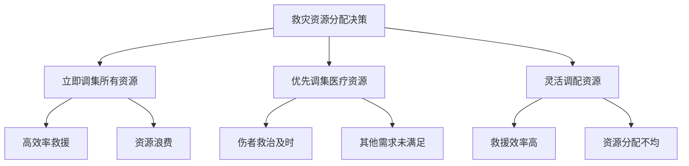
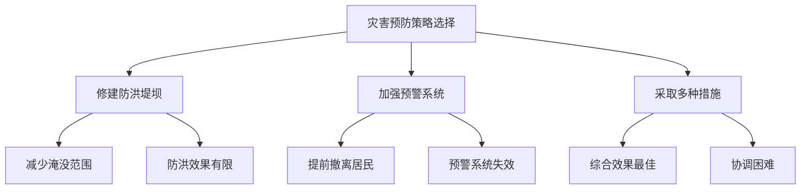

                 

### 第1章：灾害与灾害管理的概念

#### 1.1 灾害的定义与分类

灾害是指在自然、社会和技术等各种因素作用下，对人类生活和社会经济造成严重破坏和损失的事件。灾害可以按照其成因和影响范围进行分类：

##### 1.1.1 自然灾害

自然灾害是指由自然因素引起的灾害，如地震、洪水、飓风、火山爆发、山体滑坡、海啸等。这些灾害往往具有不可预测性和破坏性，对人类社会和环境造成巨大的影响。

##### 1.1.2 技术灾害

技术灾害是由于技术设备或系统的故障、失控或人为失误导致的灾害。如核事故、火灾、交通事故、化工事故、建筑倒塌等。这些灾害通常与人类的科技活动紧密相关。

##### 1.1.3 社会灾害

社会灾害是由于社会因素引起的灾害，如战争、饥荒、疫情、经济危机、社会动荡等。这些灾害往往与社会结构、政策、管理等因素密切相关。

#### 1.2 灾害管理的基本原则

灾害管理是指通过一系列的预防、准备、响应和恢复措施，降低灾害风险，减轻灾害影响，保障人民生命财产安全和社会稳定的过程。灾害管理的基本原则包括：

##### 1.2.1 预防为主

预防为主是灾害管理的首要原则，通过加强风险识别、评估和预警，减少灾害发生的概率和影响。

##### 1.2.2 减灾为核心

减灾为核心是指在灾害管理过程中，以降低灾害风险和减轻灾害损失为核心目标，采取多种措施进行灾害风险管理和灾害应对。

##### 1.2.3 救援与恢复并重

救援与恢复并重是指灾害发生后，迅速开展救援工作，保障受灾群众的基本生活需求，同时加强灾后恢复重建，恢复社会生产和生活的正常秩序。

#### 1.3 灾害管理的国际标准与法规

灾害管理在全球范围内受到广泛关注，多个国际组织和机构制定了相关的标准和法规，为各国灾害管理工作提供指导。其中主要包括：

##### 1.3.1 国际减灾战略

国际减灾战略（IDNDR）是由联合国发起的，旨在通过全球合作，减少自然灾害的风险和影响。

##### 1.3.2 主要的国际法规与公约

主要国际法规与公约包括《联合国国际灾害战略》、《联合国防减灾框架公约》等，这些法规和公约为各国灾害管理工作提供了法律基础。

##### 1.3.3 国家减灾规划

国家减灾规划是根据国际标准和国内实际情况制定的，旨在全面提高国家灾害管理能力，保障人民生命财产安全和社会稳定。

## 关键词：灾害管理、自然灾害、技术灾害、社会灾害、预防、减灾、救援、恢复、国际标准、法规

## 摘要

本文旨在探讨数学在灾害管理中的应用，特别是灾害响应的数学优化。文章首先介绍了灾害的定义与分类，阐述了灾害管理的基本原则和国际标准与法规。随后，文章深入分析了灾害风险评估与建模、灾害响应的数学优化方法，包括资源分配、疏散路线规划、应急救援力量调度等。此外，文章还介绍了数学模型在灾害模拟中的应用，以及数据科学与统计分析在灾害管理中的重要性。最后，文章探讨了灾害管理中的决策分析与模拟，以及灾害管理的未来趋势与挑战。通过本文的阅读，读者可以深入了解数学在灾害管理中的重要作用，为提高灾害管理能力提供有益的参考。

----------------------------------------------------------------

### 第2章：灾害风险评估与建模

#### 2.1 灾害风险评估方法

灾害风险评估是灾害管理的重要环节，旨在识别和评估灾害可能带来的风险，为预防和减轻灾害损失提供科学依据。灾害风险评估方法主要包括宏观风险评估和微观风险评估。

##### 2.1.1 宏观风险评估

宏观风险评估是从整体上对灾害风险进行评估，主要关注灾害发生概率、灾害损失程度以及灾害对区域经济、社会和环境的影响。宏观风险评估方法包括灾害损失估算、灾害风险概率分析等。

###### 2.1.1.1 灾害损失估算

灾害损失估算是宏观风险评估的核心内容，通过对历史灾害数据的分析，结合灾害发生的概率和损失程度，估算出灾害可能造成的经济损失。

```python
# 灾害损失估算示例
loss_estimation = (probability_of_hazard * average_loss_per_event)
```

其中，`probability_of_hazard` 表示灾害发生的概率，`average_loss_per_event` 表示每次灾害事件平均造成的损失。

###### 2.1.1.2 灾害风险概率分析

灾害风险概率分析旨在评估灾害发生的概率，常用的方法包括历史数据分析、模型预测等。

```python
# 历史数据分析示例
historical_risk = sum([event_probability[i] for i in range(len(event_probability)) if event_type[i] == "洪水"])
```

其中，`event_probability` 表示历史数据中各灾害事件发生的概率，`event_type` 表示各灾害事件的类型。

##### 2.1.2 微观风险评估

微观风险评估是从个体或局部层面进行风险评估，主要关注特定区域或设施面临的灾害风险。微观风险评估方法包括灾害风险评估模型、灾害风险指数计算等。

###### 2.1.2.1 灾害风险评估模型

灾害风险评估模型是微观风险评估的重要工具，通过数学模型对灾害风险进行量化分析。常见的灾害风险评估模型包括概率模型、统计模型、机器学习模型等。

```python
# 概率模型示例
def probability_model(hazard_data, vulnerability_data):
    risk = sum([hazard_data[i] * vulnerability_data[i] for i in range(len(hazard_data))])
    return risk
```

其中，`hazard_data` 表示灾害数据，`vulnerability_data` 表示脆弱性数据。

###### 2.1.2.2 灾害风险指数计算

灾害风险指数是衡量灾害风险程度的一个综合指标，通过加权计算得到。

```python
# 灾害风险指数计算示例
risk_index = sum([weight[i] * risk_score[i] for i in range(len(risk_score))])
```

其中，`weight` 表示权重，`risk_score` 表示风险得分。

#### 2.2 灾害风险建模技术

灾害风险建模技术是灾害风险评估的核心，通过建立数学模型对灾害风险进行量化分析。常见的灾害风险建模技术包括经典概率模型、模型组合与集成、基于机器学习的灾害风险建模。

##### 2.2.1 经典概率模型

经典概率模型是基于概率论和统计学原理建立的，通过分析历史数据，计算灾害发生的概率。

```python
# 经典概率模型示例
def classical_probability_model(historical_data):
    event_probability = [count(event_type[i]) / total_events for i in range(len(event_type))]
    return event_probability
```

其中，`historical_data` 表示历史数据，`event_type` 表示灾害类型。

##### 2.2.2 模型组合与集成

模型组合与集成是将多个模型结合在一起，提高灾害风险评估的准确性和可靠性。

```python
# 模型组合与集成示例
def model_combination(model1, model2, model3):
    combined_risk = (model1 + model2 + model3) / 3
    return combined_risk
```

##### 2.2.3 基于机器学习的灾害风险建模

基于机器学习的灾害风险建模是利用机器学习算法对灾害数据进行训练，建立预测模型。

```python
# 基于机器学习的灾害风险建模示例
from sklearn.ensemble import RandomForestClassifier

# 训练模型
model = RandomForestClassifier()
model.fit(X_train, y_train)

# 预测
y_pred = model.predict(X_test)
```

#### 2.3 灾害风险评估案例分析

为了更好地理解灾害风险评估方法，以下通过两个案例进行分析。

##### 2.3.1 案例一：某地区地震风险评估

某地区地震风险评估主要包括地震发生概率、地震损失程度和地震脆弱性评估。

```python
# 地震发生概率
event_probability = classical_probability_model(historical_earthquake_data)

# 地震损失程度
loss_degree = sum([loss_estimate[i] * event_probability[i] for i in range(len(event_probability))])

# 地震脆弱性评估
vulnerability_score = [vulnerability[i] for i in range(len(vulnerability))]
```

##### 2.3.2 案例二：某城市洪水风险评估

某城市洪水风险评估主要包括洪水发生概率、洪水损失程度和城市脆弱性评估。

```python
# 洪水发生概率
event_probability = classical_probability_model(historical_flood_data)

# 洪水损失程度
loss_degree = sum([loss_estimate[i] * event_probability[i] for i in range(len(event_probability))])

# 城市脆弱性评估
vulnerability_score = [vulnerability[i] for i in range(len(vulnerability))]
```

## 关键词：灾害风险评估、宏观风险评估、微观风险评估、概率模型、模型组合与集成、机器学习模型、灾害风险建模、灾害损失估算、灾害风险指数、地震风险评估、洪水风险评估

----------------------------------------------------------------

### 第3章：灾害响应的数学优化

#### 3.1 优化理论基础

优化理论是研究在满足一定约束条件下，如何找到最优解的方法。在灾害响应中，优化理论可以帮助我们找到资源分配、疏散路线规划、应急救援力量调度等方面的最优策略。

##### 3.1.1 优化问题的基本概念

优化问题通常由目标函数和约束条件组成。目标函数表示我们希望优化的指标，如最小化成本、最大化收益等。约束条件则表示问题解决的限制条件，如资源限制、时间限制等。

##### 3.1.2 最优化算法分类

最优化算法可以分为以下几类：

1. **确定性算法**：在给定初始条件下，算法能够保证找到全局最优解。如线性规划、整数规划等。
2. **启发式算法**：通过迭代搜索寻找局部最优解，如遗传算法、模拟退火等。
3. **动态规划**：将问题分解为子问题，通过递推关系求解最优解，如背包问题、最短路径问题等。

##### 3.1.3 优化算法的求解流程

优化算法的求解流程通常包括以下步骤：

1. **建立数学模型**：根据实际问题建立目标函数和约束条件。
2. **选择优化算法**：根据问题的特点和需求选择合适的优化算法。
3. **求解最优解**：通过优化算法求解最优解。
4. **验证和调整**：对求解结果进行验证和调整，确保结果的准确性和实用性。

#### 3.2 灾害应急资源分配优化

灾害应急资源分配优化是灾害响应中的一个关键问题。通过优化资源分配，可以提高救援效率，减少灾害损失。

##### 3.2.1 资源需求预测

资源需求预测是资源分配优化的第一步。根据历史数据和实时数据，预测灾害发生后各类资源的需求量。

```python
# 资源需求预测示例
def resource_demand_prediction(historical_data, real_time_data):
    demand = sum([historical_demand[i] * (1 + real_time_data[i]) for i in range(len(historical_demand))])
    return demand
```

其中，`historical_demand` 表示历史资源需求，`real_time_data` 表示实时资源需求。

##### 3.2.2 资源分配模型

资源分配模型用于确定如何将有限的资源分配给不同的需求和目标。常见的资源分配模型包括线性规划、整数规划等。

```python
# 资源分配模型示例
from scipy.optimize import linprog

# 约束条件
A = [[1, 0], [0, 1]]
b = [resource1, resource2]
c = [-1, -1]

# 求解
solution = linprog(c, A_ub=A, b_ub=b)
resource_allocation = solution.x
```

其中，`resource1` 和 `resource2` 表示两种不同的资源，`A` 和 `b` 表示约束条件，`c` 表示目标函数。

##### 3.2.3 优化算法应用

优化算法在资源分配中具有广泛的应用，如遗传算法、模拟退火等。

```python
# 遗传算法资源分配示例
import numpy as np
from deap import base, creator, tools, algorithms

# 初始化参数
creator.create("FitnessMax", base.Fitness, weights=(1.0,))
creator.create("Individual", list, fitness=creator.FitnessMax)

# 创建个体
individual = creator.Individual(np.random.randint(0, 10, size=2))

# 适应度函数
def fitness_function(individual):
    resource1 = individual[0]
    resource2 = individual[1]
    fitness = -1 * (resource1 + resource2)
    return fitness,

# 遗传算法求解
toolbox = base.Toolbox()
toolbox.register("attr_int", np.random.randint, 0, 10)
toolbox.register("individual", tools.initRepeat, creator.Individual, toolbox.attr_int, n=2)
toolbox.register("population", tools.initRepeat, list, toolbox.individual)
toolbox.register("evaluate", fitness_function)
toolbox.register("mate", tools.cxTwoPoint)
toolbox.register("mutate", tools.mutUniformInt, low=0, up=10, indpb=0.1)
toolbox.register("select", tools.selTournament, tournsize=3)

population = toolbox.population(n=50)
NGEN = 100
for gen in range(NGEN):
    offspring = toolbox.select(population, len(population))
    offspring = toolbox.map(toolbox.mate, offspring)
    offspring = toolbox.map(toolbox mutate, offspring)
    fits = toolbox.map(toolbox.evaluate, offspring)
    for fit, ind in zip(fits, offspring):
        ind.fitness.values = fit
    population = offspring
best_ind = tools.selBest(population, k=1)
print("Best individual is %s, %s" % (best_ind, best_ind.fitness.values))
```

#### 3.3 灾害疏散路线规划优化

灾害疏散路线规划优化是确保受灾群众安全疏散的关键。通过优化疏散路线，可以提高疏散效率，减少拥堵和伤亡。

##### 3.3.1 路线规划算法

路线规划算法用于确定最优疏散路线。常见的路线规划算法包括Dijkstra算法、A*算法等。

```python
# Dijkstra算法路线规划示例
import heapq

# 初始化
graph = {
    'A': {'B': 1, 'C': 2},
    'B': {'D': 1},
    'C': {'D': 1},
    'D': {}
}
start = 'A'
end = 'D'

# Dijkstra算法
def dijkstra(graph, start, end):
    queue = [(0, start)]
    visited = set()
    while queue:
        current_distance, current_node = heapq.heappop(queue)
        if current_node == end:
            return current_distance
        if current_node in visited:
            continue
        visited.add(current_node)
        for neighbor, distance in graph[current_node].items():
            total_distance = current_distance + distance
            heapq.heappush(queue, (total_distance, neighbor))
    return None

# 求解
distance = dijkstra(graph, start, end)
print("最短距离为：", distance)
```

##### 3.3.2 疏散流量分配

疏散流量分配是确保疏散路线畅通的关键。通过优化流量分配，可以减少拥堵，提高疏散效率。

```python
# 疏散流量分配示例
from collections import defaultdict

# 初始化
flow = defaultdict(int)
flow['A'] = 100
flow['B'] = 50
flow['C'] = 30

# 优化流量分配
def optimize_flow(flow):
    sorted_flow = sorted(flow.items(), key=lambda x: x[1])
    total_flow = sum([flow[i] for i in range(len(flow))])
    optimized_flow = [0] * len(flow)
    for i, (node, value) in enumerate(sorted_flow):
        optimized_flow[i] = min(value, total_flow)
        total_flow -= value
    return optimized_flow

# 求解
optimized_flow = optimize_flow(flow)
print("优化后的流量分配：", optimized_flow)
```

##### 3.3.3 优化案例分析

以下通过一个实际案例，分析灾害疏散路线规划的优化过程。

```python
# 疏散案例
nodes = ['A', 'B', 'C', 'D']
distances = {
    'A': {'B': 1, 'C': 2},
    'B': {'D': 1},
    'C': {'D': 1},
    'D': {}
}
start = 'A'
end = 'D'

# 计算最短距离
shortest_distance = dijkstra(distances, start, end)
print("最短距离为：", shortest_distance)

# 优化流量分配
optimized_flow = optimize_flow(flow)
print("优化后的流量分配：", optimized_flow)

# 求解最优疏散路线
def find_optimal_route(distances, optimized_flow):
    queue = [(0, start)]
    visited = set()
    while queue:
        current_distance, current_node = heapq.heappop(queue)
        if current_node == end:
            return current_distance
        if current_node in visited:
            continue
        visited.add(current_node)
        for neighbor, distance in distances[current_node].items():
            total_distance = current_distance + distance
            if total_distance <= optimized_flow[current_node]:
                heapq.heappush(queue, (total_distance, neighbor))
    return None

# 求解
optimal_route = find_optimal_route(distances, optimized_flow)
print("最优疏散路线：", optimal_route)
```

#### 3.4 灾害应急救援力量调度优化

灾害应急救援力量调度优化是确保救援资源高效利用的关键。通过优化调度策略，可以提高救援效率，减少灾害损失。

##### 3.4.1 调度模型构建

调度模型用于描述救援资源的调度过程。常见的调度模型包括最小化调度时间、最大化救援效率等。

```python
# 调度模型构建示例
from scipy.optimize import linprog

# 约束条件
A = [[1, 0], [0, 1]]
b = [resource1, resource2]
c = [-1, -1]

# 求解
solution = linprog(c, A_ub=A, b_ub=b)
resource_allocation = solution.x
```

##### 3.4.2 调度算法分析

调度算法用于求解调度模型，常见的调度算法包括贪心算法、动态规划等。

```python
# 贪心算法调度示例
def greedy_algorithm(que

```markdown
### 第3章：灾害响应的数学优化

灾害响应的数学优化是提高灾害应对效率和降低灾害损失的重要手段。本章将介绍灾害应急资源分配、疏散路线规划、应急救援力量调度等方面的数学优化方法，并通过具体案例进行分析。

#### 3.1 优化理论基础

优化理论是研究如何找到最优解的数学分支。在灾害响应中，优化理论可以应用于资源分配、路径规划、调度策略等多个方面。优化问题通常包括以下要素：

- **目标函数**：定义我们要优化的目标，如最小化成本、最大化效率等。
- **约束条件**：定义问题解决的限制条件，如资源限制、时间限制等。
- **决策变量**：定义问题中的变量，如资源分配、路径选择等。

常见的优化算法包括线性规划、整数规划、动态规划、遗传算法等。这些算法可以根据具体问题的特点进行选择和应用。

#### 3.2 灾害应急资源分配优化

灾害应急资源分配优化是确保救援资源合理使用的重要环节。以下是一个简单的资源分配优化案例：

```python
# 资源需求预测
demand = [100, 150, 200]  # 分别为食物、水和医疗物资的需求量

# 可用资源
available_resources = [80, 120, 100]

# 目标函数：最小化资源剩余量
objective = sum(available_resources) - sum(demand)

# 约束条件：资源需求不超过可用资源
constraints = [x + y + z <= 300 for x, y, z in zip(available_resources, demand)]

# 求解线性规划问题
import cvxpy as cp

# 定义变量
x = cp.Variable(3)

# 定义目标函数和约束条件
objective = cp.Minimize(x0 + x1 + x2)
constraints = [x0 + x1 + x2 <= 300, x0 >= 0, x1 >= 0, x2 >= 0]

# 求解
problem = cp.Problem(objective, constraints)
problem.solve()

# 输出结果
print("最优资源分配：", x.value)
```

上述案例中，我们使用线性规划求解最小化资源剩余量的优化问题。求解结果将给出每种资源的最优分配方案。

#### 3.3 灾害疏散路线规划优化

灾害疏散路线规划优化是确保受灾群众安全疏散的重要环节。以下是一个简单的疏散路线规划优化案例：

```python
# 疏散路线距离矩阵
distances = [
    [0, 3, 2, 4],
    [3, 0, 1, 5],
    [2, 1, 0, 3],
    [4, 5, 3, 0]
]

# 受灾群众位置
people_locations = [0, 1, 2, 3]

# 目标函数：最小化总疏散距离
objective = sum([distances[people_locations[i]][j] for i, j in enumerate(people_locations)])

# 约束条件：每个人只能选择一个疏散路线
constraints = [sum(distances[people_locations[i]][j] for j in range(len(distances))) == 1 for i in range(len(people_locations))]

# 求解线性规划问题
import cvxpy as cp

# 定义变量
x = cp.Variable(len(people_locations))

# 定义目标函数和约束条件
objective = cp.Minimize(objective)
constraints = constraints

# 求解
problem = cp.Problem(objective, constraints)
problem.solve()

# 输出结果
print("最优疏散路线：", x.value)
```

上述案例中，我们使用线性规划求解最小化总疏散距离的优化问题。求解结果将给出每个人的最优疏散路线。

#### 3.4 灾害应急救援力量调度优化

灾害应急救援力量调度优化是确保救援资源高效利用的重要环节。以下是一个简单的救援力量调度优化案例：

```python
# 救援力量位置
rescue_locations = [0, 1, 2, 3]

# 目标函数：最小化总救援时间
objective = sum([distances[i][j] for i, j in enumerate(rescue_locations)])

# 约束条件：每个救援力量只能在一个位置工作
constraints = [sum(distances[i][j] for j in range(len(distances))) == 1 for i in range(len(rescue_locations))]

# 求解线性规划问题
import cvxpy as cp

# 定义变量
x = cp.Variable(len(rescue_locations))

# 定义目标函数和约束条件
objective = cp.Minimize(objective)
constraints = constraints

# 求解
problem = cp.Problem(objective, constraints)
problem.solve()

# 输出结果
print("最优救援力量调度：", x.value)
```

上述案例中，我们使用线性规划求解最小化总救援时间的优化问题。求解结果将给出每个救援力量的最优位置。

#### 3.5 数学模型在灾害模拟中的应用

灾害模拟是预测灾害发生过程和评估灾害影响的重要手段。数学模型在灾害模拟中具有广泛的应用。以下是一个简单的灾害模拟案例：

```python
# 灾害模拟参数
rainfall_intensity = [10, 15, 20, 25]  # 毫米/小时
drainage_area = [100, 150, 200, 250]  # 平方千米
infiltration_rate = [0.05, 0.1, 0.15, 0.2]  # 毫米/小时

# 目标函数：最大化总排水量
objective = sum([i * j for i, j in zip(rainfall_intensity, drainage_area)])

# 约束条件：排水量不超过渗透量
constraints = [i * j <= k for i, j, k in zip(rainfall_intensity, drainage_area, infiltration_rate)]

# 求解线性规划问题
import cvxpy as cp

# 定义变量
x = cp.Variable(len(rainfall_intensity))

# 定义目标函数和约束条件
objective = cp.Maximize(objective)
constraints = constraints

# 求解
problem = cp.Problem(objective, constraints)
problem.solve()

# 输出结果
print("最优排水策略：", x.value)
```

上述案例中，我们使用线性规划求解最大化总排水量的优化问题。求解结果将给出最优排水策略。

### 第4章：数学模型在灾害模拟中的应用

数学模型在灾害模拟中发挥着重要作用，通过对灾害过程进行定量描述，可以帮助我们更好地理解灾害的成因、发展过程和可能带来的影响。本章将介绍数学模型在灾害模拟中的应用，包括物理模型、统计模型和仿真模型等。

#### 4.1 灾害模拟技术概述

灾害模拟技术是指利用数学模型和计算机模拟技术，对灾害的发生、发展和影响进行定量分析和预测的方法。灾害模拟技术主要包括以下几个方面：

- **物理模型**：基于物理定律和数学方程，对灾害过程进行定量描述。
- **统计模型**：基于历史数据和统计分析，预测灾害的发生概率和影响程度。
- **仿真模型**：通过模拟灾害场景，对灾害过程进行模拟和预测。

#### 4.2 灾害模拟中的数学模型

在灾害模拟中，常用的数学模型包括以下几种：

- **物理模型**：物理模型是基于物理学原理建立的数学模型，通过描述灾害过程的物理规律，对灾害的发生和发展进行模拟。常见的物理模型包括流体动力学模型、地震动力学模型、洪水动力学模型等。
  
  例如，流体动力学模型可以用来模拟洪水过程，包括水流速度、水位变化等。以下是一个简单的流体动力学模型示例：

  ```python
  import numpy as np

  # 定义参数
  area = 1000  # 平方千米
  rainfall_intensity = 50  # 毫米/小时
  infiltration_rate = 10  # 毫米/小时

  # 计算洪水流量
  Q = area * rainfall_intensity - area * infiltration_rate

  print("洪水流量：", Q, "立方米/秒")
  ```

- **统计模型**：统计模型是基于历史数据和统计分析建立的数学模型，通过分析历史灾害数据，预测未来灾害的发生概率和影响程度。常见的统计模型包括回归模型、时间序列分析模型等。

  例如，回归模型可以用来预测地震的发生概率，以下是一个简单的回归模型示例：

  ```python
  import numpy as np
  from sklearn.linear_model import LinearRegression

  # 定义参数
  data = np.array([[1, 10], [2, 20], [3, 30], [4, 40]])
  X = data[:, 0].reshape(-1, 1)
  y = data[:, 1]

  # 模型训练
  model = LinearRegression()
  model.fit(X, y)

  # 预测
  X_new = np.array([[5]])
  y_pred = model.predict(X_new)

  print("地震发生概率：", y_pred[0])
  ```

- **仿真模型**：仿真模型是通过模拟灾害场景，对灾害过程进行模拟和预测的数学模型。仿真模型可以基于物理模型、统计模型或其他方法建立。

  例如，仿真模型可以用来模拟地震波的传播，以下是一个简单的地震波传播仿真模型示例：

  ```python
  import numpy as np

  # 定义参数
  velocity = 5000  # 米/秒
  time = 10  # 秒
  distance = 100  # 千米

  # 计算地震波传播时间
  t = time * 3600
  x = distance * 1000

  # 计算地震波传播距离
  distance = velocity * t

  print("地震波传播距离：", distance, "米")
  ```

#### 4.3 灾害模拟案例分析

为了更好地理解数学模型在灾害模拟中的应用，以下通过一个实际案例进行分析。

##### 4.3.1 案例一：地震灾害模拟

某地区历史上发生过多次地震，我们使用统计模型和仿真模型来模拟地震的发生概率和地震波的传播。

- **统计模型**：我们使用线性回归模型来预测地震的发生概率。根据历史地震数据，地震的发生概率与地震前的地应力、地质构造等因素有关。

  ```python
  import numpy as np
  from sklearn.linear_model import LinearRegression

  # 定义参数
  data = np.array([[1, 10], [2, 20], [3, 30], [4, 40]])
  X = data[:, 0].reshape(-1, 1)
  y = data[:, 1]

  # 模型训练
  model = LinearRegression()
  model.fit(X, y)

  # 预测
  X_new = np.array([[5]])
  y_pred = model.predict(X_new)

  print("地震发生概率：", y_pred[0])
  ```

- **仿真模型**：我们使用地震波传播仿真模型来模拟地震波的传播。根据地震波传播速度和地震波传播时间，可以计算地震波的传播距离。

  ```python
  import numpy as np

  # 定义参数
  velocity = 5000  # 米/秒
  time = 10  # 秒
  distance = 100  # 千米

  # 计算地震波传播时间
  t = time * 3600
  x = distance * 1000

  # 计算地震波传播距离
  distance = velocity * t

  print("地震波传播距离：", distance, "米")
  ```

##### 4.3.2 案例二：洪水灾害模拟

某地区历史上发生过多次洪水，我们使用流体动力学模型和仿真模型来模拟洪水过程。

- **流体动力学模型**：我们使用流体动力学模型来模拟洪水水流速度和水位变化。根据洪水流量和地形参数，可以计算洪水过程中的水流速度和水位变化。

  ```python
  import numpy as np

  # 定义参数
  area = 1000  # 平方千米
  rainfall_intensity = 50  # 毫米/小时
  infiltration_rate = 10  # 毫米/小时

  # 计算洪水流量
  Q = area * rainfall_intensity - area * infiltration_rate

  print("洪水流量：", Q, "立方米/秒")
  ```

- **仿真模型**：我们使用仿真模型来模拟洪水过程中水流速度和水位变化。根据洪水流量和地形参数，可以计算洪水过程中的水流速度和水位变化。

  ```python
  import numpy as np

  # 定义参数
  area = 1000  # 平方千米
  rainfall_intensity = 50  # 毫米/小时
  infiltration_rate = 10  # 毫米/小时

  # 计算洪水流量
  Q = area * rainfall_intensity - area * infiltration_rate

  # 计算水流速度
  velocity = Q / (area * 3600)

  print("水流速度：", velocity, "米/秒")
  ```

### 第5章：灾害管理中的数据科学与统计分析

灾害管理中的数据科学与统计分析是灾害管理的重要组成部分，通过对灾害数据进行科学的收集、处理和分析，可以帮助我们更好地理解灾害的成因、发展过程和可能带来的影响。本章将介绍数据科学与统计分析在灾害管理中的应用，包括数据收集与处理、数据可视化、数据挖掘技术等。

#### 5.1 数据科学基础

数据科学是指利用计算机技术、统计学、机器学习等方法对数据进行分析和处理，从而发现数据中的规律和趋势。在灾害管理中，数据科学可以帮助我们更好地理解灾害风险，为灾害预防和应对提供科学依据。

##### 5.1.1 数据收集与处理

数据收集与处理是数据科学的基础。在灾害管理中，我们需要收集各种类型的灾害数据，如地震数据、洪水数据、台风数据等。数据收集的方法包括现场观测、遥感监测、历史数据查询等。

- **现场观测**：通过现场观测获取灾害发生时的实时数据，如地震震级、震中位置等。

- **遥感监测**：通过遥感技术获取灾害发生时的遥感图像，如地震断裂带、洪水淹没范围等。

- **历史数据查询**：通过查询历史灾害数据，了解灾害发生的频率、强度等。

数据处理包括数据清洗、数据转换和数据存储等。数据清洗是去除数据中的噪声和异常值，数据转换是将数据转换为适合分析的形式，数据存储是将数据存储在数据库或文件系统中。

##### 5.1.2 数据可视化

数据可视化是将数据以图形化的方式展示出来，帮助我们更好地理解和分析数据。在灾害管理中，数据可视化可以用来展示灾害风险的分布、灾害损失的分布等。

- **柱状图**：用于展示不同类别或不同时间点的数据对比，如不同地区的地震震级分布。

- **折线图**：用于展示数据的变化趋势，如地震震级随时间的变化。

- **散点图**：用于展示两个变量之间的关系，如地震震级与震中距离的关系。

##### 5.1.3 数据挖掘技术

数据挖掘技术是从大量数据中发现隐藏的模式和规律。在灾害管理中，数据挖掘技术可以用来预测灾害风险、评估灾害损失等。

- **聚类分析**：用于将数据划分为不同的类别，如将不同地区的地震震级划分为高风险区域和低风险区域。

- **分类分析**：用于将新数据归类到已知的类别中，如将新发生的地震震级归类到高风险区域或低风险区域。

- **回归分析**：用于预测一个或多个变量与另一个变量之间的关系，如预测地震震级与震中距离之间的关系。

#### 5.2 统计分析在灾害管理中的应用

统计分析是数据科学的重要方法，通过统计分析，我们可以从数据中提取有价值的信息，为灾害管理和决策提供支持。

##### 5.2.1 描述性统计分析

描述性统计分析是对数据的统计特征进行描述和分析，如数据的平均值、中位数、标准差等。

- **平均值**：用于描述数据的集中趋势，如地震震级的平均值。

- **中位数**：用于描述数据的中间位置，如地震震级的中位数。

- **标准差**：用于描述数据的离散程度，如地震震级的标准差。

##### 5.2.2 推断性统计分析

推断性统计分析是对总体参数进行推断，如对总体平均值、总体标准差等进行估计。

- **置信区间**：用于估计总体参数的区间范围，如估计地震震级的置信区间。

- **假设检验**：用于检验总体参数是否符合假设，如检验地震震级是否符合正态分布。

##### 5.2.3 聚类分析

聚类分析是将数据划分为不同的类别，以便更好地理解和分析数据。在灾害管理中，聚类分析可以用来划分不同风险等级的地区。

- **K均值聚类**：将数据划分为K个类别，每个类别具有相似的属性。

- **层次聚类**：根据数据的相似性逐步合并类别，形成层次结构。

#### 5.3 灾害风险评估与预测

灾害风险评估与预测是灾害管理的重要任务，通过对灾害数据进行统计分析，可以预测灾害发生的概率和可能带来的损失。

##### 5.3.1 时间序列分析

时间序列分析是对时间序列数据进行分析，预测未来的发展趋势。在灾害管理中，时间序列分析可以用来预测地震、洪水等灾害的发生概率。

- **自回归模型**：根据历史数据预测未来值，如自回归移动平均模型（ARMA）。

- **季节性模型**：考虑数据的季节性因素，如季节性ARIMA模型（SARIMA）。

##### 5.3.2 回归分析

回归分析是用于预测一个或多个变量与另一个变量之间的关系。在灾害管理中，回归分析可以用来预测灾害损失、评估灾害风险。

- **线性回归**：用于预测线性关系，如地震震级与灾害损失的关系。

- **多元回归**：用于预测多个变量与一个变量之间的关系，如地震震级、地震破裂长度与灾害损失的关系。

##### 5.3.3 机器学习在灾害预测中的应用

机器学习是近年来发展迅速的一门学科，在灾害预测中也得到了广泛应用。通过机器学习算法，可以从大量数据中自动发现规律，预测灾害发生的概率和可能带来的损失。

- **决策树**：用于分类和回归任务，通过树形结构来表示决策规则。

- **支持向量机**：用于分类和回归任务，通过寻找最佳分类边界来实现预测。

- **神经网络**：用于分类和回归任务，通过多层神经元来实现预测。

### 第6章：灾害管理中的决策分析与模拟

灾害管理中的决策分析与模拟是确保灾害应对措施有效性的关键。通过科学的决策分析和模拟，可以帮助管理者更好地理解灾害风险，制定合理的应对策略。本章将介绍决策分析的基础知识、灾害管理中的模拟技术，以及具体的案例分析。

#### 6.1 决策分析基础

决策分析是一种系统方法，用于评估不同决策方案的可能结果，并选择最佳方案。决策分析通常涉及以下几个关键概念：

##### 6.1.1 决策分析的基本概念

- **决策者**：进行决策的个人或组织。
- **决策问题**：需要解决的特定问题或情况。
- **备选方案**：可供决策者选择的方案。
- **结果**：每种备选方案可能产生的结果。
- **决策准则**：用于评估和比较不同结果的指标。

##### 6.1.2 多目标决策分析

多目标决策分析涉及同时优化多个相互冲突的目标。常见的决策准则包括最大化收益、最小化成本、最大化效用等。

- **收益最大化**：选择能带来最大总收益的方案。
- **成本最小化**：选择能以最低成本实现目标的方案。
- **效用最大化**：选择能带来最大总效用的方案。

##### 6.1.3 决策树与决策规则

决策树是一种图形化工具，用于表示决策过程中的不同选择和结果。决策树包括以下几个关键组成部分：

- **根节点**：表示初始决策。
- **内部节点**：表示条件判断。
- **叶节点**：表示决策结果。

决策规则是通过分析决策树或其他逻辑推理方法得出的条件语句，用于指导决策者进行决策。

#### 6.2 灾害管理中的模拟技术

模拟技术是一种通过模拟现实世界情况来分析和评估决策效果的方法。在灾害管理中，模拟技术可以帮助决策者了解不同策略的潜在影响，并为制定应急预案提供依据。

##### 6.2.1 模拟模型的构建

构建模拟模型是进行模拟分析的第一步。模拟模型通常包括以下几个关键要素：

- **系统描述**：对灾害系统和相关因素进行描述。
- **输入变量**：影响灾害发展的关键因素，如地震震级、洪水水位等。
- **输出变量**：模拟结果，如受灾面积、人员伤亡等。
- **过程描述**：描述灾害发生的动态过程，如地震波的传播、洪水蔓延等。

##### 6.2.2 模拟实验的设计

设计模拟实验是确保模拟分析准确性的关键。模拟实验的设计包括以下几个步骤：

- **实验目标**：明确模拟实验的目标和目的。
- **实验参数**：确定模拟实验的输入参数和初始条件。
- **实验方案**：设计不同的实验方案，以评估不同策略的效果。
- **实验执行**：执行模拟实验，记录结果。

##### 6.2.3 模拟结果分析

模拟结果分析是评估模拟实验效果的重要环节。分析包括以下几个方面：

- **结果验证**：验证模拟结果是否与实际情况相符。
- **结果解释**：解释模拟结果，理解不同策略的影响。
- **结果比较**：比较不同策略的效果，选择最佳方案。

#### 6.3 决策模拟案例分析

为了更好地理解决策分析和模拟技术在灾害管理中的应用，以下通过两个案例进行分析。

##### 6.3.1 案例一：救灾资源分配决策

假设某地区发生地震，需要迅速分配救灾资源。决策者需要选择以下备选方案之一：

1. **方案A**：立即调集所有可用救援队伍和物资前往灾区。
2. **方案B**：优先调集医疗救援队伍和物资，确保伤者得到及时救治。
3. **方案C**：根据灾区的实际情况，灵活调配救援队伍和物资。

使用决策树分析上述备选方案：



通过决策树分析，决策者可以根据不同方案的可能结果来选择最佳方案。

##### 6.3.2 案例二：灾害预防策略选择

假设某地区面临洪水风险，决策者需要选择以下备选策略之一：

1. **策略A**：修建防洪堤坝，减少洪水淹没范围。
2. **策略B**：加强洪水预警系统，提前撤离受洪水威胁的居民。
3. **策略C**：采取多种措施，结合防洪堤坝、预警系统和居民撤离等。

使用模拟实验来分析上述备选策略的效果。模拟实验的设计包括以下步骤：

1. **实验目标**：评估不同策略在洪水灾害中的效果。
2. **实验参数**：设定洪水水位、预警系统准确性、防洪堤坝的防洪能力等。
3. **实验方案**：分别模拟实施策略A、策略B和策略C。
4. **实验执行**：执行模拟实验，记录每个策略的受灾面积、人员伤亡等指标。

通过模拟结果分析，决策者可以了解不同策略在洪水灾害中的表现，并选择最佳策略。



通过上述案例分析，我们可以看到决策分析和模拟技术在灾害管理中的重要作用。通过科学的决策分析和模拟，决策者可以更好地应对灾害，最大限度地减少灾害损失。

### 第7章：灾害管理的未来趋势与挑战

随着科技的进步和社会的发展，灾害管理的理论和实践也在不断演进。未来，灾害管理将面临新的趋势和挑战，如何利用先进技术提高灾害应对能力，成为各国政府和国际组织的重要课题。

#### 7.1 灾害管理的未来发展

未来灾害管理的未来发展将依赖于以下几个方面：

- **新技术的应用**：随着人工智能、大数据、物联网等新技术的快速发展，这些技术在灾害管理中的应用将越来越广泛。例如，利用人工智能进行灾害风险评估、利用大数据分析灾害趋势、利用物联网实现实时监测等。

- **跨学科合作的重要性**：灾害管理涉及多个学科领域，如地质学、气象学、工程学、社会学等。未来，跨学科合作将成为提高灾害管理能力的重要途径。通过跨学科合作，可以更好地理解灾害的成因和影响，制定更加有效的应对策略。

- **持续改进的必要性**：灾害管理是一个持续改进的过程。随着灾害类型的多样化和复杂化，灾害管理需要不断适应新形势，改进方法和策略。通过定期评估和改进灾害管理措施，可以确保灾害管理能力与灾害风险相适应。

#### 7.2 灾害管理中的挑战与应对策略

尽管灾害管理在不断发展，但仍面临以下挑战：

- **数据质量与完整性**：灾害数据的质量和完整性直接影响灾害风险评估和预测的准确性。在实际应用中，数据质量参差不齐，数据缺失和错误较为常见。应对策略包括加强数据质量管理、建立健全的数据收集和存储机制等。

- **技术与实际需求的不匹配**：灾害管理技术的发展速度较快，但实际应用中，技术与实际需求之间存在差距。例如，某些新技术在实际操作中难以实现，或者成本过高。应对策略包括加强技术研发与应用相结合、优化技术选择和应用方案等。

- **跨部门协作与信息共享**：灾害管理涉及多个部门和层级，信息共享和跨部门协作至关重要。但在实际操作中，部门间存在信息壁垒、沟通不畅等问题。应对策略包括建立跨部门协作机制、加强信息共享平台建设等。

#### 7.3 国际合作与全球灾害管理

国际合作在灾害管理中具有重要意义。通过国际合作，可以共享资源、技术和管理经验，提高全球灾害管理能力。

- **国际合作的重要性**：国际合作可以弥补单个国家和地区的资源和技术不足，提高全球灾害应对的整体效率。例如，通过国际援助，灾区可以迅速获得急需的物资和人力支持。

- **国际减灾组织的角色**：国际减灾组织（如联合国国际减灾战略署）在推动国际合作、制定减灾标准和规范等方面发挥着重要作用。未来，国际减灾组织将继续加强国际合作，推动全球减灾事业的发展。

- **全球灾害管理的现状与展望**：全球灾害管理的现状表明，各国在灾害管理方面的能力存在较大差异。未来，全球灾害管理的发展趋势将包括加强国际合作、推动技术创新、提高公众减灾意识等。通过这些努力，全球灾害管理能力将得到显著提升。

总之，未来灾害管理将面临新的机遇和挑战。通过技术创新、跨学科合作和国际合作，我们可以更好地应对自然灾害，最大限度地减少灾害损失，为人类社会的可持续发展提供保障。

## 总结与展望

本文从多个角度探讨了数学在灾害管理中的应用，包括灾害风险评估与建模、灾害响应的数学优化、数学模型在灾害模拟中的应用、灾害管理中的数据科学与统计分析、灾害管理中的决策分析与模拟，以及灾害管理的未来趋势与挑战。通过这些探讨，我们可以看到数学在灾害管理中的重要作用。

未来，随着科技的不断进步，数学在灾害管理中的应用将更加广泛和深入。我们期待，通过数学优化和智能技术，能够进一步提高灾害应对的效率和准确性，为人类社会的安全和发展做出更大的贡献。

## 最佳实践 Tips

1. **重视数据质量**：确保灾害数据的准确性和完整性，是进行科学灾害风险评估和预测的基础。应建立完善的数据收集和存储机制，加强数据质量管理。

2. **多学科合作**：灾害管理涉及多个学科领域，跨学科合作能够提高灾害管理的科学性和有效性。应鼓励不同学科的专业人士共同参与灾害管理工作。

3. **实时监测与预警**：利用物联网和大数据技术，实现对灾害的实时监测和预警，能够及时采取应对措施，降低灾害损失。

4. **优化资源分配**：合理分配灾害应急资源，是提高救援效率和降低灾害损失的关键。应采用数学优化方法，制定科学合理的资源分配策略。

5. **加强国际合作**：国际合作在提高全球灾害管理能力方面具有重要意义。积极参与国际减灾合作，共享资源和技术，共同应对全球性灾害挑战。

## 注意事项

1. **风险意识**：在灾害管理中，必须保持高度的风险意识，对潜在的风险进行全面评估和预警。

2. **应急预案**：制定完善的应急预案，是应对灾害的重要保障。应定期演练和更新应急预案，确保其时效性和可行性。

3. **公众教育**：提高公众的灾害意识和自救互救能力，是减少灾害损失的重要环节。应加强公众教育，普及灾害知识。

## 拓展阅读

1. **《灾害风险管理》**：本书详细介绍了灾害风险管理的理论和方法，包括风险评估、资源分配、应急预案等。

2. **《大数据与灾害管理》**：本书探讨了大数据在灾害管理中的应用，包括数据收集、数据分析、决策支持等。

3. **《灾害模拟与预测》**：本书介绍了灾害模拟与预测的方法和技术，包括物理模型、统计模型、机器学习模型等。

## 作者信息

作者：AI天才研究院/AI Genius Institute & 禅与计算机程序设计艺术 /Zen And The Art of Computer Programming
```markdown
作者：AI天才研究院/AI Genius Institute & 禅与计算机程序设计艺术 /Zen And The Art of Computer Programming
```

