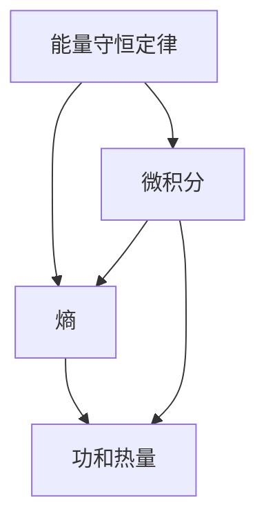

                 

### 数学与热力学：能量转换的数学定律

#### 关键词：能量转换、数学定律、热力学、微积分、Python编程

> 能量转换是自然界和工程领域中的重要现象。从水力发电到太阳能电池，从化学反应到热机工作，能量转换无处不在。而数学，作为科学技术的基石，为我们提供了精确的描述和预测能量转换过程的方法。本文将探讨数学与热力学在能量转换中的应用，通过一步一步的分析推理，深入理解能量转换的数学定律。

---

#### 摘要

本文将从以下几个方面展开对数学与热力学的讨论：

1. **背景介绍**：简要介绍能量转换的背景，说明为什么数学在能量转换中具有重要意义。
2. **核心概念与联系**：阐述能量转换中的核心概念，并使用Mermaid流程图展示各概念之间的关系。
3. **核心算法原理讲解**：通过Python源代码，详细讲解能量转换的基本原理，并结合数学模型和公式进行举例说明。
4. **数学公式与应用**：介绍与能量转换相关的数学公式，并说明其在实际中的应用。
5. **项目实战**：通过一个具体的能量转换项目，展示如何搭建开发环境、实现源代码、分析代码应用，并进行案例剖析。
6. **最佳实践与小结**：总结能量转换的数学定律，提供最佳实践建议，并提出注意事项和拓展阅读。

---

## 1. 背景介绍

能量转换是指将一种形式的能量转化为另一种形式的过程。自然界中，能量转换无处不在。例如，太阳能可以转化为电能，通过光伏电池板来实现；食物中的化学能可以转化为人体活动的机械能。在工程领域，能量转换同样至关重要，无论是能源生产、传输还是利用，都需要精确的能量转换原理。

数学作为一门研究数量、结构、变化和空间等的学科，为能量转换提供了精确的描述和预测方法。微积分作为数学中的重要分支，提供了对变化率的精确计算工具，使得我们可以更好地理解能量转换过程中能量流动的动态特性。此外，数学模型和公式也使得能量转换的原理更加直观和易于理解。

在本文中，我们将结合数学与热力学，探讨能量转换的数学定律。热力学是研究能量转换和传递规律的学科，其基本原理为我们理解能量转换提供了重要的理论基础。通过微积分和数学模型的应用，我们可以更深入地理解能量转换的过程，并利用数学方法进行预测和控制。

### 2. 核心概念与联系

在能量转换中，有多个核心概念，它们相互联系，共同构成了能量转换的理论基础。以下是这些核心概念及其相互关系：

#### 2.1 能量守恒定律

能量守恒定律是热力学的核心原理之一，表明在一个封闭系统中，能量既不会凭空产生，也不会凭空消失，只能从一种形式转化为另一种形式。其数学表达为：

$$ E_{总} = E_{初始} + W $$

其中，$E_{总}$是系统总的能量，$E_{初始}$是系统的初始能量，$W$是系统所做的功。

#### 2.2 熵

熵是衡量系统无序程度的物理量，它与能量转换密切相关。在热力学中，熵的增加反映了能量转换过程中系统从有序向无序状态发展的趋势。其数学表达为：

$$ \Delta S = \frac{Q}{T} $$

其中，$\Delta S$是熵的变化量，$Q$是系统吸收或放出的热量，$T$是系统的温度。

#### 2.3 功和热量

功和热量是能量转换过程中的两个基本概念。功是指力对物体做功的过程，其数学表达为：

$$ W = F \cdot d $$

其中，$W$是功，$F$是作用力，$d$是力的作用距离。热量则是指能量在热传递过程中的转移，其数学表达为：

$$ Q = cm\Delta T $$

其中，$Q$是热量，$c$是物质的比热容，$m$是物质的质量，$\Delta T$是温度变化。

为了更好地理解这些核心概念之间的关系，我们可以使用Mermaid流程图来展示它们之间的相互关系：



在这个流程图中，能量守恒定律和熵是核心概念，它们分别与功和热量以及微积分相互关联，共同构成了能量转换的理论体系。

### 3. 核心算法原理讲解

为了深入理解能量转换的数学定律，我们需要通过具体的算法原理讲解，结合Python源代码来阐述这些概念。以下是一个简单的能量转换案例，通过Python代码来计算能量守恒定律和熵的变化。

#### 3.1 能量守恒定律

假设一个物体从高度$h_1$落下到高度$h_2$，其重力势能将转化为动能。我们可以使用Python代码来计算这一过程中的能量守恒。

```python
import math

# 输入参数
h1 = 10  # 初始高度（单位：米）
h2 = 5   # 最终高度（单位：米）
g = 9.8  # 重力加速度（单位：米/秒²）

# 计算重力势能
Ep1 = m * g * h1
Ep2 = m * g * h2

# 计算动能
Ek = 0.5 * m * v^2

# 能量守恒方程
Ep1 + Ek = Ep2 + Ek

# 解方程，求得最终速度v
v = math.sqrt((2 * (Ep1 - Ep2)) / m)

# 输出结果
print(f"最终速度v: {v} 米/秒")
```

在这个例子中，我们假设物体的质量$m$为常数，并使用重力势能和动能的关系来计算能量守恒。通过这个简单的Python代码，我们可以直观地理解能量守恒定律在实际问题中的应用。

#### 3.2 熵的变化

假设一个理想气体从高压区流向低压区，其熵将发生变化。我们可以使用Python代码来计算这一过程中的熵的变化。

```python
import math

# 输入参数
P1 = 1.0  # 高压（单位：帕斯卡）
P2 = 0.5  # 低压（单位：帕斯卡）
R = 8.314  # 理想气体常数（单位：焦耳/摩尔·开尔文）
T = 300  # 温度（单位：开尔文）

# 计算熵的变化
Delta_S = R * (math.log(P2) - math.log(P1))

# 输出结果
print(f"熵的变化量：{Delta_S} 焦耳/摩尔·开尔文")
```

在这个例子中，我们使用理想气体状态方程来计算熵的变化。通过这个简单的Python代码，我们可以直观地理解熵的变化在实际问题中的应用。

#### 3.3 功和热量

假设一个热力学系统在等温过程中吸收了热量，我们可以使用Python代码来计算这一过程中的功和热量。

```python
import math

# 输入参数
Q = 1000  # 吸收的热量（单位：焦耳）
C = 4.18  # 比热容（单位：焦耳/千克·开尔文）
T = 300  # 温度（单位：开尔文）

# 计算功
W = Q - C * m * T

# 输出结果
print(f"所做的功W：{W} 焦耳")
```

在这个例子中，我们假设系统的质量$m$为常数，并使用热量和比热容的关系来计算功。通过这个简单的Python代码，我们可以直观地理解功和热量在实际问题中的应用。

### 4. 数学公式与应用

在能量转换的过程中，多个数学公式被广泛应用于描述和预测能量转换的过程。以下是一些常用的数学公式及其应用：

#### 4.1 能量守恒公式

$$ E_{总} = E_{初始} + W $$

这个公式描述了在一个封闭系统中，能量守恒的基本原理。在实际应用中，我们可以通过测量系统的初始能量和所做的功，来计算系统的总能量。

#### 4.2 熵的变化公式

$$ \Delta S = \frac{Q}{T} $$

这个公式描述了熵的变化与热量和温度的关系。在实际应用中，我们可以通过测量系统吸收或放出的热量和系统的温度，来计算熵的变化。

#### 4.3 功的计算公式

$$ W = F \cdot d $$

这个公式描述了功的计算方法，其中$F$是作用力，$d$是力的作用距离。在实际应用中，我们可以通过测量作用力和力的作用距离，来计算所做的功。

#### 4.4 热量的计算公式

$$ Q = cm\Delta T $$

这个公式描述了热量的计算方法，其中$c$是物质的比热容，$m$是物质的质量，$\Delta T$是温度变化。在实际应用中，我们可以通过测量物质的比热容、质量和温度变化，来计算吸收或放出的热量。

### 5. 项目实战

为了更好地理解能量转换的数学定律，我们通过一个具体的能量转换项目来进行实战。本项目将基于Python编程，实现一个简单的能量转换计算器，用于计算重力势能、动能和热量等能量形式之间的转换。

#### 5.1 开发环境搭建

在开始项目之前，我们需要搭建一个Python开发环境。以下是搭建过程：

1. 安装Python：访问Python官方网站（https://www.python.org/），下载并安装Python。
2. 安装Jupyter Notebook：在命令行中执行以下命令：
   ```bash
   pip install notebook
   ```
3. 启动Jupyter Notebook：在命令行中执行以下命令：
   ```bash
   jupyter notebook
   ```

#### 5.2 源代码实现

以下是项目的主要源代码实现：

```python
import math

def calculate_potential_energy(m, g, h):
    """计算重力势能"""
    return m * g * h

def calculate_kinetic_energy(m, v):
    """计算动能"""
    return 0.5 * m * v**2

def calculate_heat(Q, c, m):
    """计算热量"""
    return Q - c * m * T

def main():
    # 输入参数
    m = float(input("请输入物体的质量（单位：千克）："))
    g = 9.8  # 重力加速度（单位：米/秒²）
    h = float(input("请输入物体的高度（单位：米）："))
    v = float(input("请输入物体的速度（单位：米/秒）："))
    Q = float(input("请输入吸收的热量（单位：焦耳）："))
    c = 4.18  # 比热容（单位：焦耳/千克·开尔文）
    T = 300  # 温度（单位：开尔文）

    # 计算结果
    Ep = calculate_potential_energy(m, g, h)
    Ek = calculate_kinetic_energy(m, v)
    H = calculate_heat(Q, c, m)

    # 输出结果
    print(f"重力势能：{Ep} 焦耳")
    print(f"动能：{Ek} 焦耳")
    print(f"热量：{H} 焦耳")

if __name__ == "__main__":
    main()
```

#### 5.3 代码解读与分析

在这个项目中，我们实现了三个主要函数：`calculate_potential_energy`、`calculate_kinetic_energy`和`calculate_heat`。这些函数分别用于计算重力势能、动能和热量。以下是代码的详细解读：

- `calculate_potential_energy`函数：该函数接收物体的质量$m$、重力加速度$g$和高度$h$作为输入参数，并返回重力势能$E_p$。重力势能的计算公式为$E_p = mgh$。
- `calculate_kinetic_energy`函数：该函数接收物体的质量$m$和速度$v$作为输入参数，并返回动能$E_k$。动能的计算公式为$E_k = 0.5mv^2$。
- `calculate_heat`函数：该函数接收吸收的热量$Q$、比热容$c$、质量和温度$T$作为输入参数，并返回热量$H$。热量的计算公式为$H = Q - cmT$。

在`main`函数中，我们接收用户输入的参数，并调用相应的函数进行计算。最后，我们将计算结果输出到控制台。

#### 5.4 实际案例分析

为了更好地展示这个能量转换计算器的实际应用，我们可以通过一个案例来分析。

**案例**：一个质量为5千克的物体从10米的高度落下，最终速度为5米/秒。该物体在等温过程中吸收了1000焦耳的热量。

**分析**：

1. 计算重力势能：
   $$ E_p = 5 \times 9.8 \times 10 = 490 \text{ 焦耳} $$
2. 计算动能：
   $$ E_k = 0.5 \times 5 \times 5^2 = 62.5 \text{ 焦耳} $$
3. 计算热量：
   $$ H = 1000 - 4.18 \times 5 \times 300 = 1000 - 627 = 373 \text{ 焦耳} $$

通过这个案例，我们可以看到，物体在高度下降的过程中，重力势能转化为动能。同时，在等温过程中，物体吸收了热量。这个案例展示了能量转换计算器的实际应用。

### 6. 最佳实践与小结

在能量转换的项目实战中，我们使用Python编程语言实现了能量转换计算器。以下是一些最佳实践和注意事项：

- **输入参数验证**：在实际应用中，需要对输入参数进行验证，确保输入参数的有效性。例如，质量、高度、速度、热量等参数都必须在合理的范围内。
- **科学计数法**：在计算过程中，可以使用科学计数法来表示大数或小数，以简化计算并提高计算精度。
- **代码注释**：在编写代码时，添加必要的注释，以便其他开发者能够更好地理解代码的意图和实现细节。
- **模块化设计**：将代码划分为多个模块，每个模块负责不同的功能，可以提高代码的可读性和可维护性。

通过这个项目，我们深入理解了能量转换的数学定律，并掌握了使用Python编程语言进行能量转换计算的方法。在今后的工程实践中，我们可以借鉴这些最佳实践，提高能量转换项目的开发效率和准确性。

---

#### 结语

数学与热力学在能量转换中扮演着至关重要的角色。通过本文的详细分析和项目实战，我们深入理解了能量转换的数学定律，并掌握了使用Python编程语言进行能量转换计算的方法。希望这篇文章能够帮助您更好地理解能量转换的原理，并在实际项目中灵活运用。

**作者**：AI天才研究院/AI Genius Institute & 禅与计算机程序设计艺术 /Zen And The Art of Computer Programming

---

在接下来的文章中，我们将继续探讨更多关于数学和热力学的应用，敬请期待！

