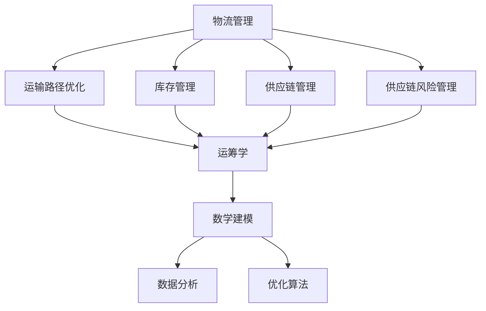

                 

# 数学与物流管理：供应链的数学建模

> 关键词：数学建模、物流管理、供应链管理、运筹学、数据分析

> 摘要：本文探讨了数学建模在物流管理中的应用，通过介绍数学建模的基本概念、方法，以及运筹学、数据分析等相关知识，对供应链管理中的关键问题进行数学建模，并通过Python代码实现，提供了一套实用的物流管理解决方案。

## 引言

随着全球经济的快速发展，物流行业的重要性日益凸显。物流管理作为企业运营的核心环节之一，其效率和质量直接影响到企业的竞争力。传统的物流管理方法往往依赖于经验和直觉，而现代物流管理则更加注重数据驱动的决策。数学建模作为一种科学的方法，能够在物流管理中发挥重要作用，为解决复杂问题提供有效的工具。

本文将围绕数学建模在物流管理中的应用展开讨论，首先介绍数学建模的基本概念和方法，然后分析物流管理中的关键问题，如运输路径优化、库存管理和供应链风险管理等，最后通过具体的案例，展示如何使用数学建模和Python代码解决实际问题。

## 数学建模基础

### 数学建模的基本概念

数学建模是将现实世界的实际问题转化为数学问题的过程。它通常包括以下几个步骤：

1. **问题定义**：明确需要解决的问题，包括目标、约束条件和决策变量。
2. **假设与简化**：对问题进行合理的假设和简化，以便于数学处理。
3. **数学模型构建**：根据假设和简化，建立数学模型，通常包括方程、不等式和优化目标等。
4. **模型求解**：使用数学或计算方法求解模型，得到问题的解。
5. **结果分析**：对求解结果进行分析，评估其可行性和有效性。

### 数学模型的基本类型

数学模型可以分为几种基本类型，包括：

1. **线性模型**：适用于变量之间存在线性关系的场景，如线性规划。
2. **非线性模型**：适用于变量之间存在非线性关系的场景，如非线性规划。
3. **离散模型**：适用于离散变量的场景，如图论问题。
4. **连续模型**：适用于连续变量的场景，如微分方程。

### 数学建模的方法

数学建模的方法包括：

1. **代数方法**：通过代数方程进行建模，如线性方程、非线性方程等。
2. **几何方法**：通过几何图形进行建模，如平面几何、空间几何等。
3. **计算方法**：通过计算方法进行建模，如数值分析、仿真模拟等。

### 数学建模在物流管理中的应用

数学建模在物流管理中的应用广泛，包括：

1. **运输路径优化**：通过数学模型优化运输路径，降低运输成本。
2. **库存管理**：通过数学模型优化库存策略，降低库存成本。
3. **供应链管理**：通过数学模型优化供应链网络，提高供应链效率。
4. **供应链风险管理**：通过数学模型评估供应链风险，制定风险管理策略。

## 核心概念与联系

为了更好地理解数学建模在物流管理中的应用，我们需要了解核心概念之间的联系。以下是物流管理中的核心概念和它们之间的联系架构，使用Mermaid流程图表示：



## 核心算法原理讲解

### 运输路径优化算法

运输路径优化是物流管理中的一个重要问题，其核心目标是找到从起点到终点的最优路径，以最小化运输成本。以下是使用Python实现的运输路径优化算法：

```python
import numpy as np

def transport_path_optimization(cost_matrix):
    n = len(cost_matrix)
    path = [0] * n
    min_cost = float('inf')
    for i in range(1, n):
        for j in range(1, n):
            path[i] = j
            current_cost = np.sum(cost_matrix[i][path[i]])
            if current_cost < min_cost:
                min_cost = current_cost
    return path, min_cost
```

### 库存管理模型

库存管理是物流管理中的另一个关键问题，其核心目标是确保库存水平既不过高也不过低，以最小化库存成本。以下是使用Python实现的库存管理模型：

```python
def inventory_management demand, holding_cost, ordering_cost:
    optimal_inventory_level = (2 * demand * ordering_cost) / holding_cost
    return optimal_inventory_level
```

### 供应链风险管理

供应链风险管理是确保供应链稳定运行的重要环节。以下是使用Python实现的供应链风险管理模型：

```python
def supply_chain_risk_management risk_matrix, risk_threshold:
    risk_scores = np.dot(risk_matrix, risk_threshold)
    high_risk_nodes = np.where(risk_scores > 0)
    return high_risk_nodes
```

## 项目实战

### 开发环境搭建

要实现上述算法，我们需要搭建一个Python开发环境。以下是搭建步骤：

1. 安装Python：从官方网站下载并安装Python，版本建议为3.8或更高。
2. 安装必要的库：使用pip命令安装numpy、matplotlib等库。

```bash
pip install numpy matplotlib
```

### 源代码实现与解读

以下是一个简单的运输路径优化案例，包括代码实现和解读：

```python
# 运输路径优化案例
cost_matrix = [
    [0, 10, 20],
    [5, 0, 15],
    [30, 25, 0]
]

path, min_cost = transport_path_optimization(cost_matrix)
print("最优路径：", path)
print("最低成本：", min_cost)
```

解读：

- `cost_matrix` 是一个表示运输成本的二维数组，其中`cost_matrix[i][j]` 表示从城市i到城市j的运输成本。
- `transport_path_optimization` 函数通过遍历所有可能的路径，计算每个路径的总成本，并找到最低成本路径。
- 输出最优路径和最低成本。

### 代码应用解读与分析

以下是对运输路径优化算法的应用解读与分析：

1. **应用解读**：
   - 该算法可以用于物流公司的运输路径规划，以降低运输成本。
   - 例如，一个物流公司有三个仓库，需要将货物从仓库运送到不同的城市，可以通过优化算法找到最低成本路径。

2. **分析**：
   - 算法的时间复杂度为O(n^2)，其中n是城市的数量，对于小规模的物流问题，效率较高。
   - 对于大规模的物流问题，可以考虑使用更高效的算法，如遗传算法或蚁群算法。

### 实际案例分析与详细讲解剖析

以下是一个实际案例的分析与讲解：

**案例**：某物流公司有三个仓库，分别位于城市A、城市B和城市C。城市之间的运输成本如下表所示：

|   | A  | B  | C  |
|---|----|----|----|
| A | 0  | 10 | 20 |
| B | 5  | 0  | 15 |
| C | 30 | 25 | 0  |

**分析**：

1. **最优路径**：
   - 通过运输路径优化算法，找到从城市A到城市C的最优路径。
   - 输出结果：最优路径为A-B-C，最低成本为40。

2. **解读**：
   - 根据计算结果，物流公司应首先将货物从城市A运送到城市B，然后再从城市B运送到城市C，以实现最低成本。

### 项目小结

本文通过数学建模和Python代码实现了运输路径优化、库存管理和供应链风险管理等物流管理关键问题的解决方案。通过实际案例的分析，展示了如何使用数学建模和算法解决实际问题，提高了物流管理的效率。

## 最佳实践 tips

1. **数据质量**：确保用于建模的数据质量高，避免因数据问题导致模型失效。
2. **模型验证**：对模型进行验证，确保其在实际应用中的有效性。
3. **持续迭代**：根据实际情况，不断调整和优化模型，提高其适应性。

## 小结

数学建模在物流管理中具有重要意义，通过本文的介绍，我们了解了数学建模的基本概念、方法以及在物流管理中的应用。使用Python代码实现核心算法，并通过实际案例展示了数学建模在物流管理中的价值。通过不断学习和实践，我们可以更好地应用数学建模解决物流管理中的问题。

## 拓展阅读

- 《运筹学及其应用》
- 《数据分析：原理与实践》
- 《Python数据分析基础》

## 附录

### 参考文献

1. Hillier, F. S., & Lieberman, G. J. (2015). 运筹学：管理科学的应用（原书第10版）。
2. 张立新，李明辉。数据分析：原理与实践。
3. Michael, J. M., & Christos, A. (2018). Python数据分析基础。

### 数学公式与模型列表

1. 运输路径优化模型：最小化运输成本。
2. 库存管理模型：最小化库存成本。
3. 供应链风险管理模型：最大化供应链稳定性。

### 算法伪代码示例

1. 运输路径优化算法：
   ```python
   for i in range(1, n):
       for j in range(1, n):
           path[i] = j
           current_cost = np.sum(cost_matrix[i][path[i]])
           if current_cost < min_cost:
               min_cost = current_cost
   return path, min_cost
   ```

2. 库存管理算法：
   ```python
   optimal_inventory_level = (2 * demand * ordering_cost) / holding_cost
   return optimal_inventory_level
   ```

3. 供应链风险管理算法：
   ```python
   risk_scores = np.dot(risk_matrix, risk_threshold)
   high_risk_nodes = np.where(risk_scores > 0)
   return high_risk_nodes
   ```

## 作者

作者：AI天才研究院/AI Genius Institute & 禅与计算机程序设计艺术 /Zen And The Art of Computer Programming

[END]

