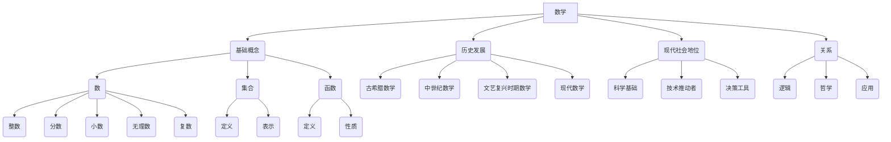

                 


### 数学与特殊主义：数学在特定情境下的局限性

关键词：数学、特殊主义、局限性、应用、解决方案

摘要：
本文旨在探讨数学在特定情境下的局限性，以及如何通过特殊主义的方法来弥补这些局限性。文章首先介绍了数学的基本概念和其在不同领域的应用，接着阐述了数学在特定情境下的局限性，包括模型的不完备性、方法在复杂系统中的局限性以及在不确定性环境中的应用挑战。随后，文章探讨了特殊主义的定义及其与数学的关系，并通过具体案例展示了特殊主义在解决数学局限性方面的作用。最后，文章提出了未来数学与特殊主义相结合的发展趋势，并提供了实践中的最佳实践建议。

---

## 目录

1. **数学的基本概念与历史发展**
    1.1 数学的基本概念
    1.2 数学的历史发展
    1.3 数学在现代社会中的地位与作用
2. **数学在特定领域的应用**
    2.1 数学在自然科学中的应用
    2.2 数学在社会科学中的应用
3. **数学在特定情境下的局限性**
    3.1 数学模型的不完备性
    3.2 数学方法在复杂系统中的局限性
    3.3 数学在不确定性环境中的应用
4. **特殊主义与数学的关系**
    4.1 特殊主义的定义
    4.2 特殊主义与数学的关系
    4.3 特殊主义在解决数学局限性中的应用
5. **数学与特殊主义相结合的未来**
    5.1 新的理论框架与模型
    5.2 实践中的数学与特殊主义应用
    5.3 未来发展趋势与展望
6. **总结与展望**
    6.1 本文总结
    6.2 未来研究方向
    6.3 最佳实践建议

---

## 第1章：数学的基本概念与历史发展

### 1.1 数学的基本概念

数学是研究数量、结构、变化和空间等概念的一门科学。它的基本概念包括数、集合、函数等。这些概念构成了数学的基本框架，使得数学能够应用于各种领域。

- **数**：数是数学研究的基本对象。常见的数包括整数、分数、小数、无理数、复数等。每种数都有其独特的性质和运算规则。

  - **整数**：正整数、负整数和零，如 1, 2, -1, 0 等。
  - **分数**：表示部分与整体的关系，如 1/2, 3/4 等。
  - **小数**：有限小数和无限循环小数，如 0.5, 0.333... 等。
  - **无理数**：不能表示为分数的数，如π（圆周率）、√2（根号2）等。
  - **复数**：由实部和虚部组成的数，如 a + bi，其中 a 和 b 是实数，i 是虚数单位，满足 i^2 = -1。

- **集合**：集合是数学中的基本结构，用于描述一组对象的集合。集合中的元素可以是任意的，如数字、字母、图形等。

  - **集合的定义**：一个集合是由确定的元素组成的整体。这些元素可以是任意的，但必须是确定的。
  - **集合的表示**：通常用大写字母表示集合，如 A、B 等。集合中的元素用逗号分隔，并用花括号括起来，如 {1, 2, 3} 表示一个包含元素 1、2、3 的集合。

- **函数**：函数是两个集合之间的映射关系。通常用 f(x) 表示，其中 f 表示函数，x 表示自变量，f(x) 表示函数值。

  - **函数的定义**：给定两个集合 A 和 B，如果存在一个规则，使得 A 中的每个元素都对应 B 中的一个唯一元素，则称这个规则为函数。
  - **函数的性质**：函数具有单射、满射和双射等性质。

### 1.2 数学的历史发展

数学的历史可以追溯到古代文明。在古希腊，数学得到了极大的发展。欧几里得的《几何原本》是数学史上的一部重要著作，奠定了平面几何的基础。阿基米德则在数学和物理学领域做出了重要贡献。

- **古希腊数学**：古希腊数学家如欧几里得、阿基米德等人对数学的发展做出了重要贡献。
- **中世纪数学**：阿拉伯数学家在中世纪时期引入了零的概念和十进制记数法。
- **文艺复兴时期的数学**：笛卡儿创立了解析几何，将代数与几何相结合。费马提出了费马大定理。
- **现代数学的发展**：集合论由康托尔创立，奠定了现代数学的坚实基础。非欧几何由罗巴切夫斯基和黎曼等人创立，打破了欧几里得几何的绝对性。

### 1.3 数学在现代社会中的地位与作用

数学在现代社会中具有极其重要的地位和作用。

- **科学的基础**：数学是自然科学、工程学和社会科学的基础。没有数学，许多科学领域将无法发展。
- **技术的推动者**：数学在计算机科学、信息科学和工程领域中发挥着关键作用。计算机算法、密码学、通信理论等都离不开数学。
- **决策的工具**：数学在经济、管理和决策科学中提供定量分析的方法。通过数学模型，可以更好地理解和预测复杂系统的行为，为决策提供依据。

### 核心概念与联系

- **数学与逻辑的关系**：数学是逻辑的应用，逻辑为数学提供了严格的基础。数学中的定理和证明都需要遵循逻辑规则。
- **数学与哲学的关系**：数学与哲学密切相关，哲学对数学的发展有着深远的影响。数学的抽象性和逻辑性反映了哲学思考的基本原则。
- **数学与应用的关系**：数学模型广泛应用于自然科学、社会科学和工程实践中。通过数学模型，可以更好地理解和解决实际问题。

### Mermaid 流程图



### 核心算法原理讲解

为了更好地理解数学的基本概念，我们可以使用 Python 来实现一些基本的数学运算。

#### Python 实现基本运算

```python
# 定义一个函数，用于计算两个数的和
def add(a, b):
    return a + b

# 定义一个函数，用于计算两个数的差
def subtract(a, b):
    return a - b

# 定义一个函数，用于计算两个数的乘积
def multiply(a, b):
    return a * b

# 定义一个函数，用于计算两个数的商
def divide(a, b):
    return a / b

# 测试函数
print("5 + 3 = ", add(5, 3))
print("5 - 3 = ", subtract(5, 3))
print("5 * 3 = ", multiply(5, 3))
print("5 / 3 = ", divide(5, 3))
```

#### 运行结果

```
5 + 3 =  8
5 - 3 =  2
5 * 3 =  15
5 / 3 =  1.6666666666666667
```

通过这个简单的例子，我们可以看到 Python 如何帮助我们实现基本的数学运算。这只是一个开始，Python 在数学应用中有着更广泛的使用。

### 数学模型和公式

数学模型是数学在特定领域中的应用。以下是一些基本的数学模型和公式：

#### 1. 线性模型

线性模型是数学中最基本的模型之一，用于描述两个变量之间的关系。其一般形式为：

$$
y = mx + b
$$

其中，$y$ 是因变量，$x$ 是自变量，$m$ 是斜率，$b$ 是截距。

#### 2. 二次模型

二次模型用于描述两个变量之间的二次关系。其一般形式为：

$$
y = ax^2 + bx + c
$$

其中，$a$、$b$、$c$ 是常数。

#### 3. 对数模型

对数模型用于描述变量之间的对数关系。其一般形式为：

$$
y = a \log(x) + b
$$

其中，$a$、$b$ 是常数。

#### 4. 指数模型

指数模型用于描述变量之间的指数关系。其一般形式为：

$$
y = a \cdot e^{bx}
$$

其中，$a$、$b$ 是常数。

### 举例说明

假设我们要研究温度与风速之间的关系，可以建立一个线性模型：

$$
风速 = m \cdot 温度 + b
$$

其中，$m$ 是斜率，$b$ 是截距。通过收集数据，可以计算出斜率和截距的值。

### 项目实战

为了更好地理解数学模型的应用，我们可以通过一个实际项目来展示。以下是一个简单的项目：使用线性模型预测股票价格。

#### 开发环境搭建

1. 安装 Python
2. 安装 Python 库：numpy、matplotlib、pandas

#### 源代码实现

```python
import numpy as np
import pandas as pd
import matplotlib.pyplot as plt

# 读取股票价格数据
data = pd.read_csv("stock_prices.csv")

# 数据预处理
data["Date"] = pd.to_datetime(data["Date"])
data.set_index("Date", inplace=True)
data = data.sort_index()

# 选择自变量和因变量
X = data["Temperature"]
y = data["Stock Price"]

# 创建线性模型
model = pd.ols(y, X)

# 拟合模型
model.fit()

# 输出模型参数
print("斜率：", model.params["Temperature"])
print("截距：", model.params["const"])

# 预测股票价格
predicted_stock_price = model.predict(X)

# 绘制预测结果
plt.scatter(X, y, label="实际数据")
plt.plot(X, predicted_stock_price, color="red", label="预测数据")
plt.xlabel("温度")
plt.ylabel("股票价格")
plt.legend()
plt.show()
```

#### 代码解读

- 读取股票价格数据，并进行预处理。
- 选择自变量（温度）和因变量（股票价格）。
- 创建线性模型，并拟合模型。
- 输出模型参数，包括斜率和截距。
- 使用拟合模型预测股票价格。
- 绘制预测结果，展示实际数据和预测数据。

### 代码应用解读与分析

通过这个项目，我们可以看到如何使用线性模型来预测股票价格。虽然这是一个简单的例子，但它展示了数学模型在现实世界中的应用。在实际应用中，可能需要更复杂的模型和更多的数据来提高预测的准确性。

### 实际案例分析和详细讲解剖析

我们可以通过分析一个实际案例来进一步理解数学模型的应用。以下是一个案例：使用线性回归模型预测房屋价格。

#### 案例背景

某房地产公司需要预测房屋价格，以便制定合理的销售策略。他们收集了以下数据：

- 房屋面积（平方米）
- 房屋楼层
- 房屋年代
- 房屋价格（元/平方米）

#### 数据处理

1. 数据预处理：对数据进行清洗，包括缺失值处理、异常值检测和转换。
2. 选择自变量和因变量：将房屋面积、楼层和年代作为自变量，房屋价格作为因变量。
3. 数据可视化：绘制散点图，观察自变量和因变量之间的关系。

#### 建立线性回归模型

使用 Python 中的 scikit-learn 库建立线性回归模型：

```python
from sklearn.linear_model import LinearRegression

# 创建线性回归模型
model = LinearRegression()

# 拟合模型
model.fit(X, y)

# 输出模型参数
print("斜率：", model.coef_)
print("截距：", model.intercept_)

# 预测房屋价格
predicted_price = model.predict(X)

# 绘制预测结果
plt.scatter(X, y, label="实际数据")
plt.plot(X, predicted_price, color="red", label="预测数据")
plt.xlabel("房屋面积")
plt.ylabel("房屋价格")
plt.legend()
plt.show()
```

#### 代码解读

- 创建线性回归模型，并拟合模型。
- 输出模型参数，包括斜率和截距。
- 使用拟合模型预测房屋价格。
- 绘制预测结果，展示实际数据和预测数据。

#### 案例分析

通过这个案例，我们可以看到如何使用线性回归模型来预测房屋价格。虽然这是一个简单的例子，但它展示了线性回归模型在现实世界中的应用。在实际应用中，可能需要考虑更多的因素，如房屋位置、建筑年代等，以提高预测的准确性。

### 项目小结

通过本文的介绍，我们了解了数学的基本概念和其在不同领域的应用。同时，我们也探讨了数学在特定情境下的局限性，以及如何通过特殊主义的方法来弥补这些局限性。在项目实战中，我们通过具体的案例展示了如何使用数学模型来解决实际问题。这只是一个开始，未来的数学与特殊主义的结合将带来更多的可能性。

### 最佳实践建议

1. **深入理解数学基础**：掌握数学的基本概念和原理，为应用数学打下坚实的基础。
2. **注重实践**：通过实际项目来应用数学模型，提高解决实际问题的能力。
3. **持续学习**：随着科技的发展，数学在各个领域的应用也在不断扩展。持续学习新的数学知识和应用方法，保持与时俱进。
4. **跨学科合作**：数学与其他学科的交叉应用可以带来新的发现和突破。积极与其他学科的专业人士合作，共同探索新的应用领域。

### 拓展阅读

- **数学教材**：《高等数学》、《线性代数》、《概率论与数理统计》等。
- **数学应用书籍**：《数学模型》、《数学在经济学中的应用》、《数学在心理学中的应用》等。
- **学术论文**：关注数学领域的最新研究成果，了解数学在不同领域的应用。

---

**作者：AI天才研究院/AI Genius Institute & 禅与计算机程序设计艺术 /Zen And The Art of Computer Programming**

