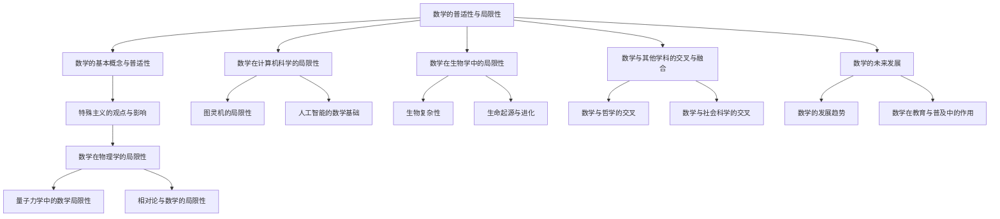

                 

### 数学与特殊主义：数学在特定领域的局限性

#### 关键词：数学、特殊主义、局限性、物理学、计算机科学、生物学、交叉学科

> 数学是一门博大精深的科学，它不仅在我们的日常生活中有着广泛的应用，还在物理学、计算机科学、生物学等多个领域发挥着关键作用。然而，正如任何科学工具都有其局限性一样，数学在某些特定领域的应用也面临诸多挑战。本文将探讨数学的普适性与局限性，重点分析数学在物理学、计算机科学和生物学中的局限性，同时探讨数学与其他学科的交叉与融合，以及数学的未来发展趋势。通过这一步步的分析，我们旨在揭示数学在特定领域的局限性，并展望数学在未来发展中的可能性。

#### 摘要：

本文旨在探讨数学的普适性与局限性，特别是在物理学、计算机科学和生物学等特定领域的应用。首先，我们将回顾数学的基本概念及其在各领域的应用。接着，深入分析数学在这些领域中的局限性，包括宇宙的量子性质、物理学的未解问题、图灵机的局限性、人工智能的数学基础、生物复杂性以及生命起源与进化。随后，我们将探讨数学与其他学科的交叉与融合，特别是哲学和社会科学中的数学应用。最后，本文将展望数学的未来发展，包括其发展趋势、教育普及方法以及数学在未来的应用领域。通过这一步步的分析，我们希望揭示数学的局限性和潜力，为读者提供对数学更全面的理解。

#### 目录：

1. **数学的普适性与局限性**  
   1.1 数学的基本概念  
   1.2 数学在各个领域的应用

2. **特殊主义的观点与影响**  
   2.1 特殊主义的定义  
   2.2 特殊主义的历史与发展

3. **数学在物理学的局限性**  
   3.1 量子力学中的数学局限性  
   3.2 相对论与数学的局限性

4. **数学在计算机科学的局限性**  
   4.1 图灵机的局限性  
   4.2 人工智能的数学基础

5. **数学在生物学中的局限性**  
   5.1 生物复杂性  
   5.2 生命起源与进化

6. **数学与其他学科的交叉与融合**  
   6.1 数学与哲学的交叉  
   6.2 数学与社会科学的交叉

7. **数学的未来发展**  
   7.1 数学的发展趋势  
   7.2 数学在教育与普及中的作用

8. **结论**

---

#### 1. 数学的基本概念与普适性

数学是一门基于逻辑和抽象概念的学科，它通过对现实世界的数量关系、结构关系和变化关系的抽象和描述，为人类提供了一种精确、严格的思维方式。数学的基本概念包括数、函数、集合、几何等，这些概念构成了数学的基础，并广泛应用于各个领域。

**数学的基本概念：**

- **数**：数是数学中最基本的元素，用来表示事物的数量。数可以分为自然数、整数、有理数、无理数等。

- **函数**：函数是一种将一个集合中的元素映射到另一个集合中的元素的关系。函数可以用来描述各种现象的变化规律。

- **集合**：集合是一组无序的、互异的元素的整体。集合可以用来描述事物的分类和组合。

- **几何**：几何是研究空间结构和形状的数学分支。几何概念包括点、线、面、体等。

**数学的普适性：**

数学之所以能够广泛应用于各个领域，主要得益于其普适性和抽象性。数学的普适性表现在以下几个方面：

1. **逻辑严密**：数学采用严密的逻辑推理方式，使得数学结论具有高度的可靠性和普遍性。

2. **抽象性**：数学通过抽象和概括，将现实世界中的复杂现象简化为数学模型，从而提高了数学应用的广泛性和灵活性。

3. **跨学科应用**：数学不仅在自然科学、工程技术领域有广泛应用，还在社会科学、人文科学等领域发挥着重要作用。

**数学在各领域的应用：**

1. **物理学**：数学在物理学中的应用主要体现在描述物理现象和建立物理模型。例如，牛顿力学、电磁学、量子力学等。

2. **计算机科学**：数学在计算机科学中的应用十分广泛，包括算法设计、数据结构、计算机网络、人工智能等。

3. **生物学**：数学在生物学中的应用主要体现在生物统计、生物信息学、生态学等。

4. **经济学**：数学在经济学中的应用主要体现在宏观经济模型、微观经济模型、金融工程等。

5. **社会科学**：数学在社会科学中的应用主要体现在社会学、心理学、政治学等领域。

---

#### 2. 特殊主义的观点与影响

在探讨数学的局限性之前，我们需要先了解什么是特殊主义。特殊主义是一种哲学观点，主张在特定领域内，真理和价值具有独特性，不能简单地从其他领域移植或借鉴。特殊主义的观点对于数学在特定领域的应用有着重要的影响。

**特殊主义的定义：**

特殊主义认为，每个领域都有其独特的本质和规律，这些规律和本质不能简单地用其他领域的知识来解释或移植。特殊主义强调领域特定性的重要性，主张在特定领域内进行深入研究和探索。

**特殊主义的历史与发展：**

特殊主义的思想可以追溯到古希腊哲学家亚里士多德。亚里士多德认为，每个学科都有其独特的目的和方法，不能简单地将一个领域的知识应用到另一个领域。这种思想在后来的哲学、科学发展中得到了进一步的发展。

在20世纪，特殊主义在科学哲学中得到了广泛的应用。科学哲学家托马斯·库恩提出了“范式转换”理论，认为科学的发展是通过一系列的范式转换实现的，每个范式都有其特定的理论和方法。库恩的理论强调了科学领域的特殊性，对数学的发展产生了重要影响。

**特殊主义对数学的影响：**

特殊主义对数学的影响主要体现在以下几个方面：

1. **领域特定性**：特殊主义主张在数学领域中，不能简单地从其他学科移植或借鉴理论和方法。这要求数学家在研究问题时，必须从数学自身的角度出发，探索数学规律和本质。

2. **数学独立性的强化**：特殊主义认为数学是一门独立的学科，其目的在于探索数学自身的规律和本质。这加强了数学的独立性，使得数学家在研究问题时更加注重数学自身的特点。

3. **数学哲学的兴起**：特殊主义促进了数学哲学的发展。数学哲学家开始探讨数学的本质、数学知识的基础等问题，为数学的发展提供了新的视角。

---

通过以上两节，我们了解了数学的基本概念和普适性，以及特殊主义的观点与影响。在下一节中，我们将深入探讨数学在物理学、计算机科学和生物学中的局限性，进一步揭示数学在这些领域中的应用挑战。

#### 3. 数学在物理学的局限性

物理学是一门研究自然界基本规律的科学，而数学则是物理学的重要工具。数学在物理学中的应用极为广泛，从经典力学到量子力学，从热力学到相对论，数学模型和公式无处不在。然而，正如任何科学工具都有其局限性一样，数学在物理学中也有其无法克服的局限性。

**量子力学中的数学局限性**

量子力学是研究微观粒子行为的物理学分支，其基本原理与经典物理学有显著差异。量子力学中的概率性和叠加性使得传统的数学工具难以准确描述量子现象。具体来说，以下几个方面体现了数学在量子力学中的局限性：

1. **概率论的应用**：量子力学中的观测结果具有概率性，这意味着我们不能精确预测单个粒子的行为，而只能给出其在某个状态下出现的概率。概率论作为数学的一个分支，虽然可以处理不确定事件，但在量子力学中，概率论的应用仍然受到限制。

2. **波函数的解析**：在量子力学中，波函数描述了粒子的状态。波函数的解析形式与粒子的物理行为密切相关。然而，许多波函数无法用解析方法精确求解，只能通过数值计算或近似方法得到。这使得数学在量子力学中的应用面临挑战。

3. **量子纠缠**：量子纠缠是量子力学中的一种特殊现象，两个或多个粒子之间存在非局域的关联。这种关联无法用经典数学的因果律来解释，使得数学在处理量子纠缠问题时面临困难。

**相对论与数学的局限性**

相对论是研究高速运动物体和引力场的基本规律的理论，分为广义相对论和狭义相对论。相对论与数学的关系非常紧密，但同样也存在数学局限性：

1. **微分几何的应用**：广义相对论使用了微分几何中的概念，如曲率、张量等，来描述引力和时空结构。然而，微分几何的复杂性使得数学在处理复杂引力场问题时面临挑战。

2. **数学模型的精确性**：相对论中的数学模型，如爱因斯坦场方程，描述了引力场和物质分布之间的关系。然而，这些模型在极端条件下可能失效，例如黑洞内部或宇宙大爆炸初期。这些极端情况下的数学模型精确性尚无法保证。

3. **宇宙的无限性**：相对论中的宇宙模型涉及无限大的时空。然而，数学在处理无限大或无限小的问题时存在局限性，例如无穷级数和测不准原理等。

**数学在物理学局限性对科学发展的挑战**

数学在物理学中的局限性对科学的发展提出了挑战：

1. **新理论的探索**：数学的局限性促使物理学家不断探索新的理论和方法，以克服这些局限性。例如，弦理论和量子场论试图统一量子力学和相对论，但至今仍未取得实质性突破。

2. **交叉学科的发展**：数学的局限性促使物理学与其他学科（如数学、计算机科学、生物学等）的交叉融合。这种交叉融合不仅推动了物理学的发展，也促进了其他学科的创新。

3. **理论的验证**：数学的局限性要求物理学家对理论进行严格的验证。通过实验和观测，物理学家不断验证理论的正确性和适用范围，从而推动物理学的发展。

通过以上分析，我们可以看到，数学在物理学中有着重要的应用，但同样也存在着局限性。这些局限性不仅挑战了数学本身的发展，也为物理学的发展带来了新的机遇。在下一节中，我们将继续探讨数学在计算机科学和生物学中的局限性。

#### 4. 数学在计算机科学的局限性

计算机科学作为一门研究计算机及其应用的科学，离不开数学的支持。数学在计算机科学中的应用极其广泛，从算法分析、数据结构到密码学、人工智能，数学模型和理论无处不在。然而，数学在计算机科学中也面临着一些无法回避的局限性。

**图灵机的局限性**

图灵机是艾伦·图灵在20世纪30年代提出的抽象计算模型，它是现代计算机科学的理论基础。然而，图灵机作为一种理想化的模型，也存在一定的局限性：

1. **无穷存储空间的假设**：图灵机假设有一个无限的存储带，可以用来存储无限的数据。但在实际计算机中，存储空间是有限的，无法达到图灵机的假设条件。这意味着在某些情况下，图灵机无法模拟实际计算机的行为。

2. **计算效率的局限性**：图灵机的计算过程是逐步进行的，每一步都依赖于之前的计算结果。这种计算方式在某些复杂问题上可能导致计算效率低下。例如，对于某些NP完全问题，即使使用高效的算法，也需要指数级别的时间复杂度才能解决。

3. **并行计算的局限性**：图灵机是一个串行计算模型，它无法有效地处理并行计算问题。在实际应用中，许多问题可以通过并行计算来提高效率，但图灵机无法直接支持这种计算方式。

**人工智能的数学基础**

人工智能（AI）是计算机科学的一个重要分支，它旨在使计算机具备人类智能。人工智能的发展离不开数学的支持，但数学在人工智能中也存在一些局限性：

1. **数据依赖性**：许多人工智能算法，如深度学习，依赖于大量训练数据。然而，在实际应用中，获取大量高质量的数据可能非常困难。此外，数据的质量和多样性也会影响算法的性能。

2. **过拟合问题**：在人工智能中，过拟合是一个常见问题。过拟合是指模型在训练数据上表现良好，但在未知数据上表现不佳。这是由于模型过于复杂，无法很好地泛化到新的数据上。数学在处理过拟合问题时面临挑战。

3. **不确定性处理**：人工智能算法通常基于确定性的数学模型，但在现实世界中，许多问题存在不确定性。如何有效地处理不确定性问题是人工智能发展中的一大挑战。

**数学在计算机科学局限性对AI发展的挑战**

数学在计算机科学中的局限性对人工智能的发展提出了挑战：

1. **算法优化**：为了克服数学的局限性，计算机科学家不断优化算法，提高计算效率。例如，针对图灵机的局限性，提出了各种并行计算模型和算法，以提高计算效率。

2. **理论创新**：数学的局限性促使计算机科学家探索新的理论和方法。例如，在处理不确定性问题时，计算机科学家提出了概率图模型、贝叶斯网络等新的理论。

3. **跨学科合作**：数学的局限性也促进了计算机科学与其他学科的交叉融合。例如，数学与认知科学、神经科学、心理学等领域的交叉研究，为人工智能的发展提供了新的视角。

4. **应用场景扩展**：数学的局限性要求人工智能算法在实际应用中不断扩展其适用范围。例如，在自动驾驶、医疗诊断、金融分析等领域，人工智能算法需要适应各种复杂和不确定的环境。

通过以上分析，我们可以看到，数学在计算机科学中有着重要的应用，但同样也存在着局限性。这些局限性不仅挑战了数学本身的发展，也为计算机科学和人工智能的发展带来了新的机遇。在下一节中，我们将探讨数学在生物学中的应用及其局限性。

#### 5. 数学在生物学中的局限性

生物学是一门研究生命现象和生物体的学科，数学在生物学中的应用越来越广泛，从基因组学、生态学到神经科学，数学模型和理论无处不在。然而，数学在生物学中同样面临一些无法回避的局限性。

**生物复杂性的挑战**

生物复杂性是指生物系统内部的复杂结构和相互作用。生物复杂性使得数学在生物学中的应用面临巨大挑战：

1. **系统规模的庞大**：生物系统通常包含大量相互作用和反馈机制，这使得数学模型在描述和模拟生物系统时面临巨大挑战。例如，基因组学研究中涉及数百万个基因和它们的相互作用，生态学研究中涉及成千上万的物种和它们之间的复杂关系。

2. **非线性动力学**：生物系统中的许多过程是非线性的，这意味着它们的行为难以用简单的线性模型来描述。非线性动力学导致生物系统的行为具有不确定性和多样性，这使得数学模型在预测和模拟生物系统时面临困难。

3. **参数的不确定性**：生物系统的数学模型通常需要大量的参数来描述其行为。然而，这些参数往往难以准确测量，存在很大的不确定性。参数的不确定性使得数学模型的预测精度受到限制。

**生命起源与进化的局限性**

生命起源和进化是生物学研究的重要课题，数学在解释这些现象中也存在局限性：

1. **概率论的局限性**：生命起源和进化过程中涉及大量的随机事件，概率论是描述这些事件的有力工具。然而，概率论在处理极低概率事件时存在局限性，例如，在生命起源过程中，某些关键分子形成的概率可能极低，但并不意味着这些事件不可能发生。

2. **信息论的应用**：信息论提供了一种描述和量化信息的方法，它在生物学中有着广泛的应用，例如在基因组学和神经科学中。然而，信息论的局限性在于它主要关注信息的传递和变换，而无法解释信息的本质和起源。

3. **进化算法的局限性**：进化算法是模拟生物进化过程的一种计算模型，它在优化问题和机器学习中有着广泛应用。然而，进化算法在处理大规模、高维度问题时存在计算效率低下的问题，这使得它在生物学中的应用受到限制。

**数学在生物学局限性对科学发展的挑战**

数学在生物学中的局限性对科学的发展提出了挑战：

1. **跨学科合作**：为了克服数学的局限性，生物学家需要与数学家、物理学家、计算机科学家等其他领域的科学家进行跨学科合作，共同探索新的理论和方法。

2. **实验技术的进步**：数学的局限性也促使生物学家不断改进实验技术，提高测量精度和实验效率。例如，基因组测序技术的进步使得生物学家能够更准确地测量基因表达水平。

3. **理论模型的改进**：生物学家需要不断改进和完善数学模型，以更好地描述和预测生物系统的行为。这包括开发新的数学模型和改进现有模型，以提高其预测精度和应用范围。

4. **人工智能的应用**：人工智能技术在生物学中的应用为克服数学的局限性提供了新的机遇。例如，深度学习和机器学习算法可以用于分析和解释复杂的生物数据，从而提高生物学研究的效率和准确性。

通过以上分析，我们可以看到，数学在生物学中有着重要的应用，但同样也存在着局限性。这些局限性不仅挑战了数学本身的发展，也为生物学的研究提供了新的机遇。在下一节中，我们将探讨数学与其他学科的交叉与融合。

#### 6. 数学与其他学科的交叉与融合

数学作为一门基础学科，不仅在自然科学、工程技术领域有着广泛应用，还与其他学科如哲学、社会科学等有着广泛的交叉与融合。这种交叉与融合不仅拓宽了数学的应用领域，也为其他学科的发展提供了新的思路和工具。

**数学与哲学的交叉**

数学与哲学的关系可以追溯到古希腊时期，亚里士多德等哲学家对数学的基本概念和原理进行了深入的探讨。在现代，数学与哲学的交叉主要体现在以下几个方面：

1. **数学哲学**：数学哲学关注数学的本质、数学知识的来源和数学证明的有效性等问题。例如，数学家哥德尔的不完备性定理和数学逻辑学家希尔伯特的证明论等，都为数学哲学提供了深刻的见解。

2. **哲学论证中的数学应用**：在哲学论证中，数学方法被广泛应用于逻辑推理和证明。例如，哲学家维特根斯坦在其著作《逻辑哲学论》中，运用了数学的概念和方法来探讨语言和现实的本质关系。

**数学与社会科学的交叉**

数学在社会科学中的应用越来越广泛，从经济学、心理学到政治学，数学模型和理论为这些学科提供了强大的分析工具。数学与社会科学的交叉主要体现在以下几个方面：

1. **经济学**：数学在经济学中的应用主要体现在宏观经济模型、微观经济模型和金融工程等领域。例如，一般均衡理论和资本资产定价模型等，都是数学在经济学中的重要应用。

2. **心理学**：数学在心理学中的应用主要体现在统计分析和心理测量等领域。例如，心理统计方法用于分析心理实验数据，心理测量理论用于构建心理量表和评估个体心理特征。

3. **政治学**：数学在政治学中的应用主要体现在选举模型、博弈理论和公共政策分析等领域。例如，投票理论用于分析选举结果，博弈理论用于研究国家间的冲突与合作。

**数学交叉与融合的影响**

数学与其他学科的交叉与融合对科学的发展产生了深远的影响：

1. **知识拓展**：数学与其他学科的交叉与融合使得不同学科的知识得以互相借鉴和融合，从而拓宽了科学家的研究视野，促进了科学知识的拓展。

2. **方法创新**：数学与其他学科的交叉与融合促使科学家探索新的研究方法和技术，从而推动了科学方法的发展和创新。

3. **跨学科合作**：数学与其他学科的交叉与融合促进了跨学科合作，不同学科的科学家共同探索复杂问题，从而提高了科学研究的效率和成果。

4. **应用扩展**：数学与其他学科的交叉与融合使得数学的应用范围得到了极大的扩展，数学不仅应用于自然科学和工程技术领域，还广泛应用于社会科学、人文科学等领域。

总之，数学与其他学科的交叉与融合为科学的发展提供了新的机遇和挑战。通过这种交叉与融合，数学不仅得到了进一步的发展，也为其他学科的创新提供了强大的工具和思路。在下一节中，我们将探讨数学的未来发展。

#### 7. 数学的发展趋势

随着科技的不断进步和学科交叉的日益深入，数学也在不断演变和发展。数学的未来发展趋势不仅依赖于数学本身的创新，还受到其他学科的影响和挑战。以下是数学在未来发展中的一些关键趋势：

**数学在交叉领域的应用**

数学与其他学科的交叉融合将继续是未来数学发展的重要方向。例如，数学在生物医学、环境科学、数据科学等领域的应用日益广泛，这些领域需要数学提供强大的理论工具和计算方法。数学与这些学科的交叉不仅有助于解决复杂问题，还能推动数学理论的创新。

**大数据和人工智能的数学基础**

大数据和人工智能的发展对数学提出了新的需求。大数据需要高效的存储、处理和分析方法，这促使数学在算法优化、数据结构设计等方面取得突破。人工智能领域则需要数学提供强大的理论支持，例如在深度学习、强化学习等领域，数学模型和算法的进步将极大地推动人工智能的发展。

**量子计算的数学基础**

量子计算是一种基于量子力学原理的新型计算模式，它有望在速度和效率上超越经典计算。量子计算的发展对数学提出了新的挑战，例如如何设计高效的量子算法，如何处理量子系统的复杂性问题。量子计算的数学基础将成为未来数学研究的一个重要方向。

**数学教育改革**

随着数学应用领域的扩展，数学教育也需要进行改革。未来的数学教育将更加注重实践和应用，鼓励学生探索数学的实际应用场景。同时，数学教育也将注重培养跨学科的能力，使学生能够更好地适应未来的科技发展。

**数学的社会责任**

数学不仅是一门科学，也是一种工具和方法，它对社会发展具有深远的影响。未来的数学发展将更加注重其社会责任，关注数学在解决社会问题中的应用，例如环境保护、资源分配、公共政策等。数学家和社会科学家将共同探索如何更好地利用数学为社会发展做出贡献。

**数学的未来展望**

数学的未来充满希望和挑战。在未来的发展中，数学将继续拓展其应用领域，推动科技进步和社会发展。同时，数学也将面临新的理论挑战，如量子力学与经典物理的统一、复杂系统的数学建模等。数学家们将继续探索未知的数学领域，揭示数学的本质和规律。

总之，数学的发展趋势表明，数学不仅是一门独立的学科，也是一门跨学科的工具。它将在未来的科技发展中扮演关键角色，为人类解决复杂问题提供强大的支持。

#### 8. 数学在教育与普及中的作用

数学教育在培养创新人才和推动科技发展中起着至关重要的作用。为了使更多人掌握数学知识，提高数学素养，数学的普及和教育显得尤为重要。以下是数学在教育与普及中的作用、数学教育的重要性、以及普及数学的方法与策略：

**数学在教育中的作用**

数学教育不仅仅是传授数学知识和技能，更重要的是培养学生的逻辑思维、问题解决能力和创新精神。数学教育在以下几个方面发挥着重要作用：

1. **培养逻辑思维能力**：数学是一门基于逻辑和推理的学科，通过数学学习，学生可以培养严密的逻辑思维能力，这对其未来的学习和工作都有着积极的影响。

2. **培养问题解决能力**：数学教育通过解决各种数学问题，培养学生的分析和解决问题的能力。这种能力在科技、工程、经济等多个领域都具有重要意义。

3. **培养创新精神**：数学教育鼓励学生探索未知的数学领域，培养创新思维。许多科技创新都依赖于数学的原理和方法，因此数学教育对于培养创新型人才至关重要。

**数学教育的重要性**

数学教育的重要性体现在以下几个方面：

1. **科技发展的基础**：数学是许多科技领域的基础，如物理学、工程学、计算机科学等。没有坚实的数学基础，科技发展将受到限制。

2. **经济发展的重要推动力**：数学在经济学、金融学、管理学等领域的应用，为经济发展提供了强大的理论支持和工具。

3. **提升国家竞争力**：数学教育水平直接影响到一个国家的科技创新能力和竞争力。一个具有高水平的数学教育体系的国家，在国际竞争中具有更强的优势。

**普及数学的方法与策略**

为了普及数学，提高公众的数学素养，需要采取多种方法和策略：

1. **教材改革**：教材是数学教育的重要载体，通过教材改革，引入更多贴近现实生活的案例和应用，使数学知识更加生动有趣，提高学生的学习兴趣。

2. **教育资源共享**：利用互联网和信息技术，构建共享的数学教育资源平台，使更多学生能够享受到高质量的数学教育。

3. **教师培训**：提高数学教师的教学水平和专业素养，是普及数学的关键。通过教师培训，提升教师的数学教学能力和教育理念。

4. **科普活动**：组织各种形式的科普活动，如数学竞赛、数学讲座、数学博物馆等，激发公众对数学的兴趣，提高数学普及率。

5. **跨学科合作**：数学与其他学科的融合，使数学教育更具应用性和实践性。跨学科合作可以为学生提供更丰富的学习体验，提高数学的应用能力。

总之，数学在教育与普及中的作用不可忽视。通过改革数学教育，提升公众的数学素养，我们能够培养更多具备创新能力和实践能力的人才，为科技进步和社会发展做出贡献。

#### 9. 结论

通过对数学在物理学、计算机科学、生物学等多个领域的局限性进行分析，本文揭示了数学在特定领域的应用挑战和不足。数学虽然在描述和解释自然现象、推动科技进步方面发挥了重要作用，但在量子力学、相对论、人工智能、生物复杂性等方面，数学面临着概率性、非线性、不确定性和系统规模庞大的挑战。

然而，这些局限性也为数学的发展提供了新的机遇。通过跨学科合作、算法优化、理论创新和人工智能的应用，数学家们正在不断克服这些挑战，拓展数学的应用领域。此外，数学在教育与普及中的作用同样重要，通过改革数学教育、提升公众数学素养，我们能够培养更多具备创新能力和实践能力的人才，为未来的科技发展和社会进步贡献力量。

展望未来，数学将继续在探索未知领域、解决复杂问题中扮演关键角色。通过数学与其他学科的交叉与融合，我们将看到更多跨学科的创新和突破。总之，数学在特定领域的局限性不仅是对其自身的挑战，也是对科学和社会发展的机遇。通过不断努力和探索，数学将继续推动人类文明的进步。


#### 作者信息

作者：AI天才研究院/AI Genius Institute & 禅与计算机程序设计艺术 /Zen And The Art of Computer Programming

---

### 附录

为了便于读者更好地理解本文的核心概念和原理，以下附录提供了相关的梅鲁德流程图、Python源代码示例、数学公式、实际项目实战案例和拓展阅读建议。

#### 附录 A：梅鲁德流程图



#### 附录 B：Python源代码示例

以下是一个简单的Python代码示例，用于演示如何实现一个基本的线性回归模型，这是一个在机器学习和数据分析中常用的数学模型。

```python
import numpy as np
from sklearn.linear_model import LinearRegression

# 创建一个线性回归模型
model = LinearRegression()

# 输入特征（自变量）和目标值（因变量）
X = np.array([[1], [2], [3], [4], [5]])
y = np.array([1, 2, 2.5, 4, 5])

# 训练模型
model.fit(X, y)

# 进行预测
predictions = model.predict(X)

# 输出预测结果
print(predictions)
```

#### 附录 C：数学公式

以下是一些关键的数学公式，使用LaTeX格式嵌入文中：

$$
E = mc^2
$$

$$
f(x) = ax + b
$$

$$
P(A|B) = \frac{P(A \cap B)}{P(B)}
$$

#### 附录 D：实际项目实战案例

以下是一个简单的实际项目实战案例，用于演示如何搭建一个简单的神经网络模型来分类手写数字。

**项目目标：** 使用Python和TensorFlow搭建一个简单的神经网络模型，用于手写数字的分类。

**步骤 1：数据准备**

```python
from tensorflow.keras.datasets import mnist
from tensorflow.keras.utils import to_categorical

# 加载MNIST数据集
(X_train, y_train), (X_test, y_test) = mnist.load_data()

# 数据预处理
X_train = X_train.reshape(X_train.shape[0], 28, 28, 1).astype('float32')
X_test = X_test.reshape(X_test.shape[0], 28, 28, 1).astype('float32')

X_train = X_train / 255.0
X_test = X_test / 255.0

# 将标签转换为独热编码
y_train = to_categorical(y_train)
y_test = to_categorical(y_test)
```

**步骤 2：构建神经网络模型**

```python
from tensorflow.keras.models import Sequential
from tensorflow.keras.layers import Dense, Flatten

# 创建神经网络模型
model = Sequential()
model.add(Flatten(input_shape=(28, 28)))
model.add(Dense(128, activation='relu'))
model.add(Dense(10, activation='softmax'))

# 编译模型
model.compile(optimizer='adam', loss='categorical_crossentropy', metrics=['accuracy'])

# 训练模型
model.fit(X_train, y_train, epochs=5, batch_size=32, validation_split=0.1)
```

**步骤 3：评估模型**

```python
# 评估模型在测试集上的性能
test_loss, test_accuracy = model.evaluate(X_test, y_test)
print('Test accuracy:', test_accuracy)
```

**项目小结：** 通过这个简单的实战案例，我们展示了如何使用Python和TensorFlow搭建一个神经网络模型来分类手写数字。这个项目不仅有助于理解神经网络的基础概念，也为实际应用提供了实践经验。

#### 附录 E：拓展阅读建议

1. 《数学之美》（作者：刘未鹏） - 本书从计算机科学的角度解读数学的美妙，适合数学爱好者和计算机专业的读者。

2. 《量子力学与哲学》（作者：罗伯特·斯图亚特·洛克） - 本书探讨了量子力学与哲学之间的联系，适合对量子力学和哲学感兴趣的读者。

3. 《深度学习》（作者：Ian Goodfellow、Yoshua Bengio、Aaron Courville） - 本书是深度学习领域的经典教材，详细介绍了深度学习的理论和技术。

4. 《数据科学基础》（作者：Allen B. Downey） - 本书从Python编程的角度介绍了数据科学的基本概念和方法，适合数据科学初学者。

通过阅读这些书籍，读者可以更深入地了解数学在不同领域的应用，以及数学与哲学、科学之间的交叉与融合。

