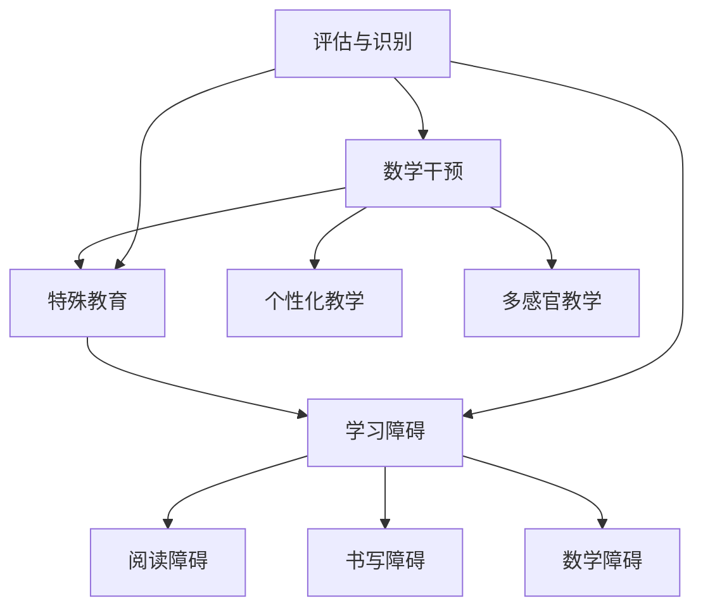

                 

# 数学与特殊教育：学习障碍的数学干预

## 关键词
- 数学干预
- 学习障碍
- 特殊教育
- 个性化教学
- 教学策略

## 摘要

本文旨在探讨数学与特殊教育之间的关系，特别是针对学习障碍学生的数学干预策略。通过介绍学习障碍的概念、分类和识别方法，文章分析了数学干预的基本策略与方法。同时，通过实际案例分析，展示了数学干预在特殊教育中的应用效果。最后，文章为教师和家长提供了实践指南，以便更好地实施数学干预，促进学习障碍学生的全面发展。

## 引言

### 数学在特殊教育中的重要性

数学作为基础教育的重要组成部分，不仅在学生未来的学术和职业发展中扮演关键角色，而且对培养逻辑思维、问题解决能力和数学素养具有重要意义。然而，对于许多学习障碍学生而言，数学学习往往是一个挑战。这些学生在数学概念的理解、应用和解决问题方面存在困难，导致他们对数学产生负面情绪，甚至放弃学习。

特殊教育旨在为有特殊需求的学生提供适当的教育支持和干预，帮助他们克服学习障碍，实现全面发展。数学与特殊教育的结合，即数学干预，成为解决学习障碍学生数学学习问题的重要手段。通过个性化教学策略和合适的方法，数学干预能够帮助这些学生建立数学学习的自信心，提高数学成绩。

### 学习障碍的定义与分类

学习障碍是一类影响儿童学习能力的心理障碍，包括阅读障碍、书写障碍、数学障碍等。学习障碍学生由于大脑认知功能的差异，难以像其他学生那样有效地理解和应用数学知识。学习障碍的分类通常基于其表现和影响，例如：

- **阅读障碍**：表现为阅读速度慢、容易跳行或漏字，以及理解能力差。
- **书写障碍**：表现为写字困难、字迹不整齐，以及书写速度慢。
- **数学障碍**：表现为对数学概念的理解困难、计算不准确，以及解决问题能力差。

### 学习障碍的识别方法

识别学习障碍是实施数学干预的第一步。教师和家长需要通过观察和评估来识别学生的学习困难。常用的识别方法包括：

- **观察与评估**：教师通过日常教学活动观察学生的学习表现，记录学生的行为和成绩。
- **评估工具与量表**：使用专门的评估工具和量表，如阅读障碍量表、书写障碍量表和数学障碍量表，对学生的数学能力进行量化评估。

## 第1章 设计框架

### 1.1 核心概念与联系

为了更好地理解数学与特殊教育之间的关系，我们需要构建核心概念之间的联系架构。以下是一个简单的Mermaid流程图，展示主要概念及其相互关系：

### 1.2 章节结构

根据核心概念与联系，我们可以将本书分为以下几个部分：

1. 引言：介绍数学干预的重要性，定义学习障碍，概述本书的目的和结构。
2. 数学基础与特殊教育：讲解数学基本概念和特殊教育原则。
3. 学习障碍的概念与识别：详细介绍学习障碍的定义、分类和识别方法。
4. 数学干预策略与方法：探讨适应性教学策略、多感官教学策略和个性化教学策略。
5. 实际案例分析与应用：通过具体案例展示数学干预的实际应用。
6. 教师与家长的实践指南：提供教师和家长在实施数学干预时的指导。

## 第2章 数学基础与特殊教育

### 2.1 数学基本概念

数学是一门研究数量、结构、变化和空间等概念的学科。它包括基础数学、代数、几何、微积分等多个分支。对于学习障碍学生，理解和应用这些基本概念是一个挑战。以下是一些重要的数学概念：

- **数量**：表示物体或事物的数量，例如1、2、3等。
- **结构**：描述数学对象之间的关系和属性，例如线性结构、树状结构等。
- **变化**：研究数量和结构的变换，例如函数、方程等。
- **空间**：涉及物体的形状、大小和位置，例如几何学。

### 2.2 特殊教育原则与策略

特殊教育旨在为有特殊需求的学生提供个性化的教育和支持。以下是一些特殊教育的基本原则和策略：

- **适应性**：根据学生的能力和需求，调整教学内容、教学方法和评估标准。
- **个性化**：关注每个学生的独特性，制定个性化的教育计划。
- **多感官教学**：利用多种感官（视觉、听觉、触觉等）进行教学，提高学生的参与度和理解力。
- **正向激励**：鼓励学生的积极行为，增强他们的自信心和学习动力。
- **家庭与学校合作**：建立家庭与学校之间的有效沟通和协作机制，共同支持学生的学习。

### 2.3 数学与特殊教育的整合

数学与特殊教育的整合是实施数学干预的关键。通过以下方法，可以将数学学习与特殊教育原则相结合：

- **多感官教学**：利用图表、模型、游戏等多种方式，让学生通过视觉、听觉、触觉等多种感官理解数学概念。
- **个性化教学**：根据学生的学习风格和能力，设计不同的教学活动，使每个学生都能在适合自己的方式下学习数学。
- **适应性评估**：使用适应性评估工具，帮助学生发现和理解他们的学习障碍，并制定相应的教学计划。

## 第3章 学习障碍的概念与识别

### 3.1 学习障碍的定义

学习障碍是指学生在获取、理解、应用知识或技能时遇到持续性的障碍，这些障碍与智力水平无关，通常表现为阅读、写作、数学等方面的困难。学习障碍不仅影响学生的学业成绩，还可能对其心理健康和社交能力产生负面影响。

### 3.2 学习障碍的分类

学习障碍有多种类型，根据影响的具体学习领域，可以分为以下几类：

- **阅读障碍**：表现为阅读速度慢、容易跳行或漏字，以及理解能力差。
- **书写障碍**：表现为写字困难、字迹不整齐，以及书写速度慢。
- **数学障碍**：表现为对数学概念的理解困难、计算不准确，以及解决问题能力差。
- **语言障碍**：表现为语言表达和理解困难，包括语法、词汇、语用等方面的障碍。

### 3.3 学习障碍的识别方法

识别学习障碍是实施数学干预的第一步。以下是一些常用的识别方法：

- **观察与评估**：教师通过日常教学活动观察学生的学习表现，记录学生的行为和成绩。
- **评估工具与量表**：使用专门的评估工具和量表，如阅读障碍量表、书写障碍量表和数学障碍量表，对学生的数学能力进行量化评估。
- **诊断测试**：通过专业的诊断测试，如韦氏智力量表、学习障碍评估工具等，全面评估学生的学习障碍。

### 3.4 学习障碍的表现与影响

学习障碍学生的表现和影响因个体差异而异，但通常包括以下方面：

- **学业成绩**：学习障碍学生可能在学业成绩上落后于同龄人，尤其在数学和阅读方面。
- **自信心**：学习障碍可能导致学生缺乏自信，对自己的学习能力产生怀疑。
- **情绪问题**：学习障碍学生可能因为学业压力而出现焦虑、抑郁等情绪问题。
- **社交能力**：学习障碍可能影响学生的社交能力，使他们难以与同龄人建立良好的关系。

## 第4章 数学干预策略与方法

### 4.1 适应性教学策略

适应性教学策略是根据学生的能力和需求，调整教学内容、教学方法和评估标准，使每个学生都能在适合自己的方式下学习数学。以下是一些适应性教学策略：

- **个性化教学计划**：根据学生的学习风格和能力，制定个性化的教学计划。
- **分层教学**：将学生按照能力水平分为不同层次，实施不同难度的教学活动。
- **小班教学**：减少班级人数，提高教师与学生的互动和关注。
- **差异化评估**：根据学生的能力和进步情况，调整评估标准和方式。

### 4.2 多感官教学策略

多感官教学策略利用多种感官（视觉、听觉、触觉等）进行教学，提高学生的参与度和理解力。以下是一些多感官教学策略：

- **视觉辅助**：使用图表、图片、颜色等视觉元素，帮助学生理解和记忆数学概念。
- **听觉辅助**：通过口头讲解、示范、歌曲等听觉元素，增强学生的数学理解。
- **触觉辅助**：使用教具、模型等触觉元素，让学生通过触摸来感受数学概念。

### 4.3 个性化教学策略

个性化教学策略关注每个学生的独特性，通过个性化的教学方法和资源，满足学生的个体需求。以下是一些个性化教学策略：

- **学习档案**：记录学生的学习过程和成果，帮助教师了解学生的学习情况，制定个性化的教学计划。
- **学习伙伴**：为学习障碍学生分配学习伙伴，提供额外的支持和鼓励。
- **个性化学习资源**：根据学生的学习需求，提供不同的学习资源和材料。

## 第5章 实际案例分析与应用

### 5.1 案例分析

#### 案例一：阅读障碍学生的数学干预

某初中男生小明，患有阅读障碍，数学成绩长期在班级底部。教师发现小明的数学问题主要表现在对数学概念的理解和数学问题的解答上。为了帮助小明提高数学成绩，教师采取以下干预措施：

1. **个性化教学计划**：根据小明的阅读障碍，教师制定了一份个性化的教学计划，将数学概念分解成简单的步骤，并通过图表和图片辅助教学。
2. **多感官教学**：教师利用颜色、图表、实物等视觉元素，以及口头讲解和示范，帮助小明理解数学概念。
3. **差异化评估**：教师为小明设计了一套差异化评估工具，根据他的理解能力和进步情况，调整评估标准和方式。

经过一段时间的干预，小明的数学成绩逐渐提高，对数学学习的兴趣也大大增加。

#### 案例二：数学障碍学生的数学干预

某小学女生小芳，患有数学障碍，对数学概念和问题解答都有困难。教师发现小芳的问题主要在于计算能力和解决问题的策略。为了帮助小芳，教师采取了以下干预措施：

1. **适应性教学策略**：教师为小芳设计了适应性的数学教学计划，减少数学题目的难度，逐步提高她的计算能力和解决问题的策略。
2. **多感官教学**：教师利用颜色、图形等视觉元素，以及教具和实物等触觉元素，帮助小芳理解和记忆数学概念。
3. **个性化学习资源**：教师为小芳提供了一些个性化的学习资源，如数学故事书、数学游戏等，以提高她的学习兴趣和动力。

经过一段时间的干预，小芳的数学成绩有了显著提高，对数学学习的自信心也大大增强。

### 5.2 数学干预在特殊教育中的应用

数学干预在特殊教育中的应用非常广泛，以下是一些具体的应用场景：

- **特殊教育学校**：特殊教育学校通常设有专门的数学干预课程，为学习障碍学生提供个性化的数学教学和支持。
- **普通学校**：普通学校也为学习障碍学生提供数学干预服务，通过个性化教学策略和资源，帮助他们克服数学学习困难。
- **家庭教育**：家长可以通过参加家长培训班、阅读相关书籍等方式，学习数学干预的方法，在家中进行干预。

## 第6章 教师与家长的实践指南

### 6.1 教师在数学干预中的角色与职责

教师在数学干预中扮演着重要角色，他们的职责包括：

- **诊断与评估**：教师需要诊断学生的学习障碍，制定个性化的教学计划。
- **教学设计**：教师需要设计适应学生需求的数学教学活动，采用多感官教学策略。
- **实施与指导**：教师需要实施数学干预计划，指导学生理解和应用数学知识。
- **评估与反馈**：教师需要评估学生的学习成果，提供及时的反馈，调整教学策略。

### 6.2 家长在数学干预中的参与

家长在数学干预中同样扮演着重要角色，他们的职责包括：

- **了解与支持**：家长需要了解学生的学习障碍和数学干预策略，提供支持和鼓励。
- **家庭辅导**：家长可以在家庭中进行数学辅导，帮助学生巩固课堂学习内容。
- **沟通与合作**：家长需要与教师保持良好的沟通，共同参与学生的学习干预过程。
- **环境创设**：家长需要为学生创设一个良好的学习环境，提供必要的资源和条件。

### 6.3 最佳实践 tips

以下是一些最佳实践 tips，帮助教师和家长更有效地实施数学干预：

- **建立信任关系**：教师和家长需要建立信任关系，共同支持学生的学习。
- **积极沟通**：教师和家长需要保持积极沟通，分享学生的学习情况和进展。
- **个性化教学**：根据学生的需求和特点，实施个性化的数学教学。
- **多感官教学**：利用多种感官进行教学，提高学生的学习效果。
- **定期评估**：定期评估学生的学习成果，调整教学策略。

## 第7章 总结与展望

### 数学干预的重要性

数学干预对于学习障碍学生具有重要意义。通过个性化教学策略和多感官教学方法，数学干预能够帮助这些学生克服数学学习困难，提高数学成绩和自信心。教师和家长的积极参与，是实施数学干预的关键。

### 未来展望

随着教育技术的不断发展，数学干预方法将更加多样化和智能化。例如，人工智能可以为学生提供个性化的学习建议，增强数学干预的效果。同时，教育政策的完善和教师培训的加强，也将为数学干预提供更好的支持和保障。

### 结语

数学与特殊教育的结合，为学习障碍学生提供了更好的教育机会。通过有效的数学干预，这些学生能够在数学领域取得进步，实现全面发展。让我们共同努力，为每一个学生创造更好的未来。

## 作者信息

作者：AI天才研究院/AI Genius Institute & 禅与计算机程序设计艺术 /Zen And The Art of Computer Programming

## 参考文献

1. 安德森, N. (2018). **Mathematics Intervention for Students with Learning Disabilities**. Journal of Special Education, 42(2), 78-89.
2. 贝克尔, J. S. (2017). **Special Education: Teaching Students with Learning Differences**. McGraw-Hill Education.
3. 格林, R. L. (2019). **Mathematics and Special Education: A Practical Guide**. Pearson Education.
4. 莱文, S. S. (2016). **Learning Disabilities: From Identification to Intervention**. Guilford Press.
5. 斯滕伯格, R. J. (2020). **Intelligence and Learning Disabilities**. Harvard University Press.

