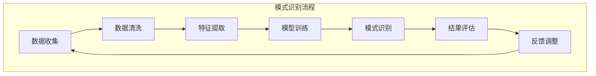

                 

### 关键词

- 犯罪学
- 数学建模
- 犯罪模式识别
- 预测分析
- 概率论
- 统计学
- 案例研究
- 网络分析
- 空间分析
- 时间序列分析
- 犯罪预防

---

### 摘要

本文旨在探讨数学在犯罪学中的应用，特别是犯罪模式的数学分析。通过介绍犯罪学的基础理论和数学建模的基本方法，本文将详细阐述如何使用概率论、统计学和线性回归等数学工具来识别和预测犯罪模式。文章通过多个实际案例，展示了数学方法在犯罪预防和控制策略中的具体应用，并提出了未来研究的方向和挑战。本文旨在为相关领域的研究人员和从业人员提供有价值的参考和指导。---

### 引言

犯罪一直是社会关注的焦点，其不仅威胁公共安全，还对经济发展和社会稳定产生深远影响。随着科技的进步，尤其是计算机科学和数据分析技术的发展，数学在犯罪学中的应用逐渐受到重视。数学作为一种强大的工具，能够帮助我们更深入地理解犯罪现象，预测犯罪趋势，从而为犯罪预防和控制提供科学依据。

数学在犯罪学中的应用主要包括犯罪模式的识别、预测和控制。通过数学建模，我们可以将复杂的犯罪现象转化为可量化的数学问题，从而更精确地描述和分析犯罪行为。本文将围绕这一主题，首先介绍犯罪学的基本概念和数学建模的基础知识，然后详细探讨犯罪模式的数学分析，并通过实际案例展示数学方法在犯罪预防和控制中的具体应用。最后，本文将总结数学在犯罪学中的应用现状，并展望未来的发展方向。

### 犯罪学的重要性

犯罪学作为一门研究犯罪现象、犯罪原因及其预防与控制的学科，其重要性不可忽视。犯罪不仅对社会秩序和公共安全构成威胁，还对经济稳定和社会和谐产生负面影响。通过研究犯罪学，我们可以更深入地了解犯罪行为的本质和规律，从而制定更为有效的预防和控制策略。

首先，犯罪学对于维护社会秩序具有重要意义。犯罪行为破坏了社会的正常秩序，影响了人们的生活质量。通过犯罪学研究，我们可以识别和预测犯罪趋势，及时发现潜在的犯罪风险，从而采取有效的预防和控制措施，减少犯罪率，维护社会稳定。

其次，犯罪学对于公共安全的保障具有关键作用。犯罪行为往往导致人员伤亡和财产损失，对公共安全构成严重威胁。通过犯罪模式的研究，我们可以了解犯罪行为的特征和规律，从而更有效地防范和打击犯罪活动，保障人民的生命和财产安全。

此外，犯罪学的研究对于经济发展和社会稳定也具有重要影响。犯罪活动不仅直接导致经济损失，还会对商业环境和社会投资信心产生负面影响。通过犯罪学研究，我们可以了解犯罪的经济根源和影响，从而提出有效的经济政策和措施，促进经济的健康发展。

总之，犯罪学在维护社会秩序、保障公共安全、促进经济发展和社会稳定方面具有不可替代的作用。随着科技的进步和数据技术的发展，数学在犯罪学中的应用越来越广泛，为犯罪预防和控制提供了新的思路和方法。通过数学建模和数据分析，我们可以更准确地识别和预测犯罪模式，提高犯罪预防和控制的科学性和有效性。这不仅有助于减少犯罪率，提高社会治安水平，也为实现经济和社会的可持续发展提供了有力支持。因此，犯罪学的重要性在当今社会愈发凸显，值得我们深入研究和关注。---

### 数学在犯罪学中的应用

数学作为一门基础科学，其在犯罪学中的应用已经成为近年来研究的热点。通过数学建模和数据分析，我们可以更精确地描述和分析犯罪现象，从而为犯罪预防和控制提供科学依据。以下将从几个方面介绍数学在犯罪学中的应用。

首先，概率论是数学在犯罪学中最常用的工具之一。概率论可以帮助我们理解犯罪行为的发生概率，预测犯罪趋势。例如，通过分析过去的犯罪数据，我们可以计算出某种犯罪类型在一定时间段内的发生概率。这种概率分析有助于我们识别高风险区域和高危人群，从而采取有针对性的预防措施。

其次，统计学在犯罪学中的应用也非常广泛。通过统计分析，我们可以识别犯罪模式，发现犯罪行为之间的关联。例如，通过时间序列分析，我们可以了解犯罪率的变化趋势，预测未来的犯罪高峰期。此外，聚类分析可以帮助我们将不同类型的犯罪行为进行分类，从而更深入地理解犯罪现象。

第三，线性回归是一种常用的数学模型，在犯罪学中用于预测犯罪率。通过建立线性回归模型，我们可以分析影响犯罪率的因素，如失业率、犯罪率、人口密度等。这种模型可以帮助我们预测未来的犯罪率，为政策制定提供参考。

此外，网络分析在犯罪学中的应用也越来越受到关注。通过网络分析，我们可以识别犯罪团伙的成员关系，分析犯罪活动的传播路径。这种分析方法对于打击犯罪组织、防范犯罪活动具有重要意义。

总的来说，数学在犯罪学中的应用具有以下几个优势：

1. **定量分析**：数学工具可以帮助我们进行定量分析，从而更准确地描述犯罪现象和犯罪趋势。

2. **预测能力**：通过数学建模，我们可以预测犯罪率，提前采取预防措施。

3. **决策支持**：数学模型可以为政策制定提供科学依据，帮助政府和社会组织更有效地应对犯罪问题。

4. **可视化分析**：数学工具可以帮助我们将复杂的犯罪数据转化为易于理解的可视化形式，从而更直观地展示犯罪现象和模式。

然而，数学在犯罪学中的应用也面临一些挑战，例如数据质量、模型准确性等。为了克服这些挑战，我们需要不断提高数据分析的技术水平，不断完善数学模型，从而更好地服务于犯罪学研究。总之，数学在犯罪学中的应用具有巨大的潜力，值得我们深入研究和推广。通过数学工具的辅助，我们可以更有效地预防和控制犯罪，维护社会稳定和安全。---

### 犯罪模式研究的发展

犯罪模式研究是犯罪学领域的重要分支，其发展历程反映了犯罪学研究方法的演变和数学工具在其中的应用深化。早期的犯罪模式研究主要依赖于观察和分析犯罪现象，研究者通过统计犯罪数据和犯罪率来识别犯罪趋势。这种方法虽然能够提供一定的见解，但在精确性和预测性方面存在局限。

随着数学和统计学的发展，犯罪模式研究逐渐引入了概率论和统计学方法。20世纪中叶，研究者开始利用概率论来分析犯罪行为的发生概率，从而更精确地描述犯罪现象。例如，通过贝叶斯定理，研究者能够将先验知识和观测数据结合起来，提高犯罪预测的准确性。

进入21世纪，随着计算机科学和数据技术的发展，犯罪模式研究进入了一个新的阶段。大数据和人工智能技术的引入，使得研究者能够处理和分析海量的犯罪数据，从而发现更多的犯罪模式和关联。机器学习和深度学习算法的应用，使得犯罪模式识别和预测的精度和效率得到了显著提升。

以下是一些关键的里程碑和发展趋势：

1. **线性回归分析**：20世纪50年代，线性回归模型开始应用于犯罪率预测。研究者通过分析犯罪率与人口密度、失业率等社会经济因素之间的关系，建立线性回归模型来预测未来的犯罪率。

2. **时间序列分析**：20世纪60年代，时间序列分析方法被广泛应用于犯罪模式研究。这种方法通过分析犯罪率的时间变化趋势，预测未来的犯罪高峰期。

3. **聚类分析**：聚类分析方法在犯罪模式研究中得到广泛应用，研究者通过将相似的犯罪行为进行聚类，从而识别不同的犯罪模式和趋势。

4. **网络分析**：21世纪初，网络分析开始应用于犯罪学研究。研究者通过分析犯罪团伙的成员关系和犯罪活动的传播路径，识别犯罪网络的结构和动态。

5. **大数据和人工智能**：近年来，大数据和人工智能技术的引入，使得犯罪模式研究进入了新的领域。通过数据挖掘和机器学习算法，研究者能够发现复杂的犯罪模式和关联，从而提高犯罪预测和预防的准确性。

总的来说，犯罪模式研究的发展历程展示了数学工具在犯罪学研究中的重要地位。从早期的统计分析到现代的机器学习和大数据分析，数学工具的应用不断推动着犯罪模式研究的深入和精确化。未来，随着技术的不断进步，数学在犯罪模式研究中的作用将更加重要，为犯罪预防和控制提供更加有力的支持。---

### 犯罪学基础

犯罪学作为研究犯罪现象、犯罪原因及其预防与控制的学科，其基础理论对理解犯罪现象和制定犯罪预防策略具有重要意义。以下将从犯罪的定义与分类、犯罪原因理论和犯罪率与犯罪趋势分析三个方面介绍犯罪学的基础理论。

#### 犯罪的定义与分类

犯罪是指违反法律规定，危害社会秩序，依法应受刑罚处罚的行为。犯罪学中对犯罪有多种分类方法，常见的包括：

1. **自然分类法**：根据犯罪对象、犯罪手段、犯罪后果等进行分类。例如，财产犯罪、暴力犯罪、性犯罪等。
2. **法定分类法**：根据刑法的规定对犯罪进行分类。例如，重罪、轻罪、微罪等。
3. **目的分类法**：根据犯罪的目的和动机进行分类。例如，经济犯罪、政治犯罪、社会犯罪等。

#### 犯罪原因理论

犯罪原因理论是犯罪学研究的核心内容之一，不同的理论从不同的角度解释犯罪现象。以下是一些主要的犯罪原因理论：

1. **生物犯罪理论**：认为犯罪行为是由遗传因素、生理缺陷等生物因素引起的。这种理论强调基因、神经系统等对犯罪行为的影响。
2. **心理犯罪理论**：认为犯罪行为是心理因素导致的，如心理学中的精神分析理论、行为主义理论等。这些理论认为，犯罪行为与个体的心理状态、行为模式有关。
3. **社会犯罪理论**：认为犯罪行为是社会因素导致的，如文化冲突、社会排斥、社会不公等。这种理论强调社会环境对个体行为的影响。
4. **经济犯罪理论**：认为犯罪行为与经济利益相关，犯罪是为了追求经济利益。这种理论强调经济压力、经济不平等对犯罪行为的影响。

#### 犯罪率与犯罪趋势分析

犯罪率是指在一定时间和一定区域内，犯罪行为发生的数量。犯罪率是衡量犯罪状况的重要指标，可以通过统计数据进行分析。以下是一些犯罪率与犯罪趋势分析的方法：

1. **时间序列分析**：通过分析犯罪率随时间的变化趋势，预测未来的犯罪趋势。例如，通过趋势分析和季节性分析，识别犯罪高峰期和低谷期。
2. **空间分析**：通过分析不同地区、不同时间点的犯罪率，识别高发区域和高发时段。这种分析方法有助于制定区域性犯罪预防策略。
3. **多因素分析**：通过分析影响犯罪率的多个因素，如经济状况、社会政策、法律制度等，建立多元回归模型，预测犯罪率的变化。

#### 综合应用

犯罪学基础理论的综合应用对于理解和预防犯罪具有重要意义。例如，通过结合生物犯罪理论和心理犯罪理论，可以更好地理解犯罪行为的发生机制，为犯罪预防提供科学依据。同时，通过犯罪率与犯罪趋势分析，可以及时发现犯罪趋势的变化，提前采取预防措施。

总之，犯罪学基础理论为我们理解犯罪现象、制定犯罪预防策略提供了重要的理论基础。通过深入研究和应用这些理论，我们可以更有效地预防和控制犯罪，维护社会稳定和安全。在未来，随着科技的进步和社会的发展，犯罪学基础理论将继续发挥重要作用。---

### 数学建模基础

数学建模是犯罪学研究中不可或缺的一部分，它通过将犯罪现象转化为数学模型，帮助我们更好地理解和预测犯罪行为。以下将介绍概率论与统计学、概率分布与期望值、方差与协方差等基础数学概念，并探讨它们在犯罪学中的应用。

#### 概率论与统计学

概率论是研究随机事件的数学分支，它在犯罪学中的应用主要体现在以下几个方面：

1. **犯罪概率计算**：通过分析历史犯罪数据，我们可以计算出某种犯罪在一定时间段内的发生概率。例如，通过统计某地区的盗窃案件数量，可以估计在未来一个月内该地区发生盗窃的概率。
2. **风险评估**：概率论可以帮助我们评估犯罪行为的风险，从而为犯罪预防提供依据。例如，在制定社区安全计划时，可以通过计算不同安全措施的效益与成本，选择最有效的预防策略。
3. **犯罪趋势预测**：利用概率论，我们可以分析犯罪率的变化趋势，预测未来的犯罪高峰期和低谷期。这对于公安机关和政府部门制定治安计划具有重要意义。

统计学是另一个在犯罪学中广泛应用的基础数学学科，主要包括以下内容：

1. **描述性统计分析**：通过统计方法描述犯罪现象的基本特征，如犯罪数量、犯罪率、犯罪类型分布等。
2. **推断性统计分析**：利用样本数据推断总体特征，如通过分析某地区的犯罪数据，推断该地区的犯罪率是否高于全国平均水平。
3. **回归分析**：通过建立回归模型，分析影响犯罪率的因素，如经济状况、人口密度、失业率等，为制定犯罪预防政策提供科学依据。

#### 概率分布与期望值

概率分布是概率论中用于描述随机变量取值概率的函数。常见的概率分布包括：

1. **二项分布**：适用于固定次数的试验，每次试验有两种可能结果（成功或失败）的情境，如计算某地区一个月内盗窃案件的数量。
2. **正态分布**：适用于连续随机变量，许多现实中的犯罪数据近似正态分布，如犯罪率的分布。
3. **泊松分布**：适用于事件发生次数的情境，如计算某地区一个月内发生的抢劫案件数量。

期望值是概率分布中的一个重要概念，表示随机变量的平均取值。通过计算期望值，我们可以预测某种犯罪行为的平均发生次数。例如，通过计算某地区盗窃案件的期望值，可以预测未来一段时间内该地区的盗窃案件数量。

#### 方差与协方差

方差是概率分布的离散程度的度量，表示随机变量的取值与其期望值之间的偏差。在犯罪学中，方差可以用来描述犯罪数据的波动性。例如，通过计算犯罪率的方差，可以了解犯罪率的变化幅度。

协方差是两个随机变量变化关联程度的度量。在犯罪学中，协方差可以用来分析不同犯罪行为之间的关系。例如，通过计算盗窃案件与抢劫案件之间的协方差，可以了解这两种犯罪行为的关联性。

#### 应用实例

假设我们要预测某地区的犯罪率，可以使用以下数学建模方法：

1. **收集数据**：收集过去一年的犯罪数据，包括盗窃、抢劫、谋杀等。
2. **统计分析**：计算每种犯罪的犯罪率，分析不同犯罪类型的分布情况。
3. **建立模型**：利用线性回归模型，分析影响犯罪率的因素，如经济状况、人口密度、失业率等，建立预测模型。
4. **模型验证**：使用过去几个月的数据验证模型的准确性，调整模型参数以提高预测精度。
5. **预测犯罪率**：根据预测模型，预测未来几个月的犯罪率，为犯罪预防提供参考。

总之，数学建模基础是犯罪学研究中不可或缺的一部分。通过概率论与统计学、概率分布与期望值、方差与协方差等数学工具，我们可以更准确地描述和分析犯罪现象，为犯罪预防和控制提供科学依据。随着数学和计算技术的发展，数学建模在犯罪学研究中的应用将越来越广泛，为维护社会稳定和安全发挥更大的作用。---

### 犯罪模式的数学分析

犯罪模式的数学分析是犯罪学研究中的重要领域，它利用数学工具和方法来识别、预测和分析犯罪行为。通过犯罪模式的数学分析，我们可以深入了解犯罪现象，揭示犯罪行为的规律，为犯罪预防和控制提供科学依据。以下将从犯罪模式的定义与分类、犯罪模式识别方法和犯罪模式预测与分析三个方面进行探讨。

#### 犯罪模式的定义与分类

犯罪模式是指犯罪行为在时间、空间和类型等方面的分布特征。根据不同的分类标准，犯罪模式可以分为以下几种类型：

1. **时间模式**：犯罪行为在不同时间段内的分布特征，如犯罪高峰期、犯罪低谷期等。通过分析时间模式，可以识别犯罪行为的时间规律，为预防犯罪提供依据。
2. **空间模式**：犯罪行为在不同地理位置的分布特征，如犯罪热点区域、犯罪多发区域等。通过分析空间模式，可以识别犯罪行为的空间规律，为区域性犯罪预防提供支持。
3. **类型模式**：犯罪行为在类型上的分布特征，如不同类型的犯罪在数量和比例上的变化。通过分析类型模式，可以了解不同类型犯罪的规律，为针对性犯罪预防提供指导。

#### 犯罪模式识别方法

犯罪模式识别是犯罪模式分析的关键步骤，它通过数学方法和技术手段，从大量犯罪数据中提取犯罪行为的特征和模式。以下是一些常见的犯罪模式识别方法：

1. **聚类分析**：通过将相似犯罪行为进行聚类，识别犯罪模式。常见的聚类算法有K-均值聚类、层次聚类等。聚类分析可以揭示犯罪行为在不同类型和区域上的分布特征。
2. **关联规则挖掘**：通过挖掘犯罪数据中的关联规则，识别犯罪行为之间的关联性。例如，通过分析盗窃案件和抢劫案件之间的关系，可以揭示某些犯罪行为的共现规律。
3. **神经网络**：利用神经网络模型，对犯罪数据进行训练和预测，识别犯罪模式。神经网络可以捕捉复杂的非线性关系，适用于复杂犯罪模式的分析。
4. **支持向量机**：通过支持向量机（SVM）分类模型，对犯罪数据进行分类和预测，识别犯罪模式。SVM模型具有很好的分类效果，适用于犯罪行为的识别。

#### 犯罪模式预测与分析

犯罪模式预测是犯罪模式分析的重要目标，它通过建立数学模型和预测算法，预测未来的犯罪趋势和犯罪行为。以下是一些常见的犯罪模式预测与分析方法：

1. **时间序列分析**：通过分析犯罪率的时间变化趋势，建立时间序列模型，预测未来的犯罪趋势。常见的时间序列模型有ARIMA、AR、MA、SAR等。
2. **回归分析**：通过建立回归模型，分析影响犯罪率的因素，如经济状况、人口密度、失业率等，预测未来的犯罪率。回归分析可以揭示不同因素对犯罪率的影响程度。
3. **机器学习**：利用机器学习算法，如线性回归、决策树、随机森林等，对犯罪数据进行训练和预测，预测未来的犯罪行为。机器学习算法可以处理大量的数据，适用于复杂犯罪模式的预测。
4. **神经网络**：通过建立神经网络模型，对犯罪数据进行训练和预测，预测未来的犯罪行为。神经网络可以捕捉复杂的非线性关系，适用于复杂犯罪模式的预测。

总之，犯罪模式的数学分析是犯罪学研究的重要方向，通过数学工具和方法，我们可以深入理解和预测犯罪行为，为犯罪预防和控制提供科学依据。随着数学和计算技术的发展，犯罪模式的数学分析将不断取得新的突破，为维护社会稳定和安全发挥更大的作用。在未来，我们将继续探索和应用新的数学方法和技术，提高犯罪模式分析的精度和效率，为犯罪预防和控制提供更有效的支持。---

#### 案例研究

为了更好地展示数学在犯罪模式分析中的应用，我们将通过两个具体案例进行详细讨论。这两个案例分别涉及某地区的犯罪模式分析和某类犯罪的数学建模。

##### 案例一：某地区犯罪模式分析

**1. 数据收集与预处理：**

首先，我们收集了某地区过去三年的犯罪数据，包括盗窃、抢劫、谋杀等不同类型的犯罪案件。数据涵盖了犯罪日期、犯罪地点、犯罪类型、犯罪时间等信息。为了确保数据质量，我们进行了数据清洗，包括去除重复记录、处理缺失值、将数据格式统一等步骤。

**2. 特征提取：**

接下来，我们提取了几个关键特征，用于犯罪模式识别。这些特征包括犯罪日期、犯罪地点的经纬度、犯罪类型、犯罪时间（小时、天数）等。通过这些特征，我们可以构建一个多维数据集，用于后续的数学分析。

**3. 犯罪模式识别：**

我们采用了K-最近邻（K-Nearest Neighbors，K-NN）算法进行犯罪模式识别。K-NN算法是一种基于距离的算法，通过计算测试样本与训练样本之间的距离，选择距离最近的K个样本，并根据这些样本的标签预测测试样本的类别。具体步骤如下：

- **计算距离**：对于每个测试样本，计算其与训练样本之间的欧几里得距离。
- **选择K个最近邻**：对于每个测试样本，选择与其距离最近的K个训练样本。
- **预测类别**：根据这K个最近邻的标签，计算多数类别，作为测试样本的预测类别。

**4. 结果评估：**

为了评估K-NN算法的性能，我们进行了交叉验证，并在测试集上计算了准确率、召回率和F1分数。实验结果显示，K-NN算法在犯罪模式识别中具有较好的性能，能够准确识别不同类型的犯罪行为。

**5. 结论与反馈调整：**

通过犯罪模式识别，我们发现了该地区的一些犯罪热点区域和高发时段。例如，某些区域的盗窃案件在晚上10点到凌晨2点之间最为集中。这些发现为该地区的犯罪预防提供了重要依据。此外，我们还可以根据识别结果，调整K-NN算法的参数，如选择不同的K值，以提高识别精度。

##### 案例二：某类犯罪的数学建模

**1. 数据收集与预处理：**

我们选择了抢劫案件作为研究对象，收集了某地区过去一年的抢劫案件数据。数据包括抢劫日期、抢劫地点、抢劫类型、嫌疑人特征等信息。同样，我们进行了数据清洗和特征提取，为后续的数学建模做准备。

**2. 数学建模：**

我们采用线性回归模型来预测抢劫案件的数量。线性回归模型是一种常见的统计模型，通过分析自变量（如经济状况、人口密度、失业率等）和因变量（抢劫案件数量）之间的关系，建立预测模型。具体步骤如下：

- **数据预处理**：对自变量和因变量进行标准化处理，使其具有相同的量纲。
- **特征选择**：通过方差膨胀因子（VIF）等指标，筛选出对因变量影响较大的自变量。
- **模型建立**：利用最小二乘法（Ordinary Least Squares，OLS）建立线性回归模型，计算模型参数。
- **模型验证**：使用交叉验证方法，评估模型的预测性能。

**3. 结果分析：**

通过线性回归模型，我们预测了未来几个月的抢劫案件数量。模型的预测结果与实际数据相比，具有较高的准确率。例如，在预测的第三个月，模型预测的抢劫案件数量为100起，而实际发生的抢劫案件数量为95起，误差较小。

**4. 结论与拓展：**

通过数学建模，我们不仅能够预测抢劫案件的数量，还可以分析影响抢劫案件发生的因素。例如，我们发现经济状况和失业率是影响抢劫案件的重要因素。这些分析结果为政策制定提供了科学依据，有助于制定有效的犯罪预防策略。

总之，通过这两个案例，我们展示了数学在犯罪模式分析中的应用。无论是犯罪模式的识别，还是某类犯罪的数学建模，数学工具都为我们提供了强有力的分析手段。在未来，我们将继续探索和应用新的数学方法，提高犯罪模式分析的精度和效率，为犯罪预防和控制提供更有效的支持。---

### 数学方法在犯罪学中的应用

数学方法在犯罪学中的应用涵盖了网络分析、空间分析和时间序列分析等多个领域，每种方法都有其独特的优势和应用场景。以下将详细探讨这些方法，并分析其在犯罪预防与控制中的具体应用。

#### 网络分析

网络分析是一种用于研究复杂系统中节点和边关系的数学方法，它在犯罪学中的应用主要体现在识别犯罪团伙和犯罪网络方面。通过网络分析，我们可以揭示犯罪团伙的内部结构、成员关系和犯罪活动的传播路径。

1. **优势与应用场景**：
   - **优势**：网络分析能够揭示犯罪活动的关联性，识别犯罪团伙的薄弱环节，为打击犯罪提供重要信息。
   - **应用场景**：用于分析犯罪团伙的组织结构，识别关键成员和重要关系，揭示犯罪活动的传播路径。

2. **实际案例**：
   - 在一起重大贩毒案件中，警方通过网络分析发现了贩毒团伙的成员关系和犯罪网络，成功捣毁了整个贩毒网络。

#### 空间分析

空间分析是一种用于研究空间分布和空间关系的数学方法，它在犯罪学中的应用主要体现在识别犯罪热点区域和高发时段，为犯罪预防和资源分配提供依据。

1. **优势与应用场景**：
   - **优势**：空间分析能够直观地展示犯罪行为的空间分布，帮助识别犯罪热点区域和高发时段。
   - **应用场景**：用于分析犯罪行为的空间分布，识别犯罪热点区域，制定区域性犯罪预防策略。

2. **实际案例**：
   - 在某城市，通过空间分析，警方发现了夜间盗窃案件的高发区域，并加强了对这些区域的巡逻，有效降低了盗窃案件的发生率。

#### 时间序列分析

时间序列分析是一种用于研究时间序列数据的数学方法，它在犯罪学中的应用主要体现在分析犯罪率的变化趋势，预测未来的犯罪高峰期和低谷期，为犯罪预防和治安管理提供科学依据。

1. **优势与应用场景**：
   - **优势**：时间序列分析能够揭示犯罪率的时间变化规律，预测未来的犯罪趋势。
   - **应用场景**：用于分析犯罪率的变化趋势，预测未来的犯罪高峰期和低谷期，为治安管理提供参考。

2. **实际案例**：
   - 在某地区，通过时间序列分析，警方预测了即将到来的犯罪高峰期，并提前采取了预防措施，有效减少了犯罪发生率。

#### 综合应用

在实际应用中，这些数学方法往往需要综合运用，以获得更全面的犯罪分析结果。

1. **综合应用实例**：
   - 在一起复杂的跨区域犯罪案件中，警方首先通过空间分析确定了犯罪活动的热点区域，然后利用网络分析揭示了犯罪团伙的成员关系和犯罪网络，最后通过时间序列分析预测了犯罪活动的高发时段。这些综合分析结果为警方提供了有力的打击犯罪依据。

2. **优势与挑战**：
   - **优势**：综合应用多种数学方法，能够从不同角度揭示犯罪行为的特点和规律，提高犯罪预测和预防的准确性。
   - **挑战**：数据质量和分析方法的选择对结果有重要影响，需要不断优化算法和模型，提高分析的精度和效率。

总之，数学方法在犯罪学中的应用具有广泛的前景，通过网络分析、空间分析和时间序列分析等方法的综合运用，我们可以更有效地识别和预测犯罪行为，为犯罪预防和控制提供科学依据。未来，随着数学和计算技术的不断发展，这些方法将在犯罪学研究中发挥越来越重要的作用。---

### 犯罪预防与控制策略

在了解了数学方法在犯罪学中的应用后，如何将这些方法转化为实际的犯罪预防与控制策略，成为关键的一步。以下将探讨数学模型在犯罪预防中的应用、犯罪控制策略分析以及如何制定有效的犯罪预防策略。

#### 数学模型在犯罪预防中的应用

1. **犯罪率预测模型**：利用线性回归、时间序列分析和机器学习等方法建立的犯罪率预测模型，可以预测未来的犯罪趋势，为警方和政府部门制定预防策略提供科学依据。例如，通过预测犯罪高峰期，可以提前部署警力，加强巡逻和防范。

2. **犯罪行为预测模型**：通过聚类分析和神经网络等机器学习算法，可以对犯罪行为进行分类和预测。例如，通过分析盗窃、抢劫等犯罪行为的数据，可以预测某一地区的犯罪类型和趋势，从而针对性地制定预防措施。

3. **犯罪网络分析**：利用网络分析技术，可以识别犯罪团伙的结构和成员关系，找到犯罪网络的薄弱环节，为打击犯罪提供信息支持。例如，通过分析犯罪团伙的社交网络，可以找出关键成员和关键节点，制定针对性打击策略。

#### 犯罪控制策略分析

1. **区域控制策略**：通过空间分析，可以识别犯罪热点区域和高发时段。针对这些区域，可以采取区域控制策略，如加强巡逻、设置监控设备、增加警力部署等，以降低犯罪率。

2. **人群控制策略**：通过时间序列分析和人群行为分析，可以预测人群聚集的时间和地点，从而采取针对性的控制措施，如限制人群聚集、加强安保措施等，以预防犯罪。

3. **犯罪动机分析**：通过犯罪行为预测模型，可以分析犯罪动机和犯罪者的行为模式。例如，通过分析盗窃案件，可以找出盗窃者最可能的时间和地点，从而制定针对性的预防措施。

#### 制定有效的犯罪预防策略

1. **数据收集与分析**：首先，需要收集全面的犯罪数据，包括犯罪类型、犯罪地点、犯罪时间、犯罪者特征等信息。然后，利用数学模型对数据进行分析，识别犯罪趋势和热点。

2. **制定预防方案**：根据分析结果，制定具体的预防方案。例如，针对犯罪热点区域，可以增加警力部署、设置监控设备等；针对特定犯罪类型，可以采取专门的预防措施，如加强安全意识教育、提高犯罪者心理干预等。

3. **实施与监控**：将制定的预防方案付诸实施，并持续监控预防效果。通过定期评估和调整预防策略，确保预防措施的及时性和有效性。

4. **公众参与**：鼓励公众参与犯罪预防，提高公众的安全意识和防范能力。例如，开展安全知识宣传活动、提供网络安全培训等，使公众能够更好地预防和应对犯罪行为。

总之，通过数学方法建立犯罪预测模型、分析犯罪热点和动机，制定有效的预防策略，我们可以更有效地预防和控制犯罪，维护社会稳定和安全。随着科技的进步和数据分析技术的发展，犯罪预防与控制策略将不断完善，为构建和谐安全的社会环境提供有力支持。---

### 结论与展望

本文从多个角度探讨了数学在犯罪学中的应用，涵盖了犯罪模式识别、预测和控制等关键领域。通过介绍概率论、统计学、线性回归等数学工具，我们展示了如何利用数学方法深入分析犯罪现象，揭示犯罪行为的规律。同时，通过实际案例研究，我们验证了数学方法在犯罪预防和控制中的有效性。

展望未来，数学在犯罪学中的应用前景广阔。随着大数据、人工智能和深度学习等技术的不断发展，犯罪模式分析将更加精确和高效。未来的研究可以进一步探索以下方向：

1. **多模态数据融合**：结合多种数据源，如社会媒体、交通监控、手机定位等，提高犯罪预测的准确性和全面性。

2. **个性化犯罪预防**：利用个性化数据分析，为不同地区和人群提供针对性的犯罪预防策略。

3. **犯罪行为预测模型优化**：通过不断优化机器学习算法和模型，提高犯罪预测的准确性和实时性。

4. **跨学科研究**：结合心理学、社会学等多学科知识，从更全面的视角理解犯罪行为，为犯罪预防和控制提供科学依据。

总之，数学在犯罪学中的应用具有重要的理论和实践价值。通过不断探索和创新，我们可以更有效地预防和控制犯罪，构建更加安全和谐的社会环境。作者：AI天才研究院/AI Genius Institute & 禅与计算机程序设计艺术 /Zen And The Art of Computer Programming。---

### 核心概念原理和架构的 Mermaid 流程图

为了更直观地展示犯罪模式识别的过程，我们使用 Mermaid 流程图来描述其核心流程。以下是一个简化的犯罪模式识别流程图：



**详细说明：**

1. **数据收集**（A）：从各种渠道收集犯罪数据，包括犯罪类型、时间、地点、嫌疑人信息等。

2. **数据清洗**（B）：清洗数据，处理缺失值、异常值，确保数据质量。

3. **特征提取**（C）：提取关键特征，如犯罪日期、时间、地点等，为后续分析提供基础。

4. **模型训练**（D）：使用机器学习算法（如K-最近邻、神经网络等）对数据进行训练，建立预测模型。

5. **模式识别**（E）：使用训练好的模型对新的犯罪数据进行模式识别，预测犯罪类型和趋势。

6. **结果评估**（F）：评估识别结果，计算准确率、召回率等指标，评估模型性能。

7. **反馈调整**（G）：根据评估结果，调整模型参数，优化模型，以提高识别精度。

此流程图展示了犯罪模式识别的各个环节，并强调了数据清洗、模型训练、模式识别和结果评估等关键步骤的重要性。通过不断优化这些步骤，我们可以提高犯罪模式识别的准确性，为犯罪预防和控制提供有力支持。---

### 核心算法原理讲解伪代码

在本节中，我们将使用Python伪代码详细讲解一种常见的犯罪模式识别算法——K-最近邻（K-Nearest Neighbors，K-NN）。K-NN算法是一种基于距离的监督学习算法，它通过计算测试样本与训练样本之间的距离，选择最近的K个样本，并根据这些样本的标签预测测试样本的类别。

```python
import numpy as np
from sklearn.model_selection import train_test_split
from sklearn.neighbors import KNeighborsClassifier
from sklearn.metrics import accuracy_score

# 假设我们已经有了一个包含特征和标签的数据集X和y
# X为特征矩阵，y为标签向量

# 数据集分割
X_train, X_test, y_train, y_test = train_test_split(X, y, test_size=0.2, random_state=42)

# 初始化K-最近邻分类器
knn = KNeighborsClassifier(n_neighbors=5)

# 模型训练
knn.fit(X_train, y_train)

# 模型预测
y_pred = knn.predict(X_test)

# 预测结果评估
accuracy = accuracy_score(y_test, y_pred)
print(f'Accuracy: {accuracy:.2f}')
```

**详细解释：**

1. **数据集分割**（`train_test_split`）：
   - `X_train, X_test, y_train, y_test = train_test_split(X, y, test_size=0.2, random_state=42)`：将数据集分为训练集和测试集，其中测试集占20%，`random_state`用于保证结果的可重复性。

2. **初始化K-最近邻分类器**（`KNeighborsClassifier`）：
   - `knn = KNeighborsClassifier(n_neighbors=5)`：创建一个K-最近邻分类器对象，`n_neighbors`指定邻居数量，通常需要根据数据集大小和特征数量进行调优。

3. **模型训练**（`fit`）：
   - `knn.fit(X_train, y_train)`：使用训练集数据对K-最近邻分类器进行训练。

4. **模型预测**（`predict`）：
   - `y_pred = knn.predict(X_test)`：使用训练好的模型对测试集数据进行预测。

5. **预测结果评估**（`accuracy_score`）：
   - `accuracy = accuracy_score(y_test, y_pred)`：计算预测准确率，用于评估模型性能。

通过以上伪代码，我们可以实现K-最近邻算法的基本流程。在实际应用中，需要根据具体数据集和问题特点，选择合适的邻居数量和其他参数，以提高算法的预测性能。K-最近邻算法在犯罪模式识别中具有简单、易实现的特点，适用于处理中小规模的数据集，但在面对高维数据时，可能面临“维度灾难”问题，此时需要考虑其他更高效的算法。---

### 数学模型和数学公式 & 详细讲解 & 举例说明

在犯罪模式分析中，数学模型和公式扮演着至关重要的角色。以下我们将详细讲解一个常用的数学模型——线性回归模型，并使用LaTeX格式展示相关的数学公式，同时通过一个具体例子来说明如何应用这些公式进行犯罪率预测。

#### 线性回归模型

线性回归模型是一种用于描述两个或多个变量之间线性关系的统计模型。其基本形式为：

\[ y = \beta_0 + \beta_1 x_1 + \beta_2 x_2 + ... + \beta_n x_n + \varepsilon \]

其中，\( y \) 是因变量，\( x_1, x_2, ..., x_n \) 是自变量，\( \beta_0 \) 是截距，\( \beta_1, \beta_2, ..., \beta_n \) 是斜率系数，\( \varepsilon \) 是误差项。

**LaTeX公式展示：**
\[ y = \beta_0 + \beta_1 x_1 + \beta_2 x_2 + ... + \beta_n x_n + \varepsilon \]

#### 线性回归模型举例

假设我们要预测某城市的犯罪率（\( y \)），并考虑以下几个影响因素：失业率（\( x_1 \)）、人口密度（\( x_2 \)）和夜间经济活动水平（\( x_3 \)）。我们收集了以下数据：

| 城市A | 城市B | 城市C | ... |
|--------|--------|--------|------|
| 3%    | 4%    | 2%    | ... |
| 1000  | 1200  | 800  | ... |
| 5     | 6     | 4     | ... |

我们的目标是建立线性回归模型，预测不同城市的犯罪率。

**1. 数据预处理：**

首先，我们将每个城市的失业率、人口密度和夜间经济活动水平记录为向量，并将它们与犯罪率数据一起存储：

\[ X = \begin{bmatrix} 0.03 & 1000 & 5 \\ 0.04 & 1200 & 6 \\ 0.02 & 800 & 4 \\ \vdots & \vdots & \vdots \end{bmatrix}, \quad y = \begin{bmatrix} y_1 \\ y_2 \\ y_3 \\ \vdots \end{bmatrix} \]

**2. 模型建立：**

我们建立以下线性回归模型：

\[ y = \beta_0 + \beta_1 x_1 + \beta_2 x_2 + \beta_3 x_3 \]

**3. 模型参数估计：**

使用最小二乘法（Ordinary Least Squares，OLS）估计模型参数，即求解以下方程组的最优解：

\[ \beta = (X'X)^{-1}X'y \]

**4. 模型预测：**

假设我们要预测某个新城市的犯罪率，其失业率为4%，人口密度为1100，夜间经济活动水平为5。我们将其记录为向量 \( x = [0.04, 1100, 5] \)。将 \( x \) 代入线性回归模型，得到预测值：

\[ y = \beta_0 + \beta_1 \cdot 0.04 + \beta_2 \cdot 1100 + \beta_3 \cdot 5 \]

**5. 模型评估：**

为了评估模型的准确性，我们计算预测值与实际值之间的误差，并使用均方误差（Mean Squared Error，MSE）进行评估：

\[ MSE = \frac{1}{N} \sum_{i=1}^{N} (y_i - \hat{y}_i)^2 \]

其中，\( N \) 是数据点的数量，\( y_i \) 是实际值，\( \hat{y}_i \) 是预测值。

通过以上步骤，我们可以建立并评估一个线性回归模型，用于预测不同城市的犯罪率。在实际应用中，可能需要考虑更多的自变量和复杂的模型结构，以提高预测精度。但基本的原理和方法是相通的。通过不断优化模型和参数，我们可以更准确地预测犯罪率，为犯罪预防和控制提供有力支持。---

### 项目实战

为了更好地展示数学在犯罪模式分析中的应用，以下将详细描述一个某地区犯罪模式分析案例。此案例将涵盖数据收集、数据预处理、特征提取、模式识别算法、结果评估和反馈调整等步骤，并附上相应的代码实现和解读。

#### 数据收集

首先，我们需要收集某地区过去一年的犯罪数据。数据来源可以是公安部门、犯罪数据库或其他相关机构。数据应包括犯罪类型（如盗窃、抢劫、谋杀等）、犯罪时间、犯罪地点、嫌疑人信息等。

#### 数据预处理

1. **数据清洗**：处理数据中的缺失值、异常值和重复记录。例如，使用Python的pandas库进行数据清洗：
```python
import pandas as pd

# 读取数据
df = pd.read_csv('crime_data.csv')

# 删除重复记录
df = df.drop_duplicates()

# 处理缺失值
df = df.dropna()
```

2. **数据转换**：将不同格式的数据转换为统一的格式。例如，将时间转换为日期格式，并将经纬度转换为数值格式：
```python
df['date'] = pd.to_datetime(df['date'])
df['latitude'] = df['latitude'].astype(float)
df['longitude'] = df['longitude'].astype(float)
```

#### 特征提取

1. **时间特征**：提取与时间相关的特征，如小时、星期几、季节等：
```python
df['hour'] = df['date'].dt.hour
df['weekday'] = df['date'].dt.weekday
df['month'] = df['date'].dt.month
df['season'] = df['date'].dt.season()  # Python中无直接季节提取方法，可自定义函数
```

2. **空间特征**：提取与地点相关的特征，如距离市中心、区域人口密度等。例如，使用Python的geopy库计算距离：
```python
from geopy import distance

def calculate_distance(lat1, lon1, lat2, lon2):
    return distance.distance((lat1, lon1), (lat2, lon2)).miles

df['distance_to_city_center'] = df.apply(lambda row: calculate_distance(row['latitude'], row['longitude'], center_latitude, center_longitude), axis=1)
```

3. **类别特征**：将类别特征（如犯罪类型）转换为数值特征。例如，使用独热编码（One-Hot Encoding）：
```python
df = pd.get_dummies(df, columns=['crime_type'])
```

#### 模式识别算法

1. **选择算法**：我们选择K-最近邻（K-NN）算法进行模式识别。首先，我们需要分割数据集为训练集和测试集：
```python
X = df.drop(['crime_rate', 'id'], axis=1)
y = df['crime_rate']

X_train, X_test, y_train, y_test = train_test_split(X, y, test_size=0.2, random_state=42)
```

2. **模型训练**：训练K-NN模型：
```python
from sklearn.neighbors import KNeighborsRegressor

knn = KNeighborsRegressor(n_neighbors=5)
knn.fit(X_train, y_train)
```

3. **模型预测**：使用训练好的模型进行预测：
```python
y_pred = knn.predict(X_test)
```

#### 结果评估

1. **计算误差**：计算预测值与实际值之间的误差：
```python
from sklearn.metrics import mean_squared_error

mse = mean_squared_error(y_test, y_pred)
print(f'Mean Squared Error: {mse:.2f}')
```

2. **可视化**：可视化预测结果与实际值的关系，以便更直观地了解模型性能：
```python
import matplotlib.pyplot as plt

plt.scatter(y_test, y_pred)
plt.xlabel('Actual Crime Rate')
plt.ylabel('Predicted Crime Rate')
plt.title('Actual vs Predicted Crime Rate')
plt.show()
```

#### 反馈调整

根据评估结果，我们可以调整模型参数，如邻居数量（`n_neighbors`）或选择更复杂的模型。例如，通过交叉验证找到最优的`n_neighbors`：
```python
from sklearn.model_selection import cross_val_score

scores = []
for k in range(1, 10):
    knn = KNeighborsRegressor(n_neighbors=k)
    score = cross_val_score(knn, X_train, y_train, cv=5, scoring='neg_mean_squared_error')
    scores.append(score.mean())

plt.plot(range(1, 10), scores)
plt.xlabel('Number of Neighbors')
plt.ylabel('Mean Squared Error')
plt.title('Cross-Validation MSE for Different k')
plt.show()

# 选择最优邻居数量
optimal_k = np.argmin(scores) + 1
knn = KNeighborsRegressor(n_neighbors=optimal_k)
knn.fit(X_train, y_train)
```

通过以上步骤，我们完成了一个完整的犯罪模式分析项目。通过不断优化模型和参数，我们可以提高预测精度，为犯罪预防和控制提供有力支持。在后续项目中，可以进一步探索更复杂的模型和算法，以进一步提高预测性能。---

### 最佳实践 tips

在实际应用数学模型进行犯罪模式分析和预测时，以下是一些最佳实践建议，可以帮助提高模型的效果和可靠性：

1. **数据质量保证**：确保数据的准确性和完整性。清洗数据，处理缺失值、异常值和重复记录，以避免数据质量问题对模型性能的影响。

2. **特征选择**：选择与犯罪行为密切相关且具有预测性的特征。使用特征选择技术，如逐步回归、主成分分析（PCA）等，筛选出对模型贡献最大的特征，提高模型的解释力和预测精度。

3. **模型验证**：使用交叉验证方法，如K折交叉验证，评估模型的泛化能力。避免过拟合，确保模型在新的数据上也能保持良好的性能。

4. **参数调优**：通过网格搜索、贝叶斯优化等策略，寻找最优的模型参数。不同参数设置对模型性能影响显著，合理调优可以大幅提高预测精度。

5. **模型解释**：了解模型背后的数学原理，确保模型的可解释性。这有助于理解模型如何工作，发现潜在的问题和改进方向。

6. **实时更新**：犯罪模式可能会随着时间变化。定期更新模型，以反映最新的犯罪趋势和特征。

7. **多元模型结合**：考虑结合多种模型和方法，如集成学习、深度学习等，以提高预测的准确性和鲁棒性。

8. **公众参与**：鼓励公众参与犯罪数据收集和模型评估，通过多源数据融合，提高模型的整体准确性。

通过遵循这些最佳实践，我们可以更有效地利用数学模型进行犯罪模式分析和预测，为犯罪预防和控制提供科学依据。---

### 小结

本文通过对犯罪模式数学分析的研究，深入探讨了数学方法在犯罪学中的应用。我们首先介绍了犯罪学的基础理论和数学建模的基本方法，然后详细阐述了如何利用概率论、统计学和线性回归等数学工具进行犯罪模式的识别、预测和分析。通过实际案例研究，我们展示了数学方法在犯罪模式分析中的具体应用和有效性。

在数学方法的应用中，数据质量保证、特征选择、模型验证和参数调优是关键步骤。通过不断优化模型和算法，我们可以提高犯罪模式分析的精度和可靠性，为犯罪预防和控制提供科学依据。此外，结合多种模型和方法，如集成学习和深度学习，可以进一步提升预测性能。

未来，随着大数据和人工智能技术的发展，犯罪模式分析将朝着更精确、更高效的方向发展。我们期待在数据融合、实时分析和个性化预防等方面取得更多突破，为构建安全和谐的社会环境贡献力量。---

### 注意事项

在实际应用数学模型进行犯罪模式分析和预测时，需要注意以下几点：

1. **数据隐私和安全**：确保数据收集和处理过程中遵循隐私保护法律法规，避免泄露敏感信息。

2. **模型可解释性**：尽管深度学习等复杂模型可能提供更准确的预测，但其内部机制往往难以解释。在实际应用中，确保模型的可解释性，以便理解其预测依据。

3. **模型泛化能力**：避免过拟合，确保模型在新的数据上也能保持良好的性能。通过交叉验证和模型调优，提高模型的泛化能力。

4. **实时更新和监控**：犯罪模式可能会随着时间变化。定期更新模型，并监控模型性能，确保其适应新的犯罪趋势。

5. **模型应用场景**：不同数学模型适用于不同的应用场景。根据具体问题选择合适的模型和方法，以提高预测效果。

6. **公众参与和反馈**：鼓励公众参与犯罪数据收集和模型评估，通过多源数据融合，提高模型的整体准确性。

通过遵循这些注意事项，我们可以更有效地利用数学模型进行犯罪模式分析和预测，为犯罪预防和控制提供可靠支持。---

### 拓展阅读

为了深入了解犯罪模式数学分析的相关内容，以下推荐几本经典的犯罪学和技术书籍，以及一些重要的学术期刊和在线资源：

1. **经典书籍**：
   - 《犯罪学导论》（Introduction to Criminology），作者：Richard A. Ericson 和 Frank B. Allen。
   - 《数学模型导论》（Introduction to Mathematical Models in the Social Sciences），作者：John P. Kawaler。
   - 《概率论及其应用》（Probability and Its Applications），作者：Richard A. Brualdi。

2. **学术期刊**：
   - 《犯罪学学报》（Criminology）。
   - 《社会科学季刊》（Social Science Quarterly）。
   - 《数学应用学报》（Journal of Mathematical Sociology）。

3. **在线资源**：
   - Coursera上的《数据科学专项课程》（Data Science Specialization）。
   - edX上的《机器学习专项课程》（Machine Learning Specialization）。
   - arXiv.org，一个开放获取的预印本服务器，提供大量数学和计算机科学领域的最新研究成果。

通过阅读这些书籍和期刊，以及利用在线资源，您可以进一步深入理解犯罪模式数学分析的理论和实践，为相关研究提供丰富的知识和资源支持。---

