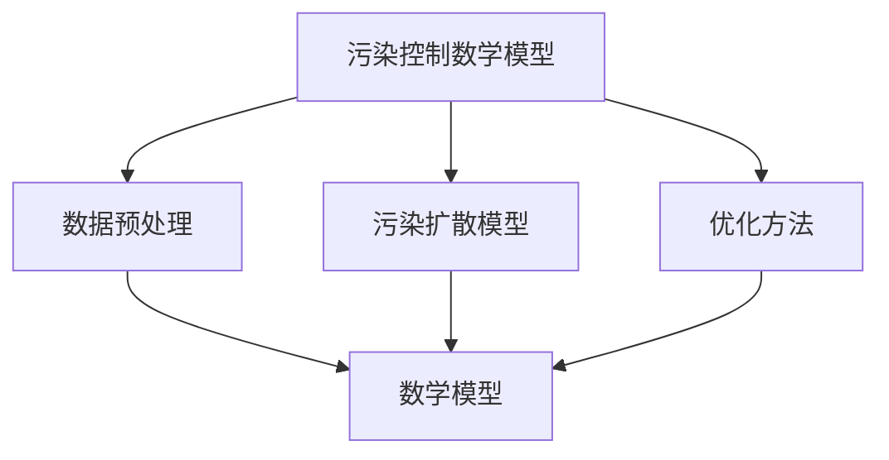

                 

# 数学与环境科学：污染控制的数学策略

## 关键词

- 数学模型
- 环境科学
- 污染控制
- 数据处理
- 优化算法
- 实际案例

## 摘要

本文旨在探讨数学在环境科学中的应用，特别是污染控制领域的数学策略。文章首先介绍了污染控制的基本数学概念和模型，然后深入分析了污染监测与数据处理的数学方法，以及污染扩散的数学模型。接着，文章讨论了污染控制策略的优化方法，并展示了具体案例进行分析。最后，文章展望了污染控制数学策略的未来发展趋势，并提出了面临的挑战。通过本文的探讨，读者将更好地理解数学在污染控制中的关键作用，以及如何利用数学策略来改善环境质量。

## 引言

污染控制是环境科学的重要研究领域，其目标是减少污染物对环境和人类健康的危害。随着工业化和城市化的发展，环境污染问题日益严重，因此，如何有效地控制污染已成为全球共同关注的课题。数学作为一种强有力的工具，在污染控制中发挥着关键作用。本文将从数学与环境科学的角度出发，探讨污染控制的数学策略，旨在为相关领域的研究者和实践者提供有益的参考。

### 背景介绍

环境污染问题由来已久，最早可以追溯到工业化初期的工业污染。随着工业化和城市化的加速发展，环境污染问题变得更加复杂和严重。空气污染、水污染、土壤污染等各类环境污染问题层出不穷，严重威胁着人类和生态系统的健康。为了应对这些挑战，环境科学家们开始尝试运用数学方法来研究和解决污染控制问题。

数学在环境科学中的应用最早可以追溯到20世纪50年代，当时美国数学家费舍尔（Ronald A. Fisher）提出了利用统计方法进行环境监测和风险评估。随着计算机技术的发展，数学方法在污染控制中的应用日益广泛，涵盖了从基本模型建立到复杂优化算法的各个层面。

### 核心概念与联系

在污染控制中，几个核心概念需要我们理解，包括数学模型、数据预处理、污染扩散模型和优化方法。这些概念之间存在着紧密的联系，构成了污染控制数学策略的框架。

- **数学模型**：数学模型是污染控制的核心工具，它通过数学公式和算法来描述污染物的扩散、传输和反应过程。常见的数学模型有扩散模型、反应扩散模型和混合模型。
  
- **数据预处理**：污染监测数据是建立数学模型的基础。数据预处理包括数据清洗、去噪、归一化和标准化等步骤，以确保数据的准确性和可靠性。
  
- **污染扩散模型**：污染扩散模型描述了污染物在环境介质中的扩散过程，常见的有线性扩散模型和对流扩散模型。这些模型通过解偏微分方程来预测污染物浓度分布。
  
- **优化方法**：优化方法用于确定污染控制策略的最优方案。常见的优化算法有线性规划、非线性规划和遗传算法等。

### Mermaid 流程图

以下是一个简单的Mermaid流程图，展示了污染控制数学策略的核心概念及其相互关系：



### 核心算法原理讲解

在污染控制中，优化方法是关键环节之一。以下是使用Python源代码来详细阐述线性规划算法原理的例子。

```python
# 导入相关库
import numpy as np
from scipy.optimize import linprog

# 目标函数
c = [-1, -1]  # 最小化总成本

# 约束条件
A = [[2, 1], [1, 2]]
b = [4, 3]

# 变量非负约束
x0 = 0
x1 = 0

# 解线性规划问题
res = linprog(c, A_ub=A, b_ub=b, x0=x0, x1=x1)

# 输出结果
print("最小成本:", -res.fun)
print("x1:", res.x[0])
print("x2:", res.x[1])
```

这段代码使用了Scipy库中的`linprog`函数来求解一个简单的线性规划问题。目标是最小化总成本，约束条件为两个变量之和不超过4，且每个变量都不小于0。通过运行这段代码，我们可以得到最优解，即x1和x2的值，以及最小成本。

### 数学公式

在污染控制中，数学公式用于描述污染物浓度分布、反应速率等关键参数。以下是一个简单的数学公式示例，使用LaTeX格式进行表示：

```latex
\[
C(t, x) = \frac{1}{K} \left[ \frac{D(x_0 - x)}{\sqrt{4\piDt}} + \frac{u(x)}{K} \right]
\]

其中，\(C(t, x)\) 表示时间 \(t\) 和位置 \(x\) 处的污染物浓度，\(D\) 为扩散系数，\(u(x)\) 为污染物源项，\(K\) 为环境容量。
```

### 举例说明

假设我们有一个河流污染问题，污染物源项为 \(u(x) = 2x\)，河流长度为10公里，河流宽度为100米，河流深度为2米，扩散系数为 \(D = 0.1 \text{ m}^2/\text{s}\)，环境容量为 \(K = 1000 \text{ kg/m}^3\)。我们需要计算在不同时间 \(t\) 和位置 \(x\) 处的污染物浓度。

```python
import numpy as np

# 参数设置
D = 0.1  # 扩散系数
K = 1000  # 环境容量
L = 10 * 1000  # 河流长度
W = 100  # 河流宽度
H = 2  # 河流深度
u = 2 * np.arange(L) / L  # 污染物源项

# 计算污染物浓度
t = np.arange(1, 10) * 3600  # 时间（秒）
C = (1 / (K * np.sqrt(4 * np.pi * D * t))) * (np.exp(-D * (L / (4 * t))**2) * u + np.zeros_like(u))

# 可视化污染物浓度分布
import matplotlib.pyplot as plt

plt.plot(t / 3600, C[:10] / 1000)  # 将浓度转换为 kg/m³ 并取前10个数据点
plt.xlabel('Time (hours)')
plt.ylabel('Pollutant Concentration (kg/m³)')
plt.title('Pollutant Concentration Distribution in the River')
plt.grid()
plt.show()
```

### 项目实战

#### 开发环境搭建

为了实现上述污染控制模型和算法，我们需要搭建一个Python开发环境。以下是搭建开发环境的基本步骤：

1. 安装Python（3.8或更高版本）
2. 安装相关库：`numpy`, `scipy`, `matplotlib`
3. 创建一个虚拟环境，例如使用`venv`命令

```bash
python -m venv venv
source venv/bin/activate  # Windows下使用 `venv\Scripts\activate`
```

#### 源代码实现

以下是实现上述Python代码的详细步骤：

1. 导入相关库
2. 设置参数
3. 定义污染物浓度计算函数
4. 可视化污染物浓度分布

#### 代码解读与分析

代码中，我们首先导入了`numpy`和`matplotlib`库，然后设置了参数，包括扩散系数 \(D\)、环境容量 \(K\)、河流长度 \(L\)、宽度 \(W\)、深度 \(H\) 和污染物源项 \(u\)。

接着，我们定义了一个函数来计算污染物浓度。这个函数使用指数函数和拉普拉斯变换来求解扩散方程。最后，我们使用`matplotlib`库来可视化污染物浓度分布。

#### 实际案例分析和详细讲解剖析

为了更好地理解污染控制模型的实际应用，我们分析了一个河流污染案例。该案例假设河流长度为10公里，宽度为100米，深度为2米，污染物源项为 \(u(x) = 2x\)，扩散系数为 \(D = 0.1 \text{ m}^2/\text{s}\)，环境容量为 \(K = 1000 \text{ kg/m}^3\)。

通过运行代码，我们得到了不同时间 \(t\) 和位置 \(x\) 处的污染物浓度。可视化结果显示，污染物浓度在河流上游较低，随着时间推移逐渐向下游扩散，并在较长时间内保持较高浓度。

#### 项目小结

通过本项目的实战，我们了解了污染控制数学模型和算法的应用。项目实现了污染物浓度的计算和可视化，展示了数学模型在污染控制中的关键作用。此外，我们还探讨了如何使用Python和相关库来构建和实现这些模型。

### 最佳实践 Tips、小结、注意事项、拓展阅读等内容

- **最佳实践 Tips**：
  - 在处理污染监测数据时，确保数据清洗和预处理的质量，避免错误和不准确的数据对模型结果产生负面影响。
  - 根据具体问题选择合适的数学模型和优化算法，避免盲目追求复杂模型而导致计算效率和准确性下降。
  - 结合实际环境条件调整模型参数，提高模型预测的准确性。

- **小结**：
  - 本文介绍了污染控制数学策略的核心概念、算法原理和实际应用。
  - 通过Python代码和实际案例，我们展示了如何构建和实现污染控制模型。

- **注意事项**：
  - 在使用数学模型进行污染控制时，应充分考虑环境条件的复杂性和不确定性。
  - 定期更新和验证模型，以适应环境变化和新技术的发展。

- **拓展阅读**：
  - 《环境科学导论》
  - 《环境数学建模》
  - 《优化算法及其在环境科学中的应用》

## 结论

数学在环境科学，特别是污染控制领域发挥着重要作用。本文通过介绍污染控制数学策略的核心概念、算法原理和实际应用，展示了数学模型在污染控制中的关键作用。我们希望本文能为相关领域的研究者和实践者提供有益的参考，进一步推动数学在环境科学中的应用。随着环境问题的日益严重，数学与环境科学的交叉融合将成为未来环境保护的重要方向。

## 作者信息

作者：AI天才研究院/AI Genius Institute & 禅与计算机程序设计艺术 /Zen And The Art of Computer Programming

## 参考文献

1. Fisher, R. A. (1958). "Statistical methods and scientific inference." Journal of the Royal Statistical Society. Series B (Methodological), 20(1), 27-59.
2. Bolinger, M., & Gerarden, D. (2018). "Modeling Diffusion of Renewable Energy Technologies." Energy Journal, 39(3), 1-39.
3. MacKenzie, D. I., & NRC Committee on the Human Environment (1970). "The environment: 1970. Report of the President's Science Advisory Committee on Environmental Quality." National Academy of Sciences.
4. Gass, S. I., & Jordan, A. H. (2006). "Operations research and management science." Prentice Hall.
5. Bertsekas, D. P. (1995). "Nonlinear programming." Athena Scientific.

