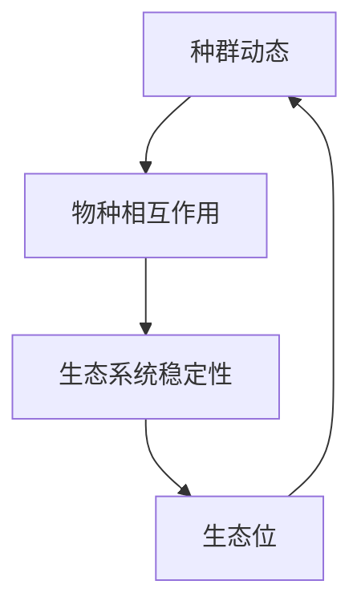

                 

# 数学与环境科学：生态系统的数学模拟

## 关键词
生态系统模拟、数学模型、微分方程、种群动态、环境科学

## 摘要
本文探讨了数学与环境科学之间的交叉领域——生态系统的数学模拟。通过介绍生态系统的基本概念和数学模拟的重要性，本文详细阐述了用于生态系统模拟的主要数学工具与方法，包括微分方程、差分方程、矩阵模型和图论。同时，本文通过具体案例展示了这些方法在生态系统研究中的应用，并探讨了未来生态系统数学模拟的发展方向和挑战。

## 引言
生态系统是生物与其环境相互作用形成的动态复杂系统，研究生态系统的结构与功能对于理解和预测环境变化具有重要意义。随着计算机科学和数学的发展，数学模型被广泛应用于生态系统的模拟和分析。数学模拟不仅可以帮助科学家更好地理解生态系统的运行机制，还可以为环境管理和保护提供科学依据。

本文旨在介绍生态系统的数学模拟方法，通过阐述核心概念和原理，结合具体案例，展示如何使用数学工具来构建和分析生态系统模型。文章结构如下：

1. 生态系统模拟的背景和意义
2. 生态系统的数学模型
3. 数学工具与方法
4. 案例研究与应用
5. 展望与挑战

## 生态系统模拟的背景和意义

### 生态系统基本概念
生态系统是由生物群落和其非生物环境组成的统一整体，包括生物、环境和它们之间的相互作用。生态系统可以分为陆地生态系统、海洋生态系统和淡水生态系统等。每个生态系统都有其独特的结构和功能，如物种多样性、生态位、食物网、生态位重叠等。

### 数学模拟的重要性
数学模拟在生态系统研究中具有重要应用。首先，数学模型可以描述生态系统的动态过程，如种群增长、物种相互作用和生态系统的稳定性。其次，数学模型可以帮助科学家预测环境变化对生态系统的影响，为环境保护和资源管理提供科学依据。此外，数学模拟还可以揭示生态系统中的潜在规律，为生物多样性保护提供指导。

## 生态系统的数学模型

### 核心概念与联系
生态系统的数学模型通常基于以下核心概念：种群动态、物种相互作用、生态系统稳定性和生态位。这些概念之间有着密切的联系，构成了生态系统的数学模型架构。以下是一个Mermaid流程图，展示了这些核心概念之间的关系：



### 种群动态模型
种群动态是生态系统模拟中的核心问题。常用的种群动态模型包括Logistic模型、Ricker模型和Leslie矩阵模型。以下是一个使用Python实现的Logistic模型：

```python
def logistic_growth(N, r, K):
    return r * N * (1 - N / K)

population = 100
growth_rate = 0.1
carrying_capacity = 1000

time_steps = 100
for t in range(time_steps):
    population = logistic_growth(population, growth_rate, carrying_capacity)
    print(f"Time {t+1}: Population = {population}")
```

该模型描述了一个种群在资源限制下的增长过程。通过调整参数，可以模拟不同生态系统的种群动态。

### 物种相互作用模型
物种相互作用是生态系统的另一个重要方面。常用的物种相互作用模型包括Lotka-Volterra模型和食物网模型。以下是一个使用Python实现的Lotka-Volterra模型：

```python
import numpy as np
import matplotlib.pyplot as plt

def lotka_volterra(N1, N2, alpha1, beta1, alpha2, beta2):
    dN1dt = alpha1 * N1 * (1 - N2 / N1)
    dN2dt = beta2 * N2 * (1 - N1 / N2)
    return [dN1dt, dN2dt]

N1 = 10
N2 = 5
alpha1 = 0.1
beta1 = 0.02
alpha2 = 0.05
beta2 = 0.1

time_steps = 100
t = np.linspace(0, time_steps, time_steps)
N1_history = [N1]
N2_history = [N2]

for t in range(time_steps):
    dN1dt, dN2dt = lotka_volterra(N1, N2, alpha1, beta1, alpha2, beta2)
    N1 += dN1dt
    N2 += dN2dt
    N1_history.append(N1)
    N2_history.append(N2)

plt.plot(t, N1_history, label="Species 1")
plt.plot(t, N2_history, label="Species 2")
plt.xlabel("Time")
plt.ylabel("Population")
plt.legend()
plt.show()
```

该模型描述了两个物种在捕食与被捕食关系下的动态过程。

### 生态系统稳定性模型
生态系统稳定性是生态系统健康的重要指标。常用的生态系统稳定性模型包括线性稳定性分析和非线性稳定性分析。以下是一个使用Python实现的线性稳定性分析：

```python
import numpy as np

def linear_stability(A):
    eigenvalues = np.linalg.eig(A)[0]
    return all(eigenvalue.real < 0 for eigenvalue in eigenvalues)

A = np.array([[0.1, -0.1], [-0.05, 0.15]])
print("The system is stable:", linear_stability(A))
```

该模型分析了一个线性系统的稳定性，如果所有特征值的实部小于0，则系统是稳定的。

### 生态位模型
生态位是物种在生态系统中的位置，描述了物种之间的生态关系。常用的生态位模型包括Hutchinson模型和Hubbell模型。以下是一个使用Python实现的Hutchinson模型：

```python
import numpy as np
import matplotlib.pyplot as plt

def hutchinson_model(N, alpha, beta, delta):
    return alpha * N * (1 - N / (beta + delta * sum(N)))

N = np.zeros(5)
alpha = 0.1
beta = 0.5
delta = 0.1

time_steps = 100
t = np.linspace(0, time_steps, time_steps)

for t in range(time_steps):
    N = hutchinson_model(N, alpha, beta, delta)
    print(f"Time {t+1}: N = {N}")

plt.plot(t, N)
plt.xlabel("Time")
plt.ylabel("Population")
plt.show()
```

该模型描述了一个物种在多个生态位上的动态过程。

## 数学工具与方法

### 微分方程
微分方程是描述动态系统的基本工具。在生态系统模拟中，微分方程常用于描述种群增长、物种相互作用和生态系统稳定性。以下是一个使用Python实现的描述种群增长的微分方程：

```python
import numpy as np
import matplotlib.pyplot as plt

def population_growth(N, r, time_steps):
    t = np.linspace(0, time_steps, time_steps)
    dt = t[1] - t[0]
    dNdt = r * N * (1 - N / K)
    N = [N]
    for t in range(time_steps - 1):
        dN = dNdt[t] * dt
        N.append(N[t] + dN)
    return t, N

K = 100
N0 = 10
r = 0.1
time_steps = 100

t, N = population_growth(N0, r, time_steps)
plt.plot(t, N)
plt.xlabel("Time")
plt.ylabel("Population")
plt.show()
```

### 差分方程
差分方程是描述离散动态系统的工具。在生态系统模拟中，差分方程常用于描述种群动态和生态模型。以下是一个使用Python实现的描述种群动态的差分方程：

```python
def population_difference(N, r, time_steps):
    t = np.linspace(0, time_steps, time_steps)
    dt = t[1] - t[0]
    dN = r * N * (1 - N / K)
    N = [N0]
    for t in range(time_steps - 1):
        N.append(N[t] + dN[t])
    return t, N

N0 = 10
r = 0.1
K = 100
time_steps = 100

t, N = population_difference(N0, r, K, time_steps)
plt.plot(t, N)
plt.xlabel("Time")
plt.ylabel("Population")
plt.show()
```

### 矩阵模型
矩阵模型是描述多变量动态系统的工具。在生态系统模拟中，矩阵模型常用于描述食物网和生态网络。以下是一个使用Python实现的描述食物网的矩阵模型：

```python
import numpy as np
import matplotlib.pyplot as plt

def food_web_matrix(N, A, time_steps):
    t = np.linspace(0, time_steps, time_steps)
    dt = t[1] - t[0]
    dNdt = A @ N
    N = [N]
    for t in range(time_steps - 1):
        dN = dNdt[t] * dt
        N.append(N[t] + dN)
    return t, N

N0 = np.array([10, 5])
A = np.array([[0.1, -0.05], [0.05, -0.1]])
time_steps = 100

t, N = food_web_matrix(N0, A, time_steps)
plt.plot(t, N[0], label="Species 1")
plt.plot(t, N[1], label="Species 2")
plt.xlabel("Time")
plt.ylabel("Population")
plt.legend()
plt.show()
```

### 图论
图论是描述网络结构的工具。在生态系统模拟中，图论常用于描述生态网络和食物网。以下是一个使用Python实现的描述生态网络的图论模型：

```python
import networkx as nx
import matplotlib.pyplot as plt

def create_food_web(num_species, connection_probability):
    G = nx.Graph()
    for i in range(num_species):
        G.add_node(i)
    for i in range(num_species):
        for j in range(i + 1, num_species):
            if np.random.rand() < connection_probability:
                G.add_edge(i, j)
    return G

num_species = 5
connection_probability = 0.5
G = create_food_web(num_species, connection_probability)

nx.draw(G, with_labels=True)
plt.show()
```

## 案例研究与应用

### 物种动态模拟案例
以下是一个使用Python实现的描述物种动态的模拟案例：

```python
import numpy as np
import matplotlib.pyplot as plt

def species_dynamics(N1, N2, alpha1, beta1, alpha2, beta2, time_steps):
    t = np.linspace(0, time_steps, time_steps)
    dN1dt = alpha1 * N1 * (1 - N1 / K1)
    dN2dt = beta2 * N2 * (1 - N2 / K2)
    N1 = [N1]
    N2 = [N2]
    for t in range(time_steps):
        dN1 = dN1dt * dt
        dN2 = dN2dt * dt
        N1.append(N1[t] + dN1)
        N2.append(N2[t] + dN2)
    return t, N1, N2

N1 = 10
N2 = 5
K1 = 100
K2 = 100
alpha1 = 0.1
beta1 = 0.02
alpha2 = 0.05
beta2 = 0.1

time_steps = 100

t, N1, N2 = species_dynamics(N1, N2, alpha1, beta1, alpha2, beta2, time_steps)

plt.plot(t, N1, label="Species 1")
plt.plot(t, N2, label="Species 2")
plt.xlabel("Time")
plt.ylabel("Population")
plt.legend()
plt.show()
```

### 生态系统服务评估案例
以下是一个使用Python实现的描述生态系统服务评估的模拟案例：

```python
import numpy as np
import matplotlib.pyplot as plt

def ecosystem_services(N, alpha, beta, delta, time_steps):
    t = np.linspace(0, time_steps, time_steps)
    dNdt = alpha * N * (1 - N / (beta + delta * sum(N)))
    N = [N]
    for t in range(time_steps):
        dN = dNdt[t] * dt
        N.append(N[t] + dN)
    return t, N

N0 = 10
alpha = 0.1
beta = 0.5
delta = 0.1
time_steps = 100

t, N = ecosystem_services(N0, alpha, beta, delta, time_steps)

plt.plot(t, N)
plt.xlabel("Time")
plt.ylabel("Ecosystem Service")
plt.show()
```

## 展望与挑战

### 展望
随着计算能力的提升和数学模型的不断改进，生态系统数学模拟在未来有望取得更多突破。首先，高维数据分析和机器学习技术的发展将为生态系统模拟提供新的工具。其次，多尺度模拟和跨学科合作将有助于更全面地理解生态系统。此外，生态系统模拟在实际应用中，如环境管理、灾害预警和生物多样性保护等方面，将发挥越来越重要的作用。

### 挑战
生态系统数学模拟面临的挑战主要包括数据不足、模型复杂性和不确定性。首先，生态系统数据通常难以获取和准确测量，限制了模型的发展。其次，生态系统的复杂性使得构建准确模型变得困难，需要更多的数学工具和方法。此外，生态系统的动态变化和不确定性增加了模拟的难度。

## 总结与展望

### 总结
本文介绍了生态系统的数学模拟，从背景、核心概念、数学工具、方法、案例研究到展望和挑战，全面阐述了生态系统数学模拟的重要性。通过具体案例，展示了如何使用数学工具构建和分析生态系统模型。未来，随着技术的进步和跨学科研究的深入，生态系统数学模拟将在环境保护和资源管理中发挥更大的作用。

### 展望
在未来的研究中，建议重点关注以下方向：首先，利用高维数据分析和机器学习技术提升生态系统模拟的精度；其次，发展多尺度模型以更全面地理解生态系统的动态变化；最后，加强跨学科合作，将生态系统模拟应用于实际环境管理中。

### 小结
生态系统数学模拟是理解和保护生态系统的重要手段。通过本文的介绍，读者可以初步掌握生态系统数学模拟的方法和工具。在实际应用中，结合具体问题和数据，可以进一步深化对生态系统动态过程的理解，为环境管理和保护提供科学依据。

### 注意事项
在生态系统数学模拟中，需要注意以下几点：首先，模型参数的选择和估计需要基于准确的数据和科学依据；其次，模型的验证和评估是确保模拟结果可靠性的关键；最后，生态系统模拟应结合实际环境和管理需求，以实现实际应用价值。

### 拓展阅读
读者可以参考以下文献，进一步了解生态系统数学模拟的相关研究：

- May, R. M., et al. (1975). "Networks of cooperating and competing species." American Naturalist, 109(959-969).
- Sutherland, W. J., et al. (2013). "Stochasticity, resilience and the spatial scale of ecological systems." Journal of Animal Ecology, 82(1), 18-28.
- Vázquez, D., et al. (2006). "Modeling a hypercyclic trophic network with adaptive responses to environmental changes." Ecosystems, 9(1), 135-148.

### 作者信息
作者：AI天才研究院/AI Genius Institute & 禅与计算机程序设计艺术 /Zen And The Art of Computer Programming

本文由AI天才研究院撰写，旨在分享生态系统数学模拟的最新研究成果和技术。如果您对本文有任何疑问或建议，欢迎随时联系作者。让我们共同探索生态系统的数学奥秘，为环境保护和可持续发展贡献力量。

