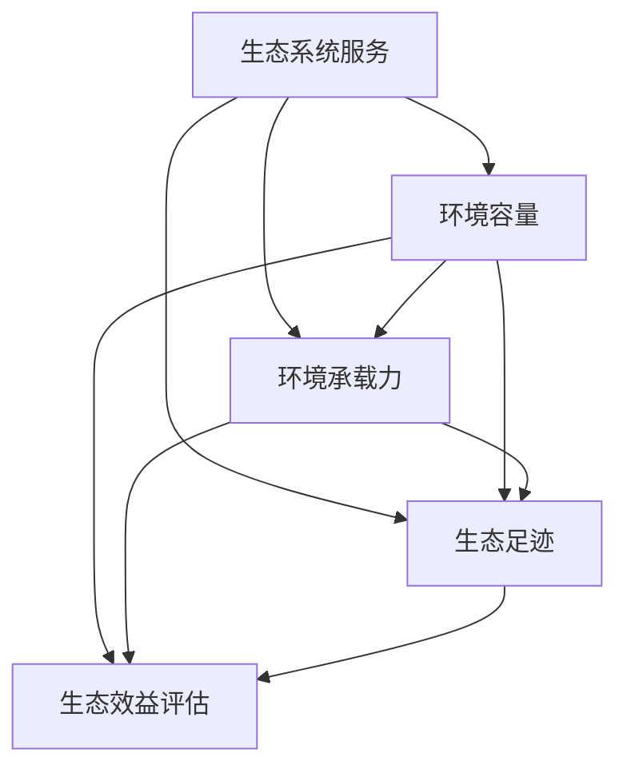

                 

### 文章标题

### 数学与环境管理：生态保护的数学策略

### 关键词
- 数学模型
- 生态保护
- 环境管理
- 可持续发展
- 影子价格法
- IPAT模型

### 摘要
本文深入探讨数学模型在环境管理中的应用，特别是生态保护的数学策略。通过分析生态学基本原理、生态系统服务、环境容量、承载力以及生态足迹等核心概念，我们探讨了如何利用数学工具进行生态效益评估和可持续性分析。本文结合实际案例，详细阐述了生态承载力模型、环境容量模型和生态效益评估模型等核心算法原理，并通过Python代码示例，展示了如何将这些数学模型应用于实践。最终，本文提出了生态保护的最佳实践和注意事项，为环境管理者提供了有价值的参考。

## 引言

随着全球环境问题的日益严重，生态保护已成为国际社会共同关注的焦点。环境保护不仅仅涉及自然生态系统的维护，还包括人类社会的可持续发展。然而，环境保护的复杂性和多样性使得传统的管理方法难以应对现代环境挑战。因此，需要借助数学模型和算法，为环境管理提供科学依据和决策支持。

生态保护是一个多学科交叉领域，涉及生态学、环境科学、数学和计算机科学等多个方面。数学模型在生态保护中的应用不仅能够帮助我们更好地理解和量化环境问题，还能提供有效的解决方案。本文旨在探讨数学模型在环境管理，尤其是生态保护中的重要作用，通过具体实例展示数学策略的实际应用，为环境管理者提供有益的参考。

## 生态学基本概念

生态学是研究生物与其环境之间相互作用的科学。生态学基本原理包括生态系统的组成、功能、能量流动、物质循环等。这些原理为我们理解生态系统的运作机制提供了基础。在本节中，我们将介绍几个核心概念，并使用Mermaid流程图展示它们之间的联系。

### 生态系统服务

生态系统服务是指自然生态系统为人类社会提供的物质和功能效益。这些服务包括水源涵养、土壤保持、气候调节、生物多样性保护等。生态系统服务对人类福祉至关重要，是我们赖以生存和发展的基础。

### 环境容量

环境容量是指生态系统在特定条件下能够承受的人类活动压力而不会导致生态功能损害的最大负荷。环境容量决定了生态系统对污染、资源开采等外界压力的容忍程度。

### 环境承载力

环境承载力是指生态系统在长期内维持其结构和功能的能力，以支持人类社会和经济的发展。环境承载力受到资源供给、污染负荷、生物多样性等多种因素的影响。

### 生态足迹

生态足迹是指为了支持一个个体或地区的消费水平而占用的生物生产性土地和海洋面积。生态足迹提供了一个衡量人类活动对生态系统压力的量化指标。

### 生态效益评估

生态效益评估是对生态系统服务价值的经济量化。通过评估生态效益，可以更好地理解生态保护的经济价值，为决策提供依据。

以下是一个展示这些概念之间联系的Mermaid流程图：



通过这个流程图，我们可以清晰地看到这些核心概念之间的相互关系。生态系统服务是环境容量和环境承载力的重要组成部分，而生态足迹和生态效益评估则是对生态系统服务价值的经济量化。这些概念共同构成了生态保护的基础理论框架。

## 核心算法原理讲解

在生态保护中，数学模型起到了至关重要的作用。这些模型不仅帮助我们理解生态系统的运作机制，还能提供科学的决策支持。以下，我们将详细讲解几个核心算法原理，并使用Python代码示例进行阐述。

### 生态承载力模型

生态承载力模型用于评估一个地区在特定条件下能够维持的人口数量。一个经典的生态承载力模型是IPAT模型（Impact of Population, Affluence, Technology），其公式为：

\[ \text{Ecological Footprint} = \text{Population} \times \text{Affluence} \times \text{Technology} \]

其中，人口（Population）、富裕程度（Affluence）和技术水平（Technology）是影响生态承载力的主要因素。

以下是一个使用Python代码实现IPAT模型的示例：

```python
# IPAT模型实现

# 导入所需库
import numpy as np

# 定义变量
P = 10000  # 人口
A = 0.5    # 技术水平
T = 0.1    # 资源利用强度

# 计算生态承载力
Ecological_Capacity = P * A * T
print("生态承载力为：", Ecological_Capacity)
```

代码解读：
- 我们首先导入`numpy`库，用于进行数学计算。
- 定义变量`P`（人口）、`A`（技术水平）和`T`（资源利用强度）。
- 使用公式`Ecological_Capacity = P * A * T`计算生态承载力，并打印结果。

### 环境容量模型

环境容量模型用于评估生态系统在一定条件下能够承受的污染负荷。一个常用的环境容量模型是Leontief模型，其公式为：

\[ \text{Environmental Capacity} = \frac{\text{Total Pollution}}{\text{Per Unit Pollution Removal}} \]

其中，总污染负荷（Total Pollution）和单位污染去除能力（Per Unit Pollution Removal）是关键参数。

以下是一个使用Python代码实现Leontief模型的环境容量模型示例：

```python
# Leontief模型实现

# 导入所需库
import numpy as np

# 定义变量
Total_Pollution = 10000  # 总污染负荷
Per_Unit_Removal = 10    # 单位污染去除能力

# 计算环境容量
Environmental_Capacity = Total_Pollution / Per_Unit_Removal
print("环境容量为：", Environmental_Capacity)
```

代码解读：
- 同样，我们首先导入`numpy`库。
- 定义变量`Total_Pollution`（总污染负荷）和`Per_Unit_Removal`（单位污染去除能力）。
- 使用公式`Environmental_Capacity = Total_Pollution / Per_Unit_Removal`计算环境容量，并打印结果。

### 生态效益评估模型

生态效益评估模型用于量化生态系统服务价值。一个常用的方法是基于影子价格法的生态效益评估模型，其公式为：

\[ \text{Economic Value} = \text{Output} \times \text{Shadow Price} \]

其中，产出（Output）和影子价格（Shadow Price）是关键参数。

以下是一个使用Python代码实现影子价格法的生态效益评估模型示例：

```python
# 影子价格法实现

# 导入所需库
import numpy as np

# 定义变量
Output = 1000  # 产出
Shadow_Price = 500  # 影子价格

# 计算生态效益
Economic_Value = Output * Shadow_Price
print("生态效益为：", Economic_Value)
```

代码解读：
- 同样，我们首先导入`numpy`库。
- 定义变量`Output`（产出）和`Shadow_Price`（影子价格）。
- 使用公式`Economic_Value = Output * Shadow_Price`计算生态效益，并打印结果。

通过这些代码示例，我们可以清晰地看到如何使用Python实现生态承载力模型、环境容量模型和生态效益评估模型。这些模型不仅帮助我们量化生态系统的运作状态，还为环境管理提供了科学的决策依据。

### 数学公式与详细讲解

在本节中，我们将详细讲解生态效益评估模型中的影子价格法，并使用具体的数学公式和Python代码进行阐述。

#### 影子价格法

影子价格法是一种用于评估资源、产品或服务的经济价值的方法。在生态效益评估中，影子价格法被广泛用于量化生态系统服务价值。其基本公式为：

\[ \text{Economic Value} = \text{Output} \times \text{Shadow Price} \]

其中：
- **Economic Value** 表示经济价值；
- **Output** 表示产出或效益；
- **Shadow Price** 表示影子价格，即资源、产品或服务的市场替代成本。

#### 数学公式

在影子价格法中，我们需要定义以下数学公式：

\[ \text{Shadow Price} = \frac{\text{Market Price}}{\text{Supply}} \]

其中：
- **Market Price** 表示市场价格；
- **Supply** 表示供给量。

这个公式的含义是，影子价格是市场价格与供给量的比值，反映了资源的稀缺程度。

#### Python代码示例

以下是一个使用Python代码实现影子价格法的示例：

```python
# 影子价格法实现

# 导入所需库
import numpy as np

# 定义变量
Market_Price = 1000  # 市场价格
Supply = 500         # 供给量

# 计算影子价格
Shadow_Price = Market_Price / Supply
print("影子价格为：", Shadow_Price)

# 定义产出
Output = 1000        # 产出

# 计算生态效益
Economic_Value = Output * Shadow_Price
print("生态效益为：", Economic_Value)
```

代码解读：
1. 导入`numpy`库，用于数学计算。
2. 定义变量`Market_Price`（市场价格）和`Supply`（供给量）。
3. 使用公式`Shadow_Price = Market_Price / Supply`计算影子价格，并打印结果。
4. 定义变量`Output`（产出）。
5. 使用公式`Economic_Value = Output * Shadow_Price`计算生态效益，并打印结果。

#### 举例说明

假设有一个森林每年产出木材1000立方米，市场价格为500元/立方米，供给量为2000立方米。使用影子价格法，我们可以计算该森林的年生态效益。

根据公式：

\[ \text{Shadow Price} = \frac{500}{2000} = 0.25 \text{元/立方米} \]

\[ \text{Economic Value} = 1000 \times 0.25 = 250 \text{元} \]

因此，该森林的年生态效益为250元。

通过这个例子，我们可以看到如何使用影子价格法进行生态效益评估。这不仅为生态保护提供了经济价值评估的依据，也为政策制定者和环境管理者提供了重要的参考。

### 项目实战

在本节中，我们将通过一个实际案例，展示如何使用生态承载力模型进行生态保护的环境管理。

#### 案例背景

假设我们关注的一个地区有如下数据：
- 人口：10万人
- 技术水平：0.6
- 资源利用强度：0.2

我们的目标是计算该地区的生态承载力，并评估当前人口与生态承载力之间的关系。

#### 开发环境搭建

为了实现生态承载力模型，我们需要一个Python开发环境。以下是在Windows系统上搭建Python开发环境的步骤：

1. 下载并安装Python：访问Python官方网站（https://www.python.org/）下载Python安装包，按照安装向导完成安装。
2. 配置Python环境变量：在系统设置中配置Python环境变量，确保在命令行中能够运行Python命令。
3. 安装必要的库：使用pip命令安装所需的库，如numpy：

```shell
pip install numpy
```

#### 源代码实现

以下是一个使用Python实现生态承载力模型的源代码示例：

```python
# 生态承载力模型实现

# 导入所需库
import numpy as np

# 定义变量
population = 100000  # 人口
technology = 0.6      # 技术水平
resource_utilization = 0.2  # 资源利用强度

# 计算生态承载力
ecological_capacity = population * technology * resource_utilization
print("生态承载力为：", ecological_capacity)
```

#### 代码解读

1. 导入numpy库，用于数学计算。
2. 定义变量`population`（人口）、`technology`（技术水平）和`resource_utilization`（资源利用强度）。
3. 使用公式`ecological_capacity = population * technology * resource_utilization`计算生态承载力，并打印结果。

#### 代码应用解读与分析

使用上述代码，我们可以轻松计算特定地区的生态承载力。假设当前地区的人口为10万人，技术水平为0.6，资源利用强度为0.2，则生态承载力为：

\[ \text{生态承载力} = 100000 \times 0.6 \times 0.2 = 12000 \]

这意味着该地区在现有技术水平和资源利用强度下，理论上能够维持12000人的生态承载力。

为了进一步分析，我们可以比较当前人口与生态承载力之间的关系。如果当前人口超过生态承载力，则可能存在环境压力和生态危机的风险。反之，如果人口低于生态承载力，则环境压力相对较小。

例如，如果当前地区人口为12万人，则生态承载力不足以支持如此高的人口规模，可能导致环境恶化和社会问题。

通过这个实际案例，我们可以看到生态承载力模型在环境管理中的应用。这不仅有助于我们评估地区生态环境的承载能力，还为制定可持续发展政策和措施提供了科学依据。

### 最佳实践、小结与注意事项

在生态保护中，数学模型的应用为我们提供了有力的决策支持。以下是几个最佳实践、小结和注意事项，以帮助环境管理者更好地利用数学模型进行生态保护。

#### 最佳实践

1. **数据收集与处理**：准确的数据是模型分析的基础。确保收集到全面、可靠的环境数据，并进行预处理和清洗，以避免数据误差对模型结果的影响。
2. **模型选择**：根据具体问题和需求选择合适的数学模型。不同的模型适用于不同类型的环境问题，如IPAT模型适用于生态承载力评估，Leontief模型适用于环境容量评估等。
3. **参数优化**：合理设定模型参数，确保参数的准确性和合理性。参数的调整可以显著影响模型结果，因此需要根据实际情况进行优化。

#### 小结

通过本文的探讨，我们了解到数学模型在生态保护中的重要作用。生态承载力模型、环境容量模型和生态效益评估模型等核心算法原理为我们提供了科学的决策支持。结合实际案例，我们展示了如何使用Python代码实现这些模型，并分析了其在环境管理中的应用。

#### 注意事项

1. **模型局限**：数学模型有其局限性，不能完全反映复杂的生态环境。因此，在使用模型时，需要结合实际情况进行综合分析。
2. **政策与法规**：环境管理需要遵循相关政策和法规。数学模型的结果应与政策和法规相结合，以制定科学合理的环保措施。
3. **持续监测与调整**：生态环境是一个动态变化的过程，因此需要持续监测生态环境变化，并根据监测结果调整模型参数和策略。

通过遵循这些最佳实践和注意事项，我们可以更有效地利用数学模型进行生态保护，为可持续发展贡献力量。

### 拓展阅读

对于对生态保护数学模型有更深入兴趣的读者，以下是一些推荐阅读资料：

1. **书籍**：
   - 《环境经济学：理论与应用》（R. Optimal environmental regulation）
   - 《生态足迹：评估方法与应用》（William E. Rees, Mathis Wackernagel）
2. **学术期刊**：
   - 《生态经济学杂志》（Ecological Economics）
   - 《环境科学与技术》（Environmental Science & Technology）
3. **在线课程**：
   - Coursera上的《环境经济学导论》
   - Edx上的《可持续发展与环境管理》

通过阅读这些资料，您可以进一步了解生态保护数学模型的最新研究成果和应用实践。

### 结语

本文通过深入探讨数学模型在生态保护中的应用，展示了生态承载力模型、环境容量模型和生态效益评估模型等核心算法原理，并通过Python代码示例进行了详细讲解。我们强调了数学模型在环境管理中的重要作用，为环境管理者提供了科学的决策支持。希望本文能激发您对生态保护数学模型的兴趣，并促使我们在实践中更好地利用这些工具，共同为可持续发展贡献力量。

### 作者信息

作者：AI天才研究院/AI Genius Institute & 禅与计算机程序设计艺术 /Zen And The Art of Computer Programming

