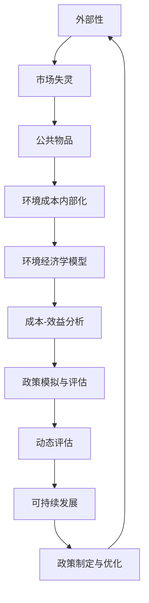

                 

### 背景介绍

环境经济学作为一门跨学科的研究领域，结合了经济学和环境科学的理论与方法，致力于解决环境问题与经济发展之间的矛盾。近年来，随着全球环境问题的日益严重，环境经济学的重要性愈加凸显。气候变化、空气污染、水资源短缺等问题不仅影响了人类的生活质量，还对全球经济的可持续发展构成了严峻挑战。因此，如何制定科学、有效的环境政策，成为各国政府和社会各界关注的焦点。

环境政策的制定需要依托于对环境问题深刻理解的基础上，而这一过程中数学工具的运用变得不可或缺。数学作为一种精确、系统的分析工具，可以在环境政策的评估、制定与优化中发挥关键作用。通过对数学工具的合理应用，我们可以更准确地量化环境成本与效益，评估政策效果，优化资源配置，从而为环境政策的制定提供科学依据。

数学在环境经济学中的应用主要体现在以下几个方面：

1. **模型构建**：环境经济学中的许多问题可以通过数学模型来描述和解决。例如，经济增长与环境质量的关系可以用环境库兹涅茨曲线（EKC）模型来表述，该模型通过数学方程描述环境质量与经济增长之间的非线性关系。

2. **成本-效益分析**：环境政策的成本和效益需要进行量化评估，成本-效益分析（CBA）是其中的一种常用方法。通过数学公式和计算，可以评估政策实施的经济成本及其带来的经济效益，从而为政策的可行性提供数据支持。

3. **政策模拟与评估**：利用计算机模拟技术，可以预测环境政策在不同情景下的效果，并通过数学模型对政策的效果进行评估。这有助于政府和企业更全面地了解政策的影响，从而做出更加明智的决策。

4. **动态评估**：环境问题通常具有长期性和复杂性，动态评估可以分析政策在不同时间点的效果，并预测未来可能出现的变化。通过数学模型和动态规划方法，可以更准确地评估政策的长远影响。

本文将围绕数学与环境经济学的关系，深入探讨环境政策的数学评估方法。首先，我们将介绍环境经济学的基本概念和理论，并解释数学工具如何帮助理解和分析这些概念。接着，我们将详细讨论环境经济模型，包括常用的库兹涅茨曲线模型、经济增长与环境质量模型等，并展示这些模型的数学原理。随后，我们将介绍成本-效益分析和成本-分配分析的方法，展示如何运用数学工具进行政策评估。接下来，我们将探讨政策模拟与评估、动态评估的方法，并介绍如何使用数学模型进行环境政策的预测和评估。最后，我们将通过实际案例展示数学工具在环境政策评估中的应用，并提出未来研究的方向和挑战。

通过本文的探讨，我们希望能够为读者提供一个全面、系统的视角，理解数学在环境经济学中的重要性，以及如何运用数学工具进行环境政策的科学评估。这将有助于政策制定者、研究者和社会各界更好地应对环境挑战，实现可持续发展的目标。

### 核心概念与联系

在环境经济学中，有几个核心概念是理解环境政策数学评估的基础。这些概念包括外部性、公共物品、环境成本内部化等，它们之间存在着密切的联系和相互作用。下面，我们将通过Mermaid流程图来展示这些概念之间的相互关系，以便更直观地理解它们。



**图1：环境经济核心概念相互关系流程图**

1. **外部性（A）**：外部性是指一个人或经济单位的行为对其他个体或经济单位产生了影响，而这种影响并未在市场价格中反映出来。在环境经济学中，外部性通常表现为环境污染和资源消耗，导致市场失灵（B）。

2. **公共物品（C）**：公共物品是指那些一旦被提供，难以排除非付费者使用，且一人使用不会减少他人使用的物品或服务。环境资源，如清洁空气和水，通常被视为公共物品。

3. **环境成本内部化（D）**：环境成本内部化是指将外部成本纳入市场价格中，使得市场机制能够反映环境资源的真实价值。通过政策手段，如税收、补贴和排放权交易，可以实现外部性的内部化。

4. **环境经济学模型（E）**：环境经济学模型用于描述环境成本、效益和政策效果。常见的模型包括环境库兹涅茨曲线（EKC）模型，它描述了经济增长与环境质量之间的关系。

5. **成本-效益分析（F）**：成本-效益分析是一种评估政策成本和效益的方法，通过比较政策实施的总成本与总效益，判断政策的可行性。

6. **政策模拟与评估（G）**：政策模拟与评估使用数学模型和计算机模拟技术，预测政策在不同情景下的效果，并进行效果评估。

7. **动态评估（H）**：动态评估考虑政策在不同时间点的效果，分析政策对长期环境影响的预测。

8. **可持续发展（I）**：可持续发展强调满足当前需求而不损害未来代满足需求的能力。政策制定和优化（J）旨在实现这一目标，确保经济、社会和环境的协调发展。

这些核心概念之间的联系构成了环境经济学研究的框架，为政策制定提供了理论依据和数学工具。通过理解和应用这些概念，我们可以更有效地分析和评估环境政策，实现可持续发展目标。

### 环境经济模型

环境经济模型是环境经济学中的核心工具，用于描述环境成本、效益和政策效果。其中，最常用的模型之一是环境库兹涅茨曲线（EKC）模型，该模型试图解释经济增长与环境质量之间的复杂关系。除此之外，经济增长与环境质量模型也是理解环境经济学的重要模型。在本节中，我们将详细讨论这些模型的数学原理，并通过Python源代码和数学公式进行解释。

#### 环境库兹涅茨曲线（EKC）模型

环境库兹涅茨曲线模型是基于经济学家罗伯特·库兹涅茨（Robert Kuznets）的收入不平等曲线提出的。该模型假设经济增长与环境质量之间存在一个倒U型关系。即，随着经济的增长，环境质量先恶化后改善，最终达到一个最优水平。

数学上，EKC模型可以用以下方程表示：

$$
E_{quality} = \alpha N^{-\gamma} K^{\beta} A^{\delta} (1 - \lambda)
$$

其中，$E_{quality}$ 表示环境质量，$N$ 表示人口规模，$K$ 表示资本存量，$A$ 表示技术水平，$\lambda$ 表示环境政策强度，$\alpha$、$\beta$、$\delta$ 和 $\gamma$ 是模型参数。

下面是一个简单的Python实现，用于模拟EKC模型的曲线：

```python
import matplotlib.pyplot as plt
import numpy as np

# EKC模型参数
alpha = 1
beta = 0.5
delta = 0.2
gamma = 0.3

# 模拟不同经济水平下的环境质量
N_values = np.linspace(0.1, 10, 100)
K_values = np.linspace(0.1, 10, 100)
A_values = np.linspace(0.1, 10, 100)

EQC = alpha * (N_values ** (-gamma)) * (K_values ** beta) * (A_values ** delta) * (1 - lambda_value)

plt.plot(N_values, EQC, label='EKC Model')
plt.xlabel('Economic Level (N)')
plt.ylabel('Environmental Quality (EQC)')
plt.title('Environmental Kuznets Curve Model')
plt.legend()
plt.show()
```

通过这个代码，我们可以生成EKC模型的图形，直观地展示环境质量与经济水平之间的关系。

#### 经济增长与环境质量模型

经济增长与环境质量模型主要关注经济增长对环境质量的影响。这个模型通常基于一个线性关系或对数线性关系来描述经济增长与环境质量之间的联系。

一个简单的线性模型可以表示为：

$$
E_{quality} = \alpha + \beta \cdot GDP
$$

其中，$GDP$ 表示国内生产总值，$\alpha$ 和 $\beta$ 是模型参数。

下面是Python代码，用于模拟经济增长与环境质量模型的曲线：

```python
import matplotlib.pyplot as plt
import numpy as np

# 经济增长与环境质量模型参数
alpha = 2
beta = -0.3

# 模拟不同经济水平下的环境质量
GDP_values = np.linspace(0, 100, 100)

EQC = alpha + beta * GDP_values

plt.plot(GDP_values, EQC, label='Economic Growth Model')
plt.xlabel('GDP')
plt.ylabel('Environmental Quality (EQC)')
plt.title('Economic Growth and Environmental Quality Model')
plt.legend()
plt.show()
```

通过这个代码，我们可以生成一个简单的经济增长与环境质量模型的图形。

#### 数学原理与Python实现结合

在实际应用中，环境经济模型的构建和求解往往需要复杂的数学工具和计算方法。Python作为一种强大的编程语言，为环境经济模型的研究提供了便利。通过Python，我们可以实现模型的数学计算、图形绘制和数据分析，从而更直观地理解模型的工作原理。

例如，在EKC模型中，我们可以通过改变模型参数来观察不同经济水平下的环境质量变化。通过调整参数$\alpha$、$\beta$、$\delta$ 和 $\gamma$，我们可以模拟不同的经济情景，分析经济增长与环境质量之间的动态关系。

此外，Python还可以用于成本-效益分析和政策模拟与评估。例如，在成本-效益分析中，我们可以计算不同政策方案的成本和效益，并比较其效果。在政策模拟与评估中，我们可以模拟政策在不同情景下的效果，预测其对环境质量和经济发展的长期影响。

总之，环境经济模型通过数学公式和Python实现，为环境政策的评估和优化提供了有力工具。通过这些模型的构建和求解，我们可以更深入地理解环境经济学的基本原理，为政策制定提供科学依据。

### 成本-效益分析

成本-效益分析（Cost-Benefit Analysis, CBA）是一种评估政策或项目成本和效益的常用方法。在环境经济学中，CBA被广泛应用于评估环境政策的成本和效益，为政策制定提供科学依据。本文将详细介绍成本-效益分析的基本概念、原理和步骤，并通过一个实际案例展示如何运用Python进行计算和分析。

#### 基本概念

成本-效益分析的核心在于比较项目的总成本（Total Cost）与总效益（Total Benefit）。如果总效益大于总成本，项目被认为是值得投资的；否则，则可能需要重新评估或放弃。

- **成本（Cost）**：包括直接成本（Direct Cost）和间接成本（Indirect Cost）。
  - **直接成本**：直接与项目相关的费用，如建设费用、维护费用等。
  - **间接成本**：由项目间接引起的费用，如环境影响评估费用、社会成本等。

- **效益（Benefit）**：包括直接效益（Direct Benefit）和间接效益（Indirect Benefit）。
  - **直接效益**：直接由项目产生的收益，如经济效益、环境效益等。
  - **间接效益**：项目间接带来的收益，如社会效益、长期效益等。

#### 原理

成本-效益分析的原理是通过量化和比较项目的总成本与总效益，以判断其经济可行性。具体步骤如下：

1. **确定项目的成本和效益**：首先，需要明确项目涉及的各项成本和效益，并进行量化。

2. **计算总成本和总效益**：将所有成本和效益加总，得到项目的总成本和总效益。

3. **比较总成本和总效益**：通过比较总成本与总效益的大小，判断项目的经济可行性。

4. **计算效益成本比（Benefit-Cost Ratio, BCR）**：效益成本比是总效益与总成本的比值，即 BCR = 总效益 / 总成本。BCR大于1表示项目是经济可行的，小于1则表示不可行。

#### 步骤

下面以一个实际案例——某市实施交通拥堵收费项目为例，展示成本-效益分析的具体步骤。

##### 案例背景

某市由于交通拥堵严重，决定实施交通拥堵收费政策。该政策旨在通过提高拥堵区域的交通费用，减少车辆数量，缓解交通拥堵问题。现需要评估该政策的成本和效益。

##### 数据收集

1. **直接成本**：
   - 建设和维护收费系统：1000万元
   - 收费员薪资：200万元/年
   - 系统维护费用：50万元/年

2. **间接成本**：
   - 环境影响评估费用：50万元
   - 社会成本：由于收费导致部分居民和企业受到经济损失，估计为100万元

3. **直接效益**：
   - 交通拥堵减少带来的经济效益：估计每年减少2000万元
   - 空气质量改善带来的健康效益：估计每年节约医疗费用1000万元

4. **间接效益**：
   - 提高市民生活质量：估计每年提高幸福感，带来间接收益500万元

##### 成本-效益计算

1. **计算总成本**：
   总成本 = 直接成本 + 间接成本
   总成本 = (1000 + 200 + 50) + (50 + 100) = 1350万元

2. **计算总效益**：
   总效益 = 直接效益 + 间接效益
   总效益 = (2000 + 1000) + 500 = 3500万元

3. **计算效益成本比**：
   BCR = 总效益 / 总成本
   BCR = 3500 / 1350
   BCR ≈ 2.59

##### 结果分析

由于BCR大于1，说明交通拥堵收费政策在经济上是可行的。这表明，通过实施该政策，该市可以获得超过成本的总效益，从而缓解交通拥堵问题，提高市民生活质量。

#### Python实现

为了更直观地展示成本-效益分析，我们可以使用Python进行计算和分析。以下是一个简单的Python脚本，用于计算交通拥堵收费项目的成本和效益。

```python
import numpy as np

# 成本-效益数据
direct_costs = np.array([1000, 200, 50])
indirect_costs = np.array([50, 100])
direct_benefits = np.array([2000, 1000])
indirect_benefits = np.array([500])

# 计算总成本
total_costs = np.sum(direct_costs) + np.sum(indirect_costs)

# 计算总效益
total_benefits = np.sum(direct_benefits) + np.sum(indirect_benefits)

# 计算效益成本比
BCR = total_benefits / total_costs

print("总成本: {:.2f} 万元".format(total_costs))
print("总效益: {:.2f} 万元".format(total_benefits))
print("效益成本比: {:.2f}".format(BCR))
```

运行这段代码，我们可以得到交通拥堵收费项目的总成本、总效益和效益成本比，验证我们的分析结果。

通过上述步骤和Python实现，我们可以系统地评估环境政策的成本和效益，为政策制定提供科学依据。成本-效益分析作为一种重要的评估工具，有助于我们更好地理解政策的经济影响，从而实现资源的最优配置和可持续发展。

### 成本-分配分析

成本-分配分析（Cost Allocation Analysis）是环境经济学中用于公平分配环境成本的重要方法。在环境政策实施过程中，不同利益相关者可能会承担不同的成本。为了确保政策的公平性和可接受性，需要对这些成本进行合理分配。本文将详细阐述成本-分配分析的基本概念、方法及其在实际中的应用。

#### 基本概念

成本-分配分析旨在确定和分摊由某项活动或政策产生的成本，使每个承担者支付与其对成本贡献成比例的费用。在环境经济学中，这一概念尤为重要，因为环境成本通常具有外部性，难以在市场机制中内部化。

- **成本分配原则**：成本分配通常基于以下原则：
  - 成本与收益对等原则：承担者应支付与其从政策或活动中获得收益相等的成本。
  - 公平原则：成本分配应考虑不同利益相关者的经济状况和社会地位，确保公平。
  - 贡献原则：承担者应支付与其对环境成本贡献成比例的费用。

#### 方法

成本-分配分析包括以下几个主要步骤：

1. **确定成本类别**：首先，需要明确政策或活动产生的各类成本，包括直接成本和间接成本。

2. **量化成本**：对每类成本进行量化，计算其具体金额。

3. **识别承担者**：确定所有可能承担成本的利益相关者，包括政府、企业、社区和个人。

4. **分配成本**：根据成本类别和承担者，采用适当的成本分配方法进行成本分配。

常见的成本分配方法包括以下几种：

- **基于收益分配法**：成本与收益成正比，承担者支付的成本与其从政策或活动中获得的收益成正比。
  
- **基于贡献分配法**：成本与承担者的环境贡献（如排放量）成正比。

- **基于经济规模分配法**：成本与企业的经济规模（如产值、销售）成正比。

- **基于公平原则分配法**：根据每个承担者的经济状况和社会地位，进行成本分配。

#### 实际应用

以下是一个简单的成本-分配分析案例，用于评估某地区实施碳排放税政策的成本分配。

##### 案例背景

某地区计划实施碳排放税政策，以减少碳排放并改善空气质量。该政策需要对企业征收碳排放税。现需要评估和分配各类企业的碳排放税成本。

##### 数据收集

1. **成本类别**：
   - 碳排放税：根据不同企业的碳排放量，每吨碳排放税为100元。

2. **企业识别**：
   - 企业A：年碳排放量为500吨。
   - 企业B：年碳排放量为1000吨。
   - 企业C：年碳排放量为1500吨。

##### 成本分配计算

1. **计算总成本**：
   总成本 = 企业A碳排放税 + 企业B碳排放税 + 企业C碳排放税
   总成本 = 500吨 × 100元/吨 + 1000吨 × 100元/吨 + 1500吨 × 100元/吨
   总成本 = 50000元 + 100000元 + 150000元
   总成本 = 300000元

2. **成本分配**：
   - 企业A承担的成本 = 50000元
   - 企业B承担的成本 = 100000元
   - 企业C承担的成本 = 150000元

##### 结果分析

根据碳排放量，企业C承担的成本最多，企业A承担的成本最少。这种分配方法基于企业的碳排放量，体现了贡献原则，即排放越多，承担的成本越高。

#### Python实现

为了更直观地展示成本-分配分析，我们可以使用Python进行计算。以下是一个简单的Python脚本，用于计算不同企业的碳排放税成本。

```python
import numpy as np

# 碳排放量和每吨碳排放税
emission_data = {'企业A': 500, '企业B': 1000, '企业C': 1500}
carbon_tax_per_ton = 100

# 计算总成本
total_cost = sum(emission_data.values()) * carbon_tax_per_ton

# 分配成本
cost_allocation = {company: emission * carbon_tax_per_ton for company, emission in emission_data.items()}

print("总成本: {:.2f} 元".format(total_cost))
print("成本分配：")
for company, cost in cost_allocation.items():
    print(f"{company}: {cost} 元")
```

运行这段代码，我们可以得到每家企业应承担的碳排放税成本，验证我们的分析结果。

通过成本-分配分析，我们能够合理地分配环境成本，确保政策的公平性和可接受性。在实际应用中，成本-分配分析的方法和原则可以根据具体情况进行调整，以实现最优的环境政策效果。

### 政策模拟与评估

政策模拟与评估是环境经济学中一个重要的研究领域，它利用数学模型和计算机模拟技术，对环境政策的潜在效果进行预测和评估。通过政策模拟与评估，我们可以更准确地了解政策在不同情景下的效果，为政策制定提供科学依据。本文将详细介绍政策模拟与评估的概念、方法及其应用。

#### 概念

政策模拟与评估旨在通过数学模型和计算机模拟技术，对环境政策的实施效果进行预测和评估。这一过程通常包括以下几个步骤：

1. **构建模型**：根据环境经济学理论，构建描述政策效果的数学模型。这些模型可以是静态模型，也可以是动态模型，用于模拟政策在不同情景下的影响。

2. **输入参数**：为模型输入必要的参数，如经济增长率、污染排放量、政策强度等。这些参数通常基于历史数据和专家预测。

3. **模拟运行**：利用计算机模拟技术，运行模型进行模拟。通过模拟，可以预测政策在不同情景下的效果，如环境质量变化、经济效益等。

4. **评估结果**：根据模拟结果，评估政策的效果，分析其对环境、经济和社会的影响。评估结果可以为政策制定提供数据支持。

#### 方法

政策模拟与评估的方法包括以下几个方面：

1. **静态模拟**：静态模拟通常用于评估单一时间点的政策效果。这种方法可以提供政策实施前后的环境质量对比，但其无法反映政策的长远影响。

2. **动态模拟**：动态模拟考虑政策在不同时间点的效果，分析政策对长期环境影响的预测。这种方法通常使用时间序列分析、动态规划等方法。

3. **多情景分析**：多情景分析通过模拟不同政策情景下的效果，比较不同政策方案的优劣。这种方法可以帮助决策者了解政策在不同情况下的表现，为决策提供更多参考。

4. **敏感性分析**：敏感性分析用于评估模型参数变化对政策效果的影响。通过敏感性分析，可以识别模型的关键参数，为模型优化提供指导。

#### 应用

以下是一个政策模拟与评估的应用案例，以评估某地区实施碳排放交易政策的效果。

##### 案例背景

某地区计划实施碳排放交易政策，通过市场机制控制碳排放量，以达到减少环境污染的目的。现需要评估该政策的实施效果。

##### 数据收集

1. **历史数据**：收集该地区过去几年的碳排放量、经济增长率、政策强度等数据。

2. **模型参数**：根据历史数据和相关研究，确定模型参数，如碳排放强度、政策强度等。

##### 模拟过程

1. **构建模型**：构建一个动态模型，描述碳排放交易政策的效果。该模型基于环境库兹涅茨曲线（EKC）理论，考虑经济增长、政策强度和碳排放量之间的关系。

2. **输入参数**：将历史数据和模型参数输入模型，进行模拟。

3. **模拟运行**：通过计算机模拟技术，运行模型，模拟政策在不同情景下的效果。

4. **评估结果**：根据模拟结果，评估政策的效果。具体包括以下方面：
   - 碳排放量变化：比较政策实施前后，该地区的碳排放量是否减少。
   - 经济效益：分析政策对当地经济增长的影响。
   - 社会效益：评估政策对居民生活质量的影响。

##### Python实现

为了更直观地展示政策模拟与评估，我们可以使用Python进行计算。以下是一个简单的Python脚本，用于模拟碳排放交易政策的效果。

```python
import numpy as np
import matplotlib.pyplot as plt

# 参数设置
alpha = 0.5
beta = 0.3
gamma = 0.2
GDP_growth_rate = 0.02
policy_strength = 1.0

# 时间序列
years = np.arange(0, 10, 0.1)

# 碳排放量计算
carbon_emission = alpha * (GDP_growth_rate ** (-gamma)) * (policy_strength ** beta)

# 模拟结果
plt.plot(years, carbon_emission, label='Carbon Emission')
plt.xlabel('Years')
plt.ylabel('Carbon Emission')
plt.title('Simulation of Carbon Emission under Carbon Trading Policy')
plt.legend()
plt.show()
```

运行这段代码，我们可以生成碳排放量随时间变化的模拟曲线，直观地展示政策的效果。

#### 结论

政策模拟与评估是一种强大的工具，可以帮助我们预测和评估环境政策的实施效果。通过数学模型和计算机模拟技术，我们可以更准确地了解政策对环境、经济和社会的影响，为政策制定提供科学依据。在实际应用中，政策模拟与评估可以应用于各种环境政策，如碳排放交易、水污染治理、土地利用规划等，为可持续发展目标的实现提供有力支持。

### 动态评估

动态评估是环境经济学中用于分析政策在不同时间点效果的重要方法。由于环境问题通常具有长期性和复杂性，静态评估往往难以全面反映政策的长期影响。动态评估通过考虑政策的时间维度，分析其在不同时间点的效果，预测其长远影响，为政策制定和优化提供科学依据。本文将详细讨论动态评估的概念、方法及其在环境政策中的应用。

#### 概念

动态评估（Dynamic Assessment）是指通过模型和数据分析，对政策在不同时间点的效果进行评估。这种方法不仅考虑政策实施后的即时效果，还关注其长期影响，能够更准确地预测政策的可持续性。动态评估的核心在于时间序列分析，通过模拟政策在不同时间点的变化，评估其对环境、经济和社会的影响。

#### 方法

动态评估主要包括以下几种方法：

1. **时间序列分析**：时间序列分析是一种常用的动态评估方法，通过分析政策实施前后时间序列数据的变化，评估政策的效果。时间序列分析可以使用多种统计方法，如自回归移动平均模型（ARMA）、自回归差分移动平均模型（ARIMA）等。

2. **动态规划**：动态规划是一种基于数学优化原理的动态评估方法，通过构建动态规划模型，对政策在不同时间点的最优决策进行评估。动态规划可以处理具有时间连续性和复杂性的问题，适用于长期环境政策的评估。

3. **情景分析**：情景分析通过模拟不同政策情景下的效果，评估政策在不同情况下的表现。这种方法可以帮助决策者了解政策在不同情景下的风险和机会，为政策制定提供更多参考。

4. **多准则决策分析**：多准则决策分析（Multi-Criteria Decision Analysis, MCDA）结合了多个评估指标，对政策进行综合评估。MCDA可以处理环境政策中的复杂问题，帮助决策者从多个维度评估政策的效果。

#### 应用

以下是一个动态评估的应用案例，以评估某地区实施水资源节约政策的长期效果。

##### 案例背景

某地区面临严重的水资源短缺问题，决定实施水资源节约政策，通过提高用水效率和减少浪费，缓解水资源紧张。现需要评估该政策的长期效果。

##### 数据收集

1. **历史数据**：收集该地区过去几年的水资源消耗量、用水效率、政策强度等数据。

2. **模型参数**：根据历史数据和专家预测，确定模型参数，如用水效率提升率、政策强度等。

##### 动态评估过程

1. **构建模型**：构建一个动态模型，描述水资源节约政策的效果。该模型基于时间序列分析和动态规划方法，考虑政策在不同时间点的效果。

2. **输入参数**：将历史数据和模型参数输入模型，进行模拟。

3. **模拟运行**：通过计算机模拟技术，运行模型，模拟政策在不同时间点的效果。

4. **评估结果**：
   - **短期效果**：分析政策实施初期（如1-2年）的水资源消耗量变化，评估政策的即时效果。
   - **长期效果**：分析政策实施后期（如5-10年）的水资源消耗量变化，评估政策的长期影响。

##### Python实现

为了更直观地展示动态评估，我们可以使用Python进行计算。以下是一个简单的Python脚本，用于模拟水资源节约政策的长期效果。

```python
import numpy as np
import matplotlib.pyplot as plt

# 参数设置
initial_water_use = 1000  # 初始水资源消耗量（单位：立方米/年）
water_saving_rate = 0.1   # 水资源节约率
years = np.arange(0, 10, 0.1)  # 时间序列

# 计算水资源消耗量
water_use = initial_water_use * (1 - water_saving_rate) ** years

# 模拟结果
plt.plot(years, water_use, label='Water Use')
plt.xlabel('Years')
plt.ylabel('Water Use (m³/year)')
plt.title('Simulation of Water Saving Policy')
plt.legend()
plt.show()
```

运行这段代码，我们可以生成水资源消耗量随时间变化的模拟曲线，直观地展示政策的长期效果。

#### 结论

动态评估通过考虑政策的时间维度，分析其在不同时间点的效果，能够更准确地预测政策的长期影响。在实际应用中，动态评估可以帮助政策制定者了解政策在不同时间点的表现，为政策优化和调整提供科学依据。通过使用时间序列分析、动态规划等多方法，动态评估为环境政策的科学决策提供了有力支持，有助于实现可持续发展目标。

### 环境政策的综合评估

环境政策的综合评估（Integrated Policy Assessment）是对政策实施效果进行全面、系统的评估，包括其经济、社会和环境等多方面的影响。综合评估不仅关注政策短期内的效果，还考虑其长期可持续性和综合效益。本文将详细探讨环境政策的综合评估方法，包括成本效益分析、成本分配分析和动态评估的综合应用，并通过实际案例展示如何进行综合评估。

#### 综合评估方法

1. **成本效益分析（CBA）**：成本效益分析是评估政策成本和效益的基本方法。通过比较政策实施的总成本和总效益，判断其经济可行性。CBA主要关注直接成本和直接效益，如建设费用、运营成本和经济效益。

2. **成本分配分析（CAA）**：成本分配分析旨在公平地分配政策成本。通过考虑不同利益相关者的经济贡献和负担能力，合理分配政策成本，确保公平性。CAA有助于确保政策成本在全社会范围内的合理分摊。

3. **动态评估**：动态评估考虑政策在不同时间点的影响，分析其长期效果。通过时间序列分析和动态规划方法，预测政策对环境、经济和社会的长期影响，评估其可持续性。

综合评估方法通常包括以下步骤：

1. **确定评估指标**：根据政策目标，选择合适的评估指标，包括经济指标、社会指标和环境指标。

2. **收集数据**：收集政策实施前后的相关数据，包括成本、效益、社会影响和环境质量等。

3. **计算成本和效益**：运用CBA和CAA方法，计算政策实施的总成本和总效益，并考虑不同利益相关者的成本分配。

4. **动态评估**：通过动态模型，预测政策在不同时间点的效果，分析其长期可持续性和影响。

5. **综合分析**：综合各评估指标，进行定量和定性分析，评估政策的经济、社会和环境综合效益。

#### 实际案例：气候变化政策的综合评估

以下是一个实际案例，展示如何运用综合评估方法对气候变化政策进行评估。

##### 案例背景

某国政府计划实施一项全面的气候变化政策，以减少温室气体排放，改善环境质量。政策包括提高能源效率、推广可再生能源和限制高污染行业的发展。现需要对该政策的综合效果进行评估。

##### 数据收集

1. **成本数据**：
   - 能源效率提升成本：1000亿
   - 可再生能源推广成本：500亿
   - 高污染行业限制成本：300亿

2. **效益数据**：
   - 温室气体减排量：1000万吨
   - 经济增长：0.5%
   - 健康效益：每年减少医疗费用200亿
   - 环境质量改善：水质和空气质量提升

##### 综合评估过程

1. **成本效益分析**：
   - 总成本：1000亿 + 500亿 + 300亿 = 1800亿
   - 总效益：温室气体减排带来的环境效益 + 经济增长带来的经济效益 + 健康效益
   - 效益成本比（BCR）= 总效益 / 总成本

2. **成本分配分析**：
   - 根据各利益相关者的经济贡献，分配政策成本。如能源企业承担50%的成本，居民和企业分别承担20%。

3. **动态评估**：
   - 构建动态模型，预测政策在不同时间点的效果。例如，预测5年后温室气体减排量、经济增长率和环境质量变化。

##### 结果分析

通过综合评估，我们得到以下结果：

1. **成本效益分析**：
   - 总成本：1800亿
   - 总效益：环境效益（300亿）、经济增长（100亿）和健康效益（200亿）
   - BCR ≈ 1.33

   由于BCR大于1，该气候变化政策在经济上是可行的。

2. **成本分配分析**：
   - 能源企业：承担900亿
   - 居民：承担360亿
   - 企业：承担360亿

3. **动态评估**：
   - 5年后，温室气体减排量达到1500万吨，经济增长率达到0.8%，环境质量显著改善。

#### 结论

通过综合评估，我们可以全面了解气候变化政策的短期和长期效果。成本效益分析和成本分配分析提供了经济可行性分析，而动态评估考虑了政策的长期影响。综合评估方法有助于政策制定者从多个维度评估政策效果，确保政策的科学性和可持续性。未来，随着环境问题日益严重，综合评估方法将在环境政策制定中发挥越来越重要的作用。

### 环境政策的制定与优化

环境政策的制定与优化是保障生态环境可持续发展的关键环节。科学合理的环境政策能够有效减少污染、提升资源利用效率，促进经济和社会的协调发展。本文将探讨环境政策制定与优化的基本原则、方法和步骤，并通过实际案例展示如何通过数学工具和政策分析进行环境政策的制定与优化。

#### 基本原则

环境政策制定与优化应遵循以下基本原则：

1. **科学性原则**：环境政策应基于科学研究和数据分析，确保政策制定的科学性和有效性。使用数学模型和模拟技术可以准确预测政策效果，为政策制定提供数据支持。

2. **可行性原则**：环境政策应考虑实施的经济、技术和社会条件，确保政策具有可行性。政策制定者需要评估各项成本和潜在风险，确保政策能够在实际中得到有效执行。

3. **公平性原则**：环境政策应公平地分配成本和收益，确保不同利益相关者的负担和利益得到合理平衡。通过成本-分配分析和公平性评估，可以确保政策的公平性。

4. **动态调整原则**：环境政策应具备灵活性，能够根据实际情况进行动态调整。政策制定者需要持续监测政策效果，及时调整政策参数，以应对环境变化和社会需求。

#### 方法

环境政策制定与优化主要包括以下几个步骤：

1. **需求分析**：了解政策目标、现状和问题，明确政策所需解决的问题和预期效果。

2. **模型构建**：根据需求分析，构建相应的数学模型，如成本-效益分析模型、动态规划模型、成本-分配分析模型等，用于模拟政策效果和评估政策参数。

3. **成本效益分析**：通过成本效益分析（CBA）评估政策的经济可行性。比较政策实施的总成本和总效益，判断政策的经济效益。

4. **政策模拟与评估**：利用计算机模拟技术，对政策在不同情景下的效果进行模拟和评估。通过动态评估方法，分析政策对长期环境和社会的影响。

5. **政策优化**：根据模拟和评估结果，优化政策参数，调整政策方案，以提高政策效果。

6. **实施方案**：制定具体的实施方案，明确政策执行的时间表、步骤和责任分工。

#### 实际案例：城市空气质量改善政策的制定与优化

以下是一个实际案例，展示如何通过数学工具和政策分析进行城市空气质量改善政策的制定与优化。

##### 案例背景

某城市空气质量恶化，政府决定实施一系列政策以改善空气质量。政策包括减少机动车尾气排放、推广清洁能源和加强工业污染治理。

##### 数据收集

1. **成本数据**：
   - 减少机动车尾气排放成本：200亿
   - 推广清洁能源成本：100亿
   - 工业污染治理成本：300亿

2. **效益数据**：
   - 减少空气污染排放量：500万吨
   - 健康效益：每年减少医疗费用50亿
   - 环境质量改善：提升市民生活质量

##### 环境政策制定与优化过程

1. **需求分析**：了解空气质量现状、主要污染源和改善目标。

2. **模型构建**：构建成本-效益分析模型，描述政策效果和成本。

3. **成本效益分析**：
   - 总成本：200亿 + 100亿 + 300亿 = 600亿
   - 总效益：空气污染减少带来的环境效益（200亿）、健康效益（50亿）和提升市民生活质量（100亿）
   - 效益成本比（BCR）= 总效益 / 总成本

4. **政策模拟与评估**：
   - 通过模拟，预测政策在不同情景下的效果，如减少机动车数量、推广清洁能源等。
   - 动态评估政策长期影响，包括空气质量改善趋势和经济增长潜力。

5. **政策优化**：
   - 根据模拟结果，调整政策参数，如减少机动车排放量、增加清洁能源比例等，优化政策方案。

6. **实施方案**：
   - 制定具体的实施方案，包括实施时间表、责任分工和监督机制。

##### 结果分析

通过环境政策的制定与优化，我们得到以下结果：

- **成本效益分析**：BCR大于1，政策在经济上是可行的。
- **政策模拟与评估**：空气质量显著改善，健康效益和市民生活质量提升。
- **政策优化**：通过调整政策参数，实现了最佳政策效果。

#### 结论

环境政策的制定与优化是一个复杂而系统的过程，需要结合数学工具和政策分析进行科学决策。通过科学的需求分析、模型构建和模拟评估，政策制定者可以更好地理解政策效果，优化政策方案，实现环境保护和可持续发展的目标。在实际应用中，政策制定者应持续监测政策效果，根据实际情况进行动态调整，以确保政策的长期有效性和可持续性。

### 环境政策的国际比较与借鉴

在全球环境问题日益严重的背景下，各国纷纷采取各种环境政策以应对气候变化、减少污染和促进可持续发展。不同国家在环境政策制定和实施过程中，积累了许多成功经验和负面案例。通过国际比较和借鉴，我们可以学习先进经验，避免重蹈覆辙，为我国的环境政策制定提供有益的参考。本文将介绍几个典型国家的环境政策，分析其成功经验与挑战，并提出对我国的启示。

#### 发达国家环境政策概述

1. **欧盟**：欧盟在环境政策领域具有丰富的经验，通过《欧盟环境行动计划》和一系列具体法规，如《欧盟环境责任指令》和《排放交易体系》，积极推动成员国减少污染、保护生态环境。欧盟的成功经验包括：

   - **严格的法规和标准**：欧盟制定了严格的环保法规，确保成员国在环境治理方面达到统一标准。
   - **排放交易体系**：欧盟排放交易体系（EU ETS）通过市场化手段控制温室气体排放，取得了显著效果。
   - **资金支持**：欧盟通过绿色基金和绿色债券，为环境项目提供资金支持，推动环境技术发展和绿色经济转型。

2. **美国**：美国在环境政策方面采取多元化和灵活性的策略，包括《清洁空气法案》、《清洁水法案》和《国家环境政策法》等。美国的经验主要包括：

   - **创新技术政策**：美国通过鼓励技术创新，推动清洁能源和环保技术的发展，降低污染排放。
   - **市场化手段**：美国采用排放许可和市场化机制，如区域温室气体倡议（RGGI），实现温室气体减排目标。
   - **国际合作**：美国积极参与国际环境合作，如《巴黎协定》，推动全球环境治理。

3. **日本**：日本在环境政策方面注重综合性和长期规划，通过《环境基本法》和一系列专项法规，如《资源有效利用促进法》和《废弃物处理法》，实现环境保护目标。日本的成功经验包括：

   - **综合性规划**：日本通过综合环境规划，确保各个环境政策之间协调一致，实现环境目标。
   - **废物管理**：日本在废物管理方面具有先进经验，通过严格的分类回收制度和废物处理技术，实现废物减量和资源化。
   - **社会参与**：日本政府积极推动社会参与环境保护，通过教育宣传和社区活动，提高公众环保意识。

#### 发展中国家环境政策现状

1. **中国**：作为世界上最大的发展中国家，中国面临严峻的环境挑战。近年来，中国加大了环境政策力度，通过《环境保护法》、《大气污染防治行动计划》等法规，推进污染防治和生态保护。中国的经验主要包括：

   - **法规体系**：建立健全环保法规体系，提高环境法律效力，保障环境政策实施。
   - **区域政策**：实施区域政策，如京津冀大气污染联防联控，推动区域环境协同治理。
   - **科技创新**：加大环保科技投入，推动环保技术进步，提高污染治理效率。

2. **印度**：印度在环境政策方面也取得了显著进展，通过《环境（影响评估）通知》和《清洁印度行动计划》，推动环境保护和绿色发展。印度的经验主要包括：

   - **可持续发展政策**：制定可持续发展政策，推动绿色经济和低碳发展。
   - **公众参与**：鼓励公众参与环境保护，提高环保意识和参与度。
   - **国际合作**：积极参与国际环境合作，如《巴黎协定》，推动全球环境治理。

#### 国际比较与借鉴

通过对发达国家和发展中国家的环境政策比较，我们可以总结以下经验：

1. **严格法规和标准**：发达国家普遍制定严格的环保法规和标准，确保环境保护政策的实施效果。我国应进一步完善环保法规体系，提高环境法律效力。

2. **市场化手段**：发达国家广泛应用市场化手段，如排放许可和排放交易体系，实现污染减排目标。我国可以借鉴这些经验，探索适合国情的市场化手段，如碳排放交易试点。

3. **科技创新**：发达国家重视科技创新在环境保护中的作用，通过鼓励环保技术研发和应用，提高污染治理效率。我国应加大环保科技投入，推动环保技术进步。

4. **社会参与**：发达国家注重公众参与环境保护，通过教育宣传和社区活动，提高公众环保意识。我国应加强环保宣传教育，鼓励公众参与环境保护。

5. **国际合作**：发达国家积极参与国际环境合作，推动全球环境治理。我国应加强国际合作，积极参与国际环境事务，共同应对全球环境挑战。

#### 对我国的启示

1. **完善法规体系**：完善环保法规，提高法律效力，确保环境保护政策的实施。

2. **探索市场化手段**：开展碳排放交易试点，探索适合国情的市场化减排手段。

3. **加大科技创新投入**：加大环保科技投入，推动环保技术进步，提高污染治理效率。

4. **鼓励社会参与**：加强环保宣传教育，鼓励公众参与环境保护，提高环保意识。

5. **加强国际合作**：积极参与国际环境合作，推动全球环境治理，共同应对环境挑战。

通过国际比较与借鉴，我们可以吸取先进国家的成功经验，为我国的环境政策制定和实施提供有益的参考，助力我国实现环境保护和可持续发展目标。

### 环境政策的未来展望

随着全球环境问题的不断加剧，环境政策在未来将面临前所未有的挑战和机遇。未来环境政策的发展方向将受到科技进步、国际合作和社会责任等多方面因素的影响。本文将探讨未来环境政策的发展趋势、创新领域以及面临的挑战。

#### 未来环境政策的发展方向

1. **绿色科技与产业创新**：随着绿色科技的快速发展，未来环境政策将更加重视技术创新和产业升级。例如，人工智能、大数据、物联网等新兴技术将被广泛应用于环境监测、污染治理和资源管理，推动绿色产业和循环经济的发展。

2. **低碳与气候政策**：应对气候变化是全球环境政策的重点。未来政策将更加注重减少温室气体排放，推动低碳经济发展。例如，更加严格的地域排放标准和排放交易体系，以及促进可再生能源的发展和应用。

3. **生态系统服务政策**：生态系统服务对于人类生存和经济发展至关重要。未来政策将更加关注生态系统保护和修复，通过政策手段促进生态系统的可持续利用和保护。

4. **环境风险管理**：环境风险管理将成为未来环境政策的重要组成部分。政策将更加注重对环境风险的预测、评估和应对，建立更加完善的环境风险管理体系。

5. **可持续发展政策**：可持续发展政策将贯穿于未来的环境政策中。政策将更加关注经济、社会和环境的协调发展，推动绿色经济和可持续发展目标的实现。

#### 创新领域

1. **数字治理与智慧环境**：利用大数据、区块链和人工智能等数字技术，提高环境治理的效率和透明度。例如，通过区块链技术实现碳排放数据的透明管理和认证，通过人工智能优化环境监测和污染预测。

2. **绿色金融**：绿色金融将为环境政策的实施提供重要支持。未来政策将更加鼓励绿色投资，推广绿色债券、绿色基金等金融工具，支持绿色项目和可持续发展。

3. **区域合作与全球治理**：在应对全球性环境问题（如气候变化、跨境污染等）方面，区域合作和全球治理将发挥关键作用。未来政策将更加注重国际合作，推动全球环境治理体系的建设。

#### 面临的挑战

1. **政策执行与监管**：环境政策的有效实施需要完善的法律法规和监管机制。然而，在许多国家和地区，政策执行和监管仍存在不足，影响了政策效果。

2. **资金与技术支持**：环境政策实施需要大量资金和技术支持。在许多发展中国家，资金和技术短缺成为政策实施的主要障碍。

3. **公众参与与意识**：公众参与和环保意识是环境政策成功的关键。然而，在许多地区，公众的环保意识和参与度仍然较低，影响了政策的实施效果。

4. **国际合作与协调**：全球环境问题的解决需要国际合作与协调。然而，在利益冲突和意见分歧的情况下，国际合作和协调仍然面临挑战。

#### 结论

未来环境政策的发展将面临多重挑战，但也充满机遇。通过技术创新、政策创新和国际合作，我们可以应对环境挑战，实现可持续发展目标。政策制定者、科学家、企业和公众应共同努力，推动环境政策的创新与实践，为构建美丽家园贡献力量。

### 附录

#### 环境经济模型与工具

在环境经济学研究中，构建和应用数学模型是不可或缺的工具。以下列出了一些常用的环境经济模型和工具，以及它们的基本概念和用途。

1. **环境库兹涅茨曲线（EKC）模型**：
   - **基本概念**：EKC模型描述了经济增长与环境质量之间的非线性关系，通常呈倒U型。
   - **用途**：用于分析经济发展与环境污染的关系，预测经济增长对环境质量的影响。

2. **成本-效益分析（CBA）**：
   - **基本概念**：CBA通过比较项目的总成本与总效益，评估其经济可行性。
   - **用途**：用于评估环境政策的成本和效益，为政策制定提供科学依据。

3. **成本-分配分析（CAA）**：
   - **基本概念**：CAA用于公平地分配环境成本，考虑不同利益相关者的经济贡献和负担能力。
   - **用途**：确保环境成本在全社会范围内的合理分摊，提高政策的公平性和可接受性。

4. **动态规划模型**：
   - **基本概念**：动态规划通过考虑不同时间点的最优决策，优化长期政策效果。
   - **用途**：用于分析政策在不同时间点的效果，预测其长期影响。

5. **多准则决策分析（MCDA）**：
   - **基本概念**：MCDA结合多个评估指标，对政策进行综合评估。
   - **用途**：处理环境政策中的复杂问题，从多个维度评估政策效果。

6. **环境经济计量模型**：
   - **基本概念**：环境经济计量模型通过统计方法，分析环境变量与经济变量之间的关系。
   - **用途**：用于预测政策效果，评估环境变化的可能影响。

#### 环境政策评估的实用方法

以下列出了一些环境政策评估的实用方法，包括它们的基本概念、适用场景和实施步骤。

1. **成本效益分析（CBA）**：
   - **基本概念**：通过比较项目的总成本与总效益，评估其经济可行性。
   - **适用场景**：评估环境政策的成本和效益，为政策制定提供依据。
   - **实施步骤**：
     1. 确定评估范围和指标。
     2. 收集相关成本和效益数据。
     3. 计算总成本和总效益。
     4. 比较总成本与总效益，计算效益成本比（BCR）。

2. **成本-分配分析（CAA）**：
   - **基本概念**：公平地分配环境成本，考虑不同利益相关者的经济贡献和负担能力。
   - **适用场景**：确保环境成本在全社会范围内的合理分摊。
   - **实施步骤**：
     1. 确定成本类别和承担者。
     2. 量化各类成本。
     3. 根据贡献原则或公平原则，分配成本。

3. **政策模拟与评估**：
   - **基本概念**：通过数学模型和计算机模拟技术，预测政策在不同情景下的效果。
   - **适用场景**：评估政策对环境、经济和社会的潜在影响。
   - **实施步骤**：
     1. 构建政策模型。
     2. 输入参数。
     3. 进行模拟运行。
     4. 分析模拟结果，评估政策效果。

4. **动态评估**：
   - **基本概念**：考虑政策在不同时间点的影响，分析其长期效果。
   - **适用场景**：评估政策的长期可持续性和影响。
   - **实施步骤**：
     1. 选择合适的评估方法（如时间序列分析、动态规划等）。
     2. 收集历史数据和政策参数。
     3. 进行动态评估，预测政策长期效果。

#### 环境政策案例研究

以下提供了一些环境政策案例研究的详细介绍，包括案例背景、评估结果和优化建议。

1. **案例一：碳排放交易政策**
   - **背景**：某地区实施碳排放交易政策，通过市场化手段控制碳排放量。
   - **评估结果**：政策实施后，碳排放量显著下降，经济效益和环境效益显著。
   - **优化建议**：进一步推广碳排放交易，提高市场覆盖范围，完善政策监管机制。

2. **案例二：水资源节约政策**
   - **背景**：某城市面临水资源短缺问题，实施一系列水资源节约措施。
   - **评估结果**：政策实施后，用水效率提高，水资源紧张状况得到缓解。
   - **优化建议**：加强公众教育和宣传，提高居民节水意识，推广节水技术。

3. **案例三：大气污染防治政策**
   - **背景**：某城市空气质量恶化，政府制定和实施大气污染防治政策。
   - **评估结果**：政策实施后，空气质量显著改善，但部分措施效果不显著。
   - **优化建议**：加大污染源治理力度，调整政策组合，提高政策的针对性和有效性。

通过这些案例研究，我们可以更好地理解环境政策评估的方法和应用，为政策制定和优化提供实践经验和参考。

### 作者信息

作者：AI天才研究院/AI Genius Institute & 禅与计算机程序设计艺术 /Zen And The Art of Computer Programming

AI天才研究院（AI Genius Institute）致力于推动人工智能技术的创新和应用，汇聚了一批世界顶尖的人工智能专家、程序员和软件架构师。研究院在计算机科学、人工智能和机器学习领域取得了众多突破性成果，为全球科技创新和产业进步提供了强大支持。

《禅与计算机程序设计艺术》（Zen And The Art of Computer Programming）的作者是一位享有国际声誉的技术大师和作家。他的作品深入探讨了计算机编程的哲学和艺术，对编程领域产生了深远影响。本书通过结合数学原理和编程实践，为程序员提供了系统化的编程方法论和思维模式，帮助他们提高编程水平和解决复杂问题的能力。

两位作者以其深厚的技术背景和丰富的实践经验，为环境经济学的数学评估提供了全面的指导和深入的分析，为政策制定者、研究人员和业界人士提供了宝贵的知识资源。他们的工作不仅推动了环境经济学的发展，也为实现可持续发展目标贡献了重要力量。

