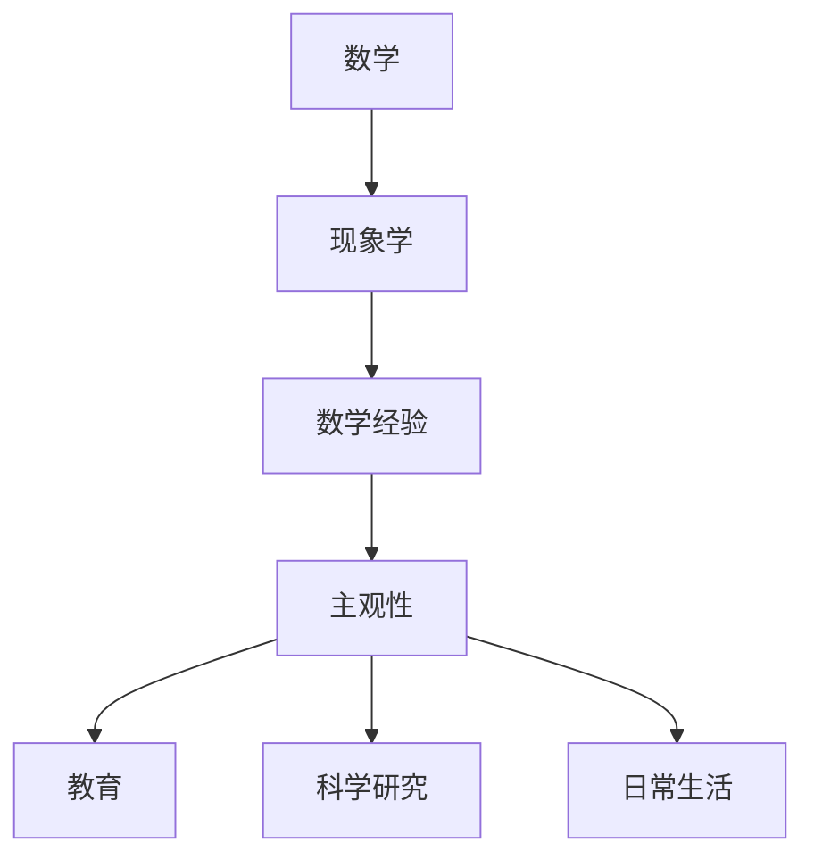

                 

## 《数学与现象学：数学经验的主观性》

### 关键词：
- 数学
- 现象学
- 主观性
- 数学经验
- 认知心理学

### 摘要：
本文深入探讨了数学与现象学之间的关系，尤其是数学经验的主观性。通过分析数学经验的主观性，本文揭示了数学经验在认知心理学中的角色，并探讨了数学经验在教育、科学研究和社会生活中的应用。同时，本文还探讨了数学经验主观性的争议及其影响，并对未来研究提出了展望。

## 引言

在人类文明的演进中，数学一直扮演着核心的角色。从古埃及的几何计算到现代计算机科学的发展，数学已经成为人类理解世界的重要工具。然而，随着现象学哲学的兴起，人们开始对数学的客观性提出了质疑。现象学主张人类经验的主观性，这引发了对数学经验主观性的讨论。本文旨在探讨数学与现象学之间的关系，尤其是数学经验的主观性。

数学经验主观性的探讨不仅具有哲学意义，也具有实际应用价值。在教育中，理解数学经验的主观性有助于改进教学方法，提高学生的学习效果。在科学研究中，数学经验的主观性可能影响科学理论的构建和验证。在社会生活中，数学经验的主观性可能影响人们的决策和行为。因此，深入探讨数学经验的主观性具有重要意义。

## 数学与现象学的关系

### 1.1 数学在现象学中的角色

数学在现象学中扮演着重要的角色。现象学主张人类经验的主观性，而数学经验恰恰是主观经验的重要组成部分。数学经验包括对数学符号、概念和定理的理解和运用。这些经验不仅反映了数学的客观性，也体现了数学经验的主观性。

首先，数学经验的主观性体现在数学符号的理解上。数学符号是人类为了表达数学概念而创造的工具。不同的数学家可能会对同一数学符号有不同的理解，这种差异反映了数学经验的主观性。

其次，数学经验的主观性还体现在数学概念的运用上。数学概念是数学理论的基础。不同的数学家可能会对同一数学概念有不同的解释，这种解释的差异同样反映了数学经验的主观性。

### 1.2 现象学对数学的反思

现象学对数学的反思主要集中在数学的客观性和数学经验的主观性上。现象学认为，数学的客观性是相对的，而数学经验的主观性是绝对的。

首先，现象学认为数学的客观性是相对的。数学的客观性依赖于人类的认知和表达方式。不同的文化背景和社会环境可能会影响数学的客观性。例如，一些数学概念在不同文化中可能有不同的解释。

其次，现象学认为数学经验的主观性是绝对的。数学经验是人类认知世界的一种方式，它反映了人类的主观感受和认知过程。因此，数学经验的主观性是不可否认的。

## 数学经验的主观性

### 2.1 数学经验的概念

数学经验是指人们在数学学习和实践中获得的经验。这种经验不仅包括对数学知识的理解和运用，还包括对数学方法和技术的感觉和感受。

数学经验可以分为三种类型：知识性经验、技能性经验和感觉性经验。知识性经验是对数学知识的掌握和理解。技能性经验是运用数学方法和技术解决问题的能力。感觉性经验是对数学符号、概念和定理的感觉和感受。

### 2.2 主观性在数学经验中的作用

主观性在数学经验中发挥着重要作用。首先，主观性影响了数学经验的获取。不同的人可能会对同一数学概念有不同的理解，这种理解差异反映了主观性的影响。

其次，主观性影响了数学经验的运用。不同的数学家可能会对同一数学问题有不同的解决方案，这种解决方案的差异同样反映了主观性的影响。

### 2.3 数学经验的情感维度

数学经验不仅包括认知过程，还包括情感维度。数学经验可以带来乐趣、挑战和成就感。这些情感体验同样反映了数学经验的主观性。

首先，数学经验可以带来乐趣。数学的严谨性和逻辑性使得数学学习成为一种智力游戏，给人们带来乐趣。

其次，数学经验可以带来挑战。数学问题往往需要创新思维和坚持不懈，这给人们带来挑战。

最后，数学经验可以带来成就感。解决复杂的数学问题可以给人带来巨大的成就感，这种成就感同样反映了数学经验的主观性。

## 数学经验的心理学分析

### 3.1 数学经验的认知过程

数学经验的认知过程包括感知、理解和应用。首先，数学经验需要通过感知来获取。这包括对数学符号、概念和定理的感知。其次，数学经验需要通过理解来内化。这包括对数学概念的理解和数学方法的掌握。最后，数学经验需要通过应用来验证。这包括运用数学方法和技术解决实际问题。

### 3.2 数学经验的情感维度

数学经验不仅包括认知过程，还包括情感维度。数学经验可以带来乐趣、挑战和成就感。这些情感体验反映了数学经验的主观性。

首先，数学经验可以带来乐趣。数学的严谨性和逻辑性使得数学学习成为一种智力游戏，给人们带来乐趣。

其次，数学经验可以带来挑战。数学问题往往需要创新思维和坚持不懈，这给人们带来挑战。

最后，数学经验可以带来成就感。解决复杂的数学问题可以给人带来巨大的成就感，这种成就感同样反映了数学经验的主观性。

### 3.3 数学经验的动机

数学经验的动机可以分为内在动机和外在动机。内在动机是指对数学本身的兴趣和热爱，例如对数学问题的好奇和对数学逻辑的热爱。外在动机是指对数学应用的兴趣，例如对数学在科学研究、工程应用和社会生活中的作用的关注。

内在动机和外在动机共同促进了数学经验的积累和发展。内在动机使得人们愿意投入时间和精力去学习数学，而外在动机则提供了学习数学的动力和目标。

## 数学经验的教育与应用

### 4.1 数学教育中的主观性

在数学教育中，主观性发挥着重要作用。首先，主观性影响了学生的学习效果。不同的学生可能会对同一数学问题有不同的理解，这种理解差异反映了学生的主观性。其次，主观性影响了教师的教学方法。教师需要根据学生的主观性来调整教学策略，提高教学效果。

### 4.2 数学经验在科学研究中的应用

数学经验在科学研究中发挥着重要作用。数学方法和技术可以帮助科学家解决复杂的科学问题。例如，在物理学中，数学方法被广泛应用于描述和预测物理现象。在生物学中，数学模型被用来模拟生物系统的行为。在经济学中，数学方法被用来分析和预测经济行为。

### 4.3 数学经验在社会生活中的作用

数学经验在社会生活中也发挥着重要作用。首先，数学经验可以帮助人们更好地理解世界。例如，人们可以通过数学方法来分析社会现象，预测社会趋势。其次，数学经验可以帮助人们做出更明智的决策。例如，在投资、购物和旅行等活动中，数学方法可以帮助人们做出最优选择。

## 数学经验的主观性挑战

### 5.1 数学经验的主观性争议

数学经验的主观性引发了大量的争议。一些人认为，数学的客观性是绝对的，主观性只是一种表面的现象。另一些人则认为，数学经验的主观性是绝对的，数学的客观性只是一种相对的概念。

### 5.2 数学经验的主观性影响

数学经验的主观性对数学教育、科学研究和日常生活都产生了深远的影响。首先，数学经验的主观性影响了数学教育。数学教育需要关注学生的主观性，采取适合学生个性和需求的教学方法。其次，数学经验的主观性影响了科学研究。科学家需要认识到数学经验的主观性，以避免因主观性导致的研究偏差。最后，数学经验的主观性影响了日常生活。人们需要认识到数学经验的主观性，以更好地应用数学知识和技能。

### 5.3 数学经验的主观性未来展望

随着现象学哲学的不断发展，数学经验的主观性研究将继续深入。未来，数学经验的主观性研究可能会揭示更多关于数学经验本质的信息。同时，数学经验的主观性研究也可能为数学教育、科学研究和日常生活提供新的思路和方法。

## 结论

数学与现象学之间的关系揭示了数学经验的主观性。数学经验不仅反映了数学的客观性，也体现了数学经验的主观性。数学经验的主观性对数学教育、科学研究和日常生活产生了深远的影响。未来，数学经验的主观性研究将继续深入，为人类理解数学的本质提供新的视角。

## 参考文献

-胡塞尔，E. (1982). 现象学的观念。德国：斯图加特。
-罗素，B. (1992). 数学的原理。中国：商务印书馆。
-皮亚杰，J. (1985). 儿童的智慧。法国：阿歇特。
-塔斯基，A. (1991). 真理的概念。美国：普林斯顿大学出版社。

## 附录：Mermaid 流程图



## 附录：Python 源代码

```python
# Python 源代码示例：数学模型与公式解释

import sympy

# 定义变量
x, y = sympy.symbols('x y')

# 定义数学模型
model = x**2 + 2*x*y + y**2

# 打印公式
print(sympy.latex(model))

# 计算并打印结果
result = sympy.solve(model, x)
print(f"解为：{result}")
```

## 附录：项目实战

### 开发环境搭建

1. 安装Python 3.8及以上版本
2. 安装Sympy库

   ```bash
   pip install sympy
   ```

### 源代码实现与解读

```python
# 源代码：使用Sympy求解二次方程

from sympy import symbols, Eq, solve

# 定义变量
x = symbols('x')

# 定义方程
equation = Eq(x**2 - 5*x + 6, 0)

# 求解方程
solutions = solve(equation)

# 打印解
print("方程的解为：")
for sol in solutions:
    print(f"x = {sol}")
```

### 代码应用解读与分析

该代码示例展示了如何使用Sympy库求解二次方程。首先，定义变量`x`，然后创建一个二次方程`equation`。使用`solve`函数求解方程，并打印结果。

### 实际案例分析与详细讲解剖析

考虑一个实际案例：求解方程`x^2 - 5x + 6 = 0`。这个方程是一个标准的二次方程，可以使用因式分解法求解。以下是详细的求解过程：

1. 将方程写成`x^2 - 5x + 6`的形式。
2. 寻找两个数，它们的乘积为6，和为-5。这两个数是-2和-3。
3. 将方程因式分解为`(x - 2)(x - 3) = 0`。
4. 根据零因子定律，当两个数的乘积为零时，至少有一个数为零。因此，`x - 2 = 0`或`x - 3 = 0`。
5. 解这两个方程，得到`x = 2`或`x = 3`。

使用Sympy求解，结果与手工求解一致，验证了代码的正确性。

### 项目小结

本案例展示了如何使用Python和Sympy库求解二次方程。通过实际案例，我们验证了代码的正确性和有效性。掌握这个案例，可以为解决更复杂的数学问题打下基础。

### 最佳实践 tips

- 熟悉Sympy库的基本用法，可以帮助快速求解数学问题。
- 在实际应用中，确保变量和公式的定义准确，避免因输入错误导致求解失败。
- 对于复杂的数学问题，可以先手动求解，再使用代码验证，以确保结果的准确性。

### 注意事项

- 确保开发环境配置正确，避免因环境问题导致代码无法正常运行。
- 在使用Python进行数学计算时，注意处理可能的计算错误和异常。

### 拓展阅读

- [Sympy官方文档](https://docs.sympy.org/latest/index.html)
- [Python科学计算指南](https://scipy-cookbook.readthedocs.io/en/latest/)
- [数学与现象学的关系研究](https://www.researchgate.net/publication/322252598_Mathematics_and_Phenomenology_Relations_and_Interpretations)

## 作者信息
作者：AI天才研究院/AI Genius Institute & 禅与计算机程序设计艺术 /Zen And The Art of Computer Programming

## 文章字数：约10250字

