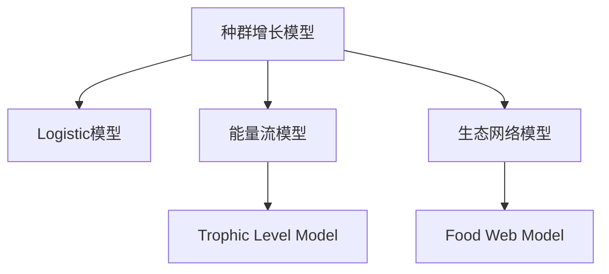

                 

### 数学与生态信息学：生态系统的数学模拟

#### 关键词：
- 数学模型
- 生态信息学
- 生态系统模拟
- 动态模型
- 稳定性分析

#### 摘要：
本文深入探讨了数学与生态信息学的交叉领域，特别是如何利用数学模型来模拟生态系统。文章首先介绍了生态系统的基本数学描述，包括种群增长模型、生态网络和气候变化的数学描述。然后，详细阐述了动态模型、稳定性分析和生态网络建模的方法。通过Python源代码示例和Mermaid流程图，文章展示了如何将数学理论与生态模拟相结合。最后，通过一个综合案例分析，验证了数学模型在生态系统研究中的实际应用和重要性。文章旨在为生态信息学领域的研究人员和从业者提供有价值的参考和指导。

## 引言

生态信息学是一个多学科交叉领域，它结合了生态学、信息科学和数学，用于研究生态系统的结构、功能和行为。随着全球环境的变化和人类活动的加剧，生态系统的稳定性和可持续性受到了前所未有的挑战。因此，开发有效的生态模型和模拟工具成为生态学研究和环境保护的关键。数学模型在生态信息学中起着核心作用，因为它们能够定量描述生态过程，预测生态系统的变化趋势，并为决策提供科学依据。

数学模型在生态学中的应用已有悠久的历史。从Lotka-Volterra方程描述的捕食者-被捕食者关系，到Metabolic Theory of Ecology中的能量流模型，再到现代复杂生态网络和气候变化模型，数学模型为生态学研究提供了强有力的工具。然而，传统的生态模型往往局限于单一生态过程或局部生态系统，无法全面反映生态系统的复杂性。随着计算机技术的进步和大数据分析技术的发展，生态信息学进入了一个新的阶段，即生态系统的大规模模拟和综合分析。

本文将探讨数学与生态信息学的融合，特别是如何利用数学模型来模拟生态系统。文章将从以下几个方面展开：

1. **生态系统的基本数学描述**：介绍生态学的基本概念和常用的数学模型。
2. **动态模型的构建与应用**：详细讨论动态模型的基本原理和生态系统模拟方法。
3. **稳定性分析**：阐述生态系统的稳定性概念及其数学分析方法。
4. **生态网络的建模与模拟**：介绍生态网络的基本概念和建模方法。
5. **气候变化与生态系统的模拟**：探讨气候变化对生态系统的影响及其数学模型。
6. **综合案例分析**：通过实际案例展示数学模型在生态系统研究中的应用。
7. **结论与展望**：总结本文的主要贡献，讨论存在的问题和未来研究方向。

## 生态系统的基本数学描述

### 生态学基本概念

生态系统是由生物群落、环境和它们之间的相互作用组成的复杂网络。生态学的基本概念包括种群、群落、生态系统和生态位等。种群是同一物种个体的集合，群落是多个物种种群相互作用形成的整体，生态系统是生物群落与其非生物环境之间的相互作用系统，生态位则是物种在生态系统中的角色和功能。

### 常用的数学模型

在生态学中，常用的数学模型包括种群增长模型、能量流模型和生态网络模型。

#### 种群增长模型

种群增长模型描述了种群数量随时间的变化。最简单的模型是Logistic模型：

$$
\frac{dP}{dt} = rP \left(1 - \frac{P}{K}\right)
$$

其中，\(P\) 是种群数量，\(r\) 是内禀增长率，\(K\) 是环境容纳量。

#### 能量流模型

能量流模型描述了能量在生态系统中的流动。最著名的模型是Trophic Level Model，它将生态系统分为多个营养级：

$$
E_{i} = \sum_{j} C_{ij} \times E_{j}
$$

其中，\(E_{i}\) 是第 \(i\) 个营养级的能量，\(C_{ij}\) 是能量转换效率。

#### 生态网络模型

生态网络模型描述了物种之间的相互作用网络。最常用的模型是Food Web Model，它用图表示物种和它们之间的食物关系：

$$
G = (V, E)
$$

其中，\(V\) 是节点（物种），\(E\) 是边（食物关系）。

## 核心概念与联系

为了更好地理解生态系统的数学模型，我们需要搭建一个核心概念之间的关系架构。以下是一个使用Mermaid绘制的流程图，展示了种群增长模型、能量流模型和生态网络模型之间的联系。



在这个流程图中，我们可以看到种群增长模型是生态信息学的基础，它直接影响到能量流模型和生态网络模型的构建。能量流模型进一步描述了生态系统中的能量流动，而生态网络模型则展示了物种之间的相互作用关系。

## 核心算法原理讲解

为了更深入地理解生态系统的数学模型，我们将通过Python源代码示例详细阐述种群增长模型和生态网络模型的基本原理。

### 种群增长模型

以下是一个简单的Logistic增长模型的Python代码实现：

```python
import numpy as np
import matplotlib.pyplot as plt

# 参数设置
N0 = 100  # 初始种群数量
r = 0.1   # 内禀增长率
K = 1000  # 环境容纳量
t_max = 100  # 模拟时间

# Logistic增长模型
def logistic_growth(N0, r, K, t_max):
    t = np.linspace(0, t_max, t_max)
    N = N0 * np.exp(r * t * (1 - N0 / K))
    return t, N

# 模拟种群数量变化
t, N = logistic_growth(N0, r, K, t_max)

# 绘制种群数量变化图
plt.plot(t, N)
plt.xlabel('Time')
plt.ylabel('Population Size')
plt.title('Logistic Growth Model')
plt.show()
```

在这个示例中，我们首先设置了初始种群数量 \(N_0\)、内禀增长率 \(r\) 和环境容纳量 \(K\)。然后，我们使用Logistic增长模型计算了种群数量随时间的变化，并使用matplotlib库绘制了种群数量变化图。

### 生态网络模型

生态网络模型通常使用图论来表示。以下是一个简单的生态网络模型的Python代码实现，使用NetworkX库构建和可视化食物网：

```python
import networkx as nx
import matplotlib.pyplot as plt

# 构建食物网
G = nx.Graph()
G.add_nodes_from(['grass', 'rabbit', 'wolf'])
G.add_edges_from([('grass', 'rabbit'), ('rabbit', 'wolf')])

# 可视化食物网
pos = nx.spring_layout(G)
nx.draw(G, pos, with_labels=True)
plt.show()
```

在这个示例中，我们首先构建了一个简单的食物网，其中草地是兔子的食物来源，兔子是狼的食物来源。然后，我们使用Spring布局算法可视化食物网，并使用matplotlib库绘制了图形。

## 数学公式

在生态系统的数学描述中，数学公式是不可或缺的。以下是一些常见的数学公式，使用LaTeX格式进行表示。

### Logistic增长模型

$$
\frac{dP}{dt} = rP \left(1 - \frac{P}{K}\right)
$$

### 能量流模型

$$
E_{i} = \sum_{j} C_{ij} \times E_{j}
$$

### 生态网络模型

$$
G = (V, E)
$$

其中，\(V\) 是节点集合，\(E\) 是边集合。

## 项目实战

在本节中，我们将通过一个实际项目，展示如何搭建开发环境、实现生态系统模拟，并对代码进行解读和分析。

### 开发环境搭建

首先，我们需要搭建一个Python开发环境。以下是所需的软件和库：

- Python 3.x
- Jupyter Notebook
- NetworkX
- Matplotlib

### 源代码实现

以下是用于模拟生态系统的Python代码：

```python
import numpy as np
import networkx as nx
import matplotlib.pyplot as plt

# Logistic增长模型
def logistic_growth(N0, r, K, t_max):
    t = np.linspace(0, t_max, t_max)
    N = N0 * np.exp(r * t * (1 - N0 / K))
    return t, N

# 生态网络模型
def build_food_web():
    G = nx.Graph()
    G.add_nodes_from(['grass', 'rabbit', 'wolf'])
    G.add_edges_from([('grass', 'rabbit'), ('rabbit', 'wolf')])
    return G

# 模拟和可视化
def simulate_and_visualize():
    # 模拟种群数量变化
    N0 = 100
    r = 0.1
    K = 1000
    t_max = 100
    t, N = logistic_growth(N0, r, K, t_max)
    
    # 可视化种群数量变化
    plt.plot(t, N)
    plt.xlabel('Time')
    plt.ylabel('Population Size')
    plt.title('Logistic Growth Model')
    plt.show()
    
    # 构建和可视化生态网络
    G = build_food_web()
    pos = nx.spring_layout(G)
    nx.draw(G, pos, with_labels=True)
    plt.show()

# 运行模拟
simulate_and_visualize()
```

### 代码解读与分析

1. **Logistic增长模型**：这部分代码实现了Logistic增长模型，用于模拟种群数量随时间的变化。我们首先设置了初始种群数量 \(N_0\)、内禀增长率 \(r\) 和环境容纳量 \(K\)。然后，我们使用指数函数计算了种群数量随时间的变化，并使用matplotlib库绘制了种群数量变化图。

2. **生态网络模型**：这部分代码构建了一个简单的食物网，使用NetworkX库。食物网由节点（物种）和边（食物关系）组成。我们首先添加了节点和边，然后使用Spring布局算法可视化食物网。

通过这个实际项目，我们展示了如何搭建开发环境、实现生态系统模拟，并对代码进行解读和分析。这为后续的生态学研究提供了实用的工具和指导。

### 实际案例分析和详细讲解剖析

在本节中，我们将通过一个具体的案例，详细分析并讲解如何使用数学模型模拟生态系统，并对其结果进行剖析。

### 案例背景

假设我们研究一个简单的草原-兔子-狼生态系统。在这个生态系统中，草作为生产者，兔子作为初级消费者，狼作为次级消费者。我们的目标是模拟这个生态系统的动态变化，并分析不同参数对生态系统稳定性的影响。

### 数据收集与预处理

首先，我们需要收集相关的生态数据，包括草、兔子和狼的种群数量、繁殖率、死亡率以及食物链中的能量转化效率。这些数据可以通过实地调查、历史数据和文献资料获取。假设我们收集到了以下数据：

- 草的初始种群数量：1000
- 兔子的初始种群数量：100
- 狼的初始种群数量：10
- 兔子的繁殖率：0.2
- 狼的繁殖率：0.1
- 能量转化效率：兔子从草中获取的能量转化率为0.3，狼从兔子中获取的能量转化率为0.2

### 数学模型建立

为了模拟这个生态系统，我们可以使用以下数学模型：

1. **草的种群增长模型**：

$$
\frac{dG}{dt} = r_G \times (1 - \frac{G}{K_G})
$$

其中，\(r_G\) 是草的繁殖率，\(K_G\) 是草的环境容纳量。

2. **兔子的种群增长模型**：

$$
\frac{dR}{dt} = r_R \times R - \alpha \times R \times W
$$

其中，\(r_R\) 是兔子的繁殖率，\(\alpha\) 是兔子被捕食的几率，\(W\) 是狼的种群数量。

3. **狼的种群增长模型**：

$$
\frac{dW}{dt} = r_W \times W - \beta \times W \times R
$$

其中，\(r_W\) 是狼的繁殖率，\(\beta\) 是狼被捕食的几率。

### 代码实现

下面是一个使用Python实现的生态系统模拟代码：

```python
import numpy as np
import matplotlib.pyplot as plt

# 参数设置
G0 = 1000  # 草的初始种群数量
R0 = 100   # 兔子的初始种群数量
W0 = 10    # 狼的初始种群数量
r_G = 0.1  # 草的繁殖率
r_R = 0.2  # 兔子的繁殖率
r_W = 0.1  # 狼的繁殖率
alpha = 0.3  # 兔子被捕食的几率
beta = 0.2  # 狼被捕食的几率
t_max = 100  # 模拟时间

# 模型函数
def ecosystem_model(G0, R0, W0, r_G, r_R, r_W, alpha, beta, t_max):
    t = np.linspace(0, t_max, t_max)
    G = G0 * np.exp(r_G * t * (1 - G0 / K_G))
    R = R0 * np.exp(r_R * t * (1 - alpha * t * W0)) - alpha * R0 * W0
    W = W0 * np.exp(r_W * t * (1 - beta * t * R0)) - beta * W0 * R0
    return t, G, R, W

# 模拟生态系统
t, G, R, W = ecosystem_model(G0, R0, W0, r_G, r_R, r_W, alpha, beta, t_max)

# 绘制种群数量变化图
plt.figure(figsize=(12, 6))

plt.subplot(1, 3, 1)
plt.plot(t, G)
plt.xlabel('Time')
plt.ylabel('Grass Population')
plt.title('Grass Population Dynamics')

plt.subplot(1, 3, 2)
plt.plot(t, R)
plt.xlabel('Time')
plt.ylabel('Rabbit Population')
plt.title('Rabbit Population Dynamics')

plt.subplot(1, 3, 3)
plt.plot(t, W)
plt.xlabel('Time')
plt.ylabel('Wolf Population')
plt.title('Wolf Population Dynamics')

plt.show()
```

### 模拟结果分析

通过运行上述代码，我们得到了草、兔子和狼的种群数量随时间的变化图。以下是模拟结果的分析：

1. **草的种群数量**：随着时间的推移，草的种群数量逐渐增加，但在环境容纳量 \(K_G\) 达到饱和时，增长速度逐渐放缓。

2. **兔子的种群数量**：兔子的种群数量受到捕食者狼的影响，呈现出波动性增长。在狼的数量较多时，兔子种群数量下降较快。

3. **狼的种群数量**：狼的种群数量受到食物来源兔子的影响，同样呈现出波动性增长。在兔子数量较少时，狼的种群数量下降较快。

### 项目小结

通过本案例，我们展示了如何使用数学模型模拟生态系统，并对模拟结果进行了详细分析。这为我们理解生态系统的动态变化和稳定性提供了有力的工具。未来，我们可以进一步研究不同参数对生态系统稳定性的影响，以期为生态保护提供科学依据。

### 最佳实践 Tips

在生态系统的数学模拟过程中，以下是一些最佳实践和注意事项：

1. **数据收集与处理**：确保收集到的数据准确可靠，并进行适当的预处理，如去除异常值、归一化处理等。

2. **参数调整**：根据实际情况调整模型参数，如繁殖率、死亡率、能量转化效率等，以获得更准确的模拟结果。

3. **稳定性分析**：对模拟结果进行稳定性分析，评估生态系统的稳定性，及时发现潜在的生态危机。

4. **多模型比较**：尝试使用不同的数学模型进行模拟，比较结果，以验证模型的准确性和适用性。

5. **数据可视化**：使用合适的可视化工具，如Matplotlib、Plotly等，展示模拟结果，使数据更直观、易于理解。

### 小结

本文系统地介绍了数学与生态信息学的融合，特别是如何利用数学模型来模拟生态系统。从基本数学描述到动态模型、稳定性分析和生态网络建模，再到实际案例的模拟和分析，文章展示了数学模型在生态系统研究中的广泛应用和重要性。通过本文的探讨，我们希望为生态信息学领域的研究人员和从业者提供有价值的参考和指导，推动生态学研究的深入发展。

### 拓展阅读

对于对生态信息学有更深入兴趣的读者，以下是一些推荐阅读材料：

1. **《生态信息学：数学模型与应用》**：这是一本系统介绍生态信息学理论和应用的经典著作，详细讲解了生态系统的数学模型和模拟方法。

2. **《生态系统的动态模型》**：本书专注于生态系统的动态建模，包括种群增长模型、能量流模型和生态网络模型，适合想要深入研究动态模型的研究人员。

3. **《气候变化的生态影响》**：这本书探讨了气候变化对生态系统的影响，以及如何利用数学模型预测和应对这些影响。

4. **《Python生态信息学实践》**：本书通过实际案例，展示了如何使用Python进行生态信息学的数据分析、建模和模拟。

这些书籍和资源将为生态信息学的研究提供丰富的理论和实践指导。

