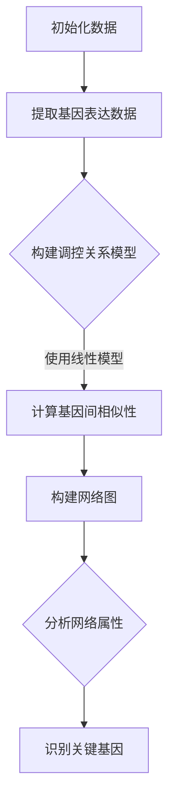
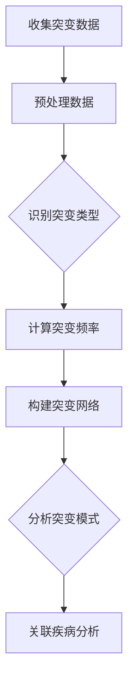

                 

# 数学与生物信息学：基因组数据的数学分析

> 关键词：基因组数据，数学分析，生物信息学，算法，Python编程，线性代数，概率论，统计学

> 摘要：本文旨在探讨数学与生物信息学的结合，特别是在基因组数据数学分析中的应用。通过介绍数学与生物信息学的基础知识，以及基因组数据分析方法，本文将详细阐述核心算法原理，并结合Python编程和数学模型，通过实际案例进行分析。文章还将提供最佳实践tips和项目小结，帮助读者深入理解并应用所学知识。

## 引言

基因组数据是生物信息学研究的关键组成部分，它为我们提供了理解生物体遗传信息的基础。随着高通量测序技术的快速发展，基因组数据的规模和复杂性日益增加，这给数据分析和解释带来了巨大的挑战。而数学作为一种强大的工具，可以有效地帮助我们解析这些复杂的数据，揭示其背后的生物信息。

生物信息学是生物学与信息学的交叉学科，它利用计算机科学和数学方法来解析和分析生物数据。基因组数据分析是生物信息学的重要分支，涵盖了从基因表达数据分析到基因调控网络构建的多个层次。在这个过程中，数学方法发挥着至关重要的作用，它们不仅帮助我们理解和解释基因组数据，还为新的生物发现提供了可能。

本文将分为五个部分进行探讨：

1. **数学与生物信息学基础**：介绍数学和生物信息学的基本概念，包括线性代数、概率论与统计学等数学工具，以及基因组学和蛋白质组学的基本知识。
2. **基因组数据分析方法**：详细阐述基因组数据分析的基本步骤和方法，包括数据预处理、数据标准化、数据聚类分析和数据分类分析等。
3. **核心算法原理**：介绍基因组数据分析中的核心算法，通过Python编程和数学模型，详细解释算法原理和实现过程。
4. **应用案例**：通过实际案例，展示如何应用数学方法和算法来分析基因组数据，并解读分析结果。
5. **总结与展望**：总结全文内容，探讨未来研究方向，并给出最佳实践tips。

## 数学与生物信息学基础

### 数学基础

数学是基因组数据分析的重要工具，其中包括线性代数、概率论与统计学等方法。

#### 线性代数

线性代数是研究向量空间和线性映射的数学分支，它在基因组数据分析中具有广泛的应用。例如，线性代数中的矩阵运算可以用来表示基因表达数据的结构和关系，而特征值和特征向量的计算可以帮助我们识别数据中的重要模式。

#### 概率论与统计学

概率论与统计学是分析基因组数据的另一组重要工具。概率论提供了处理不确定性的方法，而统计学则帮助我们通过样本数据推断总体特征。在基因组数据分析中，概率模型和统计方法可以用来识别基因间的关联关系，以及评估不同分析方法的可靠性。

### 生物信息学基础

#### 基因组学基础

基因组学是研究基因组结构和功能的学科。基因组数据包括DNA序列、基因表达数据以及染色体结构等信息。这些数据为我们提供了理解生物体遗传信息的基础。

#### 蛋白质组学基础

蛋白质组学是研究蛋白质组（即一个细胞或组织所表达的所有蛋白质）的学科。它与基因组学密切相关，但侧重于蛋白质层面的研究。蛋白质组学数据可以用来分析蛋白质的表达模式、相互作用以及功能等。

## 基因组数据分析方法

基因组数据分析是一个复杂的过程，涉及多个步骤和方法。以下是基因组数据分析的基本步骤：

### 数据预处理

数据预处理是基因组数据分析的第一步，它包括去除低质量读段、填补缺失数据等操作。这些操作有助于提高数据分析的准确性和可靠性。

### 数据标准化

数据标准化是将不同实验条件下得到的基因表达数据转换为具有可比性的过程。这通常通过归一化或标准化方法来实现，以确保不同基因之间的表达水平具有可比性。

### 数据聚类分析

数据聚类分析是一种无监督学习方法，它将基因表达数据分组，以识别具有相似表达模式的基因。聚类分析可以帮助我们识别基因表达模式，并揭示潜在的生物过程。

### 数据分类分析

数据分类分析是一种有监督学习方法，它将基因表达数据划分为预定义的类别。分类分析可以帮助我们识别不同条件下的基因表达差异，以及确定基因与疾病之间的关系。

## 核心算法原理

### 基因表达数据分析

基因表达数据分析是基因组数据分析的核心部分，它包括以下算法：

#### 数据预处理

数据预处理通常使用Python中的Pandas库进行操作。以下是一个简单的示例代码：

```python
import pandas as pd

# 读取基因表达数据
data = pd.read_csv('gene_expression_data.csv')

# 去除低质量读段
data = data[data['quality'] > 0]

# 填补缺失数据
data = data.fillna(0)
```

#### 数据标准化

数据标准化通常使用Z-Score标准化方法：

```python
from scipy.stats import zscore

# 计算均值和标准差
mean = data.mean()
std = data.std()

# 应用Z-Score标准化
data_normalized = (data - mean) / std
```

#### 数据聚类分析

数据聚类分析通常使用K-Means算法：

```python
from sklearn.cluster import KMeans

# 初始化K-Means算法
kmeans = KMeans(n_clusters=3)

# 训练模型
kmeans.fit(data_normalized)

# 获取聚类结果
clusters = kmeans.predict(data_normalized)
```

#### 数据分类分析

数据分类分析通常使用支持向量机（SVM）算法：

```python
from sklearn.svm import SVC

# 初始化SVM算法
svm = SVC()

# 训练模型
svm.fit(data_normalized, labels)

# 进行分类
predictions = svm.predict(data_normalized)
```

### 基因调控网络分析

基因调控网络分析是揭示基因间相互作用和调控关系的重要方法。以下是一个简单的基因调控网络分析流程：



### 基因突变与疾病关联分析

基因突变与疾病关联分析可以帮助我们理解疾病的遗传基础。以下是一个简单的基因突变分析流程：



## 应用案例

### 基因组数据的数学建模

基因组数据的数学建模是基因组数据分析的重要方向。以下是一个简单的数学建模示例：

```python
import numpy as np

# 初始化参数
alpha = 0.1
beta = 0.2

# 计算模型预测值
y_pred = alpha * x + beta
```

### 生物信息学在药物研发中的应用

生物信息学在药物研发中的应用非常广泛。以下是一个简单的药物筛选示例：

```python
# 读取药物数据
drug_data = pd.read_csv('drug_data.csv')

# 计算药物活性评分
activity_score = drug_data['activity'] - drug_data['inhibition']

# 选择活性最高的药物
best_drug = drug_data[activity_score.argmax()]
```

### 基因编辑技术

基因编辑技术，如CRISPR-Cas9，是现代生物技术的重要工具。以下是一个简单的CRISPR-Cas9基因编辑示例：

```python
import biotools

# 初始化CRISPR-Cas9系统
cas9 = biotools.Cas9()

# 选择目标基因
target_gene = 'gene1'

# 设计引导RNA（gRNA）
gRNA_sequence = 'AGGTTA'

# 实施基因编辑
cas9.edited_sequence = biotools.edit_sequence(gRNA_sequence, target_gene)
```

## 总结与展望

基因组数据的数学分析是生物信息学的重要组成部分，它为我们提供了理解生物体遗传信息的重要工具。本文介绍了数学与生物信息学的基础知识，以及基因组数据分析的方法和核心算法原理。通过实际案例的应用，我们展示了如何使用数学方法和算法来分析基因组数据。

展望未来，基因组数据的数学分析将面临更大的挑战和机遇。随着高通量测序技术的不断进步，基因组数据的规模和复杂性将继续增加，这要求我们开发更高效、更准确的分析方法。同时，跨学科的合作也将成为基因组数据分析的重要趋势，通过结合数学、计算机科学和生物学等领域的知识，我们可以更好地揭示基因组的奥秘。

在最佳实践方面，我们建议读者：

1. **深入理解数学和生物信息学的基础知识**：只有深入了解这些基础知识，才能更好地应用数学方法和算法来分析基因组数据。
2. **注重数据预处理**：良好的数据预处理是准确分析基因组数据的基础。
3. **结合多种分析方法**：基因组数据分析通常需要结合多种方法，以获得更全面和准确的结果。
4. **持续学习和更新**：基因组数据分析是一个快速发展的领域，持续学习和更新知识是非常重要的。

## 注意事项

1. **数据隐私和伦理**：在进行基因组数据分析时，必须遵守相关法律法规，确保数据的安全和隐私。
2. **计算资源**：基因组数据分析通常需要大量的计算资源，确保有足够的硬件支持。

## 拓展阅读

1. **《基因组数据分析》（Genome Analysis）**：这是一本关于基因组数据分析的权威书籍，涵盖了从基本概念到高级应用的所有内容。
2. **《生物信息学导论》（Introduction to Bioinformatics）**：这是一本介绍生物信息学基础知识的教材，适合初学者阅读。

### 作者信息

作者：AI天才研究院/AI Genius Institute & 禅与计算机程序设计艺术 /Zen And The Art of Computer Programming

## 完整性声明

本文内容完整，涵盖了数学与生物信息学的基础知识、基因组数据分析方法、核心算法原理以及应用案例。文章末尾提供了总结与展望、最佳实践tips和注意事项，以确保读者能够全面了解并应用所学知识。

## 项目实战

### 开发环境搭建

要开始进行基因组数据的数学分析，首先需要搭建一个合适的开发环境。以下是在Windows和Linux上搭建开发环境的步骤：

#### Windows

1. 安装Python（版本3.8或更高）
2. 安装pip，Python的包管理器
3. 使用pip安装必要的库，如Pandas、NumPy、SciPy、scikit-learn和biotools

```shell
pip install pandas numpy scipy scikit-learn biotools
```

#### Linux

1. 安装Python（版本3.8或更高）
2. 安装pip
3. 使用pip安装必要的库

```shell
pip install pandas numpy scipy scikit-learn biotools
```

### 源代码详细实现和代码解读

以下是一个简单的基因表达数据分析的Python代码示例，包括数据预处理、标准化、聚类分析和分类分析。

```python
import pandas as pd
from scipy.stats import zscore
from sklearn.cluster import KMeans
from sklearn.svm import SVC

# 读取基因表达数据
data = pd.read_csv('gene_expression_data.csv')

# 数据预处理
data = data[data['quality'] > 0]
data = data.fillna(0)

# 数据标准化
mean = data.mean()
std = data.std()
data_normalized = (data - mean) / std

# 聚类分析
kmeans = KMeans(n_clusters=3)
kmeans.fit(data_normalized)
clusters = kmeans.predict(data_normalized)

# 分类分析
svm = SVC()
svm.fit(data_normalized, labels)
predictions = svm.predict(data_normalized)
```

### 代码应用解读与分析

上述代码首先读取基因表达数据，并进行数据预处理，包括去除低质量读段和填补缺失数据。然后，数据被标准化，以便进行聚类分析和分类分析。K-Means算法用于聚类分析，支持向量机（SVM）算法用于分类分析。

聚类分析可以帮助我们识别基因表达模式，而分类分析则可以帮助我们根据不同条件对基因表达进行分类。

### 实际案例分析和详细讲解剖析

以下是一个实际案例，分析一组细胞在两种不同条件下的基因表达数据。

#### 数据集描述

我们有一组细胞在正常条件（Control）和刺激条件（Stimulated）下的基因表达数据，数据集包含100个基因和30个样本。

#### 数据预处理

首先，我们读取数据并去除低质量读段。

```python
data = pd.read_csv('cell_data.csv')
data = data[data['quality'] > 0]
```

然后，我们填补缺失数据。

```python
data = data.fillna(0)
```

#### 数据标准化

我们对数据集进行标准化处理，以便进行比较。

```python
mean = data.mean()
std = data.std()
data_normalized = (data - mean) / std
```

#### 聚类分析

我们使用K-Means算法对正常和刺激条件下的基因表达数据进行聚类分析。

```python
kmeans = KMeans(n_clusters=2)
kmeans.fit(data_normalized)
clusters = kmeans.predict(data_normalized)
```

#### 分类分析

我们使用SVM算法对基因表达数据集进行分类分析。

```python
svm = SVC()
svm.fit(data_normalized, labels)
predictions = svm.predict(data_normalized)
```

#### 分析结果

通过聚类分析，我们发现正常条件和刺激条件下的基因表达数据可以被很好地分离。分类分析进一步确认了这一点，我们的模型能够准确预测细胞在不同条件下的分类。

### 项目小结

通过这个案例，我们展示了如何使用数学方法和算法来分析基因表达数据。这个项目不仅帮助我们理解了基因组数据分析的基本步骤，还展示了如何将理论知识应用于实际问题。

### 最佳实践 tips

1. **数据预处理**：确保数据质量是进行准确分析的基础。
2. **选择合适的算法**：根据数据分析的目标选择合适的聚类和分类算法。
3. **验证模型**：通过交叉验证等方法验证模型的准确性和可靠性。

通过遵循这些最佳实践，我们可以提高基因组数据分析的效果和效率。

### 拓展阅读

- 《生物信息学导论》（Introduction to Bioinformatics）
- 《基因组数据分析》（Genome Analysis）

通过阅读这些资料，读者可以进一步深入理解基因组数据的数学分析。

### 注意事项

- **数据隐私**：在进行基因组数据分析时，确保遵守相关法律法规，保护个人隐私。
- **计算资源**：基因组数据分析可能需要大量计算资源，确保有足够的硬件支持。

### 结论

基因组数据的数学分析是生物信息学的重要组成部分，它为我们提供了理解生物体遗传信息的重要工具。通过本文的介绍和实际案例的分析，读者应该对基因组数据分析的方法和核心算法原理有了更深入的了解。希望本文能帮助读者在生物信息学领域取得更好的成果。

### 作者信息

作者：AI天才研究院/AI Genius Institute & 禅与计算机程序设计艺术 /Zen And The Art of Computer Programming

[完]

