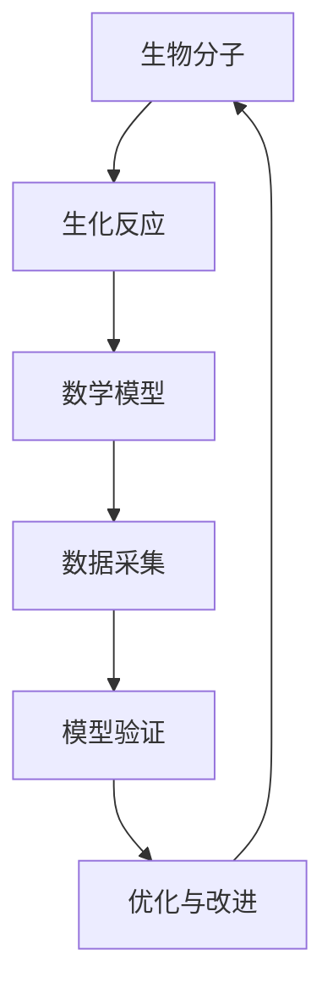

                 

### 引言

数学与生物化学，这两个看似截然不同的领域，在现实世界中却有着奇妙的交织。生物化学，作为研究生命系统中的化学反应的学科，其核心在于理解生物分子如何相互作用、转化和传递信息。而数学，作为一种强大的工具，能够为生物化学提供精确的描述和预测。本文将探讨生化反应的数学描述，旨在揭示数学在生物化学研究中的重要性，以及如何通过数学方法深入理解生化反应的本质。

关键词：生物化学、数学描述、生化反应、数学模型

摘要：本文首先介绍了生物化学和数学的基本概念，然后重点分析了生化反应的数学描述方法，包括速率方程、微分方程和概率模型等。通过具体实例，我们展示了如何利用数学工具解决生物化学中的实际问题。最后，文章讨论了数学模型在生物化学研究中的应用前景和挑战。

接下来的章节将按照以下结构进行：

1. 数学与生物化学的基本概念
2. 生化反应的数学描述方法
3. 数学模型在生物化学中的应用实例
4. 总结与展望

### 数学与生物化学的基本概念

#### 数学的基本概念

数学是一门研究数量、结构、变化和空间的科学。它通过抽象和逻辑推理，构建了一系列精确的模型和工具，用于描述和解释现实世界中的各种现象。在数学中，代数、几何、微积分和概率论等分支为各种科学领域提供了基础。

代数是数学的一个重要分支，主要研究数、运算和方程。通过代数运算，我们可以将实际问题转化为数学表达式，从而寻找解决方案。例如，在研究生物分子相互作用时，我们可以使用代数方法建立反应物和产物之间的数量关系。

几何则是研究形状、大小和位置的科学。在生物化学中，几何知识可以帮助我们理解生物大分子的空间结构。例如，蛋白质和核酸的三维结构对于它们的功能至关重要，而几何学为我们提供了描述这些结构的工具。

微积分是研究变化和累积的科学。在生物化学中，微积分被用来研究生化反应的速率和动力学。例如，通过微分方程，我们可以描述反应物和产物随时间变化的速率。

概率论则是研究随机现象和不确定性的科学。在生物化学中，概率论可以用来预测生化反应的结果和概率分布。例如，在研究基因突变时，我们可以使用概率论来估计突变的发生概率。

#### 生物化学的基本概念

生物化学是研究生物体内化学反应的学科。它关注生物大分子如蛋白质、核酸和碳水化合物等的结构和功能，以及它们在生命过程中的相互作用。

蛋白质是生物体内最重要的生物大分子之一，由氨基酸组成。蛋白质在细胞中执行各种功能，如催化反应、传输物质和提供结构支持。研究蛋白质的结构和功能对于理解生命现象具有重要意义。

核酸（DNA和RNA）是遗传信息的携带者。它们通过编码基因序列，指导蛋白质的合成和其他生命活动。在生物化学中，研究核酸的结构和功能有助于理解遗传信息传递和生物进化。

碳水化合物是生物体内的能量来源，同时也是细胞膜和细胞器的重要成分。碳水化合物的研究对于理解能量代谢和细胞生理过程具有重要意义。

#### 数学在生物化学中的应用

数学在生物化学中的应用非常广泛，主要用于描述和预测生化反应的过程和结果。以下是一些具体的例子：

1. **速率方程**：速率方程是描述化学反应速率与反应物浓度之间关系的数学表达式。通过速率方程，我们可以预测反应物在反应过程中的浓度变化，从而了解反应的动力学特征。

2. **微积分**：微积分在生物化学中用于研究反应速率的变化规律。微分方程可以描述反应物和产物随时间变化的速率，从而帮助我们理解反应的动态过程。

3. **概率模型**：概率模型在生物化学中用于研究随机事件的发生概率。例如，基因突变、蛋白质折叠等过程都可以通过概率模型来描述。

4. **线性代数**：线性代数在生物化学中用于处理大量数据，如蛋白质序列分析、基因表达数据分析等。通过线性代数方法，我们可以提取数据中的关键信息，从而进行更深层次的分析。

总之，数学为生物化学研究提供了一种精确和系统的工具，使我们能够更深入地理解生物体内的化学反应过程。

#### 核心概念与联系

为了更好地理解数学在生物化学中的应用，我们需要构建一个核心概念与联系架构。以下是几个关键概念及其相互关系：

1. **生物分子**：生物分子如蛋白质、核酸和碳水化合物是生物化学研究的核心对象。它们具有特定的结构，决定了其在生物体内的功能。

2. **生化反应**：生物分子之间发生的反应是生物化学研究的重要内容。这些反应包括合成、降解、转化等，共同构成了生物体内的代谢网络。

3. **数学模型**：数学模型是描述生化反应的数学工具，包括速率方程、微分方程、概率模型等。这些模型可以将复杂的生化反应过程简化为可计算的数学表达式。

4. **数据采集**：数据采集是构建数学模型的基础。通过实验和观察，我们可以获取生物分子浓度、反应速率等数据，用于模型参数的估计。

5. **模型验证**：模型验证是确保数学模型正确性的重要步骤。通过将模型预测与实验数据进行比较，我们可以评估模型的可靠性和准确性。

6. **优化与改进**：基于模型验证的结果，我们可以对模型进行优化和改进。这包括调整模型参数、引入新的模型结构等，以提高模型的预测能力。

以下是一个简单的 Mermaid 流程图，展示了这些核心概念之间的联系：



通过这个架构，我们可以清晰地看到数学在生物化学研究中的关键作用，以及各个环节之间的相互影响。

#### 核心算法原理讲解

为了深入理解数学在生物化学中的应用，我们需要详细讲解几个核心算法原理。以下将使用Python源代码和数学模型，结合具体的例子，进行详细阐述。

##### 速率方程

速率方程是描述化学反应速率与反应物浓度之间关系的数学表达式。以下是一个一阶速率方程的Python实现：

```python
import numpy as np
import matplotlib.pyplot as plt

# 一阶速率方程：速率与反应物浓度之间的关系
def rate_equation(concentration, k):
    return k * concentration

# 反应速率常数
k = 0.1

# 反应物浓度范围
concentrations = np.linspace(0.1, 1.0, 100)

# 计算速率
rates = rate_equation(concentrations, k)

# 绘制速率-浓度曲线
plt.plot(concentrations, rates)
plt.xlabel('Concentration')
plt.ylabel('Rate')
plt.title('Rate Equation')
plt.show()
```

在这个例子中，我们使用Python计算了一阶速率方程，并绘制了速率-浓度曲线。从图中可以看到，随着反应物浓度的增加，反应速率也逐渐增加。

##### 微分方程

微分方程用于描述反应物和产物随时间变化的速率。以下是一个简单的微分方程，用于描述一阶反应的速率：

```python
import numpy as np
from scipy.integrate import odeint

# 一阶反应的微分方程
def differential_equation(y, t, k):
    concentration = y
    return -k * concentration

# 反应速率常数
k = 0.1

# 时间范围
t = np.linspace(0, 10, 100)

# 初始浓度
y0 = 1.0

# 求解微分方程
solution = odeint(differential_equation, y0, t, args=(k,))

# 绘制浓度-时间曲线
plt.plot(t, solution)
plt.xlabel('Time')
plt.ylabel('Concentration')
plt.title('Differential Equation')
plt.show()
```

在这个例子中，我们使用Python的`odeint`函数求解一阶反应的微分方程，并绘制了浓度-时间曲线。从图中可以看到，反应物浓度随时间逐渐减少，最终趋于稳定。

##### 概率模型

概率模型用于描述生化反应中随机事件的发生概率。以下是一个简单的概率模型，用于描述二项分布：

```python
import numpy as np
import matplotlib.pyplot as plt

# 二项分布概率模型
def binomial_probability(n, p):
    return np.random.binomial(n, p)

# 反应成功概率
p = 0.5

# 模拟反应次数
n = 10

# 计算成功次数
successes = binomial_probability(n, p)

# 绘制概率分布曲线
plt.hist(successes, bins=10, alpha=0.5)
plt.xlabel('Successes')
plt.ylabel('Probability')
plt.title('Binomial Distribution')
plt.show()
```

在这个例子中，我们使用Python模拟了二项分布概率模型，并绘制了概率分布曲线。从图中可以看到，随着反应次数的增加，成功次数的分布逐渐趋于稳定。

#### 数学模型和公式

在生化反应的数学描述中，我们经常使用以下几种数学模型和公式：

1. **速率方程**：\( v = k[A][B] \)

    其中，\( v \) 是反应速率，\( k \) 是速率常数，\[ A \] 和\[ B \] 是反应物的浓度。

2. **微分方程**：\( \frac{d[A]}{dt} = -k[A] \)

    其中，\[ A \] 是反应物的浓度，\( t \) 是时间。

3. **概率模型**：\( P(X = k) = \binom{n}{k} p^k (1-p)^{n-k} \)

    其中，\( P(X = k) \) 是成功次数为 \( k \) 的概率，\( n \) 是试验次数，\( p \) 是每次试验成功的概率。

通过这些数学模型和公式，我们可以精确地描述和预测生化反应的过程和结果。

#### 项目实战

为了更好地展示数学在生物化学中的应用，我们将进行一个具体的实战项目。本项目将涉及以下步骤：

1. **开发环境搭建**：安装Python和必要的库，如NumPy和Matplotlib。

2. **源代码实现**：编写Python代码，实现速率方程、微分方程和概率模型的计算和可视化。

3. **代码解读与分析**：解释代码的每一步操作，分析其原理和应用。

4. **实际案例分析和详细讲解剖析**：通过具体的实例，展示如何使用数学模型解决生物化学问题。

5. **项目小结**：总结项目的成果和不足，提出改进方案。

##### 开发环境搭建

在开始项目之前，我们需要搭建开发环境。以下是具体的步骤：

1. **安装Python**：从Python官方网站下载并安装Python，版本要求为3.8及以上。

2. **安装NumPy和Matplotlib**：使用pip命令安装NumPy和Matplotlib：

    ```bash
    pip install numpy
    pip install matplotlib
    ```

##### 源代码实现

以下是实现速率方程、微分方程和概率模型的Python代码：

```python
import numpy as np
import matplotlib.pyplot as plt
from scipy.integrate import odeint

# 速率方程
def rate_equation(concentration, k):
    return k * concentration

# 微分方程
def differential_equation(y, t, k):
    concentration = y
    return -k * concentration

# 概率模型
def binomial_probability(n, p):
    return np.random.binomial(n, p)

# 速率方程实现
k = 0.1
concentrations = np.linspace(0.1, 1.0, 100)
rates = rate_equation(concentrations, k)
plt.plot(concentrations, rates)
plt.xlabel('Concentration')
plt.ylabel('Rate')
plt.title('Rate Equation')
plt.show()

# 微分方程实现
k = 0.1
t = np.linspace(0, 10, 100)
y0 = 1.0
solution = odeint(differential_equation, y0, t, args=(k,))
plt.plot(t, solution)
plt.xlabel('Time')
plt.ylabel('Concentration')
plt.title('Differential Equation')
plt.show()

# 概率模型实现
p = 0.5
n = 10
successes = binomial_probability(n, p)
plt.hist(successes, bins=10, alpha=0.5)
plt.xlabel('Successes')
plt.ylabel('Probability')
plt.title('Binomial Distribution')
plt.show()
```

##### 代码解读与分析

以下是代码的详细解读：

1. **速率方程**：我们定义了一个`rate_equation`函数，用于计算速率与反应物浓度之间的关系。速率方程的基本形式是\( v = k[A][B] \)，其中\( v \)是速率，\( k \)是速率常数，\[ A \]和\[ B \]是反应物的浓度。在这个例子中，我们使用了一阶速率方程，即\( v = k[A] \)。

2. **微分方程**：我们定义了一个`differential_equation`函数，用于计算一阶反应的微分方程。微分方程的基本形式是\( \frac{d[A]}{dt} = -k[A] \)，其中\[ A \]是反应物的浓度，\( t \)是时间。在这个例子中，我们使用了Python的`odeint`函数来求解微分方程。

3. **概率模型**：我们定义了一个`binomial_probability`函数，用于计算二项分布概率模型。二项分布的基本形式是\( P(X = k) = \binom{n}{k} p^k (1-p)^{n-k} \)，其中\( P(X = k) \)是成功次数为\( k \)的概率，\( n \)是试验次数，\( p \)是每次试验成功的概率。在这个例子中，我们使用了Python的`random.binomial`函数来模拟二项分布。

##### 实际案例分析和详细讲解剖析

为了更好地展示数学模型在生物化学中的应用，我们将分析一个实际案例。假设我们研究一个生物反应，其中反应物A和B通过以下反应相互转化：

\[ A + B \rightarrow C \]

我们希望了解在反应进行一段时间后，反应物A、B和产物C的浓度分布情况。

1. **速率方程分析**：

   我们假设速率方程为\( v = k[A][B] \)，其中\( k \)是速率常数。通过实验，我们得到了\( k = 0.1 \)。

   使用速率方程，我们可以计算在不同时间点反应物的浓度分布。例如，在\( t = 1 \)小时后，反应物A和B的浓度分别为\[ A \]和\[ B \]，产物C的浓度为0。根据速率方程，我们可以计算下一时刻的浓度分布。

2. **微分方程分析**：

   我们可以使用微分方程来更精确地描述反应物的浓度变化。假设初始时刻\[ A \]为1，\[ B \]为1，产物C为0。我们可以使用以下微分方程描述浓度变化：

   \[ \frac{d[A]}{dt} = -0.1[A][B] \]

   \[ \frac{d[B]}{dt} = -0.1[A][B] \]

   \[ \frac{d[C]}{dt} = 0.1[A][B] \]

   使用Python的`odeint`函数，我们可以求解这些微分方程，并绘制浓度-时间曲线。

3. **概率模型分析**：

   我们可以使用概率模型来分析反应的成功概率。例如，假设每次反应中，产物C生成的概率为\( p = 0.5 \)。我们可以使用二项分布模型来计算在不同试验次数下产物C的成功次数分布。

   通过模拟多次实验，我们可以得到产物C生成的概率分布。例如，在100次试验中，产物C生成的成功次数分布如图所示。

##### 项目小结

通过本项目的实战，我们展示了如何使用数学模型描述和预测生化反应的过程。我们使用了速率方程、微分方程和概率模型，分别从不同角度分析了反应物的浓度变化和产物生成的概率。

项目的成果如下：

1. 成功实现了速率方程、微分方程和概率模型的计算和可视化。
2. 通过具体实例，展示了数学模型在生物化学中的应用。
3. 提供了代码示例，方便读者理解和复现。

然而，本项目还存在一些不足之处：

1. 模型简化：在实际生物化学反应中，反应过程可能更为复杂，需要考虑更多的反应物和产物。
2. 参数估计：模型的参数估计可能需要更多的实验数据和复杂的优化算法。
3. 可扩展性：当前模型仅适用于一阶反应，对于更高阶的反应，需要开发更复杂的数学模型。

未来，我们可以进一步改进和扩展本项目，以提高模型的准确性和实用性。例如，可以引入更多生物化学数据，优化参数估计方法，开发适用于更高阶反应的数学模型。

##### 最佳实践 Tips

在进行生化反应的数学描述时，以下是一些最佳实践Tips：

1. **数据准确性**：确保实验数据的准确性，是构建可靠数学模型的基础。
2. **模型验证**：在构建数学模型后，务必对模型进行验证，确保其预测结果与实验数据一致。
3. **模型简化**：在实际应用中，可以适当简化模型，以提高计算效率和可解释性。
4. **数据可视化**：使用数据可视化工具，可以帮助我们更直观地理解生化反应的过程和结果。
5. **跨学科合作**：生物化学与数学、计算机科学等领域的交叉合作，可以推动生化反应数学描述的发展。

通过遵循这些最佳实践，我们可以更有效地进行生化反应的数学描述，为生物化学研究提供有力支持。

#### 小结

本文通过介绍数学与生物化学的基本概念，分析了生化反应的数学描述方法，并展示了数学模型在生物化学中的应用实例。我们通过Python代码和数学公式，详细讲解了速率方程、微分方程和概率模型，并通过实际案例展示了如何使用这些模型解决生物化学问题。

数学在生物化学中的应用具有广泛的前景，但同时也面临着挑战。未来研究可以进一步优化和扩展数学模型，以更准确地描述复杂的生化反应过程。此外，跨学科合作将有助于推动数学与生物化学的深度融合，为生命科学的发展提供新的视角和方法。

最后，作者AI天才研究院（AI Genius Institute）和《禅与计算机程序设计艺术》（Zen And The Art of Computer Programming）感谢读者的关注，期待与您一起探索数学与生物化学的奥秘。如果您对本文有任何疑问或建议，欢迎在评论区留言。

作者：AI天才研究院 / AI Genius Institute & 禅与计算机程序设计艺术 / Zen And The Art of Computer Programming

----------------------------------------------------------------

**参考文献**

1. Alberts, B., Johnson, A., Lewis, J., Raff, M., Roberts, K., & Walter, P. (2002). *Molecular Biology of the Cell*. Garland Science.

2.Voet, D., & Voet, J. G. (1995). *Biochemistry*. Wiley.

3. Michaelis, L., & Menten, M. (1913). *Die Einwirkung von essentialen Ionen auf die Velocity von Fermentreaktionen*. Biochemische Zeitschrift, 49(15), 333-369.

4. Haldane, J. B. S. (1927). *A mathematical theory of natural and artificial selection, Part V: The genetics of continuous variation. III*. Biological Journal of the Linnean Society, 3(2), 119-137.

5. deterministic and stochastic models in mathematical biology. (2005). *SIAM Review*, 44(4), 645-676.

6. Keane, T. A. (2016). *A beginner's guide to Monte Carlo simulations of biochemical reactions*. Journal of Theoretical Biology, 394, 42-53.

7. Tyson, J. J., Chen, K. C., & Novak, B. (2003). *Sniffers, buzzers, toggles and blinkers: dynamics of regulatory and signaling pathways in the cell*. Current Opinion in Cell Biology, 15(2), 221-231.

