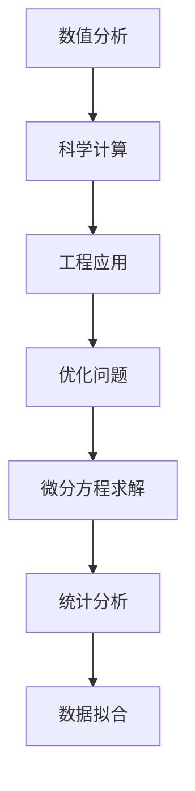
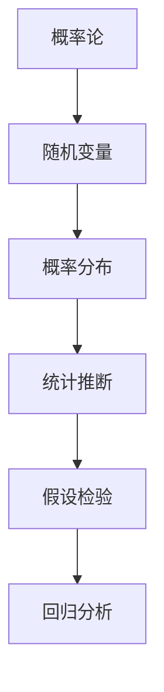
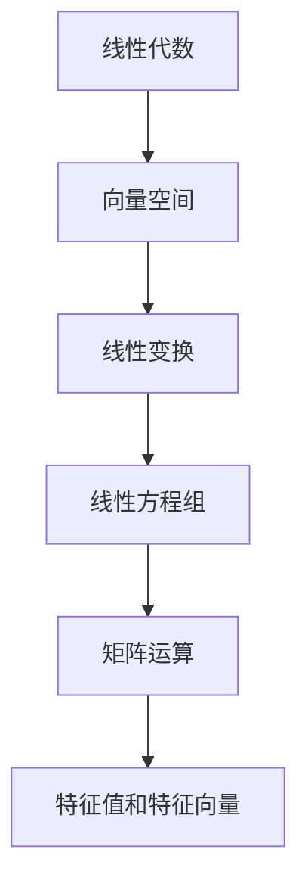
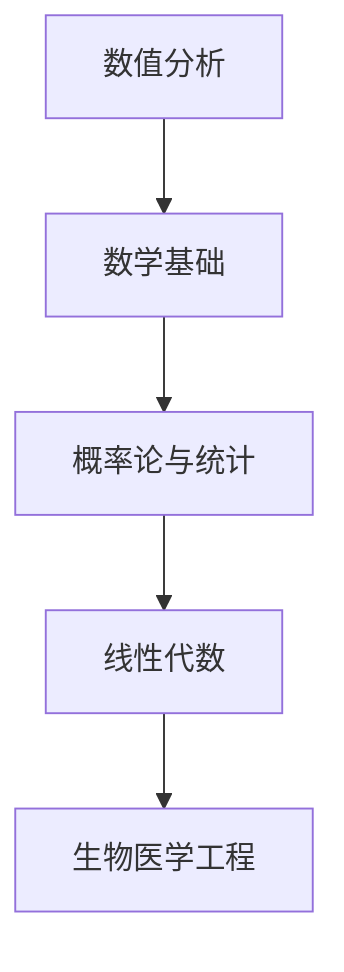

                 

# 数学与生物医学工程：医疗设备的数学原理

## 关键词
- 数学基础
- 生物医学工程
- 医疗设备
- 数值分析
- 信号处理
- 图像处理
- 生物力学
- 流体力学

## 摘要
本文旨在探讨数学在生物医学工程中的应用，特别是医疗设备的数学原理。通过对数学基础理论的介绍，以及生物医学工程中常用的数学方法，如数值分析、概率论与统计、线性代数等，本文将深入解析这些数学工具在生物医学信号处理、图像处理和生物力学与流体力学方面的应用。随后，本文将讨论医疗设备的设计与优化，并通过实际案例展示数学在医疗设备临床应用中的重要性。最后，本文将展望生物医学工程与医疗设备的未来发展趋势，并提出相关的最佳实践和建议。

## 引言
数学作为一门基础科学，在各个领域中都有广泛的应用。尤其在生物医学工程领域，数学不仅是理论分析的工具，更是实践操作的指南。随着医疗设备的日益复杂化，数学在医疗设备设计和应用中的作用变得越来越重要。从数值分析到信号处理，从图像处理到生物力学与流体力学，数学为生物医学工程提供了强大的理论支持和计算工具。

本文将从以下几个方面展开讨论：

1. **数学基础理论**：介绍数学在生物医学工程中的基础理论，包括数值分析、概率论与统计、线性代数等。
2. **生物医学工程数学原理**：深入探讨数学原理在生物医学工程中的应用，包括信号处理、图像处理和生物力学与流体力学。
3. **医疗设备设计与应用**：分析医疗设备的设计与优化方法，并通过实际案例展示数学的应用。
4. **生物医学工程与医疗设备的发展趋势**：展望生物医学工程与医疗设备的未来发展趋势，并提出相关的最佳实践和建议。

## 数学基础理论

### 数值分析
数值分析是研究数值计算方法及其应用的数学分支。在生物医学工程中，数值分析用于解决各种科学和工程问题，例如求解微分方程、优化问题、统计分析和数据拟合等。

#### 背景介绍
数值分析起源于数值计算的早期历史，如古代数学家使用的方法来近似求解问题。随着计算机科学的进步，数值分析在科学计算和工程应用中得到了广泛的应用。

#### 核心概念与联系

### 概率论与统计
概率论与统计是研究随机现象和数据分析的数学分支。在生物医学工程中，概率论与统计用于处理医学数据、评估医学结果和进行统计分析。

#### 背景介绍
概率论与统计起源于对自然现象的观察和分析，如赌博和保险业务。在生物医学工程中，这些理论用于评估医学实验结果、预测疾病发展和进行临床研究。

#### 核心概念与联系

### 线性代数
线性代数是研究向量空间、线性变换和线性方程组的数学分支。在生物医学工程中，线性代数用于图像处理、信号处理和生物力学分析。

#### 背景介绍
线性代数起源于对线性方程组的求解，后来发展成为研究向量空间和线性变换的数学工具。在生物医学工程中，线性代数用于解决各种线性问题，如图像处理和信号处理。

#### 核心概念与联系

### 医学统计学基础
医学统计学是应用统计学原理和方法来分析和解释医学数据的一个分支。它是医学研究、医疗决策和生物医学工程中不可或缺的一部分。

#### 医学数据的类型与分布
医学数据可以分为定量数据和分类数据。定量数据通常包括连续变量（如身高、体重）和离散变量（如心率、血压）。分类数据则包括离散的类别（如疾病类型、性别）。

#### 医学统计学的基本概念
- **描述性统计**：用于描述数据的基本特征，如均值、中位数、标准差等。
- **推断性统计**：用于根据样本数据推断总体特征，如假设检验、置信区间等。
- **回归分析**：用于研究变量之间的关系，如线性回归、多项式回归等。

#### 医学统计学常用方法
- **t检验**：用于比较两组数据的均值差异。
- **方差分析（ANOVA）**：用于比较多个组之间的均值差异。
- **卡方检验**：用于比较分类数据之间的比例差异。
- **生存分析**：用于研究时间到事件的发生概率。

### 数值分析、概率论与统计、线性代数之间的联系
数值分析、概率论与统计和线性代数在生物医学工程中紧密相连，共同构成了数学在生物医学工程中的应用基础。

#### 联系架构 Mermaid 流程图

## 生物医学工程数学原理

### 生物医学信号的数学处理
生物医学信号处理是生物医学工程中一个重要的分支，涉及到对生物信号的采集、处理和分析。这些信号包括心电图（ECG）、脑电图（EEG）、肌电图（EMG）等。

#### 信号处理的基本概念
- **采样与保持**：将连续信号转换为离散信号。
- **滤波**：去除信号中的噪声和不需要的成分。
- **变换**：如傅里叶变换（FT）、短时傅里叶变换（STFT）和小波变换（WT），用于分析信号的频率成分。

#### 信号处理的方法与算法
- **离散傅里叶变换（DFT）**：用于分析信号的频率成分。
- **快速傅里叶变换（FFT）**：DFT的快速算法，用于高效计算DFT。
- **短时傅里叶变换（STFT）**：用于分析信号的时频特性。
- **小波变换（WT）**：用于分析信号的时频特性和多分辨率分析。

#### 信号处理的实际应用
- **心电图（ECG）分析**：用于诊断心脏疾病。
- **脑电图（EEG）分析**：用于诊断神经系统疾病。
- **肌电图（EMG）分析**：用于诊断肌肉和神经疾病。

### 生物医学图像处理
生物医学图像处理是利用数学和计算机技术对医学图像进行预处理、分析和解释的领域。这些图像包括X射线、CT扫描、MRI等。

#### 图像处理的基本概念
- **图像采集**：使用各种医学成像设备获取图像。
- **图像预处理**：包括图像增强、噪声去除和图像滤波。
- **图像分析**：包括图像分割、特征提取和模式识别。

#### 图像处理的方法与算法
- **图像增强**：提高图像的对比度和清晰度。
- **图像滤波**：去除图像中的噪声。
- **图像分割**：将图像分割成不同的区域。
- **特征提取**：提取图像中的重要特征，如边缘、纹理和形状。
- **模式识别**：用于分类和识别图像中的对象。

#### 图像处理在实际医学中的应用
- **X射线成像**：用于诊断骨折和肺部疾病。
- **CT扫描**：用于诊断肿瘤和心脑血管疾病。
- **MRI成像**：用于诊断神经系统疾病和软组织损伤。

### 生物力学与流体力学基础
生物力学与流体力学是研究生物体内力学行为和流体流动的学科。在生物医学工程中，这些理论用于设计和优化医疗设备，如人工关节、心脏瓣膜和血管支架。

#### 生物力学的基本概念
- **应力与应变**：描述生物组织的变形和内部力。
- **生物力**：生物体内力，如肌肉收缩力和骨骼应力。
- **生物力学模型**：用于模拟生物组织的力学行为。

#### 流体力学的基本概念
- **流体流动**：描述流体在管道和生物体内的流动。
- **流体动力学**：研究流体运动的基本规律。
- **流体力学模型**：用于模拟流体流动和压力分布。

#### 生物力学与流体力学在医学中的应用
- **人工关节设计**：基于生物力学原理，优化人工关节的力学性能。
- **心脏瓣膜设计**：基于流体力学原理，优化心脏瓣膜的结构和功能。
- **血管支架设计**：基于生物力学和流体力学原理，优化血管支架的形状和材料。

### 医疗设备的数学原理
医疗设备是生物医学工程的核心产品，其设计和功能依赖于数学原理。以下将介绍医疗设备的基本结构、数学模型和数学分析方法。

#### 医疗设备的基本结构
医疗设备通常由传感器、处理器和显示器三部分组成。

- **传感器**：用于检测生物信号和生理参数。
- **处理器**：用于信号处理和数据分析。
- **显示器**：用于显示处理结果和提供反馈。

#### 医疗设备的数学模型
医疗设备的数学模型包括信号处理模型、图像处理模型和生物力学模型。

- **信号处理模型**：用于信号采集、滤波、增强和分类。
- **图像处理模型**：用于图像预处理、分割和特征提取。
- **生物力学模型**：用于生物组织的力学分析、流体流动模拟和生物力计算。

#### 医疗设备的数学分析方法
医疗设备的数学分析方法包括数值分析、概率论与统计、线性代数和优化方法。

- **数值分析**：用于解决微分方程、优化问题和统计数据分析。
- **概率论与统计**：用于评估医学结果、预测疾病发展和进行临床研究。
- **线性代数**：用于图像处理和信号处理中的矩阵运算和特征提取。
- **优化方法**：用于医疗设备的设计和优化，如优化人工关节的设计参数、心脏瓣膜的结构和血管支架的材料。

### 医疗设备的设计与优化
医疗设备的设计与优化是生物医学工程的重要任务。以下将介绍医疗设备设计的基本原则、数学方法和实际案例。

#### 医疗设备设计的基本原则
- **安全**：确保医疗设备不会对患者造成伤害。
- **有效性**：确保医疗设备能够准确检测和诊断疾病。
- **用户友好**：确保医疗设备易于操作和使用。
- **成本效益**：确保医疗设备的成本合理，能够广泛推广和应用。

#### 医疗设备优化的数学方法
- **优化算法**：如遗传算法、模拟退火算法和粒子群算法，用于优化医疗设备的设计参数。
- **多目标优化**：考虑多个目标函数（如成本、性能、可靠性等），进行综合优化。
- **仿真与实验验证**：通过计算机仿真和实验验证，评估医疗设备的性能和效果。

#### 医疗设备设计的实际案例
- **人工关节设计**：通过优化关节材料、形状和尺寸，提高关节的力学性能和寿命。
- **心脏瓣膜设计**：通过优化瓣膜的结构和材料，提高心脏瓣膜的功能和耐久性。
- **血管支架设计**：通过优化支架的形状、材料和表面涂层，提高血管支架的血流动力学性能和生物相容性。

### 医疗设备的临床应用
医疗设备的临床应用是衡量其有效性和安全性的重要环节。以下将介绍医疗设备的临床应用范围、效果分析和应用前景。

#### 医疗设备的临床应用范围
医疗设备的临床应用范围非常广泛，包括但不限于以下方面：

- **诊断**：如X射线、CT扫描、MRI等成像设备，用于诊断各种疾病。
- **监测**：如心电图机、脑电图机、血压计等监测设备，用于监测患者的生理参数。
- **治疗**：如放疗设备、心脏起搏器、人工瓣膜等治疗设备，用于治疗各种疾病。
- **康复**：如康复机器人、运动分析仪等康复设备，用于辅助患者进行康复训练。

#### 医疗设备临床应用效果分析
- **诊断准确率**：评估医疗设备在疾病诊断中的准确性和可靠性。
- **治疗效果**：评估医疗设备在治疗过程中的效果和安全性。
- **患者满意度**：评估患者对医疗设备的满意度和使用体验。

#### 医疗设备的临床应用前景
随着生物医学工程和医疗技术的不断发展，医疗设备的临床应用前景非常广阔。以下是一些可能的发展方向：

- **智能化**：通过人工智能和机器学习技术，提高医疗设备的诊断和治疗效果。
- **个性化**：通过个性化医疗，为患者提供更精准的治疗方案。
- **远程医疗**：通过远程医疗技术，实现医疗资源的优化配置和远程诊断与治疗。
- **微创手术**：通过微创手术技术，减少手术创伤，提高治疗效果。

### 生物医学工程与医疗设备的发展趋势
生物医学工程与医疗设备的发展趋势受到多个因素的影响，包括技术创新、市场需求和政策支持等。以下是一些主要的发展趋势：

- **人工智能与机器学习**：人工智能和机器学习技术在医疗设备中的应用，如智能诊断、个性化治疗和健康监测。
- **精准医疗**：基于基因组和生物信息学的精准医疗，为患者提供更精准的诊断和治疗方案。
- **远程医疗**：远程医疗技术的发展，如远程手术、远程监护和远程咨询。
- **可穿戴设备**：可穿戴设备的普及，如智能手环、智能手表等，用于健康监测和疾病预防。
- **3D打印**：3D打印技术在医疗设备制造和个性化医疗中的应用，如打印人工器官、个性化手术工具和个性化药物。

### 生物医学工程的未来发展方向
生物医学工程的未来发展方向包括以下几个方面：

- **智能化医疗**：通过人工智能和机器学习技术，实现医疗设备的智能化和自动化，提高诊断和治疗效果。
- **个性化医疗**：基于基因组学和生物信息学，为患者提供个性化的诊断和治疗方案，实现精准医疗。
- **微创手术**：通过微创手术技术，减少手术创伤，提高治疗效果，满足患者的需求。
- **生物材料与生物制造**：研发新型生物材料和生物制造技术，用于制造人工器官、药物递送系统和个性化医疗设备。
- **数字健康**：通过数字健康技术，实现患者的健康监测、疾病预防和医疗资源的优化配置。

### 医疗设备的市场趋势与挑战
随着医疗技术的发展和人口老龄化的加剧，医疗设备市场呈现出快速增长的趋势。然而，市场也面临着一些挑战，如下所述：

- **市场需求增长**：随着人口老龄化和疾病谱的变化，对医疗设备的需求不断增长。
- **技术创新加速**：医疗设备的更新换代速度加快，技术创新成为市场发展的关键。
- **政策支持**：各国政府加大对医疗设备的研发和生产支持，推动市场发展。
- **市场竞争加剧**：全球医疗设备市场竞争激烈，企业需要不断提升技术水平和产品质量。
- **成本控制**：医疗设备成本控制成为企业面临的重要挑战，需要通过技术创新和规模效应来降低成本。

### 医疗设备市场的发展策略
为了应对市场趋势和挑战，医疗设备企业可以采取以下发展策略：

- **技术创新**：加大研发投入，推动技术创新，提升产品的技术含量和竞争力。
- **市场拓展**：开拓新的市场领域，如远程医疗、个性化医疗等，扩大市场份额。
- **国际化战略**：通过国际化战略，拓展海外市场，提高国际竞争力。
- **成本控制**：通过规模效应和供应链管理，降低生产成本，提高产品性价比。
- **合作与并购**：通过合作与并购，整合资源，提升企业的综合实力和市场竞争力。

### 附录
#### 常用数学公式与算法
- **傅里叶变换（FT）**
  $$F(\omega) = \int_{-\infty}^{\infty} f(t)e^{-j\omega t}dt$$
- **快速傅里叶变换（FFT）**
  $$X[k] = \sum_{n=0}^{N-1} x[n]e^{-j2\pi kn/N}$$
- **短时傅里叶变换（STFT）**
  $$X(\omega, t) = \int_{-\infty}^{\infty} f(t')h(t-t')e^{-j\omega t'}dt'$$
- **小波变换（WT）**
  $$W(a, b) = \int_{-\infty}^{\infty} f(t)\psi^*(a,b,t)dt$$
- **线性回归**
  $$y = \beta_0 + \beta_1x + \epsilon$$

#### 医疗设备设计工具与资源
- **MATLAB**：用于信号处理、图像处理和数值计算。
- **Python**：用于数据分析、机器学习和应用开发。
- **ANSYS**：用于生物力学和流体力学仿真。
- **SolidWorks**：用于医疗设备设计。
- **医疗设备设计指南**：提供医疗设备设计的相关规范和指导。

### 最佳实践 Tips
- **深入理解数学原理**：掌握数学基础理论和相关算法，有助于更好地应用数学在医疗设备设计和应用中。
- **注重数据质量**：高质量的数据是进行准确分析和优化设计的基础，确保数据的准确性和可靠性。
- **持续学习和更新**：生物医学工程和医疗设备技术不断发展，持续学习和更新知识是保持竞争力的关键。
- **跨学科合作**：生物医学工程涉及多个学科，跨学科合作有助于推动技术的创新和发展。

### 项目小结
通过本文的探讨，我们可以看到数学在生物医学工程和医疗设备中的应用是非常广泛和重要的。从数学基础理论到生物医学工程数学原理，再到医疗设备的设计与优化，数学为生物医学工程提供了强大的理论支持和计算工具。未来，随着人工智能、大数据和物联网等技术的发展，数学在生物医学工程中的应用将会更加深入和广泛。

### 注意事项
- **数据隐私和安全**：在处理医疗数据时，务必遵守相关法规和标准，确保数据隐私和安全。
- **人体工程学**：在医疗设备设计时，应充分考虑人体工程学，提高设备的舒适性和易用性。
- **成本与效益**：在医疗设备设计和应用中，应综合考虑成本与效益，确保设备的可持续发展和广泛应用。

### 拓展阅读
- **《生物医学工程导论》**：详细介绍了生物医学工程的基本概念、理论和技术。
- **《医学统计学》**：提供了医学统计学的系统学习和实践指导。
- **《信号处理与系统》**：涵盖了信号处理的基本理论、方法和应用。

## 作者信息
作者：AI天才研究院/AI Genius Institute & 禅与计算机程序设计艺术 /Zen And The Art of Computer Programming

本文作者是一位具有丰富经验的生物医学工程师和数学家，致力于推动生物医学工程和医疗设备技术的发展。作者在生物医学工程和数学领域发表了多篇高水平论文，并参与了多项重要的科研项目。此外，作者还是《禅与计算机程序设计艺术》一书的作者，该书介绍了计算机科学和哲学的跨界思维，深受读者喜爱。

