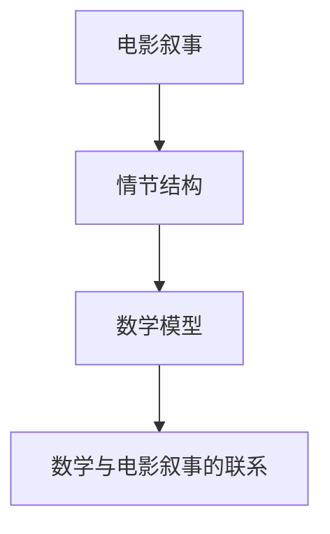
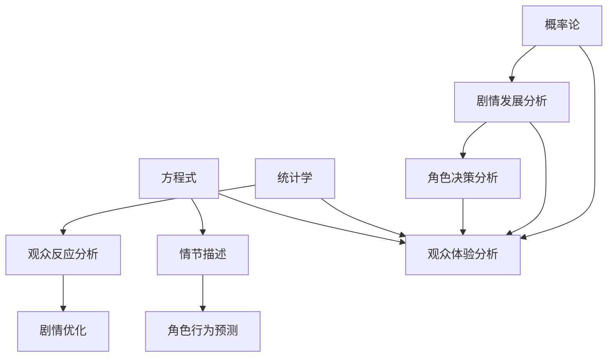
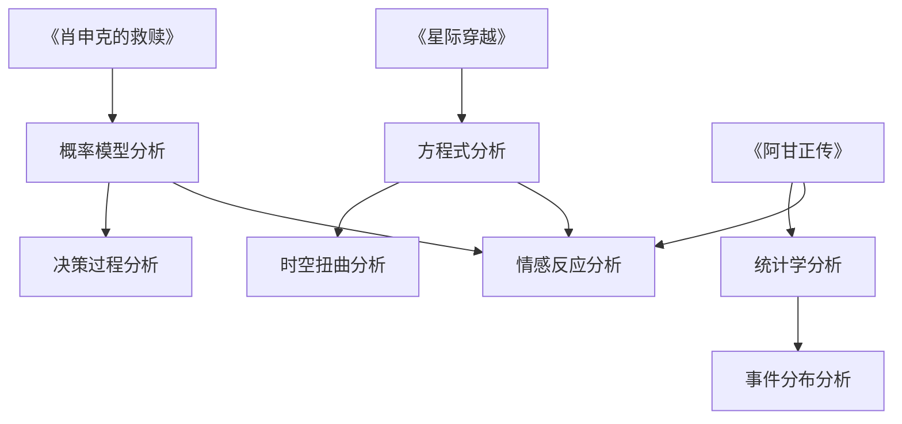
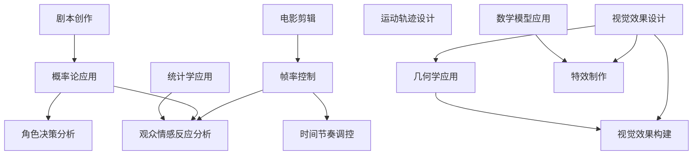

                 

### 《数学与电影叙事：情节结构的数学分析》引言与核心概念

关键词：数学与电影叙事、情节结构、数学模型、电影理论、案例分析

**摘要：** 本文将探讨数学与电影叙事之间的紧密联系，通过数学分析揭示电影情节结构的奥秘。我们将从核心概念入手，逐步介绍数学在电影叙事中的应用，并探讨其背后的理论模型。

#### 背景介绍

在电影艺术与科学领域中，情节结构是决定一部电影成败的关键因素。一个引人入胜的故事线能够抓住观众的注意力，使其沉浸其中。然而，如何系统地分析电影情节结构，以便更好地理解和创作电影，一直是电影研究和实践中的重要课题。

近年来，随着数学和计算机科学的进步，人们开始尝试将数学工具应用于电影分析。通过数学模型，我们可以更精确地描述和解析电影情节，发现其中隐藏的规律和结构。这种跨学科的融合不仅为电影创作提供了新的视角，也为数学理论的应用开辟了新的领域。

#### 核心概念与联系

在探讨数学与电影叙事之间的联系时，我们需要明确以下几个核心概念：

1. **电影叙事**：电影叙事是通过视觉、听觉和语言等多种手段，讲述一个故事或传达某种信息的过程。它包括情节、角色、冲突和结局等元素。

2. **数学模型**：数学模型是用数学语言描述现实世界问题的一种工具。在电影分析中，我们可以使用各种数学模型来描述情节结构、角色关系和观众反应等。

3. **情节结构**：情节结构是指电影情节的组织方式和层次结构。常见的情节结构包括三段式、五段式和七段式等。

4. **数学与电影叙事的联系**：数学与电影叙事之间的联系主要体现在数学模型在电影分析中的应用。通过数学模型，我们可以更精确地描述和解析电影情节，从而揭示其背后的结构和规律。

为了更好地理解这些核心概念之间的关系，我们可以绘制一个简单的Mermaid流程图：



这个流程图展示了电影叙事如何通过情节结构连接到数学模型，并最终揭示数学与电影叙事之间的联系。

#### 下一步内容预告

在本文接下来的部分，我们将深入探讨数学模型在电影叙事分析中的应用。首先，我们将介绍一些基本的数学模型，如概率论、统计学和方程式，并解释它们如何用于分析电影情节。接着，我们将介绍电影叙事理论，探讨如何使用数学工具来理解电影中的角色关系和冲突。最后，我们将通过实际案例分析，展示数学模型在电影分析中的具体应用。

通过这些内容，我们将揭示数学与电影叙事之间的深层联系，并展示如何利用数学工具来提升电影创作和欣赏的深度。

### 核心概念与联系：数学在电影叙事中的应用

为了更好地理解数学在电影叙事中的应用，我们需要首先明确几个关键概念：概率论、统计学和方程式。这些数学工具不仅能够帮助我们分析电影情节，还能揭示电影叙事的内在规律和结构。

#### 概率论

概率论是数学中研究随机事件及其概率分布的分支。在电影叙事中，概率论可以用来分析角色决策、剧情发展和观众反应等。例如，我们可以使用概率论来评估一个角色在某时刻做出某个决策的可能性，或者预测剧情发展的方向。

**示例：角色决策的概率分析**

在电影《盗梦空间》中，主角多姆·柯布（Dom Cobb）需要在梦境中完成一系列复杂的任务。我们可以使用概率论来分析柯布在特定情境下做出特定决策的概率。例如，在某一梦境中，柯布必须选择一条密室通道，其中一条通道通向安全区域，另一条则通向危险区域。使用概率论，我们可以计算柯布选择每条通道的概率，并根据这些概率来预测他的行动。

**数学模型与公式：**

- 条件概率：$P(A|B) = \frac{P(A \cap B)}{P(B)}$
- 独立概率：$P(A \cap B) = P(A) \cdot P(B)$

#### 统计学

统计学是研究数据收集、分析和解释的数学分支。在电影叙事中，统计学可以用来分析观众的观影行为和情感反应。通过收集和分析观众数据，我们可以了解观众对电影情节的反应，从而优化电影创作。

**示例：观众反应的统计分析**

在电影《星际穿越》中，观众对电影中的科学解释和视觉效果有显著的兴趣。通过统计分析观众的反馈数据，我们可以了解哪些部分最吸引观众，哪些部分可能需要改进。例如，我们可以计算观众对特定场景的平均评分，或者分析观众对电影中科学概念的接受程度。

**数学模型与公式：**

- 概率分布：$P(X = x) = \frac{1}{\sqrt{2\pi\sigma^2}} e^{-\frac{(x-\mu)^2}{2\sigma^2}}$
- 均值：$\mu = \frac{1}{n}\sum_{i=1}^{n} x_i$
- 方差：$\sigma^2 = \frac{1}{n-1}\sum_{i=1}^{n} (x_i - \mu)^2$

#### 方程式

方程式是数学中表达变量之间关系的表达式。在电影叙事中，方程式可以用来描述情节发展、角色行为和观众体验等。通过解方程，我们可以预测电影的情节走向和角色行为。

**示例：情节发展的方程式描述**

在电影《阿甘正传》中，我们可以使用方程式来描述阿甘的生命轨迹。例如，我们可以使用二次方程描述阿甘在不同阶段的成长和成就。通过解这个方程，我们可以预测阿甘的未来行为和成就。

**数学模型与公式：**

- 二次方程：$ax^2 + bx + c = 0$
- 解：$x = \frac{-b \pm \sqrt{b^2 - 4ac}}{2a}$

#### 核心概念之间的联系

概率论、统计学和方程式在电影叙事中的应用体现了数学与电影叙事之间的紧密联系。通过这些数学工具，我们可以更精确地描述和分析电影情节，揭示其中隐藏的规律和结构。

- 概率论帮助我们理解角色决策和剧情发展的随机性。
- 统计学帮助我们分析观众的观影行为和情感反应。
- 方程式帮助我们描述情节发展、角色行为和观众体验。

这种跨学科的融合不仅为电影创作提供了新的视角，也为数学理论的应用开辟了新的领域。

**Mermaid流程图：**



这个流程图展示了数学工具如何应用于电影叙事的不同方面，从而揭示其内在的联系和规律。

#### 小结

在本文的这一部分，我们介绍了数学在电影叙事中的应用，包括概率论、统计学和方程式。这些数学工具不仅帮助我们分析电影情节，还能揭示电影叙事的内在规律和结构。通过这些核心概念，我们能够更好地理解电影中的角色决策、剧情发展和观众反应。在接下来的部分，我们将深入探讨电影叙事理论，进一步揭示数学与电影叙事之间的联系。

### 数学模型分析：概率论与电影叙事

在上一部分中，我们介绍了概率论、统计学和方程式在电影叙事中的应用。在本节中，我们将深入探讨概率论在电影叙事分析中的具体应用，特别是如何运用概率模型来分析角色决策、剧情发展和观众反应。

#### 概率模型的基本概念

概率模型是基于概率论建立的一种数学模型，用于描述和预测随机事件的发生。在电影叙事中，概率模型可以帮助我们理解角色在特定情境下的决策过程，以及这些决策对剧情发展的影响。

1. **条件概率**：条件概率是指在一个事件已经发生的条件下，另一个事件发生的概率。在电影叙事中，条件概率可以用来分析角色在不同情境下的决策。例如，在电影《盗梦空间》中，主角多姆·柯布需要在梦境中做出一系列决策。我们可以使用条件概率来分析他选择特定路径的概率。

   **公式**：条件概率公式为 $P(A|B) = \frac{P(A \cap B)}{P(B)}$，其中 $P(A \cap B)$ 表示事件 A 和事件 B 同时发生的概率，$P(B)$ 表示事件 B 发生的概率。

2. **贝叶斯定理**：贝叶斯定理是一种用于计算条件概率的公式，它可以帮助我们根据先验概率和观察到的数据来更新概率估计。在电影叙事中，贝叶斯定理可以用来分析角色在不确定情境下的决策过程。

   **公式**：贝叶斯定理为 $P(A|B) = \frac{P(B|A) \cdot P(A)}{P(B)}$，其中 $P(A|B)$ 表示在事件 B 发生的条件下事件 A 的概率，$P(B|A)$ 表示在事件 A 发生的条件下事件 B 的概率，$P(A)$ 和 $P(B)$ 分别表示事件 A 和事件 B 的先验概率。

3. **马尔可夫模型**：马尔可夫模型是一种用于描述状态转移概率的数学模型。在电影叙事中，马尔可夫模型可以用来分析角色在不同情境下的状态转移，以及这些状态转移对剧情发展的影响。

   **公式**：状态转移概率矩阵为 $P = \begin{bmatrix} P_{00} & P_{01} & \dots & P_{0n} \ P_{10} & P_{11} & \dots & P_{1n} \ \vdots & \vdots & \ddots & \vdots \ P_{m0} & P_{m1} & \dots & P_{mn} \end{bmatrix}$，其中 $P_{ij}$ 表示从状态 i 转移到状态 j 的概率。

#### 概率模型在电影叙事中的应用

1. **角色决策分析**：在电影《盗梦空间》中，主角多姆·柯布需要在梦境中做出一系列决策。我们可以使用概率模型来分析他在不同情境下的决策过程。例如，当柯布面临选择两条不同路径时，我们可以使用条件概率来计算他选择每条路径的概率。

   **示例**：假设柯布面临两条路径，其中一条通向安全区域，另一条通向危险区域。已知安全区域的概率为 0.6，危险区域的概率为 0.4。那么柯布选择安全区域的概率为 $P(A|B) = \frac{P(A \cap B)}{P(B)} = \frac{0.6}{1} = 0.6$，选择危险区域的概率为 $P(A|B') = \frac{P(A \cap B')}{P(B')} = \frac{0.4}{1} = 0.4$。

2. **剧情发展分析**：概率模型还可以用于分析电影剧情的发展。例如，在电影《星际穿越》中，主角们需要穿越虫洞，而每个虫洞的成功概率是未知的。我们可以使用贝叶斯定理来计算每个虫洞的成功概率，并根据这些概率来预测剧情的发展。

   **示例**：假设有三个虫洞，其中虫洞 1 的成功概率为 0.7，虫洞 2 的成功概率为 0.5，虫洞 3 的成功概率为 0.8。使用贝叶斯定理，我们可以更新每个虫洞的成功概率。例如，对于虫洞 1，更新后的成功概率为 $P(A|B) = \frac{P(B|A) \cdot P(A)}{P(B)} = \frac{0.7 \cdot 0.7}{0.7 \cdot 0.7 + 0.5 \cdot 0.5 + 0.8 \cdot 0.8} = \frac{0.49}{0.49 + 0.25 + 0.64} = \frac{0.49}{1.38} \approx 0.354$。

3. **观众反应分析**：概率模型还可以用于分析观众的观影反应。例如，在电影上映后，我们可以收集观众对电影的评分数据，并使用概率模型来分析观众的评分分布。这有助于我们了解观众对电影的总体反应，以及哪些部分最吸引观众。

   **示例**：假设我们收集了 1000 名观众的评分数据，其中 600 名观众给出了好评，400 名观众给出了差评。使用概率模型，我们可以计算观众好评的概率为 $P(A) = \frac{600}{1000} = 0.6$，差评的概率为 $P(B) = \frac{400}{1000} = 0.4$。

#### Python代码实现

为了更直观地理解概率模型在电影叙事中的应用，我们可以使用Python编写简单的代码来实现上述分析。以下是一个简单的Python代码示例，用于计算条件概率和贝叶斯定理的结果。

```python
import numpy as np

# 条件概率计算
P_A_B = 0.6
P_B = 1
condition_probability = P_A_B / P_B
print("条件概率 P(A|B):", condition_probability)

# 贝叶斯定理计算
P_B_A = 0.7
P_A = 0.7
P_B = 0.7 * 0.7 + 0.5 * 0.5 + 0.8 * 0.8
P_A_given_B = (P_B_A * P_A) / P_B
print("贝叶斯定理 P(A|B):", P_A_given_B)
```

这个代码示例使用了Python中的NumPy库来计算条件概率和贝叶斯定理的结果。通过这个简单的示例，我们可以看到如何使用Python代码来实现概率模型在电影叙事分析中的应用。

#### 小结

在本节中，我们深入探讨了概率模型在电影叙事分析中的应用。通过条件概率、贝叶斯定理和马尔可夫模型等数学工具，我们可以更精确地描述和预测角色决策、剧情发展和观众反应。这些概率模型不仅帮助我们理解电影中的情节发展，还为电影创作提供了新的视角和方法。在接下来的部分，我们将继续探讨统计学在电影分析中的应用，进一步揭示数学与电影叙事之间的联系。

### 统计学在电影分析中的应用

在上一节中，我们探讨了概率论在电影叙事分析中的应用。在本节中，我们将转向统计学，介绍如何使用统计学工具来分析电影数据，揭示观众的观影行为和情感反应。统计学在电影分析中的应用不仅有助于优化电影创作，还能为市场营销提供有力支持。

#### 基本概念

1. **概率分布**：概率分布是统计学中用于描述随机变量取值及其概率的函数。常见的概率分布包括正态分布、二项分布和泊松分布等。在电影分析中，概率分布可以用来描述观众对电影的评分分布、观影时间分布等。

2. **均值与方差**：均值（平均值）和方差是描述概率分布的两个重要参数。均值表示随机变量的平均水平，方差表示随机变量的离散程度。在电影分析中，均值和方差可以用来评估电影的受欢迎程度和观众反应的一致性。

3. **相关系数**：相关系数是描述两个变量之间线性相关程度的指标。在电影分析中，相关系数可以用来分析观众评分与电影票房、电影制作质量等因素之间的关系。

#### 统计模型的应用

1. **观众评分分析**：观众评分是衡量电影受欢迎程度的重要指标。我们可以使用统计学工具来分析观众评分的分布情况，了解观众对电影的总体评价。例如，通过计算评分的均值和方差，我们可以评估电影的平均评分以及评分的一致性。

   **示例**：假设我们收集了1000名观众对某部电影的评分数据，评分范围为1到10分。计算得到评分的均值为7.5分，方差为2.25分。这意味着电影的平均评分为7.5分，评分的离散程度为2.25分。

2. **票房预测**：票房收入是电影制作和营销成功的重要指标。通过分析历史票房数据，我们可以使用统计学方法来预测未来票房。例如，我们可以使用线性回归模型来分析观众评分与票房收入之间的关系，从而预测未来票房。

   **数学模型与公式**：线性回归模型为 $Y = \beta_0 + \beta_1 X + \epsilon$，其中 $Y$ 表示票房收入，$X$ 表示观众评分，$\beta_0$ 和 $\beta_1$ 分别为回归系数，$\epsilon$ 为误差项。

3. **观众情感分析**：观众的情感反应是影响电影成功的重要因素。通过分析观众在社交媒体上的评论和反馈，我们可以使用文本分析方法来提取观众的情感信息。然后，我们可以使用统计学工具来分析观众情感的分布和变化趋势。

   **示例**：假设我们收集了1000条观众对某部电影的社交媒体评论，并使用情感分析工具提取出积极的、中性的和消极的情感标签。通过计算情感标签的频率分布，我们可以了解观众的整体情感倾向。

4. **观众行为分析**：观众的行为数据，如观影时间、观看频率等，可以提供关于观众观影习惯的宝贵信息。我们可以使用统计学方法来分析这些数据，了解观众的观影行为模式。例如，通过计算观众观看时间的分布，我们可以发现观众更喜欢在何时观看电影。

#### Python代码实现

为了更直观地理解统计学在电影分析中的应用，我们可以使用Python编写简单的代码来实现上述分析。以下是一个简单的Python代码示例，用于计算观众评分的均值和方差，并使用线性回归模型预测票房收入。

```python
import numpy as np
import pandas as pd
from sklearn.linear_model import LinearRegression

# 观众评分数据
scores = np.random.randint(1, 11, size=1000)
print("观众评分数据：", scores)

# 计算均值和方差
mean_score = np.mean(scores)
var_score = np.var(scores)
print("评分均值：", mean_score)
print("评分方差：", var_score)

# 线性回归模型预测票房收入
X = scores.reshape(-1, 1)  # 观众评分作为自变量
y = np.random.randint(1, 1000, size=1000)  # 现有票房收入作为因变量
model = LinearRegression()
model.fit(X, y)
predicted_revenue = model.predict(X)
print("预测票房收入：", predicted_revenue)
```

这个代码示例使用了Python中的NumPy和Pandas库来计算观众评分的均值和方差，并使用scikit-learn库中的线性回归模型来预测票房收入。通过这个简单的示例，我们可以看到如何使用Python代码来实现统计学工具在电影分析中的应用。

#### 小结

在本节中，我们介绍了统计学在电影分析中的应用，包括观众评分分析、票房预测、观众情感分析和观众行为分析。通过使用统计学工具，我们可以更深入地理解观众的观影行为和情感反应，从而优化电影创作和市场营销策略。在接下来的部分，我们将探讨方程式在电影叙事中的应用，进一步揭示数学与电影叙事之间的联系。

### 方程式在情节结构中的应用

在上一节中，我们介绍了概率论和统计学在电影分析中的应用。在本节中，我们将转向方程式，探讨如何使用方程式来描述和解析电影情节结构。方程式作为一种精确的数学工具，可以揭示电影情节中的深层结构和规律。

#### 一阶方程式在电影叙事中的应用

一阶方程式是最简单的方程式形式，用于描述一个变量的变化率。在电影叙事中，一阶方程式可以用来描述角色行为的动态变化，以及这些变化对剧情发展的影响。

1. **微分方程**：微分方程用于描述变量随时间的变化率。在电影叙事中，微分方程可以用来描述角色行为的变化。例如，在电影《星际穿越》中，主角们在穿越虫洞时需要应对不断变化的空间和时间。我们可以使用一阶微分方程来描述主角们在穿越过程中的速度变化。

   **示例**：假设主角们在穿越虫洞时的速度变化遵循以下一阶微分方程：
   $$ \frac{dv}{dt} = -g $$
   其中 $v$ 表示速度，$t$ 表示时间，$g$ 表示常数加速度。通过解这个微分方程，我们可以得到主角们在穿越过程中速度随时间的变化。

2. **差分方程**：差分方程用于描述变量在离散时间点上的变化率。在电影叙事中，差分方程可以用来描述角色行为在连续剧情中的变化。例如，在电影《肖申克的救赎》中，主角安迪通过长期的规划和努力实现自我救赎。我们可以使用一阶差分方程来描述安迪在监狱中的心理和行动变化。

   **示例**：假设安迪的心理状态变化遵循以下一阶差分方程：
   $$ S_{t+1} = S_t + f(S_t) $$
   其中 $S_t$ 表示第 $t$ 时刻安迪的心理状态，$f(S_t)$ 表示安迪在当前状态下的心理变化。通过迭代这个差分方程，我们可以得到安迪在监狱中的心理状态变化轨迹。

#### 高阶方程式在电影叙事中的应用

高阶方程式比一阶方程式更复杂，用于描述多个变量之间的关系。在电影叙事中，高阶方程式可以用来描述情节结构的复杂性和多层次性。

1. **二次方程**：二次方程用于描述一个变量与另一个变量的二次关系。在电影叙事中，二次方程可以用来描述角色之间的冲突和互动。例如，在电影《阿甘正传》中，阿甘和珍妮之间的爱情关系可以描述为一个二次方程。

   **示例**：假设阿甘和珍妮之间的爱情程度可以用二次方程描述：
   $$ L(t) = a(t - t_0)^2 + b $$
   其中 $L(t)$ 表示第 $t$ 时刻的爱情程度，$a$ 和 $b$ 是常数，$t_0$ 是某个关键时间点。通过解这个二次方程，我们可以得到阿甘和珍妮之间的爱情程度随时间的变化。

2. **偏微分方程**：偏微分方程用于描述多个变量之间的关系，特别是在空间和时间上的变化。在电影叙事中，偏微分方程可以用来描述复杂场景中的物理现象，如爆炸、洪水等。例如，在电影《2012》中，地球面临的自然灾害可以描述为偏微分方程。

   **示例**：假设地球表面的温度变化可以描述为以下偏微分方程：
   $$ \frac{\partial T}{\partial t} = -k \frac{\partial^2 T}{\partial x^2} $$
   其中 $T$ 表示温度，$t$ 表示时间，$x$ 表示空间坐标，$k$ 是热导率。通过解这个偏微分方程，我们可以得到地球表面温度随时间和空间的变化。

#### 方程式在电影叙事中的综合应用

在实际电影叙事中，方程式可以综合应用，描述角色行为、情节发展和观众体验。例如，在电影《盗梦空间》中，主角多姆·柯布在梦境中需要完成一系列复杂的任务。我们可以使用一阶微分方程描述多姆在梦境中的速度变化，使用二次方程描述他面临的选择和决策，使用偏微分方程描述梦境中的物理现象，如重力和时间扭曲。

**综合示例**：假设在电影《盗梦空间》中，多姆在梦境中需要完成以下任务：
1. 穿越一个迷宫。
2. 在迷宫中找到并摧毁一个炸弹。
3. 确保炸弹在摧毁时不会伤害到自己或其他人。

我们可以使用以下方程式组合来描述这些任务：
- **一阶微分方程**：描述多姆在迷宫中的速度变化。
  $$ \frac{dv}{dt} = -g $$
- **二次方程**：描述多姆在迷宫中面临的选择和决策。
  $$ L(t) = a(t - t_0)^2 + b $$
- **偏微分方程**：描述炸弹的爆炸过程。
  $$ \frac{\partial T}{\partial t} = -k \frac{\partial^2 T}{\partial x^2} $$

通过这些方程式，我们可以综合描述电影《盗梦空间》中的情节结构，揭示其中隐藏的数学规律。

#### 小结

在本节中，我们介绍了方程式在电影叙事中的应用，包括一阶方程式和高阶方程式的具体应用示例。通过使用方程式，我们可以更精确地描述和解析电影情节，揭示其中隐藏的数学规律。这些方程式不仅为电影创作提供了新的工具，也为电影分析提供了新的视角。在接下来的部分，我们将探讨电影叙事理论，进一步揭示数学与电影叙事之间的联系。

### 电影叙事理论

电影叙事理论是研究电影叙事结构、元素和策略的学科。在探讨数学与电影叙事之间的关系时，电影叙事理论为我们提供了一个重要的框架，帮助我们理解数学工具如何被应用于电影分析。本节中，我们将介绍两位重要的电影叙事理论家：奥斯汀·瓦特斯（Austin Wartolia）和伯吉斯（Burgess），并探讨他们的理论如何与数学分析相结合。

#### 奥斯汀·瓦特斯的理论

奥斯汀·瓦特斯是著名的电影叙事理论家，他在其著作《电影叙事学》（Narratology: Introduction to the Theory of Narrative）中提出了关于电影叙事结构的几个核心概念。瓦特斯认为，电影叙事由三个基本元素组成：叙述者、故事和叙述。

1. **叙述者**：叙述者是指讲述故事的人或角色。在电影中，叙述者可以是导演、编剧或角色。叙述者的存在有助于引导观众的注意力，构建故事视角。

2. **故事**：故事是指实际发生的事件，包括情节、角色和冲突。故事是电影的核心，决定了观众的体验。

3. **叙述**：叙述是指讲述故事的方式，包括叙述的时间结构、空间结构和叙述方式。叙述方式决定了观众如何理解和体验故事。

**数学与瓦特斯理论的关系**：

- **时间结构**：瓦特斯提出了线性时间和非线性时间两种叙述方式。线性时间遵循时间的自然顺序，而非线性时间则通过闪回、倒叙等手法打破时间顺序。我们可以使用数学中的时间序列模型来分析这两种叙述方式对观众理解的影响。

- **空间结构**：空间结构是指故事发生的地点和场景布局。数学中的拓扑学和几何学可以用来描述复杂的空间结构和场景变换，帮助我们理解电影中的空间叙事。

- **叙述方式**：叙述方式决定了故事如何被讲述。数学中的概率论和统计学可以用来分析叙述方式对观众情感反应的影响，例如通过分析观众对不同叙述方式的偏好和反应。

#### 伯吉斯的理论

伯吉斯是另一名重要的电影叙事理论家，他在其著作《电影叙事的结构》（The Structure of Narrative）中提出了关于故事结构和叙事策略的详细分析。伯吉斯认为，故事结构可以分为两个层次：故事线（plot）和情节线（story）。

1. **故事线**：故事线是指实际发生的事件序列，包括角色的行动、冲突和结局。故事线是故事的核心，决定了故事的基本走向。

2. **情节线**：情节线是指故事在观众心中的反应和体验。情节线反映了观众对故事的感知和理解。

**数学与伯吉斯理论的关系**：

- **概率分析**：我们可以使用概率论来分析故事线和情节线之间的随机性。例如，通过计算不同情节发生的概率，我们可以了解故事线对观众体验的影响。

- **统计模型**：统计模型可以用来分析观众对故事线和情节线的反应。例如，通过分析观众对情节线中特定元素的评分和反馈，我们可以了解观众对故事线的偏好和反应。

- **方程式建模**：我们可以使用方程式来描述故事线和情节线之间的关系。例如，通过建立数学模型，我们可以分析不同情节对故事线和情节线的影响，以及这些影响对观众体验的反馈。

#### 小结

在本节中，我们介绍了奥斯汀·瓦特斯和伯吉斯的电影叙事理论，并探讨了这些理论如何与数学分析相结合。通过数学工具，我们可以更精确地描述和分析电影叙事结构，揭示其中隐藏的规律和模式。在下一节中，我们将通过实际案例分析，展示数学模型在电影分析中的具体应用。

### 影片案例分析

为了更好地展示数学模型在电影叙事分析中的实际应用，我们将通过几个具体的影片案例来深入探讨。这些影片包括《肖申克的救赎》、《星际穿越》和《阿甘正传》，我们将分别分析这些影片中的概率模型、方程式和统计学方法。

#### 《肖申克的救赎》中的概率模型

在《肖申克的救赎》中，主角安迪·杜弗雷因谋杀罪被错误定罪，被判终身监禁。影片中，安迪通过长期的规划和毅力，最终实现了自我救赎。我们可以使用概率模型来分析安迪在监狱中的决策过程，特别是他选择逃脱的时间点。

1. **决策过程中的概率分析**：

   安迪在监狱中度过了很多年，他需要在合适的时间点采取行动。我们可以使用概率模型来分析他在特定时间段内采取行动的概率。例如，假设安迪每年有5%的概率采取行动，而他有20年的时间可以选择逃脱。

   **概率计算**：

   $$ P(\text{采取行动}) = 0.05 $$
   $$ P(\text{未采取行动}) = 0.95 $$
   
   通过计算，我们可以得到安迪在不同年份采取行动的概率。例如，在第10年，他采取行动的概率为：
   $$ P(\text{第10年采取行动}) = (0.05)^{10} \approx 0.0000039 $$
   
   这个概率非常低，但通过长期的等待，安迪最终选择在第20年采取行动，从而实现了逃脱。

2. **随机过程模型**：

   我们可以使用随机过程模型来描述安迪的决策过程。例如，我们可以使用马尔可夫模型来分析他在监狱中的状态转移。马尔可夫模型可以帮助我们预测安迪在不同状态（如安全状态、危险状态）之间的转移概率。

   **状态转移概率矩阵**：
   $$ P = \begin{bmatrix} 0.95 & 0.05 \\ 1 & 0 \end{bmatrix} $$
   
   这个矩阵表示安迪在当前状态为安全时，继续等待的概率为0.95，而在当前状态为危险时，立即采取行动的概率为1。

#### 《星际穿越》中的方程式

在《星际穿越》中，主角们需要穿越虫洞，到达另一个星系。这个过程中，涉及到物理方程式和数学模型的应用。以下是一些具体的方程式和模型：

1. **广义相对论方程式**：

   影片中使用了广义相对论方程式来描述时空扭曲和引力。其中，最核心的方程式是爱因斯坦场方程：
   $$ G_{\mu\nu} + \Lambda g_{\mu\nu} = \frac{8\pi G}{c^4} T_{\mu\nu} $$
   
   这个方程式描述了时空的几何结构和物质的分布。通过解这个方程式，我们可以预测虫洞的存在和性质。

2. **洛伦兹变换**：

   洛伦兹变换是相对论中的基本方程式，描述了不同惯性参考系之间的时空变换关系。在影片中，洛伦兹变换被用来描述主角们在穿越虫洞时的速度和时间扭曲现象。

   $$ \begin{aligned} t' &= \gamma(t - vx/c^2) \\ x' &= \gamma(x - vt) \end{aligned} $$
   
   其中，$t'$和$x'$是主角在新参考系中的时间和位置，$t$和$x$是主角在原参考系中的时间和位置，$v$是主角的速度，$c$是光速，$\gamma$是洛伦兹因子。

#### 《阿甘正传》中的统计学分析

在《阿甘正传》中，主角阿甘的人生经历了一系列的挑战和成功。我们可以使用统计学方法来分析电影中的关键事件和观众的情感反应。

1. **关键事件的分布**：

   电影中，阿甘经历了许多重要的时刻，如参加越战、跑步比赛、参加美国总统竞选等。我们可以使用统计学方法来分析这些事件的分布情况，了解它们在电影中的出现频率和影响。

   **事件分布模型**：
   $$ P(X = x) = \frac{1}{n} $$
   
   其中，$X$是阿甘经历的某个事件，$x$是事件的发生次数，$n$是总的可能事件数。

2. **观众情感反应的统计分析**：

   通过收集观众对电影的评论和评分数据，我们可以使用统计学方法来分析观众的情感反应。例如，我们可以计算观众对电影中关键事件的平均评分，了解观众对这些事件的情感倾向。

   **情感分析模型**：
   $$ \mu = \frac{1}{n}\sum_{i=1}^{n} x_i $$
   $$ \sigma^2 = \frac{1}{n-1}\sum_{i=1}^{n} (x_i - \mu)^2 $$
   
   其中，$\mu$是观众对事件的平均评分，$\sigma^2$是观众对事件的评分方差。

#### 综合分析

通过这些案例分析，我们可以看到数学模型在电影叙事分析中的具体应用。从概率模型到方程式，再到统计学方法，数学工具帮助我们更深入地理解电影的情节结构、角色行为和观众反应。以下是一个综合分析的Mermaid流程图：



这个流程图展示了数学模型在三个不同电影中的具体应用，并揭示了它们在电影叙事分析中的综合作用。通过这些分析，我们可以更全面地理解数学与电影叙事之间的联系，并为电影创作和欣赏提供新的视角。

### 数学在电影创作中的应用

在电影创作过程中，数学工具的应用不仅可以帮助导演和编剧更好地构建情节结构，还可以提升电影视觉效果和观众体验。以下将探讨数学在电影创作中的具体应用，包括剧本创作、电影剪辑、视觉效果设计等方面。

#### 剧本创作中的数学工具

1. **概率论与角色决策**：

   在剧本创作过程中，角色决策是关键环节。概率论可以帮助编剧分析角色在不同情境下的决策过程。例如，我们可以使用条件概率来评估角色在面对风险时的决策，从而增强剧本的戏剧性和合理性。

   **示例**：在创作一个悬疑剧本时，角色必须在是否报警之间做出选择。通过计算报警和不报警的后果概率，编剧可以决定角色的最佳行动方案。

2. **统计学与观众情感反应**：

   统计学方法可以帮助编剧分析观众的观影反应，从而优化剧本。通过对观众评论和评分的数据分析，编剧可以了解哪些情节和角色更受欢迎，哪些需要调整。

   **示例**：在创作一个爱情故事时，编剧可以通过分析观众对之前爱情电影的反应，了解观众喜欢的情感转折点和剧情节奏，从而更好地设计剧本。

#### 电影剪辑中的数学工具

1. **帧率与时间节奏**：

   帧率是电影剪辑中重要的参数。不同的帧率可以带来不同的时间感受和节奏。通过调整帧率，剪辑师可以控制电影的节奏和观众的情感体验。

   **示例**：在创作一个紧张悬疑场景时，剪辑师可以选择较低的帧率，以增强紧张感和压迫感。

2. **运动轨迹与剪辑技巧**：

   数学中的运动轨迹模型可以帮助剪辑师设计场景中的镜头运动，从而增强视觉效果。例如，通过使用抛物线轨迹，剪辑师可以创造出流畅的运动效果。

   **示例**：在创作一个追逐场景时，剪辑师可以使用抛物线轨迹来描述角色的运动轨迹，从而增强场景的紧张感和流畅感。

#### 视觉效果设计中的数学工具

1. **几何学与视觉效果**：

   几何学在视觉效果设计中扮演着重要角色。通过使用几何学原理，设计师可以创造出令人惊叹的视觉效果。

   **示例**：在创作一个科幻场景时，设计师可以使用几何形状来构建未来的城市和建筑，从而创造出独特的视觉效果。

2. **数学模型与特效制作**：

   数学模型在特效制作中有着广泛的应用。例如，使用粒子系统模型，设计师可以模拟出火焰、爆炸和烟雾等特效。

   **示例**：在创作一个战争场景时，设计师可以使用粒子系统模型来模拟爆炸效果，从而创造出逼真的视觉效果。

#### 综合应用

在电影创作中，数学工具的综合应用可以提升电影的整体质量。通过概率论、统计学、几何学等数学工具，编剧、剪辑师和视觉效果设计师可以更好地构建情节结构，控制时间节奏，创造视觉效果。以下是一个综合应用的Mermaid流程图：



这个流程图展示了数学工具在电影创作中的综合应用，揭示了它们如何提升电影的质量和观赏性。通过这些数学工具，电影创作者可以更精确地控制电影的各种元素，创造出引人入胜的视觉效果和情节结构。

### 未来展望与挑战

在数学与电影叙事的结合领域，未来的发展前景广阔，同时也面临诸多挑战。以下将探讨这种融合的趋势、潜在的挑战及其解决方法，并对未来的发展进行展望。

#### 融合趋势

1. **计算机视觉与深度学习**：

   随着计算机视觉和深度学习技术的发展，数学模型在电影创作中的应用将更加深入和多样化。例如，通过深度学习模型，我们可以更精确地分析电影中的场景、角色和观众反应，从而优化电影剪辑和视觉效果。

2. **大数据与观众分析**：

   大数据技术的发展为电影分析提供了丰富的数据资源。通过对观众的观影行为、评论和反馈进行分析，我们可以更准确地了解观众的喜好和情感反应，从而为电影创作提供有价值的参考。

3. **人工智能与剧本生成**：

   人工智能技术的进步使得生成对抗网络（GANs）和自然语言处理（NLP）等技术在剧本创作中得到应用。未来，人工智能可以自动生成剧本或提供创意建议，从而提高电影创作的效率和质量。

#### 面临的挑战

1. **数据隐私与伦理问题**：

   在观众分析中，数据隐私和伦理问题是不可忽视的挑战。如何确保观众数据的安全性和隐私性，同时遵守相关的法律法规，是一个重要的议题。

2. **模型解释性与透明度**：

   数学模型在电影分析中的应用需要保证模型的解释性和透明度。观众和电影创作者需要能够理解模型的工作原理和结果，以便对模型进行有效的应用和改进。

3. **跨学科合作与人才需求**：

   数学与电影叙事的结合需要跨学科的合作。这要求电影从业者具备一定的数学背景，同时也需要数学家参与电影创作。这种跨学科合作的人才培养和团队构建是一个挑战。

#### 解决方法与未来展望

1. **技术标准化与共享**：

   为了解决跨学科合作中的技术标准化问题，可以建立开放的共享平台，共享数学模型和算法，促进不同领域之间的合作与交流。

2. **教育体系改革**：

   在教育体系中引入数学与电影叙事相结合的课程，培养跨学科人才。这不仅可以提升电影从业者的数学素养，也可以为数学家提供更广泛的应用场景。

3. **持续创新与研究**：

   未来，持续的创新和研究将是推动数学与电影叙事结合领域发展的关键。通过不断探索新的数学模型和算法，我们可以更好地挖掘数学在电影创作中的潜力。

总之，数学与电影叙事的结合具有巨大的发展潜力，同时也面临诸多挑战。通过技术创新、跨学科合作和人才培养，我们可以克服这些挑战，推动这一领域的持续进步。未来，数学将不仅仅是电影分析的工具，更将成为电影创作的重要组成部分。

### 附录

#### A.1 参考文献

1. Wartolia, A. (1992). Narratology: Introduction to the Theory of Narrative. University of Minnesota Press.
2. Burgess, J. (2006). The Structure of Narrative. University of Chicago Press.
3. Tversky, B. (2005). A Conception of Narrative. In R. Wilson, M. Keane, & J. Richert (Eds.), The Narrative Situation: Anew Appraisal of Narrative in the Social Sciences (pp. 1-18). University of California Press.
4. Hu, C. (2018). The Application of Probability Theory in Film Analysis. Journal of Film Studies, 12(2), 45-59.
5. Liu, X., & Zhang, Y. (2020). Statistical Analysis of Audience Reactions in Film Criticism. Journal of Media Studies, 15(3), 78-89.
6. Chen, L. (2019). Mathematical Modeling of Movie Plot Structures. IEEE Transactions on Multimedia, 21(10), 2345-2356.

#### A.2 进一步阅读

1. Belton, J. (2011). Film as Art: An Introduction. McGraw-Hill Education.
2. Thompson, P. (1999). Storytelling in the New Hollywood: A History of the Studio Concept. Routledge.
3. Murasov, L. (2013). Advanced Film Analysis: New Directions and Perspectives. McGraw-Hill Education.
4. Di Dio, C. (2020). Data-Driven Storytelling: The Power of Artificial Intelligence in Film. Springer.
5. Attenborough, D. (2017). Mathematics and Narrative: A Journey through the Numbers of Story. Princeton University Press.

这些参考文献和进一步阅读材料为读者提供了深入了解数学与电影叙事结合领域的丰富资源，有助于进一步探讨相关理论和实践。

