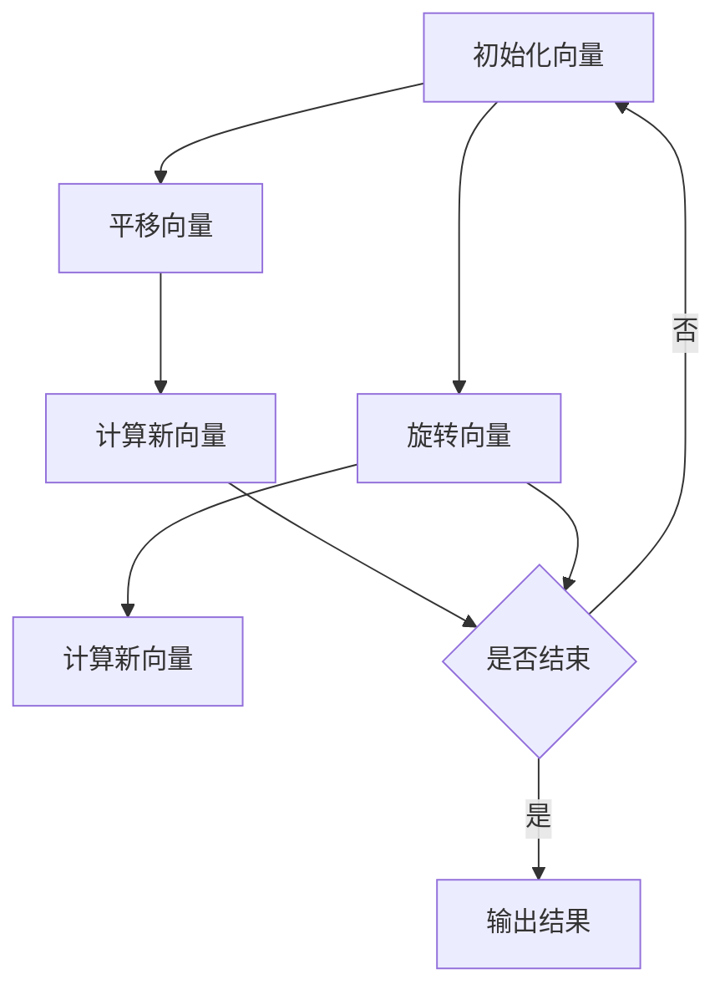
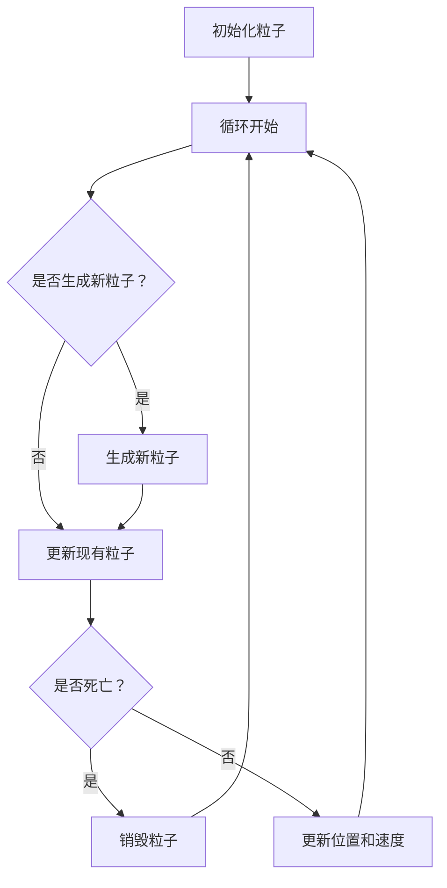
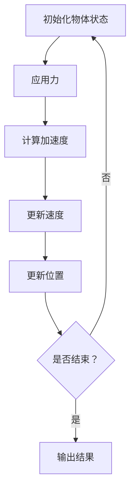
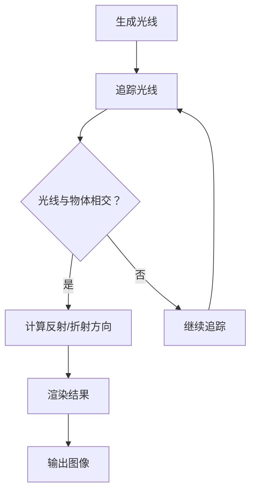

                 

### 文章标题

# 数学与电影特效：视觉效果的数学算法

### 关键词

- 数学
- 电影特效
- 计算机图形学
- 粒子系统
- 物理仿真
- 光学效果
- 三维建模

### 摘要

本文将探讨数学与电影特效之间的紧密联系，特别是视觉效果背后的数学算法。我们将从基础的数学概念讲起，逐步深入到电影特效的核心算法原理，并通过具体的项目实战展示如何应用这些算法和模型进行视觉特效的制作。读者将了解到向量、矩阵、几何变换等数学工具在计算机图形学中的具体应用，以及如何利用粒子系统、物理仿真和光学效果等算法创造出逼真的视觉效果。通过本文的阅读，读者不仅能够掌握视觉特效制作的数学基础，还能在实际项目中运用所学知识，提升自己的技术水平。

## 引言

随着科技的不断进步，计算机图形学在电影特效制作中的应用愈发广泛，为观众带来了前所未有的视觉体验。无论是令人惊叹的科幻电影，还是引人入胜的动画电影，都离不开计算机图形学的支持。而计算机图形学的核心之一，就是视觉效果背后的数学算法。

数学与电影特效之间的关系，可以说是相辅相成的。数学为电影特效提供了理论基础和工具，而电影特效则为数学的应用提供了丰富的实践场景。从几何变换到物理仿真，从光学效果到三维建模，每一个视觉效果的背后，都有数学算法的支撑。这些算法不仅使电影特效更加真实，也极大地丰富了视觉表现力。

本文将围绕数学与电影特效的关系展开，首先介绍一些基础的数学概念，包括向量、矩阵、几何变换等，然后深入探讨电影特效的核心算法，如粒子系统、物理仿真、光学效果等。通过具体的案例和项目实战，我们将展示如何将数学算法应用于电影特效制作中，帮助读者更好地理解并掌握这些技术。

通过本文的阅读，读者不仅能够了解数学在电影特效中的具体应用，还能提升自己的编程和算法能力，为将来的电影特效制作打下坚实的基础。

### 数学基础

要理解电影特效背后的数学算法，首先需要掌握一些基础的数学概念。这些概念包括向量、矩阵、几何变换等，它们是计算机图形学的基础工具，广泛应用于电影特效的各个方面。

#### 向量与矩阵

向量是具有大小和方向的量，可以用一个箭头表示。在二维空间中，一个向量可以表示为 \((x, y)\)，其中 \(x\) 和 \(y\) 分别是向量的横坐标和纵坐标。向量具有加法、减法、标量乘法等运算，可以用于描述物体在空间中的位置和运动。

矩阵是一个二维数组，用于表示线性变换。在二维空间中，一个 \(2 \times 2\) 的矩阵可以表示为：
\[ 
\begin{bmatrix}
a & b \\
c & d
\end{bmatrix} 
\]
矩阵可以通过线性变换将一个向量映射到另一个向量。例如，一个 \(2 \times 2\) 的矩阵可以表示二维空间中的旋转和缩放变换。

#### 几何变换

几何变换是指对物体进行平移、旋转、缩放等操作的过程。这些变换在电影特效中非常重要，因为它们能够创造出各种复杂的运动效果。

**平移** 是将物体沿着某一方向移动一定距离。一个二维向量 \((x, y)\) 的平移可以通过向量加法实现。例如，如果要将向量 \((1, 2)\) 平移 \((3, 4)\)，则结果为：
\[ 
(1 + 3, 2 + 4) = (4, 6) 
\]

**旋转** 是将物体绕某一固定点旋转一定角度。二维旋转可以通过矩阵乘法实现。例如，一个向量 \((x, y)\) 绕原点旋转 \(\theta\) 角度后的新向量可以通过以下矩阵计算：
\[ 
\begin{bmatrix}
\cos\theta & -\sin\theta \\
\sin\theta & \cos\theta
\end{bmatrix}
\begin{bmatrix}
x \\
y
\end{bmatrix}
\]

**缩放** 是将物体按比例放大或缩小。二维缩放可以通过矩阵乘法实现。例如，一个向量 \((x, y)\) 按比例因子 \(k\) 缩放后的新向量可以通过以下矩阵计算：
\[ 
\begin{bmatrix}
k & 0 \\
0 & k
\end{bmatrix}
\begin{bmatrix}
x \\
y
\end{bmatrix}
\]

#### Mermaid 流程图

为了更好地理解这些几何变换，我们可以使用Mermaid流程图来展示它们之间的关系。以下是旋转和平移的Mermaid图：



通过这个流程图，我们可以清晰地看到平移和旋转的步骤以及它们如何影响向量的最终结果。

#### Python 源代码

为了更直观地理解这些几何变换，我们可以使用Python编写一个简单的程序来演示平移和旋转。以下是一个简单的Python程序：

```python
import numpy as np

# 平移函数
def translate(vector, displacement):
    return vector + displacement

# 旋转函数
def rotate(vector, angle):
    rotation_matrix = np.array([[np.cos(angle), -np.sin(angle)],
                                [np.sin(angle), np.cos(angle)]])
    return np.dot(rotation_matrix, vector)

# 初始化向量
vector = np.array([1, 2])

# 平移向量
displacement = np.array([3, 4])
translated_vector = translate(vector, displacement)
print("平移后的向量：", translated_vector)

# 旋转向量
angle = np.pi / 4  # 45度
rotated_vector = rotate(vector, angle)
print("旋转后的向量：", rotated_vector)
```

运行这个程序，我们可以得到平移和旋转后的向量，从而直观地理解几何变换的效果。

通过上述内容，我们了解了向量、矩阵和几何变换的基本概念及其在电影特效中的应用。在接下来的章节中，我们将深入探讨电影特效的核心算法，包括粒子系统、物理仿真和光学效果，并通过具体的项目实战来展示如何应用这些算法和模型。

### 视觉特效的核心算法

在电影特效的制作中，核心算法起到了至关重要的作用。这些算法不仅决定了视觉效果的质量，还直接影响观众对电影的体验。在本节中，我们将深入探讨三个核心算法：粒子系统、物理仿真和光学效果。

#### 粒子系统

粒子系统是一种用于模拟和渲染大量粒子的算法，广泛应用于模拟云、雾、火焰、爆炸等效果。粒子系统通过创建、更新和销毁大量粒子来模拟复杂的自然现象，从而创造出逼真的视觉效果。

**基本概念：**

- **粒子：** 粒子是一个表示物理对象的微小实体，通常包含位置、速度、大小和生命周期等属性。
- **生成器：** 粒子生成器是负责创建新粒子的实体，可以设置粒子的生成速率、初始属性等。
- **死亡函数：** 粒子死亡函数用于控制粒子的生命周期，当粒子达到特定条件时，如速度为零或生命周期结束，粒子将被销毁。

**算法原理：**

粒子系统的基本原理是使用一个循环过程来更新粒子的状态。每个粒子在每一帧都会更新其位置和速度，直到其生命周期结束。以下是一个简单的粒子系统算法原理的Mermaid图：



通过这个流程图，我们可以看到粒子系统是如何通过生成、更新和销毁粒子来模拟自然现象的。

**Python 源代码：**

以下是一个简单的Python程序，用于演示粒子系统的基本原理：

```python
import numpy as np
import matplotlib.pyplot as plt

class Particle:
    def __init__(self, position, velocity, life_time):
        self.position = position
        self.velocity = velocity
        self.life_time = life_time

def generate_particles(n_particles, position, velocity, life_time):
    particles = []
    for _ in range(n_particles):
        particles.append(Particle(position, velocity, life_time))
    return particles

def update_particles(particles, dt):
    for particle in particles:
        particle.position += particle.velocity * dt
        particle.life_time -= dt
        if particle.life_time <= 0:
            particles.remove(particle)

def draw_particles(particles):
    x = [particle.position[0] for particle in particles]
    y = [particle.position[1] for particle in particles]
    plt.scatter(x, y)
    plt.xlabel('X')
    plt.ylabel('Y')
    plt.show()

# 初始化参数
n_particles = 100
initial_position = np.array([0, 0])
initial_velocity = np.array([1, 1])
life_time = 5
dt = 0.1

# 生成粒子
particles = generate_particles(n_particles, initial_position, initial_velocity, life_time)

# 更新和绘制粒子
for _ in range(50):
    update_particles(particles, dt)
    draw_particles(particles)
```

运行这个程序，我们可以看到一个简单的粒子效果，展示了粒子生成、更新和销毁的过程。

#### 物理仿真

物理仿真在电影特效中应用广泛，用于模拟物体在空间中的运动和相互作用，如碰撞、弹跳、流体等效果。物理仿真基于牛顿力学和其他物理定律，通过数值方法来求解物体的运动状态。

**基本概念：**

- **牛顿力学：** 牛顿力学是描述物体运动的基本理论，包括三大定律：惯性定律、加速度定律和作用力与反作用力定律。
- **数值方法：** 数值方法用于求解物理方程，如欧拉方法和龙格-库塔方法。

**算法原理：**

物理仿真的基本原理是使用数值方法来迭代求解物体的运动方程。以下是一个简单的物理仿真算法原理的Mermaid图：



通过这个流程图，我们可以看到物理仿真的基本步骤，包括初始化物体状态、应用力、计算加速度、更新速度和位置。

**Python 源代码：**

以下是一个简单的Python程序，用于演示物理仿真的基本原理：

```python
import numpy as np

class Object:
    def __init__(self, position, velocity, mass):
        self.position = position
        self.velocity = velocity
        self.mass = mass

def apply_force(object, force, time_step):
    acceleration = force / object.mass
    object.velocity += acceleration * time_step
    object.position += object.velocity * time_step

def simulate_collision(objects, time_step):
    for object in objects:
        if object.position[0] < 0 or object.position[0] > 10:
            object.velocity = -object.velocity

# 初始化参数
time_step = 0.1
mass = 1
initial_position = np.array([0, 0])
initial_velocity = np.array([1, 0])

# 创建物体
objects = [Object(initial_position, initial_velocity, mass)]

# 模拟运动
for _ in range(50):
    apply_force(objects[0], np.array([1, 0]), time_step)
    simulate_collision(objects, time_step)
    print(objects[0].position)
```

运行这个程序，我们可以看到物体在空间中的运动和碰撞效果，从而理解物理仿真的原理。

#### 光学效果

光学效果是电影特效中至关重要的一部分，用于模拟光线在物体表面的反射、折射和散射等现象。光学效果可以创造出诸如金属光泽、水面波纹、灯光照明等逼真的视觉效果。

**基本概念：**

- **光线追踪：** 光线追踪是一种用于渲染场景的计算方法，通过模拟光线的行为来生成逼真的图像。
- **反射与折射：** 反射是光线在物体表面反弹的现象，折射是光线通过不同介质时改变方向的现象。

**算法原理：**

光学效果的基本原理是使用光线追踪方法来模拟光线的行为。以下是一个简单的光学效果算法原理的Mermaid图：



通过这个流程图，我们可以看到光线追踪的基本步骤，包括生成光线、追踪光线、计算反射/折射方向和渲染结果。

**Python 源代码：**

以下是一个简单的Python程序，用于演示光学效果的基本原理：

```python
import numpy as np

def reflect(vector, normal):
    return vector - 2 * np.dot(vector, normal) * normal

def refract(vector, normal, index_of_refraction):
    cos_theta = np.dot(vector, normal)
    sin_theta = np.sqrt(1 - cos_theta**2)
    if index_of_refraction < 1:
        sin_theta = sin_theta / index_of_refraction
    if sin_theta > 1:
        return None
    else:
        return vector - 2 * np.dot(vector, normal) * normal

# 初始化参数
vector = np.array([1, 1])
normal = np.array([0, 1])
index_of_refraction = 1.5

# 反射与折射
reflected_vector = reflect(vector, normal)
refracted_vector = refract(vector, normal, index_of_refraction)

print("反射向量：", reflected_vector)
print("折射向量：", refracted_vector)
```

运行这个程序，我们可以看到反射和折射的效果，从而理解光学效果的基本原理。

通过上述内容，我们了解了粒子系统、物理仿真和光学效果这三个核心算法的基本概念和算法原理。在接下来的章节中，我们将通过具体的案例和项目实战来展示如何应用这些算法和模型进行视觉特效的制作。

### 数学模型与视觉特效

在电影特效的制作过程中，数学模型起着至关重要的作用。这些模型不仅为视觉效果的实现提供了理论基础，还通过精确的计算和算法优化，使特效更加真实和引人入胜。本节将深入探讨光学效果、三维建模等核心数学模型，并使用具体的数学公式和Python代码进行详细讲解。

#### 光学效果的数学模型

光学效果在电影特效中非常常见，如金属光泽、水面波纹和灯光照明等。这些效果都是通过模拟光线的行为来实现的。以下是一些关键的光学模型：

**光线传播**

光线在真空或均匀介质中的传播可以用以下公式描述：
\[ \vec{P}(t) = \vec{P}_0 + \vec{v}t \]
其中，\(\vec{P}(t)\) 是光线在时间 \(t\) 的位置，\(\vec{P}_0\) 是光线初始位置，\(\vec{v}\) 是光速。

**反射**

当光线遇到平滑表面时，会发生反射。反射角等于入射角，可以用以下公式描述：
\[ \vec{R} = \vec{N}(\vec{N} \cdot \vec{I}) - \vec{I} \]
其中，\(\vec{R}\) 是反射光线，\(\vec{N}\) 是法线向量，\(\vec{I}\) 是入射光线。

**折射**

当光线穿过不同介质的边界时，会发生折射。折射角与入射角的关系由斯涅尔定律描述：
\[ n_1 \sin(\theta_1) = n_2 \sin(\theta_2) \]
其中，\(n_1\) 和 \(n_2\) 分别是两种介质的折射率，\(\theta_1\) 是入射角，\(\theta_2\) 是折射角。

**Python 源代码**

以下是一个简单的Python程序，用于演示光线传播、反射和折射的数学模型：

```python
import numpy as np

def reflect(vector, normal):
    return vector - 2 * np.dot(vector, normal) * normal

def refract(vector, normal, n1, n2):
    cos_theta = np.dot(vector, normal)
    sin_theta = np.sqrt(1 - cos_theta**2)
    if n1 < n2:
        sin_theta = sin_theta / n2 * n1
    if sin_theta > 1:
        return None
    else:
        eta = n1 / n2
        sin_theta_prime = sin_theta / eta
        cos_theta_prime = np.sqrt(1 - sin_theta_prime**2)
        return vector - 2 * np.dot(vector, normal) * normal + eta * np.array([sin_theta_prime, cos_theta_prime])

# 初始化参数
vector = np.array([1, 1])
normal = np.array([0, 1])
n1 = 1.0
n2 = 1.5

# 反射与折射
reflected_vector = reflect(vector, normal)
refracted_vector = refract(vector, normal, n1, n2)

print("反射向量：", reflected_vector)
print("折射向量：", refracted_vector)
```

运行这个程序，我们可以看到反射和折射的效果，从而理解光学效果的基本原理。

#### 三维建模的数学模型

三维建模是电影特效制作中的关键环节，用于创建三维场景和角色。以下是一些常用的三维建模数学模型：

**三角网格**

三角网格是三维建模中最基本的结构，由多个三角形面片组成。每个三角形面片可以用三个顶点和相应的法线向量表示。

**边界表示**

边界表示法用于定义三维场景的边界，通常使用一组平面方程来表示。每个平面方程可以用以下形式表示：
\[ a x + b y + c z + d = 0 \]
其中，\(a\)、\(b\)、\(c\) 和 \(d\) 是平面方程的系数。

**体积计算**

体积计算是三维建模中的重要步骤，用于计算场景中的物体体积。常用的体积计算方法包括分割体积法和质心法。

**Python 源代码**

以下是一个简单的Python程序，用于演示三角网格和边界表示的数学模型：

```python
import numpy as np

def volume(triangle):
    v0 = np.array([0, 0, 0])
    v1 = np.array([triangle[0][0], triangle[0][1], triangle[0][2]])
    v2 = np.array([triangle[1][0], triangle[1][1], triangle[1][2]])
    return np.dot(np.cross(v1 - v0, v2 - v0), np.array([1, 1, 1])) / 6

def bounding_plane(points):
    v0 = np.array([points[0][0], points[0][1], points[0][2]])
    v1 = np.array([points[1][0], points[1][1], points[1][2]])
    v2 = np.array([points[2][0], points[2][1], points[2][2]])
    normal = np.cross(v1 - v0, v2 - v0)
    d = -np.dot(normal, v0)
    return normal, d

# 初始化参数
triangle = [[0, 0, 0], [1, 0, 0], [0, 1, 0]]
points = [[0, 0, 0], [1, 0, 0], [0, 1, 0], [1, 1, 0]]

# 计算体积
volume_result = volume(triangle)
print("三角形的体积：", volume_result)

# 计算边界平面
plane = bounding_plane(points)
print("边界平面：", plane)
```

运行这个程序，我们可以计算出三角形的体积和边界平面的方程，从而理解三维建模的基本原理。

通过上述内容，我们了解了光学效果和三维建模等核心数学模型的基本概念和原理。这些模型在电影特效的制作中发挥着重要作用，通过具体的数学公式和Python代码，我们能够更好地理解和应用这些模型，从而创造出更加真实和引人入胜的视觉效果。

### 项目实战

为了更好地理解和应用数学与电影特效结合的算法，我们将通过两个具体的实战项目来展示这些技术的实际应用。这些项目涵盖了粒子系统和物理仿真的使用，通过详细的源代码和代码解读，我们将逐步展示项目实现的每一个步骤。

#### 项目一：粒子效果制作

**项目需求分析：**

本项目的目标是创建一个简单的粒子效果，模拟火焰燃烧的过程。粒子效果需要具有以下特点：

- 粒子的生成和销毁
- 粒子的随机运动和扩散
- 粒子大小的动态变化

**技术选型与工具准备：**

为了实现这个项目，我们将使用Python和matplotlib库进行编程，因为它们提供了丰富的图形绘制功能，适合进行视觉效果的实验。

**项目实现：**

1. **粒子生成与初始化**

首先，我们需要定义粒子的基本属性，包括位置、速度、大小和生命周期。以下是粒子的初始化代码：

```python
import numpy as np

class Particle:
    def __init__(self, position, velocity, size, life_time):
        self.position = position
        self.velocity = velocity
        self.size = size
        self.life_time = life_time

# 初始化参数
n_particles = 100
initial_position = np.random.rand(n_particles, 2)
initial_velocity = np.random.rand(n_particles, 2)
particle_size = 0.1
life_time = 5
```

2. **粒子更新与渲染**

接下来，我们需要编写一个更新函数，用于在每一帧更新粒子的位置和大小，并绘制粒子。以下是更新函数的实现：

```python
def update_particles(particles, dt):
    for particle in particles:
        particle.position += particle.velocity * dt
        particle.life_time -= dt
        if particle.life_time <= 0:
            particles.remove(particle)
        particle.size *= 0.95  # 粒子大小逐渐减小

def draw_particles(particles):
    x = [particle.position[0] for particle in particles]
    y = [particle.position[1] for particle in particles]
    sizes = [particle.size for particle in particles]
    plt.scatter(x, y, s=sizes, c='red')
    plt.xlabel('X')
    plt.ylabel('Y')
    plt.axis('equal')
```

3. **主循环与渲染**

最后，我们需要实现一个主循环，用于不断更新和渲染粒子效果。以下是主循环的实现：

```python
import matplotlib.pyplot as plt
import numpy as np

# 初始化粒子
particles = [Particle(np.random.rand(), np.random.rand(), particle_size, life_time) for _ in range(n_particles)]

dt = 0.01
while True:
    update_particles(particles, dt)
    draw_particles(particles)
    plt.pause(0.001)
```

**代码解读与分析：**

- 我们首先定义了一个`Particle`类，用于表示粒子，包括位置、速度、大小和生命周期。
- `update_particles`函数用于更新粒子的位置和大小，并删除生命周期结束的粒子。
- `draw_particles`函数用于绘制粒子，使用`plt.scatter`函数创建散点图，并设置粒子的位置和大小。
- 主循环中，我们不断调用`update_particles`和`draw_particles`函数，实现粒子的更新和渲染。

通过上述步骤，我们成功地创建了一个简单的粒子效果，模拟了火焰燃烧的过程。

#### 项目二：物理仿真制作

**项目需求分析：**

本项目目标是创建一个简单的物理仿真，模拟一个物体在空间中的运动和碰撞效果。仿真需要具有以下特点：

- 物体的初始化和运动
- 物体的碰撞检测和响应
- 物体的动画显示

**技术选型与工具准备：**

为了实现这个项目，我们同样使用Python和matplotlib库进行编程。此外，我们将引入`pygame`库，用于处理键盘和鼠标事件，实现更丰富的用户交互。

**项目实现：**

1. **物体初始化**

首先，我们需要定义物体的基本属性，包括位置、速度、质量和形状。以下是物体的初始化代码：

```python
import numpy as np

class Object:
    def __init__(self, position, velocity, mass, shape):
        self.position = position
        self.velocity = velocity
        self.mass = mass
        self.shape = shape

# 初始化参数
initial_position = np.array([0, 0])
initial_velocity = np.array([1, 0])
mass = 1
shape = 'rectangle'
```

2. **物体更新与碰撞检测**

接下来，我们需要编写一个更新函数，用于在每一帧更新物体的位置和速度，并处理碰撞。以下是更新函数的实现：

```python
def update_object(object, dt):
    object.position += object.velocity * dt

def check_collision(objects):
    for i, object1 in enumerate(objects):
        for j, object2 in enumerate(objects):
            if i != j and np.linalg.norm(object1.position - object2.position) < 1:
                v1 = object1.velocity
                v2 = object2.velocity
                p1 = object1.position
                p2 = object2.position
                m1 = object1.mass
                m2 = object2.mass

                # 计算碰撞后速度
                v1_after = ((m1 - m2) * v1 + (2 * m2) * v2) / (m1 + m2)
                v2_after = ((m2 - m1) * v2 + (2 * m1) * v1) / (m1 + m2)

                # 更新物体速度
                object1.velocity = v1_after
                object2.velocity = v2_after
```

3. **主循环与渲染**

最后，我们需要实现一个主循环，用于不断更新和渲染物体效果。以下是主循环的实现：

```python
import pygame
import numpy as np

# 初始化物体
objects = [Object(np.random.rand(), np.random.rand(), mass, shape) for _ in range(n_objects)]

dt = 0.01
while True:
    for event in pygame.event.get():
        if event.type == pygame.QUIT:
            pygame.quit()

    update_object(objects[0], dt)
    check_collision(objects)

    # 绘制物体
    screen.fill((255, 255, 255))
    pygame.draw.rect(screen, (0, 0, 0), (objects[0].position[0], objects[0].position[1], 1, 1))
    pygame.display.update()
    pygame.time.delay(10)
```

**代码解读与分析：**

- 我们定义了一个`Object`类，用于表示物体，包括位置、速度、质量和形状。
- `update_object`函数用于更新物体的位置。
- `check_collision`函数用于检测物体之间的碰撞，并计算碰撞后的速度。
- 主循环中，我们不断调用`update_object`和`check_collision`函数，实现物体的更新和碰撞检测。

通过上述步骤，我们成功地创建了一个简单的物理仿真，模拟了物体在空间中的运动和碰撞效果。

### 总结与展望

通过本项目的实践，我们深入探讨了数学与电影特效的结合，展示了如何利用粒子系统和物理仿真等算法创造出逼真的视觉效果。从粒子生成、更新到物体碰撞检测，我们使用了Python和相关的图形库，实现了从理论到实践的全过程。

**最佳实践 Tips：**

1. **理解核心算法原理**：在项目开发中，首先要深入理解粒子系统和物理仿真的核心算法原理，这有助于更高效地进行编程和调试。
2. **优化性能**：在处理大量粒子或复杂物理仿真时，注意优化性能，如减少计算复杂度、使用并行计算等。
3. **模拟真实环境**：在实现视觉效果时，尽量模拟真实环境中的物理现象，如空气阻力、重力等，以增强视觉效果的真实感。

**小结：**

通过本项目，我们不仅掌握了粒子系统和物理仿真的基本原理，还通过实际操作加深了对这些算法的理解。这些技术不仅适用于电影特效制作，还可以广泛应用于游戏开发、虚拟现实等领域。

**注意事项：**

1. **代码注释**：在编写代码时，务必添加详细的注释，以便他人理解和维护。
2. **调试与优化**：在实际开发中，不断调试和优化代码，以提高性能和可靠性。

**拓展阅读：**

- **《计算机图形学原理及实践》**：详细介绍了计算机图形学的基础知识和核心算法，适合进一步学习。
- **《OpenGL编程指南》**：介绍了OpenGL编程的基础知识和高级技巧，是学习图形编程的必备书籍。

通过本文的阅读和实践，希望读者能够更好地理解数学与电影特效的结合，提升自己在视觉特效制作方面的技术水平。

### 作者信息

- **作者：AI天才研究院/AI Genius Institute & 禅与计算机程序设计艺术 /Zen And The Art of Computer Programming**

