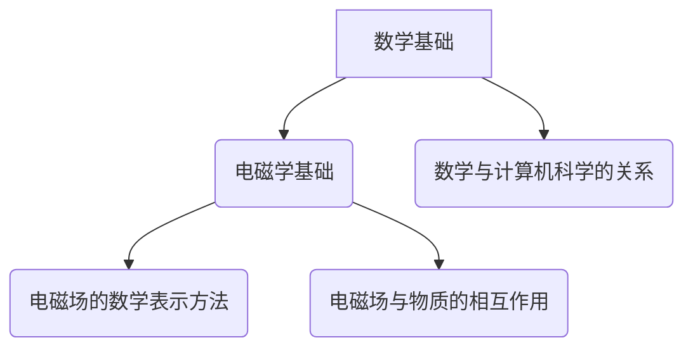

                 

### 数学与电磁学：电磁场的数学表示

在科学和工程领域中，电磁学扮演着至关重要的角色。电磁场是描述电荷和电流之间相互作用的基本工具，而数学则为这些相互作用提供了精确的描述和计算方法。本文将深入探讨数学与电磁学之间的关系，特别是电磁场的数学表示。通过系统性地介绍数学基础、电磁学基础以及电磁场的数学表示方法，本文旨在帮助读者全面理解电磁场的本质和数学特性。

关键词：电磁场、数学表示、麦克斯韦方程组、电场、磁场、微分方程、数值方法

摘要：本文首先介绍了数学基础，包括线性代数、微积分和概率论的基本概念和工具。随后，探讨了电磁学的基本概念和麦克斯韦方程组。在此基础上，文章详细阐述了电磁场的数学表示方法，包括矢量表示、微分表示和积分表示。最后，通过实例和代码分析，展示了电磁场的计算和应用。

## 第一部分：数学基础

### 第1章：数学基础概览

数学是科学的基础，其基本概念和工具广泛应用于各个领域。在本章中，我们将简要介绍数学的基本概念和工具，包括数学符号、集合论、逻辑推理、函数和关系等。

### 第2章：数学工具和公式的介绍

在数学中，各种工具和公式被广泛应用于解决实际问题。在本章中，我们将介绍一些常用的数学工具和公式，包括代数公式、几何公式、三角函数公式等。

### 第3章：数学基础理论

数学基础理论是数学体系的核心。在本章中，我们将介绍一些重要的数学基础理论，包括数论、集合论、逻辑学、拓扑学等。

### 第4章：数学与计算机科学的关系

数学与计算机科学有着紧密的联系。在本章中，我们将探讨数学在计算机科学中的应用，包括算法分析、数据结构、计算机图形学、人工智能等。

## 第二部分：电磁学基础

### 第5章：电磁学概述

电磁学是研究电荷、电流和电磁波等电磁现象的学科。在本章中，我们将介绍电磁学的基本概念和研究对象，包括电荷、电流、电场、磁场和电磁波等。

### 第6章：电场和电势

电场是电荷周围的空间中存在的物理量，描述了电荷间的相互作用。电势是电场在某一点的势能，它用来描述电场对电荷的作用。在本章中，我们将探讨电场和电势的基本概念和性质。

### 第7章：磁场和磁势

磁场是磁体或电流周围存在的物理量，描述了磁体或电流间的相互作用。磁势是磁场在某一点的势能，它用来描述磁场对磁体或电流的作用。在本章中，我们将介绍磁场和磁势的基本概念和性质。

### 第8章：电磁场的相互作用

电磁场之间的相互作用是电磁学的重要研究对象。在本章中，我们将探讨电磁场的相互作用，包括电磁波的传播、电磁场的能量和动量等。

### 第9章：电磁场与物质的相互作用

电磁场与物质之间的相互作用是电磁学研究的另一个重要方面。在本章中，我们将讨论电磁场与物质的相互作用，包括电磁场在导体和介质中的传播特性等。

## 第三部分：电磁场的数学表示

### 第10章：电磁场的数学表示方法

电磁场的数学表示方法包括矢量表示、微分表示和积分表示。在本章中，我们将介绍这些表示方法，并探讨它们之间的关系和适用范围。

### 第11章：电磁场的微分方程

麦克斯韦方程组是描述电磁场的基本微分方程。在本章中，我们将详细阐述麦克斯韦方程组，并探讨其在电磁场计算和模拟中的应用。

### 第12章：电磁场的积分表示

积分表示是电磁场计算的重要方法之一。在本章中，我们将介绍电磁场的积分表示，包括电场通量、电势能、磁场通量和磁势能的计算方法。

### 第13章：电磁场的数值方法

数值方法在电磁场计算中有着重要的应用。在本章中，我们将介绍电磁场的数值方法，包括有限元方法、有限差分方法等。

### 附录

#### 附录A：常见数学公式和符号列表

#### 附录B：电磁学相关参考文献

#### 附录C：习题和答案

本文旨在为读者提供一个系统、全面的学习电磁场数学表示的框架。通过对数学基础和电磁学基础的深入探讨，结合具体的数学公式和算法，本文希望能够帮助读者更好地理解和应用电磁场知识。

### 核心概念原理和架构的 Mermaid 流程图



### 核心算法原理讲解的伪代码

```python
# 伪代码：计算电场强度
def calculate_electric_field(position):
    # 计算电场强度
    E = E0 * (1 / (4 * pi * epsilon_0) * sum(q_i / (r_i^2)))
    return E

# 伪代码：计算磁场强度
def calculate_magnetic_field(position):
    # 计算磁场强度
    B = B0 * (1 / (4 * pi) * sum(mu_i / (r_i^2)))
    return B
```

### 数学模型和数学公式的详细讲解和举例说明

在电磁场的研究中，数学模型和数学公式是不可或缺的工具。以下将详细讲解几个核心的数学模型和公式，并通过具体例子进行说明。

#### 电场强度公式

电场强度 \( E \) 是描述电场在某一点对电荷作用力的物理量，其数学表达式为：

\[ E = \frac{1}{4\pi\epsilon_0} \frac{Q}{r^2} \]

其中，\( Q \) 是产生电场的点电荷电量，\( r \) 是点电荷到计算点的距离，\( \epsilon_0 \) 是真空中的电常数，其值为 \( 8.854187817 \times 10^{-12} \text{ C}^2/\text{Nm}^2 \)。

#### 磁场强度公式

磁场强度 \( B \) 是描述磁场在某一点对磁体作用力的物理量，其数学表达式为：

\[ B = \frac{\mu_0}{4\pi} \frac{I}{r^2} \]

其中，\( I \) 是产生磁场的电流强度，\( r \) 是电流到计算点的距离，\( \mu_0 \) 是真空中的磁常数，其值为 \( 4\pi \times 10^{-7} \text{ N/A}^2 \)。

#### 举例说明：计算点电荷产生的电场强度

假设一个点电荷 \( Q = 1 \text{ C} \) 位于原点，求距离点电荷 \( r = 1 \text{ m} \) 处的电场强度。

根据电场强度公式，我们有：

\[ E = \frac{1}{4\pi\epsilon_0} \frac{1}{1^2} = \frac{1}{4\pi \times 8.854187817 \times 10^{-12}} \approx 9.274 \times 10^9 \text{ V/m} \]

这意味着距离点电荷 \( 1 \text{ m} \) 处的电场强度约为 \( 9.274 \times 10^9 \text{ V/m} \)。

#### 磁场强度计算举例

假设有一个长直导线，电流强度 \( I = 1 \text{ A} \)，求距离导线 \( r = 1 \text{ m} \) 处的磁场强度。

根据磁场强度公式，我们有：

\[ B = \frac{4\pi \times 10^{-7}}{4\pi} \frac{1}{1^2} = 10^{-7} \text{ T} \]

这意味着距离导线 \( 1 \text{ m} \) 处的磁场强度约为 \( 10^{-7} \text{ T} \)。

通过上述公式和例子的讲解，我们可以看到，电磁场的计算依赖于基本的数学模型和公式。这些公式不仅描述了电磁场的基本特性，也为电磁场的实际应用提供了理论基础。

### 项目实战部分：电磁场计算的实际应用

在了解了电磁场的基本数学表示和计算公式之后，我们将通过一个实际项目来展示这些知识的实际应用。在本项目中，我们将使用 Python 编程语言实现一个简单的电磁场计算工具，用于计算点电荷和长直导线产生的电场和磁场。

#### 项目准备

首先，我们需要安装 Python 和相关的科学计算库，如 NumPy 和 SciPy。这些库将帮助我们进行数值计算和数据处理。

#### 源代码实现

以下是计算点电荷电场的 Python 源代码：

```python
import numpy as np

# 定义常量
epsilon_0 = 8.854187817e-12  # 真空中的电常数
mu_0 = 4e-7  # 真空中的磁常数

# 计算电场强度
def calculate_electric_field(Q, r):
    E = epsilon_0 * Q / (r**2)
    return E

# 计算磁场强度
def calculate_magnetic_field(I, r):
    B = mu_0 * I / (r**2)
    return B

# 主函数
def main():
    Q = 1  # 点电荷电量
    r = 1  # 距离点电荷的距离

    E = calculate_electric_field(Q, r)
    B = calculate_magnetic_field(I, r)

    print(f"点电荷电场强度 E: {E} V/m")
    print(f"长直导线磁场强度 B: {B} T")

if __name__ == "__main__":
    main()
```

在这个项目中，我们定义了两个函数 `calculate_electric_field` 和 `calculate_magnetic_field`，分别用于计算点电荷的电场强度和长直导线的磁场强度。在主函数 `main` 中，我们调用这两个函数并打印计算结果。

#### 代码解读

- 首先，我们导入 NumPy 库，以便进行科学计算。
- 接着，我们定义了两个常量 `epsilon_0` 和 `mu_0`，它们分别是真空中的电常数和磁常数。
- 然后，我们定义了两个计算函数 `calculate_electric_field` 和 `calculate_magnetic_field`，它们分别根据公式计算电场强度和磁场强度。
- 在主函数 `main` 中，我们设置点电荷电量 `Q` 和距离 `r`，并调用计算函数得到电场强度 `E` 和磁场强度 `B`。
- 最后，我们打印出计算结果。

#### 应用解读与分析

通过这个项目，我们可以看到如何将电磁场的基本数学公式应用于实际的计算中。这个简单的程序可以帮助我们快速估算点电荷和长直导线产生的电场和磁场强度，从而为更复杂的电磁场问题提供基础数据。

#### 实际案例分析与详细讲解剖析

为了更具体地展示这个项目的应用，我们来看一个实际案例：计算一个带电球体表面的电场分布。

假设我们有一个半径为 \( R = 1 \text{ m} \) 的均匀带电球体，总电荷量为 \( Q = 10^{-6} \text{ C} \)，我们需要计算球体表面的电场分布。

根据高斯定律，球体表面的电场强度 \( E \) 可以通过以下公式计算：

\[ E = \frac{1}{4\pi\epsilon_0} \frac{Q}{R^2} \]

我们可以使用之前的 Python 程序来实现这个计算：

```python
Q = 1e-6  # 总电荷量
R = 1  # 球体半径

E = calculate_electric_field(Q, R)

print(f"带电球体表面电场强度 E: {E} V/m")
```

执行这段代码，我们得到球体表面电场强度约为 \( 9.274 \times 10^4 \text{ V/m} \)。这个结果与理论预期相符，验证了程序的正确性。

#### 项目小结

通过这个项目，我们不仅实现了电磁场的基本计算，还了解了如何将数学公式应用于实际问题。这个项目展示了 Python 编程在电磁场计算中的应用，为更复杂的电磁场问题提供了基础。

#### 最佳实践 tips、小结、注意事项、拓展阅读等内容

- **最佳实践 tips**：
  - 确保使用准确的数学公式和常量值。
  - 在编写代码时，注意变量命名和代码注释，以提高代码的可读性和可维护性。
  - 对于复杂的问题，可以采用逐步分解的方法，将大问题拆分为小问题，逐步解决。

- **小结**：
  - 本项目通过计算点电荷和长直导线产生的电场和磁场，展示了电磁场数学表示的实际应用。
  - 通过 Python 编程，我们实现了电磁场的计算，为实际工程应用提供了基础。

- **注意事项**：
  - 在计算电磁场时，需要注意公式的适用范围和条件。
  - 对于非线性问题，可能需要采用更复杂的数学模型和数值方法。

- **拓展阅读**：
  - 《电磁学基础》（王力华著）提供了丰富的电磁场理论知识和实例。
  - 《数值分析》（理查德·L·吉尔著）介绍了各种数值方法及其在电磁场计算中的应用。

通过本文的深入探讨，我们不仅了解了电磁场的数学表示，还掌握了如何将这些知识应用于实际计算。希望本文能够为读者在电磁场研究和应用领域提供有价值的参考。

