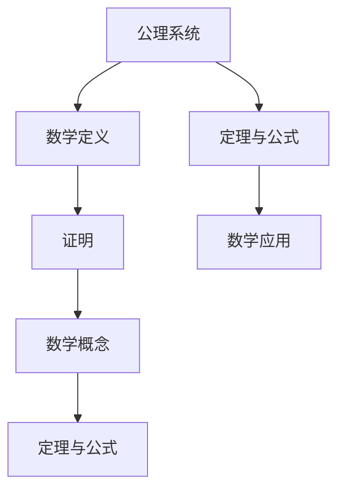
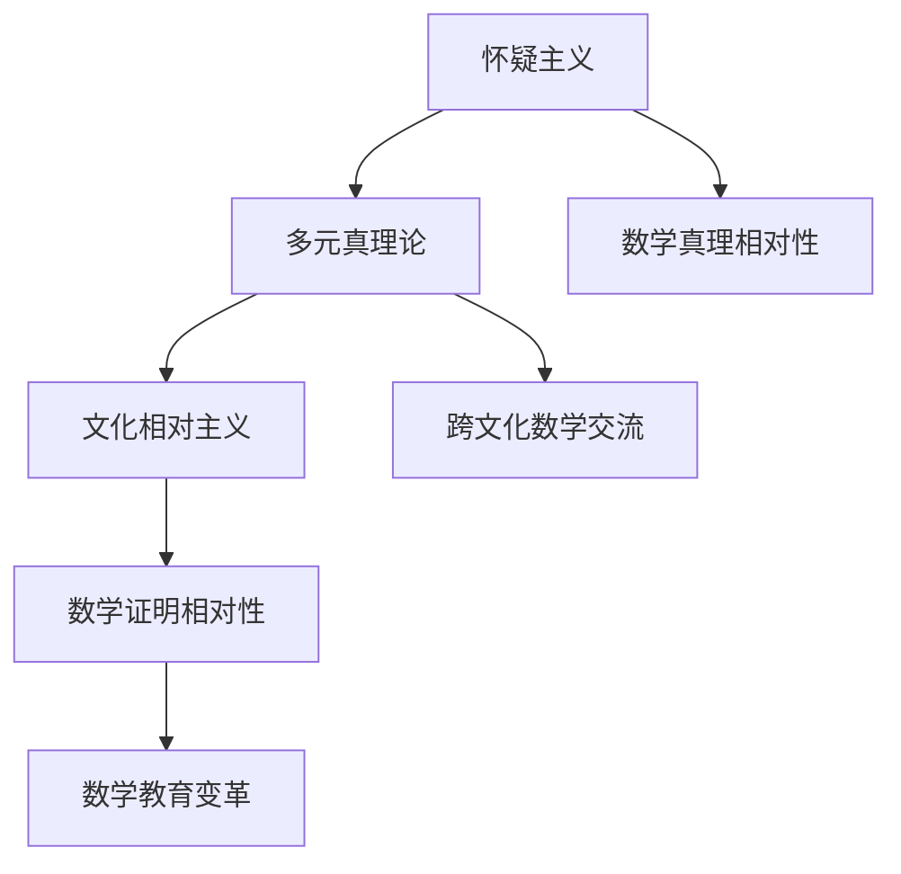
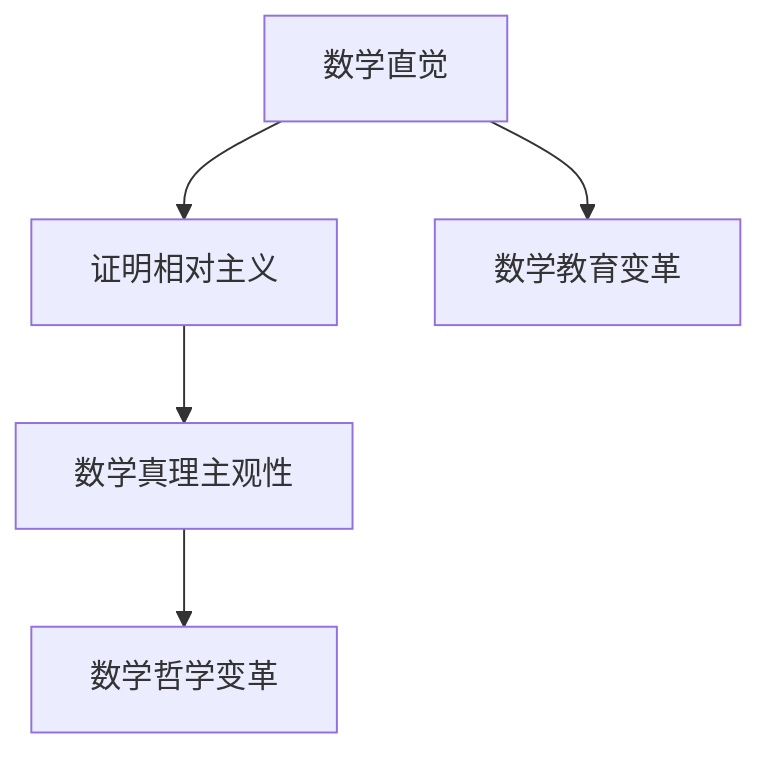

                 

### 引言

“数学与相对主义：数学真理的主观性”这一主题的探讨，源自数学与哲学两个看似独立但实则紧密联系的领域。数学作为一门严谨的学科，长期以来被视为真理的象征，其概念、公式和证明过程无不体现着客观性和普遍性。然而，相对主义哲学的兴起，尤其是当代认知科学的发展，引发了人们对数学真理客观性的质疑。本文旨在深入探讨数学真理的主观性，通过逻辑清晰的推理和分析，揭示数学与相对主义之间的复杂关系。

首先，我们必须明确数学与相对主义的基本概念。数学是一门研究数量、结构、变化和空间等概念的学科，它通过严谨的公理和定义建立起一套独立于经验的逻辑体系。相对主义哲学则强调真理和知识的相对性，认为不同文化、社会和个体对真理的理解各不相同。在这种背景下，数学真理的主观性成为了一个引人入胜的研究课题。

本文将分为四个主要部分。第一部分将回顾数学的基础理论，探讨数学真理与相对主义之间的初步联系。第二部分将深入相对主义哲学，分析相对主义如何影响数学的理解和应用。第三部分将聚焦于数学真理的主观性，探讨数学直觉、证明相对主义及其对数学哲学的影响。第四部分将结合实际案例，展示数学与相对主义在跨学科研究中的应用，并展望数学与相对主义研究的未来方向。

通过这一系列的探讨，我们希望读者能够对数学真理的主观性有更深入的理解，认识到数学不仅仅是客观真理的象征，更是一个充满主观性和多样性的领域。这也将为数学教育和应用提供新的视角和启示。让我们一步一步地深入这一迷人的话题吧。

### 数学基础理论

数学作为一门学科，其基础理论构成了整个数学体系的基石。首先，我们需要理解数学的概念和定义。数学概念是数学中基本而普遍的元素，例如自然数、分数、实数等。这些概念通过公理和定义被形式化，从而建立了一个自洽的逻辑体系。

公理系统是数学基础理论的核心组成部分。公理是一些被认为是显然正确的命题，它们构成了数学理论的出发点。通过逻辑推理，这些公理可以导出一系列定理和公式，从而建立起一个完整的数学理论体系。例如，欧几里得几何的基础是五个公设，这些公设被用来推导出所有欧几里得几何的定理。

数学定义则是为了明确和精确地描述数学概念而引入的规则。一个良好的定义应该简洁、无歧义，并能准确地反映概念的本质。例如，实数的定义是基于自然数、分数和有理数，通过无理数的引入，构建了一个完备的数系。

在数学中，证明是验证数学命题正确性的过程。证明通常通过逻辑推理和数学公式来完成，它确保了数学理论的严谨性。例如，勾股定理可以通过多种方法证明，包括几何证明和代数证明。

这些核心概念之间的关系构成了数学理论的基础架构。公理是数学理论的出发点，定义则明确和精确地描述了这些概念，而证明则是验证这些概念和定理正确性的过程。在这个架构中，每一个概念和定理都是相互关联的，形成了一个自洽的整体。

为了更直观地展示这些概念之间的关系，我们可以使用Mermaid流程图来表示：

在这个流程图中，公理系统（A）是整个架构的起点，通过定义（B）和证明（C），导出了一系列数学概念（D）和定理与公式（E）。这些概念和定理进一步应用于数学的各个领域（G），形成了数学理论体系的基础。

通过这一部分的介绍，我们为后续章节的深入探讨奠定了基础。接下来，我们将探讨相对主义哲学，并分析相对主义对数学的理解和应用产生的影响。

### 相对主义哲学

相对主义哲学是一种关于真理、知识及其相对性的理论，其核心观点是真理和知识的相对性。相对主义认为，真理和知识不是绝对的，而是依赖于特定的文化、社会、个体和历史背景。这种观点在当代哲学界引起了广泛的讨论和争议。

首先，我们回顾一下相对主义哲学的历史背景。相对主义哲学可以追溯到古希腊哲学家普罗泰戈拉斯的观点：“人是一切事物的衡量标准。”普罗泰戈拉斯的相对主义观点强调主观性，认为真理是相对的，依赖于观察者的视角。这种观点在后来的哲学发展中得到了进一步的发展和完善。

相对主义哲学的主要流派包括怀疑主义、多元真理论和文化相对主义。怀疑主义认为，由于人类认知能力的局限性，我们无法获得绝对确定的真理。多元真理论则认为，存在多种真理，每种真理都适用于特定的情境和观察者。文化相对主义则强调，不同文化和社会背景下，人们对真理和知识的理解是不同的。

相对主义对数学的理解和应用产生了深远的影响。在数学领域，相对主义挑战了数学真理的客观性和普遍性。例如，在数学证明中，不同证明方法可能依赖于不同的假设和前提条件，这表明数学真理并非绝对唯一。此外，相对主义也影响了数学教育，使得数学教育者开始更加关注学生的主观体验和思维过程，而不仅仅是纯粹的知识传授。

为了更直观地展示相对主义哲学对数学的影响，我们可以使用Mermaid流程图来表示：

在这个流程图中，相对主义哲学的不同流派（A、B、C）对数学产生了多方面的影响。怀疑主义（A）质疑了数学真理的绝对性，多元真理论（B）和数学证明相对性（D）则揭示了数学证明的多样性，文化相对主义（C）则影响了数学教育和跨文化数学交流（G）。

通过这一部分的介绍，我们为理解相对主义如何影响数学真理的主观性奠定了基础。在接下来的部分，我们将深入探讨数学真理的主观性，分析数学直觉、证明相对主义及其对数学哲学的影响。

### 数学真理的主观性

数学真理的主观性是一个复杂且争议性的话题，它涉及到数学与哲学的多个层面。相对主义哲学对数学真理的客观性提出了挑战，认为数学真理并非绝对，而是依赖于个体、文化和社会背景。在这一部分，我们将深入探讨数学真理主观性的多个方面，包括数学直觉、证明相对主义及其对数学哲学的影响。

首先，数学直觉在数学真理的主观性中扮演着重要角色。数学直觉是指数学家在解决数学问题时，依靠直观感受和思维来判断和推理。数学直觉往往是无意识的，但它却是数学发现和创造的核心。例如，数学家在提出一个新命题时，可能会依靠直觉来判断这个命题的合理性。这种直觉往往受到个人经验、背景知识和文化环境的影响。因此，数学直觉的主观性表明，数学真理并非完全独立于个体。

其次，证明相对主义也是数学真理主观性的一个重要表现。证明是数学中验证命题正确性的过程，但不同的证明方法可能依赖于不同的假设和前提条件。例如，欧氏几何和非欧几何都提供了不同的证明方法，以证明几何学的基本定理。这些不同的证明方法反映了数学真理的相对性。此外，计算机证明的兴起，如四色问题的证明，也展示了证明方法的多样性。这种多样性表明，数学真理并非唯一和绝对的。

证明相对主义对数学哲学产生了深远影响。它挑战了传统数学哲学中关于数学真理客观性的观点，促使数学哲学家重新审视数学的本质。一些哲学家认为，数学真理的主观性意味着数学并不是一门完全客观的学科，而是一个充满主观性和多样性的领域。这种观点为数学教育和研究提供了新的视角，鼓励数学家们更加关注数学的多样性和灵活性。

为了更直观地展示数学直觉和证明相对主义如何影响数学真理的主观性，我们可以使用Mermaid流程图来表示：

在这个流程图中，数学直觉（A）和证明相对主义（B）共同构成了数学真理主观性的基础（C），并进一步影响了数学哲学（D）和数学教育（E）。数学直觉强调了个体经验在数学中的重要性，而证明相对主义则揭示了数学证明的多样性。

总的来说，数学真理的主观性表明，数学并非一个完全客观的领域，而是受到多种主观因素的影响。相对主义哲学为这一观点提供了理论支持，并推动了数学哲学和数学教育的发展。在接下来的部分，我们将探讨数学与相对主义在跨学科研究中的应用，进一步揭示数学真理的主观性。

### 数学与相对主义在跨学科研究中的应用

数学与相对主义不仅对数学本身产生了深远影响，也在跨学科研究中发挥了重要作用。这一部分将探讨数学与相对主义在多个领域的应用，包括认知科学、计算机科学和社会科学，并通过具体案例展示这些应用的实践意义。

首先，认知科学是数学与相对主义的一个重要交汇点。认知科学关注人类思维过程和认知能力，而数学直觉和证明相对主义为理解这些过程提供了新的视角。例如，神经科学家通过脑成像技术发现，数学家在解决数学问题时，大脑中的某些区域会被激活，这表明数学直觉与大脑的生理机制密切相关。此外，证明相对主义指出，不同的个体在解决相同数学问题时，可能会采用不同的方法和策略，这为认知科学家提供了关于人类认知多样性的宝贵数据。

具体案例：一个著名的案例是“诺特定理”在量子物理学中的应用。诺特定理描述了物理系统在时空中的守恒定律，如能量守恒和动量守恒。这个定理在经典物理学中具有绝对性，但在量子物理学中，其形式和证明方法有所不同。这种证明的相对性展示了数学与相对主义在跨学科研究中的重要性，它挑战了我们对物理定律的绝对理解。

其次，计算机科学是另一个数学与相对主义紧密结合的领域。计算机科学中的算法设计和复杂性理论都受到数学真理主观性的影响。例如，在复杂性理论中，P=NP问题探讨了算法效率与问题难度之间的关系。证明相对主义表明，不同算法可能适用于不同类型的问题，这为算法设计提供了新的思路。

具体案例：一个实际的案例是“机器学习中的模型选择”。在机器学习中，选择合适的模型对于提高预测准确率至关重要。不同的模型可能基于不同的假设和前提条件，反映了数学真理的相对性。例如，线性回归模型和非线性回归模型在处理不同类型的数据时可能表现出不同的性能，这表明了数学真理的主观性在计算机科学中的应用。

最后，数学与相对主义在社会科学中的应用也日益显著。社会科学中的统计方法和数据分析都依赖于数学模型，而数学真理的主观性提醒社会科学家注意数据的相对性和多样性。例如，在社会学研究中，不同的统计方法可能会得出不同的结论，这反映了数学真理的相对性。

具体案例：一个著名的案例是“社会科学中的多重回归分析”。在多重回归分析中，不同变量之间的关系可能因数据来源、研究对象和文化背景而异。这种多样性表明，数学真理并非绝对，而是依赖于具体的研究情境。

通过这些具体案例，我们可以看到数学与相对主义在跨学科研究中的广泛应用。数学真理的主观性不仅丰富了我们的理论认识，也为实际问题提供了新的解决方案。在接下来的部分，我们将总结全文，并探讨数学与相对主义研究的未来方向。

### 结论

通过对数学与相对主义：数学真理的主观性这一主题的深入探讨，我们揭示了数学真理并非绝对，而是受到个体、文化和社会背景的多种因素影响。数学直觉、证明相对主义及其在认知科学、计算机科学和社会科学中的应用，展示了数学真理的主观性在跨学科研究中的重要性。这一认识不仅丰富了数学哲学，也为数学教育和应用提供了新的视角。

展望未来，数学与相对主义的研究将继续深入。随着认知科学、计算机科学和社会科学的发展，我们将进一步探索数学真理主观性的多种表现形式。此外，随着大数据和人工智能技术的应用，数学模型的选择和验证将变得更加重要，这为数学与相对主义的研究提供了新的机遇和挑战。

总之，数学真理的主观性是一个复杂且丰富的领域，它不仅挑战了传统数学哲学的观点，也为数学的应用提供了新的启示。未来的研究将继续拓展这一领域的边界，推动数学与相对主义的深入发展。

### 附录

#### 参考文献

1. Tarski, A. (1956). *Logic, Semantics, Metamathematics*. North-Holland.
2. Hofstadter, D. R. (1979). *Gödel, Escher, Bach: An Eternal Golden Braid*. Basic Books.
3. Kuhn, T. S. (1970). *The Structure of Scientific Revolutions*. University of Chicago Press.
4. Lakatos, I. (1976). *Proofs and Refutations: The Logic of Mathematical Discovery*. Cambridge University Press.
5. Hume, D. (1739). *A Treatise of Human Nature*. Clarendon Press.

#### 主要术语表

- **相对主义**：一种哲学观点，认为真理和知识是相对的，依赖于特定的文化、社会和个体背景。
- **数学直觉**：数学家在解决数学问题时依靠直观感受和思维来判断和推理的能力。
- **证明相对主义**：不同证明方法可能依赖于不同的假设和前提条件，从而表明数学真理的相对性。
- **公理系统**：数学理论的基础，由一组被认为是显然正确的命题（公理）构成。

### 最佳实践 tips

1. **批判性思维**：在面对数学问题时，不仅要关注结果，更要思考背后的逻辑和假设。
2. **跨学科交流**：结合不同领域的知识，可以更全面地理解数学真理的主观性。
3. **持续学习**：数学和哲学都是不断发展的领域，保持好奇心和求知欲，不断探索新的理论和观点。

### 注意事项

1. **数学公理的选择**：在数学研究中，选择适当的公理系统至关重要，它会影响数学理论的性质和应用。
2. **证明方法的多样性**：在数学证明中，不同方法可能得出相同结论，但理解每种方法的优势和局限性同样重要。

### 拓展阅读

1. **《数学哲学导论》**：由约翰·洛克（John L. Bell）和阿里·乌尔班纳克（Ali Unique）合著，是一本关于数学哲学的入门书籍。
2. **《数学如何塑造现实》**：由马里奥·比格利（Mario Biagioli）著，探讨了数学在现代社会中的应用和影响。

### 作者信息

**作者：AI天才研究院/AI Genius Institute & 禅与计算机程序设计艺术 /Zen And The Art of Computer Programming**。感谢读者们的关注与支持，期待与您共同探索更多的技术前沿和哲学奥秘。**

