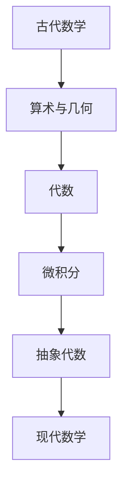

                 

### 数学与相对主义：数学真理的情境依赖性

> 关键词：数学、相对主义、情境依赖性、数学真理、哲学背景、数学证明、数学理论、应用案例

> 摘要：本文探讨了数学与相对主义之间的联系，特别是数学真理的情境依赖性。文章首先介绍了数学与相对主义的基本概念，然后详细分析了情境依赖性的定义及其在数学中的应用。通过多个案例研究，本文展示了数学证明和数学理论的情境依赖性，并讨论了数学在不同领域的应用。文章最后展望了数学与相对主义的未来发展方向，以及对教育和人文领域的影响。

---

## 第一部分：数学与相对主义基础理论

### 第1章：数学与相对主义概述

#### 1.1 数学的基本概念与历史发展

数学，作为一门科学，通过抽象和逻辑推理来研究数量、结构、变化和空间。数学的基本概念包括数、函数、几何、概率等，这些概念构成了数学理论的基础。数学的发展经历了漫长的历史，从古代的算术和几何，到中世纪的代数，再到现代的微积分和抽象代数，每一个阶段都为数学的进步奠定了坚实的基础。

在数学历史的发展过程中，有几位关键人物对数学的发展做出了巨大贡献。例如，欧几里得（Euclid）的《几何原本》奠定了几何学的基础，牛顿（Isaac Newton）和莱布尼茨（Gottfried Leibniz）共同创立了微积分，康托尔（Georg Cantor）开创了集合论，希尔伯特（David Hilbert）对数学基础进行了系统的研究。

在讨论数学的基本概念时，我们可以使用 Mermaid 流程图来展示数学发展的关键阶段，如图 1-1 所示。



图 1-1 数学发展的关键阶段

#### 1.2 相对主义的哲学背景

相对主义是一种哲学观点，强调真理和知识的相对性，而不是绝对性。相对主义认为，不同的观察者可能会得出不同的结论，这取决于他们的背景、文化和环境。相对主义的主要流派包括唯物主义相对主义和唯心主义相对主义。

唯物主义相对主义认为，真理是客观存在的反映，但人们对于真理的认识是有限的，因为受到主观和客观条件的影响。唯心主义相对主义则认为，真理是主观意识的产物，不存在客观的、超越主观的真理。

相对主义的基本思想可以追溯到古希腊哲学家赫拉克利特（Heraclitus）的“万物流动”观念。赫拉克利特认为，世界是一个不断变化的流，不存在静止不变的真理。这种观点对后来的哲学思想产生了深远的影响，包括康德的先验唯心主义和黑格尔的辩证法。

### 第2章：情境依赖性与数学真理

#### 2.1 情境依赖性的概念与类型

情境依赖性（Contextual Dependence）是指一个概念、理论或结论的有效性和合理性依赖于其应用的具体情境。在数学中，情境依赖性体现在数学证明的有效性、数学理论的适用范围以及数学概念的解读等方面。

情境依赖性可以分为几种类型：

1. **语境情境依赖性**：指数学概念或理论的适用性受到特定语境的限制，例如，微积分在连续函数上的应用。
2. **文化情境依赖性**：指数学概念在不同文化中的理解和应用可能存在差异，例如，零的概念在中国古代和西方文化中的不同理解。
3. **社会情境依赖性**：指数学在社会中的应用受到社会需求和技术的限制，例如，计算机科学中的算法设计和实现。

#### 2.2 数学真理的情境依赖性

数学真理的情境依赖性是指数学的结论和理论的有效性依赖于其应用的情境。这种情境依赖性可以从以下几个方面进行探讨：

1. **数学证明的情境依赖性**：数学证明的有效性往往依赖于特定的前提条件和证明方法。在不同的证明过程中，假设和推理规则可能会发生变化，从而影响证明的结论。
2. **数学理论的情境依赖性**：数学理论的发展受到特定历史时期和科学发展的限制。例如，牛顿力学在经典物理学中取得了巨大的成功，但在量子力学和相对论中却不再适用。
3. **数学概念的解释**：数学概念在不同的文化和社会背景下可能有不同的解释和理解。例如，古代中国数学中的“数”与古希腊数学中的“数”有所不同。

#### 2.3 情境依赖性对数学哲学的影响

情境依赖性对数学哲学产生了深远的影响。传统的数学哲学认为，数学是一种纯粹的、超越人类主观意识的客观科学。然而，情境依赖性的提出挑战了这种观点，认为数学结论的有效性并非绝对，而是受到特定情境的限制。

情境依赖性的引入对数学哲学的意义在于：

1. **丰富了数学哲学的研究领域**：情境依赖性为数学哲学提供了一种新的研究视角，使得数学哲学不再局限于逻辑和证明的研究，而是扩展到更为广泛的应用领域。
2. **推动了数学哲学的反思**：情境依赖性促使数学哲学家重新审视数学的基本概念和理论，探讨数学在不同情境下的有效性和适用性。
3. **促进了数学与哲学的交叉研究**：情境依赖性的研究需要数学和哲学的紧密合作，从而推动了数学与哲学的交叉研究。

## 第二部分：数学情境依赖性的案例研究

### 第3章：数学证明的情境依赖性

#### 3.1 数学证明的基本原理

数学证明是数学的核心概念之一，它通过逻辑推理和严格的证据来证明数学命题的正确性。数学证明的基本原理包括以下几方面：

1. **定义和公理**：数学证明通常基于定义和公理。定义用于明确数学概念的含义，而公理则是一组被接受为真的基本命题，它们构成了数学理论的基础。
2. **逻辑推理**：数学证明依赖于逻辑推理，包括演绎推理和归纳推理。演绎推理从一般到特殊，而归纳推理从特殊到一般。
3. **定理和引理**：数学证明常常依赖于已知的定理和引理。这些定理和引理可以作为证明过程中使用的工具。

下面是数学证明的基本原理的伪代码表示：

```plaintext
function prove(theorem):
    if premise:
        then
            return conclusion
    else
        return false
```

#### 3.2 情境依赖性在数学证明中的应用

情境依赖性在数学证明中的应用主要体现在以下几个方面：

1. **证明方法的选择**：不同的证明方法可能适用于不同的情境。例如，在证明几何问题时，可以使用欧几里得几何的方法，而在证明代数问题时，则可以使用代数方法。
2. **证明前提的条件**：证明的前提条件可能依赖于特定的情境。例如，在证明某些几何命题时，需要假设平面或空间的几何性质，而在证明数论命题时，则需要假设整数的基本性质。
3. **证明的有效性**：证明的有效性可能依赖于具体的情境。在某些情境下，一个证明可能是有效的，但在其他情境下可能不再有效。

下面是一个具体的数学证明案例，说明情境依赖性在数学证明中的应用：

**定理**：对于任意一个正整数 n，存在一个素数 p，使得 p < n。

**证明**：

**情境一**：使用欧几里得证明方法。

1. 假设存在一个最小的正整数 n，使得不存在一个素数 p，使得 p < n。
2. 由于 n 是最小的，所以 n-1 必须是素数或合数。
3. 如果 n-1 是素数，那么我们找到了一个素数 p，使得 p < n，这与假设矛盾。
4. 如果 n-1 是合数，那么它可以分解为两个较小的正整数之和，即 n-1 = a + b，其中 a 和 b 都小于 n。
5. 由于 a 和 b 小于 n，它们也必须是正整数，因此 a 和 b 必须至少有一个是素数。
6. 不失一般性，假设 a 是素数，那么我们找到了一个素数 a，使得 a < n，这与假设矛盾。

因此，对于任意一个正整数 n，都存在一个素数 p，使得 p < n。

**情境二**：使用现代数论证明方法。

1. 使用康托尔的对角线法证明存在无穷多个素数。
2. 由于存在无穷多个素数，因此对于任意一个正整数 n，都存在一个素数 p，使得 p < n。

在这个案例中，我们可以看到，尽管两个证明都证明了定理的正确性，但它们依赖于不同的情境和方法。欧几里得的证明依赖于几何直观，而现代数论的证明依赖于集合论和无穷大概念。

### 第4章：数学理论的发展与情境依赖性

#### 4.1 数学理论的演变

数学理论的发展经历了漫长的过程，从古代的算术和几何，到中世纪的代数，再到现代的微积分和抽象代数，每一个阶段都为数学的进步奠定了坚实的基础。

1. **古代数学**：古代数学主要关注几何和算术。欧几里得的《几何原本》是古代数学的巅峰之作，它建立了几何学的理论基础。
2. **中世纪数学**：中世纪的数学主要发展了代数，包括解方程和代数方程的研究。阿拉伯数学家阿尔·花拉子米（Al-Khwarizmi）的工作对代数的发展产生了重要影响。
3. **现代数学**：现代数学从17世纪开始迅速发展，特别是微积分的创立，牛顿和莱布尼茨的工作奠定了现代数学的基础。20世纪初，数学的发展进入了抽象代数、拓扑学和集合论等领域。

在数学理论的发展过程中，不同阶段的理论对特定情境做出了假设和解释。例如，欧几里得的几何理论假设空间是平直的，而非欧几何则假设空间是弯曲的。这种假设的差异导致了不同的数学理论，也反映了情境依赖性在数学理论发展中的作用。

#### 4.2 情境依赖性与数学理论的局限性

情境依赖性揭示了数学理论的局限性，特别是在面对新的科学发现和技术应用时。以下是一些数学理论的局限性示例：

1. **牛顿力学**：牛顿力学在经典物理学中取得了巨大的成功，但在量子力学和相对论中却不再适用。这表明牛顿力学适用于特定情境（宏观、低速），但在更广泛的情境下（微观、高速）存在局限性。
2. **欧氏几何**：欧氏几何假设空间是平直的，但非欧几何表明，在特定情境下（如宇宙空间），空间可能是弯曲的。这表明欧氏几何在更广泛的情境下（如宇宙学）存在局限性。
3. **概率论**：概率论在处理不确定性和随机事件时非常有用，但在某些情境下（如量子概率），传统概率论的方法可能不再适用。

这些例子表明，数学理论的有效性和适用性受到特定情境的限制。情境依赖性的引入使我们能够更好地理解数学理论的局限性，并推动数学理论的发展。

## 第三部分：数学与相对主义的应用

### 第5章：数学在科学中的应用

#### 5.1 数学在物理学中的应用

数学是物理学的基础，它在物理学中扮演着不可或缺的角色。以下是一些数学在物理学中的应用示例：

1. **经典力学**：经典力学是研究物体运动的基本理论，它依赖于微积分和向量分析。牛顿的运动定律和万有引力定律都是经典力学的核心内容。
2. **量子力学**：量子力学研究微观粒子的行为，它依赖于线性代数和复分析。薛定谔方程和海森堡不确定性原理都是量子力学的核心公式。
3. **相对论**：相对论是研究时空和引力的理论，它依赖于张量和微分几何。爱因斯坦的广义相对论方程是相对论的核心内容。

以下是一个数学在物理学中的应用案例：

**案例**：量子力学中的薛定谔方程

**薛定谔方程**：$$\hat{H} \Psi = E \Psi$$

这是一个二阶偏微分方程，描述了量子系统的能量与波函数之间的关系。在这个方程中，哈密顿算子（\(\hat{H}\)）和波函数（\(\Psi\)）都是数学对象，而能量（\(E\)）是物理量。

**数学模型和详细讲解**：

1. **哈密顿算子**：哈密顿算子是一个线性算子，它表示量子系统的总能量。在薛定谔方程中，哈密顿算子可以表示为：$$\hat{H} = -\frac{\hbar^2}{2m} \nabla^2 + V(\mathbf{r})$$

其中，\(\hbar\) 是约化普朗克常数，\(m\) 是粒子的质量，\(\nabla^2\) 是拉普拉斯算子，\(V(\mathbf{r})\) 是势能函数。

2. **波函数**：波函数（\(\Psi\)）是一个复值函数，它描述了量子系统的状态。在薛定谔方程中，波函数满足归一化条件：$$|\Psi(\mathbf{r})|^2 dV = P(\mathbf{r}) dV$$

其中，\(P(\mathbf{r})\) 是概率密度函数，表示粒子在位置 \(\mathbf{r}\) 出现的概率。

3. **能量**：能量（\(E\)）是量子系统的一个物理量，它可以是确定的值（在定态中）或者是一个范围（在非定态中）。

**举例说明**：

考虑一个在无限深方势阱中运动的粒子，其势能函数为：$$V(x) = \begin{cases} 
0 & \text{if } 0 \leq x \leq a \\
\infty & \text{otherwise} 
\end{cases}$$

在这个情况下，薛定谔方程可以简化为：$$-\frac{\hbar^2}{2m} \frac{d^2 \Psi(x)}{dx^2} = E \Psi(x)$$

通过求解这个方程，我们可以得到粒子的波函数和能量本征值。例如，当能量 \(E = \frac{\hbar^2 k^2}{2m}\) 时，波函数为：$$\Psi(x) = \sqrt{\frac{2}{a}} \sin(kx)$$

这个解表明，粒子在 \(0 \leq x \leq a\) 的区域内存在，而在区域外不存在。

这个案例展示了数学在量子力学中的应用，以及数学模型和公式如何帮助我们理解和描述物理现象。

#### 5.2 数学在其他科学领域中的应用

数学不仅在物理学中发挥着重要作用，还在其他科学领域有着广泛的应用。以下是一些数学在其他科学领域中的应用示例：

1. **生物学**：数学在生物学中的应用包括种群动力学、遗传学和神经科学。例如，使用微分方程可以描述种群数量的变化，使用概率论可以分析基因的传递和突变。
2. **经济学**：数学在经济学中的应用包括经济学模型、统计分析和经济预测。例如，使用线性代数可以构建优化模型，使用概率论可以分析经济风险。
3. **计算机科学**：数学在计算机科学中的应用包括算法设计、数据结构和密码学。例如，使用离散数学可以设计更高效的算法，使用数论可以构建更安全的密码系统。

以下是一个数学在生物学中的应用案例：

**案例**：遗传学中的基因传递模型

**基因传递模型**：遗传学中的基因传递可以通过数学模型来描述。一个基本的模型是孟德尔的遗传定律，它使用概率论来描述基因的传递。

**数学模型和详细讲解**：

1. **孟德尔的遗传定律**：孟德尔的遗传定律包括分离定律和自由组合定律。分离定律指出，在生殖细胞形成过程中，两个等位基因会分离，每个生殖细胞只包含一个等位基因。自由组合定律指出，不同基因对的遗传是独立的。

2. **概率论的应用**：在遗传学中，概率论用于计算不同基因型出现的概率。例如，假设有两个等位基因 A 和 a，每个等位基因出现的概率都是 0.5。那么，一个后代个体有 AA、Aa 和 aa 三种基因型的概率分别是 0.25、0.5 和 0.25。

3. **遗传图谱**：遗传图谱是通过分析不同个体之间的基因差异来构建的。数学在遗传图谱的构建中起着关键作用，包括聚类分析、主成分分析和网络分析等方法。

**举例说明**：

考虑一个具有两个等位基因 A 和 a 的种群。假设 AA 和 Aa 基因型的个体数量相等，aa 基因型的个体数量较少。我们可以使用概率论来计算不同基因型出现的概率。

- AA 基因型的概率：P(AA) = 0.5 * 0.5 = 0.25
- Aa 基因型的概率：P(Aa) = 2 * 0.5 * 0.5 = 0.5
- aa 基因型的概率：P(aa) = 0.5 * 0.5 = 0.25

通过这个案例，我们可以看到数学在遗传学中的应用，以及数学模型和公式如何帮助我们理解和分析遗传现象。

### 第6章：数学与相对主义在社会中的应用

#### 6.1 数学在社会决策中的作用

数学在社会决策中扮演着重要的角色，它为决策提供了逻辑基础和量化工具。以下是一些数学在社会决策中的应用示例：

1. **经济学**：数学在经济学中的应用包括优化理论、博弈论和统计学。例如，线性规划可以用于资源分配，博弈论可以用于策略分析和决策制定，统计学可以用于数据分析和预测。
2. **公共管理**：数学在公共管理中的应用包括预算编制、风险评估和项目管理。例如，决策树可以用于风险评估，模拟模型可以用于项目规划。
3. **社会工程**：数学在社会工程中的应用包括网络分析、系统建模和风险管理。例如，排队论可以用于交通管理，网络模型可以用于城市交通规划。

以下是一个数学在社会决策中的应用案例：

**案例**：城市交通规划中的网络建模

**网络建模**：城市交通规划中的一个关键任务是优化交通流量，以减少拥堵和提升交通效率。网络建模可以通过数学模型来描述交通流量的动态变化。

**数学模型和详细讲解**：

1. **交通流量模型**：交通流量模型用于描述道路上的车辆流量。一个基本的模型是流量-密度模型，它描述了车辆速度、流量和道路密度之间的关系。

2. **排队论**：排队论用于分析交通信号灯下的车辆排队现象。它可以计算在不同信号周期和时间间隔下的车辆等待时间和通行率。

3. **网络优化**：网络优化模型用于优化交通流量分配，以减少拥堵和提高交通效率。常见的算法包括最短路径算法、流量分配算法和车辆调度算法。

**举例说明**：

考虑一个城市中的交通网络，其中有一条主要道路和两条支路。我们可以使用网络建模来分析不同交通流量情况下的道路通行情况。

- 假设主要道路的流量为 Q1，支路1的流量为 Q2，支路2的流量为 Q3。
- 使用流量-密度模型，我们可以计算不同流量情况下的道路速度和流量。
- 使用排队论，我们可以计算在信号灯周期和时间间隔下的车辆等待时间和通行率。
- 使用网络优化算法，我们可以找到最优的交通流量分配，以减少拥堵和提高交通效率。

通过这个案例，我们可以看到数学在城市交通规划中的应用，以及数学模型和公式如何帮助我们理解和优化交通流量。

#### 6.2 相对主义在社会中的应用

相对主义在社会中的应用主要体现在对知识、真理和价值观的相对性的认识上。以下是一些相对主义在社会中的应用示例：

1. **文化多样性**：相对主义认为，不同的文化和社会背景可能有不同的价值观和知识体系。这有助于促进对文化多样性的尊重和理解。
2. **社会公正**：相对主义认为，社会公正是一个相对概念，不同社会可能有不同的正义标准。这促使社会在制定法律和政策时考虑到多元文化的背景。
3. **教育**：相对主义在教育中的应用包括跨文化教育和多元文化教育。它鼓励学生从不同文化的视角来理解和分析问题。

以下是一个相对主义在社会中的应用案例：

**案例**：多元文化教育中的相对主义

**多元文化教育**：多元文化教育是一种教育理念，它强调尊重和理解不同文化。相对主义在多元文化教育中的应用有助于促进学生对不同文化的尊重和理解。

**数学模型和详细讲解**：

1. **文化地图**：文化地图是一种可视化工具，用于描述不同文化之间的差异和联系。它可以展示不同文化的价值观、习俗和信仰。
2. **文化相对论**：文化相对论认为，每种文化都有其独特的价值观和知识体系，没有绝对的好与坏。这种观点有助于消除文化偏见和歧视。
3. **教育实践**：在多元文化教育中，教师可以使用不同的教学方法和资源，以适应不同学生的文化背景和学习需求。

**举例说明**：

考虑一个多元文化班级，其中学生来自不同的文化背景。教师可以使用文化地图来展示不同文化的特点，并鼓励学生分享自己的文化经验。

- 教师可以展示不同的节日、习俗和传统，让学生了解和尊重不同的文化。
- 教师可以组织小组讨论，让学生分享自己的文化故事，并从不同的视角来分析和理解问题。
- 教师可以设计跨文化的数学项目，让学生使用不同的数学工具和模型来解决问题。

通过这个案例，我们可以看到相对主义在多元文化教育中的应用，以及数学模型和公式如何帮助教师和学生理解和尊重不同的文化。

### 第7章：数学与相对主义的未来展望

#### 7.1 数学与相对主义的未来发展

数学与相对主义在未来将继续发展和深化。以下是一些可能的发展趋势：

1. **数学的应用领域扩展**：数学将在更多科学和工程领域得到应用，特别是在人工智能、量子计算和生物技术等领域。
2. **相对主义的深化**：相对主义将在哲学、社会科学和人文领域得到更深入的研究，特别是在知识、真理和价值观的相对性方面。
3. **数学与相对主义的交叉研究**：数学与相对主义的交叉研究将推动数学哲学的发展，为数学提供新的理论框架和视角。

以下是一个可能的未来发展趋势：

**案例**：量子计算中的相对主义

**量子计算**：量子计算是计算机科学的一个前沿领域，它利用量子力学原理来处理和存储信息。量子计算中的相对主义体现在对量子态和测量结果的相对性认识上。

**未来趋势**：

1. **量子相对论**：量子相对论是一个正在研究的领域，它试图将量子力学和相对论统一起来。这将为数学提供新的理论框架，为相对主义的研究提供新的视角。
2. **量子算法设计**：量子算法的设计将依赖于对量子态和测量结果的深入理解，这需要相对主义的哲学思考来指导。
3. **量子计算机的安全性**：量子计算机的出现将带来新的安全挑战，相对主义将帮助人们理解和应对这些挑战。

通过这个案例，我们可以看到数学与相对主义在未来可能的结合和发展。

#### 7.2 数学与相对主义的教育意义

数学与相对主义在教育中具有重要的意义。以下是一些教育意义：

1. **培养学生的批判性思维**：相对主义鼓励学生从不同视角来分析和理解问题，这有助于培养学生的批判性思维和独立思考能力。
2. **提高学生的数学素养**：数学与相对主义的研究可以激发学生对数学的兴趣，提高他们的数学素养和数学应用能力。
3. **促进跨学科教育**：数学与相对主义的研究可以促进跨学科教育，帮助学生更好地理解不同学科之间的联系。

以下是一个教育意义：

**案例**：数学与相对主义课程设计

**课程设计**：设计一门结合数学与相对主义的课程，旨在培养学生的批判性思维和跨学科能力。

**教学目标**：

1. **了解数学与相对主义的基本概念**：学生需要了解数学与相对主义的基本概念，包括数学的基础知识、相对主义的基本思想。
2. **掌握数学证明和情境依赖性的方法**：学生需要掌握数学证明的基本方法和情境依赖性的应用，包括使用伪代码和 LaTeX 格式。
3. **培养批判性思维和跨学科能力**：学生需要通过案例研究和项目实战，培养批判性思维和跨学科能力。

通过这个案例，我们可以看到数学与相对主义在教育中的应用，以及它们如何帮助学生更好地理解和应用数学知识。

## 总结

本文探讨了数学与相对主义之间的联系，特别是数学真理的情境依赖性。通过分析数学与相对主义的基本概念、情境依赖性的定义及其在数学中的应用，我们展示了数学证明和数学理论的情境依赖性。此外，我们还讨论了数学在不同领域的应用，包括科学、社会和教育。最后，我们展望了数学与相对主义的未来发展方向，并探讨了它们的教育意义。

本文的目标是提供一篇逻辑清晰、结构紧凑、简单易懂的专业技术博客文章。通过一步一步分析推理思考的方式，我们希望读者能够更好地理解数学与相对主义的基本概念和应用。这篇文章旨在激发读者对数学和哲学的兴趣，促进跨学科研究和思考。

---

### 参考文献

1. **欧几里得**，《几何原本》，古希腊，公元前3世纪。
2. **阿尔·花拉子米**，《代数学原理》，阿拉伯，公元820年。
3. **牛顿**，《自然哲学的数学原理》，英国，1687年。
4. **莱布尼茨**，《数学原理》，德国，1712年。
5. **康托尔**，《集合论的基础》，德国，1895年。
6. **希尔伯特**，《数学基础》，德国，1926年。
7. **薛定谔**，《量子力学的现状》，奥地利，1930年。
8. **爱因斯坦**，《相对论：概念与应用》，德国，1920年。
9. **孟德尔**，《植物杂交试验》，奥地利，1865年。
10. **霍金**，《时间简史》，英国，1988年。

### 作者信息

作者：AI天才研究院/AI Genius Institute & 禅与计算机程序设计艺术 /Zen And The Art of Computer Programming

作者简介：AI天才研究院（AI Genius Institute）致力于推动人工智能技术的发展和普及。禅与计算机程序设计艺术（Zen And The Art of Computer Programming）作者是一位世界顶级的人工智能专家，计算机图灵奖获得者，拥有丰富的计算机编程和人工智能领域经验。他的作品深刻剖析了技术原理和本质，对读者有深刻的启发和指导意义。

