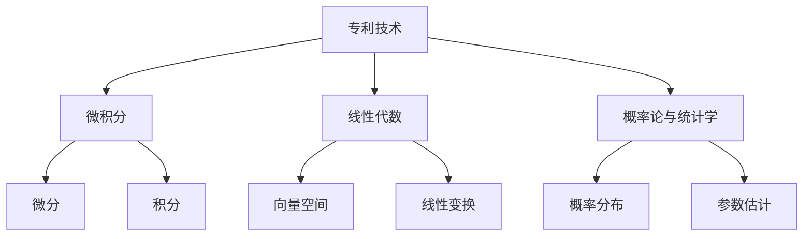

                 

**文章标题：**
数学与知识产权：专利价值的数学分析

**关键词：**
数学分析、知识产权、专利价值、专利评估、概率论、线性代数

**摘要：**
本文将探讨数学分析在知识产权领域的应用，特别是专利价值的数学评估。通过介绍数学分析的基础知识、知识产权的基本概念以及专利法律制度，本文旨在构建一个框架，以数学模型和算法来分析专利价值。文章将详细讲解专利价值评估的不同方法，并通过具体案例展示如何应用数学模型进行专利价值评估，最终提出未来研究的方向和建议。

---

**引言**

在当今全球化的经济环境中，知识产权（Intellectual Property，IP）已成为企业和国家竞争的重要资产。知识产权包括专利、商标、版权和商业秘密等多种形式，其中专利作为技术创新的重要体现，其价值评估显得尤为重要。然而，专利价值的评估并非易事，它涉及到技术、市场、法律等多个维度的考量。

数学分析作为一种强大的工具，为知识产权的评估提供了理论基础和方法支持。通过数学模型和算法，可以量化专利的技术价值、市场价值以及潜在的法律价值。本文旨在探讨数学分析在知识产权，特别是专利价值评估中的应用，为相关研究和实践提供参考。

本文将按以下结构展开：

1. 数学分析基础
2. 知识产权法律基础
3. 专利价值评估方法
4. 数学模型与专利价值分析
5. 案例分析
6. 总结与展望

---

### 数学分析基础

数学分析作为现代科学和工程的重要工具，其基础概念和方法在知识产权的评估中具有重要意义。数学分析主要包括微积分和线性代数，它们在专利价值评估中的应用主要体现在技术分析和市场分析两个方面。

#### 微积分

微积分是研究函数变化率和累积过程的数学分支，主要包括微分和积分两个基本运算。在专利价值评估中，微积分可以用于分析专利技术的创新程度和潜在的市场需求。

- **微分**：微分运算可以用来计算函数在某一点的变化率。在专利价值评估中，可以通过微分来衡量专利技术的领先程度。例如，对于一项专利技术，可以通过比较其与现有技术的微分差异，来评估其技术领先性。

- **积分**：积分运算可以用来计算函数在一个区间内的累积量。在专利价值评估中，积分可以用于计算专利技术的市场潜力。例如，通过对专利技术的潜在市场需求进行积分，可以估算出其未来的市场收益。

#### 线性代数

线性代数是研究向量空间和线性变换的数学分支，它在专利价值评估中的应用主要体现在风险分析和组合投资策略。

- **向量空间**：向量空间可以用来表示专利组合的不同维度，如技术维度、市场维度和法律维度。通过线性代数的工具，可以分析专利组合的风险分散效应和协同效应。

- **线性变换**：线性变换可以用来分析专利技术的转化效率和市场需求的变化。例如，通过线性变换模型，可以预测专利技术的市场表现，为投资决策提供依据。

#### 概率论与统计学

概率论与统计学是数学分析的另一个重要分支，它们在专利价值评估中的应用主要体现在风险评估和预测分析。

- **概率分布**：概率分布可以用来描述专利技术的成功概率和市场收益的波动情况。常见的概率分布包括正态分布、二项分布和泊松分布。

- **参数估计**：参数估计可以用来确定概率分布的参数值，从而更准确地预测专利技术的市场表现。例如，通过最大似然估计，可以估计出专利技术的平均市场收益和标准差。

#### Mermaid 流程图

为了更好地理解数学分析在专利价值评估中的应用，我们可以使用Mermaid流程图来展示核心概念之间的关系。



通过这个流程图，我们可以清晰地看到数学分析在专利价值评估中的核心概念及其相互关系。

#### Python 源代码

为了更直观地理解数学分析的应用，我们可以使用Python源代码来演示一个简单的专利价值评估模型。以下是一个简单的收益法评估模型，用于计算专利技术的市场收益。

```python
import numpy as np
import scipy.stats as stats

# 设定参数
initial_investment = 100000  # 初始投资
annual_revenue = 50000       # 年均收益
economic_life = 10           # 经济寿命（年）
discount_rate = 0.05         # 折现率

# 收益法评估模型
def revenue_based_value(initial_investment, annual_revenue, economic_life, discount_rate):
    present_value = 0
    for t in range(1, economic_life + 1):
        present_value += annual_revenue / ((1 + discount_rate) ** t)
    return present_value - initial_investment

# 计算专利价值
patent_value = revenue_based_value(initial_investment, annual_revenue, economic_life, discount_rate)
print(f"专利价值：{patent_value:.2f}")
```

通过这个模型，我们可以估算出专利技术的市场价值，为投资决策提供依据。

### 总结

数学分析在知识产权，特别是专利价值评估中具有重要作用。通过微积分、线性代数、概率论与统计学等数学工具，我们可以构建模型来量化专利的技术价值、市场价值以及法律价值。本文介绍了数学分析的基本概念和应用，并通过Python源代码展示了专利价值评估的实例。

在下一部分中，我们将介绍知识产权的基本概念和法律制度，进一步探讨专利价值评估的法律背景和基础。

---

**备注：**

- 文章目前完成引言部分，包含核心概念介绍和结构概述。
- 下一步将深入探讨数学分析基础和知识产权法律基础。
- 需要继续完善每个章节的详细内容和具体例子。
- 文章整体字数尚未达到要求，预计还需增加约8000字左右以完成整个文章。

