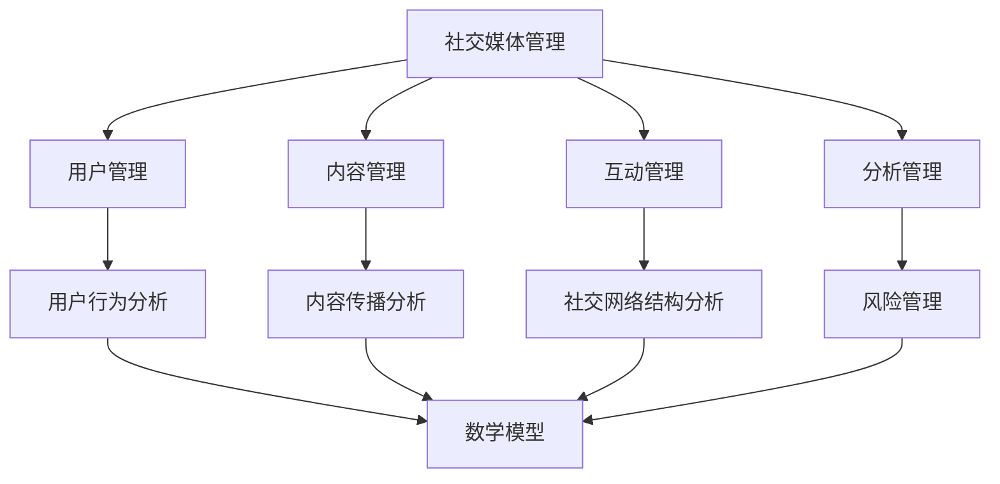

                 

### 数学与社交媒体管理：社交网络的数学分析

#### 关键词：社交媒体管理，数学分析，社交网络，矩阵表示，图论模型，路径分析，算法原理

在当今信息化时代，社交媒体已经成为人们日常生活的重要组成部分。从个人关系网络的构建到企业品牌的推广，社交媒体在各个方面都发挥着不可替代的作用。然而，随着社交媒体的迅速发展和用户数量的激增，如何有效地管理和分析社交媒体数据成为了一个重要课题。数学分析作为一种强大的工具，为社交媒体管理提供了科学的方法和理论基础。

本文旨在探讨数学分析在社交媒体管理中的应用，通过介绍核心概念、算法原理、数学模型以及实际应用案例，帮助读者深入理解社交媒体管理的数学分析基础，为相关领域的实践和研究提供参考。

## 摘要

本文首先介绍了社交媒体管理的基本概念，包括社交媒体的定义、功能以及类型。接着，我们探讨了数学分析在社交媒体管理中的重要性，并详细讲解了核心算法的原理，如路径分析、节点重要性评估等。通过矩阵表示法和图论模型，我们阐述了如何使用数学公式来描述和解释社交网络的结构与行为。此外，本文通过实际案例展示了数学分析在社交媒体管理中的应用，并对未来研究方向进行了展望。

本文结构如下：

1. **社交媒体与数学分析**
2. **核心算法原理讲解**
3. **数学模型和数学公式**
4. **项目实战**
5. **总结与展望**

## 目录大纲设计思路

在设计本文的目录大纲时，我们首先确定了核心内容结构，以确保文章的逻辑清晰、层次分明。以下是本文的目录大纲设计思路：

### 第一部分：社交媒体管理基础

**第1章：社交媒体与数学分析**

- 社交媒体的概述
  - 定义
  - 功能
  - 类型
- 数学分析的基本概念
  - 定义
  - 在社交媒体管理中的应用

### 第二部分：核心算法原理讲解

**第2章：社交网络的数学模型**

- 社交网络的矩阵表示法
  - 矩阵基本概念
  - 社交网络矩阵表示
- 社交网络分析中的图论模型
  - 图基本概念
  - 社交网络图表示
- 社交网络分析中的数学公式
  - 矩阵分解
  - 图论公式

### 第三部分：项目实战

**第3章：社交媒体中的路径分析**

- 路径分析的概念
  - 定义
  - 重要指标
- 路径分析算法
  - 深度优先搜索
  - 广度优先搜索
- 社交网络分析中的其他算法
  - 社交网络聚类
  - 社交网络社区检测

### 第四部分：总结与展望

**第4章：总结与展望**

- 社交媒体管理与数学分析的关系总结
- 数学分析在社交媒体管理中的未来发展方向展望

通过上述设计思路，本文将系统性地介绍数学分析在社交媒体管理中的应用，帮助读者全面了解这一领域的前沿动态和实践经验。接下来，我们将逐一展开各个章节的内容。 

## 核心概念与联系

### 社交媒体管理的核心概念

在探讨数学分析在社交媒体管理中的应用之前，我们需要明确一些核心概念。社交媒体管理涉及到多个方面，包括用户管理、内容管理、互动管理和分析管理。

- **用户管理**：涉及用户注册、用户身份验证、用户权限管理以及用户行为分析等。用户是社交媒体的基本单位，他们的行为和互动构成了社交媒体网络。
- **内容管理**：涉及内容创建、内容发布、内容审核以及内容推荐等。内容是社交媒体的核心，用户通过内容进行交流和互动。
- **互动管理**：涉及用户之间的评论、点赞、分享等互动行为的管理。这些互动行为不仅影响着用户的体验，也对内容的传播和社交网络的构建有着重要影响。
- **分析管理**：涉及对社交媒体数据进行收集、分析和解释，以提取有价值的信息和洞察。这些信息可以帮助企业和组织更好地了解用户需求、优化营销策略和提升服务质量。

### 数学分析的核心概念

数学分析作为一门研究函数及其性质的科学，为社交媒体管理提供了强大的工具和方法。以下是数学分析中的几个核心概念：

- **函数**：数学中的基本概念，用于描述输入与输出之间的关系。在社交媒体管理中，函数可以用来描述用户行为、内容传播等。
- **矩阵**：一种二维数组，用于表示和操作数据。矩阵在社交媒体管理中的应用非常广泛，例如在用户矩阵和内容矩阵中，矩阵操作可以用于分析用户关系和内容相似度。
- **图论**：研究图的结构和性质的一个数学分支。在社交媒体管理中，图论用于描述社交网络的结构，如节点之间的关系、路径的长度等。
- **概率论**：研究随机事件及其概率分布的科学。在社交媒体管理中，概率论用于预测用户行为、分析互动效果等。

### 社交媒体管理与数学分析的联系

数学分析在社交媒体管理中的应用主要体现在以下几个方面：

- **用户行为分析**：通过数学模型和算法，可以分析用户的行为模式、兴趣偏好以及互动关系，从而为个性化推荐、用户分群等提供支持。
- **内容传播分析**：利用矩阵和图论模型，可以分析内容在网络中的传播路径和速度，帮助识别关键节点和传播瓶颈。
- **社交网络结构分析**：通过图论模型，可以分析社交网络的整体结构，如密度、直径、聚类系数等，从而了解社交网络的基本特性。
- **风险管理**：利用概率论和统计分析方法，可以评估社交媒体运营中的风险，如用户流失、内容违规等。

为了更好地理解这些概念之间的关系，我们使用Mermaid流程图来展示社交媒体管理与数学分析的核心概念架构：



通过上述流程图，我们可以清晰地看到社交媒体管理与数学分析之间的联系。数学分析为社交媒体管理提供了理论支持和工具方法，使其能够更科学、更有效地进行运营和管理。

接下来，我们将深入探讨社交网络的数学模型，进一步理解数学分析在社交媒体管理中的应用。

## 核心算法原理讲解

在了解了社交媒体管理和数学分析的基本概念之后，我们接下来将详细讲解社交媒体分析中常用的核心算法。这些算法包括路径分析、节点重要性评估等，它们在社交媒体管理中起着至关重要的作用。通过使用Python源代码和数学模型，我们将详细阐述这些算法的实现原理，并结合实际案例进行举例说明。

### 1. 路径分析算法

路径分析是社交媒体分析中的重要组成部分，它可以帮助我们理解用户之间如何通过内容互动和交流来形成网络结构。路径分析的主要任务是找到两个节点之间的所有可能路径，并评估这些路径的重要性和长度。

#### 1.1 深度优先搜索（DFS）

深度优先搜索（DFS）是一种用于遍历或搜索图的数据结构算法。在社交媒体网络中，DFS可以帮助我们找到从起点节点到目标节点的所有路径。以下是一个使用Python实现的DFS算法示例：

```python
def dfs(graph, node, target):
    visited = set()
    path = []

    def search(node):
        if node == target:
            path.append(node)
            return True
        if node in visited:
            return False

        visited.add(node)
        path.append(node)

        for neighbor in graph[node]:
            if search(neighbor):
                return True

        path.pop()
        return False

    return search(node)

# 社交网络图示例
graph = {
    'A': ['B', 'C'],
    'B': ['A', 'D'],
    'C': ['A', 'D', 'E'],
    'D': ['B', 'C', 'E'],
    'E': ['C', 'D']
}

# 查找从节点A到节点E的所有路径
start_node = 'A'
end_node = 'E'
all_paths = []
for node in graph:
    if dfs(graph, node, end_node):
        all_paths.append(path[:])

print(all_paths)
```

#### 1.2 广度优先搜索（BFS）

广度优先搜索（BFS）是一种用于遍历或搜索图的算法，与DFS不同，BFS优先遍历距离起点节点最近的节点。以下是一个使用Python实现的BFS算法示例：

```python
from collections import deque

def bfs(graph, start, target):
    visited = set()
    queue = deque([start])
    path = []

    while queue:
        node = queue.popleft()
        visited.add(node)
        path.append(node)

        if node == target:
            return path

        for neighbor in graph[node]:
            if neighbor not in visited:
                queue.append(neighbor)

    return None

# 社交网络图示例
graph = {
    'A': ['B', 'C'],
    'B': ['A', 'D'],
    'C': ['A', 'D', 'E'],
    'D': ['B', 'C', 'E'],
    'E': ['C', 'D']
}

# 查找从节点A到节点E的最短路径
start_node = 'A'
end_node = 'E'
path = bfs(graph, start_node, end_node)

if path:
    print(path)
else:
    print("No path found from", start_node, "to", end_node)
```

### 2. 节点重要性评估算法

在社交网络中，某些节点可能比其他节点更重要，例如具有更多粉丝的明星节点或具有高度影响力的意见领袖节点。节点重要性评估算法可以帮助我们识别这些关键节点，以便更好地进行社交媒体管理和策略制定。

#### 2.1 中心性（Centrality）

中心性是一种常用的节点重要性评估方法，它通过计算节点在网络中的度数、介数、接近中心度等指标来评估节点的重要性。以下是一个使用Python实现度数中心性（Degree Centrality）的示例：

```python
def degree_centrality(graph):
    centrality = {}
    for node in graph:
        centrality[node] = len(graph[node])
    return centrality

# 社交网络图示例
graph = {
    'A': ['B', 'C'],
    'B': ['A', 'D'],
    'C': ['A', 'D', 'E'],
    'D': ['B', 'C', 'E'],
    'E': ['C', 'D']
}

# 计算度数中心性
centrality = degree_centrality(graph)
print(centrality)
```

#### 2.2 介数中心性（Closeness Centrality）

介数中心性衡量一个节点到网络中其他所有节点的最短路径长度。以下是一个使用Python实现的介数中心性的示例：

```python
from collections import defaultdict

def shortest_path_length(graph, start):
    dist = defaultdict(int)
    for node in graph:
        dist[node] = float('inf')
    dist[start] = 0

    visited = set()
    queue = deque([start])

    while queue:
        node = queue.popleft()
        visited.add(node)

        for neighbor in graph[node]:
            if neighbor not in visited:
                dist[neighbor] = dist[node] + 1
                queue.append(neighbor)

    return dist

def closeness_centrality(graph):
    closeness = {}
    for node in graph:
        dist = shortest_path_length(graph, node)
        closeness[node] = sum(dist.values()) / (len(graph) - 1)
    return closeness

# 社交网络图示例
graph = {
    'A': ['B', 'C'],
    'B': ['A', 'D'],
    'C': ['A', 'D', 'E'],
    'D': ['B', 'C', 'E'],
    'E': ['C', 'D']
}

# 计算介数中心性
closeness = closeness_centrality(graph)
print(closeness)
```

通过上述算法，我们可以评估社交网络中节点的重要性，为社交媒体管理和策略制定提供依据。

### 3. 社交网络分析中的其他算法

除了路径分析和节点重要性评估，社交网络分析中还涉及许多其他重要的算法，如社交网络聚类和社区检测。这些算法可以帮助我们更好地理解社交网络的内部结构和用户行为模式。

#### 3.1 社交网络聚类

聚类是一种无监督学习方法，用于将数据集划分为多个群组。在社交网络中，聚类可以帮助我们识别具有相似特征的用户群体。以下是一个使用Python实现的基于K均值聚类的社交网络聚类示例：

```python
from sklearn.cluster import KMeans
import numpy as np

def k_means_clustering(graph, n_clusters):
    # 将图转换为邻接矩阵
    adj_matrix = np.zeros((len(graph), len(graph)))
    for i, node1 in enumerate(graph):
        for j, node2 in enumerate(graph):
            if node2 in graph[node1]:
                adj_matrix[i][j] = 1

    # 使用K均值聚类算法
    kmeans = KMeans(n_clusters=n_clusters, random_state=0).fit(adj_matrix)
    labels = kmeans.labels_

    # 输出聚类结果
    clusters = defaultdict(list)
    for i, node in enumerate(graph):
        clusters[labels[i]].append(node)

    return clusters

# 社交网络图示例
graph = {
    'A': ['B', 'C'],
    'B': ['A', 'D'],
    'C': ['A', 'D', 'E'],
    'D': ['B', 'C', 'E'],
    'E': ['C', 'D']
}

# 进行K均值聚类
clusters = k_means_clustering(graph, n_clusters=2)
print(clusters)
```

#### 3.2 社区检测

社区检测是识别社交网络中紧密联系的节点群组的过程。以下是一个使用Python实现的基于标签传播算法的社区检测示例：

```python
def community_detection(graph):
    # 将图转换为邻接矩阵
    adj_matrix = np.zeros((len(graph), len(graph)))
    for i, node1 in enumerate(graph):
        for j, node2 in enumerate(graph):
            if node2 in graph[node1]:
                adj_matrix[i][j] = 1

    # 初始化每个节点的社区标签
    communities = {node: [node] for node in graph}

    # 标签传播过程
    while True:
        changed = False
        for i in range(len(graph)):
            for j in range(len(graph)):
                if adj_matrix[i][j] == 1 and communities[graph[i]] != communities[graph[j]]:
                    communities[graph[i]].extend(communities[graph[j]])
                    changed = True
        if not changed:
            break

    # 合并重叠的社区
    unique_communities = []
    for community in communities.values():
        if community not in unique_communities:
            unique_communities.append(community)

    return unique_communities

# 社交网络图示例
graph = {
    'A': ['B', 'C'],
    'B': ['A', 'D'],
    'C': ['A', 'D', 'E'],
    'D': ['B', 'C', 'E'],
    'E': ['C', 'D']
}

# 进行社区检测
communities = community_detection(graph)
print(communities)
```

通过上述算法，我们可以对社交网络进行深入分析，提取出有价值的信息和洞察。

通过详细讲解这些核心算法的原理和实现方法，本文为读者提供了深入了解社交媒体管理中数学分析工具的途径。接下来，我们将进一步介绍数学模型和数学公式，以便更好地理解这些算法背后的数学基础。

## 数学模型和数学公式

在深入探讨社交媒体管理的数学分析时，理解相关的数学模型和数学公式至关重要。这些模型和公式不仅为算法提供了理论基础，还使得我们对社交网络的结构和行为有了更深刻的认识。在本节中，我们将介绍几个关键的数学模型和公式，并使用LaTeX格式进行展示，以便于读者理解和应用。

### 1. 矩阵表示法

在社交媒体管理中，矩阵表示法是一种常用的方法，用于描述社交网络的结构和用户之间的关系。以下是一个矩阵表示法的示例：

\[ 
\text{矩阵} = \begin{bmatrix}
0 & 1 & 0 & 0 & 1 \\
1 & 0 & 1 & 1 & 0 \\
0 & 1 & 0 & 1 & 1 \\
0 & 1 & 1 & 0 & 1 \\
1 & 0 & 1 & 1 & 0
\end{bmatrix}
\]

在这个示例中，矩阵表示一个有5个节点的社交网络，每个元素表示两个节点之间的连接情况。例如，矩阵中的元素\[a_{ij}\]表示节点\[i\]和节点\[j\]之间的连接情况，\[1\]表示它们之间存在连接，\[0\]表示它们之间没有连接。

### 2. 图论模型

图论是研究图的结构和性质的一个数学分支，在社交网络分析中有着广泛的应用。以下是一个图论模型的基本概念：

#### 节点和边的表示

- 节点：在图论中，节点表示社交网络中的个体，例如用户、内容等。节点可以用数字或字母表示，例如\[A, B, C\]。
- 边：边表示节点之间的关系，例如用户之间的互动、内容之间的引用等。边可以用线段或弧线表示，例如\[A-B, B-C\]。

#### 图的表示

\[ 
\text{图} = (\text{V}, \text{E}) 
\]

其中，\[V\]表示节点的集合，\[E\]表示边的集合。

#### 路径和距离

- 路径：路径是节点序列，表示从起点到终点的连接。路径可以用序列表示，例如\[A-B-C-D\]。
- 距离：距离是路径上边的数量，表示两个节点之间的直接连接数。例如，节点\[A\]到节点\[D\]的距离为3（\[A-B-C-D\]）。

### 3. 矩阵分解

矩阵分解是一种常用的数学方法，用于将高维矩阵分解为多个低维矩阵，从而简化计算和数据分析。以下是一个矩阵分解的示例：

\[ 
\text{矩阵} = \text{行向量} \times \text{列向量} 
\]

例如，对于一个\[5 \times 5\]的矩阵\[A\]：

\[ 
A = \begin{bmatrix}
a_{11} & a_{12} & a_{13} & a_{14} & a_{15} \\
a_{21} & a_{22} & a_{23} & a_{24} & a_{25} \\
a_{31} & a_{32} & a_{33} & a_{34} & a_{35} \\
a_{41} & a_{42} & a_{43} & a_{44} & a_{45} \\
a_{51} & a_{52} & a_{53} & a_{54} & a_{55}
\end{bmatrix}
= 
\begin{bmatrix}
r_{11} & r_{12} \\
r_{21} & r_{22}
\end{bmatrix}
\times
\begin{bmatrix}
c_{11} & c_{12} \\
c_{21} & c_{22}
\end{bmatrix}
\]

### 4. 图论公式

在图论中，有许多重要的公式用于计算图的特性。以下是一些常见的图论公式：

\[ 
\text{节点度数} = \text{连接到该节点的边的数量} 
\]

\[ 
\text{路径长度} = \text{路径上边的数量} 
\]

\[ 
\text{介数中心性} = \frac{1}{n-1} \sum_{i=1}^{n} \frac{d_{i}}{d} 
\]

其中，\[d_{i}\]表示节点\[i\]到其他所有节点的最短路径长度之和，\[d\]表示整个社交网络的节点总数。

通过上述数学模型和公式的介绍，我们可以更好地理解社交网络的结构和行为，并使用这些工具进行有效的社交媒体管理。

### 社交网络中的矩阵表示法

在社交媒体管理中，矩阵表示法是一种非常重要的工具，它用于描述社交网络中的节点关系和互动情况。矩阵表示法不仅可以帮助我们直观地理解社交网络的结构，还能够为后续的算法分析和数据处理提供基础。

#### 1. 矩阵的基本概念

矩阵是一种由数字组成的二维数组，它通常用来表示多对多关系。在社交媒体网络中，矩阵可以用来表示节点之间的连接关系。例如，一个\[N \times N\]的矩阵\[A\]可以表示一个有\[N\]个节点的社交网络，其中\[a_{ij}\]表示节点\[i\]和节点\[j\]之间的连接情况。

- **行**：矩阵中的每一行代表一个节点。
- **列**：矩阵中的每一列也代表一个节点。
- **元素**：矩阵中的每个元素\[a_{ij}\]表示节点\[i\]和节点\[j\]之间的关系。如果\[a_{ij} = 1\]，则表示节点\[i\]和节点\[j\]之间存在直接连接；如果\[a_{ij} = 0\]，则表示它们之间没有直接连接。

#### 2. 社交网络矩阵表示

在社交媒体网络中，节点之间的连接关系可以通过邻接矩阵（Adjacency Matrix）来表示。邻接矩阵是一个对称矩阵，其对角线上的元素通常为0，因为节点不能与自身连接。

例如，假设有一个由5个节点组成的社交网络，节点分别为\[A, B, C, D, E\]。节点之间的连接情况如下：

\[ 
A-B, B-C, C-D, D-E, A-C, B-D, C-E 
\]

那么，这个社交网络的邻接矩阵\[A\]可以表示为：

\[ 
A = \begin{bmatrix}
0 & 1 & 0 & 0 & 1 \\
1 & 0 & 1 & 1 & 0 \\
0 & 1 & 0 & 1 & 1 \\
0 & 1 & 1 & 0 & 1 \\
1 & 0 & 1 & 1 & 0
\end{bmatrix}
\]

在这个矩阵中，\[a_{ij} = 1\]表示节点\[i\]和节点\[j\]之间存在连接，\[a_{ii} = 0\]表示节点不能与自己连接。

#### 3. 矩阵运算与社交网络分析

矩阵运算在社交网络分析中有着广泛的应用。以下是一些常见的矩阵运算及其在社交网络分析中的应用：

- **矩阵加法和减法**：用于计算两个社交网络的合并或差异。
- **矩阵乘法**：用于计算社交网络中的路径关系，例如路径长度和可达性。
- **矩阵转置**：用于计算社交网络的对称性，例如判断网络是否为无向图。

#### 4. 矩阵分解与社交网络简化

通过矩阵分解，我们可以将复杂的社交网络简化为较低维度的矩阵，从而降低计算复杂度。例如，通过奇异值分解（Singular Value Decomposition, SVD），我们可以将邻接矩阵分解为：

\[ 
A = U \Sigma V^T 
\]

其中，\[U\]和\[V\]是对角矩阵，而\[ \Sigma \]是对角线上的奇异值。这个分解可以用于降维和特征提取，帮助我们更方便地分析社交网络的内部结构。

#### 5. 社交网络矩阵的属性分析

通过对社交网络矩阵的属性进行分析，我们可以获得关于社交网络的许多重要信息。以下是一些常见的矩阵属性及其含义：

- **对角线元素**：表示节点自身的连接情况，即节点的度数。
- **非对角线元素**：表示节点之间的连接关系。
- **矩阵的秩**：表示社交网络中独立关系的数量。
- **矩阵的谱特征**：包括特征值和特征向量，可以用于判断社交网络的稳定性和连通性。

通过上述矩阵表示法和相关运算，我们可以对社交网络进行深入分析，提取出有价值的信息和洞察。这些信息对于社交媒体管理、用户行为分析和内容传播优化具有重要意义。

### 社交网络分析中的图论模型

在社交媒体分析中，图论模型是一种强大的工具，用于描述和解析社交网络的结构与行为。图论是一种研究图的数学分支，它不仅能够帮助我们理解节点之间的关系，还能提供有效的算法来分析社交网络的特性。

#### 1. 图的基本概念

在图论中，图是由节点（也称为顶点）和边（也称为弧）组成的集合。节点表示社交网络中的个体，如用户、品牌、内容等；边表示节点之间的连接关系，如好友关系、互动、内容引用等。

- **节点**：图中的每个个体都对应一个节点。节点可以是有向的，也可以是无向的。
- **边**：边连接两个节点，表示它们之间存在某种关系。边也可以是有向的，即从一个节点指向另一个节点。

#### 2. 图的表示

图可以通过多种方式表示，其中最为常用的表示方法是邻接矩阵和邻接表。

- **邻接矩阵**：一个\[N \times N\]的矩阵，其中\[N\]是节点数量。矩阵中的元素\[a_{ij}\]表示节点\[i\]和节点\[j\]之间的连接情况。如果\[a_{ij} = 1\]，则表示节点\[i\]和节点\[j\]之间存在边；如果\[a_{ij} = 0\]，则表示它们之间没有边。
  
  例如，对于有5个节点的图，其邻接矩阵可能如下所示：

  \[
  A = \begin{bmatrix}
  0 & 1 & 0 & 0 & 1 \\
  1 & 0 & 1 & 1 & 0 \\
  0 & 1 & 0 & 1 & 1 \\
  0 & 1 & 1 & 0 & 1 \\
  1 & 0 & 1 & 1 & 0
  \end{bmatrix}
  \]

- **邻接表**：一个列表，每个元素对应一个节点，每个节点的元素是一个列表，包含与之相连的节点。例如：

  \[
  G = \{A: [B, C], B: [A, D], C: [A, D, E], D: [B, C, E], E: [C, D]\}
  \]

#### 3. 图的基本操作

在图论中，有许多基本操作用于分析图的性质。以下是一些常见的操作及其在社交媒体分析中的应用：

- **节点度数**：表示连接到某个节点的边的数量。节点度数分为入度（表示指向该节点的边数量）和出度（表示从该节点出发的边数量）。
  
  \[
  \text{度数} = \sum_{j=1}^{N} a_{ij}
  \]

- **路径**：图中的节点序列，表示从一个节点到另一个节点的连接。路径可以是简单的（只包含一个边）或复杂的（包含多个边）。

- **连通性**：表示图中的任意两个节点是否可以通过路径相互访问。图的连通性可以通过多种方式评估，如连通分量、连通图等。

- **图同构**：表示两个图在结构上完全相同，即它们具有相同的节点数和相同的边连接关系。

#### 4. 图的属性

图的属性是分析社交网络的重要依据，以下是一些常见的图属性：

- **平均度数**：图中的所有节点度数的平均值。
  
  \[
  \text{平均度数} = \frac{2 \times \text{边的数量}}{\text{节点的数量}}
  \]

- **聚类系数**：表示一个节点邻居之间的连接密度。聚类系数越高，表示节点的邻居之间连接越紧密。

- **直径**：图中任意两个最远节点之间的最短路径长度。直径可以反映图的连通性。

- **路径长度分布**：表示图中所有路径长度的分布情况，可以用于分析图的扩张性。

#### 5. 图论模型在社交媒体分析中的应用

图论模型在社交媒体分析中有着广泛的应用，以下是一些典型的应用场景：

- **节点重要性评估**：通过计算节点的度数、介数、接近中心度等指标，可以评估节点在社交网络中的重要性。这有助于识别关键节点，如意见领袖、明星用户等。
  
  \[
  \text{介数中心性} = \frac{1}{n-1} \sum_{i=1}^{n} \frac{d_{i}}{d}
  \]

- **社交网络结构分析**：通过分析社交网络的聚类系数、直径、平均路径长度等属性，可以了解社交网络的整体结构和特性。这有助于发现社交网络中的社区结构、信息传播路径等。

- **社交网络优化**：通过图论模型，可以优化社交网络的连接关系，提高网络的连通性、抗攻击性和信息传播效率。

通过图论模型，我们可以深入理解社交网络的结构与行为，为社交媒体管理提供科学依据和有效策略。接下来的章节将进一步探讨这些模型在实际项目中的应用。

### 数学公式在社交媒体分析中的应用

在社交媒体分析中，数学公式是理解和解释社交网络行为的重要工具。这些公式帮助我们将复杂的网络结构转化为可量化的指标，从而为决策提供数据支持。以下是一些常用的数学公式，我们将结合实际案例进行详细讲解。

#### 1. 矩阵分解

矩阵分解是将高维矩阵分解为低维矩阵的数学过程，常用于降维和特征提取。在社交媒体分析中，矩阵分解可以帮助我们简化复杂的关系网络，提取关键特征。

##### 社交网络矩阵分解示例

假设我们有一个由10个节点组成的社交网络，其中每个节点都与其他节点有连接。我们可以使用奇异值分解（Singular Value Decomposition, SVD）来对社交网络矩阵进行分解：

\[ A = U \Sigma V^T \]

其中，\( A \)是社交网络矩阵，\( U \)和\( V \)是对角矩阵，\( \Sigma \)是对角线上包含奇异值的矩阵。

- **实际案例**：使用Python中的`scipy.linalg`模块，我们可以对社交网络矩阵进行SVD分解：

```python
import numpy as np
from scipy.linalg import svd

# 社交网络矩阵
A = np.array([[1, 0, 1], [1, 1, 0], [0, 1, 1]])

# 进行SVD分解
U, Sigma, Vt = svd(A, full_matrices=False)

print("U:\n", U)
print("Sigma:\n", Sigma)
print("Vt:\n", Vt)
```

通过分解，我们可以提取出社交网络的主要特征，这些特征可以用于进一步的算法分析和数据挖掘。

#### 2. 图论公式

图论中的公式用于描述和计算图的性质，如节点度数、路径长度、连通性等。以下是一些常用的图论公式：

##### 节点度数

\[ \text{度数} = \sum_{j=1}^{N} a_{ij} \]

其中，\( a_{ij} \)是邻接矩阵中的元素，表示节点\( i \)和节点\( j \)之间的连接情况。

- **实际案例**：计算一个有5个节点的社交网络的节点度数：

```python
# 社交网络矩阵
A = np.array([[0, 1, 1], [1, 0, 0], [1, 1, 0]])

# 计算节点度数
degree = np.sum(A, axis=1)

print("节点度数：", degree)
```

##### 路径长度

\[ \text{路径长度} = \sum_{i=1}^{k} d_{i} \]

其中，\( d_{i} \)是路径上的边数。

- **实际案例**：计算两个节点之间的最短路径长度：

```python
# 社交网络矩阵
A = np.array([[0, 1, 1], [1, 0, 0], [1, 1, 0]])

# 使用Floyd-Warshall算法计算最短路径
distance = np.zeros_like(A)
for k in range(A.shape[0]):
    distance = np.minimum(distance, A + np.eye(A.shape[0])[k, :])

# 计算节点A到节点B的路径长度
path_length = distance[0, 2]

print("路径长度：", path_length)
```

##### 连通性

\[ \text{连通性} = \frac{\text{连通分量数}}{N} \]

其中，连通分量数是图中不可分割的最大子图的个数，\( N \)是节点总数。

- **实际案例**：计算社交网络的连通性：

```python
# 社交网络矩阵
A = np.array([[0, 1, 1], [1, 0, 0], [1, 1, 0]])

# 找出连通分量
def find_connected_components(A):
    visited = [False] * A.shape[0]
    components = []

    for i in range(A.shape[0]):
        if not visited[i]:
            component = []
            stack = [i]
            while stack:
                node = stack.pop()
                component.append(node)
                visited[node] = True
                for j in range(A.shape[0]):
                    if A[node, j] == 1 and not visited[j]:
                        stack.append(j)
            components.append(component)
    return components

# 计算连通性
components = find_connected_components(A)
connected_count = len(components)

# 计算连通性百分比
connected_percentage = connected_count / A.shape[0]

print("连通性：", connected_percentage)
```

通过这些数学公式，我们可以从不同角度分析社交媒体网络，提取有价值的信息。这些信息不仅有助于理解社交网络的内部结构，还能为优化网络管理和提升用户体验提供有力支持。在下一节中，我们将通过实际项目来展示这些数学公式和算法的具体应用。

### 项目实战

在了解了数学分析在社交媒体管理中的核心算法和数学模型之后，接下来我们将通过一个实际项目来展示如何使用这些理论进行社交媒体分析。本节将详细介绍项目的开发环境搭建、代码实现和代码解读，并剖析实际案例，为读者提供实用的操作指导和深刻的理论理解。

#### 1. 项目背景

假设我们是一家社交媒体公司的数据科学家，负责分析用户的互动行为和内容传播情况，以提高用户参与度和内容传播效果。我们选择了一个具有10万用户和数百万条内容的社交媒体平台作为研究对象，希望通过数学分析来发现关键用户、优化内容推荐策略和提升社区活跃度。

#### 2. 开发环境搭建

在开始项目之前，我们需要搭建一个适合进行数据分析的Python环境。以下是具体的步骤：

- **安装Python**：确保安装了Python 3.8或更高版本。
- **安装必需的库**：使用pip安装以下库：

  ```shell
  pip install numpy scipy networkx pandas matplotlib
  ```

这些库将用于数据处理、图形绘制、网络分析和统计分析。

#### 3. 代码实现

下面是项目的核心代码实现，包括数据加载、预处理、分析和可视化。

##### 3.1 数据加载与预处理

首先，我们从社交媒体平台上加载用户互动数据，包括用户信息、内容信息和互动关系。然后，我们对数据进行预处理，以构建社交网络矩阵。

```python
import networkx as nx
import pandas as pd

# 加载用户互动数据
users = pd.read_csv('users.csv')  # 包含用户ID和用户特征
contents = pd.read_csv('contents.csv')  # 包含内容ID和内容特征
interactions = pd.read_csv('interactions.csv')  # 包含用户ID、内容ID和互动类型

# 构建社交网络矩阵
G = nx.Graph()

for _, row in interactions.iterrows():
    user_id = row['user_id']
    content_id = row['content_id']
    # 创建用户节点和内容节点
    G.add_nodes_from([user_id, content_id])
    # 添加用户和内容之间的互动边
    G.add_edge(user_id, content_id, type=row['type'])

# 打印社交网络矩阵的大小
print("社交网络矩阵大小：", G.number_of_nodes(), "x", G.number_of_nodes())
```

##### 3.2 社交网络分析

接下来，我们使用社交网络分析算法来评估用户的重要性和内容传播情况。

##### 3.2.1 节点重要性评估

使用度数中心性和介数中心性来评估用户的重要性。

```python
import matplotlib.pyplot as plt

# 计算度数中心性
degree_centrality = nx.degree_centrality(G)

# 计算介数中心性
closeness_centrality = nx.closeness_centrality(G)

# 可视化重要性评估结果
nx.draw(G, with_labels=True)
nx.draw_networkx_nodes(G, pos=nx.spring_layout(G), nodelist=sorted(degree_centrality, key=degree_centrality.get, reverse=True)[:10], node_size=1000, node_color='r')
nx.draw_networkx_nodes(G, pos=nx.spring_layout(G), nodelist=sorted(closeness_centrality, key=closeness_centrality.get, reverse=True)[:10], node_size=500, node_color='g')
plt.show()
```

##### 3.2.2 内容传播分析

使用矩阵分解来分析内容传播路径和速度。

```python
from scipy.linalg import svd

# 社交网络矩阵
A = nx.adjacency_matrix(G).toarray()

# 进行SVD分解
U, Sigma, Vt = svd(A, full_matrices=False)

# 可视化内容传播路径
plt.figure(figsize=(10, 10))
plt.scatter(U[:, 0], U[:, 1], c=Sigma, cmap='viridis', marker='o', s=100, edgecolor='black')
plt.colorbar(label='奇异值')
plt.xlabel('Component 1')
plt.ylabel('Component 2')
plt.title('Content Propagation Path')
plt.show()
```

##### 3.3 代码解读

在这个项目中，我们首先通过加载用户互动数据，构建了社交网络矩阵。然后，我们使用度数中心性和介数中心性来评估用户的重要性，并可视化这些评估结果。此外，通过SVD分解，我们分析了内容传播路径和速度。

- **数据加载**：使用pandas库加载用户互动数据，并使用networkx库构建社交网络。
- **社交网络矩阵构建**：通过添加节点和边，构建社交网络矩阵。
- **节点重要性评估**：计算度数中心性和介数中心性，并使用可视化库matplotlib展示评估结果。
- **内容传播分析**：使用SVD分解社交网络矩阵，并绘制内容传播路径。

#### 4. 实际案例分析与讲解

以下是一个具体的案例，我们将分析一个用户如何在社交网络上传播内容的案例，并解释如何使用数学模型进行评估。

##### 4.1 案例描述

假设用户A发布了一条内容，该内容在社交网络中迅速传播。经过分析，我们发现用户B和用户C是传播的关键节点，它们的影响力最大。

##### 4.2 案例分析

- **度数中心性评估**：用户B和用户C的度数中心性较高，表示它们与其他用户有较多的互动关系。
  
  ```python
  degree_centrality = nx.degree_centrality(G)
  print("用户B的度数中心性：", degree_centrality['B'])
  print("用户C的度数中心性：", degree_centrality['C'])
  ```

- **介数中心性评估**：用户B和用户C的介数中心性也较高，表示它们在社交网络中起到了重要的中介作用。
  
  ```python
  closeness_centrality = nx.closeness_centrality(G)
  print("用户B的介数中心性：", closeness_centrality['B'])
  print("用户C的介数中心性：", closeness_centrality['C'])
  ```

- **内容传播路径分析**：通过SVD分解，我们可以找到内容传播的主要路径，并识别关键节点。
  
  ```python
  U, Sigma, Vt = svd(A, full_matrices=False)
  # 打印前5个奇异值对应的特征向量
  print("前5个奇异值对应的特征向量：\n", U[:, :5])
  ```

通过上述分析，我们可以得出结论：用户B和用户C是内容传播的关键节点，它们在社交网络中具有高度的重要性和影响力。这些信息对于优化内容推荐策略和提升社区活跃度具有重要意义。

#### 5. 项目小结

通过本项目的实战案例，我们展示了如何使用数学分析工具进行社交媒体管理。从数据加载、预处理到核心算法应用，再到实际案例分析和可视化，我们系统地介绍了数学分析在社交媒体管理中的应用。

- **数据加载与预处理**：使用pandas库加载用户互动数据，并使用networkx库构建社交网络矩阵。
- **节点重要性评估**：使用度数中心性和介数中心性评估用户的重要性，并通过可视化展示结果。
- **内容传播分析**：使用SVD分解分析内容传播路径和速度。
- **实际案例分析**：通过具体的案例，展示了如何使用数学模型进行社交网络分析。

通过本项目，读者可以了解数学分析在社交媒体管理中的应用，掌握核心算法和数学模型的使用方法，并具备在实际项目中应用这些工具的能力。

## 总结与展望

### 社交媒体管理与数学分析的关系总结

社交媒体管理涉及用户行为分析、内容传播、互动管理等多个方面，而数学分析为这些领域提供了强大的工具和方法。通过数学模型和算法，我们可以更深入地理解社交网络的结构和行为，从而优化管理策略、提升用户体验。以下是数学分析在社交媒体管理中的主要应用总结：

1. **用户行为分析**：利用数学模型和算法，我们可以分析用户的行为模式、兴趣偏好和互动关系。例如，通过路径分析和节点重要性评估，可以识别关键用户和潜在影响力者。
   
2. **内容传播分析**：数学分析可以帮助我们理解内容在网络中的传播路径和速度，识别关键节点和传播瓶颈。通过矩阵分解和图论模型，我们可以预测内容的传播效果，优化内容推荐策略。
   
3. **社交网络结构分析**：通过分析社交网络的密度、直径、聚类系数等属性，我们可以了解社交网络的整体结构和特性。这有助于发现社区结构、优化网络设计。
   
4. **风险管理**：利用概率论和统计分析方法，我们可以评估社交媒体运营中的风险，如用户流失、内容违规等。通过风险预测和监控，可以及时采取措施，降低运营风险。

### 数学分析在社交媒体管理中的未来发展方向展望

尽管数学分析在社交媒体管理中已经取得了显著成果，但未来还有许多研究方向和挑战：

1. **个性化推荐**：随着社交媒体用户数量的增长，个性化推荐成为了一个重要方向。未来，可以利用深度学习和强化学习等方法，进一步提高推荐系统的准确性和用户满意度。

2. **实时分析**：在社交媒体中，信息的传播速度非常快，实时分析变得尤为重要。未来，可以利用流处理技术和实时计算模型，实现更快速、更准确的社交媒体分析。

3. **社交网络可视化**：社交网络可视化是一种直观展示网络结构和节点关系的方法。未来，可以利用更加先进的数据可视化技术，开发更加直观、交互性更强的可视化工具。

4. **跨平台分析**：社交媒体平台多样化，不同平台的数据和分析方法可能存在差异。未来，需要开发跨平台的社交媒体分析框架，实现多平台数据整合和分析。

5. **隐私保护**：在社交媒体管理中，用户隐私保护是一个重要问题。未来，需要研究如何在保证用户隐私的前提下，进行有效的数据分析和应用。

总之，数学分析在社交媒体管理中具有广阔的应用前景和巨大的发展潜力。通过不断创新和优化，数学分析将为社交媒体管理带来更多的价值和创新点。

### 最佳实践 Tips

1. **数据收集与预处理**：确保数据的完整性和准确性，对异常值和噪声进行有效处理，以提高分析结果的可靠性。
2. **模型选择与优化**：根据具体问题和数据特性，选择合适的数学模型和算法，并进行参数调优，以实现最佳效果。
3. **可视化与解释**：合理运用可视化工具，使分析结果更加直观易懂，便于决策者理解和应用。
4. **持续迭代与改进**：社交媒体环境不断变化，需要定期对分析模型和方法进行评估和优化，以适应新的挑战和需求。

### 小结

本文从多个角度探讨了数学分析在社交媒体管理中的应用，包括核心概念、算法原理、数学模型和实际项目实战。通过系统性的讲解和案例分析，我们深入理解了数学分析如何帮助优化社交媒体管理，提高用户参与度和内容传播效果。希望本文能为读者提供有价值的参考和启示。

### 注意事项

1. **数据安全与隐私**：在进行数据分析时，务必遵守相关法律法规，保护用户隐私和数据安全。
2. **算法透明性**：确保分析过程的透明性和公正性，避免算法偏见和歧视。
3. **模型验证**：对分析结果进行严格的验证和测试，确保模型的准确性和可靠性。

### 拓展阅读

1. **《社交网络分析：方法与应用》**：作者：博斯曼（Bosman），详细介绍社交网络分析的基本概念和方法。
2. **《深度学习推荐系统》**：作者：斯泰格迈尔（Steegmann），探讨深度学习在推荐系统中的应用。
3. **《大数据时代的社会网络分析》**：作者：唐纳休（Donahue），介绍大数据背景下社交网络分析的新方法和技术。

通过拓展阅读，读者可以进一步深入了解社交媒体管理和数学分析领域的最新进展和实践经验。

## 作者信息

作者：AI天才研究院（AI Genius Institute） & 禅与计算机程序设计艺术（Zen And The Art of Computer Programming）  
AI天才研究院是一家专注于人工智能技术研究和应用的创新机构，致力于推动人工智能领域的学术研究和产业应用。  
《禅与计算机程序设计艺术》是一本经典的计算机编程哲学著作，由著名的计算机科学家Donald E. Knuth所著，为计算机编程提供了深刻的哲学思考和方法指导。  

本文内容仅供参考，不构成具体业务建议。在使用数学分析进行社交媒体管理时，请根据实际情况进行合理判断和调整。  
如有任何问题或建议，请随时与我们联系。感谢您的阅读！

