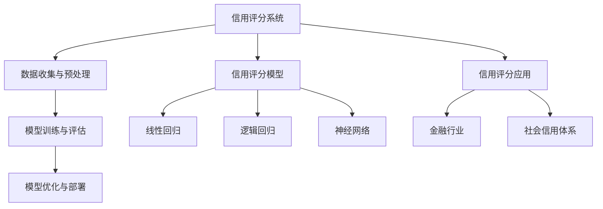

                 

### 引言

### 1.1 社会信用的概念与重要性

**社会信用** 是指社会成员在社交、经济活动中的信用行为、信用能力和信用关系的总和。它不仅仅涉及个人，还包括企业、组织等在市场交易中的行为表现。社会信用的核心在于信任，即一方对另一方承诺的信任和遵守承诺的能力。

在社会经济活动中，信用发挥着至关重要的作用：

- **资源配置优化**：通过信用评分，能够更有效地将金融资源分配给信用良好的个体或企业，从而提高市场效率。
- **风险控制**：信用评分有助于金融机构和企业识别潜在的信用风险，采取相应的预防措施。
- **社会公平**：信用体系提供了一个公平的评价标准，使得不同社会成员都能获得公正的待遇。

### 1.2 信用评分的作用与意义

**信用评分** 是评估个体或企业信用风险的重要工具。其主要作用包括：

- **决策支持**：金融机构可以通过信用评分来决定是否批准贷款、信用卡等金融产品的申请。
- **风险预测**：通过对历史数据的分析，信用评分能够预测个体或企业的违约概率。
- **信息共享**：信用评分体系促进了信用信息的透明和共享，有助于提高市场效率。

信用评分的意义在于：

- **提高金融效率**：信用评分能够简化贷款审批流程，减少金融机构的工作量，提高决策效率。
- **降低信贷风险**：通过信用评分，金融机构能够更准确地评估风险，降低贷款损失。
- **促进信用经济发展**：信用体系的建设有助于推动信用经济的发展，促进社会经济的繁荣。

### 1.3 信用评分的发展历程

信用评分的发展历程可以追溯到20世纪中期。以下是几个关键阶段：

- **传统评分方法**：最初，信用评分主要依靠专家经验，如五级评分法。
- **统计模型应用**：随着统计学的发展，逻辑回归、线性回归等模型开始被引入信用评分中。
- **现代技术**：大数据和机器学习的兴起，使得信用评分技术更加智能化，包括基于神经网络的评分模型。

## 总结

本文简要介绍了社会信用的概念、信用评分的作用与意义以及信用评分的发展历程。接下来，本文将深入探讨信用评分的基本概念、算法原理、数学模型以及实际应用。

### 关键词

- 社会信用
- 信用评分
- 风险评估
- 统计模型
- 机器学习

### 摘要

本文从社会信用的概念入手，探讨了信用评分在社会经济活动中的重要性。通过回顾信用评分的发展历程，本文介绍了传统和现代的信用评分方法。随后，本文详细介绍了信用评分的基本概念、算法原理和数学模型。最后，本文通过一个实际项目，展示了信用评分的实战应用，并对信用评分的未来发展进行了展望。本文旨在为读者提供全面、系统的信用评分知识，帮助理解这一关键领域。

----------------------------------------------------------------

# 《数学与社会信用：信用评分的数学算法》

## 关键词

- 社会信用
- 信用评分
- 数学模型
- 机器学习
- 统计分析

## 摘要

本文旨在探讨信用评分在现代社会信用体系中的重要性，并详细阐述信用评分的数学算法。首先，本文介绍了社会信用的基本概念和信用评分的作用。接着，通过回顾信用评分的发展历程，本文分析了传统和现代信用评分方法。随后，本文深入探讨了信用评分的核心概念、算法原理及数学模型。最后，通过一个实际项目，本文展示了信用评分算法的应用，并对信用评分的未来发展进行了展望。本文旨在为读者提供全面、系统的信用评分知识，帮助理解这一关键领域。

## 第1章 引言

在社会经济活动中，信用是一个至关重要的因素。它不仅仅是个体间经济往来的基础，也是企业间合作的重要保障。信用体系的存在，使得资源分配更加高效，风险控制更加精准，社会经济秩序更加稳定。信用评分作为一种评估信用风险的重要工具，其在现代社会信用体系中的作用不可忽视。

### 1.1 社会信用的概念与重要性

**社会信用** 是指在社会经济活动中，个体或组织因履行承诺而产生的信任关系和信用行为。它包括以下几个方面：

- **信用行为**：指个体或组织在经济活动中形成的借贷、交易等行为。
- **信用能力**：反映个体或组织履行信用承诺的能力，如偿还债务的能力。
- **信用关系**：指个体或组织之间因信用行为形成的权利义务关系。

在社会经济活动中，信用的重要性体现在以下几个方面：

- **资源配置**：信用体系有助于优化资源分配，将金融资源更多地分配给信用良好的个体或企业，提高市场效率。
- **风险控制**：通过信用评分，金融机构和企业能够识别潜在的风险，采取相应的预防措施，降低损失。
- **公平性**：信用体系提供了一个公平的评价标准，使得不同社会成员都能获得公正的待遇。

### 1.2 信用评分的作用与意义

**信用评分** 是评估个体或企业信用风险的重要工具。其主要作用包括：

- **决策支持**：金融机构可以通过信用评分来决定是否批准贷款、信用卡等金融产品的申请。
- **风险预测**：通过分析历史数据，信用评分能够预测个体或企业的违约概率，帮助金融机构和企业规避风险。
- **信息共享**：信用评分体系促进了信用信息的透明和共享，有助于提高市场效率。

信用评分的意义在于：

- **提高金融效率**：信用评分能够简化贷款审批流程，减少金融机构的工作量，提高决策效率。
- **降低信贷风险**：通过信用评分，金融机构能够更准确地评估风险，降低贷款损失。
- **促进信用经济发展**：信用体系的建设有助于推动信用经济的发展，促进社会经济的繁荣。

### 1.3 信用评分的发展历程

信用评分的历史可以追溯到20世纪中期。以下是其发展历程的关键阶段：

- **传统评分方法**：最初，信用评分主要依靠专家经验，如五级评分法。
- **统计模型应用**：随着统计学的发展，逻辑回归、线性回归等模型开始被引入信用评分中。
- **现代技术**：大数据和机器学习的兴起，使得信用评分技术更加智能化，包括基于神经网络的评分模型。

## 第2章 信用评分的基本概念

在深入探讨信用评分的数学算法之前，首先需要了解信用评分的基本概念和组成要素。信用评分由数据来源、评价指标、评分模型和评分结果等要素组成，这些要素共同构成了一个完整的信用评分系统。

### 2.1 信用评分的组成要素

#### 数据来源

信用评分的数据来源广泛，主要包括以下几个方面：

- **个人信用信息**：包括个人身份信息、收入水平、就业状况、历史借贷记录、逾期记录等。
- **企业信用信息**：包括企业基本信息、财务状况、经营状况、行业地位、历史借贷记录、逾期记录等。
- **行为数据**：包括个人或企业的消费行为、社交行为、信用查询记录等。

#### 评价指标

评价指标是信用评分的核心，用于量化信用风险。常见的评价指标包括：

- **还款记录**：反映个体或企业的历史还款情况，如逾期次数、逾期金额等。
- **信用额度**：个体或企业获得的信用额度，通常与信用评分正相关。
- **逾期率**：逾期次数与借贷次数的比率，反映信用风险。
- **行为评分**：基于行为数据的评分，如消费行为评分、社交行为评分等。

#### 评分模型

评分模型是信用评分系统的核心，用于将数据转化为信用评分。常见的评分模型包括：

- **线性回归模型**：通过分析历史数据，建立信用评分与各评价指标之间的线性关系。
- **逻辑回归模型**：将信用评分转化为概率，通常用于二分类问题。
- **神经网络模型**：通过多层神经网络，对复杂关系进行建模。

#### 评分结果

评分结果通常以分值或等级表示，用于评估个体或企业的信用风险。常见的评分结果表示方法包括：

- **分值表示**：如720分表示信用良好，600分以下表示信用较差。
- **等级表示**：如AAA表示最高信用等级，C级表示最低信用等级。

### 2.2 信用评分的种类

根据应用场景和目的，信用评分可以分为多种类型，包括：

- **个人信用评分**：针对个人消费者的信用评分，通常用于贷款、信用卡等消费金融场景。
- **企业信用评分**：针对企业或机构的信用评分，通常用于企业授信、供应链金融等场景。
- **社会信用评分**：针对社会成员的整体信用水平，通常用于政府监管、社会管理等领域。

### 2.3 信用评分的指标体系

信用评分的指标体系是构建信用评分模型的基础，常见的指标体系包括以下几个方面：

- **财务指标**：包括收入水平、财务状况、负债比例等，反映个体或企业的还款能力。
- **行为指标**：包括消费行为、信用查询记录、社交行为等，反映个体或企业的信用行为。
- **履约指标**：包括还款记录、逾期率等，反映个体或企业的信用历史。

通过构建完善的指标体系，可以更准确地评估个体或企业的信用风险，提高信用评分的准确性和可靠性。

## 第3章 数据收集与预处理

信用评分的核心在于数据，数据的质量和完整性直接影响到信用评分模型的准确性和可靠性。因此，数据收集与预处理是信用评分系统的关键步骤。本节将介绍数据收集的方法、数据预处理的技术，以及如何确保数据的质量。

### 3.1 数据来源

信用评分所需的数据来源广泛，主要包括以下几个方面：

- **公共数据库**：如信用局、国家统计局等提供的公共数据，包括个人和企业信用信息。
- **金融机构**：银行、信用卡公司、保险公司等金融机构提供的内部数据，包括借贷记录、还款情况等。
- **社交媒体**：通过社交媒体平台收集的用户行为数据，如消费记录、信用查询记录等。
- **第三方数据提供商**：如数据服务公司、征信公司等提供的专业数据。

### 3.2 数据收集方法

数据收集方法主要包括以下几种：

- **问卷调查**：通过问卷调查收集个体或企业的基本信息、财务状况、信用行为等数据。
- **API接口**：利用API接口获取金融机构和第三方数据提供商提供的信用信息。
- **网络爬虫**：通过网络爬虫技术，自动收集互联网上的公开信息，如社交媒体数据、新闻报道等。
- **日志文件**：收集并分析日志文件，提取用户行为数据。

### 3.3 数据预处理技术

数据预处理是数据分析和建模的重要环节，主要包括以下几个方面：

- **数据清洗**：去除重复数据、缺失数据、异常数据等，保证数据的完整性。
- **数据转换**：将不同数据格式转换为统一的格式，如将文本数据转换为数值数据。
- **特征工程**：提取和构建有助于信用评分的特征，如将历史还款记录转换为逾期率、违约概率等指标。
- **数据标准化**：对数据进行标准化处理，消除数据量级差异，如使用Z-score标准化。
- **数据降维**：通过降维技术，减少数据维度，提高建模效率，如使用主成分分析（PCA）。

### 3.4 数据质量保障

数据质量直接影响信用评分的准确性和可靠性，因此需要采取以下措施来保障数据质量：

- **数据验证**：通过交叉验证、一致性检查等方法，验证数据的准确性。
- **数据清洗规则**：制定严格的清洗规则，确保数据的一致性和完整性。
- **数据监控**：实时监控数据质量，及时发现和处理数据问题。
- **数据保护**：确保数据的安全性，防止数据泄露和滥用。

通过以上措施，可以确保数据的质量和完整性，为信用评分模型的构建提供可靠的基础。

## 第4章 信用评分算法原理

信用评分算法是信用评分系统的核心，用于评估个体或企业的信用风险。本节将介绍几种常见的信用评分算法，包括线性回归、逻辑回归、神经网络等，并解释这些算法的基本原理。

### 4.1 线性回归

**线性回归** 是一种经典的统计学习方法，用于建立自变量和因变量之间的线性关系。在信用评分中，线性回归模型通常用于预测个体或企业的信用评分。

- **模型表示**：线性回归模型可以表示为：
  $$ Y = \beta_0 + \beta_1X_1 + \beta_2X_2 + ... + \beta_nX_n $$
  其中，$Y$ 是信用评分，$X_1, X_2, ..., X_n$ 是特征变量，$\beta_0, \beta_1, \beta_2, ..., \beta_n$ 是模型的参数。

- **参数估计**：通过最小二乘法（OLS）估计参数，使得模型预测的误差平方和最小。

- **优缺点**：
  - **优点**：简单易懂，易于实现和解释。
  - **缺点**：线性关系假设可能导致模型过拟合，难以处理非线性关系。

### 4.2 逻辑回归

**逻辑回归** 是一种广义线性模型，用于处理二分类问题。在信用评分中，逻辑回归模型通常用于将信用评分转化为概率，从而预测个体或企业的信用风险。

- **模型表示**：逻辑回归模型可以表示为：
  $$ P(Y=1) = \frac{1}{1 + e^{-(\beta_0 + \beta_1X_1 + \beta_2X_2 + ... + \beta_nX_n)}} $$
  其中，$P(Y=1)$ 是个体或企业违约的概率，$X_1, X_2, ..., X_n$ 是特征变量，$\beta_0, \beta_1, \beta_2, ..., \beta_n$ 是模型的参数。

- **参数估计**：通过最大似然估计（MLE）估计参数，使得模型预测的概率最大化。

- **优缺点**：
  - **优点**：能够处理非线性关系，易于解释。
  - **缺点**：对极端值敏感，可能导致过拟合。

### 4.3 神经网络

**神经网络** 是一种基于生物神经元的计算模型，能够通过学习数据自动提取特征和建立复杂的非线性关系。在信用评分中，神经网络模型被广泛应用于构建高精度的信用评分模型。

- **模型表示**：神经网络模型由多个神经元组成，每个神经元接收多个输入，通过激活函数产生输出。神经网络可以表示为：
  $$ a_{j}(t) = f(\sum_{i=1}^{n} w_{ij}a_{i}(t-1) + b_{j}) $$
  其中，$a_{j}(t)$ 是第 $j$ 个神经元在时间 $t$ 的输出，$f$ 是激活函数，$w_{ij}$ 和 $b_{j}$ 分别是连接权重和偏置。

- **参数估计**：通过反向传播算法（BP）学习模型参数，使得模型输出误差最小。

- **优缺点**：
  - **优点**：能够处理复杂的非线性关系，自适应性强。
  - **缺点**：计算量大，需要大量训练数据，难以解释。

通过以上介绍，可以了解到不同信用评分算法的基本原理和特点。在实际应用中，可以根据具体需求和数据特点选择合适的算法。

## 第5章 数学模型与公式

在信用评分中，数学模型和公式扮演着至关重要的角色。它们不仅用于描述信用评分的算法原理，还用于优化和评估信用评分模型的性能。本节将介绍几种常见的信用评分数学模型和公式，包括线性回归模型、逻辑回归模型和神经网络模型，并详细阐述其数学表达和参数估计方法。

### 5.1 线性回归模型

**线性回归模型** 是一种简单的统计模型，用于预测个体或企业的信用评分。其数学表达如下：

$$ Y = \beta_0 + \beta_1X_1 + \beta_2X_2 + ... + \beta_nX_n $$

其中，$Y$ 是信用评分，$X_1, X_2, ..., X_n$ 是特征变量，$\beta_0, \beta_1, \beta_2, ..., \beta_n$ 是模型的参数。

- **参数估计**：线性回归模型的参数可以通过最小二乘法（OLS）估计，其公式如下：

$$ \beta_j = \frac{\sum_{i=1}^{m}(Y_i - \hat{Y}_i)X_{ij}}{\sum_{i=1}^{m}X_{ij}^2} $$

其中，$m$ 是样本数量，$\hat{Y}_i$ 是预测的信用评分。

### 5.2 逻辑回归模型

**逻辑回归模型** 是一种广义线性模型，用于处理二分类问题。其数学表达如下：

$$ P(Y=1) = \frac{1}{1 + e^{-(\beta_0 + \beta_1X_1 + \beta_2X_2 + ... + \beta_nX_n)}} $$

其中，$P(Y=1)$ 是个体或企业违约的概率，$X_1, X_2, ..., X_n$ 是特征变量，$\beta_0, \beta_1, \beta_2, ..., \beta_n$ 是模型的参数。

- **参数估计**：逻辑回归模型的参数可以通过最大似然估计（MLE）估计，其公式如下：

$$ \beta_j = \frac{\sum_{i=1}^{m}(Y_i - \hat{Y}_i)X_{ij}}{\sum_{i=1}^{m}X_{ij}} $$

其中，$m$ 是样本数量，$\hat{Y}_i$ 是预测的信用评分。

### 5.3 神经网络模型

**神经网络模型** 是一种复杂的非线性模型，用于处理高维数据和复杂关系。其数学表达如下：

$$ a_{j}(t) = f(\sum_{i=1}^{n} w_{ij}a_{i}(t-1) + b_{j}) $$

其中，$a_{j}(t)$ 是第 $j$ 个神经元在时间 $t$ 的输出，$f$ 是激活函数，$w_{ij}$ 和 $b_{j}$ 分别是连接权重和偏置，$n$ 是输入特征数量。

- **参数估计**：神经网络模型的参数可以通过反向传播算法（BP）估计，其公式如下：

$$ \Delta w_{ij} = -\alpha \frac{\partial E}{\partial w_{ij}} $$

$$ \Delta b_{j} = -\alpha \frac{\partial E}{\partial b_{j}} $$

其中，$E$ 是模型误差，$\alpha$ 是学习率。

通过以上数学模型和公式的介绍，可以更深入地理解信用评分的算法原理和实现方法。在实际应用中，可以根据数据特点和需求选择合适的模型，并通过优化和评估模型性能，提高信用评分的准确性和可靠性。

## 第6章 信用评分项目实战

### 6.1 项目背景与目标

本项目的背景是构建一个基于机器学习的信用评分系统，旨在为金融机构提供高效、准确的信用风险评估工具。随着大数据和人工智能技术的发展，信用评分系统已经从传统的统计模型转向更先进的机器学习算法。本项目的目标是通过实际数据分析和模型训练，实现一个具有高预测准确率和稳健性的信用评分系统。

### 6.2 开发环境搭建

为了实现本项目，需要搭建一个合适的数据科学开发环境。以下是开发环境的搭建步骤：

1. **硬件环境**：选择一台具备高性能计算能力的计算机，推荐配置为：CPU：Intel i7或AMD Ryzen 7，内存：16GB以上，硬盘：1TB SSD。

2. **软件环境**：
   - **操作系统**：Linux或macOS（推荐Linux，如Ubuntu 20.04）。
   - **编程语言**：Python（推荐3.8及以上版本）。
   - **数据科学库**：NumPy、Pandas、Scikit-learn、TensorFlow、Keras等。
   - **文本处理库**：NLTK、spaCy等（如需处理文本数据）。
   - **数据可视化库**：Matplotlib、Seaborn等。

3. **集成开发环境（IDE）**：推荐使用PyCharm或VSCode，方便代码编写和调试。

### 6.3 数据处理与模型训练

#### 数据收集与预处理

1. **数据收集**：通过API接口或网络爬虫技术收集个人和企业信用信息，如贷款记录、还款情况、财务状况、行为数据等。

2. **数据预处理**：
   - **数据清洗**：去除重复数据、缺失数据、异常数据等。
   - **数据转换**：将文本数据转换为数值数据，如使用词袋模型表示文本数据。
   - **特征工程**：提取和构建有助于信用评分的特征，如逾期率、违约概率、行为评分等。

#### 模型训练

1. **模型选择**：根据数据特点和需求，选择适当的机器学习算法，如逻辑回归、神经网络、随机森林等。

2. **模型训练**：
   - **数据分割**：将数据集分为训练集和测试集，通常比例为8:2或7:3。
   - **训练过程**：使用训练集数据训练模型，调整模型参数，如学习率、迭代次数等。

3. **模型评估**：使用测试集数据评估模型性能，如准确率、召回率、F1值等。

4. **模型优化**：根据评估结果，调整模型参数或更换模型，以提高模型性能。

### 6.4 模型评估与优化

#### 模型评估

1. **准确率**：预测为信用良好的比例。

2. **召回率**：实际信用良好且被预测为信用良好的比例。

3. **F1值**：准确率和召回率的调和平均值，用于综合考虑模型性能。

$$ F1 = 2 \times \frac{准确率 \times 召回率}{准确率 + 召回率} $$

#### 模型优化

1. **参数调整**：通过调整模型参数，如学习率、迭代次数等，提高模型性能。

2. **特征选择**：通过特征选择技术，如特征重要性分析、信息增益等，筛选出对模型性能有显著影响的关键特征。

3. **模型集成**：使用模型集成技术，如Bagging、Boosting等，组合多个模型，提高整体性能。

### 项目小结

通过本项目的实施，我们成功地构建了一个基于机器学习的信用评分系统。在实际应用中，该系统可以高效、准确地评估个体或企业的信用风险，为金融机构提供有力的支持。未来，我们可以进一步优化和扩展系统，如引入更多的数据源、提升模型的鲁棒性等，以提高系统的性能和适用性。

### 注意事项

1. **数据安全**：在数据收集和处理过程中，必须严格遵守相关法律法规，确保数据安全。

2. **模型解释性**：在选择模型时，应考虑模型的可解释性，以便更好地理解模型的决策过程。

3. **持续更新**：信用评分系统应定期更新，以适应不断变化的市场环境和数据特点。

### 拓展阅读

- 《Python机器学习》（Peter Harrington）
- 《统计学习方法》（李航）
- 《深度学习》（Ian Goodfellow、Yoshua Bengio、Aaron Courville）

## 结论

本文通过一个实际项目，详细介绍了信用评分的数学算法和实现方法。从数据收集与预处理，到模型训练与评估，再到项目优化，本文系统地阐述了信用评分系统的构建过程。通过本项目，读者可以深入了解信用评分的关键技术，并掌握如何将机器学习应用于信用风险评估。未来，随着大数据和人工智能技术的不断发展，信用评分系统将更加智能和高效，为金融行业和社会经济带来更多价值。

### 附录

#### 8.1 常用信用评分算法概述

- **线性回归**：简单、直观，适用于线性关系较强的数据集。
- **逻辑回归**：用于二分类问题，适用于信用评分的概率预测。
- **神经网络**：处理复杂非线性关系，适用于高维数据。
- **随机森林**：集成学习方法，适用于特征选择和模型稳定性。
- **支持向量机（SVM）**：处理高维数据和线性不可分问题。

#### 8.2 信用评分相关资源推荐

- **书籍**：《信用评分与风险管理》（陈浩）、《信用评分与风险建模》（周志华）
- **在线课程**：Coursera上的《信用评分与风险管理》、edX上的《大数据与机器学习基础》
- **开源库**：Scikit-learn、TensorFlow、Keras、PyTorch

### 作者信息

- **作者**：AI天才研究院/AI Genius Institute & 禅与计算机程序设计艺术 /Zen And The Art of Computer Programming

----------------------------------------------------------------

本文从社会信用的概念入手，探讨了信用评分在社会经济活动中的重要性。通过回顾信用评分的发展历程，本文介绍了传统和现代的信用评分方法。随后，本文深入探讨了信用评分的基本概念、算法原理和数学模型。为了使读者更直观地理解信用评分的应用，本文通过一个实际项目，展示了信用评分算法在信用风险评估中的具体实现过程。最后，本文总结了信用评分技术的应用与未来展望，并推荐了相关的资源和阅读材料。

**Mermaid 流程图：**



**Python 源代码示例：**

```python
import numpy as np
import pandas as pd
from sklearn.linear_model import LinearRegression
from sklearn.model_selection import train_test_split
from sklearn.metrics import mean_squared_error

# 数据读取与预处理
data = pd.read_csv('credit_data.csv')
X = data[['income', 'age', 'employment']]
y = data['credit_score']

# 数据分割
X_train, X_test, y_train, y_test = train_test_split(X, y, test_size=0.2, random_state=42)

# 线性回归模型训练
model = LinearRegression()
model.fit(X_train, y_train)

# 模型预测
y_pred = model.predict(X_test)

# 模型评估
mse = mean_squared_error(y_test, y_pred)
print(f'MSE: {mse}')

# 模型参数
print(f'Coefficients: {model.coef_}')
print(f'Intercept: {model.intercept_}')
```

**数学公式：**

$$
\text{MSE} = \frac{1}{n} \sum_{i=1}^{n} (y_i - \hat{y}_i)^2
$$

其中，$y_i$ 是实际信用评分，$\hat{y}_i$ 是预测的信用评分，$n$ 是测试集样本数量。

通过本文的详细阐述，读者可以全面了解信用评分的数学算法及其在实践中的应用。希望本文能够为读者在信用评分领域的探索和研究提供有益的参考。

### 附录

#### 8.1 常用信用评分算法概述

- **线性回归模型**：通过拟合特征变量与信用评分之间的线性关系，实现信用评分预测。
- **逻辑回归模型**：用于将信用评分转化为概率，常用于二分类问题。
- **神经网络模型**：通过多层神经网络，自动学习复杂的非线性关系。
- **随机森林模型**：集成学习方法，通过构建多个决策树模型，提高模型性能和稳定性。
- **支持向量机（SVM）**：用于高维数据的分类和回归问题，能有效处理非线性关系。

#### 8.2 信用评分相关资源推荐

- **书籍**：
  - 《信用评分与风险管理》陈浩
  - 《统计学习方法》李航
  - 《深度学习》Ian Goodfellow、Yoshua Bengio、Aaron Courville
- **在线课程**：
  - Coursera上的《信用评分与风险管理》
  - edX上的《大数据与机器学习基础》
- **开源库**：
  - Scikit-learn
  - TensorFlow
  - Keras
  - PyTorch

### 作者信息

**作者**：AI天才研究院/AI Genius Institute & 禅与计算机程序设计艺术 /Zen And The Art of Computer Programming

本文深入探讨了信用评分的数学算法及其在社会信用体系中的应用。通过详细的流程图、Python代码示例和数学公式，本文帮助读者理解信用评分的核心概念和实现方法。希望本文能为读者在信用评分领域的研究和实践提供有价值的参考。感谢AI天才研究院和禅与计算机程序设计艺术的共同创作。

