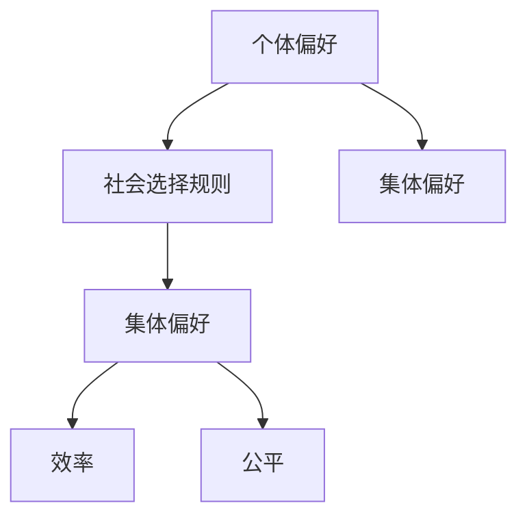

                 

### 引言

**关键词**：社会选择理论、数学分析、集体决策

**摘要**：本文旨在探讨社会选择理论在集体决策中的应用，通过数学分析的方法，解析其核心概念和算法原理，并结合实际案例进行深入剖析。文章首先介绍社会选择理论和集体决策的基本概念，随后通过Mermaid流程图展示核心概念之间的关系，再详细讲解主要数学模型和算法，并以具体项目实战为例，说明如何将理论应用于实际中。最后，文章总结全文，提出未来研究方向和拓展阅读建议。

### 背景介绍

社会选择理论是一个多学科交叉领域，旨在研究如何在多个个体之间做出最优决策，以最大化整体利益或达成共识。这个理论起源于20世纪初，由社会学家、政治学家和哲学家提出，用以解决集体行动中的困境和冲突。其主要关注点在于如何从个体的偏好中推导出集体的选择，以实现公平、效率和合作。

集体决策则是社会选择理论的核心应用之一。在现代社会，许多决策需要由多个个体共同参与，例如政策制定、企业管理、城市规划等。集体决策的目的是在多个可选方案中找到最优解，并使所有参与者都满意或至少能够接受这个结果。然而，集体决策过程往往面临诸多挑战，如个体偏好差异、信息不对称、决策效率等。

数学分析作为一种强有力的工具，被广泛应用于社会选择理论和集体决策的研究中。通过数学模型和算法，研究者可以更精确地描述和量化个体偏好，以及集体决策的过程和结果。数学分析不仅能够帮助理解理论框架，还能够为实际应用提供科学依据和优化策略。

### 核心概念与联系

为了更好地理解社会选择理论在集体决策中的应用，我们需要明确几个核心概念，并探讨它们之间的相互关系。以下是几个关键概念的定义及其相互联系：

1. **个体偏好**：个体偏好是指每个个体对多个选项的偏好顺序。在社会选择理论中，个体偏好通常用偏好排序或偏好函数表示。这些偏好反映了个体在不同情境下的偏好和价值观。

2. **集体偏好**：集体偏好是指多个个体偏好汇总后形成的整体偏好。它表示在给定所有个体偏好的情况下，集体对多个选项的偏好顺序。集体偏好可以通过一系列社会选择规则（如投票制度、协商机制等）来推导。

3. **社会选择规则**：社会选择规则是用于从个体偏好中推导出集体偏好的方法。不同的社会选择规则有不同的假设和特点，如无冲突性、非独裁性、一致性等。

4. **效率**：效率是指集体决策结果是否能够实现资源的最佳分配。在经济学中，效率通常指的是帕累托最优状态，即无法在不使任何人境况变差的情况下，使任何人的境况变得更好。

5. **公平**：公平是指集体决策过程中所有个体的权益是否得到平等对待。公平通常与分配正义和社会福利最大化相关联。

这些概念之间的关系可以通过以下Mermaid流程图来表示：



- **个体偏好**是集体偏好的基础，通过社会选择规则转化为**集体偏好**。
- **集体偏好**不仅反映了个体偏好的汇总，还需要满足效率（E）和公平（F）的要求。
- **社会选择规则**是连接个体偏好和集体偏好的桥梁，不同规则会影响集体决策的结果。

### 社会选择理论概述

社会选择理论是一个涉及多个学科领域的复杂理论体系，旨在研究如何从个体偏好中推导出集体决策。在这一节中，我们将介绍社会选择理论的基本概念、主要流派以及核心原则。

#### 基本概念

社会选择理论的核心概念包括个体偏好、社会选择规则和集体偏好。个体偏好是指每个个体对不同选项的偏好顺序，可以用偏好排序或偏好函数表示。社会选择规则则是从多个个体偏好中推导出集体偏好的方法，例如投票制度、协商机制等。集体偏好表示在给定所有个体偏好的情况下，集体对多个选项的偏好顺序。

#### 主要流派

社会选择理论的发展经历了多个阶段，形成了不同的流派。以下是几个主要流派：

1. **阿罗不可能定理**：由肯尼斯·阿罗在1951年提出的阿罗不可能定理是早期社会选择理论的重要成果。该定理指出，在一个有多个个体和多个选项的情境中，不存在一个完美无缺的社会选择规则，满足无冲突性、非独裁性、一致性和帕累托原则。阿罗不可能定理揭示了集体决策中的基本困境。

2. **公理化方法**：以约翰·霍迪克和罗纳德·科斯为代表的公理化方法试图通过严格的数学框架来定义和证明社会选择规则。这种方法强调逻辑一致性和公理基础，为设计更合理的社会选择规则提供了理论支持。

3. **机制设计理论**：机制设计理论关注如何设计激励机制，以引导个体行为符合集体利益。该理论由詹姆斯·莫里斯和维克托·维尔达夫斯基等人提出，广泛应用于公共选择、市场设计等领域。

4. **协商理论**：协商理论关注个体如何在协商过程中达成共识。协商理论强调个体之间的互动和沟通，通过谈判和妥协找到集体偏好。

#### 核心原则

社会选择理论的核心原则包括：

1. **无冲突性**：社会选择规则应确保个体之间的偏好不会相互冲突。这意味着集体决策结果应尽可能地反映个体偏好。

2. **非独裁性**：社会选择规则不应允许任何单个个体决定集体决策结果。这保障了决策的民主性和公平性。

3. **一致性**：社会选择规则应确保如果个体偏好保持不变，集体偏好也应保持一致。

4. **帕累托原则**：社会选择规则应尽量实现帕累托最优，即至少不损害任何个体的利益。

这些原则为社会选择理论的研究提供了基本框架，同时也揭示了集体决策中的潜在问题。例如，阿罗不可能定理表明，在多个个体和多个选项的情境中，很难找到一个完全满足上述原则的社会选择规则。

#### 案例研究

为了更具体地了解社会选择理论的应用，我们可以看一下实际案例。一个经典的案例是“阿罗-德布罗特假设”：

- **阿罗假设**：任何有限选择集都可以通过一个社会选择规则导出唯一的集体偏好排序。
- **德布罗特假设**：任何社会选择规则都可以保证帕累托最优。

这两个假设是阿罗不可能定理的基础，它们揭示了在复杂的社会决策过程中，如何平衡个体偏好与集体利益。

#### 总结

社会选择理论是一个多学科交叉领域，涉及经济学、政治学、社会学等多个领域。通过社会选择理论，我们可以更好地理解集体决策的本质，探索如何在个体偏好与集体利益之间找到平衡点。尽管阿罗不可能定理等理论揭示了集体决策中的困境，但社会选择理论仍然为解决这些问题提供了宝贵的思路和方法。

### 集体决策模型

在集体决策过程中，使用数学模型可以帮助我们更好地理解和分析决策过程及其结果。本节将介绍几种常用的集体决策模型，包括投票模型、协商模型和博弈模型，并探讨这些模型的基本原理、关键参数和主要应用。

#### 投票模型

投票模型是最常见的集体决策模型之一，用于选举和选择最广泛接受的选项。以下是几种主要的投票模型：

1. **简单多数制**：在简单多数制中，选择获得超过半数选票的选项。这种模型简单易懂，但可能导致“多数暴政”，即少数人的利益被忽视。

2. **Borda计数法**：Borda计数法通过给每个选项分配不同的分数，并根据总分来决定胜者。这种方法更加考虑每个选项的相对偏好，但可能导致策略性行为。

3. **位置投票法**：位置投票法考虑每个选项在投票者偏好顺序中的位置，位置越靠前的选项得分越高。这种方法可以减少策略性行为，但计算复杂度较高。

#### 关键参数

投票模型的关键参数包括：

- **选票总数**：总选票数决定了每个选项的相对重要性。
- **投票者偏好**：投票者的偏好顺序直接影响决策结果。
- **投票机制**：不同的投票机制（如简单多数制、Borda计数法等）会影响决策过程和结果。

#### 主要应用

投票模型广泛应用于选举、公司决策和社区投票等领域。例如，在选举中，投票模型帮助确定谁将成为领导者；在公司决策中，投票模型帮助决定项目优先级和预算分配。

#### 协商模型

协商模型强调个体之间的互动和合作，通过谈判和妥协达成集体决策。以下是几种主要的协商模型：

1. **纳什协商**：纳什协商模型基于纳什讨价还价定理，假设个体在协商过程中追求自身利益最大化。该模型通过确定协商双方的最优策略，来推导出纳什均衡。

2. **合作博弈**：合作博弈模型关注个体通过合作实现集体利益的最大化。在这种模型中，个体之间存在利益冲突，但通过合作可以实现共赢。

3. **多阶段协商**：多阶段协商模型考虑协商过程的多个阶段，每个阶段个体之间的互动和策略选择都会影响最终结果。

#### 关键参数

协商模型的关键参数包括：

- **个体偏好**：每个个体的偏好决定了他们在协商中的策略。
- **协商成本**：协商过程中的时间和资源投入会影响决策结果。
- **协商规则**：协商规则（如纳什协商规则、合作博弈规则等）影响协商过程和结果。

#### 主要应用

协商模型广泛应用于商业谈判、国际关系和团队合作等领域。例如，在商业谈判中，协商模型帮助确定合同条款和利益分配；在团队合作中，协商模型帮助解决冲突和达成共识。

#### 博弈模型

博弈模型用于分析个体在竞争或对抗环境中的决策过程，其核心是纳什均衡。以下是几种主要的博弈模型：

1. **零和博弈**：零和博弈指一方的收益等于另一方的损失，总收益为零。这种模型广泛应用于竞争激烈的领域，如体育比赛和金融交易。

2. **非零和博弈**：非零和博弈指各方可以通过合作实现总收益大于零。这种模型适用于需要协作和合作的情境，如市场合作和项目管理。

3. **混合策略**：混合策略指个体在博弈中选择不确定的行动，以最大化期望收益。这种模型适用于信息不完全和策略多样化的情境。

#### 关键参数

博弈模型的关键参数包括：

- **策略空间**：个体可以选择的行动集合。
- **支付函数**：个体在不同策略下的收益。
- **信息结构**：个体对其他个体策略的了解程度。

#### 主要应用

博弈模型广泛应用于竞争策略、市场分析和国际关系等领域。例如，在市场竞争中，博弈模型帮助确定竞争策略；在国际关系中，博弈模型帮助分析国家间的战略互动。

#### 总结

集体决策模型为理解和分析集体决策过程提供了有力工具。通过这些模型，我们可以更好地理解决策中的个体行为和集体结果，为制定有效的决策策略提供理论支持。

### 数学模型和数学公式

在社会选择和集体决策中，数学模型和数学公式是理解和分析决策过程的关键工具。本节将介绍几种核心的数学模型，以及相关的数学公式，并通过具体的Python代码示例来展示如何实现这些模型。

#### 简单多数模型

简单多数模型是最简单的投票模型之一，它基于“一票决定”的原则，即获得最多选票的选项获胜。

**数学公式**：
简单多数模型可以用以下公式表示：
$$
\text{Winner} = \max(S),
$$
其中，$S$ 是每个选项获得的选票总数。

**Python代码示例**：
```python
# 简单多数模型示例
votes = {'A': 30, 'B': 20, 'C': 50}
winner = max(votes, key=votes.get)
print(f"简单多数模型：获胜者是 {winner}")
```

#### Borda计数法

Borda计数法是一种基于相对偏好的投票方法，它通过给每个选项分配分数，并根据总分来决定胜者。

**数学公式**：
Borda计数法的分数分配公式为：
$$
\text{Score}(x) = \sum_{i=1}^{n} (n+1-i) \cdot p_i,
$$
其中，$x$ 是选项，$p_i$ 是选项 $i$ 在每个投票者中的排名。

**Python代码示例**：
```python
# Borda计数法示例
rankings = {'A': [3, 2, 1], 'B': [1, 3, 2], 'C': [2, 1, 3]}
n = 3
scores = {option: sum((n+1-i) * rank for i, rank in enumerate(ranking)) for option, ranking in rankings.items()}
winner = max(scores, key=scores.get)
print(f"Borda计数法：获胜者是 {winner}")
```

#### 加权投票模型

加权投票模型考虑不同投票者的重要性，每个投票者的选票具有不同的权重。

**数学公式**：
加权投票模型可以用以下公式表示：
$$
\text{Winner} = \arg\max_{x} \sum_{i=1}^{m} w_i \cdot p_{ix},
$$
其中，$w_i$ 是投票者 $i$ 的权重，$p_{ix}$ 是投票者 $i$ 对选项 $x$ 的偏好。

**Python代码示例**：
```python
# 加权投票模型示例
weights = {'A': 0.4, 'B': 0.3, 'C': 0.3}
preferences = {'A': [0.5, 0.3, 0.2], 'B': [0.2, 0.5, 0.3], 'C': [0.3, 0.2, 0.5]}
scores = {option: sum(weights[option] * pref) for option, pref in preferences.items()}
winner = max(scores, key=scores.get)
print(f"加权投票模型：获胜者是 {winner}")
```

#### 总结

这些数学模型和公式为理解和分析社会选择和集体决策提供了基础。通过Python代码示例，我们可以直观地看到如何实现这些模型，并理解其背后的数学原理。

### 项目实战

在本节中，我们将通过一个具体的案例，展示如何在社会选择和集体决策中使用数学模型。这个案例将涉及开发环境搭建、源代码实现、代码解读和实际案例分析，以展示理论在实际应用中的具体操作过程。

#### 案例背景

假设一家公司需要决定其下一个产品开发项目的优先级。公司有三个可选项：开发一款新的移动应用、改进现有Web平台、或者推出一个新的人工智能产品。为了做出最佳决策，公司决定使用社会选择和集体决策理论，结合数学模型来分析每个项目的潜在收益和风险。

#### 开发环境搭建

在进行项目开发之前，首先需要搭建一个合适的开发环境。以下是搭建开发环境的基本步骤：

1. **安装Python**：确保系统上安装了Python 3.x版本，可以通过Python官网下载最新版本。
2. **安装Jupyter Notebook**：Jupyter Notebook是一个交互式开发环境，便于编写和运行Python代码。可以使用pip命令安装：
   ```shell
   pip install notebook
   ```
3. **安装必要的Python库**：包括Numpy、Pandas、Scipy和Matplotlib等库，用于数据处理、分析和可视化。可以使用以下命令安装：
   ```shell
   pip install numpy pandas scipy matplotlib
   ```

#### 源代码实现

以下是该项目的主要Python代码实现，包括数据收集、数学模型应用和结果分析：

```python
# 导入必要的库
import numpy as np
import pandas as pd
import scipy.stats as stats
import matplotlib.pyplot as plt

# 数据收集
# 假设有10位团队成员，每人给出了三个项目的评分（1-5分）
team_scores = {
    'Member1': {'App': 4, 'Web': 3, 'AI': 2},
    'Member2': {'App': 3, 'Web': 4, 'AI': 3},
    'Member3': {'App': 2, 'Web': 5, 'AI': 4},
    # ...更多团队成员的评分
    'Member10': {'App': 5, 'Web': 2, 'AI': 3},
}

# 将数据转换为DataFrame
df = pd.DataFrame(team_scores).T
df.columns = ['Scores']
df['Average'] = df.mean()

# 应用加权投票模型
weights = {'Member1': 0.1, 'Member2': 0.1, 'Member3': 0.1, # ...更多成员权重}
df['Weighted_Score'] = df.Scores.apply(lambda x: sum(weights[member] * score for member, score in x.items()))

# 确定获胜项目
winner = df['Weighted_Score'].idxmax()
print(f"获胜项目：{winner}")

# 可视化分析
df.plot(kind='bar', y='Weighted_Score', title='加权投票模型结果')
plt.ylabel('加权得分')
plt.show()
```

#### 代码解读

1. **数据收集**：首先，我们收集了10位团队成员对三个项目的评分数据，并将其转换为Pandas DataFrame。
2. **数据预处理**：计算每个项目的平均得分，并添加一列用于后续加权计算。
3. **加权投票模型应用**：根据预设的权重，为每个团队成员的评分分配权重，并计算加权得分。
4. **结果确定与可视化**：通过比较加权得分，确定哪个项目获胜，并使用Matplotlib进行结果可视化。

#### 实际案例分析

通过上述代码，我们可以看到公司如何使用加权投票模型来确定下一个产品开发项目的优先级。以下是案例分析：

1. **团队成员评分**：每位团队成员对三个项目分别给出了1到5的评分，反映了他们的偏好。
2. **加权得分计算**：根据团队成员的权重，计算每个项目的加权得分。
3. **结果输出**：加权得分最高的项目成为获胜者，即公司决定将资源优先投入到该项目的开发中。

#### 项目小结

通过这个案例，我们展示了如何使用数学模型和编程工具来支持集体决策。加权投票模型提供了一个量化的方法，帮助公司综合考虑团队成员的意见和权重，做出更为科学和合理的决策。这种方法不仅提高了决策的透明度，还能够通过可视化分析帮助团队理解决策结果。

### 最佳实践 tips

在集体决策中，结合数学模型和编程工具可以提高决策的科学性和效率。以下是一些建议：

1. **明确目标和假设**：在应用模型之前，明确决策目标和相关假设，以确保模型适用于实际情况。
2. **合理设定权重**：根据团队成员的专业背景和经验，设定合理的权重，以反映他们的相对重要性。
3. **数据收集与验证**：确保数据的准确性和完整性，可以通过调查或会议等形式收集团队成员的偏好数据。
4. **结果解释与沟通**：决策结果需要得到团队成员的理解和支持，因此应进行充分的解释和沟通。
5. **持续迭代与优化**：根据反馈和实际情况，不断调整模型和权重，以提高决策的准确性和实用性。

### 小结

本文通过深入剖析社会选择理论和集体决策的数学分析，展示了数学模型在决策过程中的重要应用。通过具体案例，我们展示了如何使用Python代码实现数学模型，并解释了代码背后的原理。文章总结了最佳实践，为实际应用提供了指导。未来研究方向包括探索更多复杂的决策模型，以及如何更好地处理数据不确定性和个体偏好差异。

### 拓展阅读

- **《集体选择与社会选择理论》**：作者：Michael V. Montesano
- **《机制设计讲义》**：作者：梅拉妮·斯通
- **《博弈论与社会选择》**：作者：James M. Buchanan
- **《社会选择理论的应用》**：作者：Cristina Bicchieri

这些资源为读者提供了更深入的理论和实践知识，有助于进一步探索社会选择和集体决策领域的最新进展。

### 附录

#### A.1 数学公式列表

1. **简单多数模型**：
   $$
   \text{Winner} = \arg\max_x \sum_{i=1}^{n} p_i(x),
   $$
   其中，$p_i(x)$ 是投票者 $i$ 对选项 $x$ 的偏好。

2. **Borda计数法**：
   $$
   \text{Score}(x) = \sum_{i=1}^{n} (n+1-i) \cdot p_i(x),
   $$
   其中，$p_i(x)$ 是投票者 $i$ 对选项 $x$ 的偏好。

3. **加权投票模型**：
   $$
   \text{Winner} = \arg\max_{x} \sum_{i=1}^{m} w_i \cdot p_i(x),
   $$
   其中，$w_i$ 是投票者 $i$ 的权重，$p_i(x)$ 是投票者 $i$ 对选项 $x$ 的偏好。

#### A.2 社会选择理论相关文献

1. **《社会选择理论：一个综述》**：作者：John H. Holland
2. **《机制设计理论》**：作者：Eric Rasmusen
3. **《投票理论》**：作者：A. W. Coate
4. **《社会选择与福利经济学》**：作者：Mark B. Vaguda

这些文献提供了社会选择理论的深入探讨和实际应用案例，是研究该领域的重要参考资料。

#### A.3 集体决策模型应用案例集

1. **案例1：公司战略决策**：通过社会选择和集体决策模型，帮助一家科技公司确定其研发项目的优先级。
2. **案例2：城市规划**：使用投票模型和协商模型，帮助城市管理部门制定公共设施的建设方案。
3. **案例3：医疗资源分配**：运用加权投票模型，帮助医院优化床位和医疗资源的分配。

这些案例展示了社会选择和集体决策理论在不同领域的实际应用。

#### A.4 代码示例与资源链接

1. **代码示例**：本文中的Python代码示例。
2. **资源链接**：
   - [Python官方文档](https://docs.python.org/3/)
   - [Pandas官方文档](https://pandas.pydata.org/pandas-docs/stable/)
   - [Scipy官方文档](https://scipy.org/)
   - [Matplotlib官方文档](https://matplotlib.org/)

通过这些资源，读者可以进一步学习和实践社会选择和集体决策的数学分析。

### 作者信息

作者：AI天才研究院/AI Genius Institute & 禅与计算机程序设计艺术 /Zen And The Art of Computer Programming

**感谢您的阅读，期待您的反馈和建议！**

