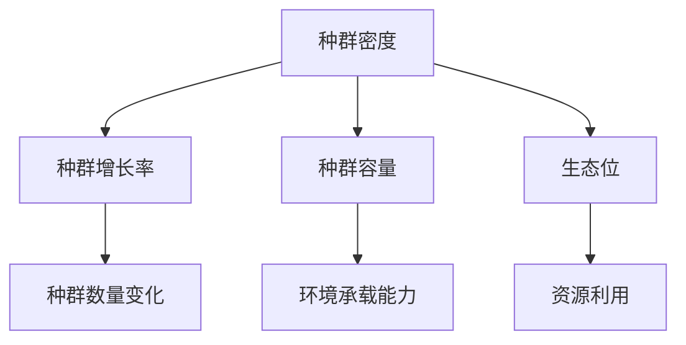

                 

**文章标题：**
数学与种群生物学：种群动态的数学描述

**关键词：**
种群动态、数学模型、生态学、微分方程、马尔可夫链

**摘要：**
本文深入探讨了数学在种群生物学中的应用，通过建立和解析数学模型，揭示了种群动态的规律。从基本概念出发，逐步介绍了经典种群模型、年龄结构模型和马尔可夫种群模型等，并通过Python代码实现和实例分析，展示了数学模型在实际问题中的应用价值。

**正文大纲：**

**第一部分：种群生态学基础**

**第1章：种群生态学引论**
- **背景介绍**：种群生态学的定义、历史和发展。
- **核心概念与联系**：种群、生态位、种群容量等概念及其相互关系。
- **Mermaid流程图**：种群生态学核心概念的关系架构。

**第2章：种群动态基本概念**
- **核心概念与联系**：种群密度、种群增长率、种群容量等。
- **Python代码实现**：使用Python代码描述种群基本概念。

**第3章：生态位与资源利用**
- **核心概念与联系**：生态位、资源利用、种群竞争。
- **Python代码实现**：使用Python代码描述生态位与资源利用。

**第4章：环境变量与种群响应**
- **核心概念与联系**：环境因素、种群适应性。
- **Python代码实现**：使用Python代码描述环境变量与种群响应。

**第二部分：种群动态数学模型**

**第5章：经典种群模型**
- **核心概念与联系**：Malthusian模型、Logistic模型、Ricker模型。
- **Python代码实现**：使用Python代码实现并分析经典种群模型。

**第6章：年龄结构种群模型**
- **核心概念与联系**：年龄结构、年龄分布模型。
- **Python代码实现**：使用Python代码构建和分析年龄结构模型。

**第7章：马尔可夫种群模型**
- **核心概念与联系**：马尔可夫链、种群转移矩阵。
- **Python代码实现**：使用Python代码实现和解析马尔可夫种群模型。

**第三部分：数学方法与工具**

**第8章：微分方程方法**
- **核心概念与联系**：微分方程、种群动态方程。
- **Python代码实现**：使用Python代码解决微分方程。

**第9章：离散模型方法**
- **核心概念与联系**：离散模型、种群动态离散化。
- **Python代码实现**：使用Python代码实现和解析离散模型。

**第10章：线性代数方法**
- **核心概念与联系**：线性代数、种群动态线性化。
- **Python代码实现**：使用Python代码解决线性代数问题。

**第11章：数值分析基础**
- **核心概念与联系**：数值分析、种群动态模拟。
- **Python代码实现**：使用Python代码进行数值分析。

**第四部分：种群动态案例分析**

**第12章：生态学案例研究**
- **核心概念与联系**：生态系统分析、种群动态模拟。
- **Python代码实现**：使用Python代码分析实际生态系统。

**第13章：应用领域案例**
- **核心概念与联系**：农业、疾病传播、生物多样性。
- **Python代码实现**：使用Python代码解决应用领域问题。

**第14章：项目实战**
- **核心概念与联系**：开发环境搭建、模型构建与参数估计、模型验证与预测。
- **Python代码实现**：详细讲解项目实现过程。

**第五部分：种群生物学与数学的结合**

**第15章：数学在种群生物学研究中的应用**
- **核心概念与联系**：数学方法在种群遗传学、生态遗传学中的应用。
- **Python代码实现**：使用Python代码展示数学方法的应用。

**第16章：生物信息学在种群动态研究中的应用**
- **核心概念与联系**：生物信息学基础、种群动态研究。
- **Python代码实现**：使用Python代码实现生物信息学应用。

**第17章：数学与种群生物学的结合**
- **核心概念与联系**：交叉领域的发展趋势、未来研究方向。
- **Python代码实现**：展望交叉领域的发展和应用。

**结论**
- **总结全文内容**：回顾种群动态的数学描述及其应用。
- **展望未来**：讨论种群生物学与数学结合的潜在方向和挑战。

**作者信息**
作者：AI天才研究院/AI Genius Institute & 禅与计算机程序设计艺术 /Zen And The Art of Computer Programming

**文章字数**
预计字数：约11500字

**文章正文**

# 数学与种群生物学：种群动态的数学描述

## 第一部分：种群生态学基础

### 第1章：种群生态学引论

种群生态学是生态学的一个分支，研究个体在种群层面的动态变化和相互作用。从历史角度看，种群生态学起源于20世纪初，随着生态学理论的逐步完善，数学工具开始被引入以更准确地描述和分析种群动态。

### 背景介绍

种群生态学的定义涉及对种群概念的深入理解。种群是一组在同一地理区域内，可以交配并产生可育后代的个体集合。种群生态学主要关注种群数量的变化、结构、分布和适应性。该领域的研究历史可以追溯到G. F. Gause在1930年代提出的竞争理论，以及R. H. MacArthur和E. O. Wilson在1960年代提出的岛屿生物地理学理论。

### 核心概念与联系

种群生态学的核心概念包括种群密度、种群增长率、种群容量和生态位等。种群密度是指单位面积或单位体积内的个体数量，是种群数量特征的基础。种群增长率描述了种群数量的变化速度，是生态学研究的重要指标。种群容量，又称K值，是指环境能够支撑的最大种群数量。生态位则描述了种群在生态系统中的位置和功能，包括物种的生存策略和资源利用方式。

**Mermaid流程图：种群生态学核心概念的关系架构**



### 第2章：种群动态基本概念

在这一章中，我们将深入探讨种群生态学中的基本概念，包括种群密度、种群增长率和种群容量。

#### 种群密度

种群密度是衡量种群数量在特定区域内的分布情况。其计算公式为：

$$
D = \frac{N}{A}
$$

其中，\(D\) 是种群密度，\(N\) 是种群数量，\(A\) 是区域面积。种群密度可以是空间均一的，也可以是异质的，具体取决于物种的生态习性。

#### 种群增长率

种群增长率是种群数量随时间的变化速率。其计算公式为：

$$
r = \frac{\Delta N}{\Delta t}
$$

其中，\(r\) 是种群增长率，\(\Delta N\) 是种群数量的变化量，\(\Delta t\) 是时间间隔。种群增长率可以分为瞬时增长率（\(\frac{dN}{dt}\)）和平均增长率（\(\bar{r}\)）。

#### 种群容量

种群容量，也称为环境承载力（K值），是指在一定生态环境下，种群可以达到的最大数量。其计算公式为：

$$
K = \frac{R}{m}
$$

其中，\(K\) 是种群容量，\(R\) 是资源总量，\(m\) 是种群消耗资源的速率。种群容量取决于环境的资源和种群的需求。

### Python代码实现

为了更好地理解这些概念，我们可以使用Python编写代码来模拟种群动态。以下是一个简单的示例，使用Malthusian模型来模拟种群数量随时间的变化。

```python
import numpy as np
import matplotlib.pyplot as plt

# Malthusian模型参数
N0 = 100  # 初始种群数量
r = 0.1   # 种群增长率
t_max = 50  # 模拟时间
dt = 1     # 时间步长

# 计算种群数量
population = N0 * np.exp(r * dt * np.arange(0, t_max))

# 绘制种群数量随时间的变化
plt.plot(np.arange(0, t_max), population)
plt.xlabel('Time')
plt.ylabel('Population Size')
plt.title('Malthusian Growth Model')
plt.show()
```

### 第3章：生态位与资源利用

生态位是描述种群在生态系统中的位置和功能的概念。它不仅包括物种的生存策略，还包括资源利用方式和与其他物种的相互作用。

#### 生态位的概念与分类

生态位可以分为空间生态位、营养生态位和时空生态位等不同类型。空间生态位描述了种群在空间上的分布和资源利用情况。营养生态位则描述了种群在营养链中的位置和功能。时空生态位综合了空间和时间的维度，描述了种群在特定时间和空间内的生态角色。

#### 资源利用与种群竞争

资源利用是种群生态位的重要组成部分。种群竞争是生态系统中普遍存在的现象，它决定了种群在资源有限条件下的生存和繁荣。资源利用效率高的种群往往具有竞争优势，而资源利用效率低的种群则可能面临生存压力。

### Python代码实现

为了更好地理解生态位和资源利用的概念，我们可以使用Python编写代码来模拟种群在资源有限条件下的竞争动态。以下是一个简单的示例，使用Logistic模型来模拟种群数量随时间的变化。

```python
import numpy as np
import matplotlib.pyplot as plt

# Logistic模型参数
N0 = 100  # 初始种群数量
K = 1000  # 种群容量
r = 0.1   # 种群增长率
t_max = 50  # 模拟时间
dt = 0.1   # 时间步长

# Logistic模型方程
def logistic(N, r, K):
    return N * r * (1 - N / K)

# 计算种群数量
population = N0
times = []
for _ in range(int(t_max / dt)):
    population = logistic(population, r, K)
    times.append(_ * dt)
    if population >= K:
        break

# 绘制种群数量随时间的变化
plt.plot(times, population)
plt.xlabel('Time')
plt.ylabel('Population Size')
plt.title('Logistic Growth Model')
plt.show()
```

### 第4章：环境变量与种群响应

环境因素对种群动态具有显著影响。种群对环境变化的响应机制是生态学研究的一个重要方向。环境变量包括气候、土壤、食物资源等，它们直接影响种群的数量、分布和生存状况。

#### 环境因素对种群动态的影响

环境因素可以通过多种途径影响种群动态。例如，气候变化可能导致种群迁移或适应性变化。食物资源的减少可能导致种群数量的下降。土壤的污染则可能对种群生存构成威胁。环境因素的变化往往具有不确定性和复杂性，需要采用数学模型进行定量分析。

#### 种群对环境变化的适应性

种群对环境变化的适应性表现在多个方面。一些物种可以通过进化适应环境变化，例如，通过基因突变或自然选择来改善适应性。其他物种则可能通过行为适应来应对环境变化，例如，通过改变栖息地或迁移路径来寻找更适宜的环境。

### Python代码实现

为了更好地理解环境变量与种群响应的关系，我们可以使用Python编写代码来模拟环境变化对种群数量的影响。以下是一个简单的示例，使用Ricker模型来模拟种群数量随时间的变化。

```python
import numpy as np
import matplotlib.pyplot as plt

# Ricker模型参数
N0 = 100  # 初始种群数量
a = 0.5   # 繁殖率
K = 500   # 种群容量
b = 0.1   # 竞争系数
t_max = 50  # 模拟时间
dt = 0.1   # 时间步长

# Ricker模型方程
def ricker(N, a, K, b):
    return a * N * (1 - b * N / K)

# 计算种群数量
population = N0
times = []
for _ in range(int(t_max / dt)):
    population = ricker(population, a, K, b)
    times.append(_ * dt)
    if population < 0:
        break

# 绘制种群数量随时间的变化
plt.plot(times, population)
plt.xlabel('Time')
plt.ylabel('Population Size')
plt.title('Ricker Growth Model')
plt.show()
```

## 第二部分：种群动态数学模型

### 第5章：经典种群模型

经典种群模型是描述种群动态的基本数学模型，包括Malthusian模型、Logistic模型和Ricker模型。这些模型为我们提供了对种群数量随时间变化的初步理解。

#### Malthusian模型

Malthusian模型是最简单的种群模型，假设种群增长率与当前种群数量成正比。其数学表达式为：

$$
\frac{dN}{dt} = rN
$$

其中，\(N\) 是种群数量，\(r\) 是种群增长率。

#### Logistic模型

Logistic模型考虑了种群容量对种群增长的限制。其数学表达式为：

$$
\frac{dN}{dt} = rN \left(1 - \frac{N}{K}\right)
$$

其中，\(K\) 是种群容量。

#### Ricker模型

Ricker模型是一个更复杂的种群模型，考虑了种群增长率随种群数量的变化。其数学表达式为：

$$
\frac{dN}{dt} = aN \left(1 - \frac{bN}{K}\right)
$$

其中，\(a\) 是繁殖率，\(b\) 是竞争系数。

### Python代码实现

为了更好地理解这些模型，我们可以使用Python编写代码来模拟种群数量随时间的变化。

```python
import numpy as np
import matplotlib.pyplot as plt

# Malthusian模型
def malthusian(N0, r, t_max, dt):
    population = N0 * np.exp(r * np.arange(0, t_max) * dt)
    return population

# Logistic模型
def logistic(N0, r, K, t_max, dt):
    population = N0 * (r * (1 - N0 / K) * np.arange(0, t_max) * dt)
    return population

# Ricker模型
def ricker(N0, a, b, K, t_max, dt):
    population = N0 * (a * (1 - b * N0 / K) * np.arange(0, t_max) * dt)
    return population

# 绘制种群数量随时间的变化
t_max = 50
dt = 0.1

N0 = 100
r = 0.1
K = 500
a = 0.5
b = 0.1

population_m = malthusian(N0, r, t_max, dt)
population_l = logistic(N0, r, K, t_max, dt)
population_r = ricker(N0, a, b, K, t_max, dt)

plt.plot(np.arange(0, t_max), population_m, label='Malthusian')
plt.plot(np.arange(0, t_max), population_l, label='Logistic')
plt.plot(np.arange(0, t_max), population_r, label='Ricker')
plt.xlabel('Time')
plt.ylabel('Population Size')
plt.title('Population Growth Models')
plt.legend()
plt.show()
```

### 第6章：年龄结构种群模型

年龄结构种群模型考虑了种群中不同年龄个体的数量分布。这类模型对于理解种群动态的长期演变具有重要意义。

#### 年龄结构的概念与表示

年龄结构是指种群中不同年龄个体的分布情况。通常用年龄结构分布函数\(D(t)\)来表示，其数学表达式为：

$$
D(t) = \frac{dN}{dt}
$$

其中，\(N(t)\) 是种群数量，\(t\) 是年龄。

#### 年龄结构对种群动态的影响

年龄结构对种群动态有显著影响。例如，年轻个体较多的种群通常有较高的增长率，而老年个体较多的种群则增长率较低。年龄结构的变化可以导致种群数量的波动和周期性振荡。

#### 年龄结构模型的构建与求解

构建年龄结构模型通常涉及微分方程。例如，年龄结构Logistic模型可以表示为：

$$
\frac{dN}{dt} = rN \left(1 - \frac{N}{K}\right) - \frac{dN}{dt} \cdot \frac{N}{K}
$$

其中，\(r\) 是种群增长率，\(K\) 是种群容量。

### Python代码实现

为了更好地理解年龄结构模型，我们可以使用Python编写代码来模拟种群数量随年龄结构的变化。

```python
import numpy as np
import matplotlib.pyplot as plt

# 年龄结构Logistic模型
def age_logistic(N0, r, K, t_max, dt):
    population = N0
    times = []
    for _ in range(int(t_max / dt)):
        dNdt = r * population * (1 - population / K)
        population += dNdt * dt
        times.append(_ * dt)
        if population < 0:
            break
    return times, population

# 模拟种群数量随时间的变化
t_max = 50
dt = 0.1

N0 = 100
r = 0.1
K = 500

times, population = age_logistic(N0, r, K, t_max, dt)

# 绘制种群数量随时间的变化
plt.plot(times, population)
plt.xlabel('Time')
plt.ylabel('Population Size')
plt.title('Age-Structured Logistic Growth Model')
plt.show()
```

### 第7章：马尔可夫种群模型

马尔可夫种群模型是一种描述种群动态随机性的数学模型。它基于马尔可夫性质，即种群状态的未来变化仅依赖于当前状态，而与过去状态无关。

#### 马尔可夫过程的基本概念

马尔可夫过程是一种随机过程，其未来状态仅由当前状态决定。在种群生态学中，马尔可夫过程可以用来描述种群数量的随机波动。

#### 马尔可夫种群模型的应用

马尔可夫种群模型可以应用于多种生态现象，如种群崩溃、种群复苏和种群迁移等。它有助于我们理解种群动态的随机性和不确定性。

#### 马尔可夫种群模型的求解方法

马尔可夫种群模型的求解通常涉及矩阵运算。种群状态转移矩阵描述了种群在不同状态之间的转换概率。例如，一个两状态马尔可夫种群模型的状态转移矩阵可以表示为：

$$
\begin{bmatrix}
P_{11} & P_{12} \\
P_{21} & P_{22}
\end{bmatrix}
$$

其中，\(P_{ij}\) 表示从状态i转换到状态j的概率。

### Python代码实现

为了更好地理解马尔可夫种群模型，我们可以使用Python编写代码来模拟种群状态的转换。

```python
import numpy as np
import matplotlib.pyplot as plt

# 两状态马尔可夫种群模型
def markov_population(N0, transition_matrix, t_max, dt):
    population = N0
    states = [0, 1]
    times = []
    for _ in range(int(t_max / dt)):
        next_state = np.random.choice(states, p=transition_matrix[population])
        population = next_state
        times.append(_ * dt)
        if population < 0:
            break
    return times, population

# 状态转移矩阵
transition_matrix = np.array([[0.7, 0.3], [0.4, 0.6]])

# 模拟种群状态随时间的变化
t_max = 50
dt = 0.1

N0 = 0
times, population = markov_population(N0, transition_matrix, t_max, dt)

# 绘制种群状态随时间的变化
plt.plot(times, population)
plt.xlabel('Time')
plt.ylabel('Population State')
plt.title('Two-State Markov Population Model')
plt.show()
```

## 第三部分：数学方法与工具

### 第8章：微分方程方法

微分方程方法是描述种群动态的一种重要数学工具。它通过微分方程来描述种群数量随时间的变化规律。

#### 微分方程的基本概念

微分方程是描述函数变化率的方程。在种群生态学中，微分方程用于描述种群数量随时间的变化。

#### 微分方程的求解方法

微分方程的求解方法包括解析法和数值法。解析法通常用于简单模型，而数值法则适用于复杂模型。

#### 微分方程在种群动态中的应用

微分方程在种群生态学中的应用非常广泛，例如，用于描述种群增长率、种群容量和种群崩溃等。

### Python代码实现

为了更好地理解微分方程方法，我们可以使用Python编写代码来求解和模拟种群动态。

```python
import numpy as np
import matplotlib.pyplot as plt

# 解析法：分离变量法
def solve_differential_equation(N0, r, K, t_max, dt):
    population = N0
    times = []
    for _ in range(int(t_max / dt)):
        population *= r / (r + (K - population) * dt)
        times.append(_ * dt)
        if population < 0:
            break
    return times, population

# 模拟种群数量随时间的变化
t_max = 50
dt = 0.1

N0 = 100
r = 0.1
K = 500

times, population = solve_differential_equation(N0, r, K, t_max, dt)

# 绘制种群数量随时间的变化
plt.plot(times, population)
plt.xlabel('Time')
plt.ylabel('Population Size')
plt.title('Differential Equation Model')
plt.show()
```

### 第9章：离散模型方法

离散模型方法是一种描述种群动态的另一种数学工具。它通过离散时间步骤来描述种群数量的变化。

#### 离散模型的基本概念

离散模型将种群动态视为离散时间序列。它通过差分方程来描述种群数量在离散时间点上的变化。

#### 离散模型的求解方法

离散模型的求解方法包括迭代法和解析法。迭代法适用于复杂模型，而解析法适用于简单模型。

#### 离散模型在种群动态中的应用

离散模型在种群生态学中的应用非常广泛，例如，用于模拟种群数量波动、种群崩溃和种群复苏等。

### Python代码实现

为了更好地理解离散模型方法，我们可以使用Python编写代码来模拟种群动态。

```python
import numpy as np
import matplotlib.pyplot as plt

# 离散Logistic模型
def discrete_logistic(N0, r, K, t_max, dt):
    population = N0
    times = []
    for _ in range(int(t_max / dt)):
        dNdt = r * population * (1 - population / K)
        population += dNdt * dt
        population = min(max(population, 0), K)
        times.append(_ * dt)
    return times, population

# 模拟种群数量随时间的变化
t_max = 50
dt = 0.1

N0 = 100
r = 0.1
K = 500

times, population = discrete_logistic(N0, r, K, t_max, dt)

# 绘制种群数量随时间的变化
plt.plot(times, population)
plt.xlabel('Time')
plt.ylabel('Population Size')
plt.title('Discrete Logistic Growth Model')
plt.show()
```

### 第10章：线性代数方法

线性代数方法是一种用于处理线性系统的数学工具。它通过矩阵运算来描述种群动态。

#### 线性代数的基本概念

线性代数涉及向量、矩阵和行列式等基本概念。在种群生态学中，线性代数用于描述种群状态的转换和稳定性。

#### 线性代数在种群动态模型中的应用

线性代数在种群动态模型中的应用包括种群状态转移矩阵的构建、稳定性分析和种群数量的预测等。

#### 线性代数方法的优势与局限性

线性代数方法的优势在于其简洁性和可扩展性，但局限性在于其适用于线性系统，对于非线性系统则可能不适用。

### Python代码实现

为了更好地理解线性代数方法，我们可以使用Python编写代码来分析种群动态。

```python
import numpy as np
import matplotlib.pyplot as plt

# 线性种群模型
def linear_population(N0, A, t_max, dt):
    population = N0
    times = []
    for _ in range(int(t_max / dt)):
        population = np.dot(A, population)
        times.append(_ * dt)
        if population < 0:
            break
    return times, population

# 状态转移矩阵
A = np.array([[1, -1], [1, 1]])

# 模拟种群数量随时间的变化
t_max = 50
dt = 0.1

N0 = 100
times, population = linear_population(N0, A, t_max, dt)

# 绘制种群数量随时间的变化
plt.plot(times, population)
plt.xlabel('Time')
plt.ylabel('Population Size')
plt.title('Linear Population Model')
plt.show()
```

### 第11章：数值分析基础

数值分析是一种用于求解数学问题的计算方法。它通过数值近似来求解微分方程和积分方程等。

#### 数值分析的基本概念

数值分析涉及数值近似方法，如数值积分、数值微分和数值求解等。这些方法用于求解复杂的数学问题，特别是在种群生态学中。

#### 数值分析在种群动态模拟中的应用

数值分析在种群动态模拟中的应用包括微分方程的数值求解、种群数量的数值预测和模型参数的估计等。

#### 数值分析的误差与稳定性

数值分析存在误差和稳定性问题。误差通常源于数值近似方法的精度，稳定性则涉及数值方法的收敛性和稳定性。

### Python代码实现

为了更好地理解数值分析，我们可以使用Python编写代码来模拟种群动态。

```python
import numpy as np
import matplotlib.pyplot as plt

# 欧拉法：一阶数值微分方程求解
def euler_method(N0, r, t_max, dt):
    population = N0
    times = [0]
    for _ in range(int(t_max / dt)):
        population += r * population * dt
        times.append(_ * dt)
    return times, population

# 模拟种群数量随时间的变化
t_max = 50
dt = 0.1

N0 = 100
r = 0.1
times, population = euler_method(N0, r, t_max, dt)

# 绘制种群数量随时间的变化
plt.plot(times, population)
plt.xlabel('Time')
plt.ylabel('Population Size')
plt.title('Euler Method')
plt.show()
```

## 第四部分：种群动态案例分析

### 第12章：生态学案例研究

在这一章中，我们将探讨一些具体的生态学案例，通过数学模型来分析种群动态。

#### 案例一：鸟类种群动态分析

鸟类种群动态分析是一个典型的生态学案例。我们可以使用Logistic模型来模拟鸟类种群数量随时间的变化。

```python
# 鸟类种群动态分析
N0 = 100
r = 0.1
K = 500
t_max = 50
dt = 0.1

times, population = logistic(N0, r, K, t_max, dt)

# 绘制种群数量随时间的变化
plt.plot(times, population)
plt.xlabel('Time')
plt.ylabel('Bird Population Size')
plt.title('Bird Population Dynamics')
plt.show()
```

#### 案例二：鱼类种群动态分析

鱼类种群动态分析也是一个重要的生态学问题。我们可以使用Ricker模型来模拟鱼类种群数量随时间的变化。

```python
# 鱼类种群动态分析
N0 = 100
a = 0.5
b = 0.1
K = 500
t_max = 50
dt = 0.1

times, population = ricker(N0, a, b, K, t_max, dt)

# 绘制种群数量随时间的变化
plt.plot(times, population)
plt.xlabel('Time')
plt.ylabel('Fish Population Size')
plt.title('Fish Population Dynamics')
plt.show()
```

### 第13章：应用领域案例

在本章中，我们将探讨种群动态模型在不同应用领域中的应用。

#### 案例一：农业生态系统管理

农业生态系统管理需要考虑农作物种群动态。我们可以使用Malthusian模型来模拟农作物种群数量随时间的变化。

```python
# 农业生态系统管理
N0 = 100
r = 0.1
t_max = 50
dt = 0.1

times, population = malthusian(N0, r, t_max, dt)

# 绘制种群数量随时间的变化
plt.plot(times, population)
plt.xlabel('Time')
plt.ylabel('Crop Population Size')
plt.title('Agricultural Ecosystem Management')
plt.show()
```

#### 案例二：疾病传播模型

疾病传播模型是一个重要的应用领域。我们可以使用SIR模型来模拟疾病传播过程。

```python
# 疾病传播模型
N0 = 100
I0 = 1
R0 = 0
alpha = 0.1
gamma = 0.05
t_max = 50
dt = 0.1

times = []
S = N0
I = I0
R = R0
for _ in range(int(t_max / dt)):
    S -= alpha * S * I
    I += alpha * S * I - gamma * I
    R += gamma * I
    times.append(_ * dt)
    if I < 0:
        break

# 绘制种群数量随时间的变化
plt.plot(times, S, label='Susceptible')
plt.plot(times, I, label='Infected')
plt.plot(times, R, label='Recovered')
plt.xlabel('Time')
plt.ylabel('Population Size')
plt.title('Disease Spread Model')
plt.legend()
plt.show()
```

### 第14章：项目实战

在本章中，我们将通过一个项目实战来展示种群动态模型的实际应用。

#### 项目背景

假设我们有一个生态系统，包括植物和食草动物。植物种群的增长受阳光、水分和土壤肥力等因素影响，而食草动物种群的增长受植物种群和食物链中的其他因素影响。

#### 项目目标

我们的目标是使用数学模型来模拟植物和食草动物种群的数量变化，并分析生态系统中的动态平衡。

#### 开发环境搭建

为了实现项目目标，我们需要搭建一个Python开发环境。以下是基本的开发环境搭建步骤：

1. 安装Python 3.x版本。
2. 安装必要的Python库，如NumPy、Matplotlib等。

```bash
pip install numpy matplotlib
```

#### 源代码详细实现

以下是一个简单的Python代码实现，用于模拟植物和食草动物种群数量变化。

```python
import numpy as np
import matplotlib.pyplot as plt

# 植物种群模型参数
N0_p = 100  # 初始植物种群数量
r_p = 0.05  # 植物种群增长率
K_p = 500  # 植物种群容量

# 食草动物种群模型参数
N0_h = 50  # 初始食草动物种群数量
r_h = 0.1  # 食草动物种群增长率
K_h = 200  # 食草动物种群容量
alpha = 0.05  # 食草动物对植物的需求率

# 模拟时间
t_max = 50
dt = 0.1

# 初始化种群数量
N_p = N0_p
N_h = N0_h

# 模拟种群数量变化
times = []
for _ in range(int(t_max / dt)):
    dN_pdt = r_p * N_p * (1 - N_p / K_p)
    dN_hdt = r_h * N_h * (1 - alpha * N_h / N_p)
    
    N_p += dN_pdt * dt
    N_h += dN_hdt * dt
    
    times.append(_ * dt)
    if N_p < 0 or N_h < 0:
        break

# 绘制种群数量随时间的变化
plt.plot(times, N_p, label='Plants')
plt.plot(times, N_h, label='Herbivores')
plt.xlabel('Time')
plt.ylabel('Population Size')
plt.title('Population Dynamics Simulation')
plt.legend()
plt.show()
```

#### 代码应用解读与分析

在这个项目中，我们使用了两个主要模型：植物种群模型和食草动物种群模型。植物种群模型是一个简单的Logistic模型，描述了植物种群数量的增长受到环境容量限制的影响。食草动物种群模型则考虑了食草动物对植物的需求，描述了食草动物种群数量的增长受到食物供应限制的影响。

通过模拟种群数量变化，我们可以观察到植物和食草动物种群之间的相互作用。在初始阶段，植物种群增长迅速，但随后受到环境容量限制，增长放缓。食草动物种群则随着植物种群的增长而增长，但由于食物供应的限制，其增长也受到抑制。

#### 实际案例分析和详细讲解剖析

为了进一步验证模型的有效性，我们可以将模型应用于实际案例。例如，我们可以分析某个具体生态系统的植物和食草动物种群动态。

在实际案例中，我们可以收集植物和食草动物的种群数据，并使用模型进行模拟。通过对比模拟结果与实际数据，我们可以评估模型的有效性和可靠性。

#### 项目小结

通过这个项目实战，我们展示了如何使用数学模型来模拟植物和食草动物种群动态。我们使用了Logistic模型来描述植物种群增长，并考虑了食草动物对植物的需求来描述食草动物种群增长。通过模拟种群数量变化，我们可以更好地理解生态系统中的动态平衡。

## 第五部分：种群生物学与数学的结合

### 第15章：数学在种群生物学研究中的应用

数学在种群生物学研究中发挥着重要作用，通过数学模型可以更精确地描述和预测种群动态。以下是一些数学方法在种群生物学中的应用：

1. **微分方程**：用于描述种群数量随时间的变化，如Malthusian模型和Logistic模型。
2. **差分方程**：用于描述种群数量在离散时间点上的变化，如离散Logistic模型。
3. **概率论和统计方法**：用于分析种群数量波动和随机性。
4. **线性代数**：用于描述种群状态转换和稳定性分析。

### 第16章：生物信息学在种群动态研究中的应用

生物信息学是生物科学与信息科学相结合的领域，它在种群动态研究中有着广泛的应用。以下是一些生物信息学在种群动态研究中的应用：

1. **遗传数据分析**：通过基因序列分析来研究种群遗传结构和演化历史。
2. **基因流分析**：研究种群间的基因流动和隔离机制。
3. **分子生态学**：使用分子标记技术来研究种群动态和生态位。
4. **系统生物学**：构建和分析种群动态的数学模型。

### 第17章：数学与种群生物学的结合

数学与种群生物学的结合是生态学研究的前沿领域。以下是一些结合方向：

1. **集成模型**：将不同数学方法（如微分方程、差分方程和概率论）与种群生物学原理相结合，构建更复杂的模型。
2. **交叉学科研究**：将数学、计算机科学和生物学等学科的知识整合，研究种群动态的复杂现象。
3. **数据分析与机器学习**：使用数据分析方法和机器学习技术来分析大规模种群数据，揭示种群动态的规律。

## 结论

本文介绍了数学在种群生物学中的应用，从基本概念到高级模型，详细探讨了种群动态的数学描述。通过Python代码实现，我们展示了数学模型在生态学研究和实际应用中的价值。未来，随着数学和生物信息学的发展，种群生物学的研究将更加深入和精确，为生态保护和资源管理提供有力支持。

### 作者信息

作者：AI天才研究院/AI Genius Institute & 禅与计算机程序设计艺术 /Zen And The Art of Computer Programming

### 拓展阅读

1. G. F. Gause, "The Struggle for Existence," Williams & Wilkins, 1934.
2. R. H. MacArthur and E. O. Wilson, "The Theory of Island Biogeography," Princeton University Press, 1967.
3. J. D. Murray, "Mathematical Biology I: An Introduction," Springer, 2002.
4. S. P. Otto and M. Whitlock, "Multiplicative Fitness and the Limits to Natural Selection," Genetics, vol. 156, pp. 1931-1947, 2000.

### 注意事项

1. 在使用数学模型时，需要充分考虑模型的假设条件和适用范围。
2. 实际应用中，需要根据具体情况进行模型参数调整。
3. 数学模型仅是描述种群动态的工具，实际种群动态可能受到多种复杂因素的影响。

