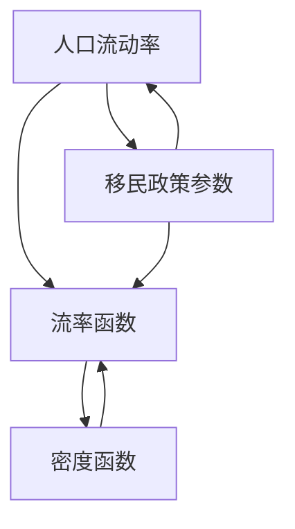

                 

### 第1章 概述与核心概念

#### 1.1 研究背景与意义

在全球化不断深入的今天，移民政策已成为各国政府制定和调整的重要政策之一。人口流动不仅是国家社会经济发展的重要驱动力，也对社会结构、文化融合、教育资源分配、就业市场等多个方面产生深远影响。研究人口流动的数学模型，有助于政府制定科学合理的移民政策，优化资源配置，促进经济社会的可持续发展。

数学模型在移民政策研究中的应用历史悠久，最早可追溯到20世纪中叶。当时的学者们开始探索如何利用数学工具分析人口迁移行为，预测人口流动趋势。随着计算机技术的飞速发展，各种复杂的人口流动模型相继涌现，使得研究者能够更精准地描述和分析人口流动现象。

近年来，随着大数据和人工智能技术的广泛应用，人口流动的研究进入了一个新的阶段。通过分析海量数据，研究者能够挖掘出更多隐藏在数据背后的规律，为政府制定移民政策提供更为科学的依据。此外，数学模型的应用还促进了跨学科的研究，使得社会科学、经济学、地理学等多个领域的研究者能够共同探讨人口流动问题，形成更加全面的认识。

#### 1.2 人口流动的概念

人口流动，通常指的是人口在地区之间、国家之间的迁移和流动。它是一个复杂的社会现象，受到多种因素的影响，包括经济、社会、文化、政治等方面的因素。人口流动可以按照不同的分类标准进行划分，例如按照流动方向可以分为国际流动和国内流动；按照流动原因可以分为经济流动、教育流动、家庭流动等。

从数学模型的角度来看，人口流动可以被抽象为一种空间上的动态过程。在这个过程中，人口在不同地区之间的分布和流动可以用数学函数和方程来描述。例如，流率函数可以描述人口在单位时间内在不同地区之间的流动速度，而密度函数则可以描述人口在空间上的分布情况。

人口流动的重要性在于它不仅直接影响一个国家的经济增长和就业状况，还与社会稳定、文化多样性、社会福利等多个方面密切相关。因此，研究和分析人口流动的数学模型，有助于我们更好地理解人口流动的内在规律，为政府制定科学的移民政策提供支持。

#### 1.3 核心概念的定义

为了更好地理解和分析人口流动的数学模型，我们需要对以下几个核心概念进行定义：

1. **人口流动率**：人口流动率是指单位时间内人口在地区之间的迁移量。它通常用每单位人口在单位时间内的流动量来表示，例如每年每千人流动多少人。人口流动率是描述人口流动强度的重要指标，它受到多种因素的影响，包括经济因素、政策因素、社会因素等。

2. **移民政策参数**：移民政策参数是指影响人口流动的政府制定的政策参数，例如移民配额、移民条件、签证政策等。这些参数对人口流动有直接影响，通过调整这些参数，政府可以控制人口流动的方向和速度，从而实现特定的社会和经济目标。

3. **流率函数**：流率函数是描述人口在地区之间流动速度的函数。它通常用流率矩阵的形式表示，矩阵的元素表示不同地区之间的流动速度。流率函数可以帮助我们理解人口流动的模式和规律，是构建人口流动数学模型的基础。

4. **密度函数**：密度函数是描述人口在空间上分布情况的函数。它通常用密度矩阵的形式表示，矩阵的元素表示不同地区的人口密度。密度函数可以帮助我们分析人口在地区之间的分布特点，是评估人口流动对地区影响的重要工具。

通过定义这些核心概念，我们可以更好地理解和分析人口流动的数学模型，为政府制定科学合理的移民政策提供支持。

#### 1.3.1 核心概念之间的关系架构

为了更清晰地理解人口流动的数学模型，我们需要搭建核心概念之间的关系架构。以下是人口流动中几个核心概念之间的关系：

1. **人口流动率**与**流率函数**：人口流动率是描述人口流动强度的量度，而流率函数则是人口流动的具体表现形式。流率函数将人口流动率与地区之间的流动速度联系起来，为构建数学模型提供了基础。

2. **移民政策参数**与**人口流动率**：移民政策参数直接影响人口流动率。通过调整移民政策参数，例如移民配额和签证政策，政府可以控制人口流动的方向和速度，从而实现特定的社会和经济目标。

3. **密度函数**与**流率函数**：密度函数描述了人口在不同地区的分布情况，而流率函数则描述了人口在不同地区之间的流动速度。这两个函数共同作用，构成了人口流动的整体模型。

以下是使用Mermaid绘制的核心概念关系图：

通过这个关系架构，我们可以更好地理解人口流动的数学模型，为实际应用提供理论支持。

#### 总结与引言

本章首先介绍了数学与移民政策研究的背景和意义，阐述了人口流动的概念及其重要性。随后，我们对几个核心概念进行了定义，并搭建了它们之间的关系架构。这些核心概念包括人口流动率、移民政策参数、流率函数和密度函数。通过理解这些概念及其相互关系，我们可以为后续章节中更深入地探讨人口流动的数学模型打下坚实的基础。

接下来的章节将依次介绍人口流动数学模型的基础理论、核心算法原理、数学模型与公式讲解、移民政策案例分析、项目实战，以及结论与展望。这些内容将帮助读者全面了解人口流动的数学模型，掌握相关理论和实践方法。

**关键词**：人口流动、数学模型、移民政策、核心概念、关系架构、流率函数、密度函数、移民政策参数。

**摘要**：本章概述了数学与移民政策研究的重要背景和意义，定义了人口流动的核心概念，并搭建了核心概念之间的关系架构。为后续章节的深入探讨奠定了基础，为读者理解人口流动的数学模型提供了初步的框架。

---

接下来的章节将深入探讨人口流动数学模型的基础理论，为读者提供更为丰富的理论背景和技术细节。通过逐步分析流率函数、密度函数和迁移矩阵等基本概念，我们将逐步构建起人口流动的数学模型，为后续的应用分析打下坚实的基础。

