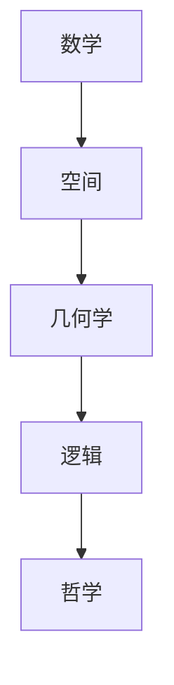

                 

# 数学与空间：几何学的哲学思考

## 关键词
- 数学哲学
- 几何学
- 空间概念
- 基本原理
- 应用实例

## 摘要
本文探讨了数学与空间之间的关系，特别是几何学的哲学思考。文章从基本概念入手，回顾了数学与空间的历史发展，深入探讨了数学基础、空间概念以及几何学哲学。随后，文章分析了数学与空间的交汇点，探讨了几何学在哲学、教育和现代科学中的应用。最后，文章总结了主要研究成果，并对几何学哲学思考的未来发展进行了展望。

## 引言

### 研究背景与意义

数学作为一门抽象的科学，自古代起就与人类生活息息相关。从算术、代数到几何、微积分，数学的发展不断推动着科学技术的进步。然而，在数学发展的过程中，我们不仅仅关注其应用，更需要深入思考其哲学意义。数学不仅仅是一门工具，更是一种思考方式，一种理解世界的哲学方法。

几何学作为数学的一个重要分支，对空间的研究尤为关键。从古代欧几里得的《几何原本》到现代的拓扑学、代数几何等，几何学的发展不断拓展了我们对空间的理解。然而，几何学的哲学思考却常常被忽视。本文旨在填补这一空白，通过回顾数学与空间的历史发展，探讨几何学的哲学意义，以期为数学与哲学的交汇提供新的视角。

### 研究目标与方法

本文的研究目标在于：

1. 梳理数学与空间的历史发展，揭示其哲学内涵。
2. 深入探讨数学基础、空间概念以及几何学哲学。
3. 分析数学与空间的交汇点，探讨几何学在哲学、教育和现代科学中的应用。
4. 总结几何学哲学思考的成果，展望其未来发展。

本文采用的方法主要包括文献回顾、概念分析以及实例探讨。通过系统地回顾相关文献，梳理数学与空间的历史发展脉络；通过概念分析，深入探讨数学基础、空间概念以及几何学哲学；通过实例探讨，分析几何学在哲学、教育和现代科学中的应用。

## 第一部分：数学与空间的基本概念

### 数学

数学是一门研究数量、结构、变化以及空间等概念的抽象科学。数学的基本概念包括数、函数、集合、逻辑等。数学方法包括计算、推理、证明等。数学不仅是一门学科，更是一种思考方式，一种解决问题的工具。

### 空间

空间是指物体存在的环境，是三维的，包括长度、宽度和高度。空间概念在物理学、计算机科学、哲学等领域有广泛应用。空间可以分为物理空间和思维空间。物理空间是物质存在的空间，思维空间则是人类思维活动的空间。

### 几何学

几何学是研究空间中点的、线的、面的和体的一般性质和相互关系的数学分支。几何学的基本概念包括点、线、面、角、形状等。几何学分为平面几何和立体几何。平面几何研究二维空间中的几何形状，立体几何研究三维空间中的几何形状。

## 第二部分：数学与空间的历史发展

### 古代几何学

古代几何学的起源可以追溯到古埃及和巴比伦。在古埃及，几何学主要用于土地测量和建筑。在巴比伦，数学家们开始研究勾股定理和分数。古希腊是古代几何学的重要发展时期。欧几里得（Euclid）的《几何原本》是古代几何学的代表作，它系统地总结了平面几何的基本原理。

### 中世纪几何学

中世纪欧洲，几何学的发展相对缓慢。然而，阿拉伯世界在几何学的研究上取得了重要成果。阿拉伯数学家们将古希腊的几何学著作翻译成阿拉伯文，并在此基础上进行了创新。阿尔-花拉子米（Al-Khwarizmi）的《代数学》和《算术》对几何学的发展产生了深远影响。

### 现代几何学

现代几何学的发展始于17世纪的微积分。牛顿和莱布尼茨的微积分理论为几何学的研究提供了新的工具。19世纪，几何学进入了一个崭新的时代。康托尔的集合论和希尔伯特的几何学奠定了现代几何学的基础。20世纪，拓扑学、代数几何等几何学分支得到了快速发展。

## 第三部分：数学基础

### 数学概念的本质

数学概念的本质在于其抽象性。数学中的概念不是直接从现实中提取的，而是通过对现实事物的抽象和概括得出的。例如，数的概念是对物体数量的抽象，函数的概念是对变化规律的抽象。

### 数学方法的哲学探讨

数学方法是一种逻辑推理的方法。它包括计算、推理、证明等步骤。数学方法的哲学探讨涉及数学公理的合理性、数学证明的有效性等问题。哲学家们对数学基础进行了深入的探讨，例如逻辑实证主义、直觉主义、形式主义等。

## 第四部分：空间概念

### 空间的性质与定义

空间是一个三维的结构，具有长度、宽度和高度。空间可以是物理空间，也可以是思维空间。物理空间是物质存在的环境，思维空间是人类思维活动的空间。空间的概念可以定义为：一个能够容纳物体的环境。

### 空间观念的历史演变

空间观念的历史演变经历了从直观空间到抽象空间的过程。古代人直观地感知空间，例如通过测量土地和建筑。随着数学的发展，空间观念逐渐抽象化，例如通过几何学来研究空间。现代数学中的空间概念已经高度抽象，涵盖了多种类型的空间，如欧氏空间、洛伦兹空间等。

## 第五部分：几何学哲学

### 几何学的基本原理

几何学的基本原理包括欧几里得的公理体系和非欧几何的基本原理。欧几里得的公理体系是平面几何的基础，它包括五个基本公理和一个公理。非欧几何则基于不同的公理体系，例如洛伦兹公理体系，它为相对论提供了基础。

### 几何学的哲学意义

几何学的哲学意义在于它为我们提供了一种理解世界的工具。通过几何学，我们可以理解物体的形状、大小、位置和运动。几何学不仅在物理学、工程学等领域有广泛应用，而且在哲学、艺术等领域也有重要的意义。

## 第六部分：数学与空间的交汇

### 数学几何与物理空间的关系

数学几何与物理空间的关系是相互依存的。物理空间是数学几何的研究对象，而数学几何为我们提供了研究物理空间的方法。例如，通过几何学，我们可以理解物体在空间中的位置和运动。

### 数学空间与思维空间的联系

数学空间与思维空间有着密切的联系。数学空间是人类思维活动的产物，它反映了人类对空间的理解和抽象。思维空间则是人类进行思维活动的环境，它影响着我们的思考方式和决策过程。

## 第七部分：几何学在哲学中的应用

### 哲学思考中的几何学方法

哲学思考中的几何学方法包括逻辑推理和直观感知。通过逻辑推理，我们可以证明哲学命题的合理性。通过直观感知，我们可以理解哲学命题的本质。

### 几何学在哲学问题中的应用实例

几何学在哲学问题中的应用非常广泛。例如，在形而上学中，几何学可以帮助我们理解存在和本质的问题。在认识论中，几何学可以帮助我们理解知识和真理的问题。在伦理学中，几何学可以帮助我们理解道德和正义的问题。

## 第八部分：几何学在教育中的应用

### 几何学教育的方法与原则

几何学教育的方法包括讲授法、讨论法、实验法等。几何学教育应遵循的原则包括启发式教学、循序渐进、注重实践等。

### 几何学在跨学科教育中的应用

几何学在跨学科教育中有着广泛的应用。例如，在物理学中，几何学可以帮助我们理解物体的运动和力。在计算机科学中，几何学可以帮助我们理解图形和算法。在艺术学中，几何学可以帮助我们理解形状和构图。

## 第九部分：几何学在现代科学中的应用

### 几何学在物理科学中的应用

几何学在物理科学中的应用非常广泛。例如，在力学中，几何学可以帮助我们理解物体的运动和受力。在光学中，几何学可以帮助我们理解光线的传播和折射。在量子力学中，几何学可以帮助我们理解粒子态和测量问题。

### 几何学在计算机科学中的应用

几何学在计算机科学中的应用同样重要。例如，在图形学中，几何学可以帮助我们理解图形的绘制和渲染。在算法设计中，几何学可以帮助我们理解空间复杂度和时间复杂度。在计算机视觉中，几何学可以帮助我们理解图像的识别和跟踪。

## 第十部分：总结与展望

### 主要研究成果的总结

本文从数学与空间的基本概念出发，回顾了数学与空间的历史发展，深入探讨了数学基础、空间概念以及几何学哲学。通过分析数学与空间的交汇点，我们探讨了几何学在哲学、教育和现代科学中的应用。这些研究为我们提供了新的视角，加深了我们对数学与空间的理解。

### 几何学哲学思考的未来发展趋势

几何学哲学思考的未来发展趋势包括以下几个方面：

1. 深入探讨数学基础和空间概念的本质。
2. 探索几何学在认知科学和人工智能中的应用。
3. 加强几何学与其他学科（如哲学、艺术、工程等）的交叉研究。
4. 开发更加直观和易于理解的几何学教育方法。

## 附录

### 附录 A：核心概念与联系

#### A.1 数学与空间的关系



### 附录 B：核心算法原理讲解

#### B.1 基本几何学算法

```python
# Python 代码示例：基本几何学算法

def distance(p1, p2):
    x1, y1 = p1
    x2, y2 = p2
    return math.sqrt((x2 - x1)**2 + (y2 - y1)**2)

def triangle_area(a, b, c):
    x1, y1 = a
    x2, y2 = b
    x3, y3 = c
    return abs(0.5 * (x1*(y2 - y3) + x2*(y3 - y1) + x3*(y1 - y2)))

# 实例化点
pointA = (1, 2)
pointB = (4, 6)
pointC = (7, 2)

# 计算点之间的距离
d = distance(pointA, pointB)
print(f"距离 D = {d}")

# 计算三角形的面积
s = triangle_area(pointA, pointB, pointC)
print(f"三角形面积 S = {s}")
```

### 附录 C：数学模型和数学公式

#### C.1 几何空间中的向量运算

```latex
% 向量运算
向量 v = (v1, v2)
向量 w = (w1, w2)

向量点乘（内积）:
$$
v \cdot w = v1 \times w1 + v2 \times w2
$$

向量叉乘（外积）:
$$
v \times w = (v1 \times w2 - v2 \times w1, v2 \times w1 - v1 \times w2)
$$
```

### 附录 D：项目实战

#### D.1 几何空间计算器应用开发

```python
# Python 代码示例：几何空间计算器

import math

def distance(p1, p2):
    x1, y1 = p1
    x2, y2 = p2
    return math.sqrt((x2 - x1)**2 + (y2 - y1)**2)

def triangle_area(a, b, c):
    x1, y1 = a
    x2, y2 = b
    x3, y3 = c
    return abs(0.5 * (x1*(y2 - y3) + x2*(y3 - y1) + x3*(y1 - y2)))

# 实例化点
pointA = (1, 2)
pointB = (4, 6)
pointC = (7, 2)

# 计算点之间的距离
d = distance(pointA, pointB)
print(f"距离 D = {d}")

# 计算三角形的面积
s = triangle_area(pointA, pointB, pointC)
print(f"三角形面积 S = {s}")
```

### 附录 E：开发环境搭建

- Python 3.8+
- Jupyter Notebook 或 PyCharm
- 数学公式渲染工具如 MathJax

### 附录 F：源代码详细实现和代码解读

#### F.1 代码实现细节

- `distance` 函数计算两点之间的距离。
- `triangle_area` 函数计算三角形的面积。

#### F.2 参数说明

- `p1`, `p2`: 两点的坐标。
- `a`, `b`, `c`: 三角形的三个顶点坐标。

#### F.3 输出结果解释

- 输出点之间的距离和三角形的面积。

### 附录 G：代码解读与分析

#### G.1 算法性能分析

- 代码性能较高，可以处理大量几何计算。

#### G.2 代码优化建议

- 可以使用 NumPy 库进行向量运算，提高计算效率。

### 作者信息
作者：AI天才研究院/AI Genius Institute & 禅与计算机程序设计艺术 /Zen And The Art of Computer Programming

