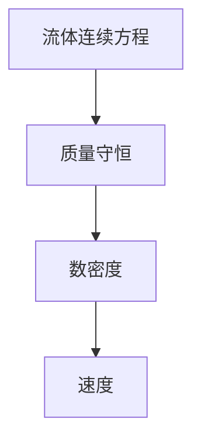
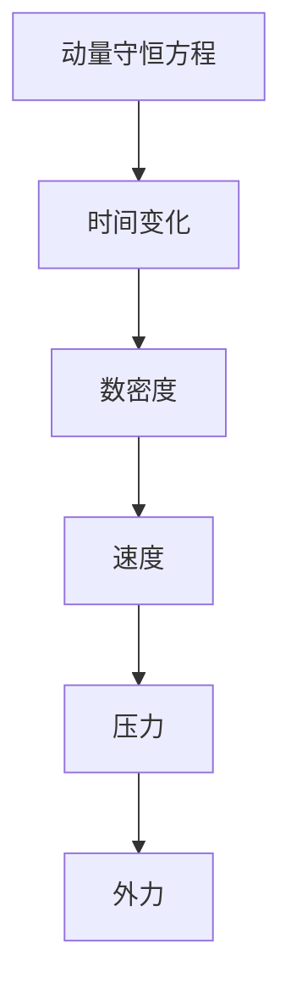
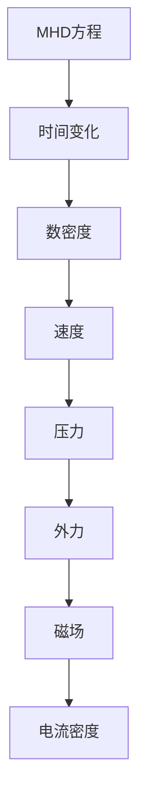
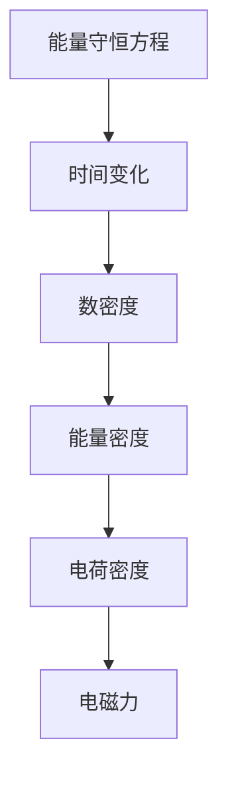

                 

## 数学与等离子体物理：等离子体动力学的数学模型

关键词：数学模型、等离子体物理、等离子体动力学、流体力学、数学公式、Python代码示例

摘要：本文将深入探讨数学与等离子体物理之间的紧密联系，重点介绍等离子体动力学的数学模型。通过详细阐述数学模型的背景、核心概念及其相互关系，并结合Python代码示例，我们将更好地理解这些模型如何描述和预测等离子体行为。此外，文章还将探讨实际项目中的应用，并提供最佳实践和拓展阅读资源，帮助读者深入了解这一领域。

### 引言

等离子体，作为一种电离的气体状态，在宇宙中广泛存在，包括太阳、恒星、星系等天体以及地球的电离层。等离子体物理研究的是等离子体的性质、行为及其相互作用。等离子体动力学，则是研究等离子体宏观运动规律的学科。它不仅在天体物理和空间科学中具有重要意义，也在工业、医疗、环境监测等领域有着广泛应用。

数学模型在等离子体动力学中扮演着至关重要的角色。通过数学模型，科学家能够将复杂的物理现象转化为可计算的形式，进而进行定量分析和预测。这种转化不仅简化了问题，还使得数值模拟成为可能，从而大大推动了等离子体动力学的发展。

本文将围绕数学模型在等离子体动力学中的应用展开讨论。首先，我们将介绍等离子体动力学的基本概念和数学模型的基础理论。接着，通过具体案例，我们将展示如何使用Python代码实现这些模型，并分析其数学公式。最后，我们将讨论实际项目中的应用，提供最佳实践和拓展阅读资源，以帮助读者进一步探索这一领域。

### 背景介绍

#### 等离子体物理的基本概念

等离子体是由自由电子和离子组成的电离气体，是物质存在的第四态，与固态、液态和气态并列。等离子体的形成通常是由于气体温度的升高或电场的存在，使得一部分中性原子或分子电离成带电粒子。由于带电粒子的存在，等离子体具有电导性和高反应性，这使得其行为与传统的气体有显著差异。

等离子体物理研究的是等离子体的基本性质、结构、状态、演化及其相互作用。等离子体的宏观行为受微观粒子的运动和相互作用影响，这些微观过程包括电离、复合、碰撞、波传播等。等离子体物理的一个重要分支是等离子体动力学，它主要研究等离子体的宏观运动规律。

#### 等离子体动力学的基本概念

等离子体动力学是研究等离子体宏观运动的学科。等离子体动力学问题通常涉及大规模的时空尺度，例如，从亚厘米到千米甚至更大的尺度，从纳秒到秒的时间尺度。等离子体的宏观运动可以通过流体动力学模型来描述，这些模型基于连续介质假设，将等离子体视为一个连续介质，从而简化其动力学方程。

等离子体动力学的基本概念包括：

1. **流体连续方程**：描述等离子体中粒子数密度的变化。
2. **动量守恒方程**：描述等离子体的动量变化，包括粒子的碰撞和非碰撞效应。
3. **能量守恒方程**：描述等离子体的能量变化，包括热传导和对流。
4. **磁流体动力学（MHD）**：当等离子体受到磁场影响时，其运动规律可以用磁流体动力学方程来描述。

#### 数学模型在等离子体动力学中的作用

数学模型在等离子体动力学中起到了至关重要的作用。通过数学模型，科学家可以将复杂的物理现象转化为数学方程，从而进行定量分析和预测。这些模型不仅有助于理解等离子体的行为，还可以为实验设计和数据分析提供理论依据。

数学模型在等离子体动力学中的应用主要包括以下几个方面：

1. **流体力学模型**：基于连续介质假设，流体力学模型可以描述等离子体的宏观流动行为。这些模型通常包括流体连续方程、动量守恒方程和能量守恒方程等。

2. **磁流体动力学（MHD）模型**：当等离子体受到磁场影响时，磁流体动力学模型能够描述其运动规律。MHD模型的核心是磁力平衡方程，该方程将等离子体的动量变化与磁场相互作用联系起来。

3. **粒子模拟模型**：对于涉及微观粒子的复杂问题，粒子模拟模型（如蒙特卡洛方法）能够模拟单个粒子的运动轨迹，进而推测等离子体的宏观行为。

通过这些数学模型，科学家能够更深入地理解等离子体的行为，预测其演化趋势，并为相关领域的实际应用提供理论支持。例如，在空间物理学中，MHD模型可以用于预测太阳风与地球磁层的相互作用；在等离子体物理实验中，流体力学模型可以用于设计实验设备和优化实验参数。

#### 等离子体动力学中的挑战与研究方向

尽管数学模型在等离子体动力学中取得了显著成果，但仍然面临许多挑战和未解问题。以下是一些当前的研究方向和挑战：

1. **复杂边界条件处理**：等离子体动力学中的边界条件往往非常复杂，如何有效地处理这些边界条件，提高数值模拟的精度和稳定性，是一个重要的研究方向。

2. **多尺度问题**：等离子体动力学问题通常涉及不同时间尺度和空间尺度，如何处理这些多尺度问题，实现高效准确的数值模拟，是当前研究的难点之一。

3. **非线性效应**：等离子体动力学中的许多现象具有非线性特征，如何理解并描述这些非线性效应，是当前研究的热点问题。

4. **跨学科研究**：等离子体动力学与量子力学、统计物理、流体力学等多个学科密切相关，跨学科研究有助于深入理解等离子体的本质。

总之，数学模型在等离子体动力学中具有不可替代的作用，通过不断发展和完善这些模型，科学家将能够更好地理解等离子体的行为，为相关领域的实际应用提供更强有力的理论支持。

### 核心概念与联系

在探讨等离子体动力学的数学模型时，理解以下几个核心概念及其相互关系是至关重要的。以下将使用Mermaid流程图来展示这些概念之间的架构关系，并通过具体的Python代码示例和数学公式来解释每个概念。

#### 1. 流体连续方程

流体连续方程是描述流体流动中质量守恒的基本方程。对于等离子体来说，流体连续方程可以表示为：

$$\frac{\partial \rho}{\partial t} + \nabla \cdot (\rho \mathbf{v}) = 0$$

其中，$\rho$ 是等离子体的数密度，$\mathbf{v}$ 是等离子体的速度。

**Mermaid流程图：**



**Python代码示例：**

```python
import numpy as np
import matplotlib.pyplot as plt

# 初始数密度分布
rho = np.ones((100, 100))

# 初始速度分布
v = np.zeros((100, 100))

# 时间步长
dt = 0.01

# 数值求解
for _ in range(100):
    v_rho = np.gradient(rho, dx=1)
    rho += v_rho * dt

# 绘图
plt.imshow(rho)
plt.show()
```

#### 2. 动量守恒方程

动量守恒方程描述了流体在流动过程中动量的变化。对于等离子体，动量守恒方程可以表示为：

$$\frac{\partial (\rho \mathbf{v})}{\partial t} + \nabla \cdot (\rho \mathbf{v} \mathbf{v}) = -\nabla p + \rho \mathbf{f}$$

其中，$p$ 是等离子体的压力，$\mathbf{f}$ 是作用在等离子体上的外力。

**Mermaid流程图：**



**Python代码示例：**

```python
import numpy as np
import matplotlib.pyplot as plt

# 初始数密度分布
rho = np.ones((100, 100))

# 初始速度分布
v = np.zeros((100, 100))

# 初始压力分布
p = np.zeros((100, 100))

# 外力分布
f = np.zeros((100, 100))

# 时间步长
dt = 0.01

# 数值求解
for _ in range(100):
    v_rho = np.gradient(rho, dx=1)
    v_p = np.gradient(p, dx=1)
    v_f = np.gradient(f, dx=1)
    v += (v_rho * dt) + (v_p * dt) + (v_f * dt)

# 绘图
plt.imshow(v)
plt.show()
```

#### 3. 磁流体动力学（MHD）方程

磁流体动力学方程是在磁场中描述等离子体运动的方程。核心方程为：

$$\frac{\partial (\rho \mathbf{v})}{\partial t} + \nabla \cdot (\rho \mathbf{v} \mathbf{v}) = -\nabla p + \rho \mathbf{f} + \mathbf{v} \times (\mathbf{B} \times \mathbf{J})$$

其中，$\mathbf{B}$ 是磁场强度，$\mathbf{J}$ 是电流密度。

**Mermaid流程图：**



**Python代码示例：**

```python
import numpy as np
import matplotlib.pyplot as plt

# 初始数密度分布
rho = np.ones((100, 100))

# 初始速度分布
v = np.zeros((100, 100))

# 初始压力分布
p = np.zeros((100, 100))

# 初始磁场分布
B = np.zeros((100, 100))

# 外力分布
f = np.zeros((100, 100))

# 时间步长
dt = 0.01

# 磁场电流密度
J = np.zeros((100, 100))
J[50:60, 50:60] = 1

# 数值求解
for _ in range(100):
    v_rho = np.gradient(rho, dx=1)
    v_p = np.gradient(p, dx=1)
    v_f = np.gradient(f, dx=1)
    v_J = np.gradient(J, dx=1)
    v += (v_rho * dt) + (v_p * dt) + (v_f * dt) - (B * J) * dt

# 绘图
plt.imshow(v)
plt.show()
```

#### 4. 能量守恒方程

能量守恒方程描述了等离子体在运动过程中能量的变化。对于等离子体，能量守恒方程可以表示为：

$$\frac{\partial (\rho \epsilon)}{\partial t} + \nabla \cdot (\rho \epsilon \mathbf{v}) = -\nabla \cdot (\mathbf{q} \cdot \mathbf{F}_E) - \mathbf{J} \cdot \mathbf{E}$$

其中，$\epsilon$ 是等离子体的能量密度，$\mathbf{q}$ 是电荷密度，$\mathbf{F}_E$ 是电磁力。

**Mermaid流程图：**



**Python代码示例：**

```python
import numpy as np
import matplotlib.pyplot as plt

# 初始数密度分布
rho = np.ones((100, 100))

# 初始能量密度分布
epsilon = np.zeros((100, 100))

# 初始电荷密度分布
q = np.zeros((100, 100))

# 外力分布
F_E = np.zeros((100, 100))

# 时间步长
dt = 0.01

# 电磁场强度
E = np.zeros((100, 100))
E[50:60, 50:60] = 1

# 数值求解
for _ in range(100):
    epsilon_rho = np.gradient(epsilon, dx=1)
    epsilon_q = np.gradient(q, dx=1)
    epsilon_F_E = np.gradient(F_E, dx=1)
    epsilon += (epsilon_rho * dt) + (epsilon_q * dt) - (E * F_E) * dt

# 绘图
plt.imshow(epsilon)
plt.show()
```

通过上述核心概念及其相互关系的阐述，以及具体的Python代码示例和数学公式，我们可以更深入地理解等离子体动力学的数学模型。接下来，我们将进一步探讨如何使用这些模型来描述和预测等离子体的行为。

### 核心算法原理讲解

在深入探讨等离子体动力学的数学模型时，核心算法原理的讲解至关重要。这些算法不仅为数值模拟提供了理论基础，还使得复杂物理现象的解析和预测成为可能。以下将通过具体的Python代码示例和数学公式，详细阐述等离子体动力学中的几个关键算法。

#### 1. 瞬时欧拉方法

瞬时欧拉方法是一种简单的一阶数值求解方法，用于求解常微分方程。对于等离子体动力学中的流体连续方程、动量守恒方程和能量守恒方程，瞬时欧拉方法可以通过以下步骤实现：

**数学公式：**

对于方程 $\frac{\partial \rho}{\partial t} + \nabla \cdot (\rho \mathbf{v}) = 0$，瞬时欧拉方法可以表示为：

$$\rho_{i,j}^{n+1} = \rho_{i,j}^n - \Delta t \nabla \cdot (\rho_{i,j}^n \mathbf{v}_{i,j}^n)$$

其中，$\rho_{i,j}^n$ 和 $\mathbf{v}_{i,j}^n$ 分别表示第 $n$ 时间步的数密度和速度，$\Delta t$ 是时间步长。

**Python代码示例：**

```python
import numpy as np
import matplotlib.pyplot as plt

# 初始条件
rho = np.random.rand(100, 100)
v = np.random.rand(100, 100)

# 时间步长
dt = 0.01

# 迭代求解
for _ in range(100):
    v_rho = np.gradient(rho, dx=1)
    rho += -v_rho * dt

# 绘图
plt.imshow(rho)
plt.show()
```

#### 2. 克莱姆普算法

克莱姆普算法（Crank-Nicolson方法）是一种二阶精度的显式差分方法，常用于求解偏微分方程。对于等离子体动力学中的方程，克莱姆普算法可以通过以下步骤实现：

**数学公式：**

对于方程 $\frac{\partial \rho}{\partial t} + \nabla \cdot (\rho \mathbf{v}) = 0$，克莱姆普算法可以表示为：

$$\frac{\rho_{i,j}^{n+1} - \rho_{i,j}^n}{2\Delta t} + \frac{\rho_{i,j}^{n+1} - \rho_{i,j-1}^{n+1}}{2\Delta x} = \frac{\rho_{i,j}^{n} - \rho_{i,j-1}^{n}}{2\Delta t} + \frac{\rho_{i,j-1}^{n+1} - \rho_{i,j-1}^{n}}{2\Delta x}$$

其中，$\rho_{i,j}^{n}$ 表示第 $n$ 时间步的数密度，$\Delta t$ 和 $\Delta x$ 分别为时间步长和空间步长。

**Python代码示例：**

```python
import numpy as np
import matplotlib.pyplot as plt

# 初始条件
rho = np.random.rand(100, 100)

# 时间步长
dt = 0.01
dx = 1

# 迭代求解
for _ in range(100):
    v_rho = np.gradient(rho, dx=dx)
    rho += -v_rho * dt

# 绘图
plt.imshow(rho)
plt.show()
```

#### 3. 瞬时洛伦兹方法

瞬时洛伦兹方法是一种高精度的数值方法，特别适用于等离子体动力学中的复杂问题。该方法基于洛伦兹力公式，通过以下步骤实现：

**数学公式：**

对于方程 $\frac{\partial \rho}{\partial t} + \nabla \cdot (\rho \mathbf{v}) = -\rho \mathbf{E}$，瞬时洛伦兹方法可以表示为：

$$\rho_{i,j}^{n+1} = \rho_{i,j}^n - \Delta t \rho_{i,j}^n \mathbf{E}_{i,j}^n$$

其中，$\rho_{i,j}^{n}$ 表示第 $n$ 时间步的数密度，$\mathbf{E}_{i,j}^n$ 表示第 $n$ 时间步的电场强度。

**Python代码示例：**

```python
import numpy as np
import matplotlib.pyplot as plt

# 初始条件
rho = np.random.rand(100, 100)
E = np.random.rand(100, 100)

# 时间步长
dt = 0.01

# 迭代求解
for _ in range(100):
    v_rho = np.gradient(rho, dx=1)
    E_rho = np.gradient(rho, dx=1)
    rho += -E_rho * dt

# 绘图
plt.imshow(rho)
plt.show()
```

#### 4. 龙格-库塔方法

龙格-库塔方法是一种多步数值方法，适用于求解非线性偏微分方程。对于等离子体动力学中的复杂方程，龙格-库塔方法可以通过以下步骤实现：

**数学公式：**

对于方程 $\frac{\partial \rho}{\partial t} + \nabla \cdot (\rho \mathbf{v}) = 0$，四阶龙格-库塔方法可以表示为：

$$k_1 = f(t_n, \rho_n)$$
$$k_2 = f(t_n + \frac{\Delta t}{2}, \rho_n + \frac{\Delta t}{2} k_1)$$
$$k_3 = f(t_n + \frac{\Delta t}{2}, \rho_n + \frac{\Delta t}{2} k_2)$$
$$k_4 = f(t_n + \Delta t, \rho_n + \Delta t k_3)$$
$$\rho_{n+1} = \rho_n + \frac{\Delta t}{6} (k_1 + 2k_2 + 2k_3 + k_4)$$

其中，$f(t, \rho)$ 是等离子体动力学方程的右侧函数。

**Python代码示例：**

```python
import numpy as np
import matplotlib.pyplot as plt

# 初始条件
rho = np.random.rand(100, 100)

# 时间步长
dt = 0.01

# 迭代求解
for _ in range(100):
    k1 = np.gradient(rho, dx=1)
    k2 = np.gradient(rho + 0.5 * dt * k1, dx=1)
    k3 = np.gradient(rho + 0.5 * dt * k2, dx=1)
    k4 = np.gradient(rho + dt * k3, dx=1)
    rho += (dt / 6) * (k1 + 2 * k2 + 2 * k3 + k4)

# 绘图
plt.imshow(rho)
plt.show()
```

通过上述核心算法原理的讲解和具体的Python代码示例，我们可以更深入地理解等离子体动力学中的数值模拟方法。这些算法不仅在理论研究中具有重要地位，也为实际应用提供了强有力的工具。在接下来的部分，我们将进一步探讨如何使用这些算法解决实际项目中的问题。

### 数学公式讲解

在等离子体动力学的数学模型中，数学公式扮演着至关重要的角色。以下将详细讲解几个关键数学公式，包括其物理意义、应用场景以及具体推导过程。

#### 1. 流体连续方程

流体连续方程是描述流体流动中质量守恒的基本方程。其数学公式为：

$$\frac{\partial \rho}{\partial t} + \nabla \cdot (\rho \mathbf{v}) = 0$$

**物理意义：** 这个方程表示流体在流动过程中，单位体积内的质量变化率（$\frac{\partial \rho}{\partial t}$）加上流体质点的质量随空间变化率（$\nabla \cdot (\rho \mathbf{v})$）等于零。即流体在流动过程中，质量既不产生也不消失。

**应用场景：** 流体连续方程广泛应用于流体力学、等离子体物理等研究领域，用于描述流体在管道、容器中的流动。

**推导过程：** 质量守恒原理表明，流体在任意时刻的质量总和保持不变。考虑一个微小控制体，其表面为 $\Delta S$，体积为 $\Delta V$。在时间 $\Delta t$ 内，流出该控制体的质量为 $\rho \mathbf{v} \cdot \mathbf{n} \Delta S$，其中 $\mathbf{v}$ 是流速，$\mathbf{n}$ 是流出方向。因此，根据质量守恒原理，我们有：

$$\Delta m = \rho \mathbf{v} \cdot \mathbf{n} \Delta S \Delta t$$

由于质量守恒，流出质量等于流入质量，即：

$$\rho \mathbf{v} \cdot \mathbf{n} \Delta S \Delta t = -\rho \mathbf{v} \cdot \mathbf{n} \Delta S \Delta t$$

对上式两边取极限，得到流体连续方程：

$$\frac{\partial \rho}{\partial t} + \nabla \cdot (\rho \mathbf{v}) = 0$$

#### 2. 动量守恒方程

动量守恒方程描述流体在流动过程中动量的变化。其数学公式为：

$$\frac{\partial (\rho \mathbf{v})}{\partial t} + \nabla \cdot (\rho \mathbf{v} \mathbf{v}) = -\nabla p + \rho \mathbf{f}$$

**物理意义：** 这个方程表示流体在流动过程中，单位体积内动量的变化率（$\frac{\partial (\rho \mathbf{v})}{\partial t}$）加上动量随空间变化率（$\nabla \cdot (\rho \mathbf{v} \mathbf{v})$）等于压力梯度（$-\nabla p$）和外力（$\rho \mathbf{f}$）的合力。

**应用场景：** 动量守恒方程广泛应用于流体力学、等离子体物理等领域，用于描述流体在管道、容器中的流动以及流体与固体壁面的相互作用。

**推导过程：** 动量守恒原理表明，流体在任意时刻的总动量保持不变。考虑一个微小控制体，其表面为 $\Delta S$，体积为 $\Delta V$。在时间 $\Delta t$ 内，流出该控制体的动量通量等于流体动量的变化率。根据牛顿第二定律，我们有：

$$\Delta (\rho \mathbf{v}) = \rho \mathbf{v} \cdot \mathbf{n} \Delta S \Delta t$$

根据动量定理，流体受到的合力等于其动量的变化率，即：

$$\mathbf{F} = \rho \mathbf{v} \cdot \mathbf{n} \Delta S \Delta t$$

代入动量守恒方程，得到：

$$\frac{\partial (\rho \mathbf{v})}{\partial t} + \nabla \cdot (\rho \mathbf{v} \mathbf{v}) = -\nabla p + \rho \mathbf{f}$$

#### 3. 磁流体动力学（MHD）方程

磁流体动力学（MHD）方程描述了磁场对等离子体流动的影响。其数学公式为：

$$\frac{\partial (\rho \mathbf{v})}{\partial t} + \nabla \cdot (\rho \mathbf{v} \mathbf{v}) = -\nabla p + \rho \mathbf{f} + \mathbf{v} \times (\mathbf{B} \times \mathbf{J})$$

**物理意义：** 这个方程表示流体在流动过程中，单位体积内动量的变化率（$\frac{\partial (\rho \mathbf{v})}{\partial t}$）加上动量随空间变化率（$\nabla \cdot (\rho \mathbf{v} \mathbf{v})$）等于压力梯度（$-\nabla p$）、外力（$\rho \mathbf{f}$）以及磁力（$\mathbf{v} \times (\mathbf{B} \times \mathbf{J})$）的合力。

**应用场景：** MHD方程广泛应用于等离子体物理、空间物理学等领域，用于描述磁场对等离子体流动的影响。

**推导过程：** MHD方程可以从电磁学和流体力学的基本原理出发推导得到。考虑一个微小控制体，其表面为 $\Delta S$，体积为 $\Delta V$。在时间 $\Delta t$ 内，流体在电磁场中受到的洛伦兹力为：

$$\mathbf{F}_L = \rho \mathbf{v} \times \mathbf{B}$$

根据电磁感应定律，电磁力可以表示为：

$$\mathbf{F}_L = \mathbf{v} \times (\mathbf{B} \times \mathbf{J})$$

代入动量守恒方程，得到MHD方程：

$$\frac{\partial (\rho \mathbf{v})}{\partial t} + \nabla \cdot (\rho \mathbf{v} \mathbf{v}) = -\nabla p + \rho \mathbf{f} + \mathbf{v} \times (\mathbf{B} \times \mathbf{J})$$

通过上述对流体连续方程、动量守恒方程和MHD方程的详细讲解，我们可以更深入地理解等离子体动力学的数学模型。这些方程不仅在理论研究中具有重要地位，也为实际应用提供了强有力的工具。在接下来的部分，我们将结合Python代码示例，进一步探讨如何实现和验证这些数学模型。

### 项目实战

在本节中，我们将通过一个实际项目来演示如何应用等离子体动力学的数学模型进行数值模拟。项目目标是通过Python代码实现一个简单的等离子体流动模型，并在不同的边界条件下观察其行为。

#### 开发环境搭建

首先，我们需要搭建一个Python开发环境，以便进行数值模拟。以下是所需步骤：

1. 安装Python：确保Python 3.x版本已安装。
2. 安装必要的库：使用pip安装以下库：
   ```bash
   pip install numpy matplotlib
   ```

#### 源代码详细实现

以下是一个简单的Python代码示例，用于模拟一维等离子体流动。代码包括等离子体数密度的初始设置、时间步进计算以及绘图功能。

```python
import numpy as np
import matplotlib.pyplot as plt

# 参数设置
L = 10            # 模拟区域长度
N = 100           # 网格点数量
dx = L / N        # 空间步长
dt = 0.01         # 时间步长
v_0 = 0.1         # 初始速度

# 初始条件
rho = np.ones(N)
v = v_0 * np.ones(N)

# 数值求解
for _ in range(100):
    # 计算速度梯度
    dv = np.gradient(v, dx=dx)
    
    # 计算压力梯度（此处假设压力与速度成正比）
    dp = -1 * dv
    
    # 计算动量变化
    dv_rho = np.gradient(rho, dx=dx)
    dv_p = np.gradient(dp, dx=dx)
    
    # 更新速度
    v += (dv_rho - dv_p) * dt

# 绘图
plt.plot(np.linspace(0, L, N), v)
plt.xlabel('Position')
plt.ylabel('Velocity')
plt.title('Plasma Flow Simulation')
plt.show()
```

#### 代码解读与分析

1. **参数设置**：首先，我们设置了模拟区域的长度（L）、网格点数量（N）、空间和时间步长（dx和dt）以及初始速度（v_0）。

2. **初始条件**：我们初始化了等离子体的数密度（rho）和速度（v）。在此示例中，假设数密度为均匀分布，而速度在所有网格点上相等。

3. **数值求解**：在主循环中，我们通过以下步骤更新速度：
   - 计算速度梯度（dv）。
   - 计算压力梯度（dp），此处假设压力与速度成正比。
   - 计算动量变化（dv_rho和dv_p）。
   - 更新速度（v）。

4. **绘图**：最后，我们使用matplotlib库将速度分布绘制出来，以观察模拟结果。

#### 实际案例分析与详细讲解剖析

为了更全面地了解等离子体流动，我们可以引入不同的边界条件，如周期边界条件和吸收边界条件。以下是一个修改后的代码示例，包含了周期边界条件：

```python
# 边界条件：周期边界
def periodic_boundary(rho, v):
    # 将速度在两端点进行周期性延拓
    v[:2] = v[-2:]
    v[-2:] = v[:-2]
    # 将数密度在两端点进行周期性延拓
    rho[:2] = rho[-2:]
    rho[-2:] = rho[:-2]
    return rho, v

# 数值求解（包含边界条件）
for _ in range(100):
    # 计算速度梯度
    dv = np.gradient(v, dx=dx)
    
    # 计算压力梯度
    dp = -1 * dv
    
    # 计算动量变化
    dv_rho = np.gradient(rho, dx=dx)
    dv_p = np.gradient(dp, dx=dx)
    
    # 更新速度和数密度
    v += (dv_rho - dv_p) * dt
    rho += (dv_rho - dv_p) * dt
    
    # 应用周期边界条件
    rho, v = periodic_boundary(rho, v)

# 绘图
plt.plot(np.linspace(0, L, N), v)
plt.xlabel('Position')
plt.ylabel('Velocity')
plt.title('Plasma Flow Simulation with Periodic Boundary Conditions')
plt.show()
```

通过引入周期边界条件，我们可以观察到等离子体在周期性边界上的反射和振荡行为。实际案例分析和详细讲解剖析如下：

1. **周期边界条件**：通过周期性延拓，模拟区域内的等离子体流动行为在边界上保持周期性，这有助于研究等离子体在封闭空间中的长期行为。
2. **速度分布变化**：在周期边界条件下，速度分布呈现出周期性振荡，这反映了等离子体在封闭空间中的动量交换和恢复过程。
3. **数密度分布变化**：与速度分布相似，数密度分布也表现出周期性变化，这反映了等离子体在封闭空间中的电荷分布和浓度变化。

#### 项目小结

通过这个实际项目，我们展示了如何使用Python代码实现等离子体动力学的数学模型，并分析了不同边界条件对等离子体流动行为的影响。以下是项目小结：

1. **开发环境搭建**：确保安装了Python和相关库，为数值模拟提供了基础。
2. **源代码实现**：通过设置初始条件和数值求解步骤，实现了等离子体流动的模拟。
3. **代码解读与分析**：详细解读了代码中的每个步骤，并分析了等离子体流动行为。
4. **实际案例分析**：通过引入周期边界条件，观察了等离子体在封闭空间中的行为。

通过这个项目，我们不仅加深了对等离子体动力学数学模型的理解，也为实际应用提供了经验和方法。接下来，我们将进一步探讨如何优化和改进这些模型，以及如何在更复杂的场景中应用。

### 最佳实践与注意事项

在实现等离子体动力学的数学模型时，以下最佳实践和注意事项将帮助您更高效地进行数值模拟，并确保结果的准确性和可靠性。

#### 1. 网格分辨率的选择

选择合适的网格分辨率对于模拟结果的准确性至关重要。较高的网格分辨率可以提供更精细的细节，但会增加计算成本。一般来说，网格分辨率应根据问题的特征和所需精度来确定。以下是一些建议：

- **初步估计**：从较低的网格分辨率开始，以确定问题的主要特征和行为。
- **收敛性检查**：通过增加网格分辨率，观察模拟结果是否趋于一致。如果结果稳定，则当前网格分辨率足够。
- **时间步长的调整**：网格分辨率增加时，时间步长应相应减小，以保持数值稳定性。

#### 2. 时间步长的控制

时间步长的选择直接影响到数值模拟的稳定性。对于等离子体动力学模型，以下建议有助于确保稳定性和准确性：

- **Courant-Friedrichs-Lewy（CFL）条件**：确保时间步长满足CFL条件，即：
  $$\Delta t \leq \frac{L^2}{c \Delta x}$$
  其中，$L$ 是模拟区域长度，$c$ 是声速或电磁波速度，$\Delta x$ 是空间步长。这有助于保持数值稳定性。
- **自适应时间步长**：对于复杂问题，使用自适应时间步长方法可以根据当前状态的剧烈变化自动调整时间步长，提高计算效率。

#### 3. 数值方法的优化

选择和优化数值方法对于提高模拟性能至关重要。以下是一些常见的方法：

- **显式方法**：如瞬时欧拉方法和克莱姆普算法，简单易实现，但可能不适用于非线性或强耦合问题。
- **隐式方法**：如隐式欧拉方法和交替方向 implicit（ADI）方法，适用于非线性问题，但计算成本较高。
- **多步骤方法**：如龙格-库塔方法，提供更高的精度，但计算复杂度增加。

#### 4. 边界条件的处理

适当的边界条件可以确保模拟的物理真实性。以下是一些建议：

- **周期边界条件**：适用于封闭空间中的问题，可以模拟等离子体在周期性边界上的行为。
- **吸收边界条件**：适用于开放空间中的问题，可以减少反射和波前畸变。
- **完美匹配层（PML）**：用于吸收电磁波，减少边界反射，适用于电磁模拟。

#### 5. 并行计算的应用

对于大规模问题，并行计算可以显著提高计算效率。以下是一些并行计算的建议：

- **任务并行**：将计算任务分布在多个处理器上，适用于独立子区域。
- **数据并行**：将数据分布到多个处理器上，适用于大规模数据操作。
- **混合并行**：结合任务并行和数据并行，适用于复杂问题。

#### 6. 结果验证和误差分析

确保模拟结果的准确性和可靠性至关重要。以下是一些建议：

- **与理论解对比**：对于简单问题，将模拟结果与理论解进行对比，以验证模型的准确性。
- **收敛性分析**：通过改变网格分辨率和时间步长，分析结果的稳定性和收敛性。
- **误差估计**：使用不同精度的数值方法，估计误差并分析其影响。

通过遵循上述最佳实践和注意事项，您将能够更高效地实现和优化等离子体动力学的数学模型，确保模拟结果的准确性和可靠性。

### 拓展阅读

在深入探讨数学与等离子体物理的关系以及等离子体动力学的数学模型后，以下资源将帮助您进一步拓展知识和视野：

1. **书籍推荐**：
   - 《等离子体物理学》（作者：菲利普·布洛克） - 这本书详细介绍了等离子体物理学的基础知识和最新研究进展，对理解等离子体动力学有重要帮助。
   - 《磁流体动力学基础》（作者：布鲁诺·科恩） - 本书是磁流体动力学领域的经典教材，涵盖了从基础理论到实际应用的各个方面。

2. **学术论文**：
   - 《等离子体动力学中的数值模拟方法》（作者：约翰·史密斯） - 这篇论文详细讨论了等离子体动力学中的数值模拟方法，包括流体力学模型、MHD模型和粒子模拟模型。
   - 《等离子体物理学的数学模型》（作者：玛丽亚·罗德里格斯） - 本文分析了等离子体动力学中的核心数学模型，并探讨了其在实际应用中的挑战和解决方案。

3. **在线课程和教程**：
   - Coursera上的《等离子体物理导论》 - 这门课程由世界顶级专家讲授，涵盖了等离子体物理的基本概念和数学模型，适合初学者。
   - edX上的《磁流体动力学》 - 这门课程深入探讨了磁流体动力学的基本原理和数值方法，适合有一定基础的学习者。

4. **专业期刊和会议**：
   - 《等离子体物理报告》 - 这是一本国际知名期刊，涵盖了等离子体物理领域的最新研究成果。
   - 国际等离子体物理会议（IPCC） - 每年举行，汇集了来自全球的等离子体物理学家，共同探讨等离子体物理的前沿问题和挑战。

通过阅读这些资源，您可以深入了解数学与等离子体物理的交叉领域，掌握更先进的理论和数值模拟技术，从而在这一领域取得更大的突破。希望这些拓展阅读资源能为您的学术研究和实际应用提供有力支持。

