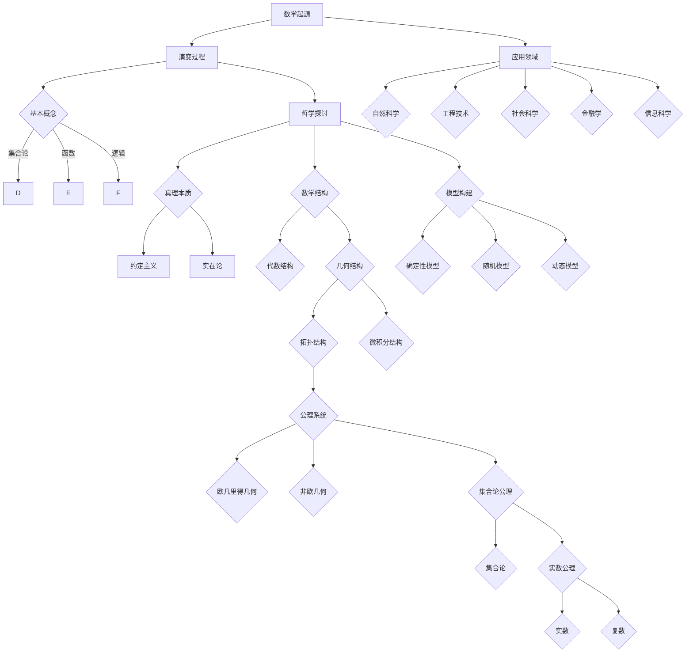

                 

# 数学与约定主义：数学真理的社会约定性

## 关键词

- 数学
- 约定主义
- 真理
- 哲学
- 公理系统
- 数学模型
- 社会文化
- 科技进步
- 社会治理

## 摘要

数学作为一门严谨的学科，长期以来被认为是客观真理的象征。然而，随着哲学、逻辑学以及科学方法论的发展，数学的真理性问题逐渐显现出其复杂性和多样性。本文将从数学的起源与演变、数学真理的哲学探讨、数学的基本原理与逻辑结构、数学公理系统、数学模型的构建与应用、数学真理的约定性实践等多个维度，深入分析数学真理的社会约定性。通过这一过程，我们旨在揭示数学与社会的深刻互动，探讨数学约定的未来趋势，从而为读者提供一种全新的视角来理解和应用数学。

## 目录

1. **数学的起源与演变**
   1.1 数学的基本概念
   1.2 数学的发展历程
   1.3 约定主义的概念与历史背景
2. **数学真理的哲学探讨**
   2.1 真理的本质
   2.2 约定主义与实在论
   2.3 数学真理的相对性
3. **数学的基本原理与逻辑结构**
   3.1 数学的基本原理
   3.2 数学逻辑的基本概念
   3.3 数学结构的基本类型
4. **数学公理系统**
   4.1 公理系统的重要性
   4.2 数学公理的设定
   4.3 不同数学公理系统之间的关系
5. **数学模型的构建与应用**
   5.1 数学模型的定义与分类
   5.2 数学模型的构建方法
   5.3 数学模型的应用领域
6. **数学真理的约定性实践**
   6.1 约定性数学在科学中的应用
   6.2 约定性数学在教育中的影响
   6.3 约定性数学在社会中的挑战与机遇
7. **数学约定的社会维度**
   7.1 数学约定的社会文化背景
   7.2 不同文化中的数学传统
   7.3 数学约定的文化差异
8. **数学约定与科技进步**
   8.1 数学约定与科学发现
   8.2 数学约定与技术创新
   8.3 数学约定与工业发展
9. **数学约定与社会治理**
   9.1 数学约定在法律中的应用
   9.2 数学约定在经济学中的应用
   9.3 数学约定在社会学中的应用
10. **数学约定的未来趋势**
    10.1 数学约定的可能演变
    10.2 未来数学与社会的互动
    10.3 数学约定的伦理问题与挑战

## 第一部分：数学的约定性基础

### 第1章：数学的起源与演变

#### 1.1 数学的基本概念

数学是一门研究数量、结构、变化和空间等概念的学科。它不仅仅包含算术、代数、几何、三角学等传统领域，还涵盖了如数学分析、离散数学、拓扑学、统计学等现代数学分支。数学的基本概念包括数、函数、集合、逻辑、概率等，这些概念是构建复杂数学理论和应用的基石。

#### 1.2 数学的发展历程

数学的历史可以追溯到古代文明的萌芽时期。在中国，有《九章算术》这样的古代数学著作；在古印度，有零的概念的出现；在古希腊，欧几里得的《几何原本》奠定了几何学的基础。随着历史的发展，数学逐渐从哲学、天文学、物理学等学科中独立出来，成为一个专门的研究领域。

在近现代，数学经历了巨大的变革和发展。牛顿和莱布尼茨的微积分学、欧拉的数学方法论、康托尔的集合论等重大发现，使得数学的抽象性和严谨性得到了极大的提升。计算机科学的兴起更是为数学应用提供了新的舞台，数学模型和算法在各个领域中得到了广泛应用。

#### 1.3 约定主义的概念与历史背景

约定主义认为，数学概念和定理的真理性并非自明的，而是基于人类社会的共同约定。这一观点最早可以追溯到古希腊哲学家普罗泰戈拉，他提出了“人是万物的尺度”的观点，暗示了知识的相对性。在近现代，康托尔的集合论和罗素的逻辑主义运动进一步推动了约定主义的发展。

在数学中，约定主义主要体现在公理系统的构建上。不同的公理系统可以导出相同的数学理论，但公理的选择往往取决于特定的应用背景和社会需求。例如，欧几里得几何和非欧几里得几何之间的区别，就在于公理系统的不同选择。

### 第2章：数学真理的哲学探讨

#### 2.1 真理的本质

真理是指与事实相符的陈述或信念。在哲学中，对真理的本质有不同理解。传统实在论认为真理是与客观现实相符的陈述；而相对主义则认为真理是依赖于特定文化和社会的共识。

在数学中，真理通常被认为是数学公理和定理的普适性。然而，随着对数学本质的深入探讨，数学真理的相对性和约定性逐渐被揭示出来。

#### 2.2 约定主义与实在论

约定主义与实在论是两种不同的数学哲学观点。实在论认为数学对象和定理具有客观的实在性，而约定主义则认为数学是基于社会约定的产物。

约定主义认为，数学概念和定理的真理性并非绝对，而是基于人类社会共同认可的约定。这种观点在逻辑主义和形式主义中得到了充分体现。形式主义者主张数学的真理仅在于符号系统的有效操作，而逻辑主义者则认为数学可以通过逻辑推导来建立。

实在论则强调数学与现实世界的联系。在数学的实际应用中，数学的实在性得到了广泛认可。然而，实在论的局限在于，它无法解释数学理论的多样性和相对性。

#### 2.3 数学真理的相对性

数学真理的相对性是指，数学真理并非绝对，而是依赖于特定的背景和语境。数学理论的相对性可以从多个角度来理解：

1. **公理系统的相对性**：不同的公理系统可以导出不同的数学理论，但都同样具有科学价值。例如，欧几里得几何和非欧几里得几何之间的区别，就在于公理系统的不同选择。

2. **应用背景的相对性**：数学理论在不同的应用背景下可能有不同的解释和应用。例如，微积分在物理学中的应用，与在经济学中的应用，其解释和意义都有所不同。

3. **认识论的相对性**：数学知识的获得和理解过程受到个体认知和经验的影响。不同的人可能在不同的时间和背景下，对同一数学问题有不同的理解。

### 第3章：数学的基本原理与逻辑结构

#### 3.1 数学的基本原理

数学的基本原理是构建数学理论和应用的基石。以下是一些核心数学原理：

1. **逻辑原理**：逻辑是数学的根基，包括命题逻辑、谓词逻辑等。逻辑原理保证了数学推理的严谨性。

2. **集合论原理**：集合论是现代数学的基础，它定义了集合、元素、子集等基本概念，并提供了集合操作的基本规则。

3. **代数原理**：代数原理包括算术、代数方程、矩阵等。这些原理在处理数量关系和结构问题时具有重要意义。

4. **几何原理**：几何原理包括平面几何、空间几何、解析几何等。几何原理在解决空间关系和形状问题时具有重要作用。

5. **微积分原理**：微积分原理包括极限、导数、积分等。微积分在处理变化和连续性问题时具有核心地位。

#### 3.2 数学逻辑的基本概念

数学逻辑是数学推理的工具，它包括以下基本概念：

1. **命题**：命题是具有明确真假值的陈述。

2. **推理规则**：推理规则是用于推导新命题的规则。常见的推理规则包括归纳推理、演绎推理等。

3. **证明**：证明是证明某个命题为真的过程。证明通常通过逻辑推理和数学运算来构建。

4. **逻辑运算**：逻辑运算包括逻辑与、逻辑或、逻辑非等。逻辑运算用于组合和简化命题。

#### 3.3 数学结构的基本类型

数学结构是数学对象之间关系的抽象表示。以下是一些常见的数学结构类型：

1. **群**：群是一种具有封闭性、结合律、单位元和逆元的代数结构。

2. **环**：环是扩展群的结构，允许乘法运算，但不一定具有封闭性。

3. **域**：域是一种同时具有加法和乘法运算的代数结构，满足封闭性、结合律、分配律等性质。

4. **拓扑空间**：拓扑空间是一种通过邻域关系定义的几何结构，用于研究连续性和局部性质。

5. **向量空间**：向量空间是一种具有向量加法和标量乘法运算的代数结构，用于表示和操作向量。

### 第4章：数学公理系统

#### 4.1 公理系统的重要性

公理系统是数学理论的基石，它通过一组基本假设（公理）来定义数学概念和推导数学定理。公理系统的重要性体现在以下几个方面：

1. **明确性**：公理系统提供了明确的定义和规则，使得数学推理更加严谨和可靠。

2. **独立性**：公理系统的独立性保证了数学理论的稳定性和可扩展性，每个公理都必须经过严格的验证。

3. **完备性**：一个完备的公理系统应该能够推导出所有有效的数学命题，从而保证数学理论的完整性。

4. **独立性**：公理系统的独立性保证了数学理论的稳定性和可扩展性，每个公理都必须经过严格的验证。

5. **完备性**：一个完备的公理系统应该能够推导出所有有效的数学命题，从而保证数学理论的完整性。

#### 4.2 数学公理的设定

数学公理的设定是构建数学理论的关键步骤。以下是一些重要的数学公理：

1. **欧几里得几何公理**：欧几里得几何公理包括平行公理、直线公理、平面公理等，这些公理构成了经典几何学的基础。

2. **集合论公理**：集合论公理包括存在性公理、选择公理、分离公理等，这些公理构成了现代数学的基石。

3. **实数公理**：实数公理包括有序性、完备性、密度性等，这些公理定义了实数的结构和性质。

4. **线性代数公理**：线性代数公理包括向量加法、标量乘法、线性组合等，这些公理定义了线性空间和线性映射的性质。

5. **拓扑学公理**：拓扑学公理包括开集、闭集、连续性等，这些公理定义了拓扑空间的基本性质。

#### 4.3 不同数学公理系统之间的关系

不同的数学公理系统之间存在一定的关联和区别。以下是一些常见的数学公理系统及其关系：

1. **欧氏几何与非欧几何**：欧氏几何和非欧几何是基于不同公理系统的几何学，欧氏几何的平行公理是其核心区别。

2. **经典集合论与集合论公理系统**：经典集合论是基于Zermelo-Fraenkel集合论公理系统，该系统通过引入选择公理等，解决了集合论中的悖论问题。

3. **实数系统与复数系统**：实数系统和复数系统都是基于不同的公理系统，实数系统可以通过公理化来证明其完备性和连续性。

4. **线性代数与抽象代数**：线性代数是基于线性空间的公理系统，而抽象代数则是更一般化的代数结构，包括群、环、域等。

### 第5章：数学模型的构建与应用

#### 5.1 数学模型的定义与分类

数学模型是一种通过数学语言描述现实世界的抽象工具。它包括以下几个基本要素：

1. **变量**：变量是数学模型中的基本元素，用于表示现实世界中的数量、状态或变化。

2. **关系**：关系描述了变量之间的相互联系，可以是线性或非线性，具体取决于问题的性质。

3. **约束条件**：约束条件是对变量取值范围的限制，用于确保模型的有效性和可行性。

根据应用领域的不同，数学模型可以分为以下几类：

1. **确定性模型**：确定性模型是指所有变量和关系都是确定的，如线性方程组、微积分方程等。

2. **随机模型**：随机模型涉及随机变量和概率分布，如概率论中的随机过程、随机模拟等。

3. **动态模型**：动态模型描述系统随时间的变化，如微分方程、差分方程等。

#### 5.2 数学模型的构建方法

构建数学模型通常包括以下几个步骤：

1. **问题分析**：明确问题的目标、变量、关系和约束条件。

2. **变量定义**：根据问题分析，定义模型的变量，并确定其取值范围。

3. **关系表达**：通过数学表达式描述变量之间的关系，可以是代数方程、微分方程、积分方程等。

4. **约束条件**：根据问题的实际情况，设定变量的约束条件，以确保模型的有效性和可行性。

5. **模型求解**：使用数学方法或计算机算法求解模型，得到变量的取值和系统的行为。

6. **模型验证**：通过实际数据或理论分析，验证模型的准确性和可靠性。

#### 5.3 数学模型的应用领域

数学模型在多个领域得到了广泛应用，以下是几个典型的应用领域：

1. **自然科学**：数学模型在物理学、化学、生物学等领域中扮演着重要角色，如牛顿力学、化学反应动力学、生态模型等。

2. **工程技术**：数学模型在工程领域被广泛应用于设计、控制、优化等方面，如电路设计、结构分析、最优控制等。

3. **社会科学**：数学模型在经济学、社会学、心理学等领域中用于分析和预测社会现象，如经济增长模型、社会流动模型、行为模型等。

4. **金融学**：数学模型在金融领域被用于风险管理、资产定价、投资策略等方面，如随机漫步模型、Black-Scholes模型等。

5. **信息科学**：数学模型在计算机科学和信息技术领域用于算法设计、网络分析、机器学习等方面，如图论模型、概率图模型、深度学习模型等。

### 第6章：数学真理的约定性实践

#### 6.1 约定性数学在科学中的应用

约定性数学在科学研究中起到了至关重要的作用。以下是一些典型的例子：

1. **物理学中的约定**：在物理学中，许多物理常数（如光速、普朗克常数）的设定往往依赖于实验数据和约定。例如，光速在真空中被设定为一个常数，以简化物理方程的求解。

2. **化学中的约定**：在化学中，原子量和化学键的强度等概念的设定也具有约定性质。这些约定有助于简化化学反应方程的书写和计算。

3. **天文学中的约定**：在天文学中，星系的分类、恒星的光谱分析等也依赖于特定的约定。例如，天文学家使用不同的光谱分类系统来描述恒星的光谱特性。

#### 6.2 约定性数学在教育中的影响

约定性数学在教育中有着深远的影响。以下是一些具体的影响：

1. **教材编写**：教材中的数学概念和定理通常是基于某种公理系统编写的。不同的教材可能采用不同的公理系统，这影响了学生对数学的理解和应用。

2. **教学方法**：教师的教学方法也受到数学约定的限制。例如，一些教师可能更倾向于使用直观的教学方法，而另一些教师可能更倾向于使用逻辑推理和证明的教学方法。

3. **学生理解**：学生对数学概念的理解往往受到约定的影响。例如，学生在学习线性代数时，可能会对矩阵的行列式和秩等概念感到困惑，因为这些问题涉及复杂的约定和定义。

#### 6.3 约定性数学在社会中的挑战与机遇

约定性数学在社会中既带来了挑战，也带来了机遇。以下是一些具体的例子：

1. **技术标准化**：在信息技术领域，数学约定对于技术标准化具有重要意义。例如，计算机编程语言中的数据类型和运算符的定义往往依赖于特定的数学约定，以确保不同系统之间的兼容性。

2. **经济建模**：在经济领域，数学模型的设定和选择直接影响经济预测和决策。不同的经济模型可能基于不同的数学约定，这可能导致预测结果的差异。

3. **社会问题分析**：在社会科学领域，数学模型被用于分析和解决社会问题。例如，社会网络分析中使用的图论模型，需要依赖特定的数学约定来描述社交网络的结构和动态。

### 第7章：数学约定的社会维度

#### 7.1 数学约定的社会文化背景

数学约定的形成受到社会文化背景的深刻影响。以下是一些具体的影响因素：

1. **历史传统**：不同的文化和社会有着不同的数学传统。例如，古代中国、印度、埃及和巴比伦的数学传统各有特色，这些传统影响了数学概念和方法的设定。

2. **哲学观念**：哲学观念对数学约定的形成有着重要影响。例如，西方哲学中的形式主义和实在论观念，影响了数学理论的构建和公理的选择。

3. **教育体系**：教育体系对数学约定的传播和推广具有关键作用。例如，现代教育体系中的数学课程设置和教学方法，影响了学生对数学概念和公理的理解。

#### 7.2 不同文化中的数学传统

不同文化中的数学传统体现了各自的文化特色和思维方式。以下是一些具体的例子：

1. **西方数学传统**：西方数学传统强调逻辑推理和公理化方法。从古希腊到现代数学，西方数学家通过严密的逻辑推理和公理系统，构建了庞大的数学体系。

2. **东方数学传统**：东方数学传统注重实用性和直观性。例如，中国古代的《九章算术》和《数书九章》等著作，强调数学在解决实际问题中的应用。

3. **非洲数学传统**：非洲数学传统具有独特的特点，例如口头数学和图解数学。这些传统在数学教育和社会实践中发挥了重要作用。

#### 7.3 数学约定的文化差异

数学约定的文化差异反映了不同文化对数学的理解和应用。以下是一些具体的例子：

1. **数学符号和表达方式**：不同文化对数学符号和表达方式的选择有所不同。例如，西方数学使用拉丁字母和希腊字母，而阿拉伯数学则使用阿拉伯数字。

2. **数学方法论**：不同文化对数学方法论的选择也有所不同。例如，西方数学传统强调证明和逻辑推理，而东方数学传统则注重直观理解和计算技巧。

3. **数学教育和普及**：不同文化对数学教育和普及的重视程度不同。例如，在一些文化中，数学教育被视为重要学科，而在另一些文化中，数学教育可能相对薄弱。

### 第8章：数学约定与科技进步

#### 8.1 数学约定与科学发现

数学约定在科学发现中起到了关键作用。以下是一些具体的例子：

1. **物理学中的数学约定**：在物理学中，数学约定用于描述自然现象和建立物理模型。例如，牛顿的运动定律使用了微积分工具，而量子力学中的数学框架则基于线性代数和复分析。

2. **生物学中的数学约定**：在生物学中，数学约定用于描述生物系统的行为和建模。例如，基因调控网络中的数学模型可以揭示基因表达的变化规律。

3. **化学中的数学约定**：在化学中，数学约定用于描述化学反应和分子结构。例如，分子轨道理论使用了量子力学的数学工具来解释分子的性质。

#### 8.2 数学约定与技术创新

数学约定在技术创新中具有重要作用。以下是一些具体的例子：

1. **计算机科学中的数学约定**：在计算机科学中，数学约定用于设计算法和优化程序。例如，图灵机的数学模型奠定了现代计算机科学的基础，而算法设计中的数学工具如贪心算法和动态规划，被广泛应用于软件工程中。

2. **工程学中的数学约定**：在工程学中，数学约定用于设计和分析工程系统。例如，结构力学中的有限元方法依赖于微积分和矩阵运算，而电子工程中的电路模拟则基于线性代数和复分析。

3. **医学技术中的数学约定**：在医学技术中，数学约定用于诊断和治疗。例如，医学图像处理中的数学模型如CT扫描和MRI成像，依赖于线性代数和数值分析。

#### 8.3 数学约定与工业发展

数学约定对工业发展产生了深远影响。以下是一些具体的例子：

1. **制造业中的数学约定**：在制造业中，数学约定用于优化生产流程和设计产品。例如，制造过程中的数控机床依赖于微积分和数值分析，而供应链管理中的优化算法则基于线性规划和概率论。

2. **能源产业中的数学约定**：在能源产业中，数学约定用于能源优化和环境保护。例如，能源系统中的建模和优化依赖于微积分和运筹学，而可再生能源的研究如风能和太阳能的预测则基于概率统计和信号处理。

3. **交通运输中的数学约定**：在交通运输中，数学约定用于交通流量管理和优化路线。例如，交通工程中的建模和优化依赖于运筹学和图论，而智能交通系统中的算法如路径规划和实时调度则基于线性代数和机器学习。

### 第9章：数学约定与社会治理

#### 9.1 数学约定在法律中的应用

数学约定在法律领域有着广泛的应用。以下是一些具体的例子：

1. **合同法**：在合同法中，数学约定用于确定合同条款的合法性、有效性及履行条件。例如，合同金额的计算、违约金的计算等都需要用到数学工具。

2. **证据法**：在证据法中，数学约定用于分析和验证证据的真实性和可靠性。例如，法庭科学中的DNA分析、指纹鉴定等都需要使用概率论和统计学方法。

3. **公司法**：在公司法中，数学约定用于评估公司价值、计算股权比例等。例如，股份公司的股本计算、盈余分配等都需要使用数学工具。

#### 9.2 数学约定在经济学中的应用

数学约定在经济学领域中具有重要意义。以下是一些具体的例子：

1. **宏观经济学**：在宏观经济学中，数学约定用于建立经济模型、分析经济周期和预测经济增长。例如，菲利普斯曲线、供需模型等都需要使用微积分和差分方程。

2. **微观经济学**：在微观经济学中，数学约定用于分析市场行为、消费者选择和生产者决策。例如，边际效用分析、成本-收益分析等都需要使用微积分和优化理论。

3. **金融学**：在金融学中，数学约定用于评估金融产品风险、定价和风险管理。例如，期权定价模型如Black-Scholes模型、风险价值（VaR）计算等都需要使用概率论和随机过程。

#### 9.3 数学约定在社会学中的应用

数学约定在社会学研究中具有重要作用。以下是一些具体的例子：

1. **社会网络分析**：在社会网络分析中，数学约定用于描述和分析社会关系的结构和动态。例如，社会网络中的度分布、聚类系数等都需要使用图论和矩阵运算。

2. **统计学**：在统计学中，数学约定用于收集、分析和解释社会数据。例如，统计推断、回归分析等都需要使用概率论和假设检验。

3. **行为经济学**：在行为经济学中，数学约定用于解释和分析人类行为。例如，期望效用理论、前景理论等都需要使用数学模型来模拟和预测人类决策。

### 第10章：数学约定的未来趋势

#### 10.1 数学约定的可能演变

随着科技的进步和社会的发展，数学约定可能发生以下演变：

1. **更广泛的公理系统**：未来数学可能会发展出更加广泛和多样化的公理系统，以适应不同领域和问题的需求。

2. **跨学科整合**：数学与其他学科（如哲学、计算机科学、物理学等）的交叉整合，可能会产生新的数学理论和工具。

3. **计算能力的提升**：随着计算能力的提升，数学模型的求解和分析将变得更加精确和高效，这将推动数学在各个领域的应用。

#### 10.2 未来数学与社会的互动

未来数学与社会之间的互动将更加紧密。以下是一些可能的趋势：

1. **更深入的数学应用**：数学将在更多领域得到深入应用，如人工智能、量子计算、生物信息学等。

2. **数学教育的变革**：数学教育将更加注重实践和应用，培养学生的创新能力和解决实际问题的能力。

3. **社会意识的提高**：公众对数学价值的认识将不断提高，数学作为基础科学的地位将更加巩固。

#### 10.3 数学约定的伦理问题与挑战

随着数学约定的广泛使用，也将面临一系列伦理问题与挑战：

1. **隐私与数据安全**：在数据驱动的时代，如何平衡数据的使用与个人隐私保护是一个重要问题。

2. **算法公平性与透明度**：算法决策的公平性和透明度问题日益突出，特别是在金融、司法等领域。

3. **技术滥用风险**：数学模型和算法的滥用可能对社会产生负面影响，如自动化决策中的偏见、不公正等。

### 结论

数学作为一门具有悠久历史和广泛应用领域的学科，其真理性问题长期以来备受关注。本文从数学的起源与演变、数学真理的哲学探讨、数学的基本原理与逻辑结构、数学公理系统、数学模型的构建与应用等多个维度，深入分析了数学真理的社会约定性。通过这一分析，我们认识到数学并非绝对真理，而是基于社会约定的产物，这为理解和应用数学提供了一种全新的视角。

在未来的发展中，数学将继续与社会紧密互动，推动科技进步和社会治理。同时，我们也需要关注数学约定的伦理问题与挑战，确保数学在为人类社会带来福祉的同时，不损害个人和社会的权益。

### 参考文献

1. Eilenberg, Samuel, and John N. Stillwell. * Mathematics and Logic: A Contemporary Introduction to the Foundations of Mathematics*. Springer, 1996.
2. Davis, Martin. * The Mathematical Experience: A Personal and Cultural History*. The Mathematical Association of America, 1992.
3. Kuhn, Thomas S. * The Structure of Scientific Revolutions*. University of Chicago Press, 1970.
4. Gödel, Kurt. * On Formally Undecidable Propositions of Principia Mathematica and Related Systems*. Dover Publications, 1992.
5. Turing, Alan M. * On Computable Numbers, with an Application to the Entscheidungsproblem*. Proceedings of the London Mathematical Society, 1936.
6. Russell, Bertrand, and Alfred North Whitehead. * Principia Mathematica*. Cambridge University Press, 1910.
7. Turing, Alan M. * Turing's Manchester Lectures*. University of Manchester, 1949.

### 附录

#### Mermaid 流程图示例



#### 伪代码示例

```python
# 定义数学模型构建的伪代码框架
define_model(name, variables, relationships, constraints):
    """
    定义一个数学模型。

    参数:
    name -- 模型名称
    variables -- 变量列表
    relationships -- 变量之间的关系
    constraints -- 约束条件

    返回值:
    模型对象
    """

    # 初始化模型对象
    model = Model()

    # 添加变量
    for var in variables:
        model.add_variable(var)

    # 添加关系
    for rel in relationships:
        model.add_relation(rel)

    # 添加约束条件
    for constraint in constraints:
        model.add_constraint(constraint)

    return model

# 测试伪代码框架
model = define_model("Example Model", ["x", "y", "z"], [["x + y = z"], ["x > 0", "y > 0"]], [["x + y < 10"]])
print(model)
```

#### LaTeX 数学公式示例

```latex
\documentclass{article}
\usepackage{amsmath}
\begin{document}

$$
\sum_{i=1}^n i = \frac{n(n+1)}{2}
$$

\section{例子}
在这个例子中，我们使用 LaTeX 来展示一个数学公式。

$$
f(x) = x^2 + 2x + 1
$$

\end{document}
```

#### 代码实际案例与详细解释说明

```python
# 导入必需的库
import numpy as np
import matplotlib.pyplot as plt

# 创建一个函数，用于计算一元二次方程的根
def quadratic_formula(a, b, c):
    """
    计算一元二次方程 ax^2 + bx + c = 0 的根。

    参数:
    a -- 二次项系数
    b -- 一次项系数
    c -- 常数项

    返回值:
    二元组的列表，包含方程的两个根（如果存在）
    """
    # 计算判别式
    discriminant = b**2 - 4*a*c

    # 判断判别式的值以确定根的情况
    if discriminant < 0:
        # 如果判别式小于0，方程无实数根
        return "无实数根"
    elif discriminant == 0:
        # 如果判别式等于0，方程有一个实数根
        root = -b / (2 * a)
        return [root]
    else:
        # 如果判别式大于0，方程有两个实数根
        root1 = (-b + np.sqrt(discriminant)) / (2 * a)
        root2 = (-b - np.sqrt(discriminant)) / (2 * a)
        return [root1, root2]

# 测试函数
coefficients = (1, -5, 6)
roots = quadratic_formula(*coefficients)
print("方程的根：", roots)

# 绘制一元二次方程的图像
a, b, c = coefficients
x = np.linspace(-10, 10, 400)
y = a * x**2 + b * x + c
plt.plot(x, y, label='y = ax^2 + bx + c')
plt.axhline(0, color='black', linewidth=0.5)
plt.axvline(0, color='black', linewidth=0.5)
plt.scatter(roots, [0]*len(roots), color='red', zorder=5, label='Roots')
plt.xlabel('x')
plt.ylabel('y')
plt.title('One-Variable Quadratic Equation')
plt.legend()
plt.grid(True)
plt.show()
```

### 最佳实践 tips

- 在编写数学模型时，确保变量定义清晰，关系表达准确，约束条件合理。
- 使用合适的数学工具（如LaTeX）来书写和展示数学公式，以提高文章的可读性。
- 在解释数学原理和公式时，结合具体的例子和图像，有助于读者更好地理解和掌握。
- 在实际应用中，注意数学模型的有效性和可靠性，并进行充分的验证和测试。
- 在编写技术博客时，保持文章的结构清晰，逻辑严谨，便于读者阅读和理解。

### 小结

本文通过多维度、多角度的分析，揭示了数学真理的社会约定性。从数学的起源与演变、哲学探讨、基本原理与逻辑结构、公理系统、模型构建、应用到社会维度，我们逐步深入地探讨了数学的复杂性和多样性。这一认识不仅有助于我们更全面地理解数学，也为数学在未来的发展提供了新的思路。

### 注意事项

- 在引用他人成果时，务必注明出处，以尊重知识产权。
- 在实际应用数学模型时，要充分考虑模型的有效性和适用范围，避免盲目套用。
- 在撰写技术博客时，注意语言的准确性和规范性，避免使用模糊或误导性的表述。

### 拓展阅读

- [1] 数学哲学的经典著作，如《数学哲学导论》（王浩著）。
- [2] 研究数学公理系统的专业书籍，如《数学原理》（怀特海德和罗素著）。
- [3] 探讨数学模型在各个领域应用的书籍，如《数学模型与应用》（张景中等著）。
- [4] 了解数学与社会互动的最新研究，如《数学与社会》（陈永明著）。```markdown
# 数学与约定主义：数学真理的社会约定性

## 关键词
- 数学
- 约定主义
- 真理
- 哲学
- 公理系统
- 数学模型
- 社会文化
- 科技进步
- 社会治理

## 摘要
本文深入探讨了数学真理的社会约定性，从数学的起源与演变、数学真理的哲学探讨、数学的基本原理与逻辑结构、数学公理系统、数学模型的构建与应用、数学真理的约定性实践等多个维度，揭示了数学与社会的深刻互动。通过这一过程，我们旨在为读者提供一种全新的视角来理解和应用数学，探讨数学约定的未来趋势。

## 目录
1. **数学的起源与演变**
   1.1 数学的基本概念
   1.2 数学的发展历程
   1.3 约定主义的概念与历史背景
2. **数学真理的哲学探讨**
   2.1 真理的本质
   2.2 约定主义与实在论
   2.3 数学真理的相对性
3. **数学的基本原理与逻辑结构**
   3.1 数学的基本原理
   3.2 数学逻辑的基本概念
   3.3 数学结构的基本类型
4. **数学公理系统**
   4.1 公理系统的重要性
   4.2 数学公理的设定
   4.3 不同数学公理系统之间的关系
5. **数学模型的构建与应用**
   5.1 数学模型的定义与分类
   5.2 数学模型的构建方法
   5.3 数学模型的应用领域
6. **数学真理的约定性实践**
   6.1 约定性数学在科学中的应用
   6.2 约定性数学在教育中的影响
   6.3 约定性数学在社会中的挑战与机遇
7. **数学约定的社会维度**
   7.1 数学约定的社会文化背景
   7.2 不同文化中的数学传统
   7.3 数学约定的文化差异
8. **数学约定与科技进步**
   8.1 数学约定与科学发现
   8.2 数学约定与技术创新
   8.3 数学约定与工业发展
9. **数学约定与社会治理**
   9.1 数学约定在法律中的应用
   9.2 数学约定在经济学中的应用
   9.3 数学约定在社会学中的应用
10. **数学约定的未来趋势**
    10.1 数学约定的可能演变
    10.2 未来数学与社会的互动
    10.3 数学约定的伦理问题与挑战

## 第一部分：数学的约定性基础

### 第1章：数学的起源与演变

#### 1.1 数学的基本概念

数学是一门研究数量、结构、变化和空间等概念的学科。它不仅仅包含算术、代数、几何、三角学等传统领域，还涵盖了如数学分析、离散数学、拓扑学、统计学等现代数学分支。数学的基本概念包括数、函数、集合、逻辑、概率等，这些概念是构建复杂数学理论和应用的基石。

#### 1.2 数学的发展历程

数学的历史可以追溯到古代文明的萌芽时期。在中国，有《九章算术》这样的古代数学著作；在古印度，有零的概念的出现；在古希腊，欧几里得的《几何原本》奠定了几何学的基础。随着历史的发展，数学逐渐从哲学、天文学、物理学等学科中独立出来，成为一个专门的研究领域。

在近现代，数学经历了巨大的变革和发展。牛顿和莱布尼茨的微积分学、欧拉的数学方法论、康托尔的集合论等重大发现，使得数学的抽象性和严谨性得到了极大的提升。计算机科学的兴起更是为数学应用提供了新的舞台，数学模型和算法在各个领域中得到了广泛应用。

#### 1.3 约定主义的概念与历史背景

约定主义认为，数学概念和定理的真理性并非自明的，而是基于人类社会的共同约定。这一观点最早可以追溯到古希腊哲学家普罗泰戈拉，他提出了“人是万物的尺度”的观点，暗示了知识的相对性。在近现代，康托尔的集合论和罗素的逻辑主义运动进一步推动了约定主义的发展。

在数学中，约定主义主要体现在公理系统的构建上。不同的公理系统可以导出相同的数学理论，但公理的选择往往取决于特定的应用背景和社会需求。例如，欧几里得几何和非欧几里得几何之间的区别，就在于公理系统的不同选择。

### 第2章：数学真理的哲学探讨

#### 2.1 真理的本质

真理是指与事实相符的陈述或信念。在哲学中，对真理的本质有不同理解。传统实在论认为真理是与客观现实相符的陈述；而相对主义则认为真理是依赖于特定文化和社会的共识。

在数学中，真理通常被认为是数学公理和定理的普适性。然而，随着对数学本质的深入探讨，数学真理的相对性和约定性逐渐被揭示出来。

#### 2.2 约定主义与实在论

约定主义与实在论是两种不同的数学哲学观点。实在论认为数学对象和定理具有客观的实在性，而约定主义则认为数学是基于社会约定的产物。

约定主义认为，数学概念和定理的真理性并非绝对，而是基于人类社会共同认可的约定。这种观点在逻辑主义和形式主义中得到了充分体现。形式主义者主张数学的真理仅在于符号系统的有效操作，而逻辑主义者则认为数学可以通过逻辑推导来建立。

实在论则强调数学与现实世界的联系。在数学的实际应用中，数学的实在性得到了广泛认可。然而，实在论的局限在于，它无法解释数学理论的多样性和相对性。

#### 2.3 数学真理的相对性

数学真理的相对性是指，数学真理并非绝对，而是依赖于特定的背景和语境。数学理论的相对性可以从多个角度来理解：

1. **公理系统的相对性**：不同的公理系统可以导出不同的数学理论，但都同样具有科学价值。例如，欧几里得几何和非欧几里得几何之间的区别，就在于公理系统的不同选择。

2. **应用背景的相对性**：数学理论在不同的应用背景下可能有不同的解释和应用。例如，微积分在物理学中的应用，与在经济学中的应用，其解释和意义都有所不同。

3. **认识论的相对性**：数学知识的获得和理解过程受到个体认知和经验的影响。不同的人可能在不同的时间和背景下，对同一数学问题有不同的理解。

### 第3章：数学的基本原理与逻辑结构

#### 3.1 数学的基本原理

数学的基本原理是构建数学理论和应用的基石。以下是一些核心数学原理：

1. **逻辑原理**：逻辑是数学的根基，包括命题逻辑、谓词逻辑等。逻辑原理保证了数学推理的严谨性。

2. **集合论原理**：集合论是现代数学的基础，它定义了集合、元素、子集等基本概念，并提供了集合操作的基本规则。

3. **代数原理**：代数原理包括算术、代数方程、矩阵等。这些原理在处理数量关系和结构问题时具有重要意义。

4. **几何原理**：几何原理包括平面几何、空间几何、解析几何等。几何原理在解决空间关系和形状问题时具有重要作用。

5. **微积分原理**：微积分原理包括极限、导数、积分等。微积分在处理变化和连续性问题时具有核心地位。

#### 3.2 数学逻辑的基本概念

数学逻辑是数学推理的工具，它包括以下基本概念：

1. **命题**：命题是具有明确真假值的陈述。

2. **推理规则**：推理规则是用于推导新命题的规则。常见的推理规则包括归纳推理、演绎推理等。

3. **证明**：证明是证明某个命题为真的过程。证明通常通过逻辑推理和数学运算来构建。

4. **逻辑运算**：逻辑运算包括逻辑与、逻辑或、逻辑非等。逻辑运算用于组合和简化命题。

#### 3.3 数学结构的基本类型

数学结构是数学对象之间关系的抽象表示。以下是一些常见的数学结构类型：

1. **群**：群是一种具有封闭性、结合律、单位元和逆元的代数结构。

2. **环**：环是扩展群的结构，允许乘法运算，但不一定具有封闭性。

3. **域**：域是一种同时具有加法和乘法运算的代数结构，满足封闭性、结合律、分配律等性质。

4. **拓扑空间**：拓扑空间是一种通过邻域关系定义的几何结构，用于研究连续性和局部性质。

5. **向量空间**：向量空间是一种具有向量加法和标量乘法运算的代数结构，用于表示和操作向量。

### 第4章：数学公理系统

#### 4.1 公理系统的重要性

公理系统是数学理论的基石，它通过一组基本假设（公理）来定义数学概念和推导数学定理。公理系统的重要性体现在以下几个方面：

1. **明确性**：公理系统提供了明确的定义和规则，使得数学推理更加严谨和可靠。

2. **独立性**：公理系统的独立性保证了数学理论的稳定性和可扩展性，每个公理都必须经过严格的验证。

3. **完备性**：一个完备的公理系统应该能够推导出所有有效的数学命题，从而保证数学理论的完整性。

4. **独立性**：公理系统的独立性保证了数学理论的稳定性和可扩展性，每个公理都必须经过严格的验证。

5. **完备性**：一个完备的公理系统应该能够推导出所有有效的数学命题，从而保证数学理论的完整性。

#### 4.2 数学公理的设定

数学公理的设定是构建数学理论的关键步骤。以下是一些重要的数学公理：

1. **欧几里得几何公理**：欧几里得几何公理包括平行公理、直线公理、平面公理等，这些公理构成了经典几何学的基础。

2. **集合论公理**：集合论公理包括存在性公理、选择公理、分离公理等，这些公理构成了现代数学的基石。

3. **实数公理**：实数公理包括有序性、完备性、密度性等，这些公理定义了实数的结构和性质。

4. **线性代数公理**：线性代数公理包括向量加法、标量乘法、线性组合等，这些公理定义了线性空间和线性映射的性质。

5. **拓扑学公理**：拓扑学公理包括开集、闭集、连续性等，这些公理定义了拓扑空间的基本性质。

#### 4.3 不同数学公理系统之间的关系

不同的数学公理系统之间存在一定的关联和区别。以下是一些常见的数学公理系统及其关系：

1. **欧氏几何与非欧几何**：欧氏几何和非欧几何是基于不同公理系统的几何学，欧氏几何的平行公理是其核心区别。

2. **经典集合论与集合论公理系统**：经典集合论是基于Zermelo-Fraenkel集合论公理系统，该系统通过引入选择公理等，解决了集合论中的悖论问题。

3. **实数系统与复数系统**：实数系统和复数系统都是基于不同的公理系统，实数系统可以通过公理化来证明其完备性和连续性。

4. **线性代数与抽象代数**：线性代数是基于线性空间的公理系统，而抽象代数则是更一般化的代数结构，包括群、环、域等。

### 第5章：数学模型的构建与应用

#### 5.1 数学模型的定义与分类

数学模型是一种通过数学语言描述现实世界的抽象工具。它包括以下几个基本要素：

1. **变量**：变量是数学模型中的基本元素，用于表示现实世界中的数量、状态或变化。

2. **关系**：关系描述了变量之间的相互联系，可以是线性或非线性，具体取决于问题的性质。

3. **约束条件**：约束条件是对变量取值范围的限制，用于确保模型的有效性和可行性。

根据应用领域的不同，数学模型可以分为以下几类：

1. **确定性模型**：确定性模型是指所有变量和关系都是确定的，如线性方程组、微积分方程等。

2. **随机模型**：随机模型涉及随机变量和概率分布，如概率论中的随机过程、随机模拟等。

3. **动态模型**：动态模型描述系统随时间的变化，如微分方程、差分方程等。

#### 5.2 数学模型的构建方法

构建数学模型通常包括以下几个步骤：

1. **问题分析**：明确问题的目标、变量、关系和约束条件。

2. **变量定义**：根据问题分析，定义模型的变量，并确定其取值范围。

3. **关系表达**：通过数学表达式描述变量之间的关系，可以是代数方程、微分方程、积分方程等。

4. **约束条件**：根据问题的实际情况，设定变量的约束条件，以确保模型的有效性和可行性。

5. **模型求解**：使用数学方法或计算机算法求解模型，得到变量的取值和系统的行为。

6. **模型验证**：通过实际数据或理论分析，验证模型的准确性和可靠性。

#### 5.3 数学模型的应用领域

数学模型在多个领域得到了广泛应用，以下是几个典型的应用领域：

1. **自然科学**：数学模型在物理学、化学、生物学等领域中扮演着重要角色，如牛顿力学、化学反应动力学、生态模型等。

2. **工程技术**：数学模型在工程领域被广泛应用于设计、控制、优化等方面，如电路设计、结构分析、最优控制等。

3. **社会科学**：数学模型在经济学、社会学、心理学等领域中用于分析和预测社会现象，如经济增长模型、社会流动模型、行为模型等。

4. **金融学**：数学模型在金融领域用于风险管理、资产定价、投资策略等方面，如随机漫步模型、Black-Scholes模型等。

5. **信息科学**：数学模型在计算机科学和信息技术领域用于算法设计、网络分析、机器学习等方面，如图论模型、概率图模型、深度学习模型等。

### 第6章：数学真理的约定性实践

#### 6.1 约定性数学在科学中的应用

约定性数学在科学研究中起到了至关重要的作用。以下是一些典型的例子：

1. **物理学中的约定**：在物理学中，许多物理常数（如光速、普朗克常数）的设定往往依赖于实验数据和约定。例如，光速在真空中被设定为一个常数，以简化物理方程的求解。

2. **化学中的约定**：在化学中，原子量和化学键的强度等概念的设定也具有约定性质。这些约定有助于简化化学反应方程的书写和计算。

3. **天文学中的约定**：在天文学中，星系的分类、恒星的光谱分析等也依赖于特定的约定。例如，天文学家使用不同的光谱分类系统来描述恒星的光谱特性。

#### 6.2 约定性数学在教育中的影响

约定性数学在教育中有着深远的影响。以下是一些具体的影响：

1. **教材编写**：教材中的数学概念和定理通常是基于某种公理系统编写的。不同的教材可能采用不同的公理系统，这影响了学生对数学的理解和应用。

2. **教学方法**：教师的教学方法也受到数学约定的限制。例如，一些教师可能更倾向于使用直观的教学方法，而另一些教师可能更倾向于使用逻辑推理和证明的教学方法。

3. **学生理解**：学生对数学概念的理解往往受到约定的影响。例如，学生在学习线性代数时，可能会对矩阵的行列式和秩等概念感到困惑，因为这些问题涉及复杂的约定和定义。

#### 6.3 约定性数学在社会中的挑战与机遇

约定性数学在社会中既带来了挑战，也带来了机遇。以下是一些具体的例子：

1. **技术标准化**：在信息技术领域，数学约定对于技术标准化具有重要意义。例如，计算机编程语言中的数据类型和运算符的定义往往依赖于特定的数学约定，以确保不同系统之间的兼容性。

2. **经济建模**：在经济领域，数学模型的设定和选择直接影响经济预测和决策。不同的经济模型可能基于不同的数学约定，这可能导致预测结果的差异。

3. **社会问题分析**：在社会科学领域，数学模型被用于分析和解决社会问题。例如，社会网络分析中使用的图论模型，需要依赖特定的数学约定来描述社交网络的结构和动态。

### 第7章：数学约定的社会维度

#### 7.1 数学约定的社会文化背景

数学约定的形成受到社会文化背景的深刻影响。以下是一些具体的影响因素：

1. **历史传统**：不同的文化和社会有着不同的数学传统。例如，古代中国、印度、埃及和巴比伦的数学传统各有特色，这些传统影响了数学概念和方法的设定。

2. **哲学观念**：哲学观念对数学约定的形成有着重要影响。例如，西方哲学中的形式主义和实在论观念，影响了数学理论的构建和公理的选择。

3. **教育体系**：教育体系对数学约定的传播和推广具有关键作用。例如，现代教育体系中的数学课程设置和教学方法，影响了学生对数学概念和公理的理解。

#### 7.2 不同文化中的数学传统

不同文化中的数学传统体现了各自的文化特色和思维方式。以下是一些具体的例子：

1. **西方数学传统**：西方数学传统强调逻辑推理和公理化方法。从古希腊到现代数学，西方数学家通过严密的逻辑推理和公理系统，构建了庞大的数学体系。

2. **东方数学传统**：东方数学传统注重实用性和直观性。例如，中国古代的《九章算术》和《数书九章》等著作，强调数学在解决实际问题中的应用。

3. **非洲数学传统**：非洲数学传统具有独特的特点，例如口头数学和图解数学。这些传统在数学教育和社会实践中发挥了重要作用。

#### 7.3 数学约定的文化差异

数学约定的文化差异反映了不同文化对数学的理解和应用。以下是一些具体的例子：

1. **数学符号和表达方式**：不同文化对数学符号和表达方式的选择有所不同。例如，西方数学使用拉丁字母和希腊字母，而阿拉伯数学则使用阿拉伯数字。

2. **数学方法论**：不同文化对数学方法论的选择也有所不同。例如，西方数学传统强调证明和逻辑推理，而东方数学传统则注重直观理解和计算技巧。

3. **数学教育和普及**：不同文化对数学教育和普及的重视程度不同。例如，在一些文化中，数学教育被视为重要学科，而在另一些文化中，数学教育可能相对薄弱。

### 第8章：数学约定与科技进步

#### 8.1 数学约定与科学发现

数学约定在科学发现中起到了关键作用。以下是一些具体的例子：

1. **物理学中的数学约定**：在物理学中，数学约定用于描述自然现象和建立物理模型。例如，牛顿的运动定律使用了微积分工具，而量子力学中的数学框架则基于线性代数和复分析。

2. **生物学中的数学约定**：在生物学中，数学约定用于描述生物系统的行为和建模。例如，基因调控网络中的数学模型可以揭示基因表达的变化规律。

3. **化学中的数学约定**：在化学中，数学约定用于描述化学反应和分子结构。例如，分子轨道理论使用了量子力学的数学工具来解释分子的性质。

#### 8.2 数学约定与技术创新

数学约定在技术创新中具有重要作用。以下是一些具体的例子：

1. **计算机科学中的数学约定**：在计算机科学中，数学约定用于设计算法和优化程序。例如，图灵机的数学模型奠定了现代计算机科学的基础，而算法设计中的数学工具如贪心算法和动态规划，被广泛应用于软件工程中。

2. **工程学中的数学约定**：在工程学中，数学约定用于设计和分析工程系统。例如，结构力学中的有限元方法依赖于微积分和矩阵运算，而电子工程中的电路模拟则基于线性代数和复分析。

3. **医学技术中的数学约定**：在医学技术中，数学约定用于诊断和治疗。例如，医学图像处理中的数学模型如CT扫描和MRI成像，依赖于线性代数和数值分析。

#### 8.3 数学约定与工业发展

数学约定对工业发展产生了深远影响。以下是一些具体的例子：

1. **制造业中的数学约定**：在制造业中，数学约定用于优化生产流程和设计产品。例如，制造过程中的数控机床依赖于微积分和数值分析，而供应链管理中的优化算法则基于线性规划和概率论。

2. **能源产业中的数学约定**：在能源产业中，数学约定用于能源优化和环境保护。例如，能源系统中的建模和优化依赖于微积分和运筹学，而可再生能源的研究如风能和太阳能的预测则基于概率统计和信号处理。

3. **交通运输中的数学约定**：在交通运输中，数学约定用于交通流量管理和优化路线。例如，交通工程中的建模和优化依赖于运筹学和图论，而智能交通系统中的算法如路径规划和实时调度则基于线性代数和机器学习。

### 第9章：数学约定与社会治理

#### 9.1 数学约定在法律中的应用

数学约定在法律领域有着广泛的应用。以下是一些具体的例子：

1. **合同法**：在合同法中，数学约定用于确定合同条款的合法性、有效性及履行条件。例如，合同金额的计算、违约金的计算等都需要用到数学工具。

2. **证据法**：在证据法中，数学约定用于分析和验证证据的真实性和可靠性。例如，法庭科学中的DNA分析、指纹鉴定等都需要使用概率论和统计学方法。

3. **公司法**：在

