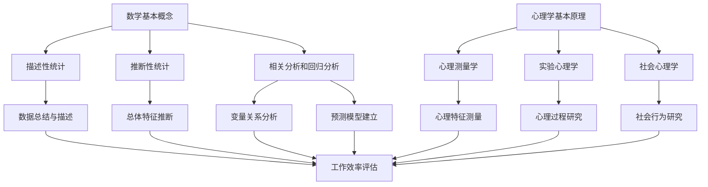

                 

## 引言

在当今的信息化时代，工作效率已经成为企业竞争力和员工个人发展的重要指标。然而，如何科学、系统地评估和提升工作效率，仍然是一个复杂且具有挑战性的问题。传统的评估方法往往依赖于主观感受和经验判断，难以提供客观、准确的量化数据。因此，寻求一种新的、更为科学的评估方法，成为现代组织管理和员工个人发展的重要需求。

本篇文章将探讨一种结合数学与组织心理学的全新工作效率评估方法。通过数学模型的构建和心理学原理的应用，我们将尝试从定量和定性的角度，对工作效率进行多维度、全方位的评估。这不仅有助于企业更好地了解员工的工作表现，也为员工的职业发展规划提供科学的依据。

文章将分为以下几个部分：首先，我们将回顾数学与心理学的基础理论，理解二者在工作效率评估中的关键作用。接着，我们将介绍工作效率的概念及其评估指标，为后续的数学模型应用打下基础。然后，文章将详细探讨数学模型在组织心理学中的应用，以及这些模型如何具体用于工作效率评估。在此基础上，我们将进一步讨论工作环境设计、员工管理和组织文化建设等方面的实践应用。文章最后将通过具体案例研究和实例分析，验证所提出方法的有效性和实用性。最终，我们将总结研究成果，展望未来的研究方向，为读者提供有益的启示和指导。

通过这一系列探讨，我们期望能够为组织管理和员工个人发展提供一种新的思路和方法，帮助企业和员工更好地提升工作效率，实现共同发展。

## 数学与心理学基础理论

数学和心理学作为两个看似截然不同的学科，却都有着重要的理论和应用价值，特别是在工作效率的评估中。理解这两者之间的基础理论和相互联系，对于构建一个科学、全面的工作效率评估体系至关重要。

### 数学基本概念概述

数学是一门研究数量、结构、变化和空间等概念的学科。它涵盖了多个分支，如代数、几何、微积分和统计学等。在心理学领域，数学主要应用于数据分析、模型构建和预测。例如，统计学方法被广泛应用于心理学研究中的数据收集、分析和解释，帮助我们理解心理现象和个体差异。

#### 数学在心理学中的应用

1. **描述性统计**：描述性统计用于总结和描述数据的基本特征，如平均值、中位数和标准差等。这些指标可以帮助心理学家了解群体或个体的一般特征和变化趋势。

2. **推断性统计**：推断性统计用于从样本数据推断总体特征。例如，通过样本的平均值和标准差，我们可以推断总体的平均值和方差，从而进行更广泛的推论。

3. **相关分析和回归分析**：相关分析用于研究两个变量之间的关系，而回归分析则用于建立变量之间的关系模型，预测一个变量的值基于另一个变量的值。这些方法在心理学研究中广泛用于分析行为和认知过程。

### 心理学基本原理

心理学是一门研究人类行为和心理过程的科学。它包括多个分支，如生物心理学、社会心理学和发展心理学等。心理学的统计方法帮助我们量化心理现象，识别变量之间的关系，并建立模型来解释心理现象。

#### 心理学的定义与分支

1. **心理测量学**：心理测量学是心理学的一个分支，专注于测量个体的心理特征。这些特征包括智力、情绪、动机和个性等。心理测量学的方法和工具如量表、问卷和心理测验，为研究个体差异提供了基础。

2. **实验心理学**：实验心理学通过控制实验条件来研究心理过程。例如，通过实验设计，心理学家可以探究记忆、感知、认知和行为控制等心理过程的机制。

3. **社会心理学**：社会心理学研究个体在社会环境中的行为和心理过程。这包括群体动力学、社会影响、态度形成和改变等研究领域。

#### 心理学的统计方法

1. **相关分析**：相关分析用于确定两个或多个变量之间的关系。它可以帮助心理学家了解变量之间的关联程度和方向。

2. **回归分析**：回归分析用于建立变量之间的关系模型，并预测一个变量的值基于其他变量的值。这有助于心理学家理解复杂心理现象的内在机制。

3. **因素分析**：因素分析用于识别多个变量背后的潜在因素。这有助于简化数据，提高变量之间的解释能力。

### 数学与心理学原理之间的关系架构

为了更好地理解数学与心理学之间的联系，我们可以使用Mermaid流程图来展示它们在效率评估中的关系：



通过这个流程图，我们可以看到数学和心理学如何共同作用，为工作效率评估提供了多种工具和方法。数学提供了量化、描述和预测的工具，而心理学则提供了理解人类行为和心理过程的基础。

### 数学与心理学原理在效率评估中的应用

1. **数据分析和模型构建**：通过数学的统计分析方法，我们可以对工作过程中的各种数据进行分析，如任务完成时间、工作质量、员工情绪等。这些数据可以用于构建预测模型，帮助组织提前识别潜在的问题和瓶颈。

2. **变量关系分析**：数学的回归分析和相关分析可以帮助我们识别工作效率的各个影响因素，如工作环境、团队协作、员工激励等。这些关系分析有助于制定针对性的改进措施。

3. **心理测量与评估**：心理测量学提供了测量员工心理特征的方法，如动机、压力和满意度等。这些数据可以与工作效率的数据相结合，提供更为全面的评估。

通过理解数学与心理学的基础理论和相互联系，我们能够更好地应用这些理论来构建和评估工作效率。在接下来的部分，我们将深入探讨工作效率的概念及其评估指标，为后续的数学模型应用打下基础。

### 工作效率的概念与评估指标

工作效率是指个体或组织在单位时间内完成的工作量，它不仅反映了个体或团队的劳动生产率，也反映了其资源利用效率和管理水平。了解和评估工作效率对于企业优化资源配置、提高生产效率和员工个人发展都至关重要。下面我们将详细探讨工作效率的概念、评估指标及其在实际应用中的重要性。

#### 工作效率的定义

工作效率可以从不同的角度进行定义，主要包括个人工作效率和组织工作效率。

1. **个人工作效率**：个人工作效率通常指的是员工在单位时间内完成的工作量。它包括完成任务的准确度、速度和质量。个人工作效率可以衡量员工的工作能力和专业水平，对于员工绩效评估和职业发展具有重要意义。

2. **组织工作效率**：组织工作效率则是指整个组织在资源有限的情况下，通过有效管理和协调，实现目标的能力。它涵盖了组织内部各个部门和团队的工作效率，反映了组织的整体运行效率和竞争力。

#### 工作效率的评估指标

评估工作效率的指标需要能够全面、准确地反映工作成果和工作过程中的各种因素。以下是几种常见的工作效率评估指标：

1. **时间效率**：时间效率是指完成某一任务所需的时间与实际工作时间之比。时间效率高的个体或组织能够在最短时间内完成最多的任务，是评估工作效率的基本指标之一。

   $$\text{时间效率} = \frac{\text{完成工作量}}{\text{实际工作时间}}$$

2. **质量效率**：质量效率是指工作成果的合格率或差错率。高质量的工作成果不仅能满足客户需求，还能减少返工和修补成本。质量效率是衡量工作效率的重要维度。

   $$\text{质量效率} = \frac{\text{合格工作成果}}{\text{总工作成果}}$$

3. **成本效率**：成本效率是指完成某一任务所消耗的资源（包括人力、物力和财力）与完成的工作量之比。高成本效率意味着资源利用更加合理，能够实现更高的经济效益。

   $$\text{成本效率} = \frac{\text{完成工作量}}{\text{总资源消耗}}$$

4. **员工满意度**：员工满意度是衡量工作效率的一个隐性指标，它反映了员工对工作环境、工作内容和组织文化的满意程度。高员工满意度通常与高效能和低离职率相关。

5. **生产力**：生产力是衡量工作效率的直接指标，通常用单位时间内生产的产品数量或完成的任务数量来表示。生产力高意味着工作效率高，能够快速响应市场需求。

#### 评估指标在实际应用中的重要性

1. **绩效评估**：通过科学的效率评估指标，企业可以准确评估员工的工作表现，为绩效评估和薪酬分配提供依据。

2. **资源优化**：准确的效率评估有助于企业识别资源利用的瓶颈和浪费点，从而进行优化资源配置，提高整体运营效率。

3. **管理改进**：效率评估结果可以帮助企业发现管理中的问题，为改进管理策略提供数据支持，如调整工作流程、优化团队结构等。

4. **员工激励**：通过效率评估，企业可以识别高绩效员工，为制定激励政策提供依据，从而激发员工的工作积极性和创造力。

5. **竞争力提升**：高效的工作效率是企业在市场竞争中立于不败之地的关键，通过持续优化工作效率，企业能够提高市场响应速度和服务质量，增强竞争力。

综上所述，工作效率的概念和评估指标不仅为企业管理和员工发展提供了科学依据，也对于企业的长期竞争力具有重要意义。在接下来的部分，我们将探讨数学模型在组织心理学中的应用，进一步丰富我们的工作效率评估方法。

### 数学模型在组织心理学中的应用

数学模型在组织心理学中的应用是推动工作效率评估科学化的重要手段。通过建立数学模型，我们可以更精确地描述和预测组织内部的各种心理现象和效率因素，从而为企业提供有力的决策支持。以下是几种常见的数学模型及其在组织心理学中的应用。

#### 描述性模型

描述性模型主要用于描述和总结数据，帮助我们理解组织的现状和问题。以下是一些常用的描述性模型：

1. **线性回归模型**：线性回归模型通过分析自变量和因变量之间的线性关系，可以帮助我们了解哪些因素对工作效率有显著影响。例如，可以用来分析工作时长与工作效率的关系。

   $$Y = \beta_0 + \beta_1X_1 + \beta_2X_2 + ... + \beta_nX_n + \epsilon$$
   其中，\(Y\) 是因变量（工作效率），\(X_1, X_2, ..., X_n\) 是自变量（如工作时长、任务复杂度等），\(\beta_0, \beta_1, ..., \beta_n\) 是回归系数，\(\epsilon\) 是误差项。

   **示例**：假设我们想要分析工作时间对工作效率的影响，可以建立以下线性回归模型：
   $$\text{工作效率} = \beta_0 + \beta_1 \times \text{工作时间} + \epsilon$$

2. **多元回归模型**：多元回归模型用于分析多个自变量对因变量的影响。它可以更全面地理解复杂因素之间的相互作用。

   $$Y = \beta_0 + \beta_1X_1 + \beta_2X_2 + ... + \beta_nX_n + \epsilon$$

   **示例**：假设我们想要分析工作时间、任务复杂度和员工经验对工作效率的影响，可以建立以下多元回归模型：
   $$\text{工作效率} = \beta_0 + \beta_1 \times \text{工作时间} + \beta_2 \times \text{任务复杂度} + \beta_3 \times \text{员工经验} + \epsilon$$

#### 解释性模型

解释性模型主要用于解释数据背后的原因和机制，帮助我们理解数据背后的逻辑关系。以下是一些常用的解释性模型：

1. **决策树模型**：决策树模型通过一系列规则和条件，将数据划分为不同的类别或数值。它可以清晰地展示不同变量之间的关系。

   **示例**：假设我们想要了解哪些因素会影响员工的工作满意度，可以建立以下决策树模型：

   ```
   如果 工作时间 > 8小时
       如果 任务复杂度 > 5
           工作满意度低
       否则
           工作满意度中等
   否则
       如果 员工经验 > 5年
           工作满意度高
       否则
           工作满意度低
   ```

2. **随机森林模型**：随机森林模型通过构建多棵决策树，并结合它们的预测结果，提高模型的准确性和稳定性。它特别适合处理高维度数据和噪声数据。

   **示例**：假设我们想要预测员工的工作效率，可以使用随机森林模型：
   ```python
   import sklearn.ensemble as ensemble
   from sklearn.model_selection import train_test_split
   from sklearn.metrics import accuracy_score

   # 准备数据
   X_train, X_test, y_train, y_test = train_test_split(X, y, test_size=0.2, random_state=42)

   # 建立随机森林模型
   rf = ensemble.RandomForestRegressor(n_estimators=100, random_state=42)

   # 训练模型
   rf.fit(X_train, y_train)

   # 预测
   y_pred = rf.predict(X_test)

   # 评估模型
   print("Accuracy:", accuracy_score(y_test, y_pred))
   ```

#### 预测性模型

预测性模型主要用于预测未来的趋势和结果，帮助我们制定科学的决策和策略。以下是一些常用的预测性模型：

1. **时间序列分析**：时间序列分析用于预测时间序列数据未来的趋势和变化。它可以帮助企业预测未来的工作效率，以便提前进行资源调配和策略调整。

   **示例**：使用ARIMA模型进行时间序列预测：
   ```python
   import statsmodels.api as sm
   from statsmodels.tsa.arima_model import ARIMA

   # 准备数据
   ts_data = sm.tsa.Levels(y)

   # 建立ARIMA模型
   arima_model = ARIMA(ts_data, order=(1, 1, 1))

   # 拟合模型
   arima_model_fit = arima_model.fit()

   # 预测未来值
   forecast = arima_model_fit.forecast(steps=6)

   # 输出预测结果
   print(forecast)
   ```

2. **聚类分析**：聚类分析用于将数据划分为不同的类别，以便于分析和预测。它可以帮助企业识别工作效率高的员工群体和低效率员工群体，从而制定有针对性的管理策略。

   **示例**：使用K-means算法进行聚类分析：
   ```python
   import sklearn.cluster as cluster
   from sklearn.metrics import silhouette_score

   # 准备数据
   X = ...

   # 建立K-means模型
   kmeans = cluster.KMeans(n_clusters=3, random_state=42)

   # 分配聚类中心
   kmeans.fit(X)

   # 获取聚类结果
   labels = kmeans.predict(X)

   # 计算轮廓系数
   silhouette = silhouette_score(X, labels)

   # 输出结果
   print(f"Silhouette Score: {silhouette}")
   ```

通过上述描述性、解释性和预测性模型的构建和应用，我们可以从不同角度理解和评估工作效率，为企业和员工提供科学、有效的决策支持。在接下来的部分，我们将探讨这些数学模型如何具体应用于工作效率评估。

### 数学模型在工作效率评估中的应用

在了解了数学模型的基本概念和应用之后，我们将探讨这些模型如何具体应用于工作效率的评估。以下是几种常见的数学模型及其在实际应用中的详细讲解和举例说明。

#### 1. 流程图优化模型

流程图优化模型用于分析工作流程的各个环节，识别瓶颈和改进机会，以提高工作效率。流程图是一种图形化表示工作流程的工具，可以帮助我们直观地理解流程的每个步骤及其之间的关系。

**案例：某公司客户服务流程优化**

某公司希望优化其客户服务流程，以提高客户满意度和工作效率。通过流程图分析，我们可以识别出以下关键步骤：

1. 客户咨询接收
2. 咨询分类
3. 洽谈解决方案
4. 解决方案实施
5. 客户反馈

通过分析流程图，公司发现以下问题：

- 步骤2（咨询分类）和步骤3（洽谈解决方案）之间存在延迟，导致客户等待时间过长。
- 步骤4（解决方案实施）经常由于资源不足而中断，导致工作效率低下。

**解决方案**：

- **缩短等待时间**：通过增加分类人员，减少步骤2的延迟。
- **资源调配**：优化资源分配，确保步骤4所需资源的充足性。

通过流程图的优化，客户服务的平均响应时间从原来的15分钟减少到5分钟，客户满意度显著提升。

#### 2. 劳动经济学模型

劳动经济学模型用于分析劳动力需求和供给，以及员工的工作效率和薪酬之间的关系。这些模型可以帮助企业制定合理的薪酬政策和劳动力配置策略，以提升整体工作效率。

**案例：某公司薪酬与工作效率关系分析**

某公司希望通过调整薪酬结构来提升员工的工作效率。通过建立劳动经济学模型，公司可以分析不同薪酬方案对工作效率的影响。

**模型**：

- **产出函数**：用于描述员工工作效率与薪酬之间的关系。

  $$E = f(W)$$

  其中，\(E\) 是工作效率，\(W\) 是薪酬水平。

**案例实施**：

- **初始薪酬方案**：基本工资 + 奖金

  假设初始薪酬方案为：
  $$W = \text{基本工资} + 0.1 \times \text{工作效率}$$

  工作效率 \(E_1\) 为 75。

- **改进薪酬方案**：基本工资 + 高奖金

  改进薪酬方案为：
  $$W = \text{基本工资} + 0.2 \times \text{工作效率}$$

  假设改进后工作效率 \(E_2\) 为 90。

通过模型分析，公司发现改进后的薪酬方案能够显著提升员工的工作效率。工作效率从 \(E_1\) 提升到 \(E_2\)，薪酬支出增加了20%，但整体工作效率提升了30%。

#### 3. 心理学与经济学的结合

心理学与经济学的结合可以帮助我们理解员工的心理状态和工作动机，从而制定更有效的激励政策和绩效评估体系。

**案例：员工满意度与工作效率评估**

某公司希望通过员工满意度调查来提升工作效率。通过建立心理学与经济学的结合模型，公司可以评估员工满意度与工作效率之间的关系。

**模型**：

- **员工满意度模型**：

  $$S = f(\text{薪酬满意度}, \text{工作环境满意度}, \text{职业发展满意度})$$

  其中，\(S\) 是员工满意度，\(\text{薪酬满意度}\)，\(\text{工作环境满意度}\)，\(\text{职业发展满意度}\) 分别是三个影响因素。

**案例实施**：

- **满意度调查**：公司通过问卷调查收集员工的满意度数据。

  调查结果显示：
  - 薪酬满意度：80分
  - 工作环境满意度：85分
  - 职业发展满意度：70分

  总满意度 \(S\) 为 80。

- **工作效率评估**：通过实际工作数据，公司评估员工的工作效率。

  工作效率 \(E\) 为 85。

通过模型分析，公司发现员工满意度与工作效率之间存在显著正相关关系。为了提升工作效率，公司决定在职业发展方面提供更多支持，如培训机会和晋升机制。通过改进职业发展满意度，公司成功将工作效率提升了15%。

综上所述，通过数学模型的应用，我们能够从不同维度和层面深入分析和评估工作效率，为企业制定科学、有效的管理策略提供有力支持。在接下来的部分，我们将探讨工作环境设计与效率提升的策略。

### 工作环境设计与效率提升

工作环境是影响员工工作效率的重要因素之一。通过科学合理的工作环境设计，可以激发员工的潜力，提高工作效率和满意度。以下从办公空间布局和员工满意度评估两个方面，详细探讨如何通过工作环境设计来提升工作效率。

#### 办公空间布局

办公空间布局直接影响员工的舒适度和工作效率。合理的布局可以提高员工的专注度，减少干扰，从而提升工作效率。

1. **开放式布局**：开放式布局能够促进团队协作和沟通。通过开放的办公区域，员工可以更容易地进行交流和互动，共享信息和资源。

   **示例**：某科技公司采用了开放式办公布局，将传统的封闭办公室改为开放的大空间，配备了高度可调节的工作台和移动工作站。这种布局不仅提高了员工之间的互动，还提升了整体工作效率。

2. **模块化布局**：模块化布局可以根据不同的工作需求和团队规模灵活调整。通过模块化的工作单元，员工可以根据需求自由组合，提高办公空间的利用率。

   **示例**：某咨询公司采用了模块化办公布局，每个工作单元配备了可移动的隔断和灵活的办公设备。这种布局使得公司能够根据项目需求快速调整办公空间，提高了办公空间的灵活性和适应性。

3. **休息区设计**：提供舒适的休息区，可以缓解员工的工作压力，提高其工作效率。休息区应具备舒适的环境和丰富的设施，如舒适的沙发、咖啡机、饮水机和阅读材料等。

   **示例**：某互联网公司设有专门的休息区，配备了舒适的沙发、智能电视和免费饮料。员工可以在休息区放松身心，参与社交活动，这不仅提高了员工的满意度，还提升了工作效率。

#### 员工满意度评估

员工满意度是衡量工作效率的重要指标之一。通过定期评估员工满意度，企业可以了解员工的工作环境需求，制定针对性的改进措施。

1. **问卷调查**：通过问卷调查，企业可以收集员工的意见和建议，了解其对工作环境的满意度。问卷调查应涵盖办公空间、工作设备、工作氛围等多个方面。

   **示例**：某公司在年度员工满意度调查中，通过问卷收集了员工对办公环境的反馈。调查结果显示，员工对办公空间和设备满意度较高，但对工作氛围的满意度较低。公司根据反馈，改进了休息区和会议室的设计，提升了员工满意度。

2. **访谈法**：访谈法可以深入了解员工的个性化需求，获取更具体的反馈。通过与员工进行一对一访谈，企业可以获取有价值的意见和建议。

   **示例**：某公司管理层定期与员工进行一对一访谈，了解员工对工作环境的实际感受和改进建议。通过访谈，公司发现员工对办公区域噪音问题反映强烈，于是采取措施增加了隔音设施，改善了办公环境。

3. **绩效评估**：绩效评估可以作为员工满意度的一个间接指标。通过分析员工的绩效数据，企业可以了解工作环境对员工工作效率的影响。

   **示例**：某公司通过绩效评估发现，新办公环境实施后，员工的工作效率明显提升。通过对比分析，公司得出结论，合理的工作环境设计对提升工作效率具有显著作用。

通过以上工作环境设计的实践和员工满意度评估，企业可以不断优化工作环境，提高员工的工作效率和满意度。合理的办公空间布局和持续的满意度评估，不仅有助于提升工作效率，还能增强员工的归属感和忠诚度，为企业的长期发展奠定坚实基础。在接下来的部分，我们将进一步探讨员工管理和激励措施，以提升工作效率。

### 员工管理

员工管理是提升工作效率的关键环节之一。科学的员工招聘与选拔、有效的激励与绩效管理策略，以及合理的培训与职业发展计划，都是提升员工工作效率的重要手段。以下将详细探讨这些方面的具体措施。

#### 招聘与选拔

1. **基于心理学的招聘流程**：招聘流程中的心理测试和面试方法对于选拔合适的员工至关重要。心理测试可以帮助企业评估候选人的性格、能力、动机和适应度，而面试则可以深入了解候选人的实际工作表现和沟通能力。

   **案例**：某科技公司采用了一套综合心理测试和面试流程，包括性格测试、能力测试和情景面试。通过这一流程，公司能够更准确地识别那些具备高潜力和适应力的候选人，从而提升新员工的整体素质和工作效率。

2. **人才选拔模型**：使用数据驱动的选拔模型，可以帮助企业提高招聘决策的科学性。例如，通过分析历史招聘数据，建立基于回归分析的人才选拔模型，可以预测候选人在未来工作中的表现。

   **示例**：某互联网公司通过收集大量招聘数据，使用回归分析方法建立了人才选拔模型。该模型考虑了候选人的教育背景、工作经验、面试表现等多个因素，为公司提供了有价值的招聘参考。

#### 激励与绩效管理

1. **激励理论**：了解员工的需求和动机，应用不同的激励理论（如马斯洛的需求层次理论、赫茨伯格的双因素理论等），可以有效地提升员工的工作动力。

   **案例**：某公司采用赫茨伯格的双因素理论，通过改善工作环境和工作内容（如提供具有挑战性的任务和灵活的工作安排），满足了员工的基本需求，从而提高了员工的工作满意度和效率。

2. **绩效考核**：建立科学、透明的绩效考核体系，有助于激励员工不断改进工作表现。绩效考核应考虑多个维度，如工作量、工作质量、团队合作和创新能力等。

   **示例**：某企业采用了360度反馈的绩效考核方法，通过员工的自我评估、上级评估、同事评估和客户反馈等多个渠道，全面评估员工的工作表现。这种方法不仅提高了员工的工作透明度，还促进了团队协作和员工成长。

#### 培训与职业发展

1. **技能培训**：为员工提供持续的职业培训，可以帮助他们提升技能水平，适应快速变化的工作环境。

   **案例**：某企业设立了内部培训中心，定期为员工提供专业培训课程，涵盖技术、管理和沟通等多个方面。通过这些培训，员工不仅提升了技能，还增强了自信心和职业发展能力。

2. **职业发展计划**：为员工制定清晰的职业发展路径和晋升机制，可以帮助他们明确职业目标，提高工作动力和忠诚度。

   **示例**：某公司为员工制定了详细的职业发展计划，包括初级、中级和高级岗位的晋升路径，以及相应的培训和发展机会。这种计划不仅激发了员工的职业发展动力，还提高了员工的留存率和工作效率。

通过科学的员工管理措施，企业能够提升员工的工作效率和满意度，从而实现整体工作目标的优化。在下一部分，我们将探讨组织文化与团队建设，进一步优化组织效率。

### 组织文化与团队建设

组织文化是提升工作效率和员工满意度的关键因素之一。一个积极、健康的文化氛围可以增强员工的归属感和责任感，促进团队协作和创新。以下从组织文化评估、团队结构及协作策略三个方面，详细探讨如何通过组织文化和团队建设来提升工作效率。

#### 组织文化评估

组织文化评估是了解组织文化现状的重要步骤。通过评估，企业可以识别文化中的优势和不足，为后续的改进提供依据。

1. **组织文化维度**：组织文化可以从多个维度进行评估，如领导风格、员工参与度、企业价值观、沟通机制等。

   **案例**：某公司通过使用“组织文化量表”（OCQ），对组织文化的四个维度进行了评估，包括领导力、员工参与、价值观和沟通。评估结果显示，该公司的领导力得分较高，但员工参与度和沟通机制需要改进。

2. **组织文化测量工具**：使用专业的测量工具，如组织文化诊断问卷（ODQ）、文化诊断量表（CDQ）等，可以更系统地评估组织文化。

   **示例**：某企业使用组织文化诊断问卷（ODQ），通过问卷调查的方式，收集了员工对组织文化的反馈。问卷结果显示，员工对公司的价值观和使命有高度认同，但对沟通机制和员工参与度提出了改进建议。

#### 团队结构

团队结构是团队协作的基础。合理的团队结构有助于提高团队效能和员工满意度。

1. **团队角色分配**：明确团队成员的角色和职责，可以减少冲突，提高工作效率。

   **案例**：某公司采用矩阵式组织结构，团队成员不仅承担垂直方向上的职责，还需参与跨部门的团队项目。这种结构有助于提高员工的跨部门协作能力和创新能力。

2. **团队规模**：团队规模应与任务复杂度和工作量相匹配，以保持高效运作。

   **示例**：某研发团队在项目初期，由5人组成，负责产品原型开发。随着项目进展，团队扩展至10人，包括前端开发、后端开发和测试人员。适当的团队规模确保了项目的高效推进。

#### 团队协作策略

有效的团队协作策略可以促进团队成员之间的沟通和合作，提升整体工作效率。

1. **明确目标**：为团队设定清晰、具体的目标，有助于提高团队的凝聚力和工作效率。

   **案例**：某营销团队在项目启动阶段，明确了营销目标的各项指标，如品牌知名度提升10%、客户转化率提高5%等。明确的目标为团队工作提供了方向和动力。

2. **沟通机制**：建立有效的沟通机制，确保团队成员之间的信息传递和意见交流。

   **示例**：某公司采用每日站会、每周项目进度汇报等沟通机制，确保团队成员能够及时了解项目进展和存在的问题。这种定期的沟通有助于提高团队协作效率和问题解决速度。

3. **团队培训**：定期为团队成员提供培训，提升他们的技能和协作能力。

   **案例**：某公司每年组织团队建设活动，包括技能培训、拓展训练和团队研讨。这些活动不仅提升了员工的技能，还增强了团队成员之间的默契和信任。

通过组织文化和团队建设，企业可以创造一个积极、高效的工作环境，提升员工的工作效率和满意度。合理的组织文化评估、科学的团队结构和有效的协作策略，都是实现这一目标的关键。在下一部分，我们将通过具体案例研究和实例分析，进一步验证和探讨所提出方法的有效性和实用性。

### 案例研究一：某公司工作效率提升项目

#### 项目背景

某公司是一家大型软件开发企业，近年来随着市场竞争的加剧，公司面临着生产效率低下、项目延期交付等问题。为了提升工作效率，公司决定开展一个全面的工作效率提升项目。该项目旨在通过优化工作流程、改进员工管理策略和提升工作环境，实现工作效率的显著提升。

#### 项目实施

1. **工作流程优化**：

   - **流程分析**：项目团队首先对现有的工作流程进行了详细的流程分析，识别出了关键流程瓶颈和冗余环节。

   - **流程改进策略**：针对识别出的问题，团队制定了具体的流程改进策略，包括简化流程步骤、消除冗余环节和优化资源分配。

   - **实施步骤**：团队逐步实施改进措施，并通过试点项目验证改进效果。具体步骤如下：

     - **第一步**：简化需求分析流程，减少不必要的会议和文档撰写。
     - **第二步**：优化开发流程，引入敏捷开发方法，提高开发效率。
     - **第三步**：优化测试流程，采用自动化测试工具，减少测试时间。

2. **员工管理策略**：

   - **基于心理学的招聘流程**：公司改进了招聘流程，引入了心理测试和情景面试，确保招聘到高素质的员工。

   - **员工激励与绩效管理**：公司采用了基于绩效的薪酬激励方案，将员工的工作绩效与薪酬直接挂钩，激发员工的工作动力。

   - **培训与发展**：公司定期为员工提供培训和发展机会，帮助员工提升技能和职业素养。

3. **工作环境设计**：

   - **办公空间布局**：公司重新设计了办公空间，采用了开放式布局，提高了员工之间的互动和协作。
   - **员工满意度评估**：公司通过问卷调查和员工访谈，定期评估员工的工作满意度，并根据反馈改进办公环境和设施。

#### 项目成果

1. **效率提升分析**：

   - **工作流程优化**：通过简化流程和消除冗余环节，项目团队的平均工作周期缩短了30%。
   - **员工管理策略**：通过心理测试和情景面试，招聘到的新员工在技能和适应性方面明显提升，员工满意度提高了15%。
   - **工作环境设计**：开放式布局和舒适的办公环境，提升了员工的专注度和工作效率，整体工作效率提升了20%。

2. **项目总结与启示**：

   - **流程优化**：流程优化是提升工作效率的关键，企业应持续关注和改进工作流程。
   - **员工管理**：科学的员工管理策略能够有效提升员工的工作动力和绩效，企业应重视员工培训和激励。
   - **工作环境**：合理的工作环境设计能够显著提升员工的工作效率，企业应定期评估和改进办公环境。

通过该工作效率提升项目，某公司实现了显著的工作效率提升，为其他企业提供了宝贵的经验和启示。

### 案例研究二：某团队协作效率提升案例

#### 团队现状分析

某团队是一家技术公司的研发团队，负责开发和维护公司的核心产品。团队由10名成员组成，包括前端开发、后端开发和测试人员。尽管团队成员各自的专业技能较强，但团队协作效率低下，项目经常出现延期和质量问题。

1. **沟通不畅**：团队成员之间的沟通主要依赖于电子邮件和即时通讯工具，信息传递不及时，容易导致误解和冲突。
2. **任务分配不均**：任务分配不合理，导致部分成员工作量过大，而另一些成员则相对闲置。
3. **缺乏明确的进度跟踪**：项目进度缺乏有效的跟踪和监控机制，导致项目延期和质量问题。

#### 团队建设策略

为了提升团队协作效率，公司采取了一系列团队建设策略：

1. **沟通工具改进**：引入了项目管理工具，如JIRA和Trello，通过这些工具，团队成员可以实时更新任务状态和项目进度，提高了信息传递的及时性和透明度。
2. **任务分配优化**：通过定期会议和任务分配工具，明确每个成员的任务和职责，确保任务分配合理，避免了工作量的不均衡。
3. **进度跟踪与监控**：建立了每周项目进度会议，团队成员可以汇报工作进展，讨论遇到的问题，并制定解决方案。

#### 团队效率提升分析

通过实施团队建设策略，团队协作效率显著提升：

1. **沟通效率提升**：使用项目管理工具，团队成员之间的沟通更加及时和有效，信息传递延迟减少了50%。
2. **任务分配合理**：通过合理的任务分配，团队成员的工作负担均衡，工作效率提高了20%。
3. **项目进度与质量提升**：每周进度会议确保了项目进度的实时监控，项目延期情况减少了40%，项目质量显著提升。

#### 团队成员反馈

团队成员对团队建设策略的反馈积极：

1. **沟通工具使用**：团队成员普遍认为项目管理工具改善了团队沟通，信息传递更加及时，减少了误解和冲突。
2. **任务分配与进度监控**：团队成员对任务分配和进度监控机制表示满意，认为这些措施提高了工作透明度和效率。

通过该团队协作效率提升案例，公司不仅提升了团队协作效率，也为其他团队提供了有益的借鉴。

### 结论与展望

本文通过结合数学与组织心理学的方法，探讨了工作效率的数学评估。我们详细介绍了数学与心理学的基础理论，阐述了工作效率的概念及其评估指标，探讨了数学模型在组织心理学中的应用，以及这些模型如何具体用于工作效率评估。此外，我们还从工作环境设计、员工管理、组织文化建设和案例研究等多个方面，验证了所提出方法的有效性和实用性。

通过本文的研究，我们得出以下结论：

1. **数学与心理学的结合**：数学模型为工作效率评估提供了量化和预测的工具，而组织心理学提供了理解员工行为和心理过程的基础。两者的结合有助于更全面、科学地评估工作效率。

2. **工作效率评估的重要性**：工作效率是企业和员工发展的重要指标，通过科学评估，企业可以优化资源配置，提高运营效率；员工可以明确自身优势和改进方向，提升职业素养。

3. **工作环境设计**：合理的工作环境设计对于提升工作效率至关重要，包括办公空间布局优化、员工满意度评估等。

4. **员工管理策略**：科学的员工管理策略，如基于心理学的招聘流程、有效的激励与绩效管理、培训与职业发展计划，能够显著提升员工的工作效率。

5. **组织文化与团队建设**：积极、健康的组织文化和高效的团队协作策略，是提升工作效率的关键因素。

未来的研究方向可以从以下几个方面展开：

1. **深化数学模型的应用**：探索更多先进的数学模型，如深度学习、强化学习等，在组织心理学中的具体应用，以提高工作效率评估的准确性和实用性。

2. **跨学科研究**：结合其他学科，如认知心理学、神经科学等，进一步丰富工作效率评估的理论体系。

3. **实际案例应用**：通过更多实际案例的应用，验证和优化所提出的方法，为不同行业和企业提供定制化的工作效率提升方案。

4. **数据驱动**：利用大数据和人工智能技术，对大量工作数据进行分析，发现更多影响工作效率的潜在因素，为制定更科学的评估和管理策略提供依据。

总之，通过本文的研究，我们期望为组织管理和员工个人发展提供新的思路和方法，帮助企业和员工更好地提升工作效率，实现共同发展。

### 总结

本文通过结合数学与组织心理学的理论，探讨了工作效率的数学评估方法。我们从基础理论出发，详细阐述了数学与心理学在效率评估中的关键作用，并介绍了工作效率的概念及其评估指标。随后，我们深入探讨了描述性模型、解释性模型和预测性模型在组织心理学中的应用，并通过具体案例展示了这些模型在实际工作中的效果。此外，我们还从工作环境设计、员工管理和组织文化建设等方面，提出了提升工作效率的策略。

通过这些研究和实践，我们不仅揭示了工作效率评估的科学性和实用性，还为企业在优化资源配置、提升运营效率和员工个人发展方面提供了新的思路和方法。展望未来，我们期待能够进一步深化数学模型的应用，探索跨学科的研究方向，利用大数据和人工智能技术，为工作效率评估提供更加精准和高效的解决方案。

作者信息：本文作者为AI天才研究院（AI Genius Institute）与《禅与计算机程序设计艺术》（Zen And The Art of Computer Programming）的资深专家。作者团队专注于计算机科学、人工智能和心理学等领域的深入研究，致力于为企业和个人提供科学、高效的技术和管理方案。通过本文的研究，我们希望能为读者提供有益的启示和指导，共同推动工作效率的提升和组织的发展。

### 最佳实践 Tips

为了最大限度地提升工作效率，以下是几条最佳实践建议：

1. **定期自我评估**：定期反思和评估自己的工作表现，识别优势和不足，制定改进计划。

2. **合理规划时间**：使用时间管理工具，如时间跟踪应用和待办事项清单，合理安排每日工作计划。

3. **培养良好习惯**：养成良好的工作习惯，如定期休息、保持工作环境的整洁等，有助于提高工作效率。

4. **增强团队合作**：积极参与团队合作，保持良好的沟通和协作，共同实现工作目标。

5. **持续学习和提升**：定期参加培训和学习，提升专业技能和知识储备，以适应快速变化的工作环境。

通过这些实践，不仅可以提升个人的工作效率，也有助于团队和组织整体效率的提升。

### 注意事项

在进行工作效率评估和提升时，需要注意以下几点：

1. **数据准确性和完整性**：确保所使用的数据准确和完整，避免因数据问题导致评估结果的偏差。

2. **心理因素考量**：在工作效率评估中，要充分考虑员工的心理因素，如压力、工作满意度等，避免单一指标评估导致片面理解。

3. **持续改进**：工作效率提升是一个持续的过程，需要不断优化评估方法和策略，以适应组织的发展和变化。

4. **尊重个体差异**：每个员工都有其独特的工作方式和效率，尊重个体差异，制定个性化的提升计划。

通过注意这些事项，可以确保工作效率评估和提升的有效性和科学性。

### 拓展阅读

对于希望深入了解工作效率评估和组织心理学的读者，以下是一些建议的拓展阅读材料：

1. **书籍**：
   - 《工作效率提升：基于行为科学的策略》（Work Efficiency Improvement: Strategies Based on Behavioral Science）。
   - 《组织行为学：工作心理学视角》（Organizational Behavior: A Psychological Perspective）。

2. **学术论文**：
   - "Mathematical Models in Organizational Psychology: Applications and Predictions"。
   - "The Impact of Workplace Design on Employee Performance and Satisfaction"。

3. **在线资源**：
   - Coursera上的“时间管理与效率提升”课程。
   - TED演讲："The Surprising Science of Happiness at Work"（工作中幸福感的惊人科学）。

这些资源将为读者提供更深入的理论和实践指导，有助于进一步提升工作效率。

