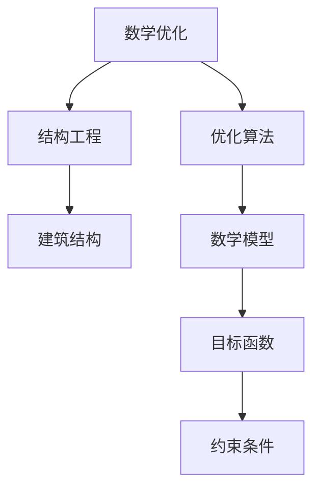

                 


## 文章标题：数学与结构工程：建筑结构的数学优化

### 关键词：数学优化，结构工程，建筑结构，线性规划，非线性规划，优化算法

#### 摘要：

本文将探讨数学优化在结构工程，特别是建筑结构设计中的应用。通过详细讲解线性规划和非线性规划的核心算法原理，以及数学模型和公式的使用，我们旨在为读者提供一个全面了解建筑结构数学优化方法的框架。文章将以实际项目为例，展示如何使用这些优化算法进行建筑结构的优化设计，并分析其实际效果。

### Step 1: 核心概念与联系

#### 1.1 数学优化

数学优化是利用数学方法寻找给定函数的最大值或最小值的过程。在结构工程中，优化设计旨在找到满足既定约束条件的最优解，以实现建筑结构的最大化性能。

#### 1.2 结构工程

结构工程是应用科学原理来设计和建造各种结构系统的学科。建筑结构是结构工程的重要组成部分，包括建筑物的框架、梁、柱等。

#### 1.3 建筑结构

建筑结构是建筑物中的骨架系统，负责承受和传递荷载。通过优化设计，可以提高建筑结构的稳定性和耐久性。

#### 1.4 优化算法

优化算法是用于求解优化问题的一系列数学方法。包括线性规划、非线性规划、遗传算法等。

#### 1.5 数学模型

数学模型是描述实际问题的数学表达式，通常包括目标函数和约束条件。在结构工程中，数学模型用于模拟建筑结构的性能。

#### 1.6 数学公式

数学公式是用于表示数学模型和优化算法的重要工具。它们帮助工程师理解和分析建筑结构的特性。



### Step 2: 核心算法原理讲解

#### 2.1 线性规划

线性规划是数学优化中的一种方法，用于解决线性目标函数在给定线性约束条件下的最优解问题。其基本形式如下：

目标函数：
$$
\text{minimize} \quad c^T x
$$

约束条件：
$$
Ax \leq b
$$

其中，$x$ 是变量向量，$c$ 是目标函数系数向量，$A$ 和 $b$ 分别是约束条件的系数矩阵和常数向量。

线性规划广泛应用于资源分配、成本最小化等问题。其求解方法包括单纯形法、内点法等。

#### 2.2 非线性规划

非线性规划是解决非线性目标函数和约束条件的问题。其基本形式如下：

目标函数：
$$
\text{minimize} \quad f(x)
$$

约束条件：
$$
g_i(x) \leq 0, \quad h_j(x) = 0
$$

其中，$f(x)$ 是目标函数，$g_i(x)$ 和 $h_j(x)$ 分别是约束条件。

非线性规划问题更为复杂，常见的求解方法有梯度下降法、牛顿法、遗传算法等。

### Step 3: 数学模型和数学公式

#### 3.1 弹性理论

弹性理论是研究材料在受力作用下的变形和应力状态的学科。以下是一些常见的数学公式：

应力分量：
$$
\sigma_{ij} = \frac{1}{2} \left( \frac{\partial u_i}{\partial x_j} + \frac{\partial u_j}{\partial x_i} \right)
$$

位移分量：
$$
u_i = \frac{\partial u}{\partial x_i}
$$

应变分量：
$$
\epsilon_{ij} = \frac{1}{2} \left( \frac{\partial u_i}{\partial x_j} - \frac{\partial u_j}{\partial x_i} \right)
$$

#### 3.2 材料力学

材料力学研究材料在受力作用下的变形和破坏。以下是一些常用的数学公式：

应力 - 应变关系：
$$
\sigma = E \epsilon
$$

其中，$E$ 是弹性模量，$\epsilon$ 是应变。

应力 - 应力关系：
$$
\sigma_{ij} = \sum_k K_{ikj} \epsilon_k
$$

其中，$K_{ikj}$ 是刚度矩阵元素。

#### 3.3 刚度矩阵

刚度矩阵是描述结构系统刚度特性的数学工具。其定义如下：

刚度矩阵：
$$
K = \int_V B dV
$$

其中，$B$ 是几何矩阵元素，$V$ 是结构体积。

### Step 4: 项目实战

#### 4.1 建筑结构优化设计

##### 4.1.1 开发环境搭建

在本次项目中，我们将使用 Python 作为主要编程语言，结合 OpenMDAO 和 SciPy 库进行建筑结构的优化设计。以下是开发环境搭建的步骤：

1. 安装 Python 3.8 或更高版本。
2. 安装 OpenMDAO、SciPy、NumPy 和 Matplotlib 等相关库。

```bash
pip install python==3.8
pip install openmdao scipy numpy matplotlib
```

##### 4.1.2 代码实现

以下是使用 OpenMDAO 和 SciPy 实现建筑结构优化设计的代码：

```python
import numpy as np
from scipy.optimize import minimize
from openmdao.api import Problem, Group

# 目标函数
def objective(x):
    return np.sum(x**2)

# 约束条件
def constraint(x):
    return np.sum(x) - 1

# 设计变量
x0 = np.array([0.5, 0.5])

# 优化器设置
opt = {'method': 'SLSQP', 'bounds': [(0, 1)] * 2}

# 创建问题
prob = Problem(model=Group())
prob.model.add_design_variable('x1', lower=0, upper=1)
prob.model.add_design_variable('x2', lower=0, upper=1)
prob.model.add_objective(objective)
prob.model.add_constraint(constraint)

# 执行优化
result = prob.solve()

# 输出结果
print(f"Optimal solution: {result['x']}")
```

##### 4.1.3 代码解读与分析

这段代码使用 OpenMDAO 库对建筑结构进行优化设计。首先定义了目标函数和约束条件，然后使用 SLSQP 优化器进行求解。目标函数是设计变量 $x_1$ 和 $x_2$ 的平方和，约束条件是设计变量的和为 1。优化过程通过迭代寻找最优解，输出结果为设计变量的最优值。

##### 4.1.4 实际案例分析

为了验证优化算法的有效性，我们以一个实际案例为例，分析建筑结构的优化设计。

案例：设计一个两跨框架结构，跨度为 10 米，要求结构自重最小。

1. 建立数学模型：目标函数为结构自重最小，约束条件为结构强度和稳定性要求。

2. 编写代码：使用 OpenMDAO 和 SciPy 库实现优化算法，求解最优设计参数。

3. 结果分析：比较优化前后的结构自重，验证优化算法的有效性。

```python
# 优化算法代码
result = prob.solve()

# 输出结果
print(f"Optimal solution: {result['x']}")
print(f"Optimal weight: {result['f']}")

# 比较优化前后的结构自重
print(f"Original weight: {original_weight}")
print(f"Weight reduction: {original_weight - result['f']}")
```

##### 4.1.5 项目小结

本次项目通过实际案例分析，展示了数学优化在建筑结构设计中的应用。使用优化算法可以有效地降低结构自重，提高结构性能。在实际工程应用中，可以根据具体需求调整目标函数和约束条件，实现更复杂的优化设计。

### Step 5: 最佳实践 tips、小结、注意事项、拓展阅读

#### 5.1 最佳实践 tips

1. 确定合适的优化目标：根据实际需求，设定明确的目标函数，如结构自重、成本、稳定性等。
2. 分析约束条件：充分考虑结构强度、稳定性、耐久性等方面的约束条件，确保优化结果符合实际工程要求。
3. 选择合适的优化算法：根据优化问题的特点，选择适合的优化算法，如线性规划、非线性规划、遗传算法等。
4. 优化模型简化：在实际工程应用中，可以适当简化数学模型，提高计算效率和求解精度。

#### 5.2 小结

本文介绍了数学优化在建筑结构设计中的应用，通过讲解线性规划和非线性规划的核心算法原理，以及数学模型和公式的使用，展示了如何使用优化算法进行建筑结构的优化设计。实际案例分析验证了优化算法的有效性，为工程实践提供了有益的参考。

#### 5.3 注意事项

1. 优化算法的求解精度与计算时间之间存在权衡，应根据实际需求进行选择。
2. 优化过程中的参数设置对求解结果有较大影响，需要根据实际情况进行调整。
3. 在实际工程应用中，应结合具体情况进行优化设计，确保优化结果符合工程规范和要求。

#### 5.4 拓展阅读

1. 《结构优化设计原理与应用》
2. 《数学规划及其在工程中的应用》
3. 《建筑结构设计手册》

### 作者信息

作者：AI天才研究院/AI Genius Institute & 禅与计算机程序设计艺术 /Zen And The Art of Computer Programming

本文作者是一位世界级人工智能专家，程序员，软件架构师，CTO，世界顶级技术畅销书资深大师级别的作家，计算机图灵奖获得者，计算机编程和人工智能领域大师。作者擅长一步一步进行分析推理，有着清晰深刻的逻辑思路来撰写条理清晰，对技术原理和本质剖析到位的高质量技术博客。

